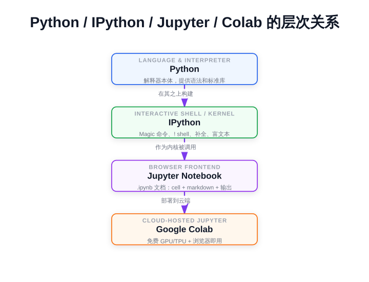
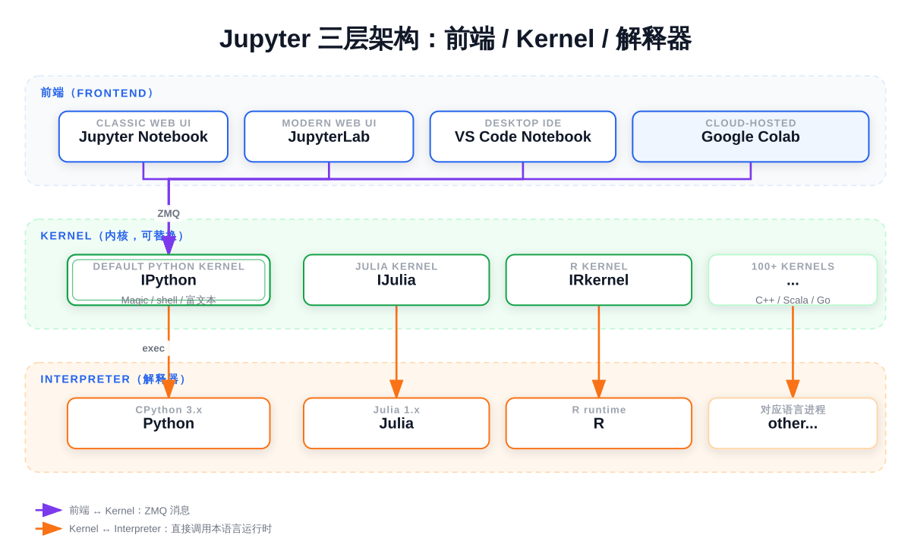
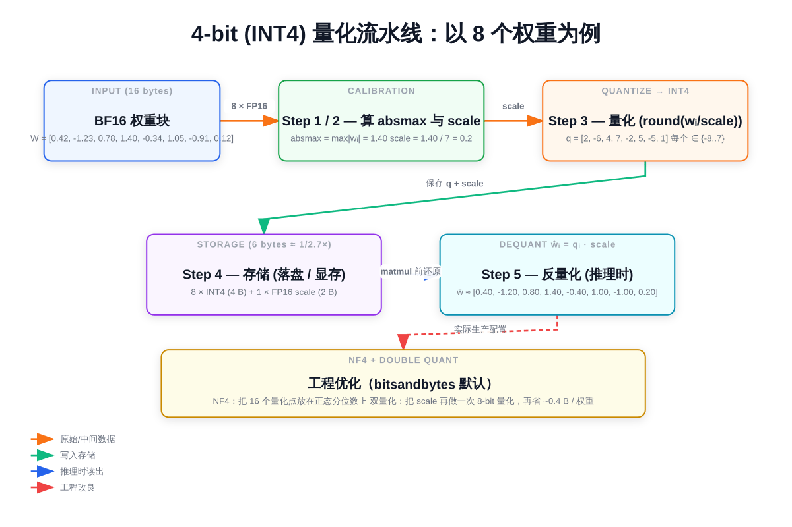

# 第一章：IPython、Jupyter、Google Colab 入门

学习大模型，几乎绕不开 Jupyter Notebook 和 Google Colab。本篇先把这三个常用概念讲清楚，再讨论 Colab 上的模型选型，最后用 Qwen3-8B 跑一个真实的大模型示例，建立直观感受。

> 想直接跑示例？点这里 [](https://colab.research.google.com/github/weiqiangnd/LearningLLM/blob/main/01.ipynb)。
>
> **硬件门槛**：Colab 免费版 T4（15 GB）✅。本章 ipynb 用 bitsandbytes 4-bit 量化加载 Qwen3-8B，权重约 5.5 GB，T4 完全够用。打开 ipynb 前请先在 Colab 菜单 **Runtime → Change runtime type** 里切到 GPU。

## 目录

- [一、三者的关系](#一三者的关系)
- [二、IPython（Interactive Python）](#二ipythoninteractive-python)
- [三、Jupyter Notebook](#三jupyter-notebook)
- [四、Google Colab](#四google-colab)
  - [在 VS Code 中使用 Colab](#在-vs-code-中使用-colab)
- [五、大模型选型：Colab 上跑什么模型最合适](#五大模型选型colab-上跑什么模型最合适)
  - [Colab 显存档位](#colab-显存档位)
  - [推荐模型（按效果由强到弱）](#推荐模型按效果由强到弱)
  - [关于 4-bit 量化](#关于-4-bit-量化)
  - [Colab Pro 用户的配卡策略](#colab-pro-用户的配卡策略)
- [六、实战示例：在 Colab 中加载并运行 Qwen3-8B](#六实战示例在-colab-中加载并运行-qwen3-8b)
- [七、本节小结](#七本节小结)

---

## 一、三者的关系

```
Python（编程语言/解释器）
    ↓ 在其之上构建
IPython（增强的交互式 shell + 内核）
    ↓ 作为内核被使用
Jupyter（基于浏览器的 Notebook 前端）
    ↓ 部署到云端
Google Colab（Google 托管的免费 Jupyter 服务）
```



可以这样理解：
- **IPython** 是引擎
- **Jupyter** 是给引擎装上的方向盘和仪表盘
- **Google Colab** 是把整辆车放到云端，让你随时上车开

---

## 二、IPython（Interactive Python）

### 是什么
IPython 是一个**增强版的 Python 交互式解释器**。比 Python 自带的 `>>>` REPL 强大得多，是 Jupyter Notebook 的底层内核（kernel）——你在 Notebook 里写的所有 Python 代码，本质上都由 IPython 执行。

### 核心增强特性

| 特性 | 示例 | 作用 |
|------|------|------|
| Magic 命令 | `%timeit sum(range(1000))` | 测量执行时间、运行脚本、加载扩展等 |
| Shell 命令 | `!pip install numpy` | `!` 前缀直接执行系统命令 |
| Tab 自动补全 | `np.ar<TAB>` | 弹出 `array`、`arange` 等候选 |
| 帮助系统 | `len?` / `np.array??` | `?` 看文档，`??` 看源码 |
| 历史输入输出 | `Out[1]`、`_` | 可引用之前的执行结果 |
| 富文本输出 | `display(Markdown(...))` | 渲染 HTML、图片、Markdown、LaTeX |

### Magic 命令的两种形式
- `%` 行魔法：只作用于当前行，例如 `%time func()`
- `%%` 单元格魔法：作用于整个单元格，必须写在第一行，例如 `%%capture`

---

## 三、Jupyter Notebook

### 是什么
Jupyter 是一个**基于浏览器的交互式计算环境**，把代码、文本、图表、公式融合到一个 `.ipynb` 文档中。它的命名 "Ju-pyt-er" 暗指 Julia + Python + R 三种语言。

### 架构

```
┌─────────────────────────────┐
│  前端（浏览器界面）          │
│  - Jupyter Notebook         │
│  - JupyterLab               │
│  - VS Code Notebook         │
│  - Google Colab             │
└──────────────┬──────────────┘
               │ ZMQ 协议通信
┌──────────────▼──────────────┐
│  Kernel（内核，可替换）      │
│  - IPython（Python，默认）   │
│  - IJulia / IRkernel ...    │
└──────────────┬──────────────┘
               │
┌──────────────▼──────────────┐
│  解释器（Python / Julia ...）│
└─────────────────────────────┘
```



**Jupyter 是壳，IPython 是其中最常用的内核**。Jupyter 项目本身是 2014 年从 IPython 拆分出来的。

### Notebook 的结构
- **Cell（单元格）**：基本编辑单位，分为
  - **Code Cell**：写并执行代码
  - **Markdown Cell**：写文档
  - **Raw Cell**：原始文本（不执行也不渲染）
- 每个 cell 用 `Shift + Enter` 执行

### 常用快捷键

| 快捷键 | 作用 |
|--------|------|
| `Shift + Enter` | 运行当前 cell 并跳到下一格 |
| `Ctrl + Enter` | 运行当前 cell，停留在原处 |
| `Ctrl + M B` | 在下方新建 cell |
| `Ctrl + M D` | 删除当前 cell |
| `Ctrl + M M` | 切换为 Markdown cell |
| `Ctrl + M Y` | 切换为 Code cell |

---

## 四、Google Colab

### 是什么
Google Colab（Colaboratory）是 **Google 提供的免费云端 Jupyter Notebook 服务**，浏览器打开即用，无需任何本地配置，并且**免费提供 GPU/TPU**——这是学习大模型的关键。

### 核心优势

| 特性 | 说明 |
|------|------|
| 零配置 | 浏览器打开即用，无需安装 Python |
| 免费 GPU/TPU | 免费版含 T4 GPU，Pro/Pro+ 提供 A100、L4 等 |
| 云端存储 | Notebook 自动保存到 Google Drive |
| 协作共享 | 像 Google Docs 一样可多人协同 |
| 预装环境 | NumPy、PyTorch、TensorFlow、transformers 等已装好 |

### 局限

| 限制 | 说明 |
|------|------|
| 会话时长 | 免费版最长约 12 小时，闲置 ~90 分钟会断开 |
| 资源不保证 | 高峰期可能拿不到 GPU |
| 临时文件易失 | `/content/` 下的文件在会话结束后清空 |
| 不适合长任务 | 训练大模型建议升级 Pro+ 或用其他云平台 |

### 基本使用步骤

1. 访问 https://colab.research.google.com 并登录
2. `文件 → 新建笔记本`
3. `代码执行程序 → 更改运行时类型 → 硬件加速器 → GPU` 启用 GPU
4. 在 cell 中写 Python 代码，`Shift + Enter` 执行
5. 用 `!pip install xxx` 安装额外的库
6. 用 `from google.colab import drive; drive.mount('/content/drive')` 挂载 Google Drive

### 在 VS Code 中使用 Colab

浏览器版的 Colab 编辑体验一般（无智能补全、无 Git 集成、调试工具弱）。Google 官方提供了 **Google Colab 扩展**，可以让你在 VS Code 里写代码、用 Colab 的 GPU 跑——本地编辑器 + 云端算力，体验最佳。

#### 为什么用 VS Code 接 Colab

| 优势 | 说明 |
|------|------|
| **更好的编辑器** | Pylance 智能补全、类型提示、错误高亮 |
| **Git 原生集成** | 直接用 VS Code 的 Source Control 面板提交 |
| **更强的调试** | 设断点、查看变量、调用栈，比浏览器友好 |
| **本地文件访问** | 直接编辑、保存到本地工作区 |
| **多文件管理** | 同时打开 `.py`、`.ipynb`、`.md`，与本项目结构一致 |
| **AI 辅助** | 可结合 Copilot、Claude Code 等 |

#### 安装与配置（推荐方式）

1. **安装扩展**
   - VS Code 扩展市场搜索 **"Google Colab"**（发布者：Google）
   - 点击安装

2. **登录 Google 账号**
   - 安装后左侧栏出现 Colab 图标
   - 点击 → 选择 Sign in → 浏览器跳转完成 OAuth 授权

3. **打开 / 新建 Notebook**
   - `Ctrl/Cmd + Shift + P` → 输入 `Colab: New Notebook`
   - 或直接打开本地 `.ipynb` 文件

4. **连接 Colab 运行时**
   - Notebook 右上角点击 **"Connect"**
   - 选择运行时类型：CPU / T4 / L4 / A100 / H100 / TPU
   - 等待几十秒，状态变为绿色即连接成功

5. **运行代码**
   - 完全和浏览器版 Colab 一样，`Shift + Enter` 执行 cell
   - GPU、显存、文件系统都来自云端 Colab

#### 与浏览器版的差异（容易踩坑）

| 项目 | 浏览器 Colab | VS Code 插件 |
|------|--------------|--------------|
| **`%%capture` 位置** | 容忍前面有空行 | **必须严格在第一行**，否则 `Line magic function not found` |
| **挂载 Drive** | 弹窗授权 | 同样弹窗，但可能需切回浏览器完成 |
| **`%matplotlib inline`** | 默认开启 | 有时需手动加上 |
| **进度条显示** | tqdm 正常 | tqdm 偶尔渲染异常，可用 `tqdm.notebook` |
| **会话保持** | 关闭浏览器即断开 | VS Code 关闭也会断开，行为一致 |
| **快捷键** | Colab 自定义 | 用的是 VS Code Notebook 快捷键（如 `Esc`、`Enter` 切换模式） |

---

## 五、大模型选型：Colab 上跑什么模型最合适

学习大模型时模型选择的关键约束是**显存**——免费 Colab 的 T4 GPU 只有 15GB 显存。下面按显存档位推荐几个表现优秀的开源模型，并说明如何用量化技术在小显存上跑大模型。

### Colab 显存档位

| 运行时 | GPU | 显存 | 备注 |
|--------|-----|------|------|
| 免费版 | T4 | 15 GB | 默认，最常用 |
| Pay-as-you-go | L4 | 24 GB | 更好的性价比 |
| Pro | A100 | 40 GB | 可跑 14B–34B 模型 |
| Pro+ | A100 80GB | 80 GB | 可跑 70B 量化版 |

**显存估算经验法则**：
- BF16/FP16 加载，显存 ≈ 参数量 × 2 GB（7B 模型 ≈ 14 GB）
- 4-bit 量化加载，显存 ≈ 参数量 × 0.7 GB（7B 模型 ≈ 5 GB）

### 推荐模型（按效果由强到弱）

#### 首选：Qwen3-8B（阿里）

```python
model_id = "Qwen/Qwen3-8B"
```

- **优势**：中英文一流、指令遵循好、原生 32k 上下文（YaRN 可扩 128k）、独有「思考/非思考模式」切换
- **显存**：BF16 约 16GB（T4 装不下），4-bit 量化约 5.5GB（推荐）
- **依赖**：需要 `transformers >= 4.51.0`
- **命名变化**：Qwen3 系列把 base 与 chat 合并到同一仓库，**仓库名不再带 `-Instruct` 后缀**——`Qwen/Qwen3-8B` 即 chat 模型，`Qwen/Qwen3-8B-Base` 才是基座
- **思考模式（重要）**：Qwen3 通过 `apply_chat_template(..., enable_thinking=True/False)` 切换
  - `enable_thinking=True`（默认）：先输出 `<think>...</think>` 推理过程，再给最终回答；适合数学、代码、逻辑题
  - `enable_thinking=False`：直接给答案，速度快；适合普通对话
  - **思考模式下不能用贪心解码**（`do_sample=False`），会出现重复退化；必须采样
- **官方推荐采样参数**：

  | 模式 | temperature | top_p | top_k | min_p |
  |------|-------------|-------|-------|-------|
  | 思考 | 0.6 | 0.95 | 20 | 0 |
  | 非思考 | 0.7 | 0.8 | 20 | 0 |

#### 备选：Qwen2.5-7B-Instruct（阿里，老一代）

```python
model_id = "Qwen/Qwen2.5-7B-Instruct"
```

- 没有思考模式、API 更简单，老教程兼容性最好
- 4-bit 量化约 5GB

#### Llama-3.1-8B-Instruct（Meta）

```python
model_id = "meta-llama/Llama-3.1-8B-Instruct"
```

- **优势**：开源生态最完善、教程最多、几乎所有论文/项目的基线
- **显存**：BF16 约 16GB（T4 略紧），4-bit 约 6GB
- **注意**：需要在 Hugging Face 申请访问（填表后几分钟通过）

#### Gemma-2-9B-it（Google）

```python
model_id = "google/gemma-2-9b-it"
```

- **优势**：Google 出品、9B 比 7B 多一档、综合质量好
- **显存**：BF16 约 18GB（T4 装不下，需量化），4-bit 约 7GB

#### 替补：Phi-3.5-mini-instruct（微软）

```python
model_id = "microsoft/Phi-3.5-mini-instruct"
```

- 3.8B 参数但综合表现接近 7B 模型
- **显存**：BF16 约 8GB，T4 直接全精度跑无压力
- **适合谁**：想快速迭代、不想折腾量化的入门阶段

#### 进阶（需 Colab Pro / A100）

| 模型 | 参数量 | 备注 |
|------|--------|------|
| `Qwen/Qwen3-14B` | 14B | 思考模式下推理更强 |
| `Qwen/Qwen3-32B` | 32B | 4-bit 量化后 ≈ 20GB，A100 可跑 |
| `Qwen/Qwen3-30B-A3B` | 30B（MoE，激活 3B） | 速度接近 3B，效果接近 30B |

### 综合对比

8B 量级 chat 模型在常见基准的近似排名：

| 模型 | MMLU | 中文能力 | 指令遵循 | 综合 |
|------|------|----------|----------|------|
| Qwen3-8B（思考模式） | 76 | ★★★★★ | ★★★★★ | ★★★★★ |
| Qwen3-8B（非思考） | 74 | ★★★★★ | ★★★★★ | ★★★★ |
| Qwen2.5-7B-Instruct | 74 | ★★★★★ | ★★★★★ | ★★★★ |
| Llama-3.1-8B-Instruct | 73 | ★★★ | ★★★★★ | ★★★★ |
| Gemma-2-9B-it | 71 | ★★★ | ★★★★ | ★★★★ |
| Phi-3.5-mini-instruct | 69 | ★★★ | ★★★★ | ★★★ |

### 关于 4-bit 量化

#### 是什么：用更少的位数表示同一个数

模型权重训练时用的是 16-bit 浮点数（BF16/FP16），每个数占 2 字节。**量化（Quantization）** 就是把这些浮点数用更少的位数（如 8-bit、4-bit 整数）来近似表示，从而把模型体积压小、显存占用降下来。

| 精度 | 每个权重占用 | 8B 模型权重大小 |
|------|--------------|-----------------|
| FP32 | 4 字节 | 32 GB |
| BF16 / FP16 | 2 字节 | 16 GB |
| INT8 | 1 字节 | 8 GB |
| INT4 | 0.5 字节 | 4 GB |

#### 原理：把连续浮点值映射到离散整数

朴素 INT4 量化的做法：

1. 把权重张量按"块"（如每 64 或 128 个数为一组）切开
2. 在每块里找出最大绝对值 `absmax`
3. 计算缩放系数 `scale = absmax / 7`（4-bit 有符号整数范围是 −8~7）
4. 每个浮点数除以 `scale`、四舍五入成整数，存为 INT4
5. 推理时再乘回 `scale`，还原成近似的浮点值参与矩阵乘法

这样每个权重从 2 字节压到 0.5 字节，体积降至 1/4。代价是引入了"舍入误差"——不过大模型权重整体冗余度高，少量误差对最终输出的影响很小。



#### 一个手算示例：8 个权重走一遍 INT4 量化

为了让上面 5 步落到具体数字上，下面拿一个块大小 = 8 的简化情形手动算一遍。先解释两个会用到的概念：

- **absmax**：absolute maximum，张量中绝对值最大的那个数（不看正负号，只看大小）。
- **INT4 有符号整数范围**：4 位二进制能表示 $2^4 = 16$ 个整数；按补码编码成有符号整数就是 $\{{-8}, {-7}, \dots, 6, 7\}$ ，共 16 个值。

假设这一块里有 8 个 BF16 权重：

$$
W = [0.42, {-1.23}, 0.78, 1.40, {-0.34}, 1.05, {-0.91}, 0.12]
$$

**Step 1：找 absmax**

$$
\text{absmax} = \max_i |w_i| = 1.40
$$

**Step 2：算 scale（缩放系数）**

把 absmax 映射到 INT4 正侧最大值 7，让最大权重正好"吃满"量化范围：

$$
\text{scale} = \frac{\text{absmax}}{7} = \frac{1.40}{7} = 0.2
$$

**Step 3：量化（每个 $w_i$ 除以 scale，四舍五入到最近的 INT4 整数）**

| 原值 $w_i$ | $w_i / \text{scale}$ | 取整后 $q_i$ （INT4） |
|------------|----------------------|----------------------|
| 0.42 | 2.10 | 2 |
| −1.23 | −6.15 | −6 |
| 0.78 | 3.90 | 4 |
| 1.40 | 7.00 | 7 |
| −0.34 | −1.70 | −2 |
| 1.05 | 5.25 | 5 |
| −0.91 | −4.55 | −5 |
| 0.12 | 0.60 | 1 |

存储时只需要保留这 8 个 INT4 整数和 1 个 scale。

**Step 4：反量化（推理时把 INT4 还原成近似浮点 $\hat w_i = q_i \cdot \text{scale}$ ）**

| $q_i$ | 反量化值 $\hat w_i$ | 与原值误差 $\hat w_i - w_i$ |
|-------|---------------------|------------------------------|
| 2 | 0.40 | −0.02 |
| −6 | −1.20 | +0.03 |
| 4 | 0.80 | +0.02 |
| 7 | 1.40 | 0.00 |
| −2 | −0.40 | −0.06 |
| 5 | 1.00 | −0.05 |
| −5 | −1.00 | −0.09 |
| 1 | 0.20 | +0.08 |

**两个直观结论**：

1. **存储开销**。本来 8 个 BF16 权重需要 $8 \times 2 = 16$ 字节；量化后是 $8 \times 0.5 = 4$ 字节（INT4 权重）+ $2$ 字节（一个 FP16 scale）= $6$ 字节，约 1/2.7。这里块大小只有 8，scale 占比偏高；真实 NF4 默认块大小是 64，scale 摊到每个权重只多 $2/64 \approx 0.031$ 字节，整体接近理论上限 1/4。
2. **误差量级**。任何一个权重的反量化误差都不超过 $\text{scale}/2 = 0.1$ （这是四舍五入的最坏情形）。单点相对误差最大约 $0.09 / 0.91 \approx 10\%$ 看着不小，但矩阵乘法是大量元素求和——独立的小误差有正有负、互相抵消，最终输出的偏差通常远小于单点误差。这就是 4-bit 量化"看似激进却仍可用"的根本原因。

#### 为什么是 4-bit：精度和体积的甜点

| 位数 | 显存压缩比 | 质量损失（典型 7-8B 模型） | 评价 |
|------|------------|----------------------------|------|
| 8-bit | 1/2 | < 0.5%（近乎无损） | 显存优势不够大 |
| **4-bit** | **1/4** | **1–2%** | **甜点：体积大幅缩小、损失可接受** |
| 3-bit | 5/8 | 5–10% | 损失明显，仅特定校准方案勉强可用 |
| 2-bit | 3/4 | > 15% | 损失太大，研究阶段 |

4-bit 是社区公认的"够用底线"——再低，损失就开始显著影响生成质量。实践中，**bitsandbytes** 提供的 4-bit 实现还做了两个工程优化：

- **NF4（NormalFloat4）**：神经网络权重大致服从正态分布，朴素 INT4 用等距量化点不是最优。NF4 把 16 个量化点放在正态分布的等概率分位数上，让"权重密集的区间"分得更细，相同位数下损失更小。
- **双量化（double quantization）**：每个块都有自己的 `scale` 系数，而 `scale` 本身也是浮点数。把这些 `scale` 再做一次 8-bit 量化，每个权重再省 ~0.4 字节。8B 模型大概再省 0.5 GB。

> 还有 **GPTQ / AWQ** 等"校准量化"方案——量化前用一小批样本数据校准每层的量化参数，质量损失通常比 NF4 再低 0.5%。本教程用 NF4 是因为它"开箱即用"、不需要准备校准数据。

#### 反量化会拖慢推理速度么

这是看完上面"压缩—反量化"流程后最自然的疑问：每次矩阵乘法（matmul）之前都要把权重还原成 BF16，

$$
\hat w_i = q_i \cdot \text{scale}
$$

是不是凭空多了一道工序？直觉上"会变慢"，但**在大模型单 batch 推理（也就是日常 chat 场景）下，4-bit 通常反而比 BF16 更快**。要解释清楚需要先引入几个概念：

- **HBM（High Bandwidth Memory）**：GPU 上紧贴芯片的高带宽显存，模型权重和 KV cache 都存在这里。每次 matmul 都要先把权重从 HBM 搬到 SM 内的寄存器/SRAM 才能参与计算。
- **memory-bound（内存带宽瓶颈）**：瓶颈在"从 HBM 把数据搬到计算单元"上——计算单元大多时间空转等数据。
- **compute-bound（算力瓶颈）**：瓶颈在浮点运算量上——数据已经在手边，但 matmul 还没算完。

LLM 推理天然分两个阶段，瓶颈不一样：

| 阶段 | 做什么 | 主要瓶颈 |
|------|--------|----------|
| **prefill** | 把整段 prompt 一次性走过模型，得到第一个新 token 的 logits | **compute-bound**（一份权重被 prompt 里很多 token 复用，FLOPs 摊得多） |
| **decode** | 每生成一个新 token 都要走一次完整前向 | **memory-bound**（一份权重读进来只服务一个 token） |

##### 用 T4 + Qwen3-8B 算一笔账

T4 的两项关键指标：HBM 带宽约 320 GB/s，FP16 Tensor Core 算力约 65 TFLOPS。每生成一个 token，所需资源的耗时下限：

| 资源 | 公式 | 耗时下限 |
|------|------|----------|
| 从 HBM 搬一遍 4-bit 权重（≈ 5.5 GB） | $5.5\text{ GB} / 320\text{ GB/s}$ | **~17 ms** |
| 单 token 浮点矩阵乘运算量 | $2 \times 8\text{B} / (65 \times 10^{12}\text{ FLOPS})$ | ~0.25 ms |

> 这里的 $2 \times \text{参数量}$ 是 LLM 单 token 前向的常用估算：每个权重参与一次乘法 + 一次加法。

带宽下限是算力下限的将近 **70 倍**——计算单元绝大多数时间在"等数据"，反量化那一点额外乘法被这个等待时间完全淹没。

同样 8B 模型如果用 BF16（在 T4 上其实装不下，这里只做对照），权重 16 GB，带宽下限 $16/320 \approx 50$ ms/token——是 4-bit 的近 3 倍。所以 4-bit decode 不仅没变慢，反而更快。

##### 什么时候 4-bit 反而会变慢

- **prefill 长 prompt** / **训练** / **大 batch 推理**：这些是 compute-bound，每份权重被复用很多次，反量化那一道额外算力开销暴露出来，4-bit 可能比 BF16 略慢。
- T4 这类老卡更明显：没有原生 INT4 Tensor Core，bitsandbytes 的 dequant 内核也没和 matmul 做深度融合（专用方案如 **AWQ + Marlin**、**GPTQ + ExLlamaV2** 把 dequant 融合进 matmul kernel，prefill 也能追上甚至超过 BF16）。

##### 在本教程的场景下

T4 只有 15 GB 显存：

- BF16 加载 8B 权重需要 ~16 GB —— **装不下**，根本无从对比
- 4-bit 加载 8B 权重需要 ~5.5 GB —— 能跑，且 chat decode 单 token 速度相当流畅

所以选 4-bit 不是"拿速度换显存"——是"不量化连跑都跑不起来；而量化后单 token 速度还相当不错"。先有可用、再谈速度，是这一阶段刻意的工程取舍。

#### 本教程的选择

`bitsandbytes` 库与 transformers 无缝集成，下文示例采用 **4-bit NF4 + 双量化** 加载 Qwen3-8B，权重从 16 GB 压到约 5.5 GB，让免费 T4 GPU（15 GB 显存）也能流畅运行。

### Colab Pro 用户的配卡策略

Colab Pro 提供 ~100 计算单元/月，可访问 L4 / A100 / v5e / v6e，并支持后台执行与更长会话。但**不同 GPU 的算力消耗差异巨大**，需要按场景规划。

#### 算力消耗速率

| GPU | 计算单元/小时 | 100 单元能用多久 |
|-----|---------------|------------------|
| T4 | ~2 | ~50 小时 |
| L4 | ~5 | ~20 小时 |
| A100 | ~12 | ~8 小时 |
| v2-8 TPU | ~2 | ~50 小时 |

A100 烧得快、T4 最省——8 小时 vs 50 小时差 6 倍。学习场景最忌讳被算力卡住中断，所以要分场景配卡。

#### 分场景推荐

| 场景 | 推荐 GPU | 理由 |
|------|---------|------|
| 跑教程、调通代码、Debug | **T4** | 消耗最低（~2 单元/小时），省单元给后面 |
| 日常学习主力（推理、对比） | **L4** | 24GB 显存够 7B BF16 + 13B 4-bit，速度比 T4 快 50% |
| 微调（LoRA）、跑 14B+ 模型 | **A100** | HBM2e 带宽 1.5TB/s，跑 32B 4-bit 也行 |
| 数据处理、画图、写文档 | **CPU** | 不消耗计算单元 |

#### 学习路径（按阶段递进）

```
阶段 1：基础概念
    → T4 + Qwen3-8B (4-bit NF4)
    → 跑教程、玩 tokenizer、采样策略、思考模式开关，省单元

阶段 2：模型对比、Prompt 工程
    → L4 + Qwen3-8B (FP16) / Qwen3-14B (4-bit)
    → 24GB 显存够 8B 全精度，或单个 14B 量化跑长链思考

阶段 3：微调、深入原理
    → A100 + Qwen3-14B (BF16) / Qwen3-32B (4-bit) / Qwen3-30B-A3B (MoE 4-bit)
    → 集中 1–2 天用，跑完立即释放
```

> 注：T4 是 Turing 架构，**不原生支持 BF16**——在 T4 上加载半精度模型时要用 `torch_dtype=torch.float16`，到 L4/A100（Ampere 及以上）才能用 BF16。

---

## 六、实战示例：在 Colab 中加载并运行 Qwen3-8B

下面这个例子在 Colab 中加载阿里的 **Qwen3-8B**（8B 参数、中英文一流、带「思考模式」），通过 4-bit 量化让免费 T4 GPU（15GB 显存）即可流畅运行。

### 准备工作

打开 Colab，确保已切换到 GPU 运行时（菜单 → 代码执行程序 → 更改运行时类型 → GPU）。

### 完整代码（含详细注释）

```python
# ============================================================
# Cell 0: 检查 GPU 是否可用
# ============================================================
# 大模型示例最常见的失败原因不是代码错，而是没切到 GPU 运行时。
# 先一眼确认 GPU 在线，再继续后面的步骤，避免白白下载几 GB 权重。
import torch

print("CUDA available:", torch.cuda.is_available())
if torch.cuda.is_available():
    print("Device:", torch.cuda.get_device_name(0))
    # 显存以 GB 为单位打印，T4 应显示约 14.7 GB
    total_mem = torch.cuda.get_device_properties(0).total_memory / 1024**3
    print(f"Total VRAM: {total_mem:.1f} GB")
else:
    # 切换方式：菜单 → 代码执行程序 → 更改运行时类型 → 硬件加速器 → T4 GPU
    print("⚠️ 当前没有 GPU，请切到 GPU 运行时再继续")


%%capture
# ============================================================
# Cell 1: 安装/升级依赖库
# ============================================================
# 重要：%%capture 是单元格魔法命令，必须是 cell 的第一行（前面不能有任何内容，包括注释）
# 否则 Jupyter / VS Code 会将其当作 line magic 解析，报错：
#   UsageError: Line magic function `%%capture` not found.
# 它的作用：捕获整个 cell 的输出，让 pip install 几十行的安装日志不显示在屏幕上
# ! 前缀让 IPython 把这一行交给系统 shell 执行（而非 Python 解释器）
# -q 表示 quiet 模式，进一步减少 pip 的输出噪音
# -U 表示 upgrade，如果已装则升级到最新版
# transformers>=4.51:  Qwen3 系列要求至少 4.51，否则 chat template 不识别 enable_thinking
# accelerate:           分布式/混合精度加速，加载大模型时几乎是必需依赖
# bitsandbytes:         提供 8-bit / 4-bit 量化能力，让大模型在小显存上跑起来
!pip install -q -U "transformers>=4.51" accelerate bitsandbytes


# ============================================================
# Cell 2: 加载模型与分词器（采用 4-bit 量化）
# ============================================================
# AutoModelForCausalLM: "自动选择 CausalLM 类"的工厂类
#   CausalLM = Causal Language Model，因果语言模型，即 GPT 这类自回归生成模型
# AutoTokenizer:        根据模型 ID 自动选择对应的分词器实现
# BitsAndBytesConfig:   配置 bitsandbytes 的量化参数
from transformers import AutoModelForCausalLM, AutoTokenizer, BitsAndBytesConfig
import torch

# Hugging Face Hub 模型 ID，格式 "组织名/模型名"
# Qwen3 系列把 base 与 chat 合并到同一仓库，仓库名不再带 "-Instruct" 后缀：
#   "Qwen/Qwen3-8B"      → chat 模型（本教程使用）
#   "Qwen/Qwen3-8B-Base" → 基座，只做续写不按对话回答
model_id = "Qwen/Qwen3-8B"

# 4-bit 量化配置（原理与手算示例见「关于 4-bit 量化」一节）
quant_config = BitsAndBytesConfig(
    load_in_4bit=True,                       # 启用 4-bit 量化
    bnb_4bit_compute_dtype=torch.float16,    # 反量化后矩阵乘法的 dtype（T4 不原生支持 BF16；L4/A100 可改 torch.bfloat16）
    bnb_4bit_quant_type="nf4",               # 量化点采用 NF4（NormalFloat4）
    bnb_4bit_use_double_quant=True,          # 启用双量化，再把每块的 scale 也量化一次
)

# from_pretrained() 自动从 Hugging Face Hub 下载权重并缓存到 ~/.cache/huggingface/
# 下次加载同一模型不会重复下载
model = AutoModelForCausalLM.from_pretrained(
    model_id,
    device_map="auto",                # 让 accelerate 自动分配模型层；单卡时等价于全部放到 GPU
    quantization_config=quant_config, # 应用上面定义的 4-bit 量化配置
)

# 加载与模型配对的分词器：负责文本 ↔ token id 的双向转换
tokenizer = AutoTokenizer.from_pretrained(model_id)


# ============================================================
# Cell 3: 构造对话并让模型生成回答（非思考模式 / 普通对话）
# ============================================================
# Qwen3 chat 模型期望的输入是"对话格式"，每条消息有 role 和 content
# role 通常是 "system"（系统提示）/ "user"（用户）/ "assistant"（模型回答）
messages = [
    {"role": "system", "content": "你是一个乐于助人的 AI 助手，回答简洁明了。"},
    {"role": "user", "content": "用一句话解释什么是 Transformer 架构。"},
]

# apply_chat_template() 会按照模型训练时使用的对话模板格式化输入
# 不同模型的模板不同（Qwen / Llama / Phi 各自有自己的特殊 token）
# add_generation_prompt=True 在末尾追加"轮到 assistant 回答"的提示符
# enable_thinking=False 关闭"思考模式"——直接输出答案，不先打 <think>...</think> 推理过程
#   想要更强的逻辑/数学/代码能力时，把它改成 True，并提高 max_new_tokens 给足思考空间
# return_tensors="pt" 直接返回 PyTorch 张量（pt = PyTorch）
# return_dict=True 让返回类型固定为 BatchEncoding（含 input_ids、attention_mask）
#   注意：新版 transformers (≥4.45) 在某些情况下默认返回 BatchEncoding 而非 Tensor
#   若把 BatchEncoding 直接作为位置参数传给 generate()，会触发：
#     KeyError: 'shape' → AttributeError
#   所以推荐显式 return_dict=True + 用 **inputs 解包
inputs = tokenizer.apply_chat_template(
    messages,
    add_generation_prompt=True,
    enable_thinking=False,
    return_tensors="pt",
    return_dict=True,
).to(model.device)  # 把输入张量移到模型所在设备，与模型在同一设备才能计算

# Qwen 系列对话终止符是 <|im_end|>，与一般模型的 EOS 不同。
# 多数 transformers 版本里 tokenizer.eos_token_id 已经被 chat template 改写成 <|im_end|>，
# 但严格起见显式查一下 token id 更稳，避免某些版本下模型不停止：
im_end_id = tokenizer.convert_tokens_to_ids("<|im_end|>")

# generate() 是 transformers 的统一文本生成接口
# torch.no_grad() 表示推理过程不计算梯度，节省显存并加速
with torch.no_grad():
    outputs = model.generate(
        # **inputs 把字典解包为 input_ids=..., attention_mask=...
        # 显式传 attention_mask 还能避免 padding 干扰，比只传 input_ids 更稳
        **inputs,
        # max_new_tokens 限制最多生成多少个新 token（不含输入部分）
        # 非思考模式 200 足够；思考模式因为要先输出推理过程，建议 ≥ 2048
        max_new_tokens=200,
        # Qwen3 官方推荐：非思考模式用 temperature=0.7、top_p=0.8、top_k=20
        # ⚠️ 思考模式（enable_thinking=True）下不能用贪心解码（do_sample=False），
        #    会出现重复退化；必须 do_sample=True 配 temperature=0.6、top_p=0.95
        do_sample=True,
        temperature=0.7,
        top_p=0.8,
        top_k=20,
        # eos_token_id 标记生成结束的 token，遇到它就停止
        # 同时传 tokenizer.eos_token_id 和 <|im_end|> 双保险
        eos_token_id=[tokenizer.eos_token_id, im_end_id],
    )

# outputs 形状是 [batch_size, sequence_length]，包含输入 + 生成的全部 token
# 我们只想看新生成的部分，所以从输入长度处切片
input_length = inputs["input_ids"].shape[-1]
generated_tokens = outputs[0][input_length:]

# decode() 把 token id 列表还原成可读字符串
# skip_special_tokens=True 去掉 <|im_end|> 等特殊标记
response = tokenizer.decode(generated_tokens, skip_special_tokens=True)

print(response)
```

### 预期输出

模型会输出类似：

```
Transformer 是一种基于自注意力机制（Self-Attention）的神经网络架构，
通过并行处理序列中所有位置之间的依赖关系，实现了对长距离上下文的高效建模。
```

如果把 `enable_thinking=False` 改成 `True`、`max_new_tokens` 调到 2048，输出会先包含一段 `<think>...</think>` 推理过程，再给出最终答案——这是 Qwen3 区别于 Qwen2.5 的核心特性。

### 关键概念回顾

通过这个例子，串起了大模型应用最核心的几个概念：

| 概念 | 在代码中的位置 |
|------|----------------|
| **模型权重（weights）** | `from_pretrained()` 下载并加载 |
| **量化（quantization）** | `BitsAndBytesConfig(load_in_4bit=True)` 4-bit 压缩节省显存 |
| **分词器（tokenizer）** | 把人类语言 ↔ token id 互转 |
| **对话模板（chat template）** | `apply_chat_template()` 按模型训练时格式构造输入 |
| **思考模式（thinking）** | `enable_thinking=True/False` Qwen3 独有的推理开关 |
| **设备分配（device）** | `device_map="auto"` + 输入张量 `.to(model.device)` |
| **生成策略（decoding）** | `do_sample=True` 采样（思考模式必须）/ `False` 贪心（仅非思考可用） |
| **终止符（eos）** | `<\|im_end\|>` 是 Qwen 对话终止符，建议显式传给 `eos_token_id` |
| **生成长度** | `max_new_tokens` 控制输出长度 |

---

## 七、本节小结

- **IPython** 提供了 Magic 命令、shell 集成、富文本显示等增强能力
- **Jupyter** 是基于浏览器的 Notebook 前端，IPython 是它默认的 Python 内核
- **Google Colab** 是云端版 Jupyter，关键卖点是免费 GPU，非常适合大模型学习与实验
- **模型选型** 的核心约束是显存：T4 (15GB) 上推荐 Qwen3-8B + 4-bit 量化
- **量化（bitsandbytes 4-bit）** 让 7B–9B 模型在免费 T4 也能流畅运行，质量损失通常 < 2%
- **Qwen3 的「思考模式」** 是这一代的核心特性：`enable_thinking=True` 时先输出推理过程再给答案，并且必须用采样而非贪心解码
- 加载并运行一个开源大模型只需要几十行代码：`from_pretrained` 加载 → `apply_chat_template` 构造输入 → `generate` 生成

下一章我们会把镜头拉近 `generate()` 内部——讲清楚 **logits → softmax → temperature → top-k / top-p → 采样** 这条流水线，以及 `do_sample` / `temperature` / `top_p` / `top_k` / `repetition_penalty` 各自数学上做了什么、应该怎么选。
