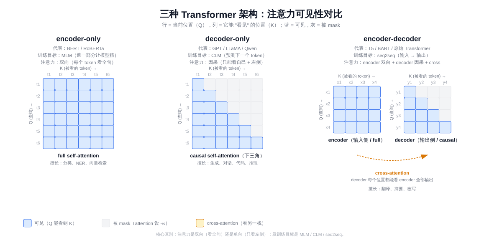
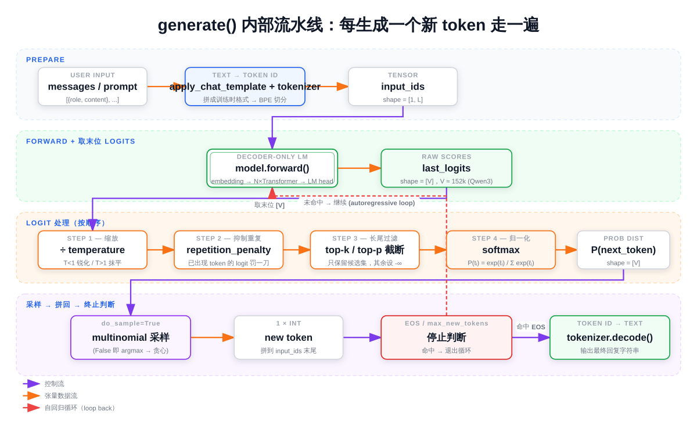

# 第二章：生成参数与采样策略

第一章我们让 Qwen3-8B 跑通了一次对话——加载模型、构造 messages、调用 `generate()`、decode 输出。但 `generate()` 里那一长串参数（`temperature` / `top_p` / `top_k` / `do_sample` / `repetition_penalty` ……）当时只是按 Qwen3 官方推荐值贴了一组，没解释。

这一章把视角拉近：**模型每生成一个 token 内部到底发生了什么、每个旋钮作用在流水线的哪一步、不同取值会把输出推向什么样**。读完本章你应当能：

- 说清自回归生成（autoregressive generation）的循环结构，以及 logits、softmax、采样在其中的位置
- 知道 `temperature` / `top_p` / `top_k` / `repetition_penalty` 各自数学上做了什么
- 根据任务（事实问答 / 数学推理 / 创意写作）选合适的参数组合
- 理解"为什么 Qwen3 思考模式不能用贪心解码"这类工程经验背后的原因
- 能调出可复现的生成结果

> 想直接跑示例？点这里 [](https://colab.research.google.com/github/weiqiangnd/LearningLLM/blob/main/02.ipynb)。
>
> **硬件门槛**：Colab 免费版 T4（15 GB）✅。本章沿用第一章的 4-bit 量化 Qwen3-8B，T4 即可跑通全部 6 组对比实验。打开 ipynb 前请先在 Colab 菜单 **Runtime → Change runtime type** 里切到 GPU。

## 目录

- [一、文本生成的工作流（Mental Model）](#一文本生成的工作流mental-model)
  - [1.1 总览：从模型加载到下一个 token](#11-总览从模型加载到下一个-token)
  - [1.2 logits、softmax、temperature 的数学](#12-logitssoftmaxtemperature-的数学)
- [二、对话模板与特殊 token](#二对话模板与特殊-token)
  - [2.1 messages 与 chat template](#21-messages-与-chat-template)
  - [2.2 特殊 token 与 EOS](#22-特殊-token-与-eos)
- [三、采样策略：从分布里挑一个 token](#三采样策略从分布里挑一个-token)
  - [3.1 贪心解码（greedy）](#31-贪心解码greedy)
  - [3.2 多项式采样（multinomial sampling）](#32-多项式采样multinomial-sampling)
  - [3.3 Top-k 采样](#33-top-k-采样)
  - [3.4 Top-p（nucleus）采样](#34-top-pnucleus-采样)
  - [3.5 三者的组合顺序](#35-三者的组合顺序)
- [四、`generate()` 参数全景](#四generate-参数全景)
- [五、实战：参数对比实验](#五实战参数对比实验)
  - [5.0 准备工作：GPU 自检 + 装依赖 + 加载模型 + chat() 辅助函数](#50-准备工作gpu-自检--装依赖--加载模型--chat-辅助函数)
  - [5.1 实验 1：贪心 vs 采样](#51-实验-1贪心-vs-采样)
  - [5.2 实验 2：temperature 高低对比](#52-实验-2temperature-高低对比)
  - [5.3 实验 3：top\_p 严格 vs 宽松](#53-实验-3top_p-严格-vs-宽松)
  - [5.4 实验 4：repetition\_penalty 抑制重复](#54-实验-4repetition_penalty-抑制重复)
  - [5.5 实验 5：思考模式 vs 非思考模式](#55-实验-5思考模式-vs-非思考模式)
  - [5.6 实验 6：复现性与随机种子](#56-实验-6复现性与随机种子)
- [六、关键概念回顾](#六关键概念回顾)
- [七、本节小结](#七本节小结)

---

## 一、文本生成的工作流（Mental Model）

要讲清各个生成参数，先得搞清楚**模型每生成一个新 token 内部到底做了什么**。Qwen3、Llama、GPT 这类 **decoder-only** 模型走的是**自回归生成（autoregressive generation）**：一次只产出一个 token，把它拼回输入末尾，再走一次完整前向，循环直到遇到终止条件。

「decoder-only」是 Transformer 架构的三种变体之一。原始 Transformer（Vaswani 2017）由 encoder（编码器）+ decoder（解码器）两栈组成，后来人们发现两栈可以独立使用，由此衍生出三种主流架构。它们的核心区别在于**注意力是双向还是单向**，以及**训练目标是什么**：

| 架构 | 注意力 | 训练目标 | 代表模型 | 擅长 | 短板 |
|------|--------|----------|----------|------|------|
| **encoder-only** | 双向（每个 token 都能看全句） | MLM（遮住一部分 token 让模型猜） | BERT、RoBERTa、DeBERTa | 分类、命名实体识别（NER）、向量检索等"理解类"任务 | 不能直接生成长文本 |
| **decoder-only** | 因果（每个 token 只能看自己和左侧） | CLM（根据前文预测下一个 token） | GPT 系列、LLaMA、Qwen、Mistral、DeepSeek | 生成、对话、代码、推理；几乎所有任务都能改写成"读 prompt → 续写" | 理论上对纯理解任务弱于双向；实践中靠 scale 已追平甚至反超 |
| **encoder-decoder** | encoder 双向 + decoder 因果 + cross-attention | seq2seq / span corruption（遮一整段让模型还原） | 原始 Transformer、T5、BART、mT5 | 输入输出形式差异大的任务（翻译、摘要、改写） | 参数量约为同尺寸 decoder-only 的两倍，训练 / 推理流水线更复杂 |

> 表格里 MLM = Masked Language Modeling，CLM = Causal Language Modeling。cross-attention 是 decoder 看 encoder 输出的注意力机制，留到讲 attention 时再展开。



decoder-only 的核心特征是**因果（causal / 单向）注意力**——每个位置只能看见自己和左侧已出现的 token，看不见右边还没生成的 token。这种"只能往前看"的限制和"逐 token 生成"的任务天然契合：训练时让模型对每个位置都预测下一个 token，推理时按同样的方式一次产出一个 token 拼回去——也就是上面说的「自回归」。

为什么 2020 年以后的"主流大模型"几乎都是 decoder-only？

- **任务统一**：CLM 一个 loss 就能覆盖绝大多数 NLP 任务（chat、写作、代码、QA、翻译都能写成"输入 prompt → 续写"）；encoder-decoder 要为不同任务设计不同的输入输出格式
- **参数效率**：同尺寸下，decoder-only 把全部参数投在生成上；encoder-decoder 要把参数平分给两个栈
- **训练样本利用率高**：因果注意力让一段长文本里**每个位置**都能当成一个独立的"预测下一个 token"样本，无需特意构造遮罩

### 1.1 总览：从模型加载到下一个 token

第一章里我们用一行 `AutoModelForCausalLM.from_pretrained("Qwen/Qwen3-8B", ...)` 把模型加载进了显存，但这行代码内部到底干了什么、那 16 GB 权重存在哪？本节先把"加载"摊开讲，再接上"生成"的流水线，串起从硬盘到下一个 token 的完整链路。

#### 模型在磁盘上长什么样

`from_pretrained()` 第一次遇到一个 model_id 时，会去 [Hugging Face Hub](https://huggingface.co/Qwen/Qwen3-8B) 把仓库下载到本地缓存。默认缓存路径：

- Linux / macOS：`~/.cache/huggingface/hub/`
- Colab 容器内：`/root/.cache/huggingface/hub/`
- 可通过环境变量 `HF_HOME` / `HF_HUB_CACHE` 自定义

下载完成后，缓存目录大致长这样（仓库名里的 `/` 被替换成 `--`）：

```
~/.cache/huggingface/hub/
└── models--Qwen--Qwen3-8B/
    ├── blobs/                       # 实际文件按 sha 哈希命名，多版本去重共享
    ├── refs/main                    # 文本文件，记录 main 分支当前指向哪个 commit sha
    └── snapshots/
        └── <commit-sha>/            # 用软链指向 blobs 里的真实文件
            ├── config.json                       # 模型架构超参
            ├── generation_config.json            # 默认生成参数
            ├── tokenizer.json                    # 词表 + BPE merge 规则
            ├── tokenizer_config.json             # tokenizer 元数据（含 chat_template）
            ├── special_tokens_map.json           # <|im_start|> 等特殊 token 的映射
            ├── model.safetensors.index.json      # 分片索引：每个权重张量在哪个分片
            ├── model-00001-of-00005.safetensors  # 模型权重，分片存储（约 5 GB / 片）
            ├── model-00002-of-00005.safetensors
            ├── ...
            └── model-00005-of-00005.safetensors
```

`blobs/` 里是真正的文件内容，按 sha 哈希命名；`snapshots/<commit-sha>/` 下面是带可读名字的软链指向 blobs。这样如果你同时用了同一仓库的两个版本，相同的文件不会被存两份。

几个关键文件解释一下：

- **`config.json`**：模型架构超参——告诉 transformers 该构造什么模型。Qwen3-8B 关键字段大致是 `model_type=qwen3`、`hidden_size=4096`、`num_hidden_layers=36`、`num_attention_heads=32`、`vocab_size=151936`（具体数值以加载后 `print(model.config)` 输出为准）。`AutoModelForCausalLM` 读到 `model_type=qwen3` 才知道要去实例化 `Qwen3ForCausalLM` 这个类。
- **`model-XXXXX-of-NNNNN.safetensors`**：模型权重本体，按 ~5 GB 一片切分。Qwen3-8B 在 bf16/fp16 下总大小约 16 GB（80 亿参数 × 2 字节）。**safetensors** 是 Hugging Face 推出的纯数据格式（header 是 JSON、body 是连续的 tensor 字节），相比早期 PyTorch 的 `pytorch_model.bin`（pickle 序列化）安全得多——pickle 反序列化时能执行任意代码，下载来路不明的 `.bin` 有真实风险。safetensors 还支持 mmap 零拷贝加载，速度通常更快。
- **`model.safetensors.index.json`**：分片索引，记录每个权重张量（如 `model.layers.0.self_attn.q_proj.weight`）实际存在哪个分片。加载时按它逐张量定位。
- **`tokenizer.json` + `tokenizer_config.json`**：tokenizer 的全部信息——词表、BPE（Byte Pair Encoding，字节对编码）合并规则、特殊 token、chat template（一段 Jinja 模板，定义如何把 messages 拼成训练时见过的格式）。BPE 的原理与作用第三章会专门讲。
- **`generation_config.json`**：模型作者推荐的默认生成参数（Qwen3 推荐 `temperature=0.7`、`top_p=0.8`、`top_k=20`）。`generate()` 没显式指定的参数会从这里取。

> 想亲眼看一下磁盘上的样子？第五节实战的 **Cell 3** 会列出 cache 里所有文件大小、并打印出 `model.config`——把这一节讲过的几个概念（缓存目录、分片、`config.json` 字段）和磁盘上的真实文件一一对上。

#### `from_pretrained()` 内部做了什么

简化成 4 步：

1. **解析 model_id 并定位文件**——查 cache 里有没有 `models--Qwen--Qwen3-8B`，没有就调 `huggingface_hub` 下载（支持断点续传，已下载分片不重下）
2. **读 `config.json` 实例化对应模型类**——`model_type=qwen3` → `Qwen3ForCausalLM`。此时 PyTorch 在 CPU 上分配出一个**和最终模型同结构、参数为随机初始值**的空模型
3. **按 `index.json` 把权重灌进去**——逐分片 mmap safetensors、按 key 把张量拷到对应位置；本章用 4-bit 量化加载，bitsandbytes 在这一步**边读边把权重量化成 NF4** 再挪到 GPU，原始 fp16 张量不会停留在内存里
4. **返回 model 对象**——此时 GPU 上已是完整模型，可以直接前向

`AutoTokenizer.from_pretrained()` 类似，只不过它读的是 `tokenizer.json` + `tokenizer_config.json`，构造出一个 `Qwen2Tokenizer` 实例（Qwen3 沿用 Qwen2 的 tokenizer 实现）。

加载流程到此结束，模型已经躺在 GPU 上待命。下面看推理时它如何把一段文本变成下一个 token。

#### 从 prompt 到下一个 token

```
prompt 文本（已经过 chat template 拼接）
    │
    ▼
[ tokenizer ]   把字符串切成 token id 序列
    │
    ▼
input_ids 形状 [1, L]   ────────────────┐
    │                                   │
    ▼                                   │
[ 模型前向 forward ]                    │  每生成 1 个新 token
    │                                   │  就走一次这个循环
    ▼                                   │
logits 形状 [1, L, V]                   │
    │  取最后一个位置（"基于完整上下文，下一个 token 应该是什么"）
    ▼                                   │
last_logits 形状 [V]                    │
    │                                   │
    ▼                                   │
[ ÷ temperature ]   缩放分布的"锐利程度"│
    │                                   │
    ▼                                   │
[ top_k / top_p 截断 ]   砍掉长尾噪声   │
    │                                   │
    ▼                                   │
[ softmax ]   归一化成概率              │
    │                                   │
    ▼                                   │
P(next_token) 形状 [V]                  │
    │                                   │
    ▼                                   │
[ 多项式采样 ]   按概率挑一个 token     │
    │                                   │
    ▼                                   │
新 token 拼到 input_ids 末尾 ───────────┘
    │
    └─→ 直到采到 EOS / 长度撞上 max_new_tokens → 退出循环
```



需要先解释几个新概念：

- **`[1, L]` 这个形状**：第 1 维 `1` 是 **batch size**（一次喂几条样本），这里只跑一句 prompt 所以是 1；第 2 维 `L` 是 **sequence length**（这条样本被 tokenizer 切成多少个 token）。即便只有一条输入，PyTorch 模型也约定输入必须带 batch 维，所以 tokenizer 默认会在外面套一层把它变成 `(B, L)`。后面看到的 `[1, L, V]` 是在这个 `(B, L)` 基础上再扩出新维度。
- **logits**：模型为词表中**每一个**可能的下一个 token 算出的"原始评分"。形状 `[batch, seq_len, vocab_size]`，是任意实数（可以为负、也可以大于 1），**不是概率**。我们只关心**最后一个位置**的 logits 切片——也就是"看完到目前为止的所有上下文，下一个 token 应该是什么"。
  - 那既然只用最后一个位置，前面 L−1 个位置的 logits 为什么也算？两个原因：（1）**训练**时每个位置都是一条监督信号——位置 $i$ 的 logits 用来预测位置 $i+1$ 的真实 token，一次 forward 同时算 L 个 loss，不全算就太浪费数据。（2）**推理**时 Transformer 的 attention 是设计成"所有位置并行计算"的，prefill 阶段一次性算出 (B, L, V) 是架构使然；但生成第 2、3、…个新 token 时，**KV cache** 会把已算过的中间结果缓存下来，让后续每步只 forward 1 个新 token、输出 (B, 1, V)。KV cache 的细节后边会讲。
- **词表大小 V（vocab size）**：模型一共"认识"多少种 token。Qwen3 的词表约 152k。
- **`last_logits` 形状 `[V]`**：长度为 V 的一维向量，每个位置对应词表里一个 token 的原始 logit 分数（"已经有了每个 token 一个分数，但还不是概率"）。词表本身是 `id ↔ 字符串` 的静态映射，存在 tokenizer 里，**不会**作为张量在前向过程中流动；流水线里走的是「每个 token 一个分数」的向量。直观示意：

  ```
  词表（共 V ≈ 152k 个 token）
  ↓ 一一对应
  last_logits = [ 2.31, -4.07, 0.85, ...,  -1.23 ]   ← 长度 V，任意实数
                  ↑      ↑     ↑           ↑
                 "你"  "苹果"  "的"        "<eos>"

  ↓ softmax 归一化

  P(next_token) = [ 0.42,  0.00,  0.07, ...,  0.001 ]  ← 长度 V，∈ [0,1]，加起来 = 1
  ```

  形状没变（都是 `[V]`），变的是数值的"含义"：从原始打分变成合法概率分布。
- **softmax**：把 logits（任意实数）映射成 `[0, 1]` 之间、加起来等于 1 的概率分布，下一节给公式。它是**单调**的——logit 最大的 token，softmax 之后概率也最大，排序不变。**所以为什么流水线里 temperature / top-k / top-p 都在 softmax 之前做？** 因为这些操作在 logit 空间更方便（直接加减、置 `-inf` 屏蔽）；softmax 留到最后一步，是因为采样函数需要一个合法概率分布作为输入。
- **采样（sampling）**：从概率分布里挑一个 token 出来。下一章节展开"怎么挑"。

下文所有参数都对应"在这条流水线上的某个具体位置做点什么"——这是这一章的总线索。

### 1.2 logits、softmax、temperature 的数学

softmax 把任意实数向量映射成概率分布：

$$
P(\text{token}_i) = \frac{\exp(\ell_i)}{\sum_{j=1}^{V} \exp(\ell_j)}
$$

其中 $\ell_i$ 是第 $i$ 个 token 的 logit。这个公式做了**两件事**，可以拆开看：

1. **分子 $\exp(\ell_i)$ ——把任意实数变成正数，并放大差距**。logit 可以为负、可以是 100、也可以是 -50，没法直接当概率。 $\exp$ 把整条数轴压成 $(0, +\infty)$ ，保证为正；同时它是**凸函数**，会**指数级**放大原本的大小关系——比如两个 logit 差 1， $\exp$ 之后就差 $e \approx 2.7$ 倍；差 5 就差 $e^5 \approx 148$ 倍。所以最大的 logit 在分子上"赢得不成比例"。
2. **分母 $\sum_j \exp(\ell_j)$ ——归一化**。把所有 token 的 $\exp$ 值加起来，作为统一的"总分"。每个 token 的概率就是"它的份额 ÷ 总份额"，自然落在 $[0, 1]$ ，且全部加起来等于 1，满足合法概率分布的定义。

一句话总结：**先用 $\exp$ 把分数变成正的、且拉开差距，再除以总和分掉这块"概率蛋糕"**。

> 一个常用直觉：softmax 可以理解成「**带权抽奖**」——每个 token 拿到 $\exp(\ell_i)$ 张彩票，分母把彩票总数抹掉，剩下的就是中奖概率。logit 高的 token 多领指数级数量的彩票。

引入温度（temperature） $T$ 后是：

$$
P(\text{token}_i) = \frac{\exp(\ell_i / T)}{\sum_{j=1}^{V} \exp(\ell_j / T)}
$$

直观理解：

- $T \to 0^+$ ：除最大 logit 外的所有项被指数级压扁，最大那一项独占归一化后的概率，分布**坍缩到 argmax**——这就是贪心解码
- $T = 1$ ：恢复模型自己的"原汁原味"分布
- $T \to \infty$ ：所有 logits 被压平，分布趋近**均匀分布**——完全随机

#### 一个最小数值例子

假设词表只有 4 个 token（玩具情形），logits 是 $\boldsymbol{\ell} = [2.0,\ 1.0,\ 0.5,\ 0.1]$ 。算一下不同 $T$ 下的概率分布（两位小数）：

| Temperature | $P_0$ | $P_1$ | $P_2$ | $P_3$ | 直觉 |
|-------------|------:|------:|------:|------:|------|
| $T = 0.1$ | 1.00 | ~0 | ~0 | ~0 | 几乎一定选 token 0（≈ 贪心） |
| $T = 0.7$ | 0.70 | 0.17 | 0.08 | 0.05 | 偏向高分但留有变化 |
| $T = 1.0$ | 0.57 | 0.21 | 0.13 | 0.09 | 模型原始分布 |
| $T = 2.0$ | 0.41 | 0.25 | 0.19 | 0.16 | 显著拉平，更随机 |
| $T = 5.0$ | 0.31 | 0.25 | 0.23 | 0.21 | 接近均匀分布 |

> 这张表对应第五节实战的 **Cell 4**——一段不到 10 行的 PyTorch 代码就能打印出来，建议跑一遍直观感受。

简而言之：**T 越大分布越平、输出越发散；T 越小分布越尖、输出越保守**。

---

## 二、对话模板与特殊 token

### 2.1 messages 与 chat template

第一章用过 `tokenizer.apply_chat_template(messages, ...)`，但这一步内部到底做了什么？

`messages` 是 Python list，每条消息有 `role` 和 `content`：

```python
messages = [
    {"role": "system", "content": "你是一个乐于助人的 AI 助手。"},
    {"role": "user",   "content": "用一句话解释 Transformer。"},
]
```

`apply_chat_template()` 按**该模型训练时使用的对话格式**把 messages 拼成一个长字符串。Qwen3 用的是 **ChatML 风格**，拼出来大致长这样：

```
<|im_start|>system
你是一个乐于助人的 AI 助手。<|im_end|>
<|im_start|>user
用一句话解释 Transformer。<|im_end|>
<|im_start|>assistant
```

注意末尾**只到 `<|im_start|>assistant\n`**——后面没有内容。这是 `add_generation_prompt=True` 的效果：告诉模型"现在轮到 assistant 说话了"，让它从这里接着往下生成。

**为什么必须按训练时的格式**：模型预训练 + 后训练阶段见过的所有对话数据都是这种格式拼出来的，`<|im_start|>` / `<|im_end|>` 这些**特殊 token**它都"认识"。如果你不走 chat template、自己手拼一个不一样的格式给模型，效果会显著变差，甚至完全不按对话回答。每个模型家族的模板都不一样（藏在 `tokenizer.chat_template` 字段，是一段 Jinja 模板），自己手拼很容易写错，所以用 `apply_chat_template()` 是最稳的做法。

### 2.2 特殊 token 与 EOS

Qwen3 的几个关键特殊 token：

| 特殊 token | 作用 |
|------------|------|
| `<\|im_start\|>` | 标记一条消息的开始，后面跟 role |
| `<\|im_end\|>` | 标记一条消息的结束——同时充当**对话场景下的 EOS** |
| `<\|endoftext\|>` | 通用的文本结束符（base 模型续写场景常用） |

LLM 生成是**逐 token 自回归**——如果不告诉它"在哪里停"，它会一直采样到撞 `max_new_tokens` 上限。**EOS（End-of-Sequence）token** 就是这个停止信号：模型一旦采样到 EOS，`generate()` 立刻退出循环。

Qwen3 在 chat 数据上学到的是"这一轮该说完时就吐 `<|im_end|>`"，因此对话场景下真正的终止符是 `<|im_end|>` 而不是通用的 `<|endoftext|>`。第一章里我们写过：

```python
im_end_id = tokenizer.convert_tokens_to_ids("<|im_end|>")
...
eos_token_id=[tokenizer.eos_token_id, im_end_id],
```

把这两个 token id 同时传给 `generate()`（这个参数支持 list）——模型采到任意一个就停，相当于双保险。万一 `tokenizer.eos_token_id` 在某些版本里被设为通用 EOS、对话却只产出 `<|im_end|>`，模型就不会"停不下来、自问自答"。本章后面所有实验都沿用这个写法。

---

## 三、采样策略：从分布里挑一个 token

回到 mental model 的最后一步：**从概率分布 $P$ 里挑一个 token**。常见的挑法有四种——贪心、多项式采样、top-k、top-p。

### 3.1 贪心解码（greedy）

最简单：**直接挑概率最高的那个 token**。

$$
\text{next-token} = \arg\max_i P_i
$$

对应 `do_sample=False`。优点：**完全确定性、可复现**。缺点：容易陷入循环（同样的上下文永远导出同样的"最优下一个 token"，模型可能反复重复同一短语），且没有创造性。

适合：事实问答、信息提取、需要稳定输出的场景。

### 3.2 多项式采样（multinomial sampling）

按概率分布 $P$ 做一次随机抽样：高概率 token 更容易被选到，但低概率 token 也有机会。对应 `do_sample=True` 且不施加 top-k / top-p 截断时。

问题：词表里有十几万个 token，**长尾的低概率 token 单个都很小，加起来不可忽视**。完全按原始分布采样，偶尔会采到一些"概率很小但语义很差"的 token，导致输出突然走偏（俗称"长尾噪声"）。所以实践中几乎不会单独用多项式采样，而是配合 top-k / top-p 截断尾巴。

### 3.3 Top-k 采样

只看概率最高的 **k 个候选**，其余全部归零，然后在这 k 个里按归一化后的概率采样：

$$
P'_i = \begin{cases}
\dfrac{P_i}{\sum_{j \in \text{TopK}} P_j} & i \in \text{TopK} \\
0 & \text{otherwise}
\end{cases}
$$

直觉：**截掉长尾噪声，只在"靠谱的几个"里挑**。Qwen3 官方推荐 `top_k=20`。

缺点：k 是固定数字，不够灵活。有时模型对当前位置很有把握（最高概率 token 0.9），剩下的 19 个候选都是噪声；有时模型很不确定（top 20 累加起来才 0.6），后面其实还有信息。

### 3.4 Top-p（nucleus）采样

把 token 按概率从高到低排成 $\pi(1), \pi(2), \dots$ （满足 $P_{\pi(1)} \geq P_{\pi(2)} \geq \cdots$ ），找最小的 $k$ 使前 $k$ 个概率累加跨过 $p$ ，只在这"核（nucleus）"里采样：

$$
k = \min \left\lbrace t \mid \sum_{i=1}^{t} P_{\pi(i)} \geq p \right\rbrace, \qquad \text{TopP} = \{\pi(1), \dots, \pi(k)\}
$$

直觉：**自适应地决定候选集大小**——模型很有把握时只考虑少数几个 token，模型不确定时候选范围会自动放宽。Qwen3 官方推荐：思考模式 `top_p=0.95`、非思考模式 `top_p=0.8`。

### 3.5 三者的组合顺序

实际中三个常一起用，transformers 默认顺序是：

```
原始 logits
   │
   ▼  ÷ temperature
缩放后 logits
   │
   ▼  保留 top_k 个最大值
裁剪 1
   │
   ▼  按累计概率 ≥ top_p 截断
裁剪 2
   │
   ▼  softmax 重新归一化
最终概率分布
   │
   ▼  多项式采样
下一个 token
```

注意 **temperature 作用在 logits 上（除法）**，而 **top-k / top-p 作用在 token 候选集合上的截断**。三者不冲突——temperature 控制"分布的锐利程度"，top-k / top-p 控制"看多少个候选"。

> 思考模式（`enable_thinking=True`）下 Qwen3 必须 `do_sample=True`——也就是不能跳过这条流水线、直接 argmax。原因是思考阶段输出的 `<think>...</think>` 内容很长，且有明显的局部结构（一步一步推理），贪心解码下相同上下文永远导出相同后继，**容易卡在某个推理片段反复循环**。采样能把模型"推"出局部最优。

---

## 四、`generate()` 参数全景

下面这张表把 `generate()` 最常用的参数和它们在流水线里的位置串起来。

| 参数 | 作用位置 | 默认值 | 说明 |
|------|----------|--------|------|
| `max_new_tokens` | 循环终止条件 | 必填 | 最多生成多少新 token（不含输入）。思考模式下要给足 (≥ 2048)，否则 `<think>` 没写完就被截断 |
| `do_sample` | 采样总开关 | `False` | `False` = 贪心；`True` = 走 temperature / top_k / top_p 流水线 |
| `temperature` | softmax 之前 | 1.0 | 越大越随机，越小越保守 |
| `top_k` | 概率截断 | 50 | 只从 top k 个候选里挑；`0` 表示不限 |
| `top_p` | 概率截断 | 1.0 | 累计概率覆盖到 $p$ 的那批候选；`1.0` 表示不限 |
| `repetition_penalty` | logits 调整 | 1.0 | $> 1$ 抑制已出现 token； $1.05 \sim 1.2$ 是常见区间 |
| `eos_token_id` | 循环终止条件 | tokenizer 默认 | 采到该 id 就停。可传 list 表示"采到任一一个就停" |
| `pad_token_id` | batch 推理对齐 | None | batch > 1 时必填；batch = 1 时显式传一下也能避免警告 |
| `num_return_sequences` | 输出条数 | 1 | 同一 prompt 一次返回几条候选 |
| `min_new_tokens` | 防早停 | 0 | 强制至少生成这么多 token 之后才允许 EOS 起作用 |

更复杂的 `num_beams`（束搜索）、`diversity_penalty`、`encoder_repetition_penalty` 等参数本章不展开，留到后续讲 beam search 时再讲。

---

## 五、实战：参数对比实验

下面给出本章全部 12 段可运行代码（**Cell 0 ~ Cell 11**）。每个实验**只调一个参数**，控制其余变量保持一致，便于看清这个参数到底带来什么变化。本章顶部的 Open in Colab 直链是这些 cell 的可运行副本，跑代码时点过去就行。

> 单 batch decode 大约要 17 ms/token（详见第 01 章「反量化会拖慢推理速度么」一节）。每个实验跑 2~3 次、200~300 个新 token，单 cell 耗时约几十秒到一两分钟。

### 5.0 准备工作：GPU 自检 + 装依赖 + 加载模型 + chat() 辅助函数

每章 ipynb 都是**自包含**的——不要求读者先把第一章跑过一遍，从 Cell 0 一路 Run All 就能跑完整章实验。所以下面 **Cell 0 ~ Cell 2** 三段加载样板与第一章相同，但仍完整列出，方便对照阅读。

**Cell 0** 做硬件自检：本章所有实验都是单 batch 推理，T4（15 GB）足够：

```python
# ============================================================
# Cell 0: 检查 GPU 是否可用
# ============================================================
# 大模型示例最常见的失败原因不是代码错，而是没切到 GPU 运行时。
# 先一眼确认 GPU 在线，再继续后面的步骤，避免白白下载几 GB 权重。
import torch

print("CUDA available:", torch.cuda.is_available())
if torch.cuda.is_available():
    print("Device:", torch.cuda.get_device_name(0))
    # 显存以 GB 为单位打印，T4 应显示约 14.7 GB
    total_mem = torch.cuda.get_device_properties(0).total_memory / 1024**3
    print(f"Total VRAM: {total_mem:.1f} GB")
else:
    # 切换方式：菜单 → 代码执行程序 → 更改运行时类型 → 硬件加速器 → T4 GPU
    print("⚠️ 当前没有 GPU，请切到 GPU 运行时再继续")
```

**Cell 1** 装依赖。Qwen3 chat template 的 `enable_thinking` 参数在 transformers 4.51 才支持，下面会用到，所以显式锁版本下界：

```python
%%capture
# ============================================================
# Cell 1: 安装/升级依赖库
# ============================================================
# 重要：%%capture 是单元格魔法命令，必须是 cell 的第一行（前面不能有任何内容，包括注释）
# 否则 Jupyter / VS Code 会将其当作 line magic 解析，报错：
#   UsageError: Line magic function `%%capture` not found.
# 它的作用：捕获整个 cell 的输出，让 pip install 几十行的安装日志不显示在屏幕上
# ! 前缀让 IPython 把这一行交给系统 shell 执行（而非 Python 解释器）
# -q 表示 quiet 模式，进一步减少 pip 的输出噪音
# -U 表示 upgrade，如果已装则升级到最新版
# transformers>=4.51:  Qwen3 系列要求至少 4.51，否则 chat template 不识别 enable_thinking
# accelerate:           分布式/混合精度加速，加载大模型时几乎是必需依赖
# bitsandbytes:         提供 8-bit / 4-bit 量化能力，让大模型在小显存上跑起来
!pip install -q -U "transformers>=4.51" accelerate bitsandbytes
```

**Cell 2** 用 4-bit NF4 + 双量化加载 Qwen3-8B，权重落到约 5.5 GB，T4 装得下：

```python
# ============================================================
# Cell 2: 加载模型与分词器（采用 4-bit 量化）
# ============================================================
# AutoModelForCausalLM: "自动选择 CausalLM 类"的工厂类
#   CausalLM = Causal Language Model，因果语言模型，即 GPT 这类自回归生成模型
# AutoTokenizer:        根据模型 ID 自动选择对应的分词器实现
# BitsAndBytesConfig:   配置 bitsandbytes 的量化参数
from transformers import AutoModelForCausalLM, AutoTokenizer, BitsAndBytesConfig
import torch

# Hugging Face Hub 模型 ID，格式 "组织名/模型名"
# Qwen3 系列把 base 与 chat 合并到同一仓库，仓库名不再带 "-Instruct" 后缀：
#   "Qwen/Qwen3-8B"      → chat 模型（本教程使用）
#   "Qwen/Qwen3-8B-Base" → 基座，只做续写不按对话回答
model_id = "Qwen/Qwen3-8B"

# 4-bit 量化配置（原理与手算示例见「关于 4-bit 量化」一节）
quant_config = BitsAndBytesConfig(
    load_in_4bit=True,                       # 启用 4-bit 量化
    bnb_4bit_compute_dtype=torch.float16,    # 反量化后矩阵乘法的 dtype（T4 不原生支持 BF16；L4/A100 可改 torch.bfloat16）
    bnb_4bit_quant_type="nf4",               # 量化点采用 NF4（NormalFloat4）
    bnb_4bit_use_double_quant=True,          # 启用双量化，再把每块的 scale 也量化一次
)

# from_pretrained() 自动从 Hugging Face Hub 下载权重并缓存到 ~/.cache/huggingface/
# 下次加载同一模型不会重复下载
model = AutoModelForCausalLM.from_pretrained(
    model_id,
    device_map="auto",                # 让 accelerate 自动分配模型层；单卡时等价于全部放到 GPU
    quantization_config=quant_config, # 应用上面定义的 4-bit 量化配置
)

# 加载与模型配对的分词器：负责文本 ↔ token id 的双向转换
tokenizer = AutoTokenizer.from_pretrained(model_id)
```

**Cell 3** 是 1.1 节"模型在磁盘上长什么样"的实物对照——列出 cache 目录里所有文件大小、并打印 `model.config`：

```python
# ============================================================
# Cell 3: 看一眼磁盘上的模型——cache 文件 + model.config
# ============================================================
# 1.1 节讲了 from_pretrained() 把仓库下载到哪、文件是什么格式、
# config.json 长什么样——这里把它们实际打印出来感受一下
import os

# 缓存路径：第一次 from_pretrained 会把仓库下载到这里
# Colab 容器内默认是 /root/.cache/huggingface/hub/
base = os.path.expanduser("~/.cache/huggingface/hub/models--Qwen--Qwen3-8B")
print(f"=== Cache 目录：{base} ===\n")

# 列出全部文件 + 大小，看清 blobs / refs / snapshots 三层关系
# blobs/ 里是真正的字节内容（按 sha 命名），snapshots/ 里是带可读名字的软链
for root, _, files in os.walk(base):
    for f in files:
        path = os.path.join(root, f)
        size_mb = os.path.getsize(path) / 1024**2
        print(f"{size_mb:8.1f} MB  {path}")

# 模型类与架构超参——对应 config.json
# Qwen3ForCausalLM 这个具体类是从 config.json 里 model_type=qwen3 推断出来的
print(f"\n=== model.__class__.__name__ ===")
print(model.__class__.__name__)

print(f"\n=== model.config ===")
print(model.config)
```

**Cell 4** 是 1.2 节那张 temperature 数值表的 PyTorch 复现——10 行不到，跑一遍就能直观感到温度对分布形状的影响：

```python
# ============================================================
# Cell 4: 观察 temperature 对 softmax 分布的影响（最小数值例子）
# ============================================================
# 词表只有 4 个 token 的玩具情形，logits = [2.0, 1.0, 0.5, 0.1]
# 看看不同 temperature 下，softmax 概率分布如何变化
import torch

logits = torch.tensor([2.0, 1.0, 0.5, 0.1])

print(f"原始 logits: {logits.tolist()}\n")
for T in [0.1, 0.7, 1.0, 2.0, 5.0]:
    probs = torch.softmax(logits / T, dim=-1)
    formatted = [f"{p:.4f}" for p in probs.tolist()]
    print(f"T = {T:>4}: P = {formatted}")
```

**Cell 5** 把对话生成的样板代码封装成 `chat()`，后续实验都通过它调用 `generate()`：

```python
# ============================================================
# Cell 5: 定义 chat() 辅助函数，把对话生成的样板代码封装起来
# ============================================================
# 后续所有实验都会反复调用 generate()，只是采样参数不同——
# 把不变的部分（构造 messages、apply chat template、移到 GPU、
# 切片解码）封进函数，每个实验 cell 只关心要变的旋钮

# 提前查一次 <|im_end|> 的 token id；对话场景下作为 EOS 之一
im_end_id = tokenizer.convert_tokens_to_ids("<|im_end|>")


def chat(prompt, *, enable_thinking=False, max_new_tokens=200, **gen_kwargs):
    """便捷封装：传入 user prompt，返回模型回答字符串

    gen_kwargs 透传给 model.generate()，可包含：
      do_sample / temperature / top_p / top_k / repetition_penalty / ...
    """
    # 构造对话 messages（本章实验都不带 system prompt，让差异完全来自采样参数）
    messages = [{"role": "user", "content": prompt}]

    # 应用 chat template，得到 input_ids + attention_mask 字典
    inputs = tokenizer.apply_chat_template(
        messages,
        add_generation_prompt=True,    # 末尾追加 <|im_start|>assistant\n
        enable_thinking=enable_thinking,
        return_tensors="pt",
        return_dict=True,
    ).to(model.device)

    # 推理不算梯度，省显存又加速
    with torch.no_grad():
        outputs = model.generate(
            **inputs,
            max_new_tokens=max_new_tokens,
            # 采到通用 EOS 或 <|im_end|> 任一一个就停
            eos_token_id=[tokenizer.eos_token_id, im_end_id],
            # batch=1 也显式传 pad_token_id 一下，避免 transformers 报警告
            pad_token_id=tokenizer.eos_token_id,
            **gen_kwargs,
        )

    # outputs 形状 [1, 输入长度 + 新生成长度]，只取新生成部分
    input_length = inputs["input_ids"].shape[-1]
    response = tokenizer.decode(outputs[0][input_length:], skip_special_tokens=True)
    return response
```

### 5.1 实验 1：贪心 vs 采样

```python
# ============================================================
# Cell 6: 实验 1 —— 贪心解码 vs 多项式采样
# ============================================================
# 同一个 prompt，两种解码策略各跑 3 次，看输出有何不同
prompt = "请用一句话介绍 Python 编程语言。"

print("【贪心解码 do_sample=False】")
for i in range(3):
    print(f"  Run {i+1}: {chat(prompt, do_sample=False)}")

print("\n【多项式采样 do_sample=True, temperature=0.7, top_p=0.8, top_k=20】")
for i in range(3):
    torch.manual_seed(i)  # 每次用不同 seed，让采样路径不同
    print(f"  Run {i+1}: {chat(prompt, do_sample=True, temperature=0.7, top_p=0.8, top_k=20)}")
```

**预期现象**：

- 贪心模式 3 次输出**逐字相同**——同样上下文 + argmax 决定路径，没有随机性
- 采样模式 3 次输出**措辞各不相同**，但意思都接近"Python 是一门……的高级编程语言"

**结论**：稳定就用 greedy；想让模型"换种说法"就开 sampling。

### 5.2 实验 2：temperature 高低对比

```python
# ============================================================
# Cell 7: 实验 2 —— temperature 对输出"发散度"的影响
# ============================================================
# 用一个开放性 prompt（写诗），对比 T=0.3 / 0.7 / 1.5 各跑两次
prompt = "用四行写一首关于秋天的小诗，要押韵。"

for T in [0.3, 0.7, 1.5]:
    print(f"\n=== temperature = {T} ===")
    for i in range(2):
        torch.manual_seed(i)
        print(f"--- Run {i+1} ---")
        print(chat(prompt, do_sample=True, temperature=T, top_p=0.95, top_k=50))
```

**预期现象**：

- $T = 0.3$ ：用词保守，两次输出可能高度相似，意象偏常见（落叶、金黄、丰收）
- $T = 0.7$ ：保留模型推荐的核心意象，但措辞和句式开始多样化
- $T = 1.5$ ：用词跳跃明显，偶尔会出现意外的搭配；但也更可能出现不押韵或奇怪用词

**结论**：事实/解题任务用低温（0.1 ~ 0.3），日常对话用中温（0.6 ~ 0.8），创意写作可以试中高温（0.9 ~ 1.2）；超过 1.5 容易跑偏。

### 5.3 实验 3：top_p 严格 vs 宽松

```python
# ============================================================
# Cell 8: 实验 3 —— top_p 严格 vs 宽松
# ============================================================
# 同一个 prompt，对比 top_p=0.3（严格，只在最稳的几个候选里挑）
# 与 top_p=0.95（宽松，长尾也有机会被采到）
# 故意把 top_k 设成 0（不限），让差异完全来自 top_p
prompt = "推荐一种适合初学者养的宠物，并说明理由。"

for p in [0.3, 0.95]:
    print(f"\n=== top_p = {p} ===")
    for i in range(2):
        torch.manual_seed(i)
        print(f"--- Run {i+1} ---")
        print(chat(prompt, do_sample=True, temperature=0.8, top_p=p, top_k=0))
```

**预期现象**：

- `top_p=0.3` 两次输出推荐的宠物大概率都集中在"金鱼 / 仓鼠 / 小型犬"这种最常见的选项上——分布尖锐、候选少
- `top_p=0.95` 输出的宠物种类更分散，可能出现"陆龟 / 鹦鹉 / 兔子"等不那么主流的选项

**结论**：top_p 控制"愿意考虑多少长尾候选"。需要严谨/可控就调小，需要多样性就调大。

### 5.4 实验 4：repetition_penalty 抑制重复

`repetition_penalty` 的做法是：对**已经出现过的 token**，把它的 logit 除以一个 $> 1$ 的系数（默认 1.0 = 不惩罚）。系数越大，已出现 token 在后面被再次采到的概率越低。

```python
# ============================================================
# Cell 9: 实验 4 —— repetition_penalty 抑制重复
# ============================================================
# 故意构造容易让模型循环的输入：列举 + 短句格式
# 对比 repetition_penalty=1.0（无抑制）vs 1.2（强抑制）
prompt = "请列出 5 个学习编程的好处，每条不超过 15 个字。"

for rp in [1.0, 1.2]:
    print(f"\n=== repetition_penalty = {rp} ===")
    torch.manual_seed(0)
    print(chat(
        prompt,
        do_sample=True,
        temperature=0.7,
        top_p=0.8,
        top_k=20,
        repetition_penalty=rp,
        max_new_tokens=300,
    ))
```

**预期现象**：

- `rp=1.0` 偶尔会出现某条与前面表述高度相似（比如"提高逻辑思维能力" / "增强逻辑能力"）
- `rp=1.2` 五条之间用词差异明显，重复短语显著减少

**结论**：列举类、长文生成、对话历史很长时，把 `repetition_penalty` 调到 $1.05 \sim 1.2$ 通常能显著改善。但太大（ $> 1.3$ ）会让模型刻意回避自然重复，输出反而别扭。

### 5.5 实验 5：思考模式 vs 非思考模式

```python
# ============================================================
# Cell 10: 实验 5 —— 思考模式 vs 非思考模式
# ============================================================
# 一道需要列方程的小题，对比两种模式下的输出与正确率
# 思考模式必须 do_sample=True 且 max_new_tokens 给足（≥ 2048）
prompt = (
    "小明买了 3 支铅笔和 2 块橡皮，共 14 元；"
    "他又买了 5 支铅笔和 1 块橡皮，共 19 元。"
    "请问铅笔单价是多少？"
)

print("=== 非思考模式 enable_thinking=False ===")
torch.manual_seed(0)
print(chat(
    prompt,
    enable_thinking=False,
    do_sample=True,
    temperature=0.7,
    top_p=0.8,
    top_k=20,
    max_new_tokens=300,
))

print("\n=== 思考模式 enable_thinking=True ===")
torch.manual_seed(0)
print(chat(
    prompt,
    enable_thinking=True,
    do_sample=True,
    temperature=0.6,
    top_p=0.95,
    top_k=20,
    max_new_tokens=2048,
))
```

**预期现象**：

- 非思考模式可能直接给一个错答案（比如猜整数 4 元），或简短列一下方程但跳步、容易算错
- 思考模式先输出一段 `<think>...</think>` 推理（设变量 → 列方程 → 解方程），最后给出 24/7 ≈ 3.43 元这个非整数解——正确率显著更高

> 注：这道题的真实答案——3a + 2b = 14、5a + b = 19，解得 $a = 24/7 \approx 3.43$ 元， $b = 13/7 \approx 1.86$ 元。是"非整数答案"题，刚好能考察模型有没有真在解方程而不是猜整数。

**结论**：数学/代码/逻辑题开思考模式（吃 token 但准确率高）；闲聊、改写、摘要这类不需要推理的任务关掉思考模式（快、省）。

### 5.6 实验 6：复现性与随机种子

```python
# ============================================================
# Cell 11: 实验 6 —— 复现性与随机种子
# ============================================================
# 同样的采样配置，固定 seed 后两次运行是否一致？
prompt = "解释一下什么是递归，并给一个 Python 示例。"

print("=== 同一个 seed, 两次运行 ===")
for i in range(2):
    torch.manual_seed(2024)
    print(f"--- Run {i+1} ---")
    print(chat(prompt, do_sample=True, temperature=0.7, top_p=0.8, top_k=20))

print("\n=== 不设 seed, 两次运行 ===")
for i in range(2):
    print(f"--- Run {i+1} ---")
    print(chat(prompt, do_sample=True, temperature=0.7, top_p=0.8, top_k=20))

print("\n=== 贪心解码 do_sample=False，无需 seed ===")
for i in range(2):
    print(f"--- Run {i+1} ---")
    print(chat(prompt, do_sample=False))
```

**预期现象**：

- 同 seed + 同采样配置：两次输出**逐字相同**
- 不设 seed：两次输出措辞不同，但语义相近
- 贪心：天然确定，不依赖 seed，两次输出相同

**结论**：

- 调试 / 写文档 / 做实验需要复现：每次 `generate()` 之前 `torch.manual_seed(...)`，或直接用贪心
- 量化模型在 GPU 上有少量不可控的随机性（CUDA 非确定性 kernel），极端情况下同 seed 也可能有微小差异——大多数场景可忽略，需要严格复现可以再加 `torch.use_deterministic_algorithms(True)`

---

## 六、关键概念回顾

把本章串起来的关键概念集中到一张表：

| 概念 | 一句话定义 | 出现在哪一步 |
|------|-----------|--------------|
| **autoregressive generation** | 一次生成一个 token，拼回输入再生成下一个 | 整个 `generate()` 循环 |
| **logits** | 模型对词表中每个候选 token 的"原始评分"，形状 `[V]` | 模型前向输出 |
| **softmax** | 把 logits 归一化成概率分布的指数函数 | 采样前的最后一步归一化 |
| **temperature** | logits 上的除数，控制分布锐利程度 | softmax 之前 |
| **greedy** | 直接 argmax 取 logit 最大的 token | 采样替代方案，`do_sample=False` |
| **top-k** | 只在概率最高的 k 个候选里采样 | softmax 之前对候选集做截断 |
| **top-p (nucleus)** | 累计概率覆盖到 $p$ 的候选集合 | 与 top-k 同一步，自适应大小 |
| **repetition_penalty** | 把已出现 token 的 logit 除以一个 $> 1$ 的系数 | logits 调整阶段 |
| **EOS** | 终止 token，模型采到它就退出循环 | 循环终止条件 |
| **chat template** | 把 messages 拼成训练时格式的 Jinja 模板 | tokenize 之前 |

---

## 七、本节小结

- LLM 生成是**自回归循环**：模型前向 → 取最后位置 logits → temperature 缩放 → top_k / top_p 截断 → softmax → 多项式采样 → 拼回 → 重复
- **temperature** 控制分布锐利程度：低温保守、高温发散
- **top-k / top-p** 控制候选集合大小：top-k 是固定数量，top-p 是自适应概率覆盖
- **三者组合顺序**是 logits → temperature → top_k → top_p → softmax → 多项式采样
- **repetition_penalty** 通过下调已出现 token 的 logit 抑制重复， $1.05 \sim 1.2$ 是常用区间
- **思考模式必须用采样**——贪心容易在长推理里循环
- **EOS** 是停止信号；Qwen3 对话场景下要把 `<|im_end|>` 显式加进 `eos_token_id` 列表
- **复现** = 固定 seed + 固定采样配置；最稳的复现方式是贪心解码（不需要 seed）

到这里你已经能从"会调一次 `generate()`"升级到"知道每个参数推动模型往哪个方向走"。

---

下一章我们会下沉一层，详细讲 **tokenizer**：文本是怎么被切成 token id 的、为什么 LLM 普遍用 BPE 而不是按字 / 词切，以及 tokenizer 这一步对模型的理解和生成有什么影响。
