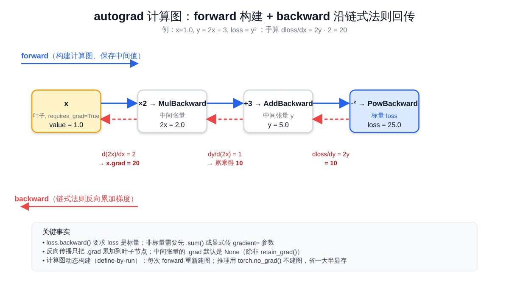

# 预备知识 P01：PyTorch 与张量

学大模型只用 HuggingFace 现成 API 把模型"跑起来"是远远不够的——一旦想读懂 Transformer 的 forward 在做什么、自己改一改 attention 的实现、写训练循环、调试形状报错，几乎每一步都要**直接读写张量、在维度上做 reshape / transpose、靠 autograd 把梯度自动回传**。这一章把这些**最底层的工具**讲清楚，给后续所有动手内容打底。

> 想直接跑示例？点这里 [](https://colab.research.google.com/github/weiqiangnd/LearningLLM/blob/main/P01.ipynb)。
>
> **硬件门槛**：概念章，CPU 即可✅。本章不加载任何大模型，PyTorch CPU 版就能跑通全部示例；有 GPU 当然更好——能顺手验证 `device` 相关的代码，但不是必须。

## 目录

- [一、为什么先讲 PyTorch](#一为什么先讲-pytorch)
- [二、张量（Tensor）：四个核心属性](#二张量tensor四个核心属性)
  - [2.1 shape：维度与形状](#21-shape维度与形状)
  - [2.2 dtype：数值精度](#22-dtype数值精度)
  - [2.3 device：在 CPU 还是 GPU 上](#23-device在-cpu-还是-gpu-上)
  - [2.4 requires\_grad：是否参与 autograd](#24-requires_grad是否参与-autograd)
- [三、创建张量的几种方式](#三创建张量的几种方式)
- [四、形状操作：reshape / view / transpose / permute / squeeze](#四形状操作reshape--view--transpose--permute--squeeze)
- [五、Broadcasting：维度自动对齐](#五broadcasting维度自动对齐)
- [六、张量运算：逐元素 vs 矩阵乘](#六张量运算逐元素-vs-矩阵乘)
- [七、Autograd：自动求导引擎](#七autograd自动求导引擎)
  - [7.1 计算图与反向传播](#71-计算图与反向传播)
  - [7.2 一个最小可手算的例子](#72-一个最小可手算的例子)
  - [7.3 关闭梯度：`torch.no_grad` 与 `detach`](#73-关闭梯度torchno_grad-与-detach)
  - [7.4 梯度不会自动清零：`zero_grad()`](#74-梯度不会自动清零zero_grad)
- [八、关键概念回顾](#八关键概念回顾)
- [九、本节小结](#九本节小结)

---

## 一、为什么先讲 PyTorch

主流大模型（Qwen、LLaMA、DeepSeek、Mistral）以及训练 / 微调 / 推理生态（HuggingFace `transformers` / `peft` / `trl` / `accelerate`、vLLM、SGLang）几乎全部基于 **PyTorch**。读论文实现、跟着官方仓库 debug、自己写训练脚本，都绕不开两类操作：

- **张量（Tensor）操作**：把数据组织成多维数组，做矩阵乘 / reshape / broadcasting。Transformer 的 forward 就是一长串张量变换。
- **自动求导（autograd）**：训练就是「前向算 loss → 反向求 $\partial \text{loss} / \partial \theta$ → 优化器拿梯度更新参数」。手写偏导不现实，PyTorch 帮我们记下计算图，调一次 `loss.backward()` 就把全部梯度算好。

只要把张量四个属性（shape / dtype / device / requires_grad）和 autograd 这套机制摸熟，后续看 Attention、看 LoRA 的 `A @ B`、看训练循环里 `loss.backward()` 都不会卡住。**预备知识阶段不追求把 PyTorch 学完**——只学最常用的 30%，后面遇到新 API 再查文档。

---

## 二、张量（Tensor）：四个核心属性

**张量（tensor）就是多维数组**——0 维是标量、1 维是向量、2 维是矩阵、3 维及以上没有专门的数学名字。深度学习里 99% 的数据（图片、文本、激活值、权重、梯度）都装在张量里。

```python
import torch
x = torch.tensor([[1.0, 2.0, 3.0],
                  [4.0, 5.0, 6.0]])
print(x.shape)         # torch.Size([2, 3])
print(x.dtype)         # torch.float32
print(x.device)        # cpu
print(x.requires_grad) # False
```

每个 tensor 都有这四个**身份证字段**——后续 99% 的报错都来自其中之一不匹配（"shape 对不上"、"dtype 不一致"、"一个在 cpu 一个在 cuda"）。

### 2.1 shape：维度与形状

`shape` 是一个 tuple（元组，Python 里用圆括号包起来的不可变序列），描述张量每一维的长度。维度数（即 `len(shape)`）叫 **rank**（秩）或 **ndim**。

| Rank | 名字 | 例子 | 典型用途 |
|------|------|------|----------|
| 0 | 标量（scalar） | `torch.tensor(3.14)` | loss 的最终值 |
| 1 | 向量（vector） | `torch.tensor([1, 2, 3])` | 一个 token 的 embedding |
| 2 | 矩阵（matrix） | `(B, D)` | 一个 batch 的特征向量 |
| 3 | 3 维张量 | `(B, L, D)` | 一个 batch 的 token embedding 序列（batch、seq_len、hidden_dim） |
| 4 | 4 维张量 | `(B, H, L, D/H)` | multi-head attention 里把 hidden_dim 拆成多头之后的形状 |

LLM 里最常见的形状是 `(B, L, D)`：B = batch size、L = sequence length、D = hidden dim——后续 attention / FFN 等几乎所有模块都基于这种 3 维张量。

> **小心** `tensor.size()` 等价于 `tensor.shape`，`tensor.size(dim)` 等价于 `tensor.shape[dim]`，都返回一个 `int`。前者是方法调用、后者是索引，含义相同。

### 2.2 dtype：数值精度

`dtype`（data type）决定每个元素占多少字节、能表示多大范围的数。

| dtype | 字节 | 能表达的范围 | LLM 里的用途 |
|-------|------|----------|--------------|
| `torch.float32` (`torch.float`) | 4 | 大、精度高 | 默认；训练时主参数与梯度一般是 fp32 |
| `torch.float16` (`torch.half`) | 2 | 范围小、易上溢 | T4（Turing 架构）半精度；推理常用 |
| `torch.bfloat16` | 2 | 范围与 fp32 相同、精度低 | A100/L4 起步的训练首选；不易上溢 |
| `torch.int64` (`torch.long`) | 8 | 整数 | token id、index |
| `torch.bool` | 1 | True / False | mask（attention mask、causal mask） |

> **T4 不原生支持 bf16**——T4（Turing 架构）没有 bf16 硬件路径，强行用 bf16 会回退到软件模拟、速度反而更慢，因此在 T4 上加载半精度模型时要选 `torch.float16`。Ampere 及以上（A100 / L4 / RTX 30 系起）才能享受 bf16 的硬件加速。

dtype 不一致是新手最常见的报错来源。例：

```python
a = torch.tensor([1, 2, 3])           # 默认 int64
b = torch.tensor([1.0, 2.0, 3.0])     # 默认 float32
a + b   # 这里 PyTorch 会自动把 a 提升到 float32 再相加（type promotion）
a @ b   # ❌ 矩阵乘要求两边 dtype 一致，会报错
```

显式转换：`x.float()` / `x.long()` / `x.to(torch.bfloat16)`。

### 2.3 device：在 CPU 还是 GPU 上

`device` 标记张量存在哪儿。常见取值 `cpu` / `cuda:0` / `cuda:1`。**两个张量必须在同一 device 才能做运算**，否则会报：

```
RuntimeError: Expected all tensors to be on the same device, ...
```

```python
x = torch.tensor([1.0, 2.0])              # cpu
y = torch.tensor([3.0, 4.0]).cuda()       # cuda:0（需有 GPU）
z = x + y                                 # ❌ 报错：device 不一致
z = x.to(y.device) + y                    # ✅ 把 x 搬到同一 device 再加
```

实际推理 / 训练代码里随处可见的 `inputs.to(model.device)` 就是这个意思——把输入张量搬到模型所在的设备（GPU），才能做 forward。

### 2.4 requires\_grad：是否参与 autograd

只有 `requires_grad=True` 的张量才会被 autograd 记录其计算历史，进而能反向求导。

- 模型参数（`nn.Parameter`，`nn.Linear` 等模块内部的 weight / bias）默认 `requires_grad=True`
- 输入数据（input_ids、图片像素）默认 `requires_grad=False`——我们不需要对输入求导（除了"adversarial attack"（对抗攻击：通过对输入加微小扰动让模型误判）这类特殊场景）
- 推理时整体禁用：`with torch.no_grad():`，节省内存

具体怎么用，留到第七节展开。

---

## 三、创建张量的几种方式

```python
import torch

# 1. 从 Python 列表 / 元组 / numpy 数组构造
torch.tensor([1, 2, 3])                  # 推断 dtype = int64
torch.tensor([1.0, 2.0])                 # float32

# 2. 给定形状，元素全 0 / 全 1 / 未初始化
torch.zeros(2, 3)                        # 2×3 全 0
torch.ones(2, 3)                         # 2×3 全 1
torch.empty(2, 3)                        # 2×3 未初始化（值是垃圾内存，不要直接用）

# 3. 等差序列
torch.arange(0, 10, 2)                   # [0, 2, 4, 6, 8]，类比 Python range
torch.linspace(0.0, 1.0, 5)              # 在 [0, 1] 上等距取 5 个点

# 4. 随机张量（深度学习里最常用）
torch.rand(2, 3)                         # 每个元素独立采样自均匀分布 [0, 1)
torch.randn(2, 3)                        # 每个元素独立采样自标准正态 N(0, 1)
torch.randint(0, 100, (2, 3))            # 每个元素独立采样自整数区间 [0, 100)，形状由最后一个参数指定

# 5. 与已有张量同 shape / dtype / device
x = torch.randn(2, 3, device="cpu")
torch.zeros_like(x)                      # 和 x 完全同形同 dtype 同 device 的全 0 张量
```

**复现性提示**：调用 `torch.manual_seed(42)` 后再产生随机张量，每次运行结果一致；写实验代码、对比同一份模型在不同超参下的表现时几乎都要先固定 seed。

---

## 四、形状操作：reshape / view / transpose / permute / squeeze

模型里张量形状变换非常密集，下面这几个 API 必须烂熟于心。

```python
import torch
x = torch.arange(12)                  # shape (12,)，元素 [0, 1, ..., 11]
```

**`reshape(*shape)` / `view(*shape)`**：在不改动数据的前提下改变形状，新形状元素总数必须等于原形状。

```python
y = x.reshape(3, 4)                   # (12,) → (3, 4)
y = x.view(3, 4)                      # 等价；要求底层内存连续（contiguous）
y = x.reshape(-1, 4)                  # -1 表示"剩下的维度自动算"，等价 reshape(3, 4)
```

`view` vs `reshape` 的区别：`view` 要求底层内存连续，否则报错；`reshape` 在不连续时会偷偷拷贝一份。**新手统一用 `reshape` 最不容易出错**；只有在性能敏感的代码里（避免拷贝），且明确知道当前张量连续时再用 `view`。

**`transpose(dim0, dim1)`**：交换两个指定维度。

```python
x = torch.randn(2, 3, 4)              # shape (2, 3, 4)
x.transpose(1, 2).shape               # → (2, 4, 3)
```

**`permute(*dims)`**：按给定顺序重排所有维度，比 `transpose` 更灵活。

```python
x.permute(2, 0, 1).shape              # (2, 3, 4) → (4, 2, 3)
```

Transformer 的 multi-head attention 里典型的 `(B, L, D) → (B, L, H, D/H) → (B, H, L, D/H)` 形状变换，就是 `reshape` 之后再 `transpose(1, 2)` 或 `permute(0, 2, 1, 3)`——这是后续读 attention 实现时会反复看到的模式。

**`squeeze` / `unsqueeze`**：去掉 / 插入长度为 1 的维度。`squeeze(dim)` 只有在 `dim` 这一维长度为 1 时才删，否则原样返回（不报错）——这是为了避免训练循环里因 batch size 偶尔为 1 而误删 batch 维。

```python
x = torch.randn(1, 3, 1)
x.squeeze().shape                     # → (3,)，去掉所有长度 1 的维度
x.squeeze(0).shape                    # → (3, 1)，只去掉第 0 维
x.squeeze(1).shape                    # → (1, 3, 1)，dim 1 长度是 3，squeeze 不动它（不报错）
x = torch.randn(3)
x.unsqueeze(0).shape                  # → (1, 3)，在第 0 维插一个长度 1
x.unsqueeze(-1).shape                 # → (3, 1)，在最后一维插一个长度 1
```

最常见的用途：把 `(L,)` 的单条样本变成 `(1, L)` 的 batch，喂给模型。

**`expand` 与 `repeat`**：把长度 1 的维度"复制"扩展，用于 broadcasting 之外的显式扩展。

- `expand`：**不拷贝内存**，只改张量的 `stride`（步长，即"沿这一维走 1 步对应底层内存里跨多少个元素"）——把 stride 设成 0，多个逻辑位置就都指向同一块物理数据，内存零开销。但 `expand` 只能扩展**长度为 1** 的维度，且返回的是只读视图，对它写入会污染原数据或直接报错。
- `repeat`：**真复制**——分配新内存，把数据按指定次数物理拼接。能在任意维度上重复（不要求源维长度为 1），但内存代价是 `expand` 的 N 倍。

优先用 `expand`，只有需要写入结果、或源维长度不是 1 时才用 `repeat`。

```python
import torch

x = torch.tensor([[1., 2., 3.]])      # shape (1, 3)
print(x.expand(4, 3))                 # shape (4, 3)，4 行都是 [1,2,3]
# tensor([[1., 2., 3.],
#         [1., 2., 3.],
#         [1., 2., 3.],
#         [1., 2., 3.]])

print(x.expand(4, 3).stride())        # (0, 1) —— 第 0 维 stride 为 0，4 行共享同一块底层内存
print(x.repeat(4, 1))                 # shape (4, 3)，输出一样但真复制了 4 份

# expand 只能扩展长度 1 的维度
y = torch.tensor([[1., 2., 3.],
                  [4., 5., 6.]])      # shape (2, 3)
# y.expand(4, 3)                      # ❌ 报错：dim 0 长度是 2，不是 1
print(y.repeat(2, 1))                 # ✅ shape (4, 3)：把 y 整体在 dim 0 上重复 2 次
```

注意两者参数语义不同：`expand(*sizes)` 写**目标形状**（用 `-1` 表示该维不变）；`repeat(*times)` 写每一维**重复多少次**——容易看错参数。

---

## 五、Broadcasting：维度自动对齐

Broadcasting（广播）是 PyTorch（与 NumPy）的核心便利特性：**形状不完全相同的两个张量，只要"兼容"就能直接做逐元素运算**，PyTorch 会在底层把短的一边"虚拟地"扩展成长的形状（不真的复制内存）。

**对齐规则**：从最右侧（最后一维）开始，逐维比较两个 shape：

1. 维度长度相等 → 兼容
2. 一边是 1 → 兼容（这一维被扩展到另一边的长度）
3. 一边没有这一维（rank 更小）→ 兼容（左侧自动补 1）
4. 否则 → ❌ 报 `RuntimeError: ... not broadcastable`

例子：

```python
A = torch.randn(2, 3, 4)              # shape (2, 3, 4)
B = torch.randn(   3, 4)              # shape (   3, 4)，左侧自动补成 (1, 3, 4)
A + B                                 # 合法，结果 (2, 3, 4)

A = torch.randn(2, 3, 4)
B = torch.randn(2, 1, 4)              # 中间维是 1，被广播到 3
A + B                                 # 合法，结果 (2, 3, 4)

A = torch.randn(2, 3, 4)
B = torch.randn(2, 5, 4)              # 中间维不一致且都不是 1
A + B                                 # ❌ 报错
```

LLM 里的典型场景：

- 给一个 batch 的所有样本加同一个 bias 向量：`(B, L, D) + (D,)` → bias 会被广播到 `(1, 1, D)` 再扩展
- 缩放每条样本的某一维：`(B, L, D) * (B, 1, 1)` → 第二个张量按样本提供独立的 scale

**踩坑提醒**：broadcasting 是把形状不同的两个张量"逐元素"运算变得可写，但**不会**把矩阵乘的不兼容形状救回来。`(B, L, D) @ (D,)` 会报错——矩阵乘的形状对齐是另一套规则（看下一节）。

---

## 六、张量运算：逐元素 vs 矩阵乘

PyTorch 的张量运算分两大类，初学最容易把它们搞混。

**逐元素运算（element-wise）**：`+ - * /` 以及 `torch.exp / log / sin / sigmoid` 等。两个张量 shape 必须相同（或满足 broadcasting）；输出 shape 与输入相同。

```python
a = torch.tensor([1.0, 2.0, 3.0])
b = torch.tensor([10.0, 20.0, 30.0])
a + b                                 # tensor([11., 22., 33.])
a * b                                 # tensor([10., 40., 90.])  ← 是逐元素相乘，不是点积！
torch.exp(a)                          # tensor([2.7183, 7.3891, 20.0855])
```

> **`*` 不是矩阵乘**——这是 PyTorch / NumPy 新手最容易栽的坑。

**矩阵乘 / 点积**：用 `@` 或 `torch.matmul`。规则：

- 两个 1 维张量：点积（dot product），输出标量。`(D,) @ (D,) → scalar`
- 一个 2 维 + 一个 1 维：矩阵 × 向量。`(M, D) @ (D,) → (M,)`
- 两个 2 维：矩阵乘。`(M, K) @ (K, N) → (M, N)`
- 高维：把最后两维当矩阵乘，前面的维度走 broadcasting。`(B, M, K) @ (B, K, N) → (B, M, N)`

```python
A = torch.randn(2, 3)                 # (2, 3)
B = torch.randn(3, 4)                 # (3, 4)
A @ B                                 # (2, 4)，矩阵乘

x = torch.randn(2, 3, 4)              # batch 矩阵
y = torch.randn(2, 4, 5)              # batch 矩阵
x @ y                                 # (2, 3, 5)，每个 batch 独立做 (3, 4) @ (4, 5)
```

Attention 里 `Q @ K.transpose(-2, -1)` 就是上面这种 batch 矩阵乘。

**常见数学函数**：`x.sum(dim=...)` / `x.mean(dim=...)` / `x.max(dim=...)` / `torch.softmax(x, dim=...)` / `F.cross_entropy(...)` 等等——遇到了再查文档，不必背。

---

## 七、Autograd：自动求导引擎

PyTorch 的核心卖点之一是 **autograd**：**自动**记录张量上做过的所有运算，并在调一次 `.backward()` 时把所有需要的偏导数沿着这张图算回来。**没有 autograd，深度学习训练就要手算每一层的偏导**——这件事在 Transformer 这种几十层、参数过亿的网络里完全做不动。

### 7.1 计算图与反向传播

只要参与运算的张量里有任意一个 `requires_grad=True`，PyTorch 就会**动态构建**一张「计算图」（computational graph，简称 cgraph）：节点是张量，边是产生它的运算（`AddBackward` / `MulBackward` / ...）。

```
   x（叶子节点，requires_grad=True）
    │
    ▼
  *2
    │
    ▼
   y = 2*x
    │
    ▼
  +3
    │
    ▼
   z = 2*x + 3
    │
    ▼
  pow(2)
    │
    ▼
   loss = (2*x + 3)^2     ← 标量，可对 x 求偏导
```

调 `loss.backward()` 时，PyTorch 沿着这张图**从 loss 反向走回每个 `requires_grad=True` 的叶子节点**，按链式法则把偏导累加到叶子节点的 `.grad` 字段里。下面这张图把 forward 构建（蓝色箭头，左→右）与 backward 回传（红色虚线，右→左）画在一起：



**叶子节点（leaf tensor）**：用户直接创建（不是由其他 tensor 运算得来）的 `requires_grad=True` 张量。模型参数都是叶子节点；中间结果不是。**只有叶子节点的 `.grad` 会被填充**——中间张量的 `.grad` 默认是 None。

**计算图是动态的**：每次 forward 都会重新构建（PyTorch 称为 **define-by-run**），这与早期 TensorFlow 1.x 的 **define-and-run**（先静态定义图、再喂数据）相反。**动态图调试方便**——你可以在 forward 中随便加 `print` 或条件分支，但代价是没有静态图的全局优化空间（torch.compile / TorchScript 是后来对此的补救）。

### 7.2 一个最小可手算的例子

考虑标量函数 $f(x) = (2x + 3)^2$ 。我们手算偏导：

$$
\frac{df}{dx} = 2 \cdot (2x + 3) \cdot 2 = 4(2x + 3)
$$

代入 $x = 1.0$ ： $f(1) = 25$ ， $f'(1) = 4 \cdot 5 = 20$ 。让 PyTorch 验证一下：

```python
import torch

x = torch.tensor(1.0, requires_grad=True)   # 叶子节点
y = 2 * x + 3                                # 中间张量
loss = y ** 2                                # 标量

loss.backward()                              # 反向传播
print(loss.item())                           # 25.0
print(x.grad)                                # tensor(20.)
```

**关键点**：

- `loss.backward()` 要求 `loss` 是**标量**（0 维张量）。如果 loss 是向量/矩阵，需要先 `loss.sum().backward()` 或显式传 `gradient=` 参数指定上游梯度。**实践中训练永远是 `loss = loss_fn(...).mean()` 这种标量**——这条规则极少违反。
- 反向传播只更新**叶子节点**的 `.grad`。`y` 是中间张量，`y.grad` 是 None（除非显式调用 `y.retain_grad()`）。

### 7.3 关闭梯度：`torch.no_grad` 与 `detach`

构建计算图本身要花内存（每个中间张量都得保留下来给反向用），**推理时完全不需要**——所以推理一定要在 `torch.no_grad()` 里跑：

```python
with torch.no_grad():
    output = model(input_ids)        # 不构建计算图，省一大半显存、还稍快一些
```

所有推理 / 生成代码（如 `model.generate(...)`）都应当包在 `with torch.no_grad():` 里就是这个原因——能把推理时的显存占用砍掉一大半。

`detach()` 是**针对单个张量**的"切断"——返回一个新张量，**和原张量共享数据**但**与计算图断开**。常见用途：

- 保存 loss 数值用于打印 / 记录到日志：`losses.append(loss.detach().cpu().item())`——避免无意中拉住整张计算图，导致内存爆掉
- RLHF / 蒸馏里把"reference model 的输出"当成静态目标，不让梯度回流：`ref_logits = ref_model(x).detach()`

```python
x = torch.tensor(1.0, requires_grad=True)
y = (2 * x + 3) ** 2

z = y.detach()                       # 与 y 共享数据，但不在计算图里
print(z.requires_grad)               # False
```

### 7.4 梯度不会自动清零：`zero_grad()`

PyTorch 默认 `.grad` 是**累加**的——多次 `backward()` 会把梯度加到一起，而不是覆盖。这在某些场景（梯度累积、二阶求导）里有用，但对最普通的训练循环来说就成了陷阱：

```python
# ❌ 错误版本：忘记 zero_grad，梯度会一步步累加，训练发散
for batch in loader:
    loss = compute_loss(batch)
    loss.backward()
    optimizer.step()

# ✅ 正确版本：每个 batch 开头清零
for batch in loader:
    optimizer.zero_grad()            # 把所有参数的 .grad 置零
    loss = compute_loss(batch)
    loss.backward()
    optimizer.step()
```

`optimizer.zero_grad()` 等价于把所有它管理的参数的 `.grad` 置零；也可以写 `model.zero_grad()`。**梯度累积训练**（用于显存不够、把 batch 拆成多步累加）就是故意省略某几步的 zero_grad，让梯度自然累加 N 步后再 `step + zero_grad`。

下一章 P02 会把这条循环完整跑一遍。

---

## 八、关键概念回顾

| 概念 | 一句话定义 | 典型用途 |
|------|------------|----------|
| 张量四属性 | shape / dtype / device / requires_grad | 99% 的 PyTorch 报错都来自其中之一不匹配 |
| broadcasting | 形状不同的张量按规则自动对齐做逐元素运算 | 给 batch 加 bias、按位置缩放、掩码与 logits 相加等 |
| `@` vs `*` | `@` 是矩阵乘 / 点积；`*` 是逐元素乘 | 几乎所有线性层、attention、低秩矩阵都用 `@` |
| 计算图 | forward 时动态构建、记录运算依赖 | 任何带训练的代码 |
| `.backward()` | 沿计算图回溯，把偏导累加到叶子节点 `.grad` | 训练循环里把 loss 转化成参数梯度 |
| `torch.no_grad()` | 临时关闭计算图构建，推理省显存 | 推理 / 评估 / 生成代码统一这样写 |
| `optimizer.zero_grad()` | 训练循环开头清零梯度，避免累加 | 普通训练循环里的标配；故意累加多步可实现梯度累积 |

---

## 九、本节小结

这一章把 PyTorch 用到的最底层工具讲清楚了：

- **张量 = 多维数组 + 四个属性（shape / dtype / device / requires_grad）**——99% 的 PyTorch 报错都来自这四项之一不匹配
- **形状变换** `reshape / transpose / permute / squeeze` 是模型 forward 里最常见的操作；**broadcasting** 让形状不同也能逐元素运算；**`@` 是矩阵乘，`*` 是逐元素乘**
- **autograd 是 PyTorch 的核心卖点**：forward 自动记录计算图，`backward()` 一步把所有梯度回传到参数；推理用 `torch.no_grad()`，训练循环开头记得 `zero_grad()`

**预告 P02**：下一章把这些零件组装起来——用 `nn.Module` 写一个最小的 MLP，再走一遍「前向 → 反向 → 优化器」三步训练循环，在玩具数据上把网络真的训练到收敛。这套循环骨架在后续所有训练任务（语言模型预训练、SFT、LoRA、RLHF）里几乎一字不改。
