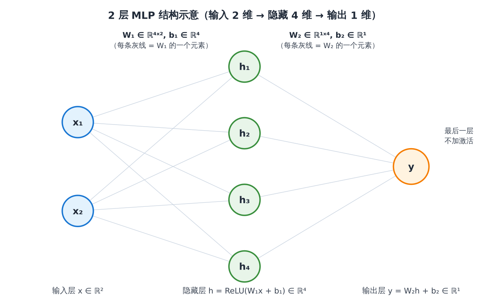
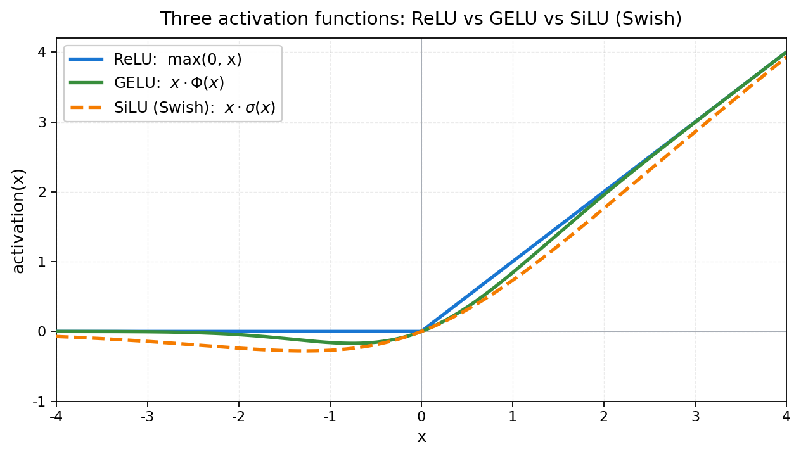
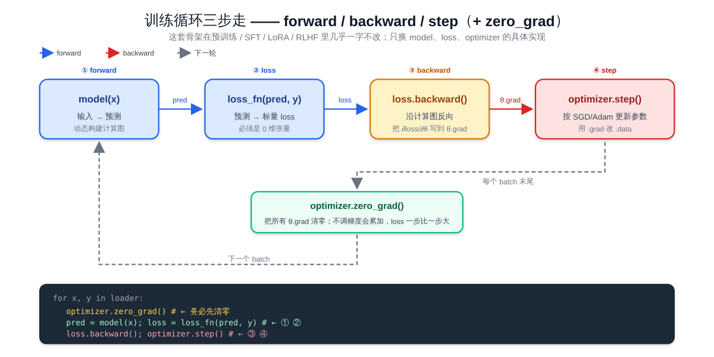

# 预备知识 P02：神经网络最小闭环——手写一个 MLP + 训练循环

P01 把张量和 autograd 这两件零件讲清楚了——但单独看张量、看一次 backward 都还只是"零件"，没看到"机器开起来什么样"。这一章把它们组装成**训练时永远要走的三步**：**前向 → 反向 → 优化器**。我们会从零写一个最小的 MLP（Multi-Layer Perceptron，多层感知机），在玩具数据上把它训练到收敛，并实时画出 loss 下降曲线。

所有训练相关任务（语言模型预训练、SFT、LoRA、RLHF 等）都共用这套**「数据 → forward → loss → backward → step → zero_grad」** 的骨架——只是 forward 里的模型从 MLP 换成 Transformer，loss 从 MSE 换成 cross-entropy / KL，但循环结构本身一字不改。这一章打的就是这个骨架。

> 想直接跑示例？点这里 [](https://colab.research.google.com/github/weiqiangnd/LearningLLM/blob/main/P02.ipynb)。
>
> **硬件门槛**：概念章，CPU 即可✅。本章用一个 2 层 MLP 在 1000 个二维点上做二分类，参数总数不超过 200，CPU 训练一轮不到 1 秒。

## 目录

- [一、为什么从 MLP 开始](#一为什么从-mlp-开始)
- [二、MLP 是什么](#二mlp-是什么)
  - [2.1 数学定义](#21-数学定义)
  - [2.2 为什么必须有非线性激活](#22-为什么必须有非线性激活)
- [三、训练循环的三步](#三训练循环的三步)
- [四、用 `nn.Module` 组织模型](#四用-nnmodule-组织模型)
  - [4.1 `nn.Linear` 内部做了什么](#41-nnlinear-内部做了什么)
  - [4.2 `nn.Parameter` 与 `model.parameters()`](#42-nnparameter-与-modelparameters)
- [五、损失函数与优化器](#五损失函数与优化器)
  - [5.1 损失函数](#51-损失函数)
  - [5.2 优化器：SGD 与 Adam](#52-优化器sgd-与-adam)
- [六、完整训练循环骨架](#六完整训练循环骨架)
- [七、实战：在 `make_moons` 数据上训练 MLP](#七实战在-make_moons-数据上训练-mlp)
- [八、常见踩坑](#八常见踩坑)
- [九、关键概念回顾](#九关键概念回顾)
- [十、本节小结](#十本节小结)

---

## 一、为什么从 MLP 开始

MLP（多层感知机）是**最简单的可训练神经网络**——只有线性层 + 激活函数堆叠，没有 attention / 卷积 / RNN 这些更复杂的结构。优点：

- **结构最少**：所有"为什么是这样"的问题（前向怎么算？loss 怎么求？反向怎么传？）都暴露在最少的代码里
- **训练最快**：CPU 上几秒就能跑完一轮，迭代验证想法成本低
- **后续所有结构的子部件**：Transformer 里的 FFN（feed-forward network）就是一个 2 层 MLP；attention 投影矩阵就是 `nn.Linear`；分类头就是一个线性层 + softmax

把 MLP 跑通，等于把"训练一个神经网络"这件事的最小可行版本走完一遍。

而且 MLP 不只是"教学玩具"——在真实系统里它本身就是高频出现的模块：

- **Transformer 里的 FFN**：每个 Transformer block 在 attention 之后都接一个 2 层 MLP（`Linear → 激活 → Linear`），这部分占了 LLM 总参数量的大头（通常 ~2/3）。换句话说，你用的每一个 LLM 里，绝大多数权重就是在做 MLP。
- **分类 / 回归头（head）**：把 backbone（Transformer / CNN / ViT）输出的特征向量映射成最终预测——情感分类、token 分类、奖励模型打分（reward model 输出标量）、价值函数（critic 输出 V 值）几乎都是一个一两层 MLP。
- **嵌入投影（projection）**：把不同来源的特征对齐到同一空间，例如多模态模型把视觉编码器输出的特征用 MLP 投影到语言模型的 embedding 维度；对比学习里也用 MLP projector 把表征映射到对比空间。
- **MoE（Mixture of Experts）的专家**：MoE 架构里每个 "expert" 通常就是一个独立的 FFN-MLP，路由器选若干个 MLP 来处理当前 token。
- **结构化 / 表格数据建模**：在没有序列、没有空间结构的纯特征向量场景（推荐系统的特征交叉、风控模型、强化学习的策略 / 价值网络），MLP 至今仍是默认选择。

---

## 二、MLP 是什么

### 2.1 数学定义

一个 $L$ 层 MLP 把输入向量 $x \in \mathbb{R}^{D_\text{in}}$ 一路变换成输出 $y \in \mathbb{R}^{D_\text{out}}$ ：

$$
h_0 = x
$$

$$
h_l = \sigma(W_l h_{l-1} + b_l), \quad l = 1, 2, \ldots, L-1
$$

$$
y = W_L h_{L-1} + b_L
$$

其中：
- $W_l \in \mathbb{R}^{D_l \times D_{l-1}}$ 是第 $l$ 层的**权重矩阵**， $b_l \in \mathbb{R}^{D_l}$ 是**偏置向量**
- $\sigma$ 是**非线性激活函数**（如 ReLU、sigmoid、GELU）。最后一层一般**不加**激活，让输出是任意实数（分类 logits / 回归值）
- $D_l$ 叫**第 $l$ 层的隐藏维度（hidden dim）**

记号统一性提示：神经网络教材里有时用列向量、有时用行向量。PyTorch 的 `nn.Linear(in, out)` 内部是 `out = x @ W.T + b`（详见 4.1）；下面公式按教科书惯例用列向量，但只要记住每一步的形状变换就不会出错。

**最小例子（2 层 MLP）**：输入 2 维 → 隐藏 4 维 → 输出 1 维（标量，二分类 logit）。

```
x ∈ R²
   │  W₁ shape (4, 2),  b₁ shape (4,)
   ▼
h = ReLU(W₁ x + b₁)  ∈ R⁴
   │  W₂ shape (1, 4),  b₂ shape (1,)
   ▼
y = W₂ h + b₂        ∈ R¹
```

把这个最小例子画成图——蓝色是输入层、绿色是隐藏层、橙色是输出层；每条灰线是一条**全连接**的权重连接（即 $W_l$ 的一个元素），偏置 $b_l$ 单独标注：



读图要点：
- **节点数 = 该层维度**：输入 2 个圆 ⇒ $D_0=2$ ；隐藏 4 个圆 ⇒ $D_1=4$ ；输出 1 个圆 ⇒ $D_2=1$
- **权重在边上，偏置在节点上**：从输入到隐藏一共 $4 \times 2 = 8$ 条边，正好对应 $W_1 \in \mathbb{R}^{4 \times 2}$ 的 8 个元素；每个隐藏节点还附带一个偏置 $b_1$ 的元素，所以 $b_1 \in \mathbb{R}^4$
- **激活作用在节点上**：隐藏层每个圆里实际做的是 $h_i = \mathrm{ReLU}(\sum_j W_{1,ij} x_j + b_{1,i})$ ；输出层不加激活，只做线性组合

参数总数： $4{\times}2 + 4 + 1{\times}4 + 1 = 17$ 。

### 2.2 为什么必须有非线性激活

如果去掉 $\sigma$ ，把多层线性变换叠起来：

$$
y = W_L (W_{L-1} (\ldots (W_1 x + b_1) \ldots ) + b_{L-1}) + b_L
$$

展开后等价于 $y = W' x + b'$ ， $W' = W_L W_{L-1} \ldots W_1$ ，**整个网络坍缩成一个线性层**——加多少层都一样。**非线性激活是「让叠多层有意义」的关键**。

常见激活函数：

| 激活 | 公式 | 特点 | LLM 里 |
|------|------|------|--------|
| **ReLU** | $\max(0, x)$ | 计算快，负值清零；可能"死亡"（永远输出 0） | 老一代 Transformer FFN |
| **GELU** | $x \cdot \Phi(x)$ ， $\Phi$ 是标准正态 CDF | 平滑、接近 ReLU 但保留少量负值信息 | GPT-2/3 的 FFN |
| **SwiGLU** | 由 **SiLU**（Swish）门控 + 线性组合而成 | 门控单元；同等参数量下表达力更强 | 现代主流 LLM（LLaMA / Qwen / DeepSeek 等）的 FFN |

> **缩写说明**：
> - **FFN**：Feed-Forward Network，前馈网络——指 Transformer block 中 attention 之后的 2 层 MLP（结构是 `Linear → 激活 → Linear`）。
> - **CDF**：Cumulative Distribution Function，累积分布函数。 $\Phi(x) = P(X \le x)$ ，其中 $X \sim \mathcal{N}(0, 1)$ 是标准正态变量； $\Phi(x)$ 把 $x$ 映射到 $[0, 1]$ ，于是 GELU 可以理解为「ReLU 的平滑版本」——用 $\Phi(x)$ 这个软门控代替 ReLU 的硬阈值 $\mathbb{1}[x > 0]$ 。

把表中三种激活的曲线画在同一张图上对比（SwiGLU 内部用两套权重 $W_1, W_2$ 投影 + 门控，输出还依赖矩阵参数，没法像 ReLU/GELU 那样画成一条一维曲线；这里画的是它内部使用的非线性 SiLU / Swish—— $\mathrm{SwiGLU}(x) = \mathrm{SiLU}(W_1 x) \odot (W_2 x)$ ，曲线形状由 SiLU 决定）：



读图要点：
- **正半轴**：三者都接近 $y = x$ ——大正值时几乎不衰减，能让梯度无障碍通过
- **负半轴**：ReLU 直接归零（这就是「死亡 ReLU」的源头：一旦输入持续为负，梯度也是 0，权重永远更新不动）；GELU / SiLU 在 $x \in [-1.5, 0]$ 范围内留了一个"小坑"——GELU 最低点约 -0.169（在 $x \approx -0.75$ 处），SiLU 最低点约 -0.278（在 $x \approx -1.278$ 处），允许少量负信息和梯度漏过去
- **零点附近**：ReLU 在 $x=0$ 不可导（左导数 0、右导数 1）；GELU / SiLU 处处光滑——这对优化稳定性更友好，也是现代 LLM 普遍弃用 ReLU 的主要原因之一

**SwiGLU 备注**： $\mathrm{SwiGLU}(x) = \mathrm{SiLU}(W_1 x) \odot (W_2 x)$ 看似突兀，其实就三件事：

- **两套独立权重** $W_1, W_2 \in \mathbb{R}^{D_\text{hidden} \times D_\text{in}}$ ：把同一个输入 $x$ 投影两次，得到两个同形状向量——一路当 **gate（门控信号）**，另一路当 **value（被门控的值）**
- **$\odot$ 是逐元素乘**（Hadamard product）：两个同形状向量按位相乘，不是矩阵乘
- **SiLU 只作用在 gate 这一路**：把 gate 通道的值大体压到非负——但留有一个"小坑"，最低约 -0.278（出现在 $z \approx -1.278$ 处，见前面那条橙色虚线）。直观上：大正输入 ≈ 原样放行，强负输入压到接近 0，轻度负输入留一点"软门"漏过去。所以"通过比例"这个词只是大体直觉，不要把它误解成严格的 $[0, 1]$ 门——SwiGLU 里的 gate 上不封顶、下也允许小幅负值

```
       ┌─► W₁x ──► SiLU ──► gate  ─┐
   x ──┤                           ├─► ⊙ ──► 输出
       └─► W₂x ─────────────► value ┘
```

举个 $D_\text{hidden}=3$ 的最小例子。设两路投影后得到：

$$
W_1 x = [2.0,\thinspace {-1.0},\thinspace 0.5], \quad W_2 x = [1.0,\thinspace 3.0,\thinspace {-2.0}]
$$

先算 gate—— $\mathrm{SiLU}(z) = z \cdot \sigma(z) = z / (1 + e^{-z})$ ，逐元素套上去：

$$
\mathrm{SiLU}(W_1 x) = \big[2.0 \cdot \sigma(2.0),\thinspace\thinspace {-1.0} \cdot \sigma(-1.0),\thinspace\thinspace 0.5 \cdot \sigma(0.5)\big]
$$

$$
= [2.0 \times 0.881,\thinspace\thinspace {-1.0} \times 0.269,\thinspace\thinspace 0.5 \times 0.622] \approx [1.76,\thinspace {-0.27},\thinspace 0.31]
$$

再按位乘 value：

$$
\mathrm{SwiGLU}(x) \approx [1.76 \times 1.0,\thinspace\thinspace {-0.27} \times 3.0,\thinspace\thinspace 0.31 \times {-2.0}] = [1.76,\thinspace {-0.81},\thinspace {-0.62}]
$$

注意第二个通道：value 是 3.0（很大），但 gate 落在 SiLU 的负半轴小坑里（ $W_1 x = -1$ ， $\mathrm{SiLU}(-1) \approx -0.27$ ），最终输出被缩到 -0.81——量级压到 value 的约 1/4，方向还反了。这就是"门控"的字面含义：**用一路信号决定另一路每个通道的"放大倍数"**（在 SwiGLU 里这个倍数大体非负、但允许小幅负值，所以严格说是"加权"而非传统意义的 $[0, 1]$ 门）。

补一句：真实 Transformer 里的 SwiGLU FFN 还有第 3 个矩阵 $W_3 \in \mathbb{R}^{D_\text{model} \times D_\text{hidden}}$ 把隐藏维度投影回模型维度：

$$
\mathrm{FFN}(x) = W_3 \big(\mathrm{SiLU}(W_1 x) \odot (W_2 x)\big)
$$

而原始 Transformer（Vaswani et al. 2017）里 ReLU FFN、以及 GPT-2/3 把激活换成 GELU 之后的 FFN，都只有 2 个矩阵：

$$
\mathrm{FFN}_\text{ReLU/GELU}(x) = W_2 \cdot \sigma(W_1 x + b_1) + b_2
$$

所以同等隐藏维度下，SwiGLU 比 ReLU/GELU FFN 多 ~50% 参数。但在实践中现代 LLM（LLaMA / Qwen / DeepSeek 等）会把 SwiGLU 的 $D_\text{hidden}$ 从惯例的 $4 D_\text{model}$ 砍到 $\tfrac{8}{3} D_\text{model}$ ，以保持总参数量与 ReLU/GELU FFN 持平（忽略 bias）：

| FFN 类型 | 矩阵数 | 隐藏维度 $D_\text{hidden}$ | 参数量 |
|----------|--------|----------------------------|--------|
| ReLU / GELU FFN | 2 | $4 D_\text{model}$ | $8\thinspace D_\text{model}^2$ |
| SwiGLU FFN（朴素） | 3 | $4 D_\text{model}$ | $12\thinspace D_\text{model}^2$（**+50%**） |
| SwiGLU FFN（LLaMA 等实际用的） | 3 | $\tfrac{8}{3} D_\text{model}$ | $8\thinspace D_\text{model}^2$（**持平**） |

本章 MLP 用最经典的 **ReLU** 起手——把训练循环跑通是首要目标，GELU / SwiGLU 等更复杂激活的取舍留到后面遇到再展开。

---

## 三、训练循环的三步

训练神经网络，永远是这三步在循环：

```
        ┌────────────── 一个 batch ──────────────┐
        │                                        │
   1. forward     ───►  compute loss             │
        │                    │                   │
        │                    ▼                   │
        │             2. loss.backward()         │
        │                    │                   │
        │                    ▼                   │
        │             3. optimizer.step()        │
        │                    │                   │
        │                    ▼                   │
        │             optimizer.zero_grad()      │
        └─────────────  下一个 batch  ────────────┘
```

具体每步：

1. **前向（forward）**：把 batch 喂进模型，算出预测和 loss。`pred = model(x); loss = loss_fn(pred, y)`
2. **反向（backward）**：`loss.backward()` 触发 autograd，把 $\partial \mathcal{L} / \partial \theta$ 累加到每个参数的 `.grad` 字段
3. **优化器更新（step）**：`optimizer.step()` 按某种规则（SGD、Adam）用 `.grad` 更新参数；之后 `optimizer.zero_grad()` 清零梯度，准备下一轮

把这套循环画成图——上方一行是 forward 数据流（蓝色箭头）、再过 `loss.backward()` 把梯度回写到每个参数的 `.grad`（红色箭头）、然后 `optimizer.step()` 用 `.grad` 改 `.data`，每个 batch 末尾再回到开头继续：



**这一节的所有内容、Transformer 的训练、LoRA 的训练、RLHF 的训练——骨架完全相同**。区别只在 forward 里调什么模型、loss 怎么定义。

---

## 四、用 `nn.Module` 组织模型

PyTorch 用 `nn.Module` 这一抽象类组织一切"带参数的结构"——一层、一组层、整个模型都继承自它。约定：

- `__init__` 里**声明**所有需要训练的子模块（`self.fc1 = nn.Linear(...)`）
- `forward(self, x)` 里**写**前向计算流；调用 `model(x)` 等价于 `model.forward(x)`，但 PyTorch 会在外面套上 hook 等机制，**永远写 `model(x)`**

```python
import torch
import torch.nn as nn
import torch.nn.functional as F

class MLP(nn.Module):
    def __init__(self, in_dim, hidden_dim, out_dim):
        super().__init__()                            # 必须调父类构造，否则 nn.Module 状态不全
        self.fc1 = nn.Linear(in_dim, hidden_dim)      # W₁, b₁
        self.fc2 = nn.Linear(hidden_dim, out_dim)     # W₂, b₂

    def forward(self, x):
        h = F.relu(self.fc1(x))                       # 中间层用 ReLU
        y = self.fc2(h)                               # 最后一层不加激活：输出 raw logits
        return y

model = MLP(in_dim=2, hidden_dim=4, out_dim=1)
print(model)
```

`print(model)` 会自动列出层级结构——这是 `nn.Module` 给你的免费"自我描述"能力。

### 4.1 `nn.Linear` 内部做了什么

```python
linear = nn.Linear(in_features=2, out_features=4)
# linear.weight.shape == (4, 2)        ← (out, in)
# linear.bias.shape   == (4,)
```

`nn.Linear` 在 forward 时计算的是：

$$
y = x W^\top + b
$$

注意是 $W^\top$ ——**PyTorch 内部把 weight 存成 `(out, in)`**（约定如此，许多深度学习框架都是这一布局：每一行对应一个输出神经元的输入权重）。所以 `linear.weight.shape == (out, in)`，乘的时候转置一下。这条容易记错：调试时 `print(p.shape for p in linear.parameters())` 一眼就能看清。

`nn.Linear` 默认会自动初始化权重（Kaiming uniform）；想自定义初始化时再覆盖。

### 4.2 `nn.Parameter` 与 `model.parameters()`

`nn.Linear` 内部的 `weight` 和 `bias` 都是 `nn.Parameter` 类型——本质上是 `requires_grad=True` 的 tensor，并且**自动注册到所属的 `nn.Module`**，能通过 `model.parameters()` 一次性拿到全部需要训练的张量：

```python
for name, p in model.named_parameters():
    print(name, p.shape, p.requires_grad)

# fc1.weight torch.Size([4, 2]) True
# fc1.bias   torch.Size([4])    True
# fc2.weight torch.Size([1, 4]) True
# fc2.bias   torch.Size([1])    True
```

下一步把 `model.parameters()` 交给 optimizer，就能让 optimizer 在 `step()` 里更新它们。

---

## 五、损失函数与优化器

### 5.1 损失函数

不同任务用不同 loss：

| 任务 | 损失 | PyTorch API | 备注 |
|------|------|-------------|------|
| 回归（输出连续值） | **MSE**（均方误差） | `nn.MSELoss()` / `F.mse_loss` | $\frac{1}{N}\sum(\hat y - y)^2$ |
| 二分类（logit + 单一类） | **BCE with logits** | `nn.BCEWithLogitsLoss()` / `F.binary_cross_entropy_with_logits` | 内部先 sigmoid 再 BCE，数值稳定 |
| 多分类（logits + 类别 id） | **Cross-entropy** | `nn.CrossEntropyLoss()` / `F.cross_entropy` | 内部先 log_softmax 再 NLL，**输入是 raw logits 不是 softmax 结果** |

> **极常见踩坑**：`F.cross_entropy(logits, target)` 期望传入的是 **raw logits**（任意实数），它内部会 `log_softmax`。如果你已经 `softmax` 过再传进去，loss 会算错且不报错——只是模型完全学不动。

LLM 的"下一个 token 预测"训练用的就是 `F.cross_entropy`——每个位置输出一条长度等于词表大小的 logits 向量，target 是真实的 token id，按位置算 cross-entropy 再求平均。

### 5.2 优化器：SGD 与 Adam

优化器决定"拿着 grad，怎么更新参数"。最简单的是 **SGD**（随机梯度下降）：

$$
\theta \leftarrow \theta - \eta \cdot \nabla_\theta \mathcal{L}
$$

其中 $\eta$ 是**学习率（learning rate, lr）**。直觉：每次往负梯度方向走一小步。

**Adam / AdamW** 在 SGD 上叠了两个改良：

- 维护每个参数的**梯度均值**（动量）
- 维护每个参数的**梯度二阶矩**（方差），按方差自适应调整每个参数的步长——梯度大的方向走小步，梯度小的方向走大步

LLM 训练几乎一律用 **AdamW**（Adam + weight decay 修正）。本章先用 SGD 走通流程，**优化器的细节、warmup + cosine 调度留到 P04 展开**。

```python
optimizer = torch.optim.SGD(model.parameters(), lr=0.1)
# 或：optimizer = torch.optim.AdamW(model.parameters(), lr=1e-3, weight_decay=1e-2)
```

`optimizer` 拿到的是 `model.parameters()` 这个**生成器**——它会记录每个参数的引用，在 `step()` 时直接修改它们的 `.data`。

---

## 六、完整训练循环骨架

把上面的零件拼成一个最小训练循环，**这段代码请记到肌肉记忆**：

```python
import torch
import torch.nn as nn
import torch.nn.functional as F

# 1. 准备模型 / 损失 / 优化器
model = MLP(2, 16, 1)
optimizer = torch.optim.SGD(model.parameters(), lr=0.1)

# 2. 训练循环
for epoch in range(num_epochs):
    for x_batch, y_batch in data_loader:        # 一次拿一个 batch
        # ---- 三步走 ----
        # (a) 前向
        logits = model(x_batch)                  # (B, 1)
        loss = F.binary_cross_entropy_with_logits(logits.squeeze(-1), y_batch)

        # (b) 反向
        optimizer.zero_grad()                    # 清掉上一个 batch 留下的梯度
        loss.backward()                          # 计算 ∂loss/∂参数

        # (c) 更新
        optimizer.step()                         # 按 SGD/Adam 规则修改参数

    print(f'epoch {epoch}, loss {loss.item():.4f}')
```

**`zero_grad()` 放在 `backward()` 之前还是 `step()` 之后都可以**——关键是**不要漏掉**。两种风格都常见：

- 风格 A（开头清零）：`zero_grad → forward → loss → backward → step`
- 风格 B（结尾清零）：`forward → loss → backward → step → zero_grad`

效果相同。本仓库统一用风格 A，因为它把"开始一个新 step"的语义放在了循环开头，更符合直觉。

---

## 七、实战：在 `make_moons` 数据上训练 MLP

我们用 `sklearn.datasets.make_moons` 生成两个交叉的半月形点云做二分类——这是经典的"线性不可分"玩具数据集，用来直观验证"非线性激活让 MLP 能学会非线性边界"。

数据准备：

```python
from sklearn.datasets import make_moons

# n_samples=1000 个点；noise=0.2 让两类边界稍有交错
# random_state 固定 seed，保证每次跑得到一样的数据
X_np, y_np = make_moons(n_samples=1000, noise=0.2, random_state=0)

# numpy → tensor；BCEWithLogitsLoss 要求 target 是 float（不是 long）
X = torch.tensor(X_np, dtype=torch.float32)
y = torch.tensor(y_np, dtype=torch.float32)
```

完整训练循环：

```python
import torch
import torch.nn as nn
import torch.nn.functional as F

torch.manual_seed(42)              # 让模型初始化、训练过程可复现

class MLP(nn.Module):
    def __init__(self):
        super().__init__()
        self.fc1 = nn.Linear(2, 16)
        self.fc2 = nn.Linear(16, 1)
    def forward(self, x):
        return self.fc2(F.relu(self.fc1(x)))

model = MLP()
# SGD 是最朴素的优化器，足够把 make_moons 训练到接近 100%
# AdamW 收敛更快但本节先跑通流程；优化器细节留到 P04
optimizer = torch.optim.SGD(model.parameters(), lr=0.1)

losses = []
accs = []
for epoch in range(200):
    # ============= 三步走 =============
    # (a) 前向：把整个数据集当一个 batch
    logits = model(X).squeeze(-1)                                 # (N, 1) → (N,)
    # binary_cross_entropy_with_logits 比手写 sigmoid + BCE 数值稳定得多 —— 它内部用 log-sum-exp
    loss = F.binary_cross_entropy_with_logits(logits, y)

    # (b) 反向：清零梯度（绝不能漏！），再 backward
    optimizer.zero_grad()
    loss.backward()

    # (c) 更新：optimizer 按 SGD 公式 θ ← θ - lr * θ.grad 修改参数
    optimizer.step()

    # 记录 loss 与准确率，用于画曲线（注意用 detach()/no_grad 避免拉住计算图）
    losses.append(loss.item())
    with torch.no_grad():
        pred = (torch.sigmoid(logits) > 0.5).float()
        accs.append((pred == y).float().mean().item())

    if (epoch + 1) % 20 == 0:
        print(f'epoch {epoch+1:3d}  loss {loss.item():.4f}  acc {accs[-1]:.3f}')
```

实战部分还会做两件事：

- **画训练 loss 曲线**：让你看到 loss 单调下降——若不下降，多半是 lr 太大 / 太小，或者 `zero_grad` 漏了
- **画决策边界**：把 2D 平面网格喂给训练好的 MLP，按预测的概率上色，能看到 MLP 在原本线性不可分的两个半月之间画出一条 S 形边界——直观证明"非线性激活让多层有意义"

并对比一个**故意去掉 ReLU** 的退化模型（`y = fc2(fc1(x))`）：会看到无论训多久，决策边界都只是一条直线（"两个线性层叠起来等价于一个线性层"在数据上的实证）。

---

## 八、常见踩坑

| 症状 | 原因 | 解决 |
|------|------|------|
| loss 不下降，且数值稳定 | 漏调 `zero_grad()`、或 lr 太小 | 把 `zero_grad / backward / step` 三件套对齐 |
| loss 突然变 NaN | lr 太大、loss 内部 log(0) | 减小 lr；改用数值稳定的 loss API（如 `binary_cross_entropy_with_logits` 而不是 `binary_cross_entropy(sigmoid(x))`） |
| `RuntimeError: ... not on the same device` | 模型在 GPU 数据在 CPU（或反过来） | 在循环最外层 `model = model.to(device)`，每 batch 取出后 `x = x.to(device)` |
| `RuntimeError: shape mismatch` | forward 里某一层输入输出维度对不上 | 在每行后面 `print(x.shape)`，从前往后对照 |
| 模型在训练集都拟合不了 | 模型容量太小 / 优化器选不对 / 输入未归一化 | 加宽 hidden_dim；换 AdamW；先把数据 mean-std 归一化 |
| 训练集 loss 下降但测试集很高 | 过拟合 | 加 dropout / weight_decay / 增数据；早停 |

---

## 九、关键概念回顾

| 概念 | 一句话定义 | 典型用途 |
|------|------------|----------|
| MLP | 线性层 + 非线性激活的堆叠 | Transformer 内的 FFN 就是 2 层 MLP |
| `nn.Module` | 组织"带参数结构"的基类，提供 `parameters()` / `state_dict()` 等 | 任何含可训练参数的代码都基于它 |
| `nn.Linear` | 实现 $y = x W^\top + b$ ，weight shape 是 `(out, in)` | attention 的 Q/K/V 投影、输出投影、LoRA 低秩矩阵都是它 |
| 训练三步 | forward → backward → step；外加 zero_grad | 一切训练任务（预训练 / SFT / LoRA / RLHF）的循环骨架 |
| 损失函数 | `F.cross_entropy` 输入是 raw logits，**不是 softmax** | 语言模型的"下一个 token 预测"训练 |
| 优化器 | SGD 是基线、AdamW 是 LLM 训练默认 | 优化器细节（动量、权重衰减、warmup）留到 P04 展开 |

---

## 十、本节小结

这一章把 P01 的零件组装成了能跑的"机器"：

- **MLP** 是最简的可训练神经网络——线性层 + 非线性激活的堆叠；非线性激活是"让多层有意义"的关键
- 用 **`nn.Module`** 组织模型——`__init__` 声明子模块、`forward` 写计算流；`nn.Linear(in, out)` 内部是 $y = x W^\top + b$ ， weight shape 是 `(out, in)`
- **训练三步**「forward → backward → step」+ 一个 `zero_grad`——这套骨架在几乎所有训练任务里都不变
- 损失函数与优化器先掌握「`F.cross_entropy` 接收 raw logits」「先 SGD 跑通、再换 AdamW」两条；细节留到 P04
- 实战在 `make_moons` 上训练一个 2→16→1 的 MLP，观察到 loss 单调下降、决策边界呈 S 形——验证了"非线性激活 + 多层"能学会线性不可分

**预告 P03**：下一篇预备知识把训练里反复出现的概率工具（softmax、log-likelihood、熵、交叉熵、KL 散度、MLE）系统讲清楚。把 P01–P04 走完，再去读 attention 实现、写自己的训练脚本，几乎不会再有"卡在某个数学符号上"的时刻。
