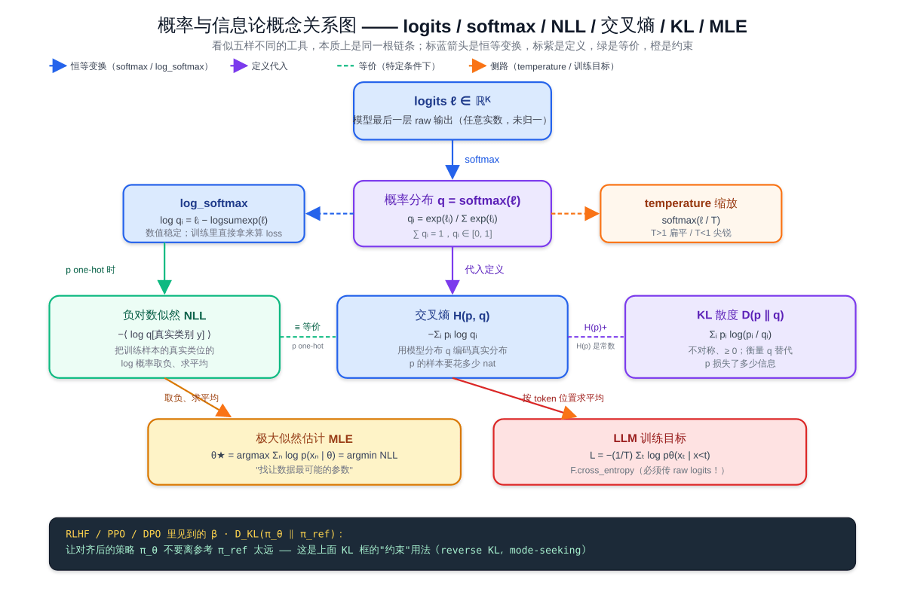
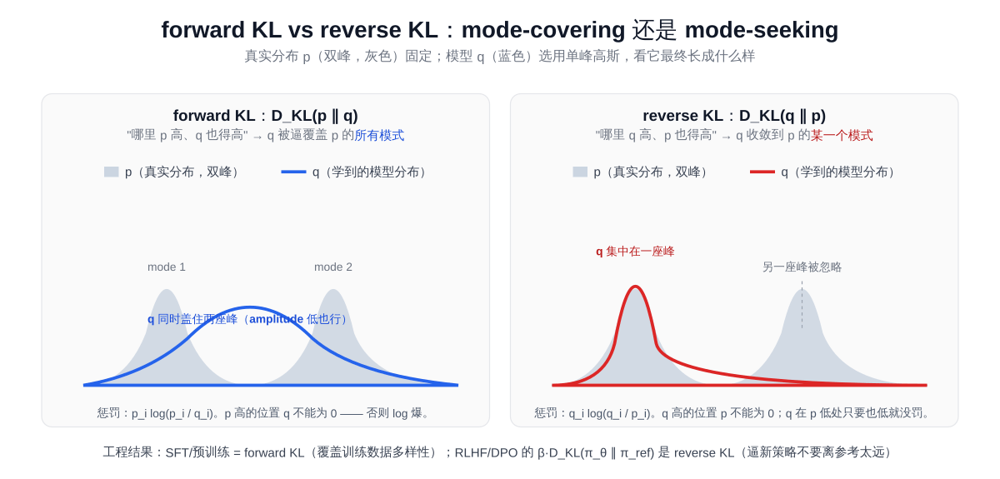

# 预备知识 P03：概率与信息论够用版——softmax / 似然 / 熵 / 交叉熵 / KL

LLM 训练里反复出现的几个数学符号——softmax、 $\log p(x)$ 、熵 $H$ 、交叉熵 $H(p, q)$ 、KL 散度 $D_{\text{KL}}(p \| q)$ ——背后是同一套**概率与信息论**语言。把它讲清楚之后，再回头看：

- 「下一个 token 预测的训练目标」 = **极大似然估计（MLE）** = **最小化交叉熵**
- 「PPO / DPO 里的 KL 约束」 = 让新策略不要偏离参考分布太远
- 「temperature / top-p 采样」 = 在 softmax 出来的分布上做不同方式的采样

这些看似不同的招式，其实用同一套概率工具就能说穿。这一章把这套工具按"看公式 → 最小数值例子 → 用 PyTorch 验证"三步走一遍，**不堆推导，只讲够用**。

> 想直接跑示例？点这里 [](https://colab.research.google.com/github/weiqiangnd/LearningLLM/blob/main/P03.ipynb)。
>
> **硬件门槛**：概念章，CPU 即可✅。本章只算几个 3 ~ 5 维向量上的小例子，CPU 一秒跑完。

## 目录

- [一、为什么先讲概率与信息论](#一为什么先讲概率与信息论)
- [二、概率分布：从 logits 到 softmax](#二概率分布从-logits-到-softmax)
  - [2.1 离散分布与 Categorical](#21-离散分布与-categorical)
  - [2.2 logits 是什么](#22-logits-是什么)
  - [2.3 softmax 的定义与性质](#23-softmax-的定义与性质)
  - [2.4 数值稳定的 softmax 与 log-softmax](#24-数值稳定的-softmax-与-log-softmax)
- [三、似然与极大似然估计（MLE）](#三似然与极大似然估计mle)
  - [3.1 似然 vs 概率](#31-似然-vs-概率)
  - [3.2 为什么取对数：log-likelihood](#32-为什么取对数log-likelihood)
  - [3.3 MLE：训练即"找让数据最可能的参数"](#33-mle训练即找让数据最可能的参数)
- [四、熵：不确定性的度量](#四熵不确定性的度量)
- [五、交叉熵：模型分布离真实分布有多远](#五交叉熵模型分布离真实分布有多远)
  - [5.1 定义](#51-定义)
  - [5.2 与负对数似然（NLL）的等价性](#52-与负对数似然nll的等价性)
  - [5.3 `F.cross_entropy` 输入是 raw logits](#53-fcross_entropy-输入是-raw-logits)
- [六、KL 散度：两个分布之间的差](#六kl-散度两个分布之间的差)
  - [6.1 定义](#61-定义)
  - [6.2 KL 与交叉熵的关系](#62-kl-与交叉熵的关系)
  - [6.3 不对称性](#63-不对称性)
- [七、把这套工具映射到 LLM 训练](#七把这套工具映射到-llm-训练)
- [八、关键概念回顾](#八关键概念回顾)
- [九、本节小结](#九本节小结)

---

## 一、为什么先讲概率与信息论

如果跳过这一章直接读 attention 实现 / loss 写法 / RLHF 论文，几乎一定会卡在下面这几个地方：

- 看到 `F.cross_entropy(logits, target)` 不知道为什么要传 raw logits 而不是 softmax 出来的概率
- 看到论文里 $\mathcal{L} = -\mathbb{E}\_{x \sim p_{\text{data}}} [\log p_\theta(x)]$ ，说不清这跟训练循环里调用的 `loss = ...` 是同一件事
- 看到 PPO / DPO 里 $\beta \cdot D_{\text{KL}}(\pi_\theta \| \pi_{\text{ref}})$ ，不知道这一项为什么能"防止跑偏"
- 看到 "temperature 调高让分布更扁平"，知道结论但说不清数学上发生了什么

把概率分布、似然、熵、交叉熵、KL 五个概念串起来，上面每个问题都能用一两句话说清楚。下面这张「概念关系图」把这一章要讲的所有工具按"链条"摆一遍——读完后续每一节再回头看这张图，所有箭头都会变得显然：



最值得记的几条：**logits → softmax → 概率 q** 是恒等链；**MLE = min NLL = min 交叉熵**（在 one-hot 标签下）；**最小化交叉熵 ≡ 最小化 KL**（当真实分布固定）。RLHF 里的 `β · D_KL(π_θ ∥ π_ref)` 是同一根 KL 在"约束"位置的另一种用法。

---

## 二、概率分布：从 logits 到 softmax

### 2.1 离散分布与 Categorical

最常见的离散概率分布——**Categorical 分布**——长这样：

$$
p = (p_1, p_2, \ldots, p_K), \quad p_i \ge 0, \quad \sum_{i=1}^K p_i = 1
$$

$K$ 是类别数（对 LLM 来说就是**词表大小**，常见在 5 万 ~ 15 万）。每个 $p_i$ 是"取到第 $i$ 类"的概率。从这个分布里**采样**就是按权重 $p_i$ 抽一个类别 id。

最小例子（ $K = 3$ ）：

```
p = (0.7, 0.2, 0.1)
↑ 七成概率取第 0 类、两成第 1 类、一成第 2 类
```

LLM 推理时每一步 forward 输出的就是这种长度为 $K$ 的概率向量， `top-k` / `top-p` / `temperature` 都是在这个向量上做手脚。

### 2.2 logits 是什么

模型最后一层（线性投影） 的输出是一条任意实数向量：

$$
\ell = (\ell_1, \ell_2, \ldots, \ell_K) \in \mathbb{R}^K
$$

这就是 **logits**——「未归一化的分数」。它的特征是：

- 可以是任意实数（正、负、几十、几百都行）
- **大小关系**已经决定了"模型最看好哪一类"——argmax 就是贪心解码的结果
- 但它还**不是概率**——既不在 $[0, 1]$ 内，也不归一

要把 logits 变成概率，得过一道 softmax。

### 2.3 softmax 的定义与性质

$$
\text{softmax}(\ell)\_i = \frac{\exp(\ell_i)}{\sum_{j=1}^K \exp(\ell_j)}
$$

它有四条值得记的性质：

1. **输出非负且和为 1**——是合法的概率分布
2. **保单调性**： $\ell_i > \ell_j \Rightarrow p_i > p_j$ ，所以"最大 logit"就是"最大概率"
3. **平移不变性**： $\text{softmax}(\ell + c) = \text{softmax}(\ell)$ ，给所有 logit 加同一个常数不变；这是数值稳定 softmax 的依据（见 2.4）
4. **温度缩放**： $\text{softmax}(\ell / T)$ ， $T > 1$ 让分布更扁平、 $T < 1$ 让分布更尖锐——这就是 LLM 推理里 `temperature` 参数背后的数学

最小数值例子（ $K = 3$ ）：

```
ℓ = (2.0, 1.0, 0.1)
exp(ℓ) = (7.389, 2.718, 1.105)
sum    = 11.213
softmax(ℓ) = (0.659, 0.242, 0.099)
```

注意 logit 差 1， $\exp$ 之后比例就拉到 e ≈ 2.72 倍——这就是为什么 logit 差几个点就能让某类概率压倒性地高。

### 2.4 数值稳定的 softmax 与 log-softmax

直接按公式算 $\exp(\ell_i)$ 时，如果 logit 很大（比如 100），  $\exp(100) \approx 2.7 \times 10^{43}$ 会浮点上溢；很负就下溢成 0。工程实现都用**减最大值**的等价版本（利用平移不变性）：

$$
m = \max_j \ell_j, \quad \text{softmax}(\ell)\_i = \frac{\exp(\ell_i - m)}{\sum_j \exp(\ell_j - m)}
$$

减完 $m$ 后所有指数项都 $\le 1$ ，不会溢出。**`torch.softmax` 内部就是这么实现的**。

进一步，训练里几乎只用 **log-softmax**——直接得到 $\log p_i$ ，配合后面要讲的"取对数 + 取负"的损失：

$$
\log \text{softmax}(\ell)\_i = \ell_i - m - \log \sum_j \exp(\ell_j - m)
$$

后面那一项叫 **log-sum-exp（LSE）**，PyTorch 里是 `torch.logsumexp`。**直接在 logits 上用 `F.log_softmax` 比"先 softmax 再 log"数值稳定得多**——后者会先把概率压成接近 0 的小数，再对 0 取 log 拿到 -inf。

> 实战要点：训练时 forward 出 logits，配合 `F.cross_entropy` 或 `F.nll_loss(F.log_softmax(...))`，**不要自己 softmax 再 log**。

---

## 三、似然与极大似然估计（MLE）

### 3.1 似然 vs 概率

同一个表达式 $p(x \mid \theta)$ ：

- 把 $\theta$ 看死、 $x$ 当变量——叫**概率（probability）**：在给定参数下，数据 $x$ 出现的可能性
- 把 $x$ 看死（已观测）、 $\theta$ 当变量——叫**似然（likelihood）**：在观测到这份数据后，参数 $\theta$ 有多"可信"

写法上经常用 $\mathcal{L}(\theta; x) = p(x \mid \theta)$ 强调"现在把它当 $\theta$ 的函数看"。

### 3.2 为什么取对数：log-likelihood

假设观测到 $N$ 条独立同分布（i.i.d.）的样本 $x_1, \ldots, x_N$ ，整体似然是连乘：

$$
\mathcal{L}(\theta) = \prod_{n=1}^N p(x_n \mid \theta)
$$

直接算这个连乘在工程上有两条致命问题：

1. **数值下溢**：每个 $p(x_n)$ 通常很小（ $10^{-3}$ 量级），连乘 1000 项就成了 $10^{-3000}$ ，浮点直接归零
2. **不便求导**：连乘求导得用积法则，链上展开非常痛

取一次对数就两个问题一起解决：

$$
\log \mathcal{L}(\theta) = \sum_{n=1}^N \log p(x_n \mid \theta)
$$

连乘变连加，下溢风险消失（  $\log 10^{-3000} = -3000 \log 10 \approx -6907$ ，普通浮点装得下），求导变成对每一项分别求导。**绝大多数训练代码里 loss 都是 log-likelihood 的形式**。

### 3.3 MLE：训练即"找让数据最可能的参数"

**极大似然估计（Maximum Likelihood Estimation, MLE）** 的核心：

$$
\theta^* = \arg\max_\theta \log \mathcal{L}(\theta) = \arg\max_\theta \sum_{n=1}^N \log p(x_n \mid \theta)
$$

习惯上把"max log-likelihood"翻成等价的"min **负对数似然（NLL）**"，以便走优化器的"min loss"惯例：

$$
\mathcal{L}\_{\text{NLL}}(\theta) = -\frac{1}{N} \sum_{n=1}^N \log p(x_n \mid \theta)
$$

LLM 的"下一个 token 预测"训练目标几乎一字不差：

$$
\mathcal{L} = -\frac{1}{T} \sum_{t=1}^T \log p_\theta(x_t \mid x_{<t})
$$

—— $x_t$ 是序列里第 $t$ 个 token， $p_\theta(\cdot \mid x_{<t})$ 是模型在已生成前 $t-1$ 个 token 的条件下输出的下一个 token 分布（softmax 出来的概率向量），  $T$ 是序列长度。**模型每一步把"真实下一个 token 的概率"提到尽量高**。

下一节会看到，这个目标函数还能从"信息论的交叉熵"角度等价推出。

---

## 四、熵：不确定性的度量

一个分布 $p = (p_1, \ldots, p_K)$ 的**熵**（entropy）：

$$
H(p) = -\sum_{i=1}^K p_i \log p_i
$$

直觉是「**编码这个分布的样本平均要花多少比特**」——也是「这个分布有多不确定」：

| 分布 | 熵 | 直觉 |
|------|----|------|
| 一点全押（如 $(1, 0, 0, 0)$ ） | $H = 0$ | 完全确定，没有信息 |
| 均匀分布（  $K$ 类各 $1/K$ ） | $H = \log K$ | 最不确定，熵达到上界 |
| 介于两者之间 | $0 < H < \log K$ | 越尖越低、越平越高 |

`log` 用 2 为底单位是 **bit**，自然对数是 **nat**。深度学习里默认 nat（PyTorch 全用自然对数）。

最小数值例子：

| $p$ | $H(p)$ （nat） | $H(p)$ （bit） |
|-----|---------------|---------------|
| $(1, 0, 0)$ | $0$ | $0$ |
| $(0.5, 0.5, 0)$ | $\log 2 \approx 0.693$ | $1$ |
| $(1/3, 1/3, 1/3)$ | $\log 3 \approx 1.099$ | $\log_2 3 \approx 1.585$ |

熵在 LLM 里直接出现的场景：

- **采样温度的效果可以用熵衡量**——温度高、分布扁、熵高；温度低、分布尖、熵低
- **训练后期模型在某个 token 上的熵很低**——说它"很笃定"
- **PPO / RLHF 经常加一项熵奖励**鼓励策略多样性，防止过早收敛到单一动作

---

## 五、交叉熵：模型分布离真实分布有多远

### 5.1 定义

设真实分布是 $p$ 、模型预测的分布是 $q$ ，**交叉熵**（cross-entropy）：

$$
H(p, q) = -\sum_{i=1}^K p_i \log q_i
$$

注意里面 $\log$ 是套在 $q$ 上、外面权重用 $p$ ——「**用模型分布 $q$ 对真实分布 $p$ 的样本编码要花多少比特**」。可以证明 $H(p, q) \ge H(p)$ ，等号当且仅当 $p = q$ ——所以**最小化交叉熵等价于让 $q$ 逼近 $p$**。

### 5.2 与负对数似然（NLL）的等价性

如果训练数据每条样本都是一个**确定的类别**（one-hot 标签），那真实分布就是 $p = (\ldots, 0, 1, 0, \ldots)$ ——只有真实类别那一位是 1。代入交叉熵：

$$
H(p, q) = -\sum_i p_i \log q_i = -\log q_{\text{真实类别}}
$$

—— **只剩下"对真实类别那位的 $-\log q$"**。再对所有样本求平均：

$$
\frac{1}{N} \sum_n H(p_n, q_n) = -\frac{1}{N} \sum_n \log q_{n, y_n} = \mathcal{L}\_{\text{NLL}}
$$

**所以「最小化交叉熵 loss」和「最大化 log-likelihood / 最小化 NLL」是同一件事**。LLM 训练里的 cross-entropy 就是把这条公式按 token 位置一份一份算出来的。

### 5.3 `F.cross_entropy` 输入是 raw logits

PyTorch 的实现：

```python
# 期望：input 形状 (N, K) 是 raw logits；target 形状 (N,) 是类别 id
loss = F.cross_entropy(logits, target)
# 内部等价：F.nll_loss(F.log_softmax(logits, dim=-1), target)
```

**踩过最多的坑就是把 softmax 出来的概率喂给 `cross_entropy`**——它会再做一次 log_softmax，结果错且不报错，模型完全学不动。两个判据：

- 模型最后一层**永远输出 raw logits**（`nn.Linear`，**不要在后面再加一层 `softmax`**）
- 想要概率给上层用时，用 `torch.softmax` / `torch.argmax`，但**不要把它喂给 loss**

---

## 六、KL 散度：两个分布之间的差

### 6.1 定义

**KL 散度**（Kullback–Leibler divergence）：

$$
D_{\text{KL}}(p \| q) = \sum_{i=1}^K p_i \log \frac{p_i}{q_i}
$$

它衡量"用 $q$ 替代 $p$ 损失了多少信息"。性质：

1. $D_{\text{KL}}(p \| q) \ge 0$ ，等号当且仅当 $p = q$
2. **不对称**： $D_{\text{KL}}(p \| q) \ne D_{\text{KL}}(q \| p)$ ——所以严格说不是"距离"
3. **不满足三角不等式**

### 6.2 KL 与交叉熵的关系

把交叉熵展开：

$$
H(p, q) = -\sum_i p_i \log q_i = -\sum_i p_i \log p_i + \sum_i p_i \log \frac{p_i}{q_i} = H(p) + D_{\text{KL}}(p \| q)
$$

**交叉熵 = 真实分布的熵 + KL 散度**。当真实分布 $p$ 固定时（例如训练数据已给定）， $H(p)$ 是常数，**最小化交叉熵就是最小化 KL 散度**。这把"用 cross-entropy 做训练目标"和"逼近数据分布"这两件事正式等同起来。

### 6.3 不对称性

$D_{\text{KL}}(p \| q)$ 跟 $D_{\text{KL}}(q \| p)$ 在优化时倾向不同：

- **forward KL** $D_{\text{KL}}(p \| q)$ ：哪里 $p$ 高、 $q$ 也得高——否则 $p_i \log(p_i/q_i)$ 会爆——**逼 $q$ 覆盖 $p$ 的所有模式**（mode-covering）
- **reverse KL** $D_{\text{KL}}(q \| p)$ ：哪里 $q$ 高、 $p$ 也得高——否则 $q_i \log(q_i/p_i)$ 会爆——**逼 $q$ 集中到 $p$ 的某一个模式上**（mode-seeking）

下图把双峰真实分布 $p$ 与单峰模型分布 $q$ 在两种 KL 下分别"长成什么样"画在一起：



LLM 里两种 KL 都见得到：

- **预训练 / SFT** 用 cross-entropy ⇔ forward KL（数据是"真实分布" $p$ ）—— 让模型覆盖训练数据的所有可能延续
- **PPO / DPO 等对齐阶段** 加约束 $\beta \cdot D_{\text{KL}}(\pi_\theta \| \pi_{\text{ref}})$ —— 这是 reverse KL（ $\pi_\theta$ 当 "q"、 $\pi_{\text{ref}}$ 当 "p"），逼新策略不要离参考模型太远，防止 reward hacking
- **变分推断 / 强化学习里的 reverse KL** 倾向于产生更尖锐、模式集中的分布

数值实例（手算）：

```
p = (0.5, 0.5)
q = (0.9, 0.1)

D_KL(p ∥ q) = 0.5 log(0.5/0.9) + 0.5 log(0.5/0.1)
           = 0.5·(-0.588) + 0.5·(1.609)
           ≈ 0.510  nat

D_KL(q ∥ p) = 0.9 log(0.9/0.5) + 0.1 log(0.1/0.5)
           = 0.9·(0.588) + 0.1·(-1.609)
           ≈ 0.368  nat
```

—— 同一对 $(p, q)$ ， $D_{\text{KL}}(p \| q) \ne D_{\text{KL}}(q \| p)$ 。

---

## 七、把这套工具映射到 LLM 训练

把这章学到的概念按"在 LLM 里怎么用"摆一遍：

| 概念 | 在 LLM 训练 / 推理里的位置 |
|------|---------------------------|
| logits | 最后一层 `lm_head` 的输出，shape `(B, L, V)`，`V` 是词表大小 |
| softmax | 把 logits 变成下一个 token 的概率分布；推理采样、计算 loss 内部都会用 |
| temperature | `softmax(logits / T)`：T>1 扁平、T<1 尖锐 |
| log-softmax | 训练时直接拿来算 `cross_entropy` / `nll_loss`，避免数值爆炸 |
| log-likelihood / NLL | 「下一个 token 预测」的训练目标 = 序列每个位置上的 NLL 之和 |
| 熵 H(p) | 衡量分布尖锐还是扁平；RL 中常加熵奖励防止策略坍缩 |
| 交叉熵 H(p, q) | PyTorch `F.cross_entropy` 实现的就是它；与 NLL 在 one-hot 标签下完全等价 |
| KL 散度 | RLHF / DPO 里 `β·D_KL(π_θ ∥ π_ref)` 的"防跑偏"约束；变分推断中常用 reverse KL |

记住几条工程铁律就不容易踩坑：

1. **forward 出 raw logits**，loss 用 `F.cross_entropy`——**永远不要先 softmax 再喂给 loss**
2. **训练时用 `log_softmax` / `logsumexp`**，不要"softmax 之后再取 log"
3. **KL 散度是不对称的**——读 RL / 对齐论文时永远先看清楚他写的是 $D_{\text{KL}}(\pi \| \pi_{\text{ref}})$ 还是反过来

---

## 八、关键概念回顾

| 概念 | 一句话定义 | LLM 里的典型用法 |
|------|-----------|------------------|
| logits | 最后一层 raw 输出，任意实数 | 模型 forward 的最终结果，shape `(B, L, V)` |
| softmax | 把实数向量归一化成概率分布 | logits → next-token 概率 |
| temperature | softmax 前给 logits 整体除以 $T$ | 控制采样尖锐 / 扁平 |
| log-softmax | softmax 取 log，数值稳定形式 | 训练 loss 内部、采样时打分 |
| likelihood | 把 $p(x \mid \theta)$ 当 $\theta$ 的函数 | "数据有多支持这套参数" |
| NLL | 负对数似然 $-\log p(x \mid \theta)$ 的均值 | 训练 loss 的标准形式 |
| 熵 $H(p)$ | $-\sum p_i \log p_i$ ，分布的"不确定性" | RL 的熵奖励、衡量分布尖锐度 |
| 交叉熵 $H(p, q)$ | $-\sum p_i \log q_i$ ，与 NLL 等价 | `F.cross_entropy` 的内部公式 |
| KL 散度 | $\sum p_i \log (p_i/q_i)$ ，不对称、 $\ge 0$ | RLHF / DPO 的 KL 约束、变分推断 |

---

## 九、本节小结

这一章把 LLM 训练里反复碰到的概率与信息论工具串讲了一遍：

- **logits → softmax → 概率分布**——「未归一化分数」到「合法概率」之间只差一个 softmax；数值稳定靠减最大值与 log-softmax
- **MLE = 最大化 log-likelihood = 最小化 NLL**——"下一个 token 预测"训练目标几乎逐字就是这条公式
- **熵 $H(p)$** 度量分布的不确定性；交叉熵 $H(p, q) = H(p) + D_{\text{KL}}(p \| q)$
- **`F.cross_entropy` 接收 raw logits**——这是 PyTorch 训练里被踩得最多的坑
- **KL 散度不对称**——forward KL 倾向覆盖、reverse KL 倾向集中；读对齐 / RL 论文时永远先看清楚谁是 $p$ 谁是 $q$

ipynb 里的实战部分会把上面每个公式都用 PyTorch 重算一遍：手写 softmax 与 `torch.softmax` 一致性、温度调节如何改变熵、`F.cross_entropy` 与"自己 log-softmax + nll" 一致性、把 softmax 喂给 loss 会出什么错、KL 不对称的可视化。

**预告 P04**：下一章把"得到 loss → 怎么用 grad 更新参数"的优化器侧讲透——SGD / Momentum / Adam / AdamW 的差别、学习率为什么是最重要的超参、warmup + cosine 这套 LLM 训练的默认调度配方。
