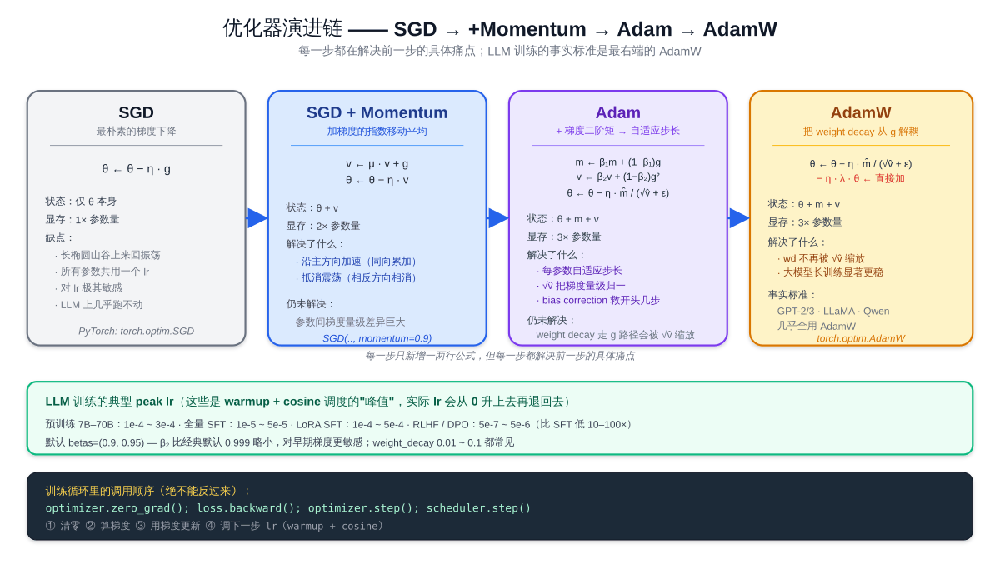
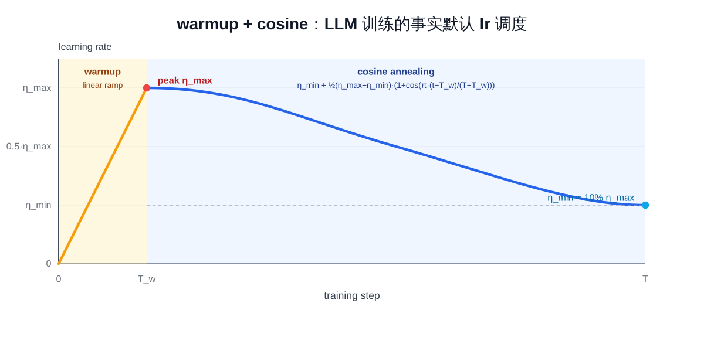

# 预备知识 P04：优化器与学习率调度——SGD / Momentum / Adam / AdamW，warmup + cosine

P02 已经把训练循环的"骨架"立起来了——forward → backward → step → zero_grad。这一章把**第三步「step」**展开讲：拿到 grad 之后，**到底怎么用 grad 去更新参数**？

核心问题就两件：

1. **优化器**：SGD / Momentum / Adam / AdamW 各自怎么算更新量？为什么 LLM 训练几乎一律用 AdamW？
2. **学习率调度**：lr 不是一个数，是一条**随 step 变化的曲线**——为什么要 warmup？为什么训练后期要 cosine 退火？

这两件搞清楚之后，再去读任何一份 LLM 训练脚本，`optimizer = AdamW(...)` 和 `scheduler = get_cosine_schedule_with_warmup(...)` 这两行就不再是黑盒。

> 想直接跑示例？点这里 [](https://colab.research.google.com/github/weiqiangnd/LearningLLM/blob/main/P04.ipynb)。
>
> **硬件门槛**：概念章，CPU 即可✅。本章用一个 1D 二次函数 + `make_moons` 二分类 MLP 演示，参数量极小，CPU 跑几秒。

## 目录

- [一、优化器与学习率调度要解决的问题](#一优化器与学习率调度要解决的问题)
- [二、SGD：最朴素的梯度下降](#二sgd最朴素的梯度下降)
- [三、动量（Momentum）：给更新加惯性](#三动量momentum给更新加惯性)
- [四、Adam：自适应步长](#四adam自适应步长)
  - [4.1 一阶矩与二阶矩](#41-一阶矩与二阶矩)
  - [4.2 偏差修正 bias correction](#42-偏差修正-bias-correction)
  - [4.3 Adam 的更新公式](#43-adam-的更新公式)
- [五、AdamW：weight decay 的"正确解耦"](#五adamwweight-decay-的正确解耦)
- [六、学习率为什么是最重要的超参](#六学习率为什么是最重要的超参)
- [七、warmup：训练初期不要冲太快](#七warmup训练初期不要冲太快)
- [八、cosine 退火：训练后期细致下降](#八cosine-退火训练后期细致下降)
- [九、warmup + cosine：LLM 训练的默认调度配方](#九warmup--cosineLLM-训练的默认调度配方)
- [十、其他常见调度](#十其他常见调度)
- [十一、实战要点 & 常见踩坑](#十一实战要点--常见踩坑)
- [十二、关键概念回顾](#十二关键概念回顾)
- [十三、本节小结](#十三本节小结)

---

## 一、优化器与学习率调度要解决的问题

P02 用了一行 `optimizer = SGD(model.parameters(), lr=0.1)` 就把训练跑通了——但实际写自己的训练脚本时几乎一定会遇到下面这些问题：

- 用 SGD 训 LLM，loss 怎么都不收敛——为什么必须换 AdamW？
- 训练前几百步 loss 突然变 NaN——为什么需要 warmup？
- 同样的模型同样的数据，lr 设 1e-3 和 1e-4 跑出来一个 acc=92% 一个 acc=70%——lr 怎么找？
- 看 LLM 论文里写 "linear warmup over 2000 steps, then cosine decay to 10% of peak lr"——这一句到底在说什么？

把优化器和调度的数学搞清楚，上面每个问题都能用一段话回答。本章前半（§2 ~ §5）讲优化器演进——下图把这条演进链一次画清，每一步都在解决前一步的具体痛点；读完 §2 ~ §5 再回看这张图，所有公式都会落到对应位置：



---

## 二、SGD：最朴素的梯度下降

**SGD（Stochastic Gradient Descent，随机梯度下降）** 的更新规则一行就写完：

$$
\theta_{t+1} = \theta_t - \eta \cdot g_t
$$

其中：
- $\theta_t$ 是第 $t$ 步的参数（向量）
- $g_t = \nabla_\theta \mathcal{L}(\theta_t)$ 是这一 batch 算出来的梯度
- $\eta$ 是**学习率（learning rate, lr）**

直觉：每一步往**当前梯度的反方向**走 $\eta$ 这么远。

最小例子（一维二次函数 $f(\theta) = \theta^2$ ，  $g = 2\theta$ ， $\eta = 0.1$ ）：

```
θ₀ = 1.0
θ₁ = 1.0 - 0.1 · 2·1.0  = 0.8
θ₂ = 0.8 - 0.1 · 2·0.8  = 0.64
θ₃ = 0.64 - 0.1 · 2·0.64= 0.512
... → 0
```

每步乘 0.8 几何衰减，平稳收敛。SGD 的优缺点：

| 优点 | 缺点 |
|------|------|
| 实现简单、显存占用最小（除参数本身外不存额外状态） | 收敛慢；在病态曲面（不同方向曲率差很多）上来回振荡 |
| 在凸问题上收敛性理论清晰 | 对学习率敏感；在 LLM 这种动辄上亿参数的非凸问题里几乎跑不动 |

LLM 训练几乎不直接用纯 SGD——但**理解 SGD 是理解后续所有优化器的起点**：动量、Adam、AdamW 都是在这条公式上加修正项。

---

## 三、动量（Momentum）：给更新加惯性

纯 SGD 在"长长的山谷"型曲面上会**来回震荡**——每一步都按当前点的梯度走，但梯度在两壁之间方向反复变化。**动量**（momentum）借物理直觉，给更新一份"惯性"：

$$
v_{t+1} = \mu \cdot v_t + g_t
$$

$$
\theta_{t+1} = \theta_t - \eta \cdot v_{t+1}
$$

—— $\mu \in [0, 1)$ 叫**动量系数**（常用 0.9）；  $v_t$ 是**梯度的指数加权移动平均**。直觉：更新方向不再只看"当前梯度"，而是把**最近若干步的梯度平均**成一个"主方向"。

效果：
- **沿主方向加速**——历史梯度同向累加越走越快
- **垂直主方向相互抵消**——震荡方向上动量正负相消，振幅压低

PyTorch 里写法：

```python
optimizer = torch.optim.SGD(model.parameters(), lr=0.1, momentum=0.9)
```

LLM 训练里很少单独用 SGD+Momentum——下面要讲的 Adam 已经把这个机制吸进去了。

---

## 四、Adam：自适应步长

SGD（带不带动量）有个根本问题：**所有参数共用同一个 lr**。但参数与参数之间的梯度量级可能差几个数量级——比如 embedding 层的某些 row 几乎没碰过、attention 投影矩阵的某些方向梯度极大。**Adam（Adaptive Moment Estimation）** 的关键想法：**给每个参数估计一个自适应的步长**——梯度大的方向走小步，梯度小的方向走大步。

### 4.1 一阶矩与二阶矩

Adam 同时维护两份指数加权移动平均：

$$
m_{t+1} = \beta_1 \cdot m_t + (1 - \beta_1) \cdot g_t
$$

$$
v_{t+1} = \beta_2 \cdot v_t + (1 - \beta_2) \cdot g_t^2
$$

—— $m$ 是**梯度的均值**（一阶矩，类似动量）；  $v$ 是**梯度平方的均值**（二阶矩，估计每个参数梯度的"方差量级"）。  $g_t^2$ 是**逐元素平方**。

常用默认值： $\beta_1 = 0.9, \beta_2 = 0.999$ 。 $\beta_1$ 决定动量"记忆多久"，  $\beta_2$ 更长（  $1 / (1 - 0.999) = 1000$ 步左右）。

### 4.2 偏差修正 bias correction

由于 $m_0 = v_0 = 0$ 初始化，开头几步的 $m$ 与 $v$ 会**偏低**（被 0 拉小）。Adam 用一个简单修正项把它放大回来：

$$
\hat m_{t+1} = \frac{m_{t+1}}{1 - \beta_1^{t+1}}, \quad \hat v_{t+1} = \frac{v_{t+1}}{1 - \beta_2^{t+1}}
$$

当 $t$ 较大时 $\beta^{t+1} \to 0$ ，分母趋近 1，修正几乎不起作用——这正符合"只在开头修偏差"的意图。

### 4.3 Adam 的更新公式

$$
\theta_{t+1} = \theta_t - \eta \cdot \frac{\hat m_{t+1}}{\sqrt{\hat v_{t+1}} + \epsilon}
$$

—— $\epsilon$ 是个小常数（通常 $10^{-8}$ ），防止除 0。可以这么读：

- 分子 $\hat m$ 提供动量方向
- 分母 $\sqrt{\hat v}$ 把每个参数的梯度按"自身量级"归一化——梯度量级大的方向，等于在分母上除一个大数，**自动减小步长**；反之亦然
- $\eta$ 是全局缩放，所有参数共用

直觉效果：**Adam 几乎不需要逐参数调 lr**——量级被 $\sqrt{\hat v}$ 归一了。这也是为什么 Transformer 训练默认用 Adam 系——参数之间梯度量级差异巨大，纯 SGD 几乎不可能调出一个对所有层都合适的 lr。

PyTorch 写法：

```python
optimizer = torch.optim.Adam(model.parameters(), lr=1e-3, betas=(0.9, 0.999), eps=1e-8)
```

---

## 五、AdamW：weight decay 的"正确解耦"

**Weight decay（权重衰减）** 是常用正则化：每步把参数往 0 拉一点点。原始想法是：

$$
\theta_{t+1} = \theta_t - \eta (g_t + \lambda \theta_t)
$$

—— $\lambda$ 是 weight decay 系数（典型 0.01）。看起来等价于在 loss 里加了一项 $\frac{\lambda}{2} \|\theta\|^2$ 。

但**在 Adam 里这两种实现并不等价**：Adam 会对 $g$ 做 $\sqrt{\hat v}$ 归一化，如果 weight decay 也走 $g$ 这条路，那它会被 $\sqrt{\hat v}$ 一起缩放——参数量级大的层 weight decay 反而被压小。这跟"weight decay 应该平等地拉每个参数往 0"的初衷不一致。

**AdamW（Adam with decoupled Weight decay）** 的修正：把 weight decay **从梯度里拆出来，直接加在最终更新上**：

$$
\theta_{t+1} = \theta_t - \eta \cdot \frac{\hat m_{t+1}}{\sqrt{\hat v_{t+1}} + \epsilon} - \eta \cdot \lambda \cdot \theta_t
$$

—— weight decay 项**不再过 $\sqrt{\hat v}$ 归一化**，回到了"等比拉所有参数往 0"的语义。

效果上 AdamW 比 Adam 在大模型上稳定地更好——这是 GPT-2 / GPT-3 / LLaMA / Qwen 系列预训练**清一色用 AdamW** 的原因。

PyTorch 写法：

```python
optimizer = torch.optim.AdamW(
    model.parameters(),
    lr=1e-4,                    # LLM 预训练典型 1e-4 ~ 6e-4
    betas=(0.9, 0.95),          # β₂ 比 0.999 略小，对早期梯度更敏感
    weight_decay=0.1,           # LLM 上 0.01 ~ 0.1 都常见
    eps=1e-8,
)
```

---

## 六、学习率为什么是最重要的超参

模型架构、初始化、数据混合都重要——但**学习率几乎是最敏感**的那一个：

| lr | 现象 |
|----|------|
| **过大** | loss 在最优点附近来回跳跃；严重时直接爆炸成 NaN |
| **合适** | loss 平滑下降，最终收敛到低位 |
| **过小** | loss 下降但极慢；训练 epoch 跑完也没收敛 |

最直观的视角：把 loss 看成参数空间的一座山，lr 是每一步迈的步长。**步长比"该方向上的曲率半径"还大时，会冲过山谷壁碰到对面山壁**——这就是 lr 太大时 loss 振荡 / 爆炸的几何原因。

LLM 训练里 lr 的典型量级：

| 阶段 | 模型规模 | 典型 peak lr |
|------|---------|-------------|
| 预训练 | 7B ~ 70B | $1 \times 10^{-4}$ ~ $3 \times 10^{-4}$ |
| 全量 SFT | 7B ~ 70B | $1 \times 10^{-5}$ ~ $5 \times 10^{-5}$ |
| LoRA SFT | 7B ~ 70B | $1 \times 10^{-4}$ ~ $5 \times 10^{-4}$ （只训 LoRA 矩阵，lr 可以高一些） |
| RLHF / DPO | 7B ~ 70B | $5 \times 10^{-7}$ ~ $5 \times 10^{-6}$ （比 SFT 低 10 ~ 100 倍） |

注意：**这些 lr 都是"调度的峰值"**——实际训练中 lr 会按下面要讲的 warmup + cosine 形状从 0 升到峰值再退回去。

---

## 七、warmup：训练初期不要冲太快

训练刚启动时，参数随机初始化、梯度方向也"随机"——直接拿峰值 lr 跑很容易把参数推到一个糟糕的位置，loss 立刻爆炸。**Warmup（学习率预热）**：让 lr 在前若干 step 从 0（或一个很小值）**线性升到峰值** $\eta_{\max}$ 。

设 warmup step 数为 $T_w$ ：

$$
\eta_t = \eta_{\max} \cdot \frac{t}{T_w}, \quad t = 0, 1, \ldots, T_w
$$

随后再交给主调度（cosine、constant、linear decay 等）。LLM 训练里 $T_w$ 通常是总 step 数的 1% ~ 10%（比如 2000 step）。

直觉：warmup 让参数先在小 lr 下"找到下山方向"，再用大 lr 加速；省掉了 NaN / 早期不稳定。

> Adam / AdamW 在前几步还有另一个问题——二阶矩 $\hat v$ 估计还不准。warmup 同时缓解了这个问题。

---

## 八、cosine 退火：训练后期细致下降

训练后期参数已经接近最优——大 lr 会让 loss 在最优点附近跳。**Cosine annealing（余弦退火）** 让 lr 从 $\eta_{\max}$ **沿余弦曲线平滑下降**到一个下界 $\eta_{\min}$ ：

$$
\eta_t = \eta_{\min} + \frac{1}{2} (\eta_{\max} - \eta_{\min}) \left( 1 + \cos \frac{\pi (t - T_w)}{T - T_w} \right)
$$

—— $T$ 是总 step 数， $t \in [T_w, T]$ 。形状是一段从 $\eta_{\max}$ 平滑滑到 $\eta_{\min}$ 的余弦曲线， $t = T_w$ 时取 $\eta_{\max}$ 、 $t = T$ 时取 $\eta_{\min}$ 。

为什么用 cosine 而不是简单的 linear decay？两条经验：

- **cosine 在中段下降速度更快、两端更慢**——前段保持高 lr 让模型继续猛下降，后段把 lr 压到很小让参数细调
- **大量 LLM 论文（GPT-3、LLaMA、Qwen 等）均报告 cosine 比 linear / step 退火的最终 loss 略好**

下界 $\eta_{\min}$ 一般取 $\eta_{\max}$ 的 10%（不是直接 0），避免最后几步几乎不动。

---

## 九、warmup + cosine：LLM 训练的默认调度配方

把上面两个拼起来，就是当代 LLM 训练**几乎不变的调度形状**：



形状要点：

- **0 → T_w**：lr 从 0 线性升到 $\eta_{\max}$ ——黄色的 warmup 段
- **T_w → T**：lr 沿余弦曲线从 $\eta_{\max}$ 平滑滑到 $\eta_{\min} \approx 10\% \eta_{\max}$ ——蓝色的 cosine annealing 段
- **下界不为 0**：cosine 末段保留 10% 的 lr，避免最后几千步几乎不更新；想让模型完全停下再走 linear decay 收尾

HuggingFace `transformers` 里就有现成实现：

```python
from transformers import get_cosine_schedule_with_warmup

scheduler = get_cosine_schedule_with_warmup(
    optimizer,
    num_warmup_steps=2000,        # T_w
    num_training_steps=100_000,   # T
)

# 训练循环里
for step in range(100_000):
    loss = ...                      # forward + 算 loss
    optimizer.zero_grad()
    loss.backward()
    optimizer.step()
    scheduler.step()                # 注意：scheduler.step() 在 optimizer.step() 之后调用
```

**`scheduler.step()` 必须在 `optimizer.step()` 之后调**——PyTorch 1.0+ 的约定，反过来 lr 会推迟一步生效（旧代码偶尔能见到反过来写的，是早期遗留）。

---

## 十、其他常见调度

完整起见，简单提一下其他经常见到的调度（细节不展开，遇到了再查）：

| 调度 | 形状 | 用法场景 |
|------|------|---------|
| **constant** | warmup 后恒定 | 小数据 SFT、调试 |
| **linear decay** | warmup 后线性下降到 0 | BERT 论文用的就是这个；现在被 cosine 取代得多 |
| **inverse sqrt** | $\eta_t \propto 1/\sqrt{t}$ | "Attention Is All You Need" 原始 Transformer 训练用的 |
| **cosine with restarts** | 多次 warm restart | 长训练里防止陷在局部最优 |
| **WSD（warmup-stable-decay）** | warmup → 长段 stable → 短段 decay | 一些新论文里在用，可在训练任意时刻"决定收尾" |

---

## 十一、实战要点 & 常见踩坑

| 症状 | 原因 | 解决 |
|------|------|------|
| 训练前几百 step loss 立刻 NaN | 没 warmup / lr 太大 | 加 warmup（典型 500 ~ 2000 step）；把 peak lr 降一档 |
| Loss 震荡、不下降 | lr 太大 / Adam 的 $\beta_2$ 太大遇到稀疏梯度 | 降 lr；试试 $\beta_2 = 0.95$ |
| Loss 缓慢下降但最终很差 | lr 太小、weight decay 太大 | 加大 lr；weight decay 从 0.1 调到 0.01 |
| 同样配置换大 batch size 后 loss 变差 | 大 batch 一步迈得"太大" | 经验法则：lr 随 batch size 开根号 / 线性增长（具体看模型） |
| `scheduler.step()` 写在 `optimizer.step()` 之前 | API 顺序写反了 | 调换顺序；新版 PyTorch 会 warning |
| `optimizer.step()` 之后忘了 `optimizer.zero_grad()` | 梯度累加，下一步更新被严重放大 | 三件套：`zero_grad → backward → step`，或把 `zero_grad` 放在循环最后；**不要漏** |
| LoRA 只想训练 LoRA 矩阵，发现优化器把全量参数都列进去了 | 没过滤 `requires_grad` | `optim.AdamW([p for p in model.parameters() if p.requires_grad], ...)` |

LR 怎么找的实操建议：

1. **看同类工作**——同规模模型 + 同优化器 + 同 batch 设置，从论文 / 框架默认值入手
2. **lr range test**：从一个极小 lr（如 $10^{-7}$ ）开始，几百步内指数升到 $10^{-1}$ ，画 loss vs lr——loss 开始急速下降前的那个 lr 通常就是合适的 peak
3. **再 ±2 倍微调**——通常不需要在 $\pm 5\%$ 这种粒度上调

---

## 十二、关键概念回顾

| 概念 | 一句话定义 | 用途 |
|------|-----------|------|
| SGD | $\theta \leftarrow \theta - \eta g$ | 优化器的起点；现代深度学习几乎不直接用 |
| Momentum | 加上梯度的指数移动平均 $v$ | 抑制震荡、沿主方向加速 |
| Adam | 同时维护一阶矩 $m$ 和二阶矩 $v$ ，按 $\sqrt{v}$ 归一化更新 | 给每个参数自适应步长 |
| Bias correction | 修正 $m, v$ 在初始几步的偏低估计 | 让 Adam 在前几十步也能正确更新 |
| AdamW | 把 weight decay 从梯度路径里拆出来，直接加在更新上 | LLM 预训练 / SFT 的事实标准优化器 |
| Weight decay | 每步把参数往 0 拉 $\eta \lambda \theta$ | 正则化，防止参数无限增大 |
| 学习率 lr | 每步沿负梯度方向走多远 | 最敏感的超参；典型 $10^{-7}$ ~ $10^{-3}$ 之间 |
| Warmup | lr 从 0 线性升到 peak | 防止训练初期 NaN、缓解 Adam 早期 $\hat v$ 估计不准 |
| Cosine 退火 | lr 从 peak 沿余弦平滑滑到 $\eta_{\min}$ | 训练后期细调，最终 loss 一般优于 linear / step |
| warmup + cosine | LLM 训练事实默认调度 | GPT / LLaMA / Qwen 系列预训练都是这个形状 |

---

## 十三、本节小结

这一章把"step 一步到底怎么走"讲全了：

- **SGD → Momentum → Adam → AdamW** 是一条由简到繁的演进——每一步都在解决前一个的具体痛点
- **AdamW 是 LLM 训练的事实标准**——它把 weight decay 从梯度路径里解耦，避免了 Adam 里 weight decay 被 $\sqrt{\hat v}$ 缩放的副作用
- **lr 是最敏感的超参**——量级直接决定训练成败，调试时优先调它
- **warmup + cosine** 是 LLM 训练几乎不变的调度形状：开头线性升、主体段 cosine 下降到 10% peak

ipynb 里的实战部分会做四件事：在二次函数上把 SGD / Momentum / Adam 的轨迹画出来、用 lr 太大 / 适中 / 太小三种取值跑同一个模型对比 loss 曲线、把 warmup + cosine 调度的 lr 形状画清楚、最后在 `make_moons` 上对比四种优化器的训练曲线。

**预告 P05**：下一章把强化学习的"够用版"语言讲清楚——MDP / policy / value / REINFORCE / policy gradient——为后续读 PPO / DPO / GRPO 这些对齐方法打底。
