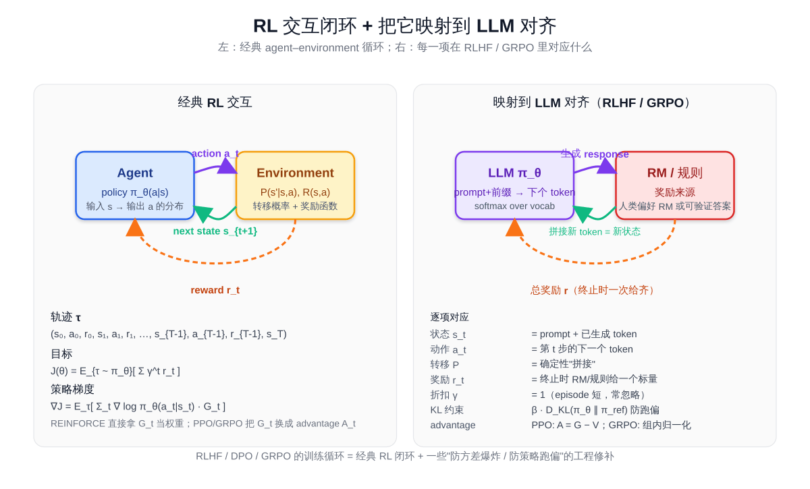

# 预备知识 P05：强化学习够用版——MDP / policy / value / REINFORCE / policy gradient

LLM 训练里"对齐"那一段（RLHF / PPO / DPO / GRPO / RLVR）几乎全部建立在**强化学习（Reinforcement Learning, RL）** 的语言上。可它的语言又跟前面几章的"监督学习"很不一样：没有"标签"、要跟"环境"互动、奖励还可能稀疏。

直接读 PPO 论文常常一开篇就被 $\pi_\theta(a \mid s)$ 、 $V^\pi(s)$ 、 $A^\pi(s, a)$ 、 $\nabla_\theta \mathbb{E}\_{\tau \sim \pi_\theta}[R(\tau)]$ 这一串符号劝退。这一章不做严谨教材式推导，而是用最少的数学把"够读懂 PPO 入门"的几件事讲清楚：

- **MDP（马尔可夫决策过程）** 是 RL 的统一语言——状态、动作、奖励、策略
- **策略梯度（policy gradient）** 是把"调参数让奖励变大"形式化下来的一条公式
- **REINFORCE** 是策略梯度最朴素的实现，是 PPO / GRPO 的"祖先"
- 把上面这几件**映射到 LLM**——状态是 prompt + 已生成 token、动作是下一个 token、奖励来自 RM 或可验证规则

读完这一章再去看 PPO / GRPO，就只是"REINFORCE + 几条防发散的修补"而已。

> 想直接跑示例？点这里 [](https://colab.research.google.com/github/weiqiangnd/LearningLLM/blob/main/P05.ipynb)。
>
> **硬件门槛**：概念章，CPU 即可✅。本章的 REINFORCE 实战用 `gymnasium` 自带的 CartPole-v1 环境 + 一个 4→32→2 的小策略网络，CPU 几十秒训到收敛。

## 目录

- [一、为什么 LLM 需要 RL](#一为什么-llm-需要-rl)
- [二、MDP：RL 的统一语言](#二mdprl-的统一语言)
  - [2.1 五元组 (S, A, P, R, γ)](#21-五元组-s-a-p-r-γ)
  - [2.2 一条 trajectory](#22-一条-trajectory)
  - [2.3 累计回报 G_t 与 γ](#23-累计回报-g_t-与-γ)
- [三、策略 policy 与价值 value](#三策略-policy-与价值-value)
  - [3.1 策略 π(a|s)](#31-策略-πas)
  - [3.2 状态价值 V 与动作价值 Q](#32-状态价值-v-与动作价值-q)
  - [3.3 优势 advantage](#33-优势-advantage)
- [四、目标函数：期望累计回报](#四目标函数期望累计回报)
- [五、Policy Gradient 定理](#五policy-gradient-定理)
- [六、REINFORCE 算法](#六reinforce-算法)
- [七、降方差：baseline 与 advantage](#七降方差baseline-与-advantage)
- [八、从 RL 到 LLM 对齐](#八从-rl-到-llm-对齐)
- [九、关键概念回顾](#九关键概念回顾)
- [十、本节小结](#十本节小结)

---

## 一、为什么 LLM 需要 RL

LLM 的预训练和 SFT 都是**监督学习**——给定一段文本，让模型尽量预测出训练数据里的下一个 token。但「**让回答更有帮助、更不胡说、更符合人类偏好**」这件事，监督信号难给：

- 同一个 prompt 可以有很多个"好"回答，没有唯一标签
- "好"是个偏好排序：A 比 B 好，但说不出 A 是不是"对"
- 有些任务（数学题、代码题）有可验证答案，但中间推理过程没监督

RL 的范式正好对路：**让模型自己生成回答，然后用一个"打分器"给它反馈**——打分器可以是人工标注训练出的奖励模型（RM），也可以是可验证规则（如代码能不能跑通、数学答案对不对）。模型按"使总分尽可能高"的方向调参数。

这就是 **RLHF / RLVR** 的内核：

| 方法 | 奖励来源 |
|------|---------|
| **RLHF**（如 InstructGPT、Claude） | 人类偏好 → 训练 RM → RM 给打分 |
| **RLVR**（如 DeepSeek-R1 用 GRPO） | 可验证答案 → 直接判对错 |
| **DPO 系列** | 不显式做 RL，但可以从 RL 视角推导 |

要读懂这些，必须先有 RL 的语言。这一章给的就是"语言"。

---

## 二、MDP：RL 的统一语言

下面这张图先把"经典 agent–environment 交互闭环"画出来，再把同一套语言映射到 LLM 对齐——本节剩下的所有概念（状态、动作、奖励、策略、轨迹、目标函数、策略梯度）在右侧都能找到 LLM 里的对应物：



### 2.1 五元组 (S, A, P, R, γ)

**马尔可夫决策过程（Markov Decision Process, MDP）** 由五件东西描述：

| 符号 | 名字 | 含义 |
|------|------|------|
| $\mathcal{S}$ | 状态空间 | 所有可能的"环境状态" $s$ |
| $\mathcal{A}$ | 动作空间 | 所有可能的"动作" $a$ |
| $P(s' \mid s, a)$ | 转移概率 | 在 $s$ 选 $a$ 后转到 $s'$ 的概率 |
| $R(s, a)$ | 奖励函数 | 在 $s$ 选 $a$ 立刻拿到的标量奖励 |
| $\gamma \in [0, 1)$ | 折扣因子 | 未来奖励衰减系数 |

**马尔可夫性质**：转到下一状态只依赖于当前 $(s, a)$ ，与历史无关。这条假设让动态规划与所有 RL 算法成立——一旦不成立（部分可观测、有长程依赖），需要把"最近若干帧"打包成新的"状态"再套这套语言。

最小例子（一个 4 状态 grid world）：

```
S → s0 → s1 → s2 → goal      γ = 0.9
        a0    a0    a0
状态空间 S = {s0, s1, s2, goal}
动作空间 A = {向右}
转移      P 是确定性：选 a0 一定走到下一格
奖励      R(任意非 goal, a0) = 0
         R(goal 之前一格, a0) = +1（走到 goal 立刻拿 +1）
```

### 2.2 一条 trajectory

智能体（agent）按某个**策略**与环境交互，会产生一条**轨迹（trajectory / episode）**：

$$
\tau = (s_0, a_0, r_0, s_1, a_1, r_1, \ldots, s_{T-1}, a_{T-1}, r_{T-1}, s_T)
$$

—— $s_0$ 是初始状态、 $a_t$ 是 $t$ 时刻的动作、 $r_t = R(s_t, a_t)$ 是即时奖励、 $s_{t+1} \sim P(\cdot \mid s_t, a_t)$ 。  $T$ 是 episode 长度（CartPole 里走到杆倒下、LLM 里走到生成 EOS）。

### 2.3 累计回报 G_t 与 γ

从 $t$ 时刻开始的**累计折扣回报（return）**：

$$
G_t = r_t + \gamma r_{t+1} + \gamma^2 r_{t+2} + \cdots = \sum_{k=0}^{\infty} \gamma^k r_{t+k}
$$

折扣因子 $\gamma$ 起两个作用：

- **数学保证收敛**：哪怕 episode 无限长，总和也是有限的（几何级数）
- **建模"近期奖励更重要"**：人类决策也偏好近期收益； $\gamma$ 越接近 1 越远视、越接近 0 越短视

LLM 对齐里 $\gamma$ 通常取 1（episode 短、奖励出现在终止时一次给齐），所以折扣这件事在 LLM 训练里偶尔被省略；但在 CartPole 这类经典控制 / 长 episode 任务里  $\gamma = 0.99$ 是常用值。

---

## 三、策略 policy 与价值 value

### 3.1 策略 π(a|s)

**策略（policy）** 是 agent 的"行为方式"：在状态 $s$ 选动作 $a$ 的概率分布。

$$
\pi(a \mid s)
$$

策略可以是：
- **确定性的**： $a = \pi(s)$ ，给定状态就给一个动作
- **随机的**：在 $s$ 状态下按 $\pi(a \mid s)$ 抽样

**带参数的策略** $\pi_\theta(a \mid s)$ 是一个**用 $\theta$ 参数化的概率分布**——比如一个神经网络，输入 $s$ 输出动作的 logits，过 softmax 就是 Categorical 分布。LLM 本身就是这样一个策略：输入"prompt + 已生成 token"，输出"下一个 token 的概率分布"。

> 这正是为什么 P03 讲的概率与 softmax 在 RL 里立刻派上用场。

### 3.2 状态价值 V 与动作价值 Q

固定策略 $\pi$ ，定义两个值函数：

$$
V^\pi(s) = \mathbb{E}\_\pi \left[ G_t \mid s_t = s \right]
$$

—— **状态价值**：从 $s$ 起，按 $\pi$ 行动，期望能拿多少累计回报。

$$
Q^\pi(s, a) = \mathbb{E}\_\pi \left[ G_t \mid s_t = s, a_t = a \right]
$$

—— **动作价值**：在 $s$ **先选定** $a$ 这一步、之后按 $\pi$ 走，期望能拿多少累计回报。

两者关系：

$$
V^\pi(s) = \sum_a \pi(a \mid s) Q^\pi(s, a)
$$

—— 状态价值是动作价值按策略加权平均。

### 3.3 优势 advantage

$$
A^\pi(s, a) = Q^\pi(s, a) - V^\pi(s)
$$

—— **优势**：在 $s$ 选 $a$ 比"按当前策略平均水平"好多少。  $A > 0$ 表示这个动作比平均好， $A < 0$ 表示比平均差。  $A$ 的"零均值化"性质在策略梯度里非常关键，下文会讲。

---

## 四、目标函数：期望累计回报

RL 的训练目标：**找一组 $\theta$ 让按 $\pi_\theta$ 走出来的轨迹期望回报最大**。

$$
J(\theta) = \mathbb{E}\_{\tau \sim \pi_\theta} \left[ R(\tau) \right] = \mathbb{E}\_{\tau \sim \pi_\theta} \left[ \sum_{t=0}^{T-1} \gamma^t r_t \right]
$$

接下来要做的事：**对 $\theta$ 求 $J$ 的梯度**，再用 P04 学的梯度下降（其实是上升， $\theta \leftarrow \theta + \eta \nabla J$ ）调参数。问题是—— $r_t$ 是环境给的，不可微；而且 $\tau$ 的分布本身依赖 $\theta$ 。直接对 $J$ 求导的链式法则没法走通。

**Policy Gradient 定理**就是解决这一步的关键工具。

---

## 五、Policy Gradient 定理

定理（不严谨叙述）：

$$
\nabla_\theta J(\theta) = \mathbb{E}\_{\tau \sim \pi_\theta} \left[ \sum_{t=0}^{T-1} \nabla_\theta \log \pi_\theta(a_t \mid s_t) \cdot G_t \right]
$$

直觉读法（**最值得记的一段话**）：

> 对每条轨迹的每一步 $(s_t, a_t)$ ，把"在这个状态下选这个动作的对数概率"求一次梯度，再**乘上从这一步开始拿到的累计回报 $G_t$**——这就是策略梯度的方向。

直觉：

- $G_t$ 大（这步之后总收益高）→ 把 $\log \pi_\theta(a_t \mid s_t)$ **推大**，下次更愿意在 $s_t$ 选 $a_t$
- $G_t$ 小或负 → 把 $\log \pi_\theta(a_t \mid s_t)$ **推小**，下次更不愿意在 $s_t$ 选 $a_t$

这就是 RL 的"试错—强化"机制用一条公式写出来的样子。最关键的一点是： **这条公式不需要对环境的奖励 $r_t$ 求导**——只需要对策略对数概率求导，环境怎么算奖励完全是黑盒。

> 数学上之所以能成立，本质上用了 "log-derivative trick"： $\nabla_\theta \pi_\theta = \pi_\theta \nabla_\theta \log \pi_\theta$ ，把"对分布求导"换成"对样本求 $\log$ 概率的导数 + 期望加权"。这一章不展开推导。

---

## 六、REINFORCE 算法

把 Policy Gradient 定理写成一个最小可执行的算法，就是 **REINFORCE**（蒙特卡洛策略梯度）：

```
Initialize policy network π_θ (随机初始化)

for episode in 1, 2, ...:
    1. 用当前 π_θ 跑一条完整 trajectory
       τ = (s_0, a_0, r_0, ..., s_{T-1}, a_{T-1}, r_{T-1})
    2. 从后往前算每个时刻的 return G_t
       G_{T-1} = r_{T-1}
       G_t     = r_t + γ G_{t+1}        (t = T-2 ... 0)
    3. 估计策略梯度：
       ĝ = Σ_t G_t · ∇_θ log π_θ(a_t | s_t)
    4. 上升：
       θ ← θ + η ĝ                       (== 下降 -ĝ；P04 的优化器一样能用)
```

放进 PyTorch 的训练循环里写法：

```python
# 假设 policy 是 4 → 32 → 2 的 MLP，输出 raw logits
# 状态 s ∈ R^4（CartPole）；动作 a ∈ {0, 1}
# gymnasium 的 step() 返回 5 元组 (obs, reward, terminated, truncated, info)
# reset() 返回 (obs, info) 元组——这套 API 与早期 gym 的 4 元组写法不兼容

for ep in range(n_episodes):
    # ---- ① rollout：用当前策略走完一条 episode ----
    s, _ = env.reset(seed=seed * 1000 + ep)
    states, actions, rewards = [], [], []
    while True:
        s_t = torch.as_tensor(s, dtype=torch.float32)
        logits = policy(s_t)                                  # (2,)
        dist   = torch.distributions.Categorical(logits=logits)
        a      = dist.sample().item()
        s2, r, terminated, truncated, _ = env.step(a)
        states.append(s); actions.append(a); rewards.append(r)
        s = s2
        if terminated or truncated:
            break

    # ---- ② 算每步的 return G_t ----
    returns = torch.tensor(discount_returns(rewards, gamma), dtype=torch.float32)
    # ★ baseline：把 returns 减去均值除以标准差 —— 简单粗暴但极有效
    if use_baseline:
        returns = (returns - returns.mean()) / (returns.std() + 1e-8)

    # ---- ③ 重新 forward 整条 trajectory，拿到 log π(a|s) ----
    states_t  = torch.as_tensor(np.array(states), dtype=torch.float32)
    actions_t = torch.as_tensor(actions, dtype=torch.long)
    logits_t  = policy(states_t)                               # (T, 2)
    log_probs = torch.distributions.Categorical(logits=logits_t).log_prob(actions_t)  # (T,)

    # ---- ④ REINFORCE loss = -E[ log π(a|s) · G ]  ----
    # 注意取负号：PyTorch 优化器是做 minimization 的；要"最大化 J"就把 loss 写成 -J
    loss = -(log_probs * returns).mean()
    optim.zero_grad()
    loss.backward()
    optim.step()
```

其中 `discount_returns` 是一个手写的小函数，从后往前把 $G_t = r_t + \gamma G_{t+1}$ 算出来：

```python
def discount_returns(rewards, gamma):
    """从后往前算 G_t = r_t + γ r_{t+1} + γ^2 r_{t+2} + ...  (本节 §2.3 公式)"""
    G = 0.0
    out = []
    for r in reversed(rewards):
        G = r + gamma * G
        out.insert(0, G)
    return out
```

**注意 loss 那行的负号**——PyTorch 优化器是做最小化的，要"上升 J"就把 loss 写成 $-(...)$ 。这跟 cross-entropy 取负号同源——都是把"最大化"翻译成"最小化"。

**`terminated` vs `truncated` 是 gymnasium 0.26+ 的新约定**：`terminated=True` 表示环境本身结束（CartPole 杆倒下、Atari 游戏死亡），`truncated=True` 表示外部超时强制截断（如 CartPole-v1 设了 500 步上限）。计算回报时通常两者都触发"episode 结束"，但理论上 `truncated` 时还应该 bootstrap 估计未来回报；CartPole 这种短任务忽略这个细节也无妨。

REINFORCE 的优缺点：

| 优点 | 缺点 |
|------|------|
| 极简，几乎是 RL 的"hello world" | 方差极大——同一个 $\theta$ 跑两条轨迹 $G$ 可能差很多，梯度方向不稳 |
| 不需要任何关于环境的额外假设 | 每步样本只用一次（on-policy），样本效率低 |
| 思想直接、容易写对 | 在 LLM 这种长序列、稀疏奖励的设置下几乎不能直接用 |

下面要讲的 baseline / advantage / PPO / GRPO 全是为了**降方差 + 提升样本效率**的修补。

---

## 七、降方差：baseline 与 advantage

REINFORCE 用 $G_t$ 当权重——但 $G_t$ 的"绝对值"对策略梯度并不本质，**重要的是"这次比平均好还是差"**。把  $G_t$ 减去一个**只依赖状态的 baseline $b(s_t)$**，期望不变（数学上这是个"零项"），方差却能大幅下降：

$$
\nabla_\theta J(\theta) = \mathbb{E}\_{\tau \sim \pi_\theta} \left[ \sum_t \nabla_\theta \log \pi_\theta(a_t \mid s_t) \cdot \big( G_t - b(s_t) \big) \right]
$$

最简单的 baseline 是把 batch 里所有 $G_t$ 减去它们的均值（或除以标准差做归一化）——一行代码，立竿见影：

```python
returns = (returns - returns.mean()) / (returns.std() + 1e-8)
```

更进一步，把 $b(s_t)$ 换成 **状态价值估计 $V^\pi(s_t)$**（再训一个值网络 $V_\phi$ 来估计），就得到 $G_t - V_\phi(s_t)$ ——这就是**优势（advantage）的估计**。当今主流的 actor-critic 系（A2C / PPO / GAE）核心都是这个想法的精修版本：

- **PPO** = REINFORCE + 重要性采样比例 + 剪切（clip）让一个 batch 数据能用多步、并防止策略更新过大
- **GRPO**（DeepSeek-R1 用的） = 不显式训练 V，把同一个 prompt 的 N 条 rollout 拿去算组内 baseline；省一个网络

REINFORCE 是这一切的基础——**真正读懂 PPO 的捷径就是先把 REINFORCE 的代码自己写一遍**。

---

## 八、从 RL 到 LLM 对齐

把 RL 的语言映射到 LLM 训练上：

| RL 概念 | LLM 对齐里的对应物 |
|---------|------------------|
| 状态 $s_t$ | prompt + 已经生成的前 $t-1$ 个 token |
| 动作 $a_t$ | 第 $t$ 步生成的下一个 token |
| 策略 $\pi_\theta(a \mid s)$ | LLM 在当前上下文的输出 softmax 分布 |
| 转移 $P(s' \mid s, a)$ | 确定性："拼接上新 token" |
| 即时奖励 $r_t$ | 生成中间几乎都是 0；终止时由 RM 或可验证规则一次给出 |
| episode 终止 | 生成 EOS / 到最大长度 |
| 折扣因子 $\gamma$ | 一般取 1（episode 短、奖励集中在末尾） |
| 累计回报 $G_t$ | 终止时的总奖励（中间步 $G_t$ 几乎等于终止奖励） |
| 优势 $A_t$ | 总奖励减去 baseline；GRPO 里就是组内归一化的回报 |
| 策略梯度 | $\nabla_\theta \log \pi_\theta(\text{token}_t \mid \text{prompt} + \text{prev tokens}) \cdot A_t$ |
| KL 约束 $\beta D_{\text{KL}}(\pi_\theta \| \pi_{\text{ref}})$ | 让对齐后的模型不要离 SFT 模型 / 预训练模型太远——P03 里讲过 |

把这张表合并 P03 里"概率分布 / log-likelihood / KL"的概念，PPO / GRPO 的论文里几乎所有数学符号你都能找到位置。RLHF 的训练循环，框架长这样：

```
for prompt in dataset:
    # 1. rollout：用当前 LLM 策略生成回答
    response = LLM_θ.generate(prompt)
    # 2. score：奖励模型 / 规则给打分
    r = reward_model(prompt, response)            # 标量
    # 3. policy gradient：把每个生成 token 当一步动作，用 r 当回报，做策略梯度
    loss = -Σ_t log π_θ(token_t | prompt + prev tokens) · A_t
         + β · KL(π_θ || π_ref)                   # 防止跑偏
    loss.backward()
    optimizer.step()
```

每一步在做的事，本质上就是 REINFORCE + 一些工程修补。

---

## 九、关键概念回顾

| 概念 | 一句话定义 | LLM 对齐里的位置 |
|------|-----------|------------------|
| MDP | 状态、动作、转移、奖励、γ 五元组 | RL / 对齐论文的统一语言 |
| 策略 $\pi(a \mid s)$ | 状态到动作的概率分布 | LLM 本身就是一个策略 |
| 价值 $V^\pi(s)$ | 从 $s$ 起按 $\pi$ 行动的期望累计回报 | actor-critic 中 critic 估计的对象 |
| Q 函数 $Q^\pi(s, a)$ | 在 $s$ 选 $a$ 后按 $\pi$ 行动的期望累计回报 | 老式 RL 学 Q 网络的对象 |
| 优势 $A^\pi(s, a)$ | $Q - V$ ，"这个动作比平均好多少" | PPO / GRPO 用来当策略梯度的权重 |
| 累计回报 $G_t$ | 从 $t$ 起的折扣奖励之和 | LLM 里 episode 短，常等于终止奖励 |
| 策略梯度定理 | $\nabla J = \mathbb{E}[\sum_t \nabla \log \pi(a_t \mid s_t) \cdot G_t]$ | 一切 policy-based RL 的核心公式 |
| REINFORCE | 用 trajectory 蒙特卡洛估计策略梯度 | PPO / GRPO 的祖先 |
| Baseline / advantage | 把 $G_t$ 减去状态相关 baseline，降低方差 | GRPO 用"组内归一化"实现，PPO 用 critic 网络估 |
| KL 约束 | $\beta \cdot D_{\text{KL}}(\pi_\theta \| \pi_{\text{ref}})$ | RLHF / DPO 防止策略跑偏的硬约束 |

---

## 十、本节小结

这一章把强化学习里"够看懂 PPO 入门"的最小集合讲清楚了：

- **MDP** 的五元组 + 马尔可夫性给所有 RL 算法一个统一语言
- **策略 / 价值 / 优势**——从动作的概率分布、到状态值、到"这步比平均好多少"，三层概念按需展开
- **策略梯度定理**让"调参数最大化期望回报"有了可计算的形式，核心是  $\nabla_\theta \log \pi_\theta(a \mid s) \cdot G$
- **REINFORCE** 是策略梯度最朴素的实现，是 PPO / GRPO 的基础
- **降方差**靠 baseline / advantage——这是从 REINFORCE 走到 PPO / GRPO 的关键修补
- **从 RL 到 LLM**：状态 = prompt + 前缀、动作 = 下一个 token、奖励 = RM 或可验证规则；KL 约束防止策略跑偏

ipynb 里的实战部分会做这几件事：用 `gymnasium` 跑一遍 CartPole-v1，先看随机策略表现 → 实现一个 4→32→2 的策略网络 → 用 REINFORCE 训到收敛 → 加一个简单 baseline 看方差有多明显地下降；再演示一个最小的"LLM 风格"采样—评分—更新闭环，把上面"RL 到 LLM"的映射用代码实证一遍。

到这里，**阶段 0 的五份预备知识就齐了**——P01 张量与 autograd、P02 训练循环骨架、P03 概率与信息论、P04 优化器与调度、P05 强化学习——任何 LLM 学习路径里的"基础数学+ PyTorch 工具"都能从这五章里找到。这五份预备知识不要求一次读完，建议在用到对应工具时再回头补齐对应一章。
