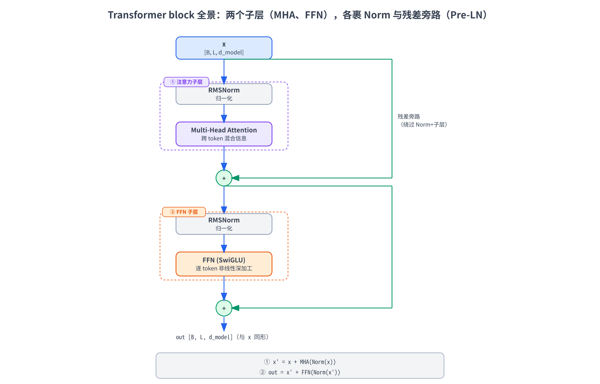
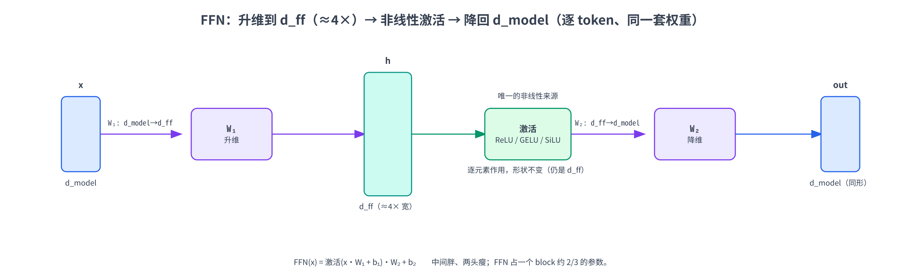
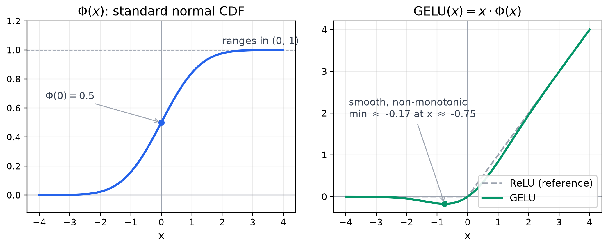
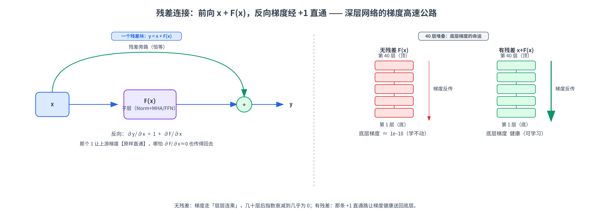
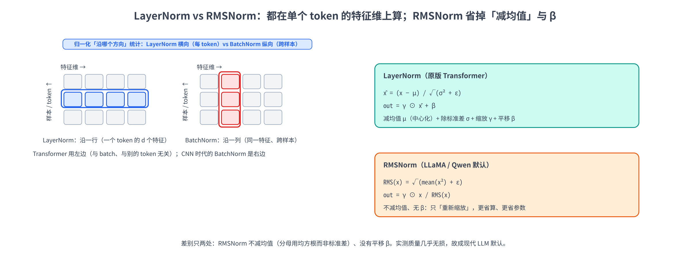
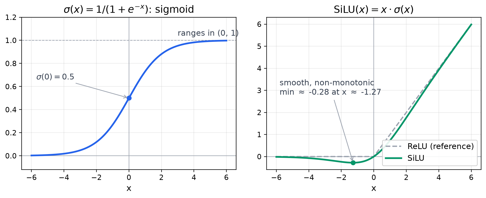
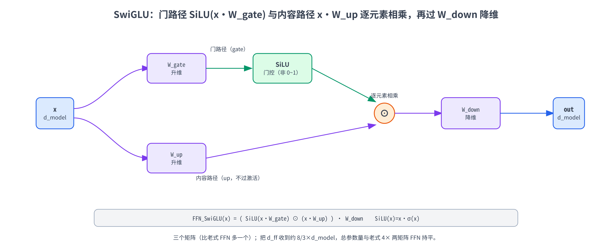

# 第八章：FFN、残差连接与归一化（含 SwiGLU）

第 6、7 章我们把注意力从「一个头」搭到了「多头 + GQA」，也就是 Transformer block 里负责 **token 之间互相看** 的那半边。但一个真正的 Transformer 层光有注意力还不够——注意力之后还跟着一个 **FFN（前馈网络）**，负责让每个 token **自己再深加工一遍**；而把这两块（注意力、FFN）真正粘成一个能堆几十层、还训得动的深层网络，靠的是两个看起来不起眼、实则缺一不可的工程基石：**残差连接（residual connection）** 和 **归一化（normalization）**。

这一章就把这后半边讲透。我们要回答四个问题：

- **FFN 是什么、为什么需要它？** 注意力本质上是对 value 的加权平均（一种线性的信息混合），缺的是「逐 token 的非线性深加工」。FFN 正是来补这一环——它是 Transformer 里参数量最大的一块。
- **残差连接为什么是深层网络的关键？** 几十层叠起来，梯度一路反传很容易消失或爆炸。残差给梯度修了一条「高速公路」，让信号直达底层——没有它，深层 Transformer 根本训不起来。
- **为什么要归一化，又为什么是 LayerNorm 而不是 BatchNorm？** 再进一步，现代大模型为什么几乎都改用了更省的 **RMSNorm**？
- **SwiGLU 是怎么把老式 FFN 升级的？** LLaMA、Qwen 这些现代模型的 FFN 早就不是「两层线性 + ReLU」了，而是带门控的 SwiGLU——它好在哪、参数量怎么对齐？

把这些零件凑齐，再和第 7 章的多头注意力拼在一起，**一个完整的 Transformer block 就成型了**（本章第 6 节会亲手拼出来；至于几十个 block 怎么叠成完整模型、Pre-LN 与 Post-LN 的取舍，留到第 9 章）。

实战部分依旧 **全程 CPU、纯 PyTorch**：从零实现 FFN、用一个深层堆叠验证残差对梯度的救命作用、手写 LayerNorm / RMSNorm 并和官方对齐、搭出 SwiGLU 并算清它的参数量、最后把所有零件拼成一个完整的 Transformer block，并读 Qwen3-8B config 看真实模型的 FFN 宽度与归一化配置。

> 想直接跑示例？点这里 [](https://colab.research.google.com/github/weiqiangnd/LearningLLM/blob/main/src/08.ipynb)。
>
> **硬件门槛**：概念章，CPU 即可 ✅。本章只在维度 ≤ 64 的玩具张量上做矩阵乘法、训几十步小网络，Colab 免费 CPU 运行时秒级跑完，**不需要 GPU**。

## 目录

- [一、从注意力到完整的 Transformer block](#一从注意力到完整的-transformer-block)
- [二、FFN：逐位置的前馈网络](#二ffn逐位置的前馈网络)
  - [2.1 FFN 长什么样：升维 → 激活 → 降维](#21-ffn-长什么样升维--激活--降维)
  - [2.2 position-wise：每个 token 各过各的，同一套权重](#22-position-wise每个-token-各过各的同一套权重)
  - [2.3 为什么需要 FFN：注意力缺的那块非线性](#23-为什么需要-ffn注意力缺的那块非线性)
  - [2.4 激活函数：从 ReLU 到 GELU](#24-激活函数从-relu-到-gelu)
- [三、残差连接：让深层网络训得动](#三残差连接让深层网络训得动)
  - [3.1 深层网络的梯度难题](#31-深层网络的梯度难题)
  - [3.2 残差的形式：x + Sublayer(x)](#32-残差的形式x--sublayerx)
  - [3.3 为什么有效：一条梯度高速公路](#33-为什么有效一条梯度高速公路)
- [四、归一化：LayerNorm 与 RMSNorm](#四归一化layernorm-与-rmsnorm)
  - [4.1 为什么要归一化](#41-为什么要归一化)
  - [4.2 LayerNorm：在特征维上做标准化](#42-layernorm在特征维上做标准化)
  - [4.3 为什么是 LayerNorm 而不是 BatchNorm](#43-为什么是-layernorm-而不是-batchnorm)
  - [4.4 RMSNorm：去掉均值中心化的精简版](#44-rmsnorm去掉均值中心化的精简版)
- [五、SwiGLU：现代 LLM 的 FFN 升级](#五swiglu现代-llm-的-ffn-升级)
  - [5.1 GLU：给线性层加一道门控](#51-glu给线性层加一道门控)
  - [5.2 SwiGLU 与参数量对齐](#52-swiglu-与参数量对齐)
- [六、拼成一个完整的 Transformer block](#六拼成一个完整的-transformer-block)
- [七、几个常见疑问](#七几个常见疑问)
- [八、实战：从零搭出 Transformer block 的后半边](#八实战从零搭出-transformer-block-的后半边)
  - [8.1 环境自检与依赖](#81-环境自检与依赖)
  - [8.2 从零实现 FFN](#82-从零实现-ffn)
  - [8.3 残差连接：验证梯度高速公路](#83-残差连接验证梯度高速公路)
  - [8.4 手写 LayerNorm 与 RMSNorm](#84-手写-layernorm-与-rmsnorm)
  - [8.5 从零实现 SwiGLU](#85-从零实现-swiglu)
  - [8.6 拼出一个完整的 Transformer block](#86-拼出一个完整的-transformer-block)
  - [8.7 读 Qwen3 config：真实模型的 FFN 与归一化](#87-读-qwen3-config真实模型的-ffn-与归一化)
- [九、关键概念回顾](#九关键概念回顾)
- [十、本章小结](#十本章小结)

---

## 一、从注意力到完整的 Transformer block

先把镜头拉远，看清这一章在整块拼图里的位置。一个 Transformer block（也叫一个 Transformer 层）由**两个子层**（sublayer）串起来：

1. **多头注意力子层**——第 7 章讲的那块，负责让序列里的 token **互相看**、交换信息；
2. **FFN 子层**——本章的主角，负责让**每个 token 拿着自己（已经吸收了上下文的）那个向量，再独立做一次非线性深加工**。

光把这两块前后接起来还不够。真实模型要把这样的 block 叠**几十层**（Qwen3-8B 是 36 层），而「深」会带来两个老大难问题：梯度反传时容易消失 / 爆炸、各层激活值的数值尺度容易飘。**残差连接**和**归一化**就是来优化这两个问题的——它们像脚手架一样裹在每个子层外面，让几十层能稳稳地训起来。

所以一个现代 Transformer block 的标准结构是（这里先给出现代大模型通用的 **Pre-LN** 排布，即归一化放在子层**之前**；Pre-LN 与早期 Post-LN 的取舍是第 9 章的话题，本章先用这套来搭积木）：

```
       x ──┬─────────────────────────────┐
           │                             │
        [Norm] → [Multi-Head Attention] ─┤(+)   ← 注意力子层 + 残差
           │                             │
           └──────────────► x' ──────────┘
                            │
      x' ──┬────────────────────────────┐
           │                            │
        [Norm] → [    FFN    ] ─────────┤(+)    ← FFN 子层 + 残差
           │                            │
           └──────────────► out ────────┘
```

写成公式就是两行（ $\text{Norm}$ 是 LayerNorm 或 RMSNorm， $\text{MHA}$ 是第 7 章的多头注意力）：

$$
x' = x + \text{MHA}(\text{Norm}(x))
$$

$$
\text{out} = x' + \text{FFN}(\text{Norm}(x'))
$$

这里多说一句两行里开头的 $x +$ 、 $x' +$ ：你可能会问，MHA / FFN 不是已经算出结果了，为什么还要再把 $x$ 加回去？因为子层（ $\text{MHA}$ / $\text{FFN}$ ）输出的并**不是**这一层的成品，而是**对输入的修正量（增量）**，要叠加回原始输入才算这一层的输出——这条「绕过子层、把输入直接加回来」的旁路就是**残差连接**。它为什么不可或缺、那个 $+$ 在反向传播时到底起什么作用，是本章第 3 节的主题，这里先有个印象即可。

下面这张图把一个完整 block 的数据流画了出来——注意那两条绕过子层、直接相加的残差旁路：



这一章我们就从 FFN 讲起，一块块把这张图里的零件做出来，最后（第 6 节、实战 8.6）亲手拼成完整的 block。

---

## 二、FFN：逐位置的前馈网络

### 2.1 FFN 长什么样：升维 → 激活 → 降维

FFN（Feed-Forward Network，前馈网络）的结构朴素到不能再朴素——**就是一个两层的 MLP**：一个线性层把维度**升上去**，过一个非线性激活，再一个线性层把维度**降回来**。原版 Transformer 的定义是：

$$
\text{FFN}(x) = \text{ReLU}(x W_1 + b_1)\thinspace W_2 + b_2
$$

其中各部分的形状是（设主干维度 $d_{\text{model}}$ ，中间隐藏维度 $d_{\text{ff}}$ ）：

- 输入 $x \in \mathbb{R}^{d_{\text{model}}}$ （一个 token 的向量）；
- $W_1 \in \mathbb{R}^{d_{\text{model}} \times d_{\text{ff}}}$ ——**升维**，把 $d_{\text{model}}$ 投到更宽的 $d_{\text{ff}}$ ；
- 中间过一个逐元素的非线性激活（原版是 ReLU）；
- $W_2 \in \mathbb{R}^{d_{\text{ff}} \times d_{\text{model}}}$ ——**降维**，再投回 $d_{\text{model}}$ ；
- 输出 $\in \mathbb{R}^{d_{\text{model}}}$ ——**和输入同维**。

中间那个 $d_{\text{ff}}$ 通常取 $d_{\text{model}}$ 的 **4 倍**（原版 Transformer： $d_{\text{model}} = 512$ 、 $d_{\text{ff}} = 2048$ ）。所以 FFN 干的事就是「先把每个 token 的表示**撑大到 4 倍宽**的空间里加工一番，再压回原来的宽度」——像一个先展开、再收拢的「纺锤 / 橄榄形」（中间胖、两头瘦）。

> 这里先埋两点工程提示，对照实战代码时会用到。**其一，矩阵方向**：上面 $W_1, W_2$ 按数学习惯写成「输入维 × 输出维」（行向量 $x$ 右乘 $x W_1$ ）；而代码里的 `nn.Linear(a, b)` 内部存的权重形状是 $[\thinspace b, a\thinspace ]$ 、实际算的是 $x W^\top$ ，与这里的数学写法**互为转置**（这点 P02 详细讲过，不熟可回查）。**其二，bias**：原版 FFN 两个线性层都带偏置（式中的 $b_1, b_2$ ），但现代大模型（LLaMA / Qwen）的线性层普遍**省掉 bias**——省一点参数、对质量几乎无影响、实践中还略稳。所以本章实战里老式 FFN（Cell 2）保留 bias 以对照原版，而 SwiGLU（Cell 5）按现代惯例用 `bias=False`；这也是两者参数量不能直接逐字相比、只能比「主项」的原因。



> 这里要先和第 7 章的多头注意力对齐一个直觉：注意力子层和 FFN 子层**都是「形状守恒」的**——进去 $d_{\text{model}}$ 维、出来还是 $d_{\text{model}}$ 维。正因为两个子层、残差、归一化全都不改变形状，几十个 block 才能像乐高一样无缝堆叠。

### 2.2 position-wise：每个 token 各过各的，同一套权重

FFN 还有一个常被忽略、但很关键的性质：它是 **position-wise（逐位置）** 的。

什么意思？一个序列有 $L$ 个 token，FFN **对每个 token 的向量独立地做同样的变换**——token 之间在 FFN 里**完全不交流**。而且所有位置共用同一套 $W_1, W_2$ （不是每个位置一套）。所以带上 batch 维 $B$ 和序列维 $L$ ，FFN 的实际形状流是：

$$
[\thinspace B, L, d_{\text{model}}\thinspace ] \xrightarrow{W_1} [\thinspace B, L, d_{\text{ff}}\thinspace ] \xrightarrow{\text{激活}} [\thinspace B, L, d_{\text{ff}}\thinspace ] \xrightarrow{W_2} [\thinspace B, L, d_{\text{model}}\thinspace ]
$$

`nn.Linear` 天然就是这么作用的——它只对最后一维做矩阵乘，前面的 $B$ 、 $L$ 全被当成「批量」自动并行。换句话说，把 `[B, L, d_model]` 喂进 `nn.Linear(d_model, d_ff)`，等价于把 $B \times L$ 个 token 各自独立地过一遍同一个线性层。

> 这里的「共享」要分清是哪个方向上的共享。它指的是**跨 token**：同一个 block 里那个 FFN 的 $W_1, W_2$ ，被这一层序列的所有 token 共用。它**不是跨层共享**——标准 Transformer / 主流 LLM（GPT、LLaMA、Qwen 等）里**每个 block 都有自己独立的一套 FFN 权重**（注意力、归一化同理），层与层之间互不相同，所以参数量随层数线性增长。（少数架构如 ALBERT 会刻意做跨层共享来省参数，但那是特例，不是默认。）

**这正好和注意力形成互补**：注意力负责「跨位置」混合信息（token 之间互相看），FFN 负责「逐位置」深加工（每个 token 关起门来自己算）。一个横着连、一个竖着钻——两者交替，才构成 Transformer 的表达能力。

### 2.3 为什么需要 FFN：注意力缺的那块非线性

既然注意力已经能融合全局信息了，为什么还非要 FFN？答案藏在一个容易被忽略的事实里：**注意力本质上是「线性」的信息混合**。

回顾第 6、7 章：注意力的输出是 $\text{softmax}(QK^\top/\sqrt{d_k})\thinspace V$ ——对 value 向量做**加权平均**。权重虽然是数据算出来的（softmax 部分确实非线性地依赖输入），但「拿权重去组合 value」这一步，对 $V$ 而言是**线性**的：输出永远落在输入 value 向量的**凸组合**（加权平均）张成的空间里，没法产生 value 里原本不存在的新特征。光靠堆叠注意力，模型的「逐 token 非线性变换能力」是不足的。

FFN 补的就是这块：

- **引入非线性**。中间那个激活函数（ReLU / GELU / SiLU）是 FFN 唯一的、也是必需的非线性来源——没有它，两个线性层 $W_1, W_2$ 会塌缩成一个等效的线性变换 $W_1 W_2$ （这正是 P02 里「去掉激活，MLP 退化成单层线性」那个反例）。有了它，FFN 才能对每个 token 做真正的非线性深加工。
- **升维带来容量**。先撑到 4 倍宽再压回来，相当于在一个更高维的空间里腾挪、筛选特征。这部分宽度是模型「记知识」的主要场所——有研究（Geva et al., 2021）把 FFN 解读成一种「键-值记忆」：升维那层的每个神经元像一把「钥匙」去匹配输入模式，降维那层则把命中的「值」写回。

而且别小看 FFN 的体量：因为 $d_{\text{ff}} = 4\thinspace d_{\text{model}}$ ，FFN 两个矩阵的参数量是 $2 \times d_{\text{model}} \times 4\thinspace d_{\text{model}} = 8\thinspace d_{\text{model}}^2$ ，而注意力四个投影才 $4\thinspace d_{\text{model}}^2$ （第 7 章第 4 节算过）。两边一比， **FFN 占了一个 Transformer block 里大约三分之二的参数**。所以「大模型的知识主要存在 FFN 里」这个说法，从参数账上看就很直观。

> 这个「2/3」是按**标准 MHA（注意力四个投影各 $d_{\text{model}}^2$ ）、无 bias、 $d_{\text{ff}} = 4\thinspace d_{\text{model}}$** 这套经典配置算的。换成本章后面要读的 Qwen3-8B 这类 **GQA** 模型，K/V 投影因为头数减少而变窄（第 7 章讲过），注意力那 $4\thinspace d_{\text{model}}^2$ 会缩水，于是 **FFN 占比还会比 2/3 更高**。再叠加一点：Qwen3 的 FFN 用的是 SwiGLU（第 5 节）——SwiGLU 比老式 FFN 多一个矩阵，业界惯例是把 $d_{\text{ff}}$ 从 $4\thinspace d_{\text{model}}$ 收到 $\frac{8}{3}\thinspace d_{\text{model}}$ ，**让三个矩阵的总参数量正好和老式 $4\times$ 两矩阵 FFN 对齐**（这笔账第 5.2 节会推）；而 Qwen3 实际取的是 $3\times d_{\text{model}}$ ，比这个「严格对齐」基准 $\frac{8}{3} \approx 2.67$ 还大，等于在持平之上又多花了一点参数。两个因素叠加，FFN 这块的分量只多不少。所以「2/3」记成一个**下限量级**的直觉即可，别当成卡死的定值。

### 2.4 激活函数：从 ReLU 到 GELU

FFN 中间那个非线性，原版 Transformer 用的是 **ReLU**（Rectified Linear Unit，修正线性单元）：

$$
\text{ReLU}(x) = \max(0, x)
$$

简单粗暴——逐元素地把负的分量全砍成 0，正的分量原样保留。它好算、不饱和，但有个小毛病：在 $x < 0$ 的整个区间梯度恒为 0——某个神经元的输入要是长期落在负区，它就再也收不到梯度、参数不再更新，相当于永久失活，这就是所谓的「**死 ReLU**」（dead ReLU）问题；而且在 $x = 0$ 处有个硬拐点、不光滑。

后来的语言模型大多换成了更平滑的 **GELU**（Gaussian Error Linear Unit，高斯误差线性单元，BERT / GPT-2 用的就是它）：

$$
\text{GELU}(x) = x \cdot \Phi(x)
$$



这里 $\Phi(x)$ 是标准正态分布的累积分布函数（CDF），取值在 $[\thinspace 0, 1\thinspace ]$ 。直觉上，GELU 不像 ReLU 那样「非 0 即 1」地一刀切，而是按输入的大小**平滑地**决定「放行多少」： $x$ 很大时 $\Phi(x) \approx 1$ （几乎全放行）、 $x$ 很小（很负）时 $\Phi(x) \approx 0$ （几乎全挡住）、 $x$ 在 0 附近则平滑过渡。关键在于这条曲线在 $x < 0$ 处**平滑可导、导数不为 0**（顺带还轻微下探到负值、是非单调的），所以略微为负的输入也能保留一点梯度；而 ReLU 在 $x < 0$ 整段导数恒为 0、负区输入完全没有梯度（这正是前面那个「死 ReLU」的根源）。这种处处可导的平滑过渡，比 ReLU 那个硬拐点更利于优化。

再往后，现代大模型（LLaMA / Qwen 等）又普遍换成了 **SiLU / Swish**，并把它包进**门控**结构里组成 **SwiGLU**——这是第 5 节的主题。下面这条线大致是 FFN 激活函数本身的演进：**ReLU → GELU → SiLU**（SiLU 再被包进 SwiGLU 这个门控**结构**里，激活和结构是两个维度，别混为一谈）。但无论换成谁，FFN「升维 → 非线性 → 降维」的骨架始终不变。

---

## 三、残差连接：让深层网络训得动

FFN 和注意力都备齐了，但把它们直接前后串成几十层，会撞上深度学习的一道经典难关。

### 3.1 深层网络的梯度难题

设想我们把 $N$ 个子层**硬串**起来（不加任何旁路）：

$$
h_N = f_N(f_{N-1}(\cdots f_2(f_1(x)) \cdots))
$$

训练要更新每一层的参数，我们就拿最底层、信号最难传到的第 1 层参数 $\theta_1$ 为例，看它的梯度怎么算。把第 1 层写成 $h_1 = f_1(x; \theta_1)$ —— $\theta_1$ 只通过 $h_1$ 影响损失，由链式法则：

$$
\frac{\partial L}{\partial \theta_1} = \frac{\partial L}{\partial h_1} \cdot \frac{\partial h_1}{\partial \theta_1}
$$

后一项 $\frac{\partial h_1}{\partial \theta_1}$ 是第 1 层**本层局部**的、好算；真正的难点在前一项 $\frac{\partial L}{\partial h_1}$ ——损失对底层激活的梯度。而 $h_1$ 要先变成 $h_2$ 、再 $h_3$ ……一路传到 $h_N$ 才进损失 $L$ ，所以这一项得顺着这条链一节节展开成各层雅可比矩阵的**连乘**：

$$
\frac{\partial L}{\partial h_1} = \frac{\partial L}{\partial h_N} \cdot \frac{\partial h_N}{\partial h_{N-1}} \cdots \frac{\partial h_2}{\partial h_1}
$$

连乘 $N$ 项就是麻烦的根源：如果每一项的「增益」平均略小于 1，乘上几十项之后梯度会指数级**衰减到几乎为 0**（梯度消失，vanishing gradient）——底层参数收不到有效的学习信号，几乎不更新；反过来，每项略大于 1，连乘又会指数级**爆炸**（梯度爆炸）。层数越深，这个连乘越长、越不可控。这正是 2015 年之前「深网络难训」的核心障碍。

### 3.2 残差的形式：x + Sublayer(x)

**残差连接（residual connection，也叫 skip connection 跳跃连接）** 的解法简单得惊人：别让数据「只能」穿过子层，给它**额外开一条直接绕过去的旁路**，让子层的输出和原输入**相加**：

$$
\text{output} = x + \text{Sublayer}(x)
$$

也就是说，子层不再直接产出「新的表示」，而是产出**对输入的修正量（残差）** $\text{Sublayer}(x)$ ，再叠加回原输入 $x$ 上。这个想法来自 2015 年的 **ResNet**（残差网络），它第一次把图像网络干到了上百层，是深度学习的一座里程碑。

要相加，就必须保证 $x$ 和 $\text{Sublayer}(x)$ **形状一致**——这回头解释了第 2.1 节那个强调：为什么注意力子层、FFN 子层都被设计成「形状守恒」（进出都是 $d_{\text{model}}$ 维）。正是为了能和残差旁路对齐相加。

> 这也是为什么前面 block 公式里写的是 $x + \text{MHA}(\text{Norm}(x))$ 而不是直接 $\text{MHA}(\text{Norm}(x))$ ——那个开头的 $x +$ 就是残差旁路。

### 3.3 为什么有效：一条梯度高速公路

残差为什么能治梯度消失？看一下加了旁路之后，梯度怎么传。设某个子层是 $y = x + F(x)$ （ $F$ 是子层函数），对 $x$ 求导：

$$
\frac{\partial y}{\partial x} = 1 + \frac{\partial F}{\partial x}
$$

关键就是那个 **$1$**。反向传播时，上游（离损失更近、更靠近输出的那一侧）传来的梯度 $\frac{\partial L}{\partial y}$ 经过这一层会变成 $\frac{\partial L}{\partial y}\thinspace(1 + \frac{\partial F}{\partial x})$ ——拆开看，里头有一项是 $\frac{\partial L}{\partial y} \times 1 = \frac{\partial L}{\partial y}$ ，**原封不动地直通了过去**。哪怕子层那一项 $\frac{\partial F}{\partial x}$ 很小（趋于 0），那个 $+1$ 也保证梯度**至少能完整地传到下一层**，不会被乘没。把 $N$ 层串起来，这些 $1$ 让梯度有一条「**加法直通**」的路可走，而不是只能走「层层连乘」的独木桥——这就是常说的**梯度高速公路（gradient highway）**。



换个角度还有一层直觉：残差让每一层**默认从「恒等映射」起步**。如果一个子层暂时没学到有用的东西，它只要把 $F(x)$ 学成接近 0，整层就近似 $y \approx x$ ——数据原样通过，不会把已有的好表示搞坏。于是「加深网络」**至少在表达能力上**不会比浅网络更糟（大不了多出来的层学成恒等，把浅网络的解原样保留下来），这让「越深越好」成为可能。注意这是「存在一个不更差的解」这层意义上的保证——残差让恒等映射变得容易学，但并不保证优化一定收敛到它、也不保证泛化必然更好。实战第 8.3 节会用一个几十层的堆叠把「有残差 / 无残差」时底层梯度的天壤之别**直接打印出来**，眼见为实。

---

## 四、归一化：LayerNorm 与 RMSNorm

残差治好了梯度的「连乘衰减」，但深层网络还有另一个麻烦：**各层激活值的数值尺度容易飘**。这就轮到归一化出场。

### 4.1 为什么要归一化

把很多层叠起来，每一层的输出都会被喂给下一层。训练过程中参数在变，某一层输出向量**各分量取值的分布**（均值、方差）也跟着不停漂移——这一层这一步各分量还在 −1 到 1 这个量级，过几步可能就漂到 −50 到 50。下游层于是永远在适应一个「不断移动的输入分布」，训练既慢又不稳，激活值过大还容易让 softmax / 梯度数值失稳。

**归一化（normalization）** 的思路是：在每一层（或每个子层）里，**强行把激活值的分布拉回一个稳定的尺度**（比如均值 0、方差 1），再让模型用可学习的参数去微调这个尺度。这样下游拿到的输入分布始终是「规整」的，训练就稳得多、也能用更大的学习率。

### 4.2 LayerNorm：在特征维上做标准化

Transformer 用的是 **LayerNorm（层归一化）**。它的做法是：对**每一个 token 的向量**，在它自己的**特征维度**上做标准化——把这 $d_{\text{model}}$ 个数减去它们的均值、除以标准差，拉成「均值 0、方差 1」，再用可学习的缩放 $\gamma$ 和平移 $\beta$ 调回合适的尺度。

对一个 $d$ 维向量 $x = (x_1, \dots, x_d)$ ，公式是：

$$
\mu = \frac{1}{d}\sum_{i=1}^{d} x_i, \qquad \sigma^2 = \frac{1}{d}\sum_{i=1}^{d} (x_i - \mu)^2
$$

$$
\text{LayerNorm}(x) = \gamma \odot \frac{x - \mu}{\sqrt{\sigma^2 + \varepsilon}} + \beta
$$

其中：

- $\mu$ 、 $\sigma^2$ 是**这一个向量自己**的均值和方差（在 $d$ 个特征上算，**不跨 token、不跨 batch**）；
- $\varepsilon$ 是一个很小的常数（如 $10^{-5}$ ），加在分母里防止除以 0；
- $\gamma, \beta \in \mathbb{R}^{d}$ 是**可学习**的逐特征缩放与平移参数， $\odot$ 是逐元素相乘。先把分布标准化掉、再让模型自己学回一个「它想要的」均值方差，是归一化的标准套路。注意 $\gamma, \beta$ 这组参数**跨 token、跨 batch 是共享的**（序列里每个 token、batch 里每个样本都用同一组），但**不同的归一化层之间不共享**——一个 block 里注意力前、FFN 前各有一组，几十层叠起来每层又各有自己的一组，互不复用。

举个最小数值例子。设某 token 向量 $x = [\thinspace 1, 2, 3, 4\thinspace ]$ （ $d = 4$ ）：均值 $\mu = 2.5$ ，方差 $\sigma^2 = 1.25$ （标准差 $\approx 1.118$ ）。标准化后 $\frac{x - \mu}{\sqrt{\sigma^2 + \varepsilon}} \approx [\thinspace {-1.34}, {-0.45}, 0.45, 1.34\thinspace ]$ （ $\varepsilon$ 很小，手算时略去，直接除以标准差）——均值被拉到 0、方差拉到 1。若 $\gamma = 1, \beta = 0$ （初始值），输出就是这个标准化结果。

### 4.3 为什么是 LayerNorm 而不是 BatchNorm

CNN 时代最流行的归一化是 **BatchNorm（批归一化）**，它在**batch 维**上统计均值方差（对同一个特征通道，跨整个 batch 的样本去算）。为什么 Transformer 不用它，改用 LayerNorm？两条硬伤：

- **依赖 batch、对变长序列不友好**。BatchNorm 要跨样本统计，batch 越小统计越不准；而 NLP 里序列**长度不一**、还要做 padding，「跨样本在同一位置统计」本身就别扭。LayerNorm 只在**单个 token 自己**的特征维上算，**和 batch 大小、和别的样本完全无关**——batch 是 1 还是 1000、序列是长是短，都不影响。
- **训练 / 推理一致**。BatchNorm 训练时用当前 batch 的统计量、推理时改用全局滑动平均，两套行为；自回归生成时一个一个 token 往外蹦，根本凑不出一个有意义的 batch 统计。LayerNorm 训练和推理**完全同一套计算**，没有这种割裂。

一句话：**LayerNorm 把「归一化」从「跨样本」改成了「每个 token 各归各的」，刚好契合 NLP 变长、自回归、batch 多变的场景**。下面这张图把两者统计的「方向」画出来对比——BatchNorm 竖着（跨样本）统计、LayerNorm 横着（跨特征）统计：



### 4.4 RMSNorm：去掉均值中心化的精简版

现代大模型（LLaMA、Qwen、Gemma 等）几乎都不再用标准 LayerNorm，而换成了更精简的 **RMSNorm（Root Mean Square Normalization，均方根归一化）**。它的出发点是一个大胆的猜测：**LayerNorm 里「减均值」这一步（重新中心化）其实没那么重要，真正起作用的是「除以一个尺度」（重新缩放）。** 那干脆把减均值省掉。

RMSNorm 不算均值、不做中心化，直接用向量的**均方根（RMS）** 当那个尺度：

$$
\text{RMS}(x) = \sqrt{\frac{1}{d}\sum_{i=1}^{d} x_i^2 + \varepsilon}
$$

$$
\text{RMSNorm}(x) = \gamma \odot \frac{x}{\text{RMS}(x)}
$$

和 LayerNorm 对比，差别有两处：

- **不减均值 $\mu$**：分子直接是 $x$ ，不是 $x - \mu$ 。所以分母也从「标准差」变成了「均方根」（标准差是「减完均值再算的均方根」，RMSNorm 省了减均值那步）。
- **没有平移参数 $\beta$**：只保留可学习的缩放 $\gamma$ 。

好处是**更省**：少算一遍均值、少一组 $\beta$ 参数、少几次减法。在动辄几十层、每层好几处归一化的大模型里，这点开销累起来不小，而实测下来模型质量几乎无损——所以 RMSNorm 成了现代 LLM 的默认。第 8.7 节读 Qwen3 config 时，你会看到它用的正是 RMSNorm，还会打印出那个 $\varepsilon$ （`rms_norm_eps`）。

取 $\gamma = 1$ 、略去 $\varepsilon$ ，记归一化后的向量为 $y = x/\text{RMS}(x)$ 。RMSNorm 只把均方根固定为 1：

$$
\frac{1}{d}\sum_{i=1}^{d} y_i^2 = 1
$$

由这一条立刻得到恒等式 $\text{mean}(y)^2 + \text{Var}(y) = 1$ （因为均方 = 均值平方 + 方差），于是均值和方差都被自动锁进有界区间：

$$
\text{mean}(y) \in [\thinspace {-1}, 1\thinspace ], \qquad \text{Var}(y) \in [\thinspace 0, 1\thinspace ]
$$

也就是说，RMSNorm 不像 LayerNorm 把均值、方差固定成 0 和 1，但它把整体尺度（RMS）固定在 1，均值和方差就被这条约束夹住、不会乱跑（只有原向量均值 $\mu = 0$ 时才正好退回 mean = 0、Var = 1，与 LayerNorm 重合）。所以尽管 RMSNorm 不做中心化，第 4.1 节那个「尺度越漂越大」的毛病它照样治得了。

> 顺手厘清一个记号：标准差 $\sigma = \sqrt{\frac{1}{d}\sum (x_i - \mu)^2}$ ，均方根 $\text{RMS}(x) = \sqrt{\frac{1}{d}\sum x_i^2}$ 。当向量均值 $\mu = 0$ 时两者相等；均值不为 0 时，由 $\text{RMS}^2 = \sigma^2 + \mu^2$ 可知 RMS 比标准差大（ $\mu$ 越大差得越多，因为没把均值那部分能量扣掉）。RMSNorm 赌的就是「这点差别对模型无关紧要」。

---

## 五、SwiGLU：现代 LLM 的 FFN 升级

第 2 节的 FFN 是「两层线性 + 一个激活」的老式结构。现代大模型（LLaMA、Qwen、PaLM 等）的 FFN 普遍升级成了 **SwiGLU**——它在「升维」那一步动了点手脚，加了一道**门控**。

### 5.1 GLU：给线性层加一道门控

先认识 **GLU（Gated Linear Unit，门控线性单元）**。普通 FFN 升维就一条路：`x → 线性 → 激活`。GLU 的想法是搞**两条**并行的线性投影，一条当「内容」、另一条过激活当「**门**」，两条**逐元素相乘**——让门去动态地控制内容里每一维「放行多少」：

$$
\text{GLU}(x) = (x W) \odot \sigma(x V)
$$

那个 $\sigma(xV)$ 取值在 $(0, 1)$ ，像一道闸门：某一维门接近 1 就让对应的内容通过，接近 0 就掐掉。比起「一个激活一刀切」，门控让网络能**按输入内容自适应地**调节信息流，表达能力更强。

**SwiGLU** 就是把 GLU 里那个 sigmoid 门换成 **SiLU / Swish** 激活。SiLU（Sigmoid Linear Unit，也叫 Swish）的定义是：

$$
\text{SiLU}(x) = x \cdot \sigma(x)
$$

它长得很像平滑版的 ReLU（ $x$ 大时趋近 $x$ 、 $x$ 很负时趋近 0，但在 0 附近平滑且轻微下探到负值，最低约 $-0.278$ ），是 GELU 的近亲。



这里要特别提醒一句，免得被「门」这个字带偏：**换成 SiLU 之后，这道「门」就不再是 GLU 那种取值严格落在 $(0, 1)$ 的闸门了**。SiLU 的值域是约 $[\thinspace {-0.278}, {+\infty})$ ——上不封顶（ $x$ 大时门值可以大于 1，等于把内容**放大**）、下也允许小幅取负。所以 SwiGLU 的门更像一个「自适应的加权系数」而非「开 / 关闸门」：它能衰减、能放行、也能轻微放大或反号，比只能在 $(0, 1)$ 里取值的 sigmoid 门表达能力更强。

记门值 $g = \text{SiLU}(x W_{\text{gate}})$ ，它逐元素乘到内容上，效果完全由 $g$ 落在哪个区间决定：

| 门值 $g$ | 对内容那一维的作用 | 对应 SiLU 输入 $z = x W_{\text{gate}}$ |
|---|---|---|
| $0 \lt g \lt 1$ | **衰减**：乘一个小于 1 的正系数，幅度被压小（ $z \to 0^+$ 时 $g \to 0$ 就接近掐掉） | $z$ 是不大的正数（约 $0 \lt z \lt 1.28$ ） |
| $g \approx 1$ | **放行**：内容基本原样通过 | $z \approx 1.28$ （此处 $\text{SiLU} \approx 1$ ） |
| $g \gt 1$ | **放大**：乘一个大于 1 的系数，幅度被放大 | $z$ 是较大的正数（SiLU 在 $z$ 大时趋近 $z$ 、上不封顶） |
| ${-0.278} \le g \lt 0$ | **反号**：乘一个负系数，符号翻转（且幅度很小） | $z$ 为负（SiLU 对所有 $z \lt 0$ 都取负值，在 $z \approx -1.28$ 处最负、约 $-0.278$ ） |

对照着看就明白 SiLU 门强在哪：sigmoid 门恒正、且封顶在 1，所以它顶多让内容**原样通过或缩小**，既不能**放大**（上限就是 1）、也不能**反号**（永远是正系数）；SiLU 把这两档额外的表达能力都解锁了。

把它装进门控，就得到 SwiGLU 形式的 FFN（写成完整的「升维 + 门控 + 降维」）：

$$
\text{FFN}_{\text{SwiGLU}}(x) = \big(\thinspace \text{SiLU}(x W_{\text{gate}}) \odot (x W_{\text{up}}) \thinspace\big)\thinspace W_{\text{down}}
$$

注意它有**三个**权重矩阵（而老式 FFN 只有两个）：

- $W_{\text{gate}} \in \mathbb{R}^{d_{\text{model}} \times d_{\text{ff}}}$ ——门路径，过 SiLU 当门控；
- $W_{\text{up}} \in \mathbb{R}^{d_{\text{model}} \times d_{\text{ff}}}$ ——内容路径（升维），不过激活；
- $W_{\text{down}} \in \mathbb{R}^{d_{\text{ff}} \times d_{\text{model}}}$ ——降维投回 $d_{\text{model}}$ 。



### 5.2 SwiGLU 与参数量对齐

多出一个矩阵，参数量岂不是涨了 50%？这就引出 SwiGLU 一个很实用的工程细节：**调小 $d_{\text{ff}}$ 来对齐参数量**。

算笔账。老式 FFN 两个矩阵，参数量 $2 \times d_{\text{model}} \times d_{\text{ff}}$ ；取经典的 $d_{\text{ff}} = 4\thinspace d_{\text{model}}$ ，就是 $8\thinspace d_{\text{model}}^2$ 。SwiGLU 三个矩阵，参数量 $3 \times d_{\text{model}} \times d_{\text{ff}}$ 。要让两者相等：

$$
3\thinspace d_{\text{model}}\thinspace d_{\text{ff}} = 8\thinspace d_{\text{model}}^2 \quad\Longrightarrow\quad d_{\text{ff}} = \frac{8}{3}\thinspace d_{\text{model}} \approx 2.67\thinspace d_{\text{model}}
$$

所以用 SwiGLU 时，把中间宽度从 $4\thinspace d_{\text{model}}$ 砍到约 $\frac{8}{3}\thinspace d_{\text{model}}$ （即原来 4× 的 **三分之二**），三个矩阵的总参数量就和老式 4× 的两矩阵 FFN 持平。LLaMA 系列就是这么配的（如 LLaMA-2 7B： $d_{\text{model}} = 4096$ 、 $d_{\text{ff}} = 11008 \approx \frac{8}{3} \times 4096$ ）。也正因为换成 SwiGLU 后总参数量和老式 FFN 持平，第 2.3 节说的「FFN 占一个 block 约 2/3 参数」这个比例**依然成立**，并不会因为多了一个矩阵就变。

不过这个 $\frac{8}{3}$ 只是「严格对齐参数」时的取值，各家会按自己的取舍微调，不一定卡死在 2.67×。比如 Qwen3-8B 的 $d_{\text{ff}}$ （config 里叫 `intermediate_size`）就取到 $3\times d_{\text{model}}$ 左右——略大于 $\frac{8}{3}$ ，等于多花一点参数换表达能力。第 8.7 节读真实 config 时会把这个比值算给你看。

> 一句话总结 SwiGLU 的好处：用「**门控**」替代「单个激活一刀切」，让 FFN 的非线性更灵活；再靠把 $d_{\text{ff}}$ 收到 $\frac{8}{3}$ 把多出来的那个矩阵的参数「找补」回来。实测它在同等参数下质量更好，于是成了现代 LLM 的事实标准。

---

## 六、拼成一个完整的 Transformer block

零件齐了，把它们按第 1 节那张图组装起来。一个现代（Pre-LN + RMSNorm + SwiGLU）的 Transformer block，前向就是这么两步。

**第一步，注意力子层**：先对输入归一化，过多头注意力，再用残差加回原输入——

$$
x' = x + \text{MHA}(\text{RMSNorm}(x))
$$

**第二步，FFN 子层**：对上一步的结果归一化，过 SwiGLU-FFN，再残差加回——

$$
\text{out} = x' + \text{FFN}_{\text{SwiGLU}}(\text{RMSNorm}(x'))
$$

就这两行。注意三个细节：

- **两处归一化各有自己的 $\gamma$ 参数**（注意力前一个、FFN 前一个），不是同一个；
- **残差旁路绕过的是「Norm + 子层」整体**——加回去的是**没归一化过的**原始 $x$ ，不是归一化后的；
- **输入输出同形** $[\thinspace B, L, d_{\text{model}}\thinspace ]$ ，所以把这个 block 当成一个「积木」，叠 $N$ 个（ $\text{block}_1 \to \text{block}_2 \to \cdots \to \text{block}_N$ ）就是 Transformer 的主干。

这就是 Qwen3、LLaMA 每一层在做的事。至于这 $N$ 个 block 外面还要包什么（token embedding、位置编码、最后的 Norm 和 lm_head）、以及 Encoder-Decoder 与 Decoder-only 的结构差异、Pre-LN 与 Post-LN 到底差在哪——这些「把 block 组装成完整模型」的话题，是第 9 章的主线。本章实战 8.6 会先把上面这个单层 block 用代码拼出来，验证它形状守恒、能正常前向。

---

## 七、几个常见疑问

**Q1：FFN 里的 $d_{\text{ff}}$ 为什么偏偏是 4 倍？**
没有铁律，4× 是原版 Transformer 试出来的、效果与开销平衡得不错的经验值，后来被沿用成默认。它本质是个「模型容量 vs 计算 / 显存」的权衡：调大 FFN 更能装知识但更贵。用 SwiGLU 时因为多了一个矩阵，会把这个倍率折到约 $\frac{8}{3}$ 来对齐参数（第 5.2 节）。

**Q2：残差相加之后，数值不会越加越大吗？**
会有这个倾向（每过一个子层就加一坨东西上去），但**归一化正好稳住了这个增长**——下一个子层入口处的 Norm 会把累积起来的尺度重新拉回标准范围。残差负责「让梯度和信息直通」，归一化负责「把数值尺度摁住」，两者搭配，深层才能又稳又训得动。

**Q3：Norm 到底该放在子层前面还是后面？**
这就是 **Pre-LN（前置）vs Post-LN（后置）** 之争。原版 Transformer 是 Post-LN（ $\text{Norm}(x + \text{Sublayer}(x))$ ），但深层时不太稳、得靠 warmup 小心伺候；现代大模型几乎都改用 **Pre-LN**（ $x + \text{Sublayer}(\text{Norm}(x))$ ，本章用的就是它），训练稳定性好得多。两者的详细推导和取舍留到第 9 章，本章只需记住「现代默认 Pre-LN」。

**Q4：RMSNorm 真的不比 LayerNorm 差吗？**
在 LLM 这个场景里，大量实践（LLaMA 起带头）表明，RMSNorm 在质量几乎无损的前提下更省算力、更省参数，所以成了主流。但这是「经验结论」而非「数学必然」——RMSNorm 赌的是「减均值这步不重要」，这个赌注在 Transformer 上恰好成立，换个架构未必。

**Q5：SwiGLU 的「门」和注意力里的 softmax 是一回事吗？**
不是，但精神相通——都是「用数据算出来的权重去调节信息流」。注意力的门控是**跨 token** 的（决定 token 之间谁关注谁），作用在序列维上；SwiGLU 的门控是**逐 token、逐特征** 的（决定一个 token 自己的哪些隐藏维放行多少），作用在特征维上。一个管「看谁」，一个管「放行哪些特征」。

---

## 八、实战：从零搭出 Transformer block 的后半边

这一节**全程 CPU、纯 PyTorch**，路线是：从零实现 FFN → 用深层堆叠验证残差对梯度的救命作用 → 手写 LayerNorm / RMSNorm 并和官方对齐 → 搭出 SwiGLU 并算清参数量 → 把所有零件拼成一个完整的 Transformer block → 读真实 Qwen3 config 看 FFN 宽度与归一化配置。

> 下面给出本章全部可运行代码（**Cell 0 ~ Cell 7**），逐个 cell 讲解；你既可以照着这里一段段读，也可以从本章顶部的 Open in Colab 直链（这些 cell 的可运行副本）直接 Run All。全程 CPU、秒级跑完。

### 8.1 环境自检与依赖

**Cell 0** 是常规环境自检。本章用不到 GPU，CPU 即可：

```python
# ============================================================
# Cell 0: 环境自检（本章纯 CPU 即可，无需 GPU）
# ============================================================
# 本章只在维度 ≤ 64 的玩具张量上做矩阵乘法、训几十步小网络，全程 CPU 秒级跑完，
# 读 Qwen3 config 也只下载几 KB 的 json，所以不强制 GPU，只打印环境信息确认可用。
import sys, platform
import torch

print("Python:", sys.version.split()[0])
print("平台:", platform.platform())
print("PyTorch:", torch.__version__)
print("CUDA 可用:", torch.cuda.is_available(), "（本章用不到，CPU 即可）")
```

**Cell 1** 装依赖。本章核心是纯 PyTorch 从零实现，只额外用到 `transformers`（第 8.7 节读 Qwen3 config）：

```python
%%capture
# ============================================================
# Cell 1: 安装依赖
# ============================================================
# %%capture 必须是 cell 第一行，把 pip 安装日志藏起来。
# torch:        张量运算 + nn.Module——Colab 默认已装且够新，故意【不】加 -U：
#               会话中途升级 torch 容易让内核半新半旧、后续 import 报错。
# transformers: 第 8.7 节用 AutoConfig 读 Qwen3-8B 的 config（intermediate_size 等）。
#               Qwen3 系列要求 transformers>=4.51，这里锁定版本下界。
!pip install -q -U "transformers>=4.51"
```

### 8.2 从零实现 FFN

**Cell 2** 把第 2 节的 FFN 落成一个 `nn.Module`：升维 → 激活 → 降维，并验证它**形状守恒**、且是 **position-wise**（每个 token 独立、共享权重）：

```python
# ============================================================
# Cell 2: 从零实现 FFN（对应第 2 节）—— 升维 → 激活 → 降维
# ============================================================
import torch
import torch.nn as nn
import torch.nn.functional as F

class FeedForward(nn.Module):
    """原版 Transformer 的 FFN：两层线性 + 一个激活，position-wise。
    x: [B, L, d_model] -> [B, L, d_model]（形状守恒）。"""
    def __init__(self, d_model, d_ff=None, activation="gelu"):
        super().__init__()
        d_ff = d_ff or 4 * d_model            # 经典取 4 倍宽
        self.W1 = nn.Linear(d_model, d_ff)    # 升维 d_model -> d_ff
        self.W2 = nn.Linear(d_ff, d_model)    # 降维 d_ff -> d_model
        self.act = {"relu": F.relu, "gelu": F.gelu}[activation]

    def forward(self, x):
        return self.W2(self.act(self.W1(x)))  # 逐 token 各过各的，同一套权重

torch.manual_seed(0)
B, L, d_model = 2, 5, 32
ffn = FeedForward(d_model, d_ff=128)
x = torch.randn(B, L, d_model)
y = ffn(x)
print("输入 x :", tuple(x.shape), " 输出 y :", tuple(y.shape), "（形状守恒）")

# 验证 position-wise：把第 0 个 token 单独喂进去，结果应和它在整段里的输出一致
y_token0_alone = ffn(x[:, :1, :])             # 只喂第 0 个位置
print("逐位置一致性 (position-wise):",
      torch.allclose(y[:, :1, :], y_token0_alone, atol=1e-6))

# 参数量：FFN 两矩阵 ~ 2·d_model·d_ff，对 d_ff=4·d_model 即 8·d_model²
n_ffn = sum(p.numel() for p in ffn.parameters() if p.requires_grad)
print(f"FFN 参数量: {n_ffn}（含 bias；主项 2·d_model·d_ff = {2*d_model*128}）")
```

**预期现象**：输出形状和输入一样都是 `[2, 5, 32]`；position-wise 一致性为 `True`——单独喂第 0 个 token 和把它放在整段里算，输出分毫不差，证明 FFN 对每个位置是独立处理的。参数量打印出来是 `8352`，其中**主项** $2 \times 32 \times 128 = 8192$ 是两个权重矩阵，剩下的 $160 = 128 + 32$ 是两层线性的 bias（ $W_1$ 输出 128 维、 $W_2$ 输出 32 维各一组）——这点 bias 在第 8.5 节对比 SwiGLU 与老式 FFN 的参数量时还会再碰到（那里 SwiGLU 用 `bias=False`，所以两者只能比主项、不会完全相等）。

### 8.3 残差连接：验证梯度高速公路

**Cell 3** 用一个对照实验验证第 3 节残差对梯度的作用：搭一个 **40 层**的深层堆叠，分别在「**有残差**」和「**无残差**」两种接法下，做一次反向传播，打印**最底层**收到的梯度大小。无残差时底层梯度会衰减到几乎为 0，有残差时则健康得多：

```python
# ============================================================
# Cell 3: 残差连接验证——深层堆叠下，残差如何救活底层梯度（对应第 3 节）
# ============================================================
class DeepStack(nn.Module):
    """N 层小 MLP 堆叠。use_residual=True 时每层走 x + F(x)，否则只走 F(x)。"""
    def __init__(self, d, n_layers, use_residual):
        super().__init__()
        self.layers = nn.ModuleList(nn.Linear(d, d) for _ in range(n_layers))
        self.act = nn.Tanh()                  # 用 tanh：增益 <1，最容易演示梯度消失
        self.use_residual = use_residual

    def forward(self, x):
        for layer in self.layers:
            fx = self.act(layer(x))
            x = x + fx if self.use_residual else fx   # 唯一区别就在这一行
        return x

def bottom_grad_norm(use_residual, d=32, n_layers=40, seed=0):
    torch.manual_seed(seed)
    net = DeepStack(d, n_layers, use_residual)
    x = torch.randn(4, d)
    loss = net(x).pow(2).mean()               # 任意标量损失
    loss.backward()
    # 看【第 0 层】（最底层）权重的梯度范数——它要从第 40 层一路传回来
    return net.layers[0].weight.grad.norm().item()

g_res = bottom_grad_norm(use_residual=True)
g_plain = bottom_grad_norm(use_residual=False)
print(f"40 层堆叠，最底层权重的梯度范数：")
print(f"  有残差 (x + F(x)) : {g_res:.3e}")
print(f"  无残差 (   F(x) ) : {g_plain:.3e}")
print(f"  比值 有/无 ≈ {g_res / max(g_plain, 1e-30):.1f} 倍")
print("→ 无残差时底层梯度被 40 层连乘衰减到几乎为 0（学不动）；")
print("  有残差时那条 +1 直通路把梯度健康地送回了底层。")
```

**预期现象**：无残差时最底层的梯度范数会小到 $10^{-10}$ 量级甚至更低（被 40 层 tanh 的连乘增益压没了），有残差时则维持在一个正常量级——两者差出好多个数量级。这就把第 3.3 节「 $+1$ 直通」的理论，变成了可以直接读数的对比：没有残差，40 层这种深度根本没法把学习信号送回底层。

### 8.4 手写 LayerNorm 与 RMSNorm

**Cell 4** 把第 4 节的两种归一化都从零写出来，并和 PyTorch 官方 `nn.LayerNorm` 对齐验证，再直观看一下「LayerNorm 把均值拉到 0、RMSNorm 不动均值只调尺度」：

```python
# ============================================================
# Cell 4: 手写 LayerNorm 与 RMSNorm，并和官方对齐（对应第 4 节）
# ============================================================
class MyLayerNorm(nn.Module):
    """在最后一维（特征维）上标准化：减均值、除标准差，再 γ·x̂ + β。"""
    def __init__(self, d, eps=1e-5):
        super().__init__()
        self.gamma = nn.Parameter(torch.ones(d))
        self.beta = nn.Parameter(torch.zeros(d))
        self.eps = eps

    def forward(self, x):
        mu = x.mean(dim=-1, keepdim=True)                 # 每个 token 自己的均值
        var = x.var(dim=-1, keepdim=True, unbiased=False) # 有偏方差（除以 d，与官方一致）
        x_hat = (x - mu) / torch.sqrt(var + self.eps)
        return self.gamma * x_hat + self.beta

class MyRMSNorm(nn.Module):
    """只除以均方根 RMS(x)，不减均值、无 β（LLaMA / Qwen 用的就是这个）。"""
    def __init__(self, d, eps=1e-6):
        super().__init__()
        self.gamma = nn.Parameter(torch.ones(d))
        self.eps = eps

    def forward(self, x):
        rms = torch.sqrt(x.pow(2).mean(dim=-1, keepdim=True) + self.eps)
        return self.gamma * (x / rms)                     # 没有减均值，也没有 β

torch.manual_seed(0)
d = 8
x = torch.randn(3, d) * 5 + 2          # 故意给个非零均值、较大尺度的输入

# 1) 和官方 nn.LayerNorm 对齐
mine_ln = MyLayerNorm(d)
ref_ln = nn.LayerNorm(d)               # γ=1, β=0 初始，与我们一致
print("LayerNorm 与官方最大误差:", (mine_ln(x) - ref_ln(x)).abs().max().item())

# 2) 看两种 norm 对「均值 / 尺度」各做了什么
ln_out = mine_ln(x)
rms_out = MyRMSNorm(d)(x)
print(f"\n输入每行均值: {x.mean(-1).tolist()}")
print(f"LayerNorm 后每行均值: {[round(v, 3) for v in ln_out.mean(-1).tolist()]}  ← 被拉到 ~0")
print(f"RMSNorm  后每行均值: {[round(v, 3) for v in rms_out.mean(-1).tolist()]}  ← 没动（不减均值）")
print(f"RMSNorm  后每行 RMS : {[round(v, 3) for v in rms_out.pow(2).mean(-1).sqrt().tolist()]}  ← 被拉到 ~1")
```

**预期现象**：手写 LayerNorm 和官方误差在 $10^{-6}$ 量级（通过对齐）。对比那几行均值：**LayerNorm 后每行均值都被拉到约 0**（它减了均值），而 **RMSNorm 后每行均值原样未动**（它不减均值），但 RMSNorm 把每行的 RMS 拉到了约 1——这正是第 4.4 节「RMSNorm 只重新缩放、不重新中心化」的直接体现。

### 8.5 从零实现 SwiGLU

**Cell 5** 把第 5 节的 SwiGLU 搭出来，和老式 FFN 并排比较，重点验证「**把 $d_{\text{ff}}$ 收到 $\frac{8}{3}$ 后，三矩阵 SwiGLU 和两矩阵 FFN 参数量基本持平**」：

```python
# ============================================================
# Cell 5: 从零实现 SwiGLU FFN，并和老式 FFN 比参数量（对应第 5 节）
# ============================================================
class SwiGLU(nn.Module):
    """SwiGLU 前馈：( SiLU(x·W_gate) ⊙ (x·W_up) ) · W_down，三个矩阵。"""
    def __init__(self, d_model, d_ff):
        super().__init__()
        self.W_gate = nn.Linear(d_model, d_ff, bias=False)  # 门路径，过 SiLU
        self.W_up = nn.Linear(d_model, d_ff, bias=False)    # 内容路径（升维），不过激活
        self.W_down = nn.Linear(d_ff, d_model, bias=False)  # 降维回 d_model

    def forward(self, x):
        return self.W_down(F.silu(self.W_gate(x)) * self.W_up(x))  # ⊙ 是逐元素相乘

torch.manual_seed(0)
d_model = 64
x = torch.randn(2, 5, d_model)

# 老式 FFN：4× 宽，两个矩阵
vanilla = FeedForward(d_model, d_ff=4 * d_model, activation="gelu")
# SwiGLU：把 d_ff 收到 8/3 × d_model 来对齐参数量（取整到 8 的倍数更贴近真实实现）
d_ff_swiglu = round(8 / 3 * d_model / 8) * 8     # 8/3·64≈170.67，取整到 8 的倍数 -> 168
swiglu = SwiGLU(d_model, d_ff_swiglu)

y = swiglu(x)
n_vanilla = sum(p.numel() for p in vanilla.parameters())
n_swiglu = sum(p.numel() for p in swiglu.parameters())
print(f"SwiGLU 输出形状: {tuple(y.shape)}（形状守恒）")
print(f"老式 FFN   d_ff = {4*d_model:4d}（4×），参数量 = {n_vanilla}")
print(f"SwiGLU     d_ff = {d_ff_swiglu:4d}（≈8/3×），参数量 = {n_swiglu}")
print(f"→ SwiGLU 多一个矩阵，但靠把 d_ff 收到约 2/3，参数量和老式 4× FFN 基本持平。")
```

**预期现象**：SwiGLU 输出形状仍是 `[2, 5, 64]`（形状守恒）；把 $d_{\text{ff}}$ 从 $4 d_{\text{model}} = 256$ 收到约 $\frac{8}{3} d_{\text{model}} \approx 168$ 后，三矩阵 SwiGLU 的参数量和两矩阵老式 FFN 落在同一量级——印证第 5.2 节「换 SwiGLU 后总参数量与老式 FFN 持平」的账（FFN 那侧带 bias，所以不会分毫不差，但主项对齐）。

### 8.6 拼出一个完整的 Transformer block

**Cell 6** 把所有零件按第 6 节组装：一个 **Pre-LN + RMSNorm + SwiGLU** 的 Transformer block。注意力部分用一个紧凑的多头自注意力（第 7 章的简化版，自包含），重点看**两个子层 + 两条残差 + 两处归一化**怎么拼，以及 block **形状守恒**：

```python
# ============================================================
# Cell 6: 拼出一个完整的 Transformer block（Pre-LN + RMSNorm + SwiGLU）
# ============================================================
class MultiHeadSelfAttention(nn.Module):
    """紧凑版多头自注意力（第 7 章机制的精简实现），本章当成一个黑盒积木用。"""
    def __init__(self, d_model, num_heads):
        super().__init__()
        assert d_model % num_heads == 0
        self.H, self.d_k = num_heads, d_model // num_heads
        self.W_qkv = nn.Linear(d_model, 3 * d_model, bias=False)  # 一次投出 Q/K/V
        self.W_o = nn.Linear(d_model, d_model, bias=False)

    def forward(self, x):
        B, L, D = x.shape
        qkv = self.W_qkv(x).reshape(B, L, 3, self.H, self.d_k).permute(2, 0, 3, 1, 4)
        q, k, v = qkv[0], qkv[1], qkv[2]               # 各 [B, H, L, d_k]
        causal = torch.triu(torch.ones(L, L, dtype=torch.bool, device=x.device), 1)
        scores = (q @ k.transpose(-2, -1)) / self.d_k ** 0.5
        scores = scores.masked_fill(causal, float("-inf"))
        out = F.softmax(scores, dim=-1) @ v            # [B, H, L, d_k]
        out = out.transpose(1, 2).reshape(B, L, D)     # 合头
        return self.W_o(out)

class TransformerBlock(nn.Module):
    """现代 Decoder-only Transformer 层：Pre-LN，两个子层各带残差。"""
    def __init__(self, d_model, num_heads, d_ff):
        super().__init__()
        self.norm1 = MyRMSNorm(d_model)                # 注意力子层前的归一化
        self.attn = MultiHeadSelfAttention(d_model, num_heads)
        self.norm2 = MyRMSNorm(d_model)                # FFN 子层前的归一化
        self.ffn = SwiGLU(d_model, d_ff)

    def forward(self, x):
        x = x + self.attn(self.norm1(x))               # 子层①：x + MHA(Norm(x))
        x = x + self.ffn(self.norm2(x))                # 子层②：x + FFN(Norm(x))
        return x

torch.manual_seed(0)
B, L, d_model, H = 2, 6, 64, 8
block = TransformerBlock(d_model, num_heads=H, d_ff=round(8/3*d_model/8)*8)
x = torch.randn(B, L, d_model)
out = block(x)
print("Transformer block 输入:", tuple(x.shape), " 输出:", tuple(out.shape), "（形状守恒）")
n_params = sum(p.numel() for p in block.parameters())
print(f"单层 block 参数量: {n_params}")
# 堆叠 N 层验证「积木」性质：输出形状始终不变
deep = nn.Sequential(*[TransformerBlock(d_model, H, round(8/3*d_model/8)*8) for _ in range(4)])
print("堆叠 4 层后输出:", tuple(deep(x).shape), "→ block 同形可无限堆叠")
```

**预期现象**：单个 block 输入输出都是 `[2, 6, 64]`（形状守恒）；把 4 个 block 用 `nn.Sequential` 叠起来，输出形状依然是 `[2, 6, 64]`——这正是第 6 节强调的「block 是同形积木、可任意堆叠」。你刚刚拼出来的，就是 Qwen3 / LLaMA 每一层的骨架（只差 RoPE 位置编码和一些工程细节）。

### 8.7 读 Qwen3 config：真实模型的 FFN 与归一化

**Cell 7** 读一份真实的 **Qwen3-8B** 配置，看工业级模型的 FFN 宽度、激活函数、归一化类型与 $\varepsilon$ ——把本章的理论值和真实数字对上：

```python
# ============================================================
# Cell 7: 读真实 Qwen3-8B config，看 FFN 宽度 / 激活 / 归一化
# ============================================================
# AutoConfig 只下载几 KB 的 config.json，不下载几个 GB 的权重，CPU 秒级完成。
from transformers import AutoConfig

cfg = AutoConfig.from_pretrained("Qwen/Qwen3-8B")
d_model = cfg.hidden_size
d_ff = cfg.intermediate_size          # FFN 中间宽度（SwiGLU 的 d_ff）
act = cfg.hidden_act                  # FFN 激活函数
eps = cfg.rms_norm_eps                # RMSNorm 的 ε

print(f"hidden_size (d_model)        : {d_model}")
print(f"intermediate_size (d_ff)     : {d_ff}")
print(f"d_ff / d_model               : {d_ff / d_model:.2f}  （SwiGLU 严格对齐参数是 8/3≈2.67）")
print(f"hidden_act (FFN 激活)        : {act}   ← silu，即 SwiGLU 的门控激活")
print(f"num_hidden_layers            : {cfg.num_hidden_layers}")
print(f"rms_norm_eps                 : {eps}   ← 用的是 RMSNorm，不是 LayerNorm")
print("-" * 56)
print("→ Qwen3-8B 的 FFN 是 SwiGLU（hidden_act=silu）、归一化是 RMSNorm，")
print(f"  d_ff 取到约 {d_ff / d_model:.1f}×d_model，略大于严格对齐的 8/3——多花点参数换表达能力。")
```

**预期现象**：Qwen3-8B 会打印出 `hidden_size = 4096`、`intermediate_size = 12288`（约 $3\times d_{\text{model}}$ ）、`hidden_act = silu`、`rms_norm_eps = 1e-06`、`num_hidden_layers = 36`。这把本章三件套全坐实了：FFN 用 **SwiGLU**（激活是 silu）、归一化用 **RMSNorm**（所以 config 里是 `rms_norm_eps` 而非 `layer_norm_eps`）、 $d_{\text{ff}}$ 取在 $\frac{8}{3}$ 附近偏大一点。你这一章手写的 FFN / RMSNorm / SwiGLU，正是 Qwen3 每一层在跑的东西。

---

## 九、关键概念回顾

| 概念 | 一句话定义 |
|------|-----------|
| **Transformer block** | 一个 Transformer 层 = 多头注意力子层 + FFN 子层，各自裹着归一化与残差；输入输出同形，可堆叠 $N$ 层 |
| **FFN（前馈网络）** | 两层线性 + 一个激活的 MLP：升维到 $d_{\text{ff}}$ → 非线性 → 降回 $d_{\text{model}}$ ；逐 token 深加工 |
| **position-wise（逐位置）** | FFN 对每个 token 独立施加同一套权重，token 之间在 FFN 里不交流——与注意力的「跨位置」互补 |
| **$d_{\text{ff}}$ （FFN 中间宽度）** | 经典取 $4\thinspace d_{\text{model}}$ ；FFN 占一个 block 约 2/3 的参数 |
| **激活函数 ReLU / GELU / SiLU** | FFN 唯一的非线性来源；演进为 ReLU → GELU → SiLU（无它两层线性会塌缩成一层） |
| **残差连接 $x + \text{Sublayer}(x)$** | 给数据开一条绕过子层的旁路；反传时那个 $+1$ 让梯度直通，是深层网络训得动的关键（源自 ResNet） |
| **梯度高速公路** | 残差的 $+1$ 直通项让梯度不必只走「层层连乘」，避免深层梯度消失 / 爆炸 |
| **归一化（normalization）** | 把激活值分布拉回稳定尺度，稳住训练；Transformer 用 LayerNorm 而非 BatchNorm |
| **LayerNorm** | 对单个 token 在特征维上减均值、除标准差，再 $\gamma \odot \hat{x} + \beta$ ；与 batch、与别的 token 无关 |
| **RMSNorm** | 只除以均方根 RMS、不减均值、无 $\beta$ ；更省，现代 LLM 默认（LLaMA / Qwen） |
| **GLU / SwiGLU** | 给升维加一道门控：内容路径 $\odot$ 经激活的门路径；SwiGLU 用 SiLU 当门，三矩阵 |
| **$d_{\text{ff}} = \frac{8}{3} d_{\text{model}}$** | SwiGLU 多一个矩阵，把 $d_{\text{ff}}$ 收到约 4× 的 2/3，使参数量与老式 FFN 持平 |
| **Pre-LN / Post-LN** | 归一化放子层前（现代默认、更稳）还是子层后（原版）；详细取舍见第 9 章 |

---

## 十、本章小结

- 一个 **Transformer block** 由两个子层组成：第 7 章的**多头注意力**（跨 token 混合信息）和本章的 **FFN**（逐 token 非线性深加工）。两个子层都「形状守恒」，外面各裹一层**归一化**和一条**残差旁路**，才让几十层堆叠的深层网络训得动。
- **FFN** 就是「升维 → 激活 → 降维」的两层 MLP，中间宽度典型 $4\thinspace d_{\text{model}}$ ；它是 **position-wise** 的（每个 token 各过各的、共享权重），补上了注意力欠缺的逐 token 非线性，并占了一个 block 约 **2/3** 的参数。激活从 ReLU 演进到 GELU、再到 SiLU。
- **残差连接** $x + \text{Sublayer}(x)$ 给梯度修了一条**高速公路**：反传时那个 $+1$ 让梯度直通底层，避免深层的「连乘衰减」；同时让每层默认从恒等映射起步，「加深」至少在表达能力上不会比浅网络更糟（存在恒等解可保底）。实战里 40 层堆叠下，有 / 无残差的底层梯度差出好多个数量级。
- **归一化**把激活分布摁回稳定尺度。Transformer 用 **LayerNorm**（在单个 token 的特征维上标准化，与 batch 无关）而非 BatchNorm；现代 LLM 进一步换成 **RMSNorm**——只除均方根、不减均值、无 $\beta$ ，更省且质量几乎无损。
- **SwiGLU** 用门控升级了 FFN：内容路径与经 SiLU 的门路径逐元素相乘，再降维；多出的那个矩阵靠把 $d_{\text{ff}}$ 收到约 $\frac{8}{3} d_{\text{model}}$ 来对齐参数量。它是 LLaMA / Qwen 等现代模型的 FFN 标配。
- 实战我们从零搭了 FFN、用深层堆叠验证了残差的救命作用、手写 LayerNorm / RMSNorm 并和官方对齐、实现了 SwiGLU 并算清参数账，最后把所有零件拼成一个 **Pre-LN + RMSNorm + SwiGLU** 的完整 Transformer block，并读 Qwen3-8B config 看到真实的 SwiGLU + RMSNorm 配置——理论与工业实现在这里闭环。

---

下一章我们把镜头再拉远一档：有了注意力和本章的 FFN / 残差 / 归一化这些零件，**几十个 block 到底怎么组装成一个完整的模型**？这就是第 9 章的主题——**Transformer 整体架构**：Encoder-Decoder 与 Decoder-only 两条路线的差异、Pre-LN 与 Post-LN 的取舍，以及从 token embedding 进、到 lm_head 出的完整骨架。
