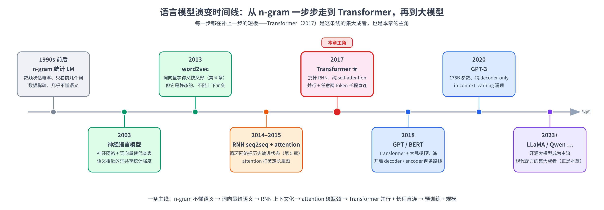
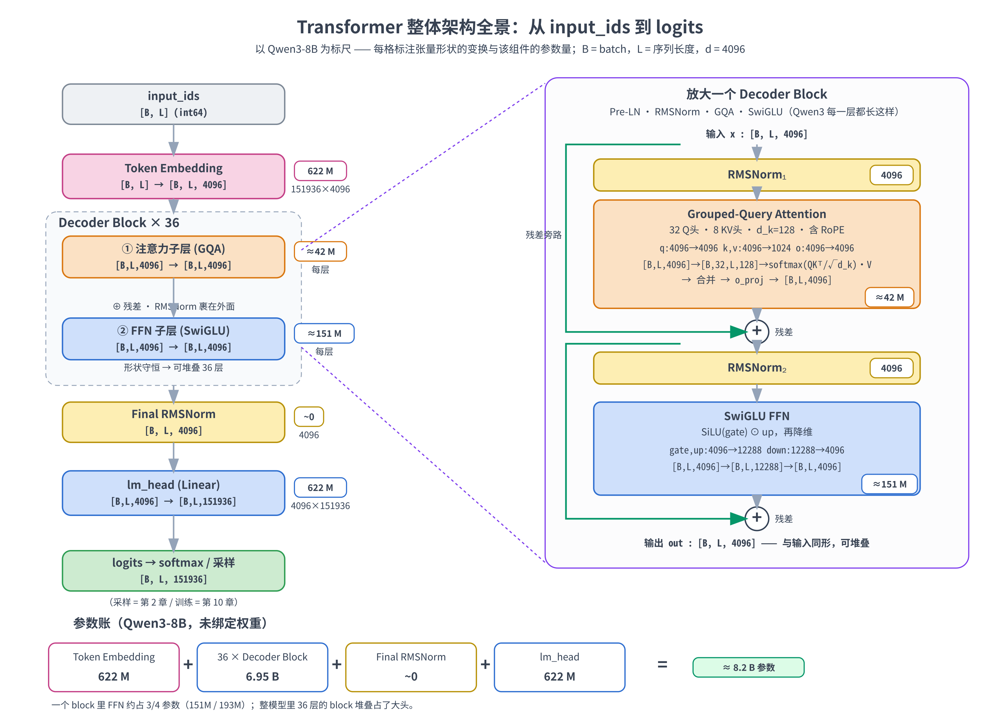
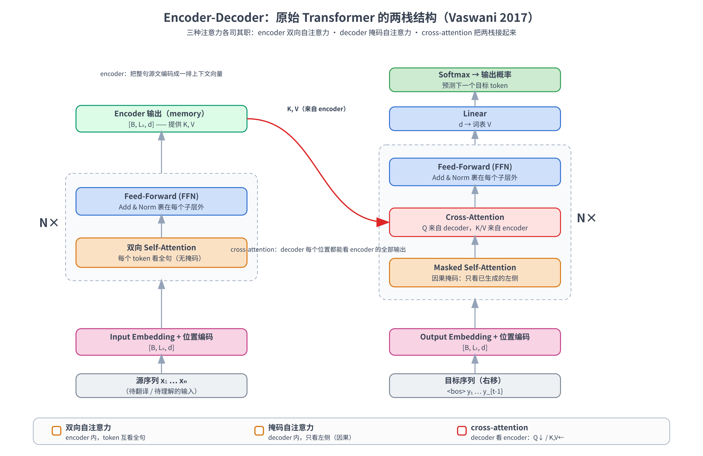
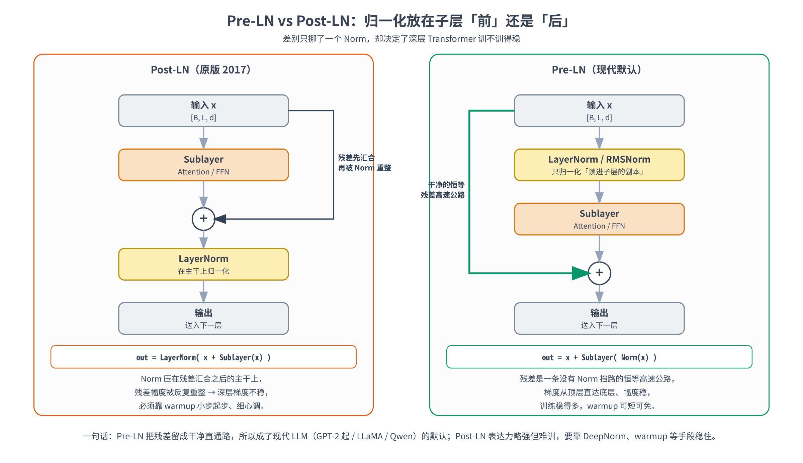
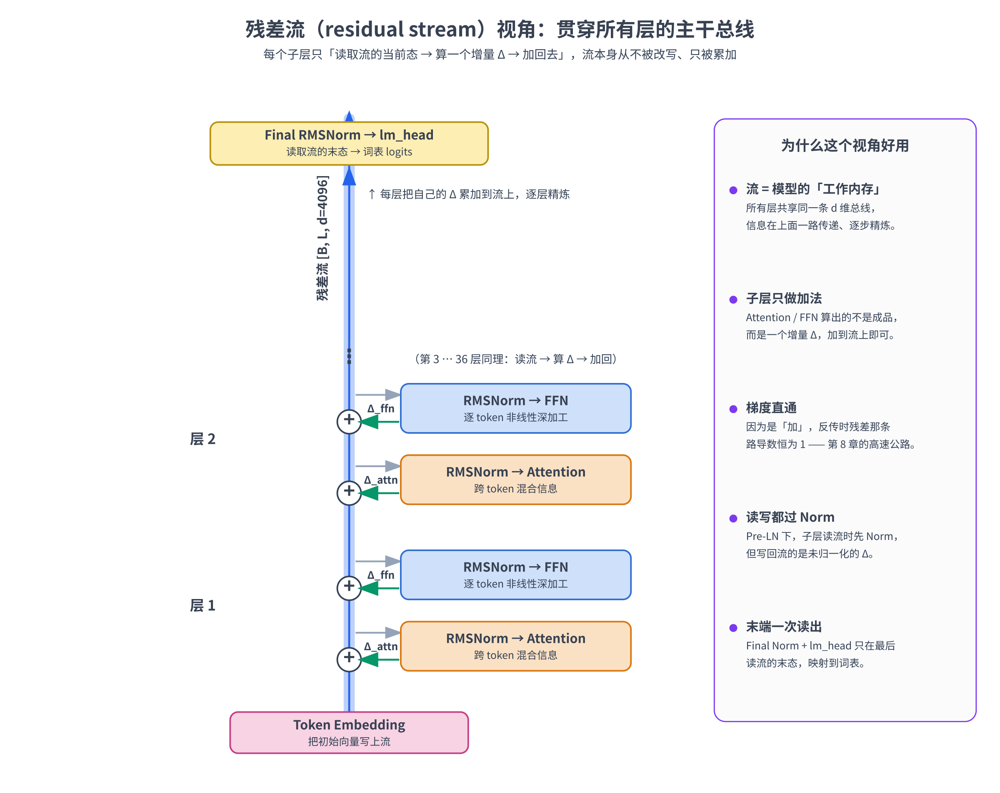

# 第九章：Transformer 整体架构——Encoder-Decoder vs Decoder-only；Pre-LN vs Post-LN

第 3-8 章我们像拆乐高一样，把大模型的零件一个一个做了出来：tokenizer 把文本切成 id（第 3 章）、embedding 把 id 查成向量、位置编码补上顺序（第 4 章）、attention 让 token 互相看（第 5-7 章）、FFN / 残差 / 归一化把它拼成一个能堆几十层的 block（第 8 章）。零件齐了，这一章我们把镜头拉远：先看清 Transformer 是怎么从几十年的语言模型演变里**长出来的**，再回答那个**总装问题——这些 block 到底怎么组装成一个完整的、能从文本进、到下一个 token 出的模型？**

总装这件事上，历史上有两个绕不开的设计岔路，也正是本章标题里的两组对比：

- **要一个栈还是两个栈？** 2017 年原版 Transformer 是 **encoder + decoder 两栈**；现在主流大模型（GPT、LLaMA、Qwen）几乎都是 **decoder-only 一栈**。两条路线差在哪、为什么后者赢了？
- **归一化放在子层「前」还是「后」？** 这就是 **Pre-LN vs Post-LN**——第 8 章搭 block 时我们直接用了 Pre-LN，但没解释为什么；这一章把这个问题解释清楚：差别只挪了一个 Norm 的位置，却决定了几十层深的网络训不训得稳。

顺着「一个栈还是两个栈」这条岔路往下，我们会对 **Encoder-Decoder 和 Decoder-only 两条路线**进行一个对比：两个栈各自长什么样、**cross-attention** 怎么把它们接起来、为什么 decoder-only 最后成了事实标准。其中 cross-attention 这个「跨序列」的注意力是全章唯一的新算子，正好能借第 6、7 章讲过的 Q / K / V 一次讲明白。

实战部分依旧 **全程 CPU、纯 PyTorch**：把第 6-8 章的零件复现出来、拼成一个完整的 mini Decoder-only 语言模型、前向一遍验证逐层形状守恒并数清参数明细，再用一个 24 层的深模型亲手验证「Pre-LN 不挑 warmup 也训得动、深层 Post-LN 不加 warmup 几乎学不会」，最后读 Qwen3-8B 的 config，把全景图上的每个数字和真实模型对上。

> 想直接跑示例？点这里 [](https://colab.research.google.com/github/weiqiangnd/LearningLLM/blob/main/src/09.ipynb)。
>
> **硬件门槛**：概念章，CPU 即可 ✅。本章只在维度 ≤ 128 的小张量上跑，最大的开销是第 7.5 节那个 24 层小模型训练对照实验，Colab 免费 CPU 运行时约一两分钟跑完，**不需要 GPU**；第 7.6 节读 Qwen3-8B config 只下载几 KB 的 json。

## 目录

- [一、语言模型一路是怎么演变到 Transformer 的](#一语言模型一路是怎么演变到-transformer-的)
  - [1.1 一个几十年没变的目标：给语言建概率](#11-一个几十年没变的目标给语言建概率)
  - [1.2 时间线：从数频次，到神经网络，再到注意力](#12-时间线从数频次到神经网络再到注意力)
  - [1.3 为什么偏偏是 Transformer 赢了](#13-为什么偏偏是-transformer-赢了)
- [二、把零件拼成整模型：Decoder-only 的完整骨架](#二把零件拼成整模型decoder-only-的完整骨架)
  - [2.1 回顾：第 3-8 章拼了哪些零件](#21-回顾第-3-8-章拼了哪些零件)
  - [2.2 Decoder-only 的完整前向：从 input_ids 到 logits](#22-decoder-only-的完整前向从-input_ids-到-logits)
  - [2.3 全景图：形状变换与参数量（以 Qwen3-8B 为标尺）](#23-全景图形状变换与参数量以-qwen3-8b-为标尺)
  - [2.4 形状守恒：为什么能堆 36 层](#24-形状守恒为什么能堆-36-层)
  - [2.5 同一套骨架，还能怎么放大、怎么改良](#25-同一套骨架还能怎么放大怎么改良)
- [三、Encoder-Decoder：原始 Transformer 的两栈结构](#三encoder-decoder原始-transformer-的两栈结构)
  - [3.1 两个栈：一个负责读，一个负责写](#31-两个栈一个负责读一个负责写)
  - [3.2 三种注意力：双向、掩码、cross-attention](#32-三种注意力双向掩码cross-attention)
  - [3.3 Cross-Attention 的机制与形状](#33-cross-attention-的机制与形状)
  - [3.4 训练与推理：teacher forcing 与自回归解码](#34-训练与推理teacher-forcing-与自回归解码)
  - [3.5 三种架构横向对比](#35-三种架构横向对比)
- [四、为什么主流大模型都收敛到 Decoder-only](#四为什么主流大模型都收敛到-decoder-only)
  - [4.1 训练信号最密：每个位置都是一条监督](#41-训练信号最密每个位置都是一条监督)
  - [4.2 推理最省：因果掩码天生配 KV cache](#42-推理最省因果掩码天生配-kv-cache)
  - [4.3 任务最统一：in-context learning 自然涌现](#43-任务最统一in-context-learning-自然涌现)
  - [4.4 中间路线与例外：Prefix-LM、T5、BERT 各自的位置](#44-中间路线与例外prefix-lmt5bert-各自的位置)
- [五、Pre-LN vs Post-LN：归一化到底放哪儿](#五pre-ln-vs-post-ln归一化到底放哪儿)
  - [5.1 两种排布：只挪了一个 Norm 的位置](#51-两种排布只挪了一个-norm-的位置)
  - [5.2 Post-LN 为什么深层难训](#52-post-ln-为什么深层难训)
  - [5.3 Pre-LN 为什么稳：一条干净的残差高速公路](#53-pre-ln-为什么稳一条干净的残差高速公路)
  - [5.4 代价与补救：Post-LN 的质量优势、DeepNorm 与 Qwen3 的选择](#54-代价与补救post-ln-的质量优势deepnorm-与-qwen3-的选择)
- [六、残差流视角：把整章串成一张图](#六残差流视角把整章串成一张图)
- [七、实战：从 block 到完整 mini Transformer](#七实战从-block-到完整-mini-transformer)
  - [7.1 环境自检与依赖](#71-环境自检与依赖)
  - [7.2 复现第 6-8 章的零件](#72-复现第-6-8-章的零件)
  - [7.3 拼成一个完整的 Decoder-only 模型](#73-拼成一个完整的-decoder-only-模型)
  - [7.4 前向一遍：逐层形状守恒与参数明细](#74-前向一遍逐层形状守恒与参数明细)
  - [7.5 Pre-LN vs Post-LN：深层训练稳定性验证](#75-pre-ln-vs-post-ln深层训练稳定性验证)
  - [7.6 读 Qwen3-8B config：把全景图的数字对上](#76-读-qwen3-8b-config把全景图的数字对上)
- [八、关键概念回顾](#八关键概念回顾)
- [九、本章小结](#九本章小结)

---

## 一、语言模型一路是怎么演变到 Transformer 的

在拆解 Transformer 的整体架构之前，咱们先回顾一下语言模型的发展历史，看一眼它是怎么从几十年的演变里**长出来的**。这样你再看它每一个设计，就不是「凭空冒出来的规定」，而是「在解决某个历史包袱」——理解会扎实得多。

### 1.1 一个几十年没变的目标：给语言建概率

语言模型（language model，LM）的核心任务，从上世纪到今天其实**一直没变**：给一段文本估计它出现的概率，或者等价地，**预测下一个词**。写成公式，就是把一句话的概率拆成一连串「预测下一个」的乘积：

$$
P(w_1, w_2, \dots, w_n) = \prod_{t=1}^{n} P(w_t \mid w_1, \dots, w_{t-1})
$$

每一项 $P(w_t \mid w_{\lt t})$ 就是「看着前文、预测下一个词」。这条「自回归分解」是所有**自回归**语言模型（包括今天的 GPT、Qwen）共同的骨架，第 10 章会把它讲透。**真正在演变的，从来不是这个目标，而是「拿什么模型来估计这个条件概率」**。下面这条时间线，就是这套「怎么估」的方法一路换代的历史。

### 1.2 时间线：从数频次，到神经网络，再到注意力



一段一段看（图里每个里程碑都标了它补上了上一代的什么短板）：

- **n-gram 统计语言模型**（上世纪八九十年代起）：最朴素的办法——**数频次**。想知道 $P(\text{词} \mid \text{前文})$ ，就在大语料里数「这个前文后面跟这个词」出现了多少次。为了数得过来，得做**马尔可夫假设**：只看前 $n-1$ 个词（2-gram 只看前 1 个、3-gram 看前 2 个）。问题是：前文一长，对应的计数就稀疏到几乎全是 0（**数据稀疏**）；而且它把词当成**互不相干的符号**，「猫」和「狗」在它眼里毫无关系——**几乎不懂语义、不会泛化**。
- **神经语言模型**（Bengio 2003）：第一次用**神经网络 + 词向量**取代查频次表。每个词先映射成一个稠密向量，再用一个小网络去预测下一个词。好处是「语义相近的词共享统计强度」——模型在「猫」上学到的东西能**迁移**到「狗」上，一举缓解了 n-gram 的稀疏与不泛化。这就是 embedding 思想的源头。
- **word2vec**（2013）：把「学词向量」这件事做得又快又好（CBOW / skip-gram + 负采样，第 4 章），让「向量里藏着语义」（`king − man + woman ≈ queen`）变得家喻户晓。但 word2vec 的词向量是**静态的**——一个词不管在什么上下文里都拿同一个向量，「苹果」在「吃苹果」和「苹果手机」里没法区分。
- **RNN / LSTM 语言模型，及 seq2seq + attention**（2010-2015）：要让词的表示**随上下文变**，就得有个能顺序读、还记得住历史的结构——这就是 **RNN / LSTM**（第 5 章）。再进一步，**seq2seq** 用两个 RNN 做「变长输入 → 变长输出」（翻译、摘要），但把整句源文压进一个定长向量会**记不住**；**attention**（第 5 章）于是登场——让解码每一步动态地回看源句的不同位置，打破了定长瓶颈。**注意力，就是在这一步被发明出来的关键火种**。
- **Transformer**（2017）：《Attention Is All You Need》把这把火种烧成了燎原之势。它最大胆的地方是**直接把 RNN 整个扔掉**，只留注意力——用 **self-attention** 让序列直接对自己做注意力。这一扔，换来了两样 RNN 给不了的东西：**并行**（不用再一个时间步一个时间步地等，整句一次算完）和**长程直连**（任意两个 token 一步就能互相看到，不必沿着循环慢慢传）。代价是丢了顺序信息，于是要外挂位置编码（第 4 章）来补。**这就是本章要讲的核心**。
- **预训练时代**（2018）：人们发现 Transformer + **大规模无监督预训练**威力惊人。**GPT** 用 decoder-only 栈做自回归预训练，**BERT** 用 encoder-only 栈做掩码预训练——「生成」与「理解」两条路线就此分流。
- **规模时代**（2020 至今）：**GPT-3**（175B）把 decoder-only 推到前所未有的规模，意外催生了 **in-context learning**——prompt 里给几个示范就能学新任务、不更新参数。此后 **LLaMA / Qwen** 等开源大模型把这套范式普及开来，并固化出一套现代配方：Pre-LN + RMSNorm + RoPE + GQA + SwiGLU——**这些零件，正是第 3-8 章一路拆过来的，也是本章要总装的**。

### 1.3 为什么偏偏是 Transformer 赢了

把时间线竖起来看，会发现一条清晰的因果链——**每一代都在补上一代的硬伤**：

```
n-gram      不懂语义、不泛化      ──►  神经 LM + 词向量（让语义可迁移）
词向量       静态、不看上下文      ──►  RNN / LSTM（让表示随上下文变）
RNN         记不住长程、不能并行   ──►  attention（动态回看）→ Transformer（彻底去掉循环）
```

Transformer 之所以成了这条线的终点（至今没被取代），是因为它**一口气解决了三件长期掣肘的事**：

1. **并行**：扔掉循环，整句所有位置一次性算完——训练时能把 GPU 的算力跑满，这是它能 scale 的物理前提。
2. **长程直连**：self-attention 里任意两个 token 的距离都是「1 跳」，再不像 RNN 那样让信息沿着几十上百步慢慢衰减。
3. **可堆叠扩展**：每个 block 形状守恒（第 2 节会讲），于是「加深、加宽」变成纯粹的工程问题——正是后来「模型越大、效果越好」的基础。

并行让它**训得快**、长程直连让它**学得动长依赖**、形状守恒让它**长得大**——三者凑齐，才有了 2020 年以后的大模型浪潮。理解了这条一步一步的演变史，我们就能名正言顺地走进本章正题：**把这个集大成者拆开，看它整体到底怎么由各组件拼装，以及两条关键的设计岔路（一个栈还是两个栈、Norm 放前还是放后）又该怎么选**。

---

## 二、把零件拼成整模型：Decoder-only 的完整骨架

### 2.1 回顾：第 3-8 章拼了哪些零件

先用一句话把前面几章串起来，看清每个零件落在整条流水线的哪个位置——这正是第 3 章开头那张「阶段 2 全景」图想表达的：

| 章节 | 零件 | 它在流水线里干的事 |
|------|------|--------------------|
| 第 3 章 | **Tokenizer** | 文本 ↔ id：把字符串切成整数 id（BPE / BBPE），是模型唯一认识的输入形式 |
| 第 4 章 | **Token Embedding** | id → 向量：查表得到 `[B, L, d]`，并和输出层 lm_head 形状互为转置（可 weight tying） |
| 第 4 章 | **位置编码** | 给「对顺序视而不见」的注意力补上位置信息（RoPE / 正弦 / ALiBi） |
| 第 5 章 | **attention 的来历** | 讲清注意力是被 RNN seq2seq 的信息瓶颈逼出来的，三步走：打分 → softmax → 加权求和 |
| 第 6 章 | **Scaled Dot-Product Attention** | self-attention 的核心算子：`softmax(QKᵀ/√dₖ)·V` + 因果掩码 |
| 第 7 章 | **Multi-Head Attention / GQA** | 把一个头并排成 $H$ 个、各看一种关系；GQA 削减 K/V 头数省 KV cache |
| 第 8 章 | **FFN + 残差 + 归一化** | 逐 token 非线性深加工，残差修出梯度高速公路，RMSNorm 稳住数值；拼出**一个 block** |

第 8 章我们停在了「**一个** block」上——注意力子层 + FFN 子层，各自裹着 RMSNorm 和残差。这一章的任务，就是把这个 block 当成一块积木，**外面再包上输入端（embedding + 位置编码）和输出端（末层归一化 + lm_head），中间叠上 36 层**，组装成一个完整的、能跑的 Decoder-only 语言模型。

### 2.2 Decoder-only 的完整前向：从 input_ids 到 logits

一个 decoder-only 模型（GPT、LLaMA、Qwen 都是这一类）的完整前向，就是下面这条单向的流水线。我们以 **Qwen3-8B** 为标尺（ $d_{\text{model}} = 4096$ ，36 层，词表 $V = 151936$ ）：

```
input_ids               [B, L]              ← tokenizer 的输出（整数）
   │  Token Embedding（查表）
   ▼
hidden states           [B, L, 4096]        ← 进入主干的那个张量
   │  Decoder Block × 36（每层：RMSNorm → GQA → +残差 → RMSNorm → SwiGLU → +残差）
   ▼
hidden states           [B, L, 4096]        ← 形状一点没变，只是被"加工"了 36 轮
   │  Final RMSNorm（末层归一化）
   ▼
                        [B, L, 4096]
   │  lm_head（Linear: 4096 → 151936）
   ▼
logits                  [B, L, 151936]      ← 每个位置一条"下一个 token"的词表打分
```

有几个点值得专门讲一下，它们把前面几章的伏笔都收了：

- **位置编码去哪了？** Qwen3 用的是 **RoPE**（第 4 章），它不是在 embedding 后面加一个位置向量，而是在**每一层的注意力内部**、对 Q / K 做旋转。所以流水线图里没有一个独立的「+位置编码」方框——它藏在每个 block 的 GQA 里。（正弦 / learned 这类**绝对**位置编码才是「在 embedding 上加一项」，那种才会画成输入端一个独立的 ⊕。）
- **lm_head 在每个位置都输出一条 logits**，但**生成时只用最后一个位置**那条来采样下一个 token；**训练时 $L$ 个位置全用**，每个位置预测它的下一个 token（这套自回归目标是第 10 章的主题）。
- **Final RMSNorm 容易被忘**：最后一个 block 出来之后、喂给 lm_head 之前，还有一道**末层归一化**。它不属于任何一个 block，是单独加在主干末端的一层，作用是把残差流累加了 36 层之后的数值尺度最后压一次（Pre-LN 下残差流会一路长大，所以末端必须补一道 Norm 把尺度拉回来——细节见第 5 节）。

### 2.3 全景图：形状变换与参数量（以 Qwen3-8B 为标尺）

把上面这条流水线画出来，并标出**每个组件的张量怎么变形、各占多少参数**。下面这张全景图就是本章的「技术总览」：左边是宏观数据通路（每格标了输出形状和参数量），右边把**一个 Decoder Block 放大**，展示它内部怎么由 RMSNorm + GQA + SwiGLU 拼装、形状怎么一步步变换；最下面是一份**参数明细**，把 8B 参数拆开，看清楚各个组件占用了多少参数。



读这张图抓三条主线：

**① 形状主线（左侧通路）。** 一路看下来只有两处真正改变最后一维的宽度：`input_ids` 的 `[B, L]` 经 embedding 变成 `[B, L, 4096]`（进入主干），中间 36 层 block 全是 `[B, L, 4096] → [B, L, 4096]` 的**形状守恒**变换，直到 lm_head 把 4096 投到词表 `[B, L, 151936]`。换句话说，**主干从头到尾就是一个宽度 4096 的「数据总线」**，token 数 $L$ 和宽度 4096 一路不变。

**② 装配主线（右侧放大的 block）。** 一个 block 内部，数据要经历两轮「读 → 算 → 加回」：
- **注意力子层**：`[B,L,4096]` 先过 RMSNorm，再分别投影出 Q（`4096→4096`，切成 32 个头）、K/V（`4096→1024`，只有 8 个 KV 头，这是 GQA）、形状走 `[B,L,4096] → [B,32,L,128] → softmax(QKᵀ/√dₖ)·V → [B,L,4096]`，最后过输出投影 $W_O$ 投回 4096，残差加回主干。
- **FFN 子层**：再过一道 RMSNorm，进 SwiGLU：gate / up 把 4096 升到 12288、SiLU 门控相乘、down 再降回 4096（`[B,L,4096] → [B,L,12288] → [B,L,4096]`），残差加回。

**③ 参数主线（底部参数明细）。** 把每块的参数量加起来，正好凑出 Qwen3-8B 的「8B」：

| 组件 | 参数量 | 怎么算的 |
|------|--------|----------|
| Token Embedding | **622 M** | $V \times d = 151936 \times 4096$ |
| 每层注意力（GQA） | **≈ 42 M** | q `4096²` + k,v `2×4096×1024` + o `4096²` |
| 每层 FFN（SwiGLU） | **≈ 151 M** | 三个矩阵 $3 \times 4096 \times 12288$ |
| 一个 block 合计 | **≈ 193 M** | 42 M + 151 M（FFN 约占 3/4——GQA 削减了注意力参数，比第 8 章那个 2/3 的下限更高） |
| 36 层 block | **≈ 6.95 B** | $193\text{ M} \times 36$ |
| Final RMSNorm | ≈0 | 只有 4096 个 $\gamma$ |
| lm_head | **622 M** | $d \times V$ ，Qwen3-8B 不绑定权重（untied），单独一份 |
| **合计** | **≈ 8.2 B** | 622 M + 6.95 B + 622 M |

> **关于 lm_head 那 622 M**：embedding（`[V, d]`）和 lm_head（`[d, V]`）形状互为转置，**可以**共享同一份权重，这招叫 weight tying（第 4 章）。Qwen3 的小模型（0.6B / 1.7B / 4B）确实绑定，省下一份；但 **Qwen3-8B 及更大的版本是 untied 的**（config 里 `tie_word_embeddings=False`），输入、输出各学各的——所以这里 embedding 和 lm_head 各算一份 622 M。如果绑定，总量会少 622 M。第 7.6 节的代码会从真实 config 里把 `tie_word_embeddings` 读出来，按它实际是 tied 还是 untied 算账。

### 2.4 形状守恒：为什么能堆 36 层

**主干上每一个组件都「形状守恒」**——进去 `[B, L, d]`、出来还是 `[B, L, d]`。注意力子层、FFN 子层、残差、归一化，全都不改变这个形状。

这件事为什么关键？因为它让「加深」变成一件**机械的、可无限重复的**事：既然 block 的输入输出同形，那把第 1 个 block 的输出喂给第 2 个、再喂给第 3 个……就完全不需要在中间做任何形状适配。乐高积木能一直往上叠，靠的就是每块的接口尺寸一样。Qwen3-8B 叠 36 层、Qwen3-32B 叠 64 层，叠的都是**同一种形状守恒的积木**，区别只在叠几层、每层多宽。

形状守恒还顺带解释了**参数量为什么随层数线性增长**：每个 block 都有自己**独立**的一套权重（注意力、FFN、两个 RMSNorm 的 $\gamma$ ），层与层之间互不共享——不是「一套权重重复用 36 遍」，而是实打实的 36 套。所以 36 层就是 36 份 block 参数，乘起来就得到 6.95 B 这个大头。

### 2.5 同一套骨架，还能怎么放大、怎么改良

骨架齐了，最后把视野再放宽一点：真实世界里这套骨架是怎么**变大、变强**的？无非三类动作，而且都建立在「形状守恒」这块地基上。

**一、放大——加宽、加深、加头。** 既然 block 形状守恒、能无脑堆叠，把模型造大就退化成了**调几个超参**：

- **加宽**：增大 $d_{\text{model}}$ （每个 token 的向量更宽，单层容量更大）；
- **加深**：增多层数 $N$ （更多轮「读流 → 算增量 → 加回」的精炼）；
- **加头**：增多注意力头数 $H$ （更多个并行的关注子空间）。

以 Qwen3-8B 为锚点（ $d_{\text{model}} = 4096$ 、36 层、32 头），更大的版本基本就是把这三个数一起往上推、更小的版本一起往下收。正因为「造多大的模型」被化简成了「选几个数」，「模型越大、效果好到什么程度」才有了可被研究的规律——这就是 **scaling law**（后续章节专门讲）的工程前提。

**二、改良——不动主结构，只打磨细节。** 现代模型在标准 block 上还做了些小改动，目的无非「更稳、更省、或更能外推」：

- **QK-norm**：在 Q、K 投影之后各加一道 RMSNorm 再去算注意力（Qwen3 就用了它），让注意力分数的尺度更稳、长训练更不容易发散；
- **去掉 bias**：线性层普遍写成 `bias=False`（第 7 节实战代码里就是），省一点参数、实践中还略稳；
- **长上下文外推**：把 RoPE 的底数（base，原版取 10000）调大（或 NTK / YaRN 等方案），让只在几千 token 上训练的模型，推理时能撑到几万甚至几十万 token。

**三、换成 MoE——把 FFN 换成稀疏专家。** 还记得 FFN 占了一个 block 一大半（约 3/4）的参数吗？改动最大的就在这儿：**MoE（Mixture of Experts，混合专家）** 把每层那**一个** FFN 换成 $E$ 个并列的「专家 FFN」加一个**路由器**，每个 token 只被分给其中 $k$ 个专家去算（比如上百个专家里只激活几个）。这样**总参数量能增长十几倍、但单个 token 的计算量几乎不变**——相当于「模型很大，但每次只调用一小部分」。今天最大的那批模型（DeepSeek-V3、Qwen3 的 MoE 版等）走的都是这条路。注意 MoE 动的只是 FFN 子层，**注意力、残差、归一化那套骨架原封不动**——可见本章这套「整体架构」有多通用。

> 这些变体都不动本章的主线结论：**无论怎么放大、怎么改良，主干始终是「embedding → $N$ 个形状守恒的 block → final norm → lm_head」这条 Decoder-only 流水线**。骨架稳定、零件可换，正是 Transformer 能撑起整个大模型时代的原因。

---

## 三、Encoder-Decoder：原始 Transformer 的两栈结构

decoder-only 是现在的主流，但它不是 Transformer 最初的样子。2017 年的原版 Transformer（《Attention Is All You Need》，下文简称 AIAYN）是为**机器翻译**设计的，是个 **encoder + decoder 两栈**的结构。理解它，一是为了知道「我们现在用的 decoder-only 是怎么从两栈里抽出来的」，二是因为 T5、BART 这些 encoder-decoder 模型今天依然在用，多模态里也常见类似的两栈设计。

### 3.1 两个栈：一个负责读，一个负责写

原版 Transformer 的两个栈分工很清楚——一个**读懂输入**，一个**逐词写输出**：

- **Encoder（编码器栈）**：把整句**源序列**（比如待翻译的英文）读进来，编码成一排**上下文向量**（AIAYN 里叫 memory）。它内部是 $N$ 个 **encoder block** 堆叠，每个 block 两个子层——**双向 self-attention**（每个 token 能看全句，没有因果掩码）+ **FFN**，各裹 Add & Norm。读理解类任务不需要「不能偷看未来」，所以 encoder 是**双向**的。
- **Decoder（解码器栈）**：根据 encoder 的 memory，**逐个 token 地生成目标序列**（比如译文）。它内部是 $N$ 个 **decoder block** 堆叠，每个 block **三个子层**——**masked self-attention**（因果掩码，只能看已经生成的左侧）+ **cross-attention**（看 encoder 的 memory）+ **FFN**，各裹 Add & Norm。

下面这张图把两栈结构和三种注意力画在了一起，其中 cross-attention 正是把两栈接起来的那一种：



decoder block 比 encoder block **多一个子层**（cross-attention），这是两栈结构的关键。encoder block 是「自注意力 + FFN」两件套，decoder block 是「掩码自注意力 + cross-attention + FFN」三件套。

### 3.2 三种注意力：双向、掩码、cross-attention

两栈结构里一共出现了**三种注意力**，它们用的都是第 6 章那套 `softmax(QKᵀ/√dₖ)·V`，区别只在「Q、K、V 分别从哪来、能看见谁」：

| 注意力 | 出现在 | Q 来自 | K / V 来自 | 能看见 |
|--------|--------|--------|-----------|--------|
| **双向 self-attention** | encoder | 源序列自己 | 源序列自己 | 源序列**全部**位置（无掩码） |
| **masked self-attention** | decoder | 目标序列自己 | 目标序列自己 | 目标序列里**自己及左侧**（因果掩码） |
| **cross-attention** | decoder | 目标序列（decoder） | **encoder 的 memory** | 源序列**全部**位置 |

前两种是「**self**-attention」——Q、K、V 都从**同一个序列**投影出来，序列对自己做注意力（第 6 章讲的就是这个）。第三种 **cross-attention** 是「**cross**」的：Q 来自一个序列（decoder 这边）、K / V 来自**另一个**序列（encoder 那边）。这是它和 self-attention 唯一的、也是本质的区别。

### 3.3 Cross-Attention 的机制与形状

cross-attention 是三种注意力里唯一「跨序列」的那个——前面 self-attention 都是序列对自己做注意力，它却是「一个序列去看另一个序列」。现在第 6、7 章的 Q / K / V 都备齐了，正好把它讲透。

cross-attention 想解决的问题是：decoder 在生成第 $t$ 个目标 token 时，**该回头看源句的哪些部分**？比如翻译 "I love you → 我爱你"，生成「爱」的时候，模型应该重点关注源句里的 "love"。这不就是第 5 章 seq2seq attention 的老问题吗——**让 decoder 的每一步动态地聚焦源句的不同位置**。cross-attention 正是这个机制在 Transformer 里的实现。

机制上，它和普通注意力一模一样，只是 Q 和 K/V 来自不同的栈。设 decoder 当前层的隐藏状态是 $h_{\text{dec}}$ （形状 `[B, Lₜ, d]`， $L_t$ 是目标序列长度），encoder 最终输出的 memory 是 $m$ （形状 `[B, Lₛ, d]`， $L_s$ 是源序列长度）：

$$
Q = h_{\text{dec}} W_Q, \qquad K = m\thinspace W_K, \qquad V = m\thinspace W_V
$$

$$
\text{CrossAttn} = \text{softmax}\left( \frac{Q\thinspace K^\top}{\sqrt{d_k}} \right) V
$$

注意 **Q 从 decoder 来、K 和 V 从 encoder 的 memory 来**。它的形状有个和 self-attention 不同的地方——**打分矩阵不是方阵**：

```
Q : [B, H, Lₜ, dₖ]            # Lₜ = 当前喂进 decoder 的目标序列长度（训练时为全长，推理时为已生成长度）
K : [B, H, Lₛ, dₖ]            # 源序列长 Lₛ
QKᵀ → 注意力分数 [B, H, Lₜ, Lₛ]   # 行=目标位置，列=源位置，是 Lₜ×Lₛ 的长方形！
softmax 沿最后一维（源位置）归一化
× V [B, H, Lₛ, dₖ] → 输出 [B, H, Lₜ, dₖ]   # 又变回目标序列的长度
```

self-attention 的打分是 `[L, L]` 方阵（序列对自己），cross-attention 的打分是 `[Lₜ, Lₛ]` 长方形（目标对源）。每个**目标位置**作为一行，对**所有源位置**打分、softmax、加权求和源句的 value——这恰好是第 5 章那张「反对角线对齐矩阵」的现代版。还有一点：cross-attention **不戴因果掩码**——decoder 看源句当然可以看全（源句是给定的、已经完整摆在那），因果约束只管「目标序列内部不能偷看未来」，那是 masked self-attention 的事。

最后一个常被忽略的工程要点：**encoder 只跑一次**。它把整句源文一次性编码成 memory，然后这份 memory 在 decoder 生成**每一个**目标 token 时**反复复用**—— $N$ 层 decoder block 里的每一个 cross-attention 子层，都拿同一份（最顶层 encoder 输出的）memory 当 K/V。图里那条从 encoder 输出弯到 decoder 的红色箭头，就是这份 memory 的分发。

### 3.4 训练与推理：teacher forcing 与自回归解码

两栈结构跑起来，训练和推理的方式不同——这个区别其实对所有自回归模型（包括 decoder-only）都成立，在这里一并讲清：

- **训练**：源句喂给 encoder，目标句（**右移一位、开头补 `<bos>`**）整句喂给 decoder。靠因果掩码，decoder 一次前向就能对**所有**目标位置并行算出「下一个 token」的预测，和真实目标对照算 loss。喂给 decoder 的是**真实**的目标 token（而非模型自己上一步的预测），这叫 **teacher forcing**——它让整句能并行训练，是 Transformer 训练能跑得快的关键（细节第 10 章讲）。
- **推理**：encoder 先把源句编码成 memory（一次）；decoder 从 `<bos>` 开始**一个 token 一个 token 地生成**——每生成一个就拼回去、再走一遍 decoder，直到输出 `<eos>`。这种「一个 token 一个 token 往外输出、每步把新 token 拼回输入再算」的方式，就是**自回归生成**。

看出来了吗：**decoder 这一栈的工作方式（因果掩码 + 自回归生成），本身就是一个完整的 decoder-only 模型**。区别只在于，encoder-decoder 的 decoder 多了一个 cross-attention 子层去看 encoder 的 memory；而 decoder-only 直接把 encoder 那一栈和 cross-attention 全去掉，只留下「带因果掩码的 decoder 栈」——下一节就讲为什么这么裁反而成了主流。

### 3.5 三种架构横向对比

把三种架构摆在一起，从「**结构**」（几个栈、子层怎么排）和「**注意力可见性**」（每个 token 能看见谁）两个角度对照，差别一目了然：

| 架构 | 结构 | 注意力可见性 | 训练目标 | 代表 |
|------|------|--------------|----------|------|
| **encoder-only** | 只有 encoder 栈 | 双向：每个 token 看全句 | 掩码语言建模（MLM） | BERT、RoBERTa |
| **decoder-only** | 只有 decoder 栈（无 cross-attn） | 因果：只看自己和左侧 | 因果语言建模（CLM） | GPT、LLaMA、Qwen |
| **encoder-decoder** | 两栈 + cross-attention | encoder 双向 + decoder 因果 + cross 全看源 | seq2seq / span corruption | 原版 Transformer、T5、BART |

> MLM（Masked Language Modeling）= 遮住部分 token 让模型还原，天然需要双向；CLM（Causal Language Modeling）= 根据前文预测下一个 token，天然配因果。**训练目标和注意力可见性是绑死的**——你想让模型「预测下一个」，就必须挡住它看右边，否则它直接抄答案。

「结构」和「可见性」是同一件事的两个剖面：**可见性看的是「谁能看见谁」，结构看的是「零件怎么摆」**——一个栈的因果可见性对应 decoder-only、两个栈的混合可见性对应 encoder-decoder。下一节就来回答：既然三条路都走得通，**为什么主流大模型几乎清一色选了 decoder-only？**

---

## 四、为什么主流大模型都收敛到 Decoder-only

为什么 2020 年（GPT-3）以后，新出的大模型几乎清一色是 decoder-only？说到底，核心就一句：**decoder-only 在「训练信号密度、推理成本、任务通用性」三件事上同时占了便宜**。

### 4.1 训练信号最密：每个位置都是一条监督

decoder-only 用的是 **CLM（因果语言建模）**目标：对一段长度 $L$ 的文本，因果掩码让**每个位置都在预测它的下一个 token**。所以一次前向，就同时产生了 $L-1$ 条监督信号（位置 1 预测 2、位置 2 预测 3……位置 $L-1$ 预测 $L$ ）——**一整段文本几乎每个 token 都被当成一次「预测下一个」的练习**，数据利用率拉满。

对比一下另两种目标：

- **encoder-only 的 MLM（掩码语言建模）**：只 mask 掉约 15% 的 token 让模型还原，**一次前向只有那 15% 的位置贡献 loss**，其余 85% 只当上下文。信号密度天生比 CLM 低。
- **encoder-decoder 的 span corruption（如 T5）**：遮掉若干片段让 decoder 还原，同样只有被遮的那部分 token 是监督目标。

信号越密，**同样的数据 / 算力能榨出越多的学习信号**。在「数据和算力都很贵」的预训练阶段，这是 decoder-only 一个实打实的效率优势。

### 4.2 推理最省：因果掩码天生配 KV cache

decoder-only 自回归生成时，因果掩码保证「**前面 token 的表示不依赖后面**」。这意味着每生成一个新 token，前面所有 token 算过的 K、V **完全不用重算**，缓存起来直接复用就行——这就是 **KV cache**（第 14 章细讲）。因果结构和 KV cache 是天作之合：正因为「只看左侧」，缓存才永远有效。

而 encoder-decoder 的推理流水线要复杂得多：先跑一遍 encoder（对整句源文），再让 decoder 自回归解码，解码时每层还要对 encoder memory 做 cross-attention（cross 的 K/V 也得缓存）。两个栈、两套 cache、两条数据通路。decoder-only 把这一切压成**一个栈、一条通路、一套 KV cache**——工程上简单太多，也更容易把推理引擎（vLLM、SGLang，第 18 章）优化到极致。

### 4.3 任务最统一：in-context learning 自然涌现

这是 decoder-only 最「赢者通吃」的一点。CLM 这个目标把**所有** NLP 任务都统一成了一种形式——「**给一段 prompt，续写下去**」：

- 翻译？prompt = "把下面这句翻译成中文：I love you\n"，续写出「我爱你」。
- 问答、摘要、写代码、对话？统统是「读 prompt → 续写」。

encoder-decoder 则要为不同任务设计不同的「输入给 encoder / 输出给 decoder」的格式，没这么统一。更关键的是，当 decoder-only 模型 scale 到足够大（GPT-3，175B），一个谁也没明确训练过的能力**自己冒了出来**——**in-context learning（上下文学习）**：你在 prompt 里给几个示范（few-shot），模型不更新任何参数，就能照着示范完成新任务。这种「prompt 里塞示范就能学」的灵活性，几乎是把 NLP 的使用范式重写了一遍，也是 decoder-only 把其它路线甩开的转折点。

### 4.4 中间路线与例外：Prefix-LM、T5、BERT 各自的位置

话别说太满——decoder-only 赢的是「**通用生成式大模型**」这条主赛道，但不是说另两种架构没用了。把版图补全：

- **encoder-only（BERT 一系）依然活跃在「理解 / 表示」任务上**：文本分类、命名实体识别、以及做**句向量 / 检索**（embedding 模型、reranker 很多还是 encoder 架构）。它双向看全句，做「把整句压成一个向量」这类事有先天优势，且不需要生成。
- **encoder-decoder（T5 / BART）在「输入输出差异大的 seq2seq」上仍有竞争力**：翻译、摘要这类任务，源和目标泾渭分明，两栈 + cross-attention 的「专门读、专门写」分工是契合的。T5 把一切任务都转成 text-to-text，也是一套自洽的范式。
- **中间路线**：还有人试图取两者之长。**Prefix-LM**（如 UniLM、GLM）让 prompt 部分双向可见、生成部分因果——相当于「前缀当 encoder、续写当 decoder」揉进一个栈。Google 的 **UL2** 则把 MLM / CLM / span corruption 混在一起训。这些都是有意思的探索，但都没能撼动 decoder-only 在通用大模型上的统治地位。

还有一个常被提起的担心：「decoder-only 理论上对纯理解任务弱于双向」——这在小模型上确实存在（看不到右边的上下文，理解会吃亏），但实践中 **scale 基本把这个差距抹平甚至反超了**：模型一大，单向也能学出极强的表示。于是「一个栈、一个目标、一套推理」的简洁性压倒了双向那点理论优势，decoder-only 就成了事实标准。

---

## 五、Pre-LN vs Post-LN：归一化到底放哪儿

总装的第二个设计岔路，藏在每个 block 内部一个看似微不足道的细节里：**归一化（Norm）到底放在子层的前面还是后面？** 第 8 章搭 block 时我们直接用了「放前面」的 Pre-LN，并说「为什么这么放留到本章」。这一节就把缘由讲清楚。

### 5.1 两种排布：只挪了一个 Norm 的位置

一个子层（注意力或 FFN）外面要裹「一道 Norm + 一条残差」，裹的顺序有两种排法。下面式子里的 $\text{Norm}$ 泛指归一化（原版 Transformer 用 LayerNorm、现代大模型多用 RMSNorm），这一节关心的只是它摆在子层**前**还是**后**，跟用哪种 Norm 无关。

**Post-LN（原版 2017，Norm 放后面）**：先过子层、和残差相加，**最后**再归一化。

$$
\text{out} = \text{Norm}\bigl(x + \text{Sublayer}(x)\bigr)
$$

**Pre-LN（现代默认，Norm 放前面）**：**先**归一化、再过子层，最后和残差相加（残差加的是**没归一化过的**原始 $x$ ）。

$$
\text{out} = x + \text{Sublayer}\bigl(\text{Norm}(x)\bigr)
$$

差别只是把那个 Norm 从「相加之后」挪到了「子层之前」。下面这张图把两种数据流并排画出来，重点看那条**残差旁路**有没有被 Norm 挡住：



关键就在**残差那条旁路上有没有压着一个 Norm**：

- **Post-LN**：残差 $x$ 先和子层输出相加，然后**整体被 Norm 重新归一化**。也就是说，从这一层到下一层，残差信息每经过一层就被 Norm「重整」一次——Norm 压在了主干（残差通路）上。
- **Pre-LN**：Norm 只作用在「**读进子层的那个副本**」 $\text{Norm}(x)$ 上，而残差 $x$ 是**原封不动**加回去的。残差通路上**没有任何 Norm 挡路**，是一条干净的恒等直通路。

### 5.2 Post-LN 为什么深层难训

第 8 章讲残差时给过一个核心直觉：残差的价值在于反传时那个 **$+1$ 直通项**——它让梯度能绕过子层、直达底层，避免「层层连乘」导致的梯度消失 / 爆炸（那条「梯度高速公路」）。

**Post-LN 的问题就在于，它把一个 Norm 压在了这条高速公路上。** 残差每往上走一层，就要穿过一次 Norm；反传时，梯度每往下走一层，就要乘一次这个 Norm 的雅可比（导数矩阵）。于是「直通」被打了折扣——梯度不再是干净地 $\times 1$ 往下传，而是被一连串 Norm 的雅可比连乘修饰。层一深（几十层），这串连乘会让**不同层的梯度幅度严重不均衡**：靠近输出的层梯度大、靠近输入的层梯度被反复缩放得忽大忽小。结果就是 Post-LN 深层网络在**训练初期极不稳定**——稍微大一点的学习率就发散。

这也解释了 Post-LN 为什么**严重依赖 learning rate warmup**（warmup：lr 先用很小的值起步、再慢慢升到目标值，见 P04）：初期梯度尺度乱、Adam 的二阶矩估计还没校准，必须用 warmup 小步慢走、等数值稳下来，否则一上来步子一迈大，训练就发散了。原版 Transformer 论文里那套小心翼翼的 warmup schedule，很大程度就是为了应对 Post-LN 的这个毛病。

### 5.3 Pre-LN 为什么稳：一条干净的残差高速公路

Pre-LN 把 Norm 从残差通路上挪走了，残差变成一条**干净的恒等高速公路**。把一个 Pre-LN 栈从头展开，你会看到主干就是一连串纯粹的加法：

$$
x_{\ell+1} = x_\ell + \text{Sublayer}_\ell\bigl(\text{Norm}(x_\ell)\bigr)
$$

主干 $x_\ell \to x_{\ell+1}$ 之间只有一个「+」，Norm 只蹲在支路（喂进子层那一侧）上、不碰主干。于是反传时，梯度沿主干往下传的那条路**导数恒为 1**——和第 8 章那条「梯度高速公路」是同一回事，而且这次是真正全程畅通、一个 Norm 都不挡。各层的梯度幅度因此**天然均衡**，深到几十上百层也不会让底层梯度失稳。好处是 warmup 可以大大缩短甚至省掉，训练稳健性好太多。

这就是为什么从 GPT-2 开始、到 LLaMA / Qwen 这一代，**几乎所有大模型都用 Pre-LN**——深度动辄几十层，稳定性压倒一切。第 7.5 节我们会亲手跑一个 24 层的对照实验：同样深度、同样学习率、不加 warmup，Pre-LN 平稳收敛，Post-LN 几乎原地不动。

> 顺带把第 2.3 节那个伏笔收了：Pre-LN 的残差主干上没有 Norm 一路压着，所以**残差流的数值会随层数一路长大**（每层只往上加东西、没人把它拉回来）。这本身不是问题，但意味着喂给 lm_head 之前必须补一道 **Final RMSNorm**，把累积长大的尺度最后压一次——这就是全景图里那个「不属于任何 block」的末层归一化的来历。Post-LN 因为每层都归一化、主干尺度始终被压着，反而不需要这道末层 Norm。

### 5.4 代价与补救：Post-LN 的质量优势、DeepNorm 与 Qwen3 的选择

客观地说：Pre-LN 不是没有代价。研究和实践都发现，**同等条件下 Post-LN 的最终质量有时会略好于 Pre-LN**——直觉是 Post-LN 每层都把输出重新归一化、对各层的「话语权」管得更严，表征可能更紧致。Pre-LN 的「残差一路长大」也意味着越靠后的层对最终输出的相对贡献越小，深层的边际收益递减。

所以这事还没有定论，业界有几种「兼顾两头」的折中：

- **DeepNorm**（微软）：在 Post-LN 的残差相加处给 $x$ 乘一个精心设计的放大系数、并配套缩小初始化，既保住 Post-LN 的质量、又把它能稳定训练的深度推到了上千层。
- **Sandwich-LN**（如 Gemma 2 等）：子层**前后各加一道 Norm**，相当于 Pre-LN 和 Post-LN 的缝合，试图同时拿到稳定性和质量。
- 还有各种 ReZero、Admin、 $\sigma$ Reparam 等稳定深层训练的技巧。

但对绝大多数模型来说，**Pre-LN 的「省心、稳、好调」依然是默认选择**。Qwen3 就是标准的 **Pre-LN + RMSNorm**（第 8 章读 config 时见过：用的是 `rms_norm_eps`，归一化在子层之前）。本章实战和第 8 章一样，默认用 Pre-LN 搭模型；Post-LN 只在第 7.5 节当对照组出场，让你亲眼看看它深层有多难训。

---

## 六、残差流视角：把整章串成一张图

学到这里，零件、组装、两条设计岔路都讲完了。最后给你一个能把这一切**串成一张图**的统一视角——**残差流（residual stream）**。它是近年（尤其 mechanistic interpretability 领域）很流行的一种理解 Transformer 的方式，特别适合用来收束本章。

核心比喻：把整个模型想象成**一条贯穿所有层的「主干总线」**，宽度就是 $d_{\text{model}}$ （Qwen3-8B 是 4096）。这条总线就是残差流。



它的运作可以拆成四条：

- **Token Embedding 把初始向量写上流**：序列里每个 token 拿到自己的 embedding，作为残差流的「初始状态」。
- **每个子层只做「读 → 算 → 加」三件事**：注意力 / FFN 子层先**读取**流的当前状态（Pre-LN 下读之前先过一道 Norm），算出一个**增量 $\Delta$**（注意力算的 $\Delta$ 是「跨 token 混合来的信息」，FFN 算的 $\Delta$ 是「逐 token 深加工的结果」），再把这个 $\Delta$ **加回**流上。注意：子层的输出**不是成品**，而是一个修正量——这正是第 8 章「残差相加是把增量叠回输入」那句话的几何化。
- **流本身从不被改写，只被累加**：没有哪个子层会「覆盖」流，大家都只是往上面加东西。所以这条流像模型的**工作内存 / 草稿纸**——信息在上面一路传递、被一层层地读取和精炼。
- **末端一次读出**：所有层加工完，Final RMSNorm + lm_head 在最顶端读取流的**末态**，映射成词表 logits。

这个视角的妙处，在于它一口气把本章的几条线索全解释了：

- **为什么形状守恒**（第 2.4 节）：因为所有子层都只是往同一条宽度 $d$ 的总线上「加」，加法不改变形状，自然能无限堆叠。
- **为什么梯度直通、深层训得动**（第 8 章 + 第 5 节）：因为主干是纯加法，反传时残差那条路导数恒为 1——残差流就是那条「梯度高速公路」的本体。
- **为什么 Pre-LN 是干净的、残差流会长大**（第 5.3 节）：Pre-LN 下，子层「读流」时先 Norm，但「写回流」的是**未归一化**的 $\Delta$ ，所以主干上没有 Norm 挡路（干净直通），但也因此一路累加、数值越长越大，末端要补一道 Final Norm。

一句话收束：**一个 decoder-only Transformer，就是「在一条残差流上，让注意力和 FFN 轮流读取、计算增量、累加回去」的 36 次重复，最后读出末态预测下一个 token。** 这一章拆开看是一堆零件和设计取舍，合起来看就是这条流。

---

## 七、实战：从 block 到完整 mini Transformer

这一节**全程 CPU、纯 PyTorch**，路线是：复现第 6-8 章的零件（RMSNorm / RoPE / GQA / SwiGLU） → 拼成一个完整的 Decoder-only mini 模型 → 前向一遍验证逐层形状守恒、数清参数明细 → 用一个 24 层的深模型亲手验证 Pre-LN / Post-LN 的训练稳定性差异 → 读真实 Qwen3-8B config 把全景图的数字对上。

> 下面给出本章全部可运行代码（**Cell 0 ~ Cell 6**），逐个 cell 讲解；你既可以照着这里一段段读，也可以从本章顶部的 Open in Colab 直链直接 Run All。除第 7.5 节那个训练实验要跑约一两分钟，其余都是秒级。

### 7.1 环境自检与依赖

**Cell 0** 是常规环境自检。本章用不到 GPU，CPU 即可：

```python
# ============================================================
# Cell 0: 环境自检（本章纯 CPU 即可，无需 GPU）
# ============================================================
# 本章把第 6-8 章的零件拼成一个完整的 Decoder-only 模型，再做一个深层 Pre-LN /
# Post-LN 的训练稳定性对照实验——全程在维度 ≤ 128 的小张量上跑，CPU 一两分钟即可，
# 不强制 GPU。最后读 Qwen3-8B 的 config 只下载几 KB 的 json。
import sys, platform
import torch

print("Python:", sys.version.split()[0])
print("平台:", platform.platform())
print("PyTorch:", torch.__version__)
print("CUDA 可用:", torch.cuda.is_available(), "（本章用不到，CPU 即可）")
```

**Cell 1** 装依赖。本章核心是纯 PyTorch 从零实现，额外用到 `matplotlib`（第 7.5 节画 loss 曲线）和 `transformers`（第 7.6 节读 Qwen3 config）：

```python
%%capture
# ============================================================
# Cell 1: 安装依赖
# ============================================================
# %%capture 必须是 cell 第一行，把 pip 安装日志藏起来。
# torch / matplotlib: 纯 CPU 跑小模型 + 画 loss 曲线，Colab 默认已装，故意【不】加 -U。
# transformers:       第 7.6 节用 AutoConfig 读 Qwen3-8B 的 config，Qwen3 要求 >=4.51。
!pip install -q -U "transformers>=4.51"
```

### 7.2 复现第 6-8 章的零件

**Cell 2** 把第 6-8 章的四个零件用代码复现一遍——**RMSNorm**（第 8 章）、**RoPE**（第 4 章）、**因果 GQA**（第 6、7 章）、**SwiGLU**（第 8 章），再用它们拼出**一个 Pre-LN 的 DecoderBlock**。为了第 7.5 节的对照实验，DecoderBlock 留了个 `pre_ln` 开关，能在 Pre-LN / Post-LN 之间切换：

```python
# ============================================================
# Cell 2: 复现第 6-8 章的零件，并拼出一个 DecoderBlock
# ============================================================
import torch
import torch.nn as nn
import torch.nn.functional as F
import math

class RMSNorm(nn.Module):
    """只按均方根缩放、不减均值的归一化（第 8 章）。x: [..., d] -> [..., d]。"""
    def __init__(self, d, eps=1e-6):
        super().__init__()
        self.weight = nn.Parameter(torch.ones(d))   # 每个特征一个可学习增益 γ
        self.eps = eps
    def forward(self, x):
        rms = x.pow(2).mean(-1, keepdim=True).add(self.eps).rsqrt()  # 1/RMS，形状 [..., 1]
        return x * rms * self.weight                                 # 广播回 [..., d]

def build_rope_cache(seq_len, head_dim, base=10000.0):
    """预先算好每个位置 × 每个频率的 cos/sin（第 4 章 RoPE）。返回两个 [seq_len, head_dim]。"""
    inv_freq = 1.0 / (base ** (torch.arange(0, head_dim, 2).float() / head_dim))  # [head_dim/2]
    pos = torch.arange(seq_len).float()                                          # [L]
    ang = torch.outer(pos, inv_freq)                                             # [L, head_dim/2]
    cos = torch.cat([ang.cos(), ang.cos()], dim=-1)                              # [L, head_dim]
    sin = torch.cat([ang.sin(), ang.sin()], dim=-1)                              # [L, head_dim]
    return cos, sin

def apply_rope(x, cos, sin):
    """把每个 head 的向量按位置旋转。x: [B, H, L, hd]；cos/sin: [L, hd]。"""
    cos, sin = cos[None, None], sin[None, None]              # [1,1,L,hd] 便于广播
    d = x.shape[-1]
    x1, x2 = x[..., : d // 2], x[..., d // 2:]              # 前一半 / 后一半配成旋转对
    rotated = torch.cat([-x2, x1], dim=-1)                  # 旋转 90° 的"虚部"
    return x * cos + rotated * sin

class CausalGQA(nn.Module):
    """因果分组查询注意力（第 6、7 章）：H 个 Q 头、G 个 KV 头，含 RoPE 与上三角掩码。"""
    def __init__(self, d_model, n_heads, n_kv_heads):
        super().__init__()
        assert d_model % n_heads == 0 and n_heads % n_kv_heads == 0
        self.n_heads, self.n_kv_heads = n_heads, n_kv_heads
        self.head_dim = d_model // n_heads
        self.q_proj = nn.Linear(d_model, n_heads * self.head_dim, bias=False)     # 现代 LLM 投影不带 bias
        self.k_proj = nn.Linear(d_model, n_kv_heads * self.head_dim, bias=False)  # GQA：KV 头更少 -> 更窄
        self.v_proj = nn.Linear(d_model, n_kv_heads * self.head_dim, bias=False)
        self.o_proj = nn.Linear(n_heads * self.head_dim, d_model, bias=False)
    def forward(self, x, cos, sin):
        B, L, _ = x.shape
        H, G, hd = self.n_heads, self.n_kv_heads, self.head_dim
        q = self.q_proj(x).view(B, L, H, hd).transpose(1, 2)   # [B, H, L, hd]
        k = self.k_proj(x).view(B, L, G, hd).transpose(1, 2)   # [B, G, L, hd]
        v = self.v_proj(x).view(B, L, G, hd).transpose(1, 2)   # [B, G, L, hd]
        q, k = apply_rope(q, cos, sin), apply_rope(k, cos, sin)
        rep = H // G
        k = k.repeat_interleave(rep, dim=1)                    # 复制凑齐 H 份 -> [B, H, L, hd]
        v = v.repeat_interleave(rep, dim=1)
        scores = (q @ k.transpose(-2, -1)) / math.sqrt(hd)     # [B, H, L, L]
        mask = torch.triu(torch.full((L, L), float("-inf")), diagonal=1)  # 上三角 -inf
        attn = (scores + mask).softmax(dim=-1)
        out = attn @ v                                         # [B, H, L, hd]
        out = out.transpose(1, 2).contiguous().view(B, L, H * hd)  # 合头 -> [B, L, d_model]
        return self.o_proj(out)

class SwiGLU(nn.Module):
    """SwiGLU 前馈网络（第 8 章）：SiLU(gate) ⊙ up，再降维。三个无 bias 线性层。"""
    def __init__(self, d_model, d_ff):
        super().__init__()
        self.gate_proj = nn.Linear(d_model, d_ff, bias=False)
        self.up_proj   = nn.Linear(d_model, d_ff, bias=False)
        self.down_proj = nn.Linear(d_ff, d_model, bias=False)
    def forward(self, x):
        return self.down_proj(F.silu(self.gate_proj(x)) * self.up_proj(x))

class DecoderBlock(nn.Module):
    """一个 Transformer 层：注意力子层 + FFN 子层，各裹 RMSNorm 与残差。
    pre_ln=True 是现代默认（Pre-LN）；False 切到原版 Post-LN，仅用于第 7.5 节对照实验。"""
    def __init__(self, d_model, n_heads, n_kv_heads, d_ff, pre_ln=True):
        super().__init__()
        self.pre_ln = pre_ln
        self.attn  = CausalGQA(d_model, n_heads, n_kv_heads)
        self.ffn   = SwiGLU(d_model, d_ff)
        self.norm1 = RMSNorm(d_model)
        self.norm2 = RMSNorm(d_model)
    def forward(self, x, cos, sin):
        if self.pre_ln:                                       # x + Sublayer(Norm(x))
            x = x + self.attn(self.norm1(x), cos, sin)
            x = x + self.ffn(self.norm2(x))
        else:                                                 # Norm(x + Sublayer(x))
            x = self.norm1(x + self.attn(x, cos, sin))
            x = self.norm2(x + self.ffn(x))
        return x
```

这段代码就是把前几章的结论落成可运行的零件，几个细节对照着看：

- `RMSNorm` / `SwiGLU` 和第 8 章实战完全一致；`CausalGQA` 把第 7 章的「切头 → RoPE → `repeat_interleave` 凑齐 K/V → 缩放点积 → 因果掩码 → 合头 → 输出投影 $W_O$ 」从头到尾走了一遍，全程标注了形状。
- `DecoderBlock.forward` 把第 5 节那两个公式直接写成了代码：`pre_ln=True` 走 `x + Sublayer(Norm(x))`，`False` 走 `Norm(x + Sublayer(x))`——一个 `if/else`，就是 Pre-LN 和 Post-LN 的全部区别。

### 7.3 拼成一个完整的 Decoder-only 模型

**Cell 3** 把 block 当积木，外面包上 embedding、Final RMSNorm、lm_head，中间叠 $N$ 层，拼出完整的 `MiniDecoderLM`——这就是第 2.2 节那条流水线的代码版：

```python
# ============================================================
# Cell 3: 把零件拼成完整的 Decoder-only 语言模型
# ============================================================
class MiniDecoderLM(nn.Module):
    """把零件拼成完整的 Decoder-only 语言模型：embedding -> N×block -> final norm -> lm_head。"""
    def __init__(self, vocab, d_model=64, n_layers=4, n_heads=4, n_kv_heads=2,
                 d_ff=None, max_len=64, pre_ln=True):
        super().__init__()
        if d_ff is None:
            d_ff = (int(8 / 3 * d_model) + 7) // 8 * 8        # SwiGLU 对齐参数（约 8/3·d），取整到 8 的倍数
        self.embed = nn.Embedding(vocab, d_model)            # [V, d] 查表
        self.blocks = nn.ModuleList([
            DecoderBlock(d_model, n_heads, n_kv_heads, d_ff, pre_ln) for _ in range(n_layers)
        ])
        self.final_norm = RMSNorm(d_model)                   # 末层归一化（不属于任何 block）
        self.lm_head = nn.Linear(d_model, vocab, bias=False) # [d, V] 投回词表
        cos, sin = build_rope_cache(max_len, d_model // n_heads)
        self.register_buffer("cos", cos)                     # RoPE 表不是参数，注册成 buffer
        self.register_buffer("sin", sin)
    def forward(self, ids):
        B, L = ids.shape
        x = self.embed(ids)                                  # [B, L, d]
        cos, sin = self.cos[:L], self.sin[:L]
        for blk in self.blocks:
            x = blk(x, cos, sin)                             # 每层形状守恒 [B, L, d]
        x = self.final_norm(x)
        return self.lm_head(x)                               # [B, L, V]
```

`forward` 短短几行，就是整张全景图的左侧通路：`embed` 查表 → 遍历 `blocks` 逐层加工（形状守恒）→ `final_norm` → `lm_head`。RoPE 的 cos/sin 表用 `register_buffer` 存——它是固定算出来的、不参与训练，所以是 buffer 不是 parameter。

### 7.4 前向一遍：逐层形状守恒与参数明细

**Cell 4** 实例化一个小模型，前向走一遍，**逐层打印形状**确认守恒，再**逐组件数参数**：

```python
# ============================================================
# Cell 4: 前向一遍——逐层形状守恒 + 参数明细
# ============================================================
torch.manual_seed(0)
vocab, B, L = 100, 2, 8
model = MiniDecoderLM(vocab, d_model=64, n_layers=4, n_heads=4, n_kv_heads=2)
ids = torch.randint(0, vocab, (B, L))

# 手动走一遍，确认每个 block 都"形状守恒"
x = model.embed(ids)
print("input_ids       :", tuple(ids.shape), ids.dtype)
print("after embed     :", tuple(x.shape))
cos, sin = model.cos[:L], model.sin[:L]
for i, blk in enumerate(model.blocks):
    x = blk(x, cos, sin)
    print(f"after block[{i}]   :", tuple(x.shape))
x = model.final_norm(x)
print("after final_norm:", tuple(x.shape))
logits = model.lm_head(x)
print("logits          :", tuple(logits.shape), "  <- [B, L, vocab]")

def count(m):
    return sum(p.numel() for p in m.parameters())
print("-" * 40)
print("embed   参数:", count(model.embed))
print("1 block 参数:", count(model.blocks[0]),
      "(attn", count(model.blocks[0].attn), "+ ffn", count(model.blocks[0].ffn), ")")
print("lm_head 参数:", count(model.lm_head))
print("整模型  参数:", count(model))
```

**预期现象**：从 `after embed` 到 `after final_norm`，形状一直是 `(2, 8, 64)`——这就是对「形状守恒」的验证；只有 `input_ids`（`(2, 8)`）和 `logits`（`(2, 8, 100)`）两端不同。参数上你会看到 `1 block` 里 `ffn` 比 `attn` 大不少（FFN 占主要部分，约占一层 3/4——和第 8 章「FFN 的参数在 block 里占主要部分」一致，GQA 下注意力更窄、占比还更高些）。这套结构和数法，放大到 Qwen3-8B 就是第 2.3 节那份参数明细。

### 7.5 Pre-LN vs Post-LN：深层训练稳定性验证

**Cell 5** 是本章的核心实验：搭一个**24 层**的深模型，分别用 Pre-LN 和 Post-LN，在一个示例任务（把序列循环右移一位，是个确定性映射、模型学得会）上训练，**不加 warmup、用同一个偏大的学习率**，看谁训得动。再补一条「Post-LN + warmup」，验证 warmup 能不能让 Post-LN 重新训得动：

```python
# ============================================================
# Cell 5: Pre-LN vs Post-LN —— 24 层深模型的训练稳定性对照（CPU 约一两分钟）
# ============================================================
import matplotlib.pyplot as plt

def train_curve(pre_ln, warmup=0, steps=150, n_layers=24, d_model=128,
                n_heads=8, n_kv_heads=2, L=24, lr=2e-3, vocab=64, seed=0):
    """在一个深(24 层)模型上训一个示例任务(把序列循环右移 1 位)，返回 loss 曲线。
    warmup>0 时，前 warmup 步把 lr 从 0 线性升到 lr（其余步保持 lr）。"""
    torch.manual_seed(seed)
    m = MiniDecoderLM(vocab, d_model=d_model, n_layers=n_layers,
                      n_heads=n_heads, n_kv_heads=n_kv_heads, max_len=L, pre_ln=pre_ln)
    opt = torch.optim.AdamW(m.parameters(), lr=lr)
    losses = []
    for s in range(steps):
        cur_lr = lr * min(1.0, (s + 1) / warmup) if warmup > 0 else lr   # 线性 warmup
        for g in opt.param_groups:
            g["lr"] = cur_lr
        ids = torch.randint(0, vocab, (8, L))
        tgt = torch.roll(ids, shifts=1, dims=1)             # 确定性映射，模型学得会
        loss = F.cross_entropy(m(ids).reshape(-1, vocab), tgt.reshape(-1))
        opt.zero_grad(); loss.backward(); opt.step()
        losses.append(loss.item())
    return losses

# 三条曲线（同样 24 层、同样 lr）。CPU 上约一两分钟。
pre     = train_curve(pre_ln=True,  warmup=0)    # Pre-LN，不加 warmup
post    = train_curve(pre_ln=False, warmup=0)    # Post-LN，不加 warmup
post_wu = train_curve(pre_ln=False, warmup=30)   # Post-LN，加 30 步 warmup
print(f"末步 loss —— Pre-LN(无warmup): {pre[-1]:.2f}   "
      f"Post-LN(无warmup): {post[-1]:.2f}   Post-LN(+warmup): {post_wu[-1]:.2f}")

plt.figure(figsize=(7.5, 4.2))
plt.plot(pre,     label="Pre-LN  (no warmup)")
plt.plot(post,    label="Post-LN (no warmup)")
plt.plot(post_wu, label="Post-LN (+ warmup 30)")
plt.xlabel("training step"); plt.ylabel("loss")
plt.title("Pre-LN vs Post-LN: training a 24-layer model (no warmup)")
plt.legend(); plt.grid(True, alpha=0.3); plt.tight_layout(); plt.show()
```

**预期现象**（seed 固定，结果可复现）：

- **Pre-LN（无 warmup）**：loss 从 ≈4.3 一路稳稳下降到 ≈0.2——24 层深也不挑 warmup，直接训得动。
- **Post-LN（无 warmup）**：loss **几乎卡在 ≈4.2 原地不动**——同样的深度、同样的 lr，它就是学不会。这就是第 5.2 节说的「深层 Post-LN 初期不稳、必须小步起步」的直接后果。
- **Post-LN（+ warmup 30）**：前 30 步小步预热时 loss 不怎么动，**预热结束后开始下降**，最终也收敛到 ≈0.3——**warmup 让 Post-LN 重新训得动了**。

三条曲线放一起，就把第 5 节的结论全部印证了：**Pre-LN 省心（不挑 warmup 就稳）；Post-LN 难训（不加 warmup 几乎学不会）；warmup 是稳住 Post-LN 的必需品。** 这也正是现代大模型默认 Pre-LN 的实验依据。

> 这是个**迷你规模**的演示，旨在让你「亲眼看见」趋势，不是严谨的架构 benchmark。真实大模型上 Post-LN 的不稳更隐蔽、也有 DeepNorm 这类专门的补救（第 5.4 节），但「深层 + 无 warmup 时 Post-LN 明显更难训」这个定性结论是稳的。

### 7.6 读 Qwen3-8B config：把全景图的数字对上

**Cell 6** 读一份真实的 **Qwen3-8B** 配置，按它的尺寸**重算一遍参数明细**，和第 2.3 节那张全景图的数字逐项对上：

```python
# ============================================================
# Cell 6: 读真实 Qwen3-8B config，按它的尺寸重算参数明细（对上全景图）
# ============================================================
# AutoConfig 只下载几 KB 的 config.json，不下载几个 GB 的权重，CPU 秒级完成。
from transformers import AutoConfig

cfg = AutoConfig.from_pretrained("Qwen/Qwen3-8B")
V, d = cfg.vocab_size, cfg.hidden_size
H, G = cfg.num_attention_heads, cfg.num_key_value_heads
hd = getattr(cfg, "head_dim", d // H)   # Qwen3 显式给出 head_dim；它不一定等于 d/H（如 Qwen3-4B 就不等）
d_ff, n_layers = cfg.intermediate_size, cfg.num_hidden_layers
tie = cfg.tie_word_embeddings

emb  = V * d                          # token embedding
q    = d * (H * hd)                   # q_proj
kv   = 2 * d * (G * hd)               # k_proj + v_proj（GQA：KV 头少，所以更窄）
o    = (H * hd) * d                   # o_proj
attn = q + kv + o
ffn  = 3 * d * d_ff                   # SwiGLU 三个矩阵
per_layer = attn + ffn
blocks = per_layer * n_layers
head = 0 if tie else V * d            # 8B 不绑定权重，lm_head 单独一份
total = emb + blocks + head

M = lambda x: f"{x / 1e6:6.0f} M"
print(f"vocab={V}  d_model={d}  layers={n_layers}  H={H}  G={G}  head_dim={hd}  d_ff={d_ff}  tie={tie}")
print("-" * 52)
print("token embedding   :", M(emb))
print("  attn  / layer   :", M(attn), f"(q{M(q)} + kv{M(kv)} + o{M(o)} )")
print("  ffn   / layer   :", M(ffn), " <- 约占一层的 3/4")
print(f"  block ×{n_layers}      : {blocks / 1e9:.2f} B")
print("lm_head           :", M(head), "(tied)" if tie else "(untied)")
print("-" * 52)
print(f"TOTAL             : {total / 1e9:.2f} B   <- 这就是 Qwen3-8B 的 ~8B")
```

**预期现象**：Qwen3-8B 会打印出 `d_model=4096`、`layers=36`、`H=32`、`G=8`、`head_dim=128`、`d_ff=12288`、`tie=False`，然后参数明细逐项是——token embedding **622 M**、每层 attn **≈ 42 M**、每层 ffn **≈ 151 M**、36 层 block 合计 **≈ 6.95 B**、lm_head **622 M（untied）**、**TOTAL ≈ 8.19 B**。这和第 2.3 节全景图上的数字**一模一样**——你手写的那套 `MiniDecoderLM` 结构，放大到这些尺寸，就是 Qwen3-8B。理论与工业实现在这里闭环。

---

## 八、关键概念回顾

| 概念 | 一句话定义 |
|------|-----------|
| **Decoder-only 骨架** | embedding → $N$ 个形状守恒的 block → Final RMSNorm → lm_head；主干是一条宽度 $d_{\text{model}}$ 的总线 |
| **形状守恒** | block 进出都是 `[B, L, d]`，所以能机械地堆几十层；参数随层数线性增长（每层独立权重） |
| **Final RMSNorm** | 末层归一化，单独加在主干末端、不属于任何 block；Pre-LN 下用来压住一路长大的残差流尺度 |
| **Encoder-Decoder** | 原版 Transformer 两栈：encoder（双向自注意力 + FFN）+ decoder（掩码自注意力 + cross-attention + FFN） |
| **三种注意力** | 双向 self-attn（encoder）、masked self-attn（decoder）、cross-attn（Q 来自 decoder、K/V 来自 encoder memory） |
| **Cross-Attention** | decoder 看 encoder 输出：Q←decoder / K,V←memory，打分矩阵是 `[Lₜ, Lₛ]` 长方形、无因果掩码、memory 只编码一次反复复用 |
| **三种架构** | encoder-only（BERT，理解）/ decoder-only（GPT-Qwen，生成）/ encoder-decoder（T5，seq2seq） |
| **为什么 decoder-only 赢** | 训练信号最密（每位置都监督）+ 推理最省（因果掩码天配 KV cache、单栈单通路）+ 任务最统一（in-context learning 涌现） |
| **Prefix-LM / UL2** | 介于单双向之间的中间路线（前缀双向、续写因果）；没撼动 decoder-only 的主流地位 |
| **Post-LN** | $\text{Norm}(x + \text{Sublayer}(x))$ ，原版排布；Norm 压在残差通路上 → 深层梯度不均、难训、依赖 warmup |
| **Pre-LN** | $x + \text{Sublayer}(\text{Norm}(x))$ ，现代默认；残差通路干净直通 → 梯度稳、深层训得动（GPT-2 起 / LLaMA / Qwen） |
| **warmup 的角色** | lr 先小后大；是应对 Post-LN 初期不稳的必需品，Pre-LN 下可短可免 |
| **DeepNorm / Sandwich-LN** | 想同时拿 Post-LN 的质量和稳定性的折中方案 |
| **残差流（residual stream）** | 把模型看成一条贯穿所有层的总线：子层只「读流 → 算增量 Δ → 加回」，统一解释了形状守恒、梯度直通、Pre-LN 干净 |
| **放大（scaling）** | 形状守恒让「造多大的模型」退化成调超参：加宽 $d_{\text{model}}$ + 加深层数 $N$ + 加头数 $H$ ；是 scaling law 的工程前提 |
| **QK-norm** | 在 Q、K 投影后各加一道 RMSNorm 再算注意力（Qwen3 用了），稳住注意力分数尺度、利于长训练 |
| **MoE（混合专家）** | 把每层的 FFN 换成 $E$ 个专家 + 路由器，每 token 只激活 $k$ 个；总参数大幅增长而单 token 算力几乎不变；只换 FFN、骨架不动 |

---

## 九、本章小结

- 一个 **decoder-only 模型**就是把第 3-8 章的零件总装起来：**input_ids → Token Embedding → $N$ 个 Decoder Block → Final RMSNorm → lm_head → logits**。主干上每个组件都**形状守恒**（`[B, L, d]` 进出不变），所以能像积木一样机械地堆几十层；以 Qwen3-8B 为标尺，36 层 block 占 ≈6.95 B、加上两端的 embedding / lm_head（各 622 M），合计 **≈ 8.2 B 参数**，FFN 在每层里约占 3/4。
- **原版 Transformer 是 encoder + decoder 两栈**：encoder 用**双向自注意力**把源句编码成 memory，decoder 用**掩码自注意力 + cross-attention + FFN** 三件套逐词生成。**cross-attention** 是把两栈接起来的关键——Q 来自 decoder、K/V 来自 encoder memory，打分矩阵是 `[Lₜ, Lₛ]` 长方形、不戴因果掩码、memory 编码一次反复复用。
- **decoder-only 成为主流**，是因为它在三件事上同时占优：**训练信号最密**（CLM 让每个位置都是一条「预测下一个」的监督，比 MLM / span corruption 利用率高）、**推理最省**（因果掩码天生配 KV cache，单栈单通路）、**任务最统一**（一切都是「读 prompt → 续写」，且 scale 到 GPT-3 后 in-context learning 自然涌现）。encoder-only（BERT，做表示 / 检索）和 encoder-decoder（T5，做 seq2seq）并未消失，但通用大模型这条主赛道被 decoder-only 拿下。
- **Pre-LN vs Post-LN 只差一个 Norm 的位置**，却决定深层训不训得稳：**Post-LN**（ $\text{Norm}(x+\text{Sublayer}(x))$ ）把 Norm 压在残差通路上，深层梯度不均、初期不稳、严重依赖 warmup；**Pre-LN**（ $x+\text{Sublayer}(\text{Norm}(x))$ ）让残差成为一条干净的恒等高速公路，梯度直通、训练稳健，是 GPT-2 起到 LLaMA / Qwen 的默认（代价是残差流一路长大、末端要补 Final Norm）。质量上 Post-LN 偶有优势，于是有 DeepNorm、Sandwich-LN 等折中。
- **残差流视角**把整章串成一张图：模型 = 一条贯穿所有层、宽度 $d_{\text{model}}$ 的主干总线，每个注意力 / FFN 子层只「读取流 → 算一个增量 $\Delta$ → 加回流」，流本身只被累加、从不被改写，末端由 Final Norm + lm_head 读出。这一个比喻同时解释了形状守恒、梯度高速公路、以及 Pre-LN 为什么干净。
- **这套骨架既能放大、也能换零件**：放大就是把「宽度 / 层数 / 头数」一起往上推（形状守恒让它退化成调超参，也是 scaling law 的工程前提）；改良有 QK-norm、去 bias、RoPE 长上下文外推等小改动；改动最大的是把 FFN 换成 **MoE**（稀疏专家，总参数大幅增长而单 token 算力不变）。但无论怎么改，主干始终是「embedding → $N$ 个形状守恒的 block → final norm → lm_head」这条 Decoder-only 流水线——骨架稳定、零件可换，正是它能撑起整个大模型时代的原因。
- 实战我们复现了第 6-8 章的零件、拼出完整的 `MiniDecoderLM`、前向验证了逐层形状守恒与参数明细、用一个 24 层深模型亲眼看到「Pre-LN 不挑 warmup 也训得动、Post-LN 不加 warmup 几乎学不会、warmup 能让 Post-LN 重新训得动」，最后读 Qwen3-8B config 把全景图的每个数字和真实模型对上——总装这条线在这里闭环。

---

下一章我们把镜头对准刚刚反复出现、却一直没正式拆开的那个目标函数：**自回归语言建模**。第 10 章会讲清 **cross-entropy loss、teacher forcing 与推理采样的关系**——为什么训练时 $L$ 个位置能并行算、每个位置预测下一个 token，为什么这套「预测下一个词」的简单目标，就足以让模型学会语言。本章搭好的整模型骨架，正是它的载体。
