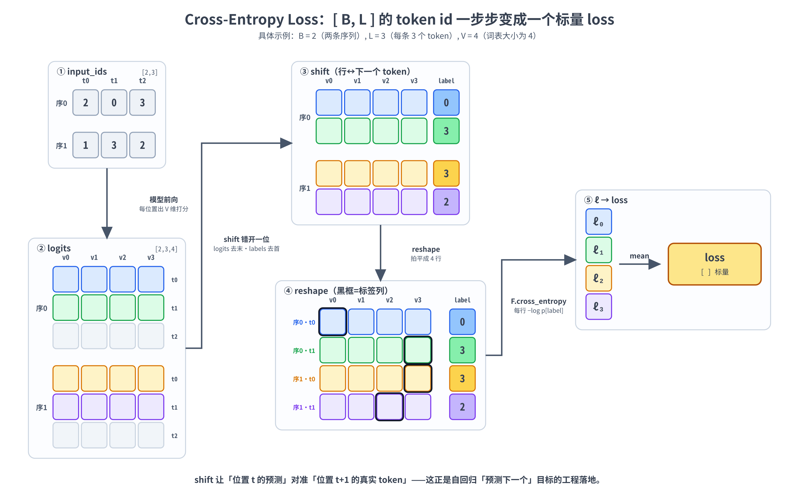
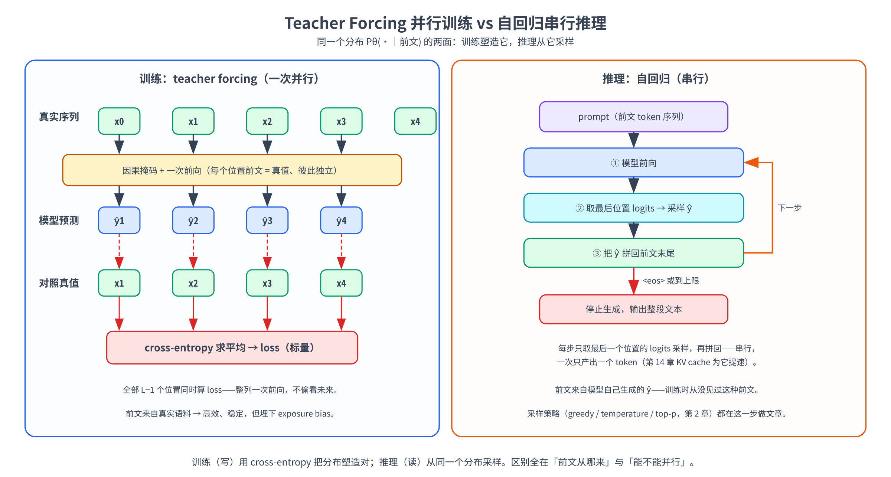

# 第十章：自回归语言建模目标——cross-entropy loss、teacher forcing 与推理采样的关系

第 3-9 章我们把一个 Decoder-only 模型从零件到整体拼了出来：tokenizer 把文本切成 id，embedding 把 id 查成向量，一连串形状守恒的 block 把它精炼，最后 lm_head 在每个位置输出一条「下一个 token」的词表打分（logits）。第 9 章末尾我们提到：**训练时 $L$ 个位置全用、每个位置预测它的下一个 token**——但这套「目标函数」到底长什么样、为什么是它、它怎么变成一个能被梯度下降优化的标量，前面一直没有正式展开。这一章就来把它讲清楚。

具体来说，本章会回答三个环环相扣的问题：

- **目标是什么？** 自回归语言建模把「一句话的概率」拆成一串「预测下一个 token」，训练就是让真实语料在模型眼里的概率尽量大——这正是**极大似然估计（MLE）**，而它等价于最小化**交叉熵（cross-entropy）**。
- **训练怎么一次算完？** 推理时模型只能一个 token 一个 token 往外输出，可训练时却能对一整句的 $L$ 个位置**并行**算 loss——靠的是**teacher forcing**（喂真值）加上第 6 章那个因果掩码。
- **训练和推理什么关系？** 训练学的是条件分布 $P_\theta(\text{下一个 token} \mid \text{前文})$ ，推理就是反复从这个分布里**采样**——第 2 章讲的 greedy / temperature / top-p，全都是在这同一个分布上做文章。中间还藏着一个训练与推理的**分布失配（exposure bias）**，本章会点明它的来历。

实战部分回到本书默认的 **Qwen3-8B（T4 + 4-bit 量化）**：先用一个可手算的示例把交叉熵和 `F.cross_entropy` 对齐，再在真实文本上算自回归 loss 与 perplexity（困惑度，越小越好）、看清 logits 与 label「错一位」的对齐，接着亲手验证「一次并行 forward 等于 $L$ 次串行」的 teacher forcing 等价性，最后从训练分布走到推理采样，把贪心生成和 exposure bias 演示一遍。

> 想直接跑示例？点这里 [](https://colab.research.google.com/github/weiqiangnd/LearningLLM/blob/main/src/10.ipynb)。
>
> **硬件门槛**：T4（15 GB）✅。本章实战用 4-bit 量化加载 Qwen3-8B（权重约 5.5 GB），Colab 免费 T4 即可跑通；手算交叉熵那几个 cell 是纯 CPU 小张量，不挑运行时。
>
> 〔预备知识〕本章**密集**用到极大似然估计、熵 / 交叉熵与负对数似然（NLL）——它们是自回归语言建模损失的数学内核。若不熟悉，建议先读 P03。

## 目录

- [一、从「预测下一个词」到一个能优化的目标函数](#一从预测下一个词到一个能优化的目标函数)
  - [1.1 回顾：自回归分解把「一句话的概率」拆成「逐词预测」](#11-回顾自回归分解把一句话的概率拆成逐词预测)
  - [1.2 极大似然：让训练语料在模型眼里最可能](#12-极大似然让训练语料在模型眼里最可能)
  - [1.3 从 MLE 到最小化交叉熵：同一枚硬币的两面](#13-从-mle-到最小化交叉熵同一枚硬币的两面)
- [二、Cross-Entropy Loss：逐 token 的监督信号](#二cross-entropy-loss逐-token-的监督信号)
  - [2.1 单个位置：交叉熵就是「负对数似然」](#21-单个位置交叉熵就是负对数似然)
  - [2.2 整句与整批：对所有位置求平均](#22-整句与整批对所有位置求平均)
  - [2.3 shift 对齐：input 与 label 错开一位](#23-shift-对齐input-与-label-错开一位)
  - [2.4 从 logits 到一个标量 loss 的完整形状变换](#24-从-logits-到一个标量-loss-的完整形状变换)
  - [2.5 哪些位置不算 loss：padding 与 loss masking](#25-哪些位置不算-losspadding-与-loss-masking)
  - [2.6 Perplexity：交叉熵的指数，一眼看懂的困惑度](#26-perplexity交叉熵的指数一眼看懂的困惑度)
- [三、Teacher Forcing：训练为什么能一次并行算完](#三teacher-forcing训练为什么能一次并行算完)
  - [3.1 自回归的「先有鸡还是先有蛋」](#31-自回归的先有鸡还是先有蛋)
  - [3.2 Teacher forcing：训练时一律喂真值](#32-teacher-forcing训练时一律喂真值)
  - [3.3 因果掩码让 L 个条件概率一次算完](#33-因果掩码让-l-个条件概率一次算完)
  - [3.4 代价：训练与推理的分布失配（exposure bias）](#34-代价训练与推理的分布失配exposure-bias)
- [四、训练目标与推理采样的关系](#四训练目标与推理采样的关系)
  - [4.1 同一个分布：训练学到它，推理从它采样](#41-同一个分布训练学到它推理从它采样)
  - [4.2 推理是串行自回归：一次一个 token](#42-推理是串行自回归一次一个-token)
  - [4.3 采样策略都在这同一个分布上做文章](#43-采样策略都在这同一个分布上做文章)
  - [4.4 一张图收束：teacher forcing 训练 vs 自回归推理](#44-一张图收束teacher-forcing-训练-vs-自回归推理)
- [五、实战：把目标函数、loss 与采样跑一遍](#五实战把目标函数loss-与采样跑一遍)
  - [5.1 环境自检与依赖](#51-环境自检与依赖)
  - [5.2 手算一次交叉熵：和 F.cross_entropy 对齐](#52-手算一次交叉熵和-fcross_entropy-对齐)
  - [5.3 加载 Qwen3-8B](#53-加载-qwen3-8b)
  - [5.4 真实文本上的自回归 loss 与 perplexity](#54-真实文本上的自回归-loss-与-perplexity)
  - [5.5 验证 teacher forcing：一次并行等于 L 次串行](#55-验证-teacher-forcing一次并行等于-l-次串行)
  - [5.6 从训练分布到推理采样：贪心生成与 exposure bias](#56-从训练分布到推理采样贪心生成与-exposure-bias)
- [六、关键概念回顾](#六关键概念回顾)
- [七、本章小结](#七本章小结)

---

## 一、从「预测下一个词」到一个能优化的目标函数

### 1.1 回顾：自回归分解把「一句话的概率」拆成「逐词预测」

第 9 章 第 1.1 节给过这条公式，这里我们把它当起点正式展开。语言模型的任务是给一段文本估计概率 $P(w_1, w_2, \dots, w_n)$ 。直接对「一整句话」建模是不现实的——可能的句子有天文数字那么多。但有一个永远成立的恒等式（概率的**链式法则**，chain rule）能把它拆开：

$$
P(w_1, w_2, \dots, w_n) = \prod_{t=1}^{n} P(w_t \mid w_1, \dots, w_{t-1})
$$

读法是：一句话的联合概率，等于「逐个 token 往下预测」的条件概率连乘——第 1 个 token 的概率、乘上「在第 1 个 token 之后第 2 个 token」的概率、再乘上「在前 2 个之后第 3 个」的概率……以此类推。为书写方便，记 $w_{\lt t} = (w_1, \dots, w_{t-1})$ 表示「位置 $t$ 之前的全部 token」（前文），上式就简写成：

$$
P(w_1, \dots, w_n) = \prod_{t=1}^{n} P(w_t \mid w_{\lt t})
$$

这个分解叫**自回归（autoregressive）**——「自」指它预测的目标（下一个 token）又会变成下一步的输入，「回归」指它一步步往后递推。注意这个恒等式**没有任何近似**：它对任意 token 序列都精确成立，纯粹是概率乘法公式的展开。它和第 9 章 第 1.2 节里 n-gram 的「马尔可夫假设」不一样——n-gram 为了数得过来，硬把 $w_{\lt t}$ 截断成「只看前 $n-1$ 个」，那才是近似；而 Transformer 不截断，让 $w_{\lt t}$ 是**完整前文**，靠的就是 self-attention 能一次看全左边所有位置（第 6 章的因果注意力）。

于是建模任务被化简成了一件具体得多的事：**做一个模型，输入前文 $w_{\lt t}$ ，输出「下一个 token 是词表里每个词的概率」这一整个分布 $P_\theta(\cdot \mid w_{\lt t})$ 。** 这正是第 9 章那条流水线干的活——lm_head 在每个位置输出 `[V]` 维 logits，过 softmax 就是这个分布（ $\theta$ 是模型的全部参数， $V$ 是词表大小）。

### 1.2 极大似然：让训练语料在模型眼里最可能

模型有了，怎么训练它？换句话说，**拿什么标准来衡量「这套参数 $\theta$ 好不好」？** 答案是**极大似然估计（Maximum Likelihood Estimation，MLE）**：好的参数，应该让我们手里的真实训练语料，在模型眼里出现的概率尽量大（ P03 第 3 节）。

设训练语料是一句（或一段）真实文本 $w_1, \dots, w_n$ 。把它代进上面的自回归分解，模型给这句话打的概率（**似然**，likelihood）就是：

$$
P_\theta(w_1, \dots, w_n) = \prod_{t=1}^{n} P_\theta(w_t \mid w_{\lt t})
$$

MLE 的核心思想是：**调 $\theta$ ，让这个乘积最大。** 直觉很自然——真实出现过的句子，就该是模型认为「最可能」的句子；模型越觉得真实语料理所当然，它就越懂这门语言。

但连乘有两个工程上的麻烦：几百上千个小于 1 的概率连乘，数值会迅速下溢到 0；而且乘积求导也不方便。标准解法是**取对数**，把连乘变连加——log 是单调增的，最大化 $P$ 等价于最大化 $\log P$ ，不改变最优 $\theta$ （ P03 第 3.2 节）：

$$
\log P_\theta(w_1, \dots, w_n) = \sum_{t=1}^{n} \log P_\theta(w_t \mid w_{\lt t})
$$

这个 $\sum_t \log P_\theta(w_t \mid w_{\lt t})$ 就是**对数似然（log-likelihood）**。MLE 的目标，就是把它最大化。

### 1.3 从 MLE 到最小化交叉熵：同一枚硬币的两面

习惯上优化器都在做**最小化**。给「最大化对数似然」取个负号，就变成「最小化**负对数似然**（Negative Log-Likelihood，NLL）」——同一件事，换个说法：

$$
\mathcal{L}(\theta) = -\sum_{t=1}^{n} \log P_\theta(w_t \mid w_{\lt t})
$$

这个 $\mathcal{L}(\theta)$ 就是自回归语言建模的损失函数。**而它逐项就是交叉熵。** 在「真实标签是一个确定的类别」（one-hot）的情形下，交叉熵 $H(p, q) = -\sum_c p(c)\log q(c)$ 会塌缩成「只剩真实类别那一项的负对数概率」（ P03 第 5.2 节）。

具体到我们这里：位置 $t$ 的**真实**下一个 token 是 $w_t$ ，它对应一个 one-hot 的「真实分布」 $p$ （在 $w_t$ 这一类上是 1、其余全 0）；模型预测的分布是 $q = P_\theta(\cdot \mid w_{\lt t})$ 。两者的交叉熵就是：

$$
H(p, q) = -\sum_{c=1}^{V} p(c)\log q(c) = -\log q(w_t) = -\log P_\theta(w_t \mid w_{\lt t})
$$

中间那个等号正是 one-hot 塌缩：求和里只有 $c = w_t$ 那一项的 $p(c) = 1$ 、其余 $p(c) = 0$ ，所以整个求和只剩 $-\log q(w_t)$ 一项。**所以「这个位置的交叉熵」和「这个位置的负对数似然」是同一个数。** 把所有位置加起来，就回到了上面那个 $\mathcal{L}(\theta)$ 。

一句话总结一下：**最大化似然 = 最大化对数似然 = 最小化负对数似然 = 最小化交叉熵**——这四种说法指的是**同一个训练目标**，只是从概率、对数、损失、信息论四个视角分别来看。下一节就把这个目标落到「每个位置一条交叉熵」的具体计算上。

这也解释了为什么实践中大家总是说「语言模型用 cross-entropy loss 训练」——它不是随意选择的损失函数，而是「让真实语料最可能」这个最自然的诉求，顺着 MLE 推导出来的**唯一**结果。

---

## 二、Cross-Entropy Loss：逐 token 的监督信号

### 2.1 单个位置：交叉熵就是「负对数似然」

把镜头推到**一个位置**上，看清这条 loss 具体怎么算。在位置 $t$ ，模型输入前文 $w_{\lt t}$ ，经过第 9 章那条流水线，lm_head 输出一个长度为 $V$ 的 **logits 向量** $z_t = (z_{t,1}, \dots, z_{t,V})$ ——每个分量是「下一个 token 是词表第 $j$ 个词」的原始打分（未归一化、可正可负）。先用 softmax 把它变成概率分布（ P03 第 2.3 节）：

$$
q_{t,j} = \frac{\exp(z_{t,j})}{\sum_{k=1}^{V} \exp(z_{t,k})}
$$

然后这个位置的损失，就是真实下一个 token $w_t$ 对应那一项概率的负对数：

$$
\ell_t = -\log q_{t,\thinspace w_t} = -\log \frac{\exp(z_{t,\thinspace w_t})}{\sum_{k=1}^{V} \exp(z_{t,k})}
$$

直觉上看：模型给真实 token 的概率 $q_{t,\thinspace w_t}$ 越接近 1， $-\log$ 越接近 0，loss 越小；要是模型给真实 token 的概率很低（说明它预测错了）， $-\log$ 就会很大，loss 重重地罚下去。**这一项 $\ell_t$ 就是位置 $t$ 的一条监督信号**——它在说「在这段前文之后，你本该把概率集中到 $w_t$ 上」。

### 2.2 整句与整批：对所有位置求平均

一句话有很多个位置，每个位置都贡献一条 $\ell_t$ 。第 1.3 节的 $\mathcal{L}(\theta)$ 是把它们**求和**；但实践中我们更常对它们取**平均**，因为求和会让长句子的 loss 天然比短句子大，不利于跨样本比较，也会让 loss 的量级随序列长度漂移。于是整句 loss 取所有位置的平均：

$$
\mathcal{L} = \frac{1}{T} \sum_{t=1}^{T} \ell_t = -\frac{1}{T} \sum_{t=1}^{T} \log P_\theta(w_t \mid w_{\lt t})
$$

其中 $T$ 是这句话里**真正参与算 loss 的位置数**（下面第 2.3 节、第 2.5 节会说清哪些位置参与、哪些不算）。训练时一个 batch 有很多句话，最终的 batch loss 就是把所有句子、所有有效位置的 $\ell_t$ 一起平均成**一个标量**——这个标量就是 `loss.backward()` 的起点，梯度从这里一路回传到模型每一个参数（P01、P02 的训练三步）。

这里有一点值得专门说明：**平均 loss 的物理含义，是「模型平均每个 token 要付多少 nat 的意外程度」**（用自然对数时单位是 nat）。loss = 2.0 粗略意味着模型在每个位置上平均相当于在 $e^{2.0} \approx 7.4$ 个等可能选项里猜——这正是第 2.6 节 perplexity 的来历。

### 2.3 shift 对齐：input 与 label 错开一位

**模型在位置 $t$ 预测的是位置 $t+1$ 的 token**，所以「输入」和「标签」必须**错开一位**。设我们有一句已经 token 化的文本，token id 序列为 `[x0, x1, x2, x3, x4]`（长度 $L = 5$ ）。自回归的监督关系是：

```
位置 0 看 x0           → 预测 x1
位置 1 看 x0,x1        → 预测 x2
位置 2 看 x0,x1,x2     → 预测 x3
位置 3 看 x0,x1,x2,x3  → 预测 x4
位置 4 看 x0..x4       → 预测 x5（没有了！这句话到此为止）
```

看出来了吗：**最后一个位置没有标签**（它要预测的 `x5` 不存在），而**第一个 token `x0` 永远不会成为任何位置的标签**（没有哪个位置的任务是「预测第一个 token」）。所以标准做法是把整条序列**切成错开一位的两段**：

$$
\underbrace{[\thinspace x_0,\ x_1,\ x_2,\ x_3\thinspace]}_{\text{inputs（喂给模型）}} \qquad \underbrace{[\thinspace x_1,\ x_2,\ x_3,\ x_4\thinspace]}_{\text{labels（监督目标）}}
$$

inputs 是原序列**去掉最后一个**，labels 是原序列**去掉第一个**。这样一来，inputs 的第 $i$ 个位置（看着 $x_0 \dots x_i$ ）就对准 labels 的第 $i$ 个目标（ $x_{i+1}$ ），逐位置一一对应。在 PyTorch / HuggingFace 里，这个错位通常写成对 logits 和 labels 各做一次切片：

```python
# logits: [B, L, V]，labels: [B, L]（这里 labels 直接复用 input_ids）
shift_logits = logits[:, :-1, :]    # 丢掉最后一个位置的预测（它没有对应标签）
shift_labels = labels[:, 1:]        # 丢掉第一个 token（它不作为任何位置的标签）
loss = F.cross_entropy(
    shift_logits.reshape(-1, V),    # [B*(L-1), V]
    shift_labels.reshape(-1),       # [B*(L-1)]
)
```

> **一个常见的便利**：HuggingFace 的 `AutoModelForCausalLM` 在你给 `forward(..., labels=input_ids)` 时，**会自动帮你做这个 shift**——你把完整的 `input_ids` 同时当输入和标签传进去，模型内部就切好 `[:-1]` / `[1:]` 再算 cross-entropy，直接返回 `outputs.loss`。所以实战里你常看到 `labels=input_ids` 这种「自己监督自己」的写法，是「错一位」这件事已经由模型内部替你处理好了。

### 2.4 从 logits 到一个标量 loss 的完整形状变换

把 2.1-2.3 串起来，走一遍**完整的形状变换**，看清一句话怎么从一串 id 变成一个标量 loss（以 batch 大小 $B$ 、序列长 $L$ 、词表 $V$ 为例）：



```
input_ids        [B, L]              ← tokenizer 输出的整数 id
   │  模型前向（第 9 章那条流水线，teacher forcing 下一次算完）
   ▼
logits           [B, L, V]           ← 每个位置一条「下一个 token」的词表打分
   │  shift：错开一位对齐
   ▼
shift_logits     [B, L-1, V]   ┐
shift_labels     [B, L-1]      ┘     ← 第 i 个预测 对准 第 i+1 个真实 token
   │  reshape 把 batch 和位置两维拍平（cross_entropy 只认「样本 × 类别」二维）
   ▼
logits_2d        [B*(L-1), V]  ┐
labels_1d        [B*(L-1)]     ┘
   │  F.cross_entropy：每行一个 -log q[label]，再对所有行求平均
   ▼
loss             []（标量）          ← 一个数，loss.backward() 的起点
```

几个形状要点：

- **logits 的最后一维是 $V$**（词表大小，Qwen3 约 15 万），它是整条流水线里**唯一**一处维度暴涨的地方——前面主干一直是 $d_{\text{model}}$ 宽，到 lm_head 才投到 $V$ 。这也是为什么 lm_head 和 embedding 是模型里最大的两个单一权重矩阵（第 9 章 第 2.3 节）。
- **`cross_entropy` 要求二维输入**：它接收 `[样本数, 类别数]` 的 logits 和 `[样本数]` 的整数 label，两者按样本一一对应。所以要先 `reshape(-1, V)` 把 `[B, L-1]` 这两维拍平成「一共 $B \times (L-1)$ 个待预测位置」，每个位置都是一道 $V$ 选 1 的分类题。
- **label 是整数 id、不是 one-hot**：`cross_entropy` 直接输入类别下标（`shift_labels` 里就是 token id），内部按下标取出对应那一项的 log 概率，等价于 one-hot 点乘但更省。
- **最终 loss 是标量**：无论 batch 多大、句子多长，反传的起点永远是一个数。

### 2.5 哪些位置不算 loss：padding 与 loss masking

第 2.2 节说 loss 是「对**有效位置**求平均」，那反过来，哪些位置是不算 loss 的「无效位置」？有两种典型情况：

**① Padding（填充）位置。** 一个 batch 里句子长短不一，为了拼成规整的 `[B, L]` 张量，短句要用一个特殊的 `<pad>` token 补到一样长。这些 pad 位置是**人为塞进去的、不是真实语言**，绝不能让它们贡献 loss——否则模型会去「学习预测 padding」，纯属噪声。做法是把这些位置的 label 设成一个**忽略标记**：PyTorch 的 `F.cross_entropy` 有个 `ignore_index` 参数（默认 $-100$ ），凡是 label 等于这个值的位置，loss 直接跳过、也不参与分母里的平均。

```python
# attention_mask: [B, L]，padding 位是 0。它要先跟 shift_labels 一样错开一位再用：
shift_mask   = attention_mask[:, 1:]          # 对齐到 shift_labels 的那一位
shift_labels = shift_labels.clone()           # 别原地改到别处还在用的张量
shift_labels[shift_mask == 0] = -100          # 把 padding 位置的 label 屏蔽掉
loss = F.cross_entropy(shift_logits.reshape(-1, V),
                       shift_labels.reshape(-1),
                       ignore_index=-100)      # 这些位置不算 loss、也不计入平均
```

**② Loss masking（监督掩码）。** 这是后训练（SFT，第 28 章）里非常重要的一招，这里先埋个伏笔。做对话微调时，一条样本是「用户问 + 模型答」拼起来的，但我们通常**只想让模型学「答」、不想让它学「复述问题」**。做法同样是把「问」那一段的 label 全设成 $-100$ ，只在「答」那段算 cross-entropy。可见 $-100$ 这个忽略机制不只对付 padding，更是「精确控制哪些 token 提供监督」的通用开关。

> 把这两点和第 2.2 节合起来看： $\mathcal{L} = \frac{1}{T}\sum \ell_t$ 里的 $T$ ，准确说是「label 不等于 ignore_index 的位置数」——分子分母都只数有效位置。实战第 5.4 节我们会拿掉 padding 的干扰（单句、无 pad），把注意力放在「错一位」本身。

### 2.6 Perplexity：交叉熵的指数，一眼看懂的困惑度

交叉熵 loss 用自然对数（ln）算出来，单位是 **nat**（比如 2.5、3.1；若换成以 2 为底的 log₂，单位就是 bit），本身不太直观。语言建模里有个更好读的等价指标——**困惑度（perplexity，PPL）**，它就是平均交叉熵的指数：

$$
\text{PPL} = \exp(\mathcal{L}) = \exp\left( -\frac{1}{T}\sum_{t=1}^{T} \log P_\theta(w_t \mid w_{\lt t}) \right)
$$

它的含义非常具体：**模型在每个位置上，平均相当于在多少个「等可能选项」里做选择。** PPL = 1 表示模型每次都笃定地把概率 1 给了真实 token（完美预测）；PPL = 100 表示模型平均每步相当于在 100 个候选里瞎猜。所以**PPL 越低，语言模型越好**——它对真实文本越不「意外」。

举个最小的数值例子：假设词表里有 4 个等可能的词，一个完全没训练过的模型对每个词都给 $1/4$ 概率，那么每个位置 $\ell_t = -\log(1/4) = \log 4 \approx 1.386$ ，PPL $= \exp(\log 4) = 4$ ——正好等于「4 个里瞎猜」。这也是为什么 PPL 常被拿来和「词表大小」做参照：一个 PPL 跟词表大小同量级的模型，基本等于没把概率集中到对的 token 上；PPL 越往下压，说明它越笃定、越能把概率集中到真实的下一个 token 上。

> 注意 PPL 依赖 tokenizer——同一段文本，词表 / 切分方式不同，token 数 $T$ 和每步分布都不同，PPL 不可直接跨 tokenizer 比较（第 3 章讲过中英文 token 压缩率差异）。所以报 PPL 时一般要锁定同一套 tokenizer 和同一份测试集。实战第 5.4 节会在 Qwen3 上实际算一次，把「loss → PPL」这步走通。

---

## 三、Teacher Forcing：训练为什么能一次并行算完

### 3.1 自回归的「先有鸡还是先有蛋」

自回归有个绕不开的循环依赖：要算位置 $t$ 的预测，得先有前文 $w_{\lt t}$ ；可前文里的 $w_{t-1}$ 又是上一步「预测」出来的……如果训练时也让模型**用自己的预测**当下一步的输入，会出两个大问题：

1. **没法并行**：必须先算出位置 0 的输出、采样出一个 token、拼回去、再算位置 1……一句长为 $L$ 的话要串行跑 $L$ 遍前向，慢到没法训练。
2. **训练初期全是错的**：刚初始化的模型预测基本是乱码，用乱码当前文去预测下一个，监督信号从一开始就建立在错误前提上，几乎学不会。

那训练时到底拿什么当「前文」？答案就是 teacher forcing。

### 3.2 Teacher forcing：训练时一律喂真值

**Teacher forcing（教师强制）的做法极其简单：训练时，每个位置的前文一律用训练语料里的真实 token，而不是模型自己上一步的预测。** 就像有个老师在旁边，不管模型上一步答得对不对，下一步都直接把**标准答案的前文**塞给它。

回到第 2.3 节那句 `[x0, x1, x2, x3, x4]`：teacher forcing 下，

- 预测 $x_2$ 时，喂的前文是**真实的** `x0, x1`（哪怕模型在位置 1 其实预测错了，也不拿它的错误预测当输入）；
- 预测 $x_3$ 时，喂的前文是**真实的** `x0, x1, x2`；
- ……每个位置的前文都来自语料，**互不依赖模型的输出**。

这一下就把第 3.1 节的两个问题都解决了。因为每个位置的输入都是**已知的真值、彼此独立**，所以 $L$ 个位置的预测可以**同时**算——不再有「必须等上一步」的串行依赖。训练初期模型再差，也不影响前文的正确性，监督信号始终建立在真实前文上，学得稳。

第 9 章 第 3.4 节提到：「喂给 decoder 的是真实的目标 token，这叫 teacher forcing」。现在我们把它和 loss 接上了——**teacher forcing 提供「正确的前文」，cross-entropy 在每个位置比对「模型在该前文下的预测」和「真实的下一个 token」**。两者配合，才有了「一次前向、 $L$ 个位置一起算 loss」的高效训练。

### 3.3 因果掩码让 L 个条件概率一次算完

teacher forcing 把前文都换成了真值，**但还差一步**才能真正并行：怎么保证位置 $t$ 在算预测（预测 $x_{t+1}$ ）时，**只看见**它自己和左边的前文 $x_0 \dots x_t$ 、看不见 $x_{t+1}$ 及右边的未来？毕竟我们是把**整句**真值一次性喂进去的——要是位置 2 能瞟到位置 3 的 token，那它「预测 $x_3$ 」就成了抄答案，训出来的模型一到推理（没有答案可抄）就失效了。

这一步正是第 6 章的**因果掩码（causal mask）**。回忆一下：self-attention 算注意力分数 $QK^\top$ 后，把**上三角**（每个位置指向它右边那些位置的分数）置成 $-\infty$ ，softmax 之后这些位置的权重就成了 0——于是位置 $t$ 的输出**只**由 $w_{\le t}$ 加权得到，对未来「视而不见」。

把 teacher forcing 和因果掩码合起来看，并行就说得通了：

> **整句真值一次喂进去（teacher forcing）+ 因果掩码挡住每个位置的右侧（causal mask）= 一次前向同时算出全部 $L$ 个条件概率 $P_\theta(w_t \mid w_{\lt t})$ ，且每一个都严格只依赖它该看的前文。**

这就是 Transformer 训练能「整句并行」的根本原因，也是第 9 章 第 4.1 节说 decoder-only「训练信号最密」的原因——一次前向， $L-1$ 个位置全是有效监督（末位预测无标签、不算），GPU 算力一点不浪费。对比 RNN：哪怕 RNN 也用 teacher forcing 喂真值，它的隐藏状态还是得一个时间步一个时间步地递推，没法像 attention 这样一次矩阵乘搞定全部位置。**并行性来自「因果掩码 + 注意力」这套结构，teacher forcing 只是让「喂什么」这件事变得彼此独立、从而允许并行。** 两者缺一不可。

### 3.4 代价：训练与推理的分布失配（exposure bias）

teacher forcing 这么好，有没有代价？有，而且这个代价有个专门的名字——**exposure bias（暴露偏差）**，它是理解「训练目标 vs 推理采样」关系绕不开的一环。

问题出在**训练和推理喂的前文来源不一样**：

- **训练时**，每个位置的前文都是**真实语料**（teacher forcing）——模型从没见过「以自己生成的、可能有错的文本为前文」是什么体验。
- **推理时**，没有标准答案可喂了，模型只能拿**自己上一步生成的 token** 当前文，一步步往下输出（第 4.2 节细说）。

于是出现一个微妙的失配：模型被训练成「**在完美前文下**预测下一个 token」的专家，可一到推理，它面对的是「**自己生成的、可能已经跑偏的前文**」。一旦某一步采样出一个略差的 token，这个 token 就进入了后续所有步骤的前文——而这种「带瑕疵的前文」是训练分布里**几乎没出现过**的，模型对它的预测就更不可靠，误差可能像滚雪球一样累积。这就是 exposure bias：**模型在推理时被「暴露」给了一种它训练时从未见过的输入分布。**

这正是第 2 章那些采样策略背后的部分动机——纯 greedy 容易陷入重复 / 退化，temperature、top-p、repetition_penalty 等手段在一定程度上也是在缓和「一步走偏、步步走偏」的连锁反应。学术上还有 scheduled sampling（训练时以一定概率混入模型自己的预测当前文）、序列级训练目标等专门对治 exposure bias 的方法，但它们都带来训练复杂度和并行性的损失，所以**主流大模型训练至今仍然是「teacher forcing + cross-entropy」这套最朴素的配方**——它的并行效率优势实在太大，而 exposure bias 在大数据、大模型下被实践证明没有想象中那么严重。

> 记住这个张力：**teacher forcing 用「训练时喂真值」换来了并行和稳定，代价是埋下了训练 / 推理的分布失配。** 下一节我们就正面回答「训练目标」和「推理采样」到底是什么关系——它们共享同一个分布，差别只在「前文从哪来」。

---

## 四、训练目标与推理采样的关系

### 4.1 同一个分布：训练学到它，推理从它采样

前面几节铺垫到这里，可以把训练和推理这两件事，统一到**同一个对象**上了——那就是模型的条件分布

$$
P_\theta(\cdot \mid \text{前文}) = \text{softmax}(z)
$$

其中 $z$ 是 lm_head 在当前位置输出的 `[V]` 维 logits。围绕这一个分布，训练和推理各做各的事：

| | 训练 | 推理 |
|---|------|------|
| **对这个分布做什么** | 用 cross-entropy **塑造**它：把概率往真实下一个 token 上压 | 从它里面**采样**：挑一个 token 作为输出 |
| **前文从哪来** | 真实语料（teacher forcing） | 模型自己已生成的 token（自回归） |
| **怎么并行** | 整句一次前向、 $L$ 个位置同时算 | 串行，一次只能产出一个位置的 token |
| **目标 / 动作** | 最小化 $-\log P_\theta(w_t \mid w_{\lt t})$ | 按某种策略从 $P_\theta(\cdot \mid w_{\lt t})$ 取一个 token |

一句话：**训练是「教模型把这个分布塑造对」，推理是「拿训练好的这个分布来生成」。** 它们不是两套独立机制，而是同一个 $P_\theta(\cdot \mid \text{前文})$ 的「写」和「读」两面。训练（写）调参数让分布逼近真实语言的统计规律；推理（读）冻住参数、反复查询这个分布并采样。

### 4.2 推理是串行自回归：一次一个 token

具体看推理怎么跑。给定一段 prompt（前文），生成过程是一个**循环**，每轮产出一个 token，再把它接回前文进入下一轮：

```
前文 = prompt 的 token 序列
循环：
  1. 模型前向，拿到【最后一个位置】的 logits z          # [V]
  2. 按采样策略从 softmax(z) 里挑一个 token              # greedy / top-p / ...（第 2 章）
  3. 把这个 token 拼到前文末尾
  4. 若是 <eos> 或到达长度上限 → 停；否则回到第 1 步
```

和训练的关键差别有两个：

- **只用最后一个位置的 logits。** 训练时每个位置的预测都参与监督（末位无标签的除外，共 $L-1$ 个都算 loss）；推理时虽然模型同样对所有位置输出了 logits，但我们**只取最后一个位置**那条来采样下一个 token——前面位置的预测在生成阶段没用（它们对应的「下一个 token」早就是已知的前文了）。第 9 章 第 2.2 节的「生成时只用最后一个位置、训练时 $L$ 个位置全用」，说的就是这件事。
- **串行、没法并行。** 第 $t+1$ 个 token 必须等第 $t$ 个采样完、拼回前文后才能算——这是自回归的本性，也是推理比训练慢、且难以打满 GPU 的根源。每多生成一个 token 就要重跑一遍前向，而每次前向又要把整段前文重新过一遍 attention——**这正是第 14 章 KV cache 要解决的问题**：把前文已经算过的 K、V 缓存下来，避免每步重复计算，让自回归生成快起来。

### 4.3 采样策略都在这同一个分布上做文章

第 2 章我们详细拆过 greedy、temperature、top-k、top-p、repetition_penalty。现在站在本章的高度回看，会发现它们其实都是**对同一个 $P_\theta(\cdot \mid \text{前文})$ 做的不同「取数」方式**——模型给出的分布是固定的，策略只决定「怎么从这个分布里挑 token」：

- **greedy（贪心）**：直接取概率最大的那个 token（ $\arg\max$ ），等价于 temperature → 0 的极限。完全确定、可复现，但容易重复、缺乏多样性。
- **temperature（温度）**：把 logits 除以 $T$ 再 softmax，调节分布的尖锐 / 扁平（ P03 第 2.3 节）。 $T < 1$ 更尖（更保守、更接近 greedy）， $T > 1$ 更平（更随机、更有创造性）。
- **top-k / top-p（nucleus）**：先把分布**截断**到最可能的若干 token（top-k 取前 $k$ 个，top-p 取累计概率达 $p$ 的最小集合），再在截断后的子集里归一化采样——砍掉长尾里的低质 token，避免偶尔采到离谱的词。
- **repetition_penalty**：对已出现过的 token 调低 logits，缓解 4.1 那个分布的「自我强化重复」倾向。

关键认识是：**这些旋钮没有一个会去改训练目标，也不改模型参数。** 训练只负责把 $P_\theta$ 这个分布学好；采样策略是推理时的「读取方式」，在已经训好的分布上做文章。所以同一个模型配不同采样参数，能在「严谨稳定」和「天马行空」之间自由滑动，而背后那个 $P_\theta(\cdot \mid \text{前文})$ 始终是训练阶段用 cross-entropy 雕出来的同一个。把第 2 章和本章接起来看就清楚了：**第 2 章讲的是「怎么读」，本章讲的是「这个被读的分布是怎么写出来的」。**

### 4.4 一张图收束：teacher forcing 训练 vs 自回归推理

把训练和推理两条路并排画在一起，本章的核心关系就一目了然——**它们查询的是同一个模型、同一个分布，区别全在「前文从哪来」和「能不能并行」**：



```
【训练：teacher forcing，一次并行】
  真实序列  x0   x1   x2   x3   x4
            │    │    │    │
  喂真值 →  x0  x0:1 x0:2 x0:3        （每个位置的前文都是真值，彼此独立）
            ▼    ▼    ▼    ▼
  预测   →  ŷ1   ŷ2   ŷ3   ŷ4          （ŷ = 模型预测的下一个 token；一次前向，因果掩码挡住右侧）
            │    │    │    │
  对照真值  x1   x2   x3   x4
            └────┴────┴────┴──► cross-entropy 求平均 → loss（标量）

【推理：自回归，串行】
  prompt → [前向 → 取最后位置 logits → 采样 ŷ1] → 拼回
         → [前向 → 取最后位置 logits → 采样 ŷ2] → 拼回
         → ... 直到 <eos>
         （每一步的前文 = prompt + 模型自己生成的 ŷ，无真值可喂）
```

读这张图抓三个对比：

1. **前文来源**：训练喂**真值**（teacher forcing），推理喂**模型自己的输出**（自回归）——这就是第 3.4 节 exposure bias 的来源。
2. **并行性**：训练**整列一次算完**（靠因果掩码），推理**一步一个、串行**（靠循环拼接）。
3. **用哪些位置**：训练用**全部 $L-1$ 个位置**算 loss，推理每步只用**最后一个位置**采样。

但无论训练还是推理，每个位置输出的那个 $P_\theta(\cdot \mid \text{前文})$ ——同一个模型、同一套参数、同一种 softmax——是完全一致的。**训练把它塑造对，推理从它采样**，这就是本章标题里「自回归语言建模目标、cross-entropy loss、teacher forcing 与推理采样」四者的关系全貌。

---

## 五、实战：把目标函数、loss 与采样跑一遍

这一节我们在本书默认的 **Qwen3-8B（T4 + 4-bit 量化）** 上，把前四节的概念逐个落到代码上：手算交叉熵对齐 `F.cross_entropy`、在真实文本上算自回归 loss 与 perplexity、验证 teacher forcing 的「一次并行等于 $L$ 次串行」、再从训练分布走到推理采样看 exposure bias。

### 5.1 环境自检与依赖

**Cell 0** 做硬件自检，确认拿到的是 GPU、显存够加载 4-bit 量化的 Qwen3-8B；**Cell 1** 装依赖。Qwen3 系列要求 `transformers>=4.51`，4-bit 量化要 `bitsandbytes`。

```python
# Cell 0: 硬件自检
import torch
print("CUDA 可用:", torch.cuda.is_available())
if torch.cuda.is_available():
    print("GPU:", torch.cuda.get_device_name(0))
    vram = torch.cuda.get_device_properties(0).total_memory / 1024**3
    print(f"显存: {vram:.1f} GB")
else:
    print("⚠️ 没检测到 GPU。手算交叉熵的 cell（5.2）能在 CPU 跑；"
          "加载 Qwen3-8B 的 cell 需要 T4 及以上，请切到 GPU 运行时。")
```

```python
%%capture
# Cell 1: 安装依赖
# %%capture 必须是 cell 第一行，把冗长的 pip 日志藏起来。
# transformers>=4.51：Qwen3 架构支持；accelerate：device_map 自动放置；
# bitsandbytes：4-bit NF4 量化，让 8B 模型在 T4（15 GB）上放得下。
!pip install -q -U "transformers>=4.51" accelerate bitsandbytes
```

### 5.2 手算一次交叉熵：和 F.cross_entropy 对齐

**Cell 2** 先脱离大模型，用一个**可手算**的示例，把第 2.1 节的公式 $\ell = -\log \text{softmax}(z)[\text{label}]$ 亲手算一遍，并和 `F.cross_entropy` 对齐。

```python
# Cell 2: 手算交叉熵 vs F.cross_entropy（纯 CPU 小张量）
import torch
import torch.nn.functional as F

# 假设词表只有 5 个 token，模型在某个位置输出这条 raw logits：
logits = torch.tensor([2.0, 1.0, 0.1, -1.0, 0.5])   # [V=5]
label  = torch.tensor(1)                             # 真实的下一个 token 是 id=1

# —— 手算：softmax → 取真实类别的概率 → 负对数 ——
probs = torch.softmax(logits, dim=-1)               # 先归一化成概率分布
p_true = probs[label]                               # 真实 token 那一项的概率
manual_loss = -torch.log(p_true)                    # ℓ = -log q[label]
print(f"softmax 概率: {probs.numpy().round(4)}")
print(f"真实 token 概率 q[1] = {p_true:.4f}")
print(f"手算 loss = {manual_loss:.4f}")

# —— F.cross_entropy：直接吃 raw logits（注意要加 batch 维）——
auto_loss = F.cross_entropy(logits.unsqueeze(0), label.unsqueeze(0))
print(f"F.cross_entropy = {auto_loss:.4f}")         # 与手算一致
assert torch.allclose(manual_loss, auto_loss), "应当相等"
```

手算的 $\ell = -\log \text{softmax}(z)[\text{label}]$ 和 `F.cross_entropy` 给出的数完全一致，这就是第 2.1 节那条逐位置 loss 公式的代码验证。

### 5.3 加载 Qwen3-8B

**Cell 3** 用 bitsandbytes 4-bit NF4 + 双量化加载 Qwen3-8B，权重约 5.5 GB，T4 装得下——这套加载样板和第 1、2 章相同。

```python
# Cell 3: 4-bit 量化加载 Qwen3-8B
from transformers import AutoModelForCausalLM, AutoTokenizer, BitsAndBytesConfig
import torch

model_name = "Qwen/Qwen3-8B"
bnb_config = BitsAndBytesConfig(
    load_in_4bit=True,                       # 开 4-bit 量化
    bnb_4bit_quant_type="nf4",               # NF4：对正态分布权重更友好的 4-bit 类型
    bnb_4bit_use_double_quant=True,          # 双量化，再省一点显存
    bnb_4bit_compute_dtype=torch.float16,    # T4 是 Turing，不支持 bf16，用 fp16 计算
)
tokenizer = AutoTokenizer.from_pretrained(model_name)
model = AutoModelForCausalLM.from_pretrained(
    model_name, quantization_config=bnb_config, device_map="auto",
)
model.eval()                                 # 推理 / 算 loss 都不需要 dropout
# 注意：4-bit 权重被打包成 uint8（每字节塞 2 个 4-bit 值），下面 numel 数的是打包后的元素数，
# 约为名义参数量（8B）的一半，这里只当作「加载成功」的粗略指示，不是真实参数量。
print("加载完成。参数张量 numel 合计（4-bit 打包后，约名义参数量的一半）:",
      sum(p.numel() for p in model.parameters()))
```

### 5.4 真实文本上的自回归 loss 与 perplexity

**Cell 4** 把第 2.3-2.6 节走通：对一句真实文本做 tokenize、前向拿 logits、**手动 shift 对齐**算每个位置的 cross-entropy，再平均成 loss、取指数成 perplexity，并和「直接传 `labels=input_ids` 让模型自动 shift」的结果对齐。

```python
# Cell 4: 真实文本上的自回归 loss 与 perplexity
import torch, torch.nn.functional as F

text = "The capital of France is Paris."
ids = tokenizer(text, return_tensors="pt").input_ids.to(model.device)  # [1, L]
print("token 数 L =", ids.shape[1])

with torch.no_grad():
    logits = model(ids).logits          # [1, L, V]，每个位置一条「下一个 token」打分

# —— 手动 shift：错开一位对齐（2.3 节）——
shift_logits = logits[:, :-1, :]        # [1, L-1, V] 丢掉最后一个位置（无标签）
shift_labels = ids[:, 1:]               # [1, L-1]   丢掉第一个 token（不作标签）

# 每个位置一条 ℓ_t，先看清「逐位置」的 loss
per_token = F.cross_entropy(
    shift_logits.reshape(-1, shift_logits.size(-1)),  # [L-1, V]
    shift_labels.reshape(-1),                         # [L-1]
    reduction="none",                                 # 不平均，保留每个位置
)
toks = tokenizer.convert_ids_to_tokens(shift_labels[0])  # 每个位置要预测的真实下一个 token
for tok, l in zip(toks, per_token):
    print(f"  预测下一个 token {tok!r:>12} 的 loss = {l.item():.3f}")  # loss 越小=模型越笃定

mean_loss = per_token.mean()
ppl = torch.exp(mean_loss)
print(f"\n平均 cross-entropy loss = {mean_loss:.4f}")
print(f"perplexity = exp(loss) = {ppl:.2f}")

# —— 和模型内置的自动 shift 对齐（2.3 节那个 labels=input_ids 便利）——
with torch.no_grad():
    builtin = model(ids, labels=ids).loss
print(f"模型内置 loss（labels=input_ids，自动 shift）= {builtin:.4f}")  # 与手算一致
```

像 "Paris" 这种被前文强约束的 token，loss 会明显低于开头那些「没什么上下文可依靠」的 token——这就是第 2.1 节「模型越笃定、loss 越小」的直观体现。手算的平均 loss 和 `model(ids, labels=ids).loss` 应当一致，印证第 2.3 节说的「HuggingFace 替你做了 shift」。

### 5.5 验证 teacher forcing：一次并行等于 L 次串行

**Cell 5** 是第 3 节的核心实验：证明「**整句一次前向**（teacher forcing + 因果掩码）算出的每个位置的 next-token 分布，和**把前缀一段段单独喂进去**逐个算出来的，逐位置完全相同」。若两者相等，就印证了「因果掩码让位置 $t$ 严格只看 $w_{\le t}$ 」、训练的并行没有偷看未来。

```python
# Cell 5: teacher forcing 的并行 == 逐前缀串行
import torch

ids = tokenizer("Machine learning is fun", return_tensors="pt").input_ids.to(model.device)
L = ids.shape[1]

with torch.no_grad():
    # ① 一次并行：整句喂进去，拿到所有位置的 logits
    parallel_logits = model(ids).logits[0]          # [L, V]

    # ② 逐前缀串行：对每个前缀 ids[:, :t+1] 单独前向，取它最后一个位置的 logits
    serial_last = []
    for t in range(L):
        prefix = ids[:, : t + 1]                    # 只喂前 t+1 个 token
        logits_t = model(prefix).logits[0, -1]      # 该前缀最后位置 = 预测第 t+1 个 token
        serial_last.append(logits_t)
    serial_logits = torch.stack(serial_last)        # [L, V]

# 逐位置对比：并行的第 t 行 应当 == 串行喂前缀 ids[:, :t+1] 的最后一行
max_diff = (parallel_logits - serial_logits).abs().max()
print(f"并行 vs 串行 logits 最大差异 = {max_diff:.2e}")   # 量级远小于 logits 本身（4-bit 反量化+fp16 累积误差，通常 1e-3~1e-1）
print("结论：因果掩码下，一次并行前向 = 逐前缀分别前向——位置 t 只依赖它的前文。")
```

> 量化模型下两者会有很小的数值差异（4-bit 反量化 + fp16 计算的累积误差），但量级远小于 logits 本身，足以说明两条路算的是同一回事。若换成未量化的 fp32 模型，差异会更小。**这就是第 3.3 节那句「teacher forcing + 因果掩码 = 一次前向算出全部条件概率」的代码验证。**

### 5.6 从训练分布到推理采样：贪心生成与 exposure bias

**Cell 6** 把训练分布和推理采样接起来（第 4 节）：**手写**一个最朴素的贪心自回归循环（不调 `generate()`），亲眼看「每步只取最后位置 logits → 挑 argmax → 拼回前文」这个串行过程；再点明它和 teacher forcing 的差别——推理喂的是**模型自己**的输出。

```python
# Cell 6: 手写贪心自回归生成（推理 = 从训练学到的分布里一步步采样）
import torch

prompt = "The capital of France is"
ids = tokenizer(prompt, return_tensors="pt").input_ids.to(model.device)

generated = ids
with torch.no_grad():
    for step in range(5):                          # 生成 5 个 token
        logits = model(generated).logits           # [1, cur_len, V]
        next_logits = logits[0, -1]                # ★只取最后一个位置（4.2 节）
        next_id = next_logits.argmax()             # greedy = 取概率最大者（4.3 节）
        # 顺手看一眼这一步分布有多「笃定」：最大概率是多少
        p = torch.softmax(next_logits, dim=-1)[next_id]
        tok = tokenizer.decode(next_id)
        print(f"step {step}: 选中 {tok!r}（p={p:.3f}）")
        generated = torch.cat([generated, next_id.view(1, 1)], dim=1)  # 拼回前文 → 下一轮

print("\n完整输出:", tokenizer.decode(generated[0]))

# —— exposure bias 的直观点题 ——
# 训练时位置 t 的前文是【真实语料】；推理时（上面循环）前文是【模型自己生成的 token】。
# 一旦某步采样出一个略差的 token，它就进入后续所有步的前文——而这种「带瑕疵的前文」
# 在 teacher-forcing 训练里几乎没出现过（3.4 节）。greedy 因为每步都挑最大，
# 还容易陷入重复；第 2 章的 temperature / top-p 正是在这个分布上做文章来缓解。
```

把 5.5 和 5.6 对照着看，本章就闭环了：**5.5 展示训练那一面**（teacher forcing 喂真值、一次并行、每个位置都监督），**5.6 展示推理那一面**（喂模型自己的输出、串行、每步只用最后位置采样）——而两者查询的是同一套东西：self-attention 那套权重、那个 softmax、那个 $P_\theta(\cdot \mid \text{前文})$ 。训练把它塑造对，推理从它采样，仅此而已。

---

## 六、关键概念回顾

| 概念 | 一句话定义 |
|------|-----------|
| **自回归分解** | $P(w_{1:n}) = \prod_t P(w_t \mid w_{\lt t})$ ，概率链式法则的精确展开（非近似），把「一句话的概率」拆成「逐词预测」 |
| **极大似然估计（MLE）** | 调参数 $\theta$ 让真实训练语料的似然 $\prod_t P_\theta(w_t \mid w_{\lt t})$ 最大；取对数后变成最大化对数似然 |
| **NLL = 交叉熵** | 负对数似然 $-\sum_t \log P_\theta(w_t \mid w_{\lt t})$ ；在 one-hot 标签下逐项等于交叉熵——四种说法同一个目标 |
| **逐位置 loss** | $\ell_t = -\log \text{softmax}(z_t)[w_t]$ ，模型给真实下一个 token 的概率越高，loss 越小 |
| **shift 对齐** | 位置 $t$ 预测 $t+1$ ，所以 inputs 去掉末尾、labels 去掉开头，错开一位；HF 在 `labels=input_ids` 时自动做 |
| **ignore_index（-100）** | padding 位置与 SFT 里「不监督的段」把 label 设为 -100，cross_entropy 直接跳过、不计入平均 |
| **Perplexity** | $\exp(\text{平均 loss})$ ，「平均每步在多少个等可能选项里猜」；越低越好，依赖 tokenizer 不可跨词表比 |
| **Teacher forcing** | 训练时每个位置的前文一律喂**真实** token（而非模型预测），使各位置输入独立、可并行、训练稳 |
| **因果掩码的角色** | 把注意力上三角置 $-\infty$ ，保证位置 $t$ 只看 $w_{\le t}$ ；与 teacher forcing 合起来 = 一次前向算出全部条件概率 |
| **Exposure bias** | 训练喂真值、推理喂模型自己的输出，二者前文分布失配；一步走偏可能步步累积，是采样策略的部分动机 |
| **训练 vs 推理** | 同一个 $P_\theta(\cdot \mid \text{前文})$ 的两面：训练用 cross-entropy **塑造**它（并行、全位置监督），推理从它**采样**（串行、只用最后位置） |
| **采样策略的位置** | greedy / temperature / top-k / top-p / repetition_penalty 都只改「怎么读分布」，不改训练目标、不改参数（第 2 章） |

---

## 七、本章小结

- **自回归语言建模的目标，是「预测下一个词」顺着 MLE 推出来的唯一损失**。概率链式法则把 $P(w_{1:n})$ 精确拆成 $\prod_t P_\theta(w_t \mid w_{\lt t})$ ；让真实语料最可能（MLE）= 最大化对数似然 = 最小化负对数似然 = 最小化**交叉熵**——四种说法其实是同一个训练目标的四个视角。所以「语言模型用 cross-entropy 训练」不是约定俗成，而是从「让语料最可能」自然导出的结果。
- **cross-entropy loss 是逐 token 的监督信号**。每个位置 $\ell_t = -\log \text{softmax}(z_t)[w_t]$ ，整句 / 整批对所有**有效位置**求平均成一个标量。工程上三件事最容易错：`cross_entropy` 要喂 **raw logits**（别先 softmax）；inputs 与 labels 要**错开一位**（位置 $t$ 预测 $t+1$ ，HF 在 `labels=input_ids` 时自动 shift）；padding 与「不该监督的段」用 **ignore_index=-100** 屏蔽。loss 取指数就是 **perplexity**——「平均每步在多少个等可能选项里猜」，越低越好。
- **Teacher forcing 让训练能整句并行**。训练时每个位置的前文一律喂**真实** token，而非模型自己的预测——这让各位置的输入彼此独立、可同时计算，且监督始终建立在正确前文上。但光有 teacher forcing 不够，还要**因果掩码**挡住每个位置的右侧（防偷看未来）；二者合起来，才有了「一次前向算出全部 $L$ 个条件概率」的高效训练。这正是 decoder-only「训练信号最密」的来源。
- **代价是 exposure bias**：训练喂真值、推理喂模型自己的输出，两种前文分布失配，一步走偏可能步步累积。学界有 scheduled sampling 等对治方法，但都损失并行效率，所以主流大模型至今仍用最朴素的「teacher forcing + cross-entropy」——并行效率的优势太大，而大数据大模型下 exposure bias 没那么严重。
- **训练目标与推理采样，是同一个分布 $P_\theta(\cdot \mid \text{前文})$ 的写与读**。训练用 cross-entropy **塑造**这个分布（并行、 $L$ 个位置全监督、喂真值）；推理从这个分布**采样**（串行、每步只取最后位置、喂模型自己的输出）。第 2 章的 greedy / temperature / top-p 等采样策略，全都只是「怎么读这个分布」的不同方式，不改训练目标、不改参数。一句话：**训练把分布塑造对，推理从它采样**——这就是本章四个关键词的关系全貌。
- 实战我们在 Qwen3-8B 上手算交叉熵对齐了 `F.cross_entropy`、在真实文本上算了自回归 loss 与 perplexity 并验证手动 shift 等于模型内置 shift、亲手验证了「一次并行前向 = 逐前缀串行前向」印证因果掩码的作用，最后手写贪心自回归循环把训练分布和推理采样接上、点明了 exposure bias——目标函数、loss、teacher forcing、采样这条线在这里闭环。

---

下一章我们把视角从「目标函数」切回「奠基论文」：第 11 章会**逐节精读《Attention Is All You Need》**——把第 3-10 章一路拆过的零件（attention、多头、位置编码、FFN、残差、训练目标），对照 2017 年那篇原始论文的每一节重新走一遍，看清这些设计当年是以怎样的动机、用怎样的语言被第一次提出来的。本章讲清的自回归训练目标，正是读那篇论文「训练」一节时的依据。
