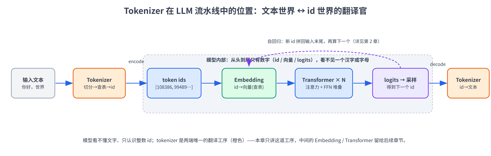
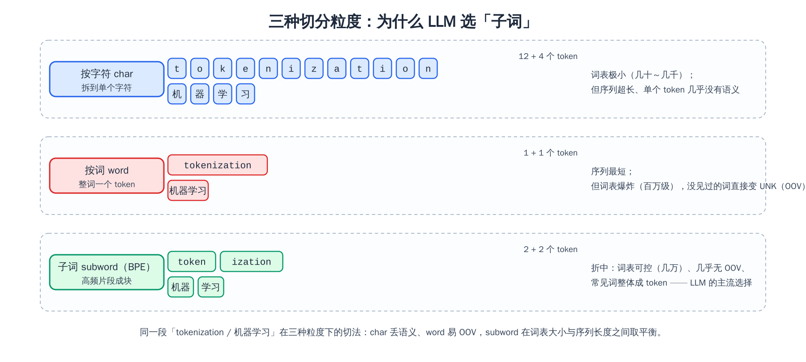
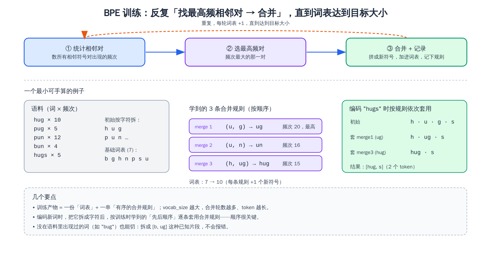
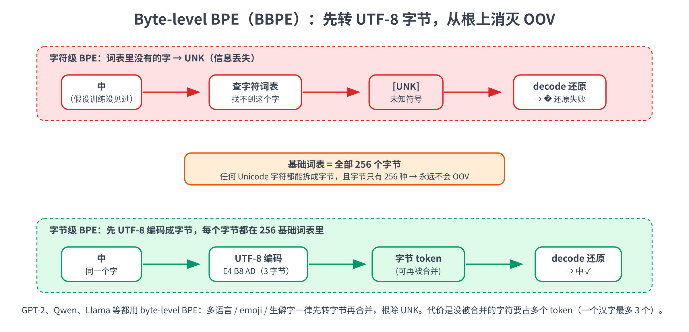

# 第三章：Tokenizer

第二章我们把 `generate()` 拆开看了个透：logits → temperature → top-k / top-p → softmax → 采样，一个 token 一个 token 地往外蹦。但有个问题一直被我们跳过了——模型吐出来的是 token **id**（一串整数），喂进去的也是 id，可人类读写的是**文字**。这中间「文字 ↔ id」的翻译活儿，就是 **tokenizer（分词器）** 干的。

这一章我们把镜头对准这道翻译工序：**一段文本到底怎么被切成一个个 token、为什么主流 LLM 几乎都用 BPE 这套切法、词表和那些 `<|im_start|>` 之类的特殊 token 是怎么回事**。读完本章你应当能：

- 说清 tokenizer 在整条流水线里的位置，以及「模型从头到尾只认识整数 id」是什么意思
- 解释为什么不按字符切、也不按词切，而是用**子词（subword）**
- 手推 **BPE（Byte Pair Encoding，字节对编码）** 的训练与编码过程（能在草稿纸上跟着算）
- 理解 **BBPE（byte-level BPE）** 怎么用「先转 UTF-8 字节」根除 OOV（未登录词）
- 知道词表大小怎么权衡、特殊 token 为什么不能被 BPE 拆开
- 亲手用 `tokenizers` 库训一个小 tokenizer，并对比中英文的 token 效率

> 想直接跑示例？点这里 [](https://colab.research.google.com/github/weiqiangnd/LearningLLM/blob/main/src/03.ipynb)。
>
> **硬件门槛**：概念章，CPU 即可 ✅。本章实战只加载 tokenizer（几 MB，不下整模型）、训练一个小 tokenizer，纯 CPU 几秒到几十秒跑完，**不需要 GPU**。打开 ipynb 后直接 Run All，不用切运行时。

## 目录

- [一、为什么需要 tokenizer](#一为什么需要-tokenizer)
  - [1.1 tokenizer 在流水线里的位置](#11-tokenizer-在流水线里的位置)
  - [1.2 三种切分粒度：char、word、subword](#12-三种切分粒度charwordsubword)
- [二、BPE：从字符到子词](#二bpe从字符到子词)
  - [2.1 训练：统计高频对、迭代合并](#21-训练统计高频对迭代合并)
  - [2.2 编码：把新文本切成 token](#22-编码把新文本切成-token)
  - [2.3 解码：从 token id 回到文本](#23-解码从-token-id-回到文本)
- [三、BBPE：在字节上做 BPE](#三bbpe在字节上做-bpe)
  - [3.1 字符级 BPE 的 OOV 难题](#31-字符级-bpe-的-oov-难题)
  - [3.2 UTF-8 字节与 256 个基础符号](#32-utf-8-字节与-256-个基础符号)
  - [3.3 GPT-2、Qwen 用的就是 BBPE](#33-gpt-2qwen-用的就是-bbpe)
- [四、词表与特殊 token](#四词表与特殊-token)
  - [4.1 词表大小：在压缩率与参数量之间权衡](#41-词表大小在压缩率与参数量之间权衡)
  - [4.2 特殊 token：把控制信号塞进词表](#42-特殊-token把控制信号塞进词表)
- [五、常见模型的 tokenizer 对比](#五常见模型的-tokenizer-对比)
- [六、实战：用 tokenizers 库训一个小 tokenizer](#六实战用-tokenizers-库训一个小-tokenizer)
  - [6.1 准备：装依赖](#61-准备装依赖)
  - [6.2 看 Qwen3 的 tokenizer 怎么切](#62-看-qwen3-的-tokenizer-怎么切)
  - [6.3 纯 Python 手写 BPE 训练](#63-纯-python-手写-bpe-训练)
  - [6.4 用 tokenizers 库训一个 byte-level BPE](#64-用-tokenizers-库训一个-byte-level-bpe)
  - [6.5 中英文 token 效率对比](#65-中英文-token-效率对比)
- [七、关键概念回顾](#七关键概念回顾)
- [八、本章小结](#八本章小结)

---

## 一、为什么需要 tokenizer

### 1.1 tokenizer 在流水线里的位置

先把第二章那条流水线再往前接一截。神经网络只会做数值运算——矩阵乘法、加法、激活函数，它没法直接「读」一个汉字或字母。所以任何文本进模型之前，**必须先变成数字**；模型算完吐出来的也是数字，要给人看还得**变回文本**。tokenizer 就站在这两端：



整条链路拆开是这样：

1. **encode（编码）**：tokenizer 把输入字符串切成一串 **token**，再查词表把每个 token 换成一个整数 **id**，得到 `input_ids`。
2. **模型内部**：id 先经过 **embedding**（查一张大表，把每个 id 换成一个向量），再过 N 层 Transformer，最后输出 logits、采样出下一个 token 的 id。**这一路全是数字**，模型从头到尾看不见一个文字。
3. **decode（解码）**：tokenizer 把生成出来的 id 序列查词表换回 token 字符串，拼成人类能读的文本。

一句话总结：**模型只认识整数 id，tokenizer 是文本世界与 id 世界之间唯一的翻译官**。本章只讲两端这道翻译工序（图里橙色的部分），中间的 embedding 和 Transformer 留给后面的章节。

> 这里有个容易忽略的点：tokenizer 是**独立于模型单独训练**的，而且训练数据、训练时机都和模型本体分开。一旦定下来，词表和切分规则就**冻结**了——模型预训练、微调全程都用同一个 tokenizer。换 tokenizer 等于换了模型的「输入字母表」，必须重新训练。

### 1.2 三种切分粒度：char、word、subword

「把文本切成 token」听起来简单，但**切多细**是个有讲究的设计选择。三种最直观的粒度：



- **按字符（char-level）**：每个字符就是一个 token。`tokenization` 切成 `t o k e n i z a t i o n`（12 个），`机器学习` 切成 `机 器 学 习`（4 个）。
  - 优点：词表极小——英文几十个字母 + 标点，中文常用字也就几千个。任何词都拆得成字符，几乎不会 OOV（只要字符在词表里；真正生僻的字符仍可能漏，见第 3 节）。
  - 缺点：**序列被拉得很长**（一句话几十上百个 token），而 Transformer 的计算量随序列长度增长得很快；更关键的是，**单个字符几乎不携带语义**——`t` 这个 token 本身没什么意义，模型得花很多层才能从一堆字符里拼出「词」的概念。

- **按词（word-level）**：每个词一个 token。`tokenization` 就是 1 个 token，`机器学习` 1 个（假设它在词表里）。
  - 优点：序列最短，每个 token 语义也最完整。
  - 缺点：**词表会爆炸**。英语词形变化（run / runs / running / ran）、复合词、人名地名、拼写错误……要全收进词表，动辄上百万。而且总会有**没见过的词（OOV，Out-Of-Vocabulary）**——训练时词表里没有 `tokenization` 这个词，推理时遇到它就只能映射成一个 `<UNK>`（unknown）占位符，**信息直接丢了**。中文更尴尬：词与词之间没有空格，「按词切」本身就需要一个分词器，且永远切不全。

- **子词（subword）**：介于两者之间——把**高频的片段**当成一个 token。`tokenization` 切成 `token` + `ization`，`机器学习` 切成 `机器` + `学习`。
  - 常见词、常见词根词缀整体成一个 token（短、有语义）；生僻词自动退化成几个更小的已知片段拼起来（不会 OOV）。词表大小可控（典型几万到十几万）。
  - 这就是**当今几乎所有 LLM 的选择**。代表算法就是本章主角 **BPE**。

为什么子词是甜点区？因为「词表大小」和「序列长度」本是一对此消彼长的矛盾——char 把词表压到最小，却让序列爆长；word 把序列压到最短，却让词表爆炸、还带来 OOV。子词的妙处在于**把这两头同时摁在可接受的范围内**：

| 维度 | char | word | subword |
|------|------|------|---------|
| 词表大小 | 极小（几十～几千） | 巨大（百万级） | 适中（几万～十几万） |
| 序列长度 | 很长 | 很短 | 适中 |
| OOV（未登录词） | 基本没有（生僻字符例外） | 严重 | 基本没有（生僻词拆成小片段） |
| 单 token 语义 | 几乎没有 | 完整 | 常见词完整、生僻词部分 |

> 顺手提一句：token 数直接关系到**钱和速度**。商用 API 按 token 计费，上下文窗口也按 token 算；同样一段话，切出来的 token 越少越省。所以 tokenizer 的「压缩率」（平均每个 token 顶多少个字符）是个实打实的工程指标——第 6 节我们会亲手量一下中英文的差距。

> 这三档之外其实还有更极端的一档——**纯字节级**：把文本拆成 UTF-8 字节，每个字节就是一个 token、词表恒为 256，比 char 还碎（一个汉字就 3 个 token），序列极长，但零 OOV、连 tokenizer 都不用训。它是「小词表 / 长序列」光谱的最末端，目前多停留在研究阶段（ByT5、Meta 的 BLT 等），主流生产模型不用。

---

## 二、BPE：从字符到子词

BPE 最早是个**数据压缩**算法（1994 年），核心想法朴素得离谱：**反复把出现得最频繁的相邻一对符号，合并成一个新符号**。2016 年 Sennrich 等人把它搬到 NLP 上做子词切分，从此成了 LLM tokenizer 的事实标准。

整个算法分两个阶段：**训练**（在语料上学出一份词表 + 一串合并规则）和**编码**（用学好的规则去切新文本）。先看训练。

### 2.1 训练：统计高频对、迭代合并

训练的循环只有三步，转圈重复：



1. **统计**：把语料里所有**相邻符号对**的出现频次数一遍。
2. **选最高频对**：挑频次最大的那一对。
3. **合并 + 记录**：把这对拼成一个新符号，加进词表，并把「这条合并规则」记下来（按学习顺序）。

回到第 1 步，重复，每轮词表 +1，直到词表大小达到预设的 `vocab_size`。

**用一个最小可手算的例子走一遍**（这也是第 6 节代码里跑的例子）。假设语料里只有这几个词，括号里是它们的出现频次：

```
hug × 10    pug × 5    pun × 12    bun × 4    hugs × 5
```

第一步先把每个词**按字符拆开**，基础词表就是出现过的所有字符 `{b, g, h, n, p, s, u}`（7 个）：

```
h u g       (×10)
p u g       (×5)
p u n       (×12)
b u n       (×4)
h u g s      (×5)
```

现在统计所有相邻字符对的频次（频次要乘上词频）：

| 相邻对 | 出现在哪些词 | 频次 |
|--------|-------------|-----:|
| `(u, g)` | hug(10) + pug(5) + hugs(5) | **20** |
| `(p, u)` | pug(5) + pun(12) | 17 |
| `(u, n)` | pun(12) + bun(4) | 16 |
| `(h, u)` | hug(10) + hugs(5) | 15 |
| `(b, u)` | bun(4) | 4 |
| `(g, s)` | hugs(5) | 5 |

最高频的是 `(u, g)`，20 次。**合并它**，得到新符号 `ug`，记下规则 `merge 1: (u, g) → ug`。语料变成：

```
h ug        (×10)
p ug        (×5)
p u n       (×12)
b u n       (×4)
h ug s       (×5)
```

再数一遍相邻对：现在 `(u, n)` 是 16（pun 12 + bun 4），最高。**合并** `(u, n) → un`（`merge 2`）。再数一遍，`(h, ug)` 是 15（hug 10 + hugs 5），最高，**合并** `(h, ug) → hug`（`merge 3`）。

三轮下来，我们学到的产物是：

- **一份词表**：原来的 7 个字符 + 3 个新符号 `{ug, un, hug}` = 10 个。
- **一串有序的合并规则**：`(u,g)→ug`，`(u,n)→un`，`(h,ug)→hug`。**顺序很关键**，编码时要照这个顺序套。

`vocab_size` 设得越大，合并的轮数越多、学出来的 token 越长越「整词化」；设得越小，token 越碎、越接近字符级。

### 2.2 编码：把新文本切成 token

训练完，规则就冻结了。来一段新文本要切成 token，做法是：**先拆成最小单位（字符 / 字节），再按训练时学到的顺序，一条一条套用合并规则**。

比如要编码 `hugs`：

```
初始：         h · u · g · s
套 merge1 (ug)：h · ug · s        ← 把相邻的 (u,g) 合掉
套 merge2 (un)：h · ug · s        ← 没有 (u,n)，不变
套 merge3 (hug)：hug · s          ← 把相邻的 (h,ug) 合掉
```

结果 `[hug, s]`，2 个 token。

关键在于**生僻词也能切**。比如 `bug` 这个词训练语料里压根没出现过，但照样能编码：

```
初始：         b · u · g
套 merge1 (ug)：b · ug
（其余规则不适用）
```

结果 `[b, ug]`——拆成已知的小片段拼起来，**不会 OOV、不会报错**。这正是子词相对 word-level 的核心优势。

> 为什么必须**按学习顺序**套规则？因为后面的合并往往依赖前面的结果——`(h, ug) → hug` 这条规则里的 `ug` 本身就是 `merge 1` 造出来的。要是先试 `merge 3`，那时还没有 `ug` 这个符号，规则根本匹配不上。顺序错了，切出来的结果就变了。

### 2.3 解码：从 token id 回到文本

解码（decode）方向上简单得多：token id → 查词表换回 token 字符串 → 直接拼接。因为每个 token 本身就是「一段字符」，拼起来就是原文。比如 `[hug, s]` → `"hug" + "s"` → `"hugs"`。

（这里先按字符级 BPE 讲，所以拼接很直白。等第 3 节讲到 byte-level BPE，token 是「字节」而不是「字符」，解码要先把字节拼起来再按 UTF-8 解码，但思路一样。）

---

## 三、BBPE：在字节上做 BPE

上面讲的 BPE 有个隐患：基础单位是「字符」，那词表里没收录的字符怎么办？

### 3.1 字符级 BPE 的 OOV 难题

想象一下：你的训练语料以中英文为主，基础词表收了常见汉字和字母。结果用户输入里冒出一个生僻字「𠮷」、一个 emoji「🤖」、或者一段你没见过的文字（藏文、楔形文字……）。这些字符**不在基础词表里**，BPE 没法把它们拆成更小的已知单位（字符已经是最小单位了），只能映射成 `<UNK>`——**信息当场丢失，decode 也还原不回来**。

字符级 BPE 把 OOV 从「词」推到了「字符」一层，缓解了问题，但没根除：世界上的 Unicode 字符有十几万个，你不可能全收进基础词表。

### 3.2 UTF-8 字节与 256 个基础符号

**BBPE（Byte-level BPE，字节级 BPE）** 的解法很巧：**不在字符上做 BPE，而是先把文本按 UTF-8 编码成字节，在字节上做 BPE**。

关键洞察是：**字节只有 256 种**（一个字节 8 位，取值 0–255）。任何 Unicode 字符——不管多生僻、哪国文字、是不是 emoji——经 UTF-8 编码后都是一串字节，而每个字节的取值必然落在 0–255 之间。所以只要**把这 256 个字节全部放进基础词表**，就**永远不会 OOV**：再没见过的字符，也能拆成几个字节，而字节总在词表里。



举个具体例子。汉字「中」的 UTF-8 编码是 3 个字节：`E4 B8 AD`（十六进制）。

- **字符级 BPE**：如果训练时没见过「中」，它就是 OOV → `<UNK>`，还原失败。
- **字节级 BPE**：「中」→ `E4 B8 AD` 三个字节 → 这三个字节都在 256 基础词表里 → 顺利编码成 token；这三个字节还可能在训练中被进一步合并（比如「中」如果常出现，`E4 B8 AD` 这个组合会被合成一个 token）。decode 时把字节拼回去，按 UTF-8 一解码，「中」完美还原。

代价是：**没被合并起来的非 ASCII 字符要占多个 token**。一个汉字按 UTF-8 是 3 个字节、一个 emoji 通常 4 个字节，这是固定的；真正影响 token 数的是这些字节有没有被合并——如果训练语料里中文不多、相关字节组合没被充分合并，一个汉字就会被切成最多 3 个 token。反过来，中文语料充足时常见字 / 词组的字节会被合并成 1 个 token，开销自然降下来。这也是为什么很多早期英文为主的模型，中文 token 效率特别低（第 6 节会量化对比）。

> 实现上还有个小细节：原始字节里有些是不可打印的控制字符（换行、制表符等），直接当字符串处理会很别扭。GPT-2 提出一个「bytes-to-unicode」的小技巧——把这 256 个字节一一映射到 256 个**可打印**的 Unicode 字符上（比如空格字节映射成 `Ġ`）。所以你在看 BBPE 切出来的 token 时，常会看到 `Ġthe`、`ä¸ŋ` 这种「乱码」——那不是 bug，是字节被映射后的可打印形式。这套 256 个字节符号就是词表的基础字母表（base alphabet）。

### 3.3 GPT-2、Qwen 用的就是 BBPE

byte-level BPE 由 GPT-2 发扬光大，现在是主流：**GPT 系列、Llama、Qwen、Mistral、DeepSeek** 等的 tokenizer 都是 byte-level BPE（细节各有微调，但「先转字节、256 起步、永不 OOV」这套骨架一致）。第 6 节我们加载 Qwen3 的 tokenizer，就能看到它对 emoji、生僻字也能稳稳编码、完美还原。

> 这里再做一个补充：同样叫「字节级」，其实分两种。**BBPE 是带合并的**——base 单位是字节，但照样跑 BPE 把高频字节组合并成更长的子词，所以它**本质仍是子词方法**（本章主角，GPT / Qwen 在用）；而**纯字节级是不合并的**——每个字节直接就是一个 token、词表恒为 256（如 ByT5、Meta 的 BLT，多在研究阶段）。一句话：一个是「在字节上做 BPE」，一个是「干脆每字节一 token」，别弄混。

---

## 四、词表与特殊 token

### 4.1 词表大小：在压缩率与参数量之间权衡

`vocab_size`（词表大小）是 tokenizer 最重要的超参，它牵扯一对矛盾：

- **词表越大** → 每个 token 平均能覆盖更长的文本（压缩率高）→ 同样的文本切出来 token 更少 → 序列更短、推理更快、上下文能装更多内容。
- **但词表越大** → 模型的 **embedding 矩阵**和**输出层**（lm_head）都变大。这两个矩阵的形状都是 `[vocab_size, hidden_size]`，词表翻倍，这部分参数也翻倍——对小模型来说，词表参数能占总参数相当一块。而且词表太大，很多 token 在训练中出现次数太少，**学不充分**。

所以词表大小是个甜点区问题。早期模型（GPT-2）用 50257，近年模型普遍往大了走以更好支持多语言：Llama 3 用约 128k，Qwen3 约 151k（第二章 `model.config` 里那个 `vocab_size=151936` 就是它）。多语言模型词表更大很合理——要同时高效编码中、英、日、韩、阿拉伯语等，自然需要更多 token 名额。

### 4.2 特殊 token：把控制信号塞进词表

除了从语料里学出来的普通 token，词表里还会**手工塞进一批「特殊 token（special tokens）」**。它们不是自然文本的一部分，而是给模型传递**结构 / 控制信号**的：

| 特殊 token | 作用 |
|------------|------|
| `<\|endoftext\|>` | 文档结束符；预训练时用来分隔不同文档 |
| `<\|im_start\|>` / `<\|im_end\|>` | 标记一条对话消息的开始 / 结束（ChatML 风格，第二章见过） |
| `<think>` / `</think>` | Qwen3 思考模式的推理段定界符 |
| `<pad>` | 填充符，batch 推理时把短序列补齐到同样长度用 |
| `<\|tool_call\|>` 等 | 工具调用、function calling 的结构标记（后续章节会用到） |

特殊 token 有两条铁律：

1. **绝不能被 BPE 拆开**。`<|im_start|>` 必须作为**一个完整的 token**对应一个 id，而不能被切成 `<`、`|`、`im`、`_`、`start`…… 一堆碎片。所以 tokenizer 在做 BPE 之前会**先把特殊 token 整个抠出来**单独处理。第 6 节实战的 Cell 6 会验证这一点：我们训练时塞进去的 `<|endoftext|>` / `<|im_start|>` / `<|im_end|>` 各自占一个独立 id，不会被合并规则拆开。
2. **它们是「加塞」进词表的**，不参与从语料学合并规则的过程；至于排在词表开头还是末尾，纯看实现——我们 Cell 6 用的 `tokenizers` 训练器把它们放在最前（id 0/1/2），而 GPT-2（`<|endoftext|>` = 50256）、Qwen 等生产模型则追加到词表末尾。

这也解释了第二章那个细节：为什么对话场景要把 `<|im_end|>` 显式加进 `eos_token_id`——因为它就是个特殊 token，模型学会了「该停的时候吐这个 token」，`generate()` 采到它对应的 id 就停。

> 安全提示先埋个伏笔：既然特殊 token 是「控制信号」，那如果用户输入里**故意混进** `<|im_start|>system` 这样的字符串会怎样？规范的做法是：处理**用户文本**时不把这些字符串当特殊 token 解析（`add_special_tokens` 相关参数控制），否则就可能被「prompt 注入」。这块留到讲安全的章节展开，这里先知道「特殊 token 是带权限的，不能让普通文本随便伪造」。

---

## 五、常见模型的 tokenizer 对比

原理讲透了，这里横向看看主流模型的 tokenizer 各长什么样——用什么算法、词表多大、有什么特点。

| 模型 / tokenizer | 算法（工具） | 词表大小 | 特点 |
|------|------|------:|------|
| BERT | WordPiece | 30,522 | 早期 encoder 模型；是 subword 但**不是 BPE**，词内子词带 `##` 前缀；按字符（非字节），中文按单字拆 |
| LLaMA 2 | BPE（SentencePiece） | 32,000 | 词表小、英文为主；中文多靠字节回退，效率偏低 |
| GPT-2 | byte-level BPE | 50,257 | 把 BBPE 带火的鼻祖；英文为主，中文 / 多语言效率低 |
| Llama 3 | byte-level BPE（tiktoken 风格） | 128,256 | 相比 Llama 2 词表翻了 4 倍，多语言与中文效率明显改善 |
| Qwen3 | byte-level BPE（tiktoken） | ≈ 151,000 | 大词表，中文 / 多语言 / 代码都优化得好，中文效率高 |
| GPT-4o | byte-level BPE（tiktoken o200k） | ≈ 200,000 | OpenAI 自研 tiktoken；词表再翻倍，多语言 / 代码进一步提效 |
| Gemma | SentencePiece（BPE / unigram） | 256,000 | 超大词表、多语言覆盖最广，代价是 embedding 层参数也更大 |

几条值得记的规律：

- **算法就三大家族**：BPE（含 byte-level BPE）、WordPiece、unigram。但近年的新模型几乎清一色 **byte-level BPE**——前面讲的「永不 OOV」是关键卖点。WordPiece（BERT）和 unigram（T5、mT5）现在主要出现在老一代或 encoder 模型里。
- **词表越来越大**：从 GPT-2 的 5 万一路涨到 Gemma 的 25.6 万。动机是更高效地容纳多语言 + 代码，而大模型也摊得起 embedding / 输出层多出来的那点参数（回顾第 4.1 节的权衡）。
- **工具栈分流**：OpenAI 用自研 **tiktoken**，Google 系多用 **SentencePiece**，开源社区自己训多用 Hugging Face 的 **tokenizers** 库（也就是第 6 节实战要用的那个）。

顺带一提：同一段文本喂给不同 tokenizer，切出来的 token 数可能相差很大——英文为主的小词表 tokenizer 处理中文时尤其碎。所以跨模型比较时，「同一段 prompt 占多少 token」得按各自的 tokenizer 重新估，别想当然。

---

## 六、实战：用 tokenizers 库训一个小 tokenizer

下面给出本章全部可运行代码（**Cell 0 ~ Cell 8**）。前半段加载 Qwen3 的真实 tokenizer 观察它怎么切，中段用纯 Python 手写一遍 BPE 把算法跑通，后段用 Hugging Face 的 `tokenizers` 库从零训一个 byte-level BPE。本章顶部的 Open in Colab 直链是这些 cell 的可运行副本。

> 本章**不加载大模型**，只下载 tokenizer 文件（几 MB）+ 训练一个玩具 tokenizer，**纯 CPU 几十秒跑完**，不需要 GPU。

### 6.1 准备：装依赖

**Cell 0** 做环境自检。和前几章不同，本章是概念 / 工具章，**不需要 GPU**，所以这里只确认 Python 环境，不强制 CUDA：

```python
# ============================================================
# Cell 0: 环境自检（本章纯 CPU 即可，无需 GPU）
# ============================================================
# 前几章的 Cell 0 都在检查 GPU，因为要加载大模型做推理。
# 本章只研究 tokenizer——加载 tokenizer 文件、训练小 tokenizer，
# 全程在 CPU 上跑，几十秒完成。所以这里不强制 GPU，只打印环境信息。
import sys
import platform

print("Python:", sys.version.split()[0])
print("平台:", platform.platform())
print("本章无需 GPU，CPU 运行时即可 Run All。")
```

**Cell 1** 装依赖。`transformers` 用来加载 Qwen3 的 tokenizer（锁 `>=4.51` 是因为 Qwen3 系列要求），`tokenizers` 是 Hugging Face 的底层分词库，第 6.4 节用它从零训练：

```python
%%capture
# ============================================================
# Cell 1: 安装依赖
# ============================================================
# %%capture 必须是 cell 第一行，作用是把 pip 的安装日志藏起来
# transformers>=4.51:  加载 Qwen3 tokenizer 需要（Qwen3 系列的版本下界）
# tokenizers:          Hugging Face 的底层分词库，第 6.4 节用它训练 byte-level BPE
#                      （transformers 会把它作为依赖装上，这里显式写出来更清楚）
!pip install -q -U "transformers>=4.51" tokenizers
```

### 6.2 看 Qwen3 的 tokenizer 怎么切

**Cell 2** 加载 Qwen3 的 tokenizer（注意：`AutoTokenizer` 只下载几 MB 的 tokenizer 文件，**不会下载十几 GB 的模型权重**），然后拿英文、中文、代码、emoji 各喂一段，看看切出来什么：

```python
# ============================================================
# Cell 2: 加载 Qwen3 tokenizer，观察它怎么切不同文本
# ============================================================
# AutoTokenizer 只读 tokenizer.json / tokenizer_config.json 等几 MB 的小文件，
# 不碰模型权重，所以 CPU、几秒就好
from transformers import AutoTokenizer

tokenizer = AutoTokenizer.from_pretrained("Qwen/Qwen3-8B")
print("词表大小 vocab_size =", tokenizer.vocab_size)

# 拿四类文本各切一段：英文 / 中文 / 代码 / emoji+生僻
samples = [
    "Tokenization is fun!",
    "机器学习很有趣！",
    "x = [i**2 for i in range(10)]",
    "I love 🤖 and 北京烤鸭!",
]

for text in samples:
    # add_special_tokens=False：只切正文，不在两端加 BOS/EOS 之类，看得更干净
    ids = tokenizer.encode(text, add_special_tokens=False)
    # 把每个 id 单独 decode 回来，看清每个 token 对应的那段文本
    pieces = [tokenizer.decode([i]) for i in ids]
    print(f"\n原文: {text!r}")
    print(f"  token 数: {len(ids)}")
    print(f"  ids:    {ids}")
    print(f"  逐 token: {pieces}")
```

**预期现象**：

- 英文里像 `Tokenization` 这种较长的词通常被切成多个子词（如 `Token` + `ization` 这类）；常见短词（`is`、`fun`）整体一个 token。
- 中文一般 1–2 个字一个 token（Qwen 中文语料充足，常见词组被合并得不错）。
- emoji `🤖` 和「北京烤鸭」也能稳稳切出来、`decode` 完美还原——这就是 byte-level BPE 永不 OOV 的体现。
- 你会注意到英文 vs 中文「每个 token 覆盖几个字符」差别明显：英文一个 token 常顶好几个字符，中文往往 1–2 个字。这点 6.5 节会专门量化。

### 6.3 纯 Python 手写 BPE 训练

光看不练假把式。**Cell 3** 用几十行纯 Python 把 2.1 节那个 `hug / pug` 例子的 BPE 训练**完整跑一遍**，打印出每一轮合并了哪对、语料变成什么样——和文档里手推的结果逐字对上：

```python
# ============================================================
# Cell 3: 纯 Python 手写 BPE 训练（对应 2.1 节的 hug/pug 例子）
# ============================================================
from collections import Counter

# 语料：词 -> 频次（和文档 2.1 节完全一致）
corpus = {"hug": 10, "pug": 5, "pun": 12, "bun": 4, "hugs": 5}

# 初始：每个词按字符拆成符号列表
splits = {word: list(word) for word in corpus}

# 基础词表 = 出现过的所有字符
vocab = sorted({ch for word in corpus for ch in word})
print("基础词表 (%d):" % len(vocab), vocab)


def get_pair_freqs(splits, corpus):
    """统计所有相邻符号对的频次（按词频加权）"""
    pair_freqs = Counter()
    for word, freq in corpus.items():
        symbols = splits[word]
        for i in range(len(symbols) - 1):
            pair_freqs[(symbols[i], symbols[i + 1])] += freq
    return pair_freqs


def merge_pair(a, b, splits):
    """把所有词里相邻的 (a, b) 合并成新符号 a+b"""
    for word, symbols in splits.items():
        new_symbols, i = [], 0
        while i < len(symbols):
            # 命中相邻的 (a, b) 就合并，跳过两个；否则原样保留一个
            if i < len(symbols) - 1 and symbols[i] == a and symbols[i + 1] == b:
                new_symbols.append(a + b)
                i += 2
            else:
                new_symbols.append(symbols[i])
                i += 1
        splits[word] = new_symbols
    return splits


merges = []          # 有序的合并规则
num_merges = 3       # 学 3 轮（演示用；真实 BPE 是几万轮）
for step in range(num_merges):
    pair_freqs = get_pair_freqs(splits, corpus)
    # 选频次最高的相邻对（频次相同则按字典序，保证可复现）
    best_pair = max(pair_freqs, key=lambda p: (pair_freqs[p], p))
    splits = merge_pair(*best_pair, splits)
    merges.append(best_pair)
    vocab.append(best_pair[0] + best_pair[1])
    print(f"\nmerge {step + 1}: {best_pair} 频次={pair_freqs[best_pair]} "
          f"→ 新符号 '{best_pair[0] + best_pair[1]}'")
    print("  当前切分:", dict(splits))

print("\n最终词表 (%d):" % len(vocab), vocab)
print("合并规则（有序）:", merges)
```

**预期现象**：三轮合并依次是 `(u,g)→ug`（频次 20）、`(u,n)→un`（频次 16）、`(h,ug)→hug`（频次 15），词表从 7 个字符长到 10 个——和 2.1 节手推的完全一致。

**Cell 4** 用学到的规则去**编码新词**，验证 2.2 节讲的「按顺序套规则」以及「生僻词也能切」：

```python
# ============================================================
# Cell 4: 用学到的合并规则编码新词（对应 2.2 节）
# ============================================================
def encode_word(word, merges):
    """把一个词拆成字符，再按 merges 的顺序逐条套用合并规则"""
    symbols = list(word)
    for a, b in merges:                     # 关键：按学习顺序，一条一条来
        new_symbols, i = [], 0
        while i < len(symbols):
            if i < len(symbols) - 1 and symbols[i] == a and symbols[i + 1] == b:
                new_symbols.append(a + b)
                i += 2
            else:
                new_symbols.append(symbols[i])
                i += 1
        symbols = new_symbols
    return symbols


for w in ["hug", "hugs", "bug"]:
    print(f"{w!r:8} -> {encode_word(w, merges)}")
```

**预期现象**：

- `hug` → `['hug']`（一个 token，完整合并）
- `hugs` → `['hug', 's']`（2 个 token）
- `bug` → `['b', 'ug']`——**训练语料里没有 `bug` 这个词**，但靠已学的 `ug` 规则照样切出来，不报错、不 OOV。

### 6.4 用 tokenizers 库训一个 byte-level BPE

手写版讲清了原理，但缺了 byte-level、特殊 token、高效实现这些工程件。**Cell 5** 用 Hugging Face 的 `tokenizers` 库——和 GPT-2 / Qwen 同款的工业实现——从零训一个 **byte-level BPE**。先造一小段语料写到文件：

```python
# ============================================================
# Cell 5: 准备一小段训练语料（写到文件）
# ============================================================
# 真实 tokenizer 在几百 GB 语料上训；这里用一小段中英文混合文本做演示，
# 目的是看清「byte-level BPE 训出来长什么样」，而非追求质量。
corpus_text = """
Tokenization is the first step of every language model.
A tokenizer turns text into a sequence of integer ids.
Byte pair encoding merges the most frequent pair of symbols, again and again.
Large language models such as GPT, Llama and Qwen all use byte-level BPE.
The model never sees characters, only token ids.
分词是大模型的第一步，它把文本变成一串整数 id。
字节对编码反复合并出现最频繁的相邻符号对。
GPT、Llama、Qwen 等大模型都用字节级 BPE，从根上消灭未登录词。
机器学习很有趣，自然语言处理更有趣。
""" * 50  # 重复几十遍，让高频片段有足够频次被合并

with open("corpus.txt", "w", encoding="utf-8") as f:
    f.write(corpus_text)

print("语料字符数:", len(corpus_text))
print("前 120 字:", corpus_text.strip()[:120])
```

**Cell 6** 配置并训练。注意三个关键设置：模型选 `BPE`、pre-tokenizer 用 `ByteLevel`（先转字节）、`initial_alphabet` 用全部 256 个字节做基础词表（这就是「永不 OOV」的来源）：

```python
# ============================================================
# Cell 6: 配置并训练一个 byte-level BPE tokenizer
# ============================================================
from tokenizers import Tokenizer, models, trainers, pre_tokenizers, decoders

# 1) 选 BPE 作为分词模型
tok = Tokenizer(models.BPE())

# 2) pre-tokenizer：ByteLevel 会先把文本按 UTF-8 转成字节再处理
#    add_prefix_space=False：不在句首额外加空格（与 Qwen/GPT 习惯一致）
tok.pre_tokenizer = pre_tokenizers.ByteLevel(add_prefix_space=False)

# 3) decoder：解码时把字节正确拼回 UTF-8 文本（和 pre-tokenizer 配套）
tok.decoder = decoders.ByteLevel()

# 4) 训练器：
#    vocab_size=500   学到 500 个 token 就停（演示用，真实是几万～十几万）
#    special_tokens   手工塞进词表的特殊 token，绝不会被 BPE 拆开
#    initial_alphabet 把全部 256 个字节作为基础词表 —— byte-level「永不 OOV」的根
trainer = trainers.BpeTrainer(
    vocab_size=500,
    special_tokens=["<|endoftext|>", "<|im_start|>", "<|im_end|>"],
    initial_alphabet=pre_tokenizers.ByteLevel.alphabet(),
    show_progress=False,
)

tok.train(["corpus.txt"], trainer)

print("训练完成，词表大小:", tok.get_vocab_size())
print("基础字节数（initial_alphabet）:", len(pre_tokenizers.ByteLevel.alphabet()))
print("特殊 token 的 id:")
for s in ["<|endoftext|>", "<|im_start|>", "<|im_end|>"]:
    print(f"  {s} -> {tok.token_to_id(s)}")
```

**预期现象**：词表大小 500；基础字节正好 256 个；三个特殊 token 各占一个独立 id（排在最前面，id 0/1/2）。

**Cell 7** 用训好的 tokenizer 编码中英文 + emoji，验证 **byte-level 永不 OOV + decode 完美还原**：

```python
# ============================================================
# Cell 7: 用自训的 tokenizer 编码 / 解码，验证永不 OOV
# ============================================================
for text in ["language model", "机器学习", "emoji 🤖 test", "𠮷野家"]:
    enc = tok.encode(text)
    decoded = tok.decode(enc.ids)
    print(f"\n原文: {text!r}")
    print(f"  tokens: {enc.tokens}")        # byte-level token 形态，含 Ġ / 乱码字节符号
    print(f"  ids:    {enc.ids}")
    print(f"  decode: {decoded!r}")
    print(f"  完美还原: {decoded == text}")
```

**预期现象**：哪怕是训练语料里没出现过的 emoji `🤖`、生僻字 `𠮷`，也能编码成若干字节 token，并且 `decode` 完美还原（`完美还原: True`）。你会在 `tokens` 里看到 `Ġ`（空格的字节符号）和一些「乱码」字符——那是 3.2 节讲的 bytes-to-unicode 映射后的可打印形态，不是错误。

> 注：`𠮷` 这种字符落到 PNG / 某些终端字体里可能显示成方框（豆腐块），那是**字体没有这个字形**，不影响 tokenizer 的字节处理——`decode` 照样能精确还原。

### 6.5 中英文 token 效率对比

最后量化一下 1.2 节埋的伏笔：**同样信息量的中英文，谁更费 token？** **Cell 8** 用 Qwen3 的 tokenizer 数一段对照文本：

```python
# ============================================================
# Cell 8: 中英文 token 效率对比（用 Qwen3 tokenizer）
# ============================================================
# 一段意思基本对应的中英文，看各自被切成多少 token
pairs = [
    ("Large language models are powerful.", "大语言模型很强大。"),
    ("Machine learning is a subfield of artificial intelligence.",
     "机器学习是人工智能的一个子领域。"),
]

for en, zh in pairs:
    en_ids = tokenizer.encode(en, add_special_tokens=False)
    zh_ids = tokenizer.encode(zh, add_special_tokens=False)
    print(f"\nEN: {en!r}")
    print(f"   {len(en)} 字符 -> {len(en_ids)} token  "
          f"(每 token 约 {len(en) / len(en_ids):.2f} 字符)")
    print(f"ZH: {zh!r}")
    print(f"   {len(zh)} 字符 -> {len(zh_ids)} token  "
          f"(每 token 约 {len(zh) / len(zh_ids):.2f} 字符)")
```

**预期现象**：**英文每个 token 平均覆盖好几个字符**（常在 4 个字符以上——一个英文词往往就 1–2 个 token），**中文每个 token 平均只覆盖 1–2 个字符**。这个「每 token 多少字符」的比值，英文显著高于中文，是很稳定的规律。

> 注意别把它误读成「中文总是更费 / 更省 token」——「同样一句话谁的 token 总数更少」要看具体内容（技术英文里 `intelligence` 这种长词反而被压得很狠），不是绝对的。稳定成立的是上面那个**每 token 字符数**的差异。这个比值就是 tokenizer 的**压缩率**，是评价 tokenizer 好坏的核心指标之一，直接关系到序列长度、推理速度和 API 计费。同一段文本，不同模型的 tokenizer 切出来的 token 数能差不少——这也是为什么换模型时「我的 prompt 会占多少 token」要重新估。

---

## 七、关键概念回顾

| 概念 | 一句话定义 |
|------|-----------|
| **token** | 文本被切分后的最小单位；模型实际处理的是它对应的整数 id |
| **tokenizer** | 文本 ↔ token id 的双向翻译器，独立于模型单独训练、一旦定下就冻结 |
| **词表（vocab）** | token ↔ id 的静态映射表，大小为 `vocab_size` |
| **subword（子词）** | 介于字符与词之间的粒度，兼顾词表大小与序列长度，是 LLM 主流选择 |
| **BPE** | 反复合并最高频相邻符号对的子词算法；产物 = 词表 + 有序合并规则 |
| **BBPE（byte-level BPE）** | 先把文本转 UTF-8 字节再做 BPE，256 个字节打底，永不 OOV |
| **OOV / UNK** | 词表里没有的输入只能映射成 `<UNK>`，信息丢失；BBPE 从根上避免 |
| **特殊 token** | 手工塞进词表的控制信号（如 `<\|im_end\|>`），绝不被 BPE 拆开 |
| **压缩率** | 平均每个 token 顶多少字符；直接影响序列长度、推理速度、API 费用 |

---

## 八、本章小结

- 模型只认识**整数 id**，tokenizer 是文本与 id 之间唯一的翻译官——encode 在最前、decode 在最后，中间全是数字。
- 切分粒度上，**char 丢语义、word 易 OOV**，**subword**（子词）在词表大小与序列长度之间取平衡，是 LLM 的主流选择。
- **BPE** 训练 = 反复「统计相邻对频次 → 合并最高频对 → 记下规则」；产物是**一份词表 + 一串有序的合并规则**。编码新文本时按学习顺序逐条套规则，生僻词也能拆成已知片段、不会 OOV。
- **BBPE** 先把文本转 UTF-8 字节再做 BPE，**256 个字节**作基础词表 → 任何字符都拆得开 → **永不 OOV**；代价是没被合并的字符要占多个 token（一个汉字最多 3 个、emoji 最多 4 个）。GPT、Llama、Qwen 都用它。
- **词表大小**是压缩率与参数量的权衡；**特殊 token** 是加塞进词表的控制信号，绝不能被 BPE 拆开。
- 实战中我们看了 Qwen3 tokenizer 怎么切中英文、手写 BPE 跑通了算法、用 `tokenizers` 库训了个 byte-level BPE，并量化了中英文的 token 效率差异。

到这里，第二章里那个一直没解释的「文本怎么变成 `input_ids`」终于补齐了。

---

下一章我们进入模型内部的第一站：**Embedding 与位置编码**——token id 是怎么变成向量的（embedding 查表）、为什么光有 embedding 还不够、得额外告诉模型每个 token 的「位置」，以及 sinusoidal / learned / RoPE / ALiBi 几种位置编码各自怎么做。
