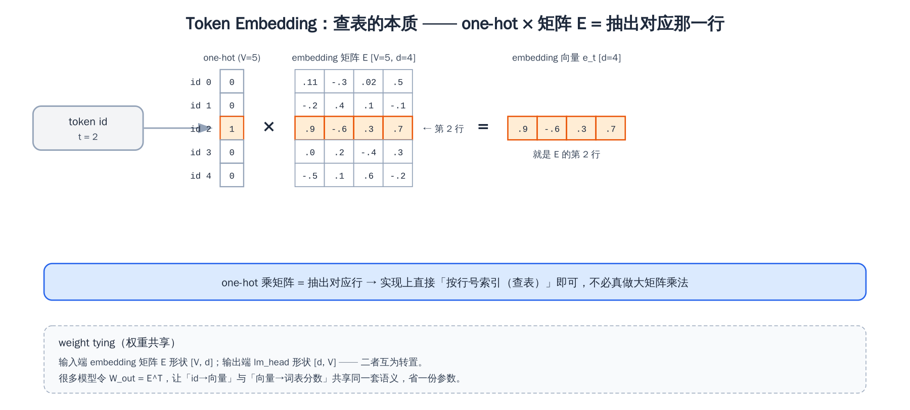
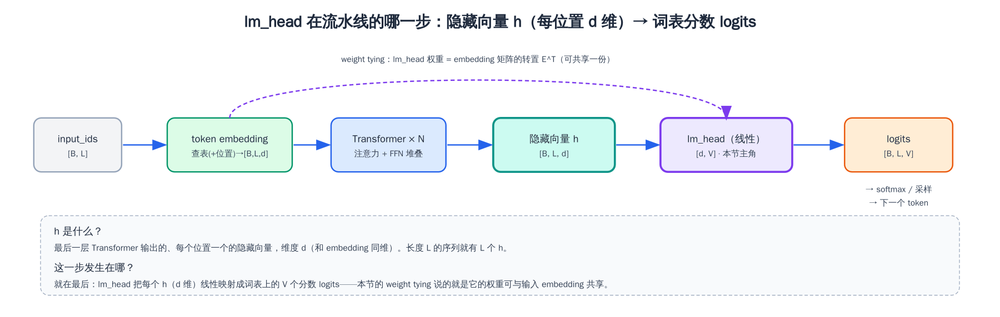
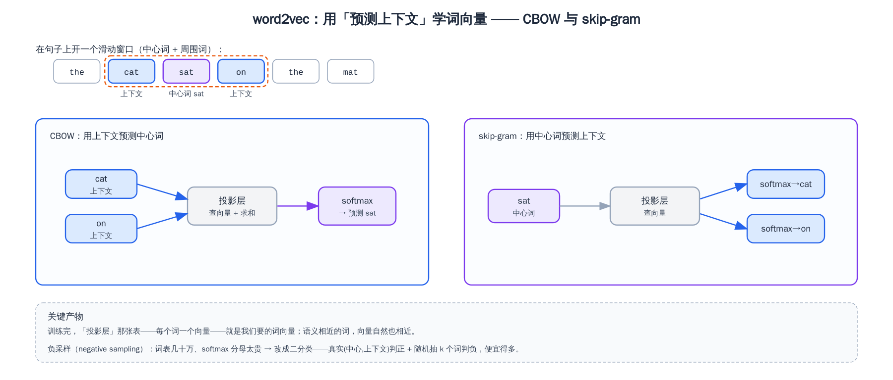
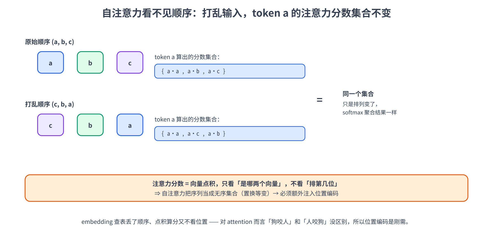
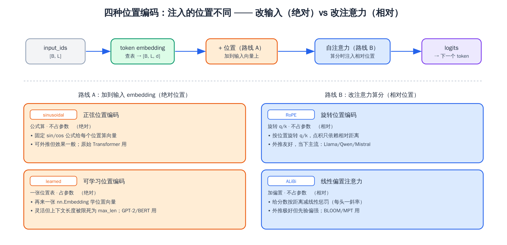
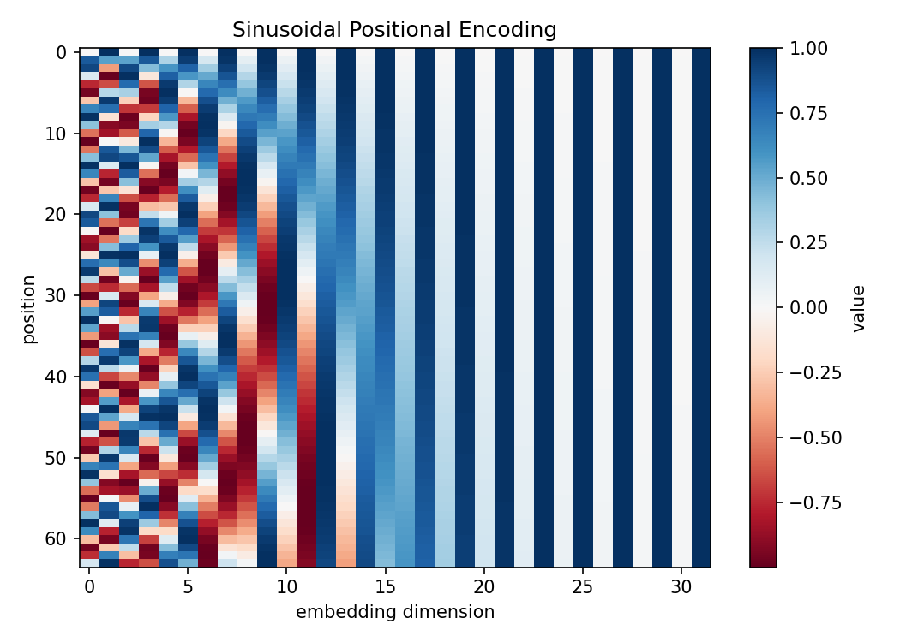
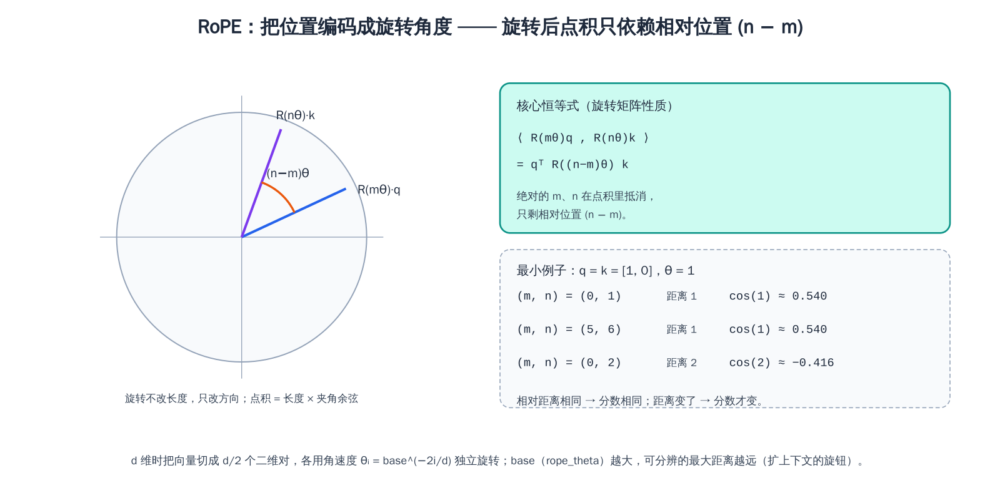
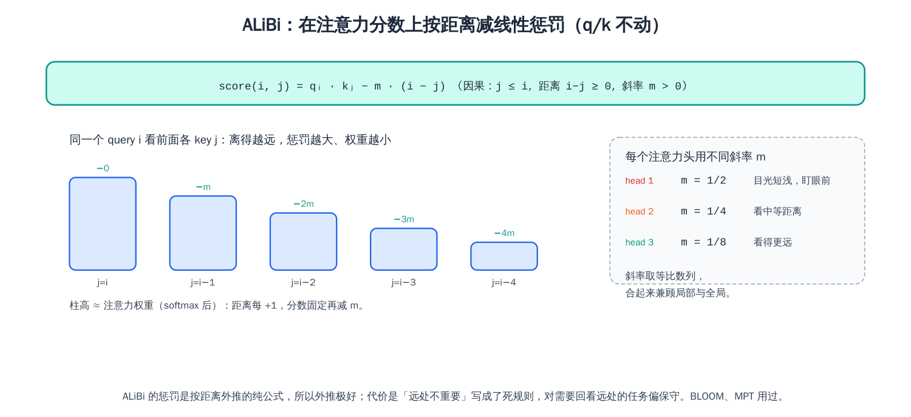

# 第四章：Embedding 与位置编码

第三章我们把文本切成了 `input_ids`——一串整数。可整数本身没法做矩阵乘法（id 是 `108386` 还是 `99489` 之间没有「大小」「远近」的语义关系），所以进 Transformer 之前还得再翻译一道：**把每个 id 换成一个稠密向量**。这一步就是 **embedding（嵌入）**，它是模型内部的第一层。

但光有 embedding 还不够。Transformer 的核心——自注意力（self-attention）——有个反直觉的特性：**它天生看不见 token 的先后顺序**。「狗咬人」和「人咬狗」在它眼里可能是同一回事。所以我们必须**额外**想办法把「每个 token 在第几个位置」这条信息也喂给模型，这就是**位置编码（positional encoding）**。

这一章我们就盯着「token 进模型后的头两件事」：

- 说清 **token embedding** 在做什么——为什么是「查表」、那张表（embedding 矩阵）长什么样、它怎么和输出层共享权重（weight tying）
- 借 **word2vec** 把「embedding 为什么带语义结构」讲透——分布假说、CBOW / skip-gram + 负采样，以及 `king - man + woman ≈ queen` 这个著名类比为什么成立，再厘清它和 LLM embedding 的关键异同
- 论证**自注意力为什么对顺序「视而不见」**，从而理解位置编码不是可有可无的装饰，而是必需品
- 推导四种主流位置编码：**sinusoidal（正弦）**、**learned（可学习）**、**RoPE（旋转）**、**ALiBi（线性偏置）**，讲清各自怎么做、好在哪、坑在哪
- 亲手用 PyTorch 实现这四种位置编码（**实证 RoPE 的核心性质**：注意力分数只依赖两个 token 的**相对**距离），并训一个 word2vec 验证经典类比

> 想直接跑示例？点这里 [](https://colab.research.google.com/github/weiqiangnd/LearningLLM/blob/main/src/04.ipynb)。
>
> **硬件门槛**：概念章，CPU 即可 ✅。位置编码部分全是小张量运算（`nn.Embedding` 查表、手写 toy 注意力、几种位置编码可视化）+ 读 Qwen3 的**配置文件**（几 KB，不下权重），秒级跑完；唯一耗时的是 word2vec 那一步——会在 text8 语料（gensim 自动下载约 30 MB 压缩包、解压后约 100 MB）上训几分钟（CPU 多核）。全程**不需要 GPU**，打开 ipynb 直接 Run All 即可。

> 〔预备知识〕本章首次**密集**用到张量的 shape / broadcasting / autograd（embedding 查表、位置编码相加、RoPE 的成对旋转都在反复 reshape 和广播）——若对这些不熟悉，建议先读 P01。

## 目录

- [一、Token Embedding：从 id 到向量](#一token-embedding从-id-到向量)
  - [1.1 从 one-hot 到查表：embedding 在做什么](#11-从-one-hot-到查表embedding-在做什么)
  - [1.2 nn.Embedding：一张可学习的查找表](#12-nnembedding一张可学习的查找表)
  - [1.3 与输出层共享权重：weight tying](#13-与输出层共享权重weight-tying)
- [二、静态词向量与 word2vec](#二静态词向量与-word2vec)
  - [2.1 分布假说：词义藏在上下文里](#21-分布假说词义藏在上下文里)
  - [2.2 word2vec：用「预测上下文」学词向量](#22-word2vec用预测上下文学词向量)
  - [2.3 词向量的语义结构与那个著名类比](#23-词向量的语义结构与那个著名类比)
  - [2.4 和 LLM embedding 的关键异同](#24-和-llm-embedding-的关键异同)
- [三、为什么需要位置编码](#三为什么需要位置编码)
  - [3.1 自注意力对顺序「视而不见」](#31-自注意力对顺序视而不见)
  - [3.2 两条注入路线：改输入还是改注意力](#32-两条注入路线改输入还是改注意力)
- [四、Sinusoidal：绝对位置编码的开山之作](#四sinusoidal绝对位置编码的开山之作)
  - [4.1 公式与直觉](#41-公式与直觉)
  - [4.2 为什么用正余弦：相对位置的线性表达](#42-为什么用正余弦相对位置的线性表达)
- [五、Learned：让模型自己学位置](#五learned让模型自己学位置)
- [六、RoPE：旋转位置编码（当下主流）](#六rope旋转位置编码当下主流)
  - [6.1 核心思想：把位置编码成旋转角度](#61-核心思想把位置编码成旋转角度)
  - [6.2 二维旋转与相对位置性质](#62-二维旋转与相对位置性质)
  - [6.3 推广到 d 维与 base θ](#63-推广到-d-维与-base-θ)
- [七、ALiBi：给注意力分数加线性惩罚](#七alibi给注意力分数加线性惩罚)
- [八、四种位置编码横向对比](#八四种位置编码横向对比)
- [九、实战：亲手实现 word2vec 与四种位置编码](#九实战亲手实现-word2vec-与四种位置编码)
  - [9.1 准备：环境与依赖](#91-准备环境与依赖)
  - [9.2 Token embedding 查表与 weight tying](#92-token-embedding-查表与-weight-tying)
  - [9.3 训练 word2vec 验证 king − man + woman ≈ queen](#93-训练-word2vec-验证-king--man--woman--queen)
  - [9.4 自注意力的置换等变性](#94-自注意力的置换等变性)
  - [9.5 Sinusoidal 位置编码与热力图](#95-sinusoidal-位置编码与热力图)
  - [9.6 Learned 位置编码](#96-learned-位置编码)
  - [9.7 RoPE 实现与相对位置验证](#97-rope-实现与相对位置验证)
  - [9.8 ALiBi 偏置矩阵](#98-alibi-偏置矩阵)
  - [9.9 看 Qwen3 的位置编码配置](#99-看-qwen3-的位置编码配置)
- [十、关键概念回顾](#十关键概念回顾)
- [十一、本章小结](#十一本章小结)

---

## 一、Token Embedding：从 id 到向量

### 1.1 从 one-hot 到查表：embedding 在做什么

第三章中，tokenizer 把「你好」切成两个 id，比如 `[108386, 99489]`。但这两个整数喂不进神经网络——不是说它接收不了数字，而是**整数的「数值大小」在这里毫无意义**：id `108386` 不比 `99489`「大」、也不和它「相近」，它俩只是词表里两个位置的编号。要是直接把 id 当成实数喂进线性层，模型会被这套虚假的大小关系带偏。

那怎么办？最朴素的想法是 **one-hot 编码**：词表有 $V$ 个 token，就用一个长度为 $V$ 的向量表示一个 token——这个 token 对应的位置是 1，其余全 0。比如词表大小 $V = 5$ ，id 为 2 的 token 就是 $[\thinspace 0, 0, 1, 0, 0\thinspace ]$ 。这样每个 token 都是一个**互相正交**的向量，彻底摆脱了「id 数值大小」的误导。

但 one-hot 有两个致命问题：

1. **太稀疏、太长**。 $V$ 动辄十几万（Qwen3 是 151936），每个 token 就是一个十几万维、只有一个 1 的向量，绝大部分是 0，又占内存又浪费算力。
2. **任意两个 token 都「等距」**。one-hot 下「猫」和「狗」的距离，跟「猫」和「微积分」的距离一模一样（都是 $\sqrt 2$ ）。可我们明明希望语义相近的词，向量也相近——one-hot 把这种关系全抹平了。

**embedding 的解法**：不再用 $V$ 维稀疏向量，而是给每个 token 配一个 $d$ 维的**稠密**向量（ $d$ 远小于 $V$ ，比如 Qwen3-8B 是 $d = 4096$ ），向量里每一维都是可以训练的实数。这些向量整体堆成一张大表——**embedding 矩阵** $E \in \mathbb{R}^{V \times d}$ ，第 $t$ 行就是 id 为 $t$ 的 token 的向量。



「查 id 为 $t$ 的 embedding」在数学上其实等价于「one-hot 向量乘 embedding 矩阵」：

$$
\mathbf{e}_t = \mathbf{x}_t^\top E
$$

其中 $\mathbf{x}\_t$ 是 id 为 $t$ 的 one-hot 列向量（长度 $V$ ）， $E$ 是 $V \times d$ 的 embedding 矩阵，结果 $\mathbf{e}\_t$ 是长度为 $d$ 的行向量。one-hot 乘矩阵，效果就是**把矩阵的第 $t$ 行抽出来**——所以实现上根本不用真的做这个大矩阵乘法，**直接按行号索引**（查表）就行，又快又省。这就是为什么我们说 embedding「本质是查表」。

关键在于： $E$ 里的每个数都是**模型参数，随训练一起更新**。训练初期这些向量是随机的、毫无规律；训练充分后，语义 / 句法相近的 token，其 embedding 向量在空间里也会聚到一起（这就是著名的 `king - man + woman ≈ queen` 那类现象的根基）。embedding 不是人为设计的编码，而是**模型自己学出来的、带语义结构的向量表示**——这种「语义结构」到底怎么来的、那个类比为什么成立，下一节用 word2vec 专门讲。

> 顺手厘清一个容易混的点：embedding 矩阵 $E$ 的形状是 `[V, d]`——**行数是词表大小、列数是隐藏维度**。一段长度为 $L$ 的输入 `input_ids`（形状 `[L]`，batch 后是 `[B, L]`）经过 embedding 查表，得到的是 `[B, L, d]`——每个 token 各取一行 $d$ 维向量。这个 `[B, L, d]` 就是后面所有 Transformer 层反复加工的对象，记住它。

### 1.2 nn.Embedding：一张可学习的查找表

在 PyTorch 里，这张表就是 `nn.Embedding(num_embeddings, embedding_dim)`：

- `num_embeddings` = 词表大小 $V$
- `embedding_dim` = 每个向量的维度 $d$

它内部就持有一个 `[V, d]` 的可学习权重矩阵。前向时传入一批 id（`LongTensor`），它返回对应行：

```python
import torch
import torch.nn as nn

V, d = 10, 4                       # 玩具尺寸：词表 10 个 token，每个 embedding 4 维
emb = nn.Embedding(V, d)          # 内部就是一个 [10, 4] 的可学习矩阵
print(emb.weight.shape)           # torch.Size([10, 4]) —— 这就是 embedding 矩阵 E

ids = torch.tensor([[2, 5, 5, 1]])  # 一个 batch、一条长度 4 的序列，shape [1, 4]
out = emb(ids)                      # 查表：每个 id 取 E 的对应行
print(out.shape)                    # torch.Size([1, 4, 4]) = [B, L, d]
# 注意 ids 里两个 5 取到的是同一行，所以 out[0,1] 和 out[0,2] 完全相同
print(torch.equal(out[0, 1], out[0, 2]))   # True
```

两个细节值得记住：

- **输入是整数索引，不是 one-hot**。`nn.Embedding` 帮你把「one-hot 乘矩阵」优化成了直接索引，所以你喂 id 就行，省掉了构造大稀疏向量的开销。
- **相同 id 一定查到相同向量**。上面 `ids` 里有两个 `5`，取出来的两行完全相等——embedding 只看 id，不看位置。**这正是位置编码（第三节）要解决的问题的根源**：第 1 个位置的「5」和第 3 个位置的「5」拿到一样的向量，模型怎么区分它俩的先后？答案就是位置编码。

### 1.3 与输出层共享权重：weight tying



回忆第二章 / 第三章：模型最后要把每个位置的隐藏向量 $\mathbf{h} \in \mathbb{R}^{d}$ 映射回**整个词表上的分数（logits）**，也就是过一个 `[d, V]` 的线性层——通常叫 **lm_head（language model head，语言建模头）**：

$$
\text{logits} = \mathbf{h}\thinspace W_{\text{out}}, \qquad W_{\text{out}} \in \mathbb{R}^{d \times V}
$$

> 顺便澄清一个常见困惑：序列里 L 个位置**各自**都会算出一条 V 维 logits，而**位置 $i$ 的 logits 是对「第 $i+1$ 个 token」的预测**；又因为因果注意力下每个位置看到的前缀不同，这 L 条 logits 一般**互不相同**。**生成时只用最后一个位置**的 logits 采样出新 token（前面那些预测的都是已经存在的 token）；**训练时则 L 个位置全用**——位置 $i$ 的预测对照真实的第 $i+1$ 个 token，一次并行算完（这就是 teacher forcing）。这套自回归目标第 10 章细讲，这里只需记住「lm_head 在每个位置输出的 logits，预测的都是它的下一个」。

你注意到没有：**输入端的 embedding 矩阵 $E$ 是 `[V, d]`，输出端的 $W_{\text{out}}$ 是 `[d, V]`——形状正好互为转置**。一个把「id → 向量」，一个把「向量 → 词表分数」，干的是方向相反但高度对称的事。

很多模型（GPT-2、不少 Qwen / Llama 配置）干脆让这两者**共享同一份权重**：令 $W_{\text{out}} = E^\top$ 。这招叫 **weight tying（权重绑定 / 权重共享）**，好处有二：

1. **省参数**。这块参数本来要存两份（`V × d` 各一份），绑定后只存一份。 $V$ 大、模型小的时候，省下的相当可观——第三章第 4.1 节就提过，词表越大，embedding / 输出层这块参数占比越高。
2. **有道理**。「表示一个 token 的向量」和「判断一个向量像不像某个 token」本就该用同一套语义坐标，共享权重等于强制两端说同一种「向量语言」，实践中往往还能略微提点效果。

> 不是所有模型都绑定——大词表大模型有时故意解绑（untied），让输入、输出各自学得更自由。但「embedding 和 lm_head 形状互为转置、可以共享」这个对称关系，是理解模型两端结构的一把钥匙，务必记住。实战 9.2 节会把 weight tying 显式连一遍给你看。

---

## 二、静态词向量与 word2vec

1.1 节我们说，embedding 是「模型自己学出来的、带语义结构的向量」，还顺嘴提了 `king - man + woman ≈ queen`。这两句听着有点玄——向量怎么就「带语义」了？那个减法又凭什么成立？这一节就把它讲清楚。要讲清楚，得回到「词→向量」这件事的源头：2013 年 Mikolov 等人提出的 **word2vec**。它是第一个把词向量学得又好又便宜的算法，今天 LLM 的 token embedding，正是这套思想的延续。

> 这一节是为了帮你**真正理解 embedding 的语义含义**和前面那个类比，不是为了引入新的模型组件。word2vec 属于「静态词向量」，和 LLM 里的 embedding **同源但有关键区别**（2.4 节专门对比）。读完你对「向量空间里藏着语义」会有扎实的直觉。

### 2.1 分布假说：词义藏在上下文里

语言学里有句名言：「**你要认识一个词，看它跟谁在一起就行**」（"You shall know a word by the company it keeps"，Firth, 1957）。这就是**分布假说（distributional hypothesis）**：**意思相近的词，出现的上下文也相近**。

举个例子：「猫」和「狗」周围常出现「养、喂、宠物、可爱、叫」这些词；而「微积分」周围是「求导、积分、极限、公式」。正因为「猫」和「狗」的上下文高度重合，我们说它俩语义相近。反过来，只要能让一个词的向量去**预测它的上下文**，那上下文相似的词，学出来的向量自然就接近了。

word2vec 的聪明之处，就是把这条假说变成一个**可优化的目标**：拿一个词去预测它周围的词（或反过来），用海量文本训练。训练一结束，词向量里就自动浮现出语义结构——不需要任何人工标注。

### 2.2 word2vec：用「预测上下文」学词向量

word2vec 有两种对偶的结构，区别只在「拿谁预测谁」：

- **CBOW（Continuous Bag-of-Words）**：用**上下文**预测**中心词**（看见周围几个词，猜中间缺的那个）。
- **skip-gram**：用**中心词**预测**上下文**（给一个词，猜它周围会出现哪些词）。



两者都在文本上开一个**滑动窗口**：取一个中心词，加上它前后各 $w$ 个词（ $w$ 是窗口半径）当上下文，构成训练样本，然后窗口一格一格往后滑。以 skip-gram 为例，训练目标是**让中心词的向量能预测窗口内的每个上下文词**，写成最大化整段语料的对数概率：

$$
\frac{1}{T} \sum_{t=1}^{T} \sum_{-w \le j \le w,\ j \ne 0} \log P(w_{t+j} \mid w_t)
$$

其中 $w_t$ 是位置 $t$ 的中心词， $w_{t+j}$ 是它窗口内的上下文词， $T$ 是语料总词数。那 $P(o \mid c)$ （给定中心词 $c$ 、上下文是 $o$ 的概率）怎么算？word2vec 给每个词配**两套**向量——当中心词时用 $\mathbf{v}\_c$ 、当上下文词时用 $\mathbf{u}\_o$ ——再走一个 softmax：

$$
P(o \mid c) = \frac{\exp(\mathbf{u}_o^\top \mathbf{v}_c)}{\sum_{w \in V} \exp(\mathbf{u}_w^\top \mathbf{v}_c)}
$$

这里 $\mathbf{v}\_c$ 和 $\mathbf{u}\_o$ 都是 $d$ 维向量（ $d$ 是词向量维度，比如 100、300），所以才能做点积 $\mathbf{u}\_o^\top \mathbf{v}\_c$ 。把全词表的向量摞起来，就是**两张** $(V, d)$ 的矩阵（ $V$ 是词表大小）：一张「中心词矩阵」由所有词的 $\mathbf{v}\_c$ 堆成，一张「上下文矩阵」由所有词的 $\mathbf{u}\_o$ 堆成。注意同一个词在两张表里各占一行、是**两个不同的向量**，训练中各自更新——比如 `dog` 当中心词时查到 $\mathbf{v}\_{\text{dog}}$ 、当上下文词时查到的是另一行 $\mathbf{u}\_{\text{dog}}$ 。

两个向量点积越大，概率越高——这又回到了「点积衡量相似度」。问题在分母：它要对**整个词表** $V$ （几十万词）求和，每算一个样本都得遍历全词表，太贵了。

word2vec 的关键工程技巧叫**负采样（negative sampling）**：把「在全词表上做多分类 softmax」换成「一堆二分类」。对每个真实的（中心词，上下文词）对，**判它为正**；再随机抽 $k$ 个词当**负样本**（大概率不是真上下文），**判它们为负**。单个样本要**最大化**的目标变成（注意这是目标函数、要往大了优化；真正的 loss 是它取个负号）：

$$
\log \sigma(\mathbf{u}_o^\top \mathbf{v}_c) + \sum_{i=1}^{k} \mathbb{E}_{w_i \sim P_n}\bigl[\thinspace \log \sigma(-\mathbf{u}_{w_i}^\top \mathbf{v}_c) \thinspace\bigr]
$$

其中 $\sigma$ 是 sigmoid， $P_n$ 是负样本的抽样分布。这个 $P_n$ 怎么定？word2vec 用的是「按词频的 3/4 次方抽」：负样本不是均匀乱抽、也不是严格照词频抽，而是取 $P_n(w) \propto \text{count}(w)^{3/4}$ ——把每个词的出现次数先开 3/4 次方再归一化当抽样概率。为什么要这道开方？纯按词频抽（指数 1）的话，`the`、`is` 这种高频虚词会霸占绝大多数负样本名额，模型整天在跟它们做无聊的二分类；纯均匀抽（指数 0）又让一堆生僻词当负样本、信号太弱。3/4 介于两者之间，**把高频词的抽样概率压一压、把低频词的抬一抬**——这是 word2vec 原论文里试出来的经验值。直觉很朴素：**把真上下文的点积推高、把随机词的点积压低**。分母不用再遍历全词表，只算 $k+1$ 个点积（ $k$ 一般取 5–20），训练快了好几个数量级。

训练完，两张矩阵里我们一般**只留中心词矩阵**：每个词的 $\mathbf{v}\_c$ 就是要的**词向量**（图里那张「投影层」表），上下文矩阵 $\mathbf{u}\_o$ 通常直接丢掉（也有实现把两张表对应行相加或取平均的）。后面实战中的 Cell 4 会用 `gensim` 在 text8 语料上训一个——`gensim` 实现的正是这套 skip-gram / CBOW + 负采样。

### 2.3 词向量的语义结构与那个著名类比

训练完打开向量空间，会看到两类规律：

1. **语义相近的词，向量也相近**。`cat` 的最近邻是 `dog`、`cats`、`pet` 这类，余弦相似度很高——这正是分布假说的直接结果。
2. **某些方向编码了可解释的语义关系**。最有名的就是 `king - man + woman ≈ queen`。怎么理解？把它挪一下变成 `king - man ≈ queen - woman`：等式两边都是「从男性版本指向女性版本」的那个**差向量**——也就是说，向量空间里存在一个大致稳定的「性别」方向。于是从 `king` 出发，减掉「男」、加上「女」，就落到了 `queen` 附近。类似地还有 `paris - france + italy ≈ rome`（首都关系）、`walking - walk + swim ≈ swimming`（时态关系）——这些是在大规模语料 / 成熟词向量上反复验证过的经典例子（小语料只能学出近似版本，见实战）。

这就回答了 1.1 节的悬念：embedding「带语义结构」不是玄学，而是**从「预测上下文」这个任务里自然涌现的**——没有谁手动规定「性别方向」，是数据 + 目标函数自己逼出来的。实战 Cell 5 会在我们自己训的词向量上，把 `king - man + woman` 算出来，看 `queen` 是不是真的排在最前面。

### 2.4 和 LLM embedding 的关键异同

word2vec 是理解 embedding 的最佳起点，但**别把它和 LLM 的 token embedding 划等号**。它俩同源、却有几处关键区别：

| 维度 | word2vec（静态词向量） | LLM 的 token embedding |
|------|----------------------|----------------------|
| 基本单位 | 词（word） | 子词 token（BPE，第三章） |
| 怎么训 | **单独预训练**：专门跑 CBOW / skip-gram + 负采样 | **随整个模型端到端训**：靠下一个 token 预测的交叉熵（第 10 章），没有独立的训练阶段 |
| 是否随上下文变 | 否——一个词**永远一个向量**（静态） | 查表那一步也是静态（同 token 同向量），但**之后被 attention 上下文化**——同一个 token 在不同句子里，过完 Transformer 的表示就不同了 |
| 用途 | 直接当词特征用（早期 NLP、检索、相似度） | 只是模型的**第一层**，后面还有 N 层 Transformer 接着加工 |

两条共同点也要记住：① 都把「离散符号 → 稠密向量」，都靠**分布假说 / 预测上下文**学出语义结构；② 学出来的向量都有「相近词聚类、类比成立」这些性质（你完全可以拿训练好的 LLM 的 embedding 矩阵，去验证类似 `king - man + woman` 的类比）。

一句话收束：**word2vec = 把「上下文预测」单拎出来、为每个词学一个静态向量**；**LLM 的 embedding = 同样的思想，但换成子词、随语言建模目标端到端学、且只是上下文化之前的第一层**。其中「静态查表 vs 上下文化」这点尤其重要——**embedding 这一层永远是静态查表，把同一个 token 变成随上下文不同的表示，是后面 attention 干的活**（第 5、6 章展开）。

好，embedding 的语义来历讲清了。现在回到 1.2 节那个悬念：**embedding 查表只认 id、不认位置**，同一个 token 在哪个位置都查到同一行向量。这个「丢了顺序」的窟窿，就得靠位置编码来补——下一节开始讲。

---

## 三、为什么需要位置编码

### 3.1 自注意力对顺序「视而不见」

embedding 把每个 token 变成了向量，但有个东西它丢掉了：**顺序**。`input_ids` 本来是有先后的（第 0 个、第 1 个、第 2 个……），可 embedding 查表只认 id、不认位置——同一个 id 在哪个位置查出来都是同一行向量（1.2 节那个两个 `5` 的例子）。顺序信息，在查表这一步**就没被编进去**。

「那后面的 Transformer 总该知道顺序吧？」——**恰恰不知道**，这才是反直觉的地方。Transformer 的核心计算是自注意力，它的本质是：**每个 token 通过和其他所有 token 算「相似度分数」来决定从谁那里聚合信息**。而这个相似度，是两个 token 向量的**点积**——点积只跟「是哪两个向量」有关，跟「它俩排在第几位」毫无关系。

> 〔attention 够用版〕完整的注意力机制留到第 6 章细讲，这里只需要一个最小认知：注意力对每一对 token $(i, j)$ 算一个分数 $\text{score}_{ij} = \mathbf{x}_i^\top \mathbf{x}_j$ （向量点积，衡量「token $i$ 该多关注 token $j$ 」），再用这些分数加权求和得到输出。**关键就一点：分数只由参与点积的那对向量决定。**

结论就是：如果不额外注入位置，**把输入 token 的顺序打乱，每个 token 自注意力的输出（除了跟着换位置）数值完全不变**。用线性代数的话说，自注意力对输入序列是**置换等变**（permutation equivariant）的——你怎么排列输入，输出就怎么跟着排列，但每个 token「看到的世界」是同一个无序集合。



举个最小例子。设三个 token 的向量是 $\mathbf{a}, \mathbf{b}, \mathbf{c}$ 。token $\mathbf{a}$ 对其余 token 的注意力分数是 $\{\mathbf{a}^\top \mathbf{a},\ \mathbf{a}^\top \mathbf{b},\ \mathbf{a}^\top \mathbf{c}\}$ 。现在把输入顺序从 $(\mathbf{a}, \mathbf{b}, \mathbf{c})$ 换成 $(\mathbf{c}, \mathbf{b}, \mathbf{a})$ ， $\mathbf{a}$ 算出的那组分数还是 $\{\mathbf{a}^\top \mathbf{a},\ \mathbf{a}^\top \mathbf{b},\ \mathbf{a}^\top \mathbf{c}\}$ 这三个数——只是排列顺序变了，**集合一模一样**，softmax 之后聚合出的信息也一样。换句话说，**对自注意力来说「狗咬人」和「人咬狗」没有区别**。

这显然不行。语言里顺序是承载语义的——主谓宾、修饰关系、先后因果，全靠顺序。所以我们必须**主动**把位置信息加进去。这就是位置编码存在的全部理由：**给模型补上 embedding 查表丢掉的、自注意力又算不出来的「谁在第几位」。**

补充说明：**「embedding 之后那个 $(L, d)$ 张量，第 0 行是 $v_1$ 、第 1 行是 $v_2$ ……明明是有先后的，怎么能说顺序丢了？」** 关键在于要区分**两种「顺序」**：张量里的行先后，是一种**存储顺序**——它的作用只是「算完之后我能把第 0 行的输出对应回第一个 token」；但自注意力的计算公式 $\text{score}_{ij} = \mathbf{x}_i^\top \mathbf{x}_j$ 里，**根本没有 $i$ 、 $j$ 这两个行号作为变量**——分数只由参与点积的那**对向量的数值**决定。下标 $j$ 在求和里只是「把这一组向量挨个枚举一遍」的记号，不携带「 $v_1$ 排在 $v_2$ 前面」这层信息。所以打乱输入行，每个 token 还是对**同一组无序向量**做内容加权，算出同一个值，只不过这个值换了一行——**存储顺序保留了（这就是「等变」），但顺序信息从没渗进计算里**。一句话：行顺序是「摆放位置」，注意力的数学是「对一组向量做内容加权」，它**不消费**这个摆放位置，必须靠位置编码显式喂进去。

> 〔严谨一点〕对比一下就更清楚为什么偏偏 Transformer 需要它：RNN（循环神经网络）是一个 token 一个 token 顺着读的，顺序天然编码在「处理的先后」里，不用额外加位置（第 5 章会展开 RNN → attention 的来龙去脉）；CNN 用固定窗口的卷积核扫过去，局部顺序也隐含在卷积里。唯独自注意力是「一次性看全体、且对全体一视同仁」，把顺序抹平了——所以它，且只有它，必须外挂位置编码。不过这个「抹平」还得再精确一句：上面「集合一模一样」的论证（**置换等变性**）严格成立的前提是**双向、无掩码**的自注意力——每个 token 都能看到全体，所以「狗咬人」「人咬狗」对它才真的没区别。而 GPT 这类 **decoder-only** 模型用的是**因果掩码**（causal mask，第 6 章细讲）：第 $i$ 个 token 只能看 $\le i$ 的 token。掩码本身就和位置挂钩，于是「狗咬人」里的 `狗`（只能看到自己）和「人咬狗」里的 `狗`（还能看到前面的 `人`、`咬`）算出的表示**就不一样了**——也就是说，**仅靠因果掩码，decoder-only 模型也能学到一部分位置信息**（已有论文专门验证过这点）。那位置编码岂不是可有可无？**并不是**：因果掩码漏进来的只是「我前面有几个 token」这种很弱、很粗的计数线索，分不清「前面第 3 个」还是「第 5 个」这类精确距离 / 相对关系，更别说表达双向场景；实测显式加位置编码（尤其后面要讲的 RoPE）效果显著更好。所以本章后面这些位置编码方案，**该加还得加**——只是你心里要清楚，它补的是「精确位置」，而不是「从零到一」地把顺序信息第一次引进来。

### 3.2 两条注入路线：改输入还是改注意力

怎么把位置喂进去？历史上分成两大流派，区别在于**在流水线的哪一步动手**：



- **路线 A：加到输入 embedding 上（绝对位置编码，absolute PE）**。给每个**位置** $pos$ 也准备一个 $d$ 维向量 $\mathbf{p}\_{pos}$ ，在 embedding 之后、进 Transformer 之前，把它**直接加到** token embedding 上：实际输入 $= \mathbf{e}\_t + \mathbf{p}\_{pos}$ 。位置 0 加 $\mathbf{p}\_0$ 、位置 1 加 $\mathbf{p}\_1$ ……这样同一个 token 在不同位置，进 Transformer 的向量就不同了，顺序信息被「拌」进了输入。**sinusoidal** 和 **learned** 走的是这条路，区别只在 $\mathbf{p}\_{pos}$ 是用公式算的还是学出来的。

- **路线 B：改注意力的算分环节（相对位置编码，relative PE）**。不动输入 embedding，而是在自注意力算 $\text{score}_{ij}$ 的那一步，**把位置信息揉进去**——让分数不仅取决于两个 token 的内容，还取决于它俩的**相对距离** $i - j$ 。**RoPE**（旋转 query / key 向量，让点积自然带上相对位置）和 **ALiBi**（直接给分数按距离减一个惩罚）走的是这条路。

两条路线的根本差异，是「**绝对**位置 vs **相对**位置」：路线 A 告诉模型「你在第 5 个位置」（绝对坐标）；路线 B 告诉模型「你和它隔了 3 个位置」（相对距离）。语言里真正重要的往往是相对关系（一个词修饰的是它**前面第几个**词，而不是它在全句的绝对第几位），加上相对编码通常**外推**（extrapolation）到比训练时更长的序列也更稳，所以近年新模型几乎清一色转向路线 B——尤其是 RoPE。

下面四节按「出现顺序 + 路线」逐个拆：先讲路线 A 的 sinusoidal 和 learned，再讲路线 B 的 RoPE 和 ALiBi。

---

## 四、Sinusoidal：绝对位置编码的开山之作

### 4.1 公式与直觉

2017 年原始 Transformer（《Attention Is All You Need》）用的就是 **sinusoidal positional encoding（正弦位置编码）**。它属于路线 A——给每个位置算一个 $d$ 维向量加到 embedding 上——但这个向量**不是学出来的，而是用固定公式直接算**的：

$$
PE_{(pos,\ 2i)} = \sin\left( \frac{pos}{10000^{2i/d}} \right), \qquad PE_{(pos,\ 2i+1)} = \cos\left( \frac{pos}{10000^{2i/d}} \right)
$$

读法： $pos$ 是位置（第几个 token，从 0 数起）， $d$ 是向量维度， $i$ 是维度对的编号（ $i = 0, 1, \dots, d/2 - 1$ ）。向量的**偶数维用 $\sin$ 、奇数维用 $\cos$**，而且每一对 $(2i,\ 2i+1)$ 共享同一个频率 $1 / 10000^{2i/d}$ 。

直觉上这是一组**频率从高到低排开的正弦波**：

- $i = 0$ （最前面的维度）频率最高，波长最短——相邻位置之间数值变化快，负责刻画**精细的局部位置差异**。
- $i$ 越大频率越低、波长越长（最长能到约 $2\pi \cdot 10000$ ）——负责刻画**大尺度的位置差异**。

拿个最小例子手算一下。取 $d = 4$ （只有两对频率： $i = 0$ 和 $i = 1$ ）、 $base = 10000$ ，那两个频率除数分别是 $10000^{0/4} = 1$ 和 $10000^{2/4} = 100$ 。于是位置 $pos$ 的编码就是四维向量 $[\thinspace \sin(pos/1),\ \cos(pos/1),\ \sin(pos/100),\ \cos(pos/100)\thinspace]$ 。代入头几个位置（注意角度是**弧度**，不是角度制）：

| $pos$ | 维 0： $\sin(pos)$ | 维 1： $\cos(pos)$ | 维 2： $\sin(pos/100)$ | 维 3： $\cos(pos/100)$ |
|---|---|---|---|---|
| 0 | 0.000 | 1.000 | 0.000 | 1.000 |
| 1 | 0.841 | 0.540 | 0.010 | 1.000 |
| 2 | 0.909 | −0.416 | 0.020 | 1.000 |

一眼就能看出两件事：**维 0/1（高频，除数 1）在相邻位置间数值大幅跳动**（维 0 从 0 → 0.841 → 0.909，维 1 从 1 → 0.540 → −0.416），靠它区分挨着的位置；**维 2/3（低频，除数 100）几乎不动**（维 2 才从 0 慢慢爬到 0.020，维 3 一直约等于 1），它要到很远的位置才显出差别，负责区分大尺度距离。而每个位置那一整行四个数合起来，就是只属于它自己的一组取值——位置 0 是 $[\thinspace 0, 1, 0, 1\thinspace]$ 、位置 1 是 $[\thinspace 0.841, 0.540, 0.010, 1.000\thinspace]$ ，绝不会撞车。

把这个例子从 $d = 4$ 放大到几十上百维、位置从 3 个放大到几十个，按行堆起来画成热力图，就会看到一组沿着维度方向「频率渐变」的条纹。每个位置对应一行独一无二的「条形码」，模型就靠这个条形码区分位置。



> 为什么除以 $10000^{2i/d}$ 这么个奇怪的数？这是在调每一维的「波长谱」：让波长从 $2\pi$ （ $i=0$ ）一路按几何级数拉长到约 $2\pi \cdot 10000$ （ $i = d/2$ ）。这样**不同维度覆盖不同尺度**——既有人管「隔壁」也有人管「老远」，合起来才能既分清相邻、又分清遥远。10000 是个经验常数，调它就是调「最长能分辨多远」。

### 4.2 为什么用正余弦：相对位置的线性表达

为什么非得用三角函数，而不是直接拿 $pos$ （0, 1, 2, 3…）当编码？两个原因：

1. **数值有界、不爆炸**。直接用 $pos$ 的话，第 1000 个位置的编码值就是 1000，量级远超 embedding（embedding 每维通常在 $[-1, 1]$ 量级），加上去会把 token 的语义信息「淹没」。 $\sin / \cos$ 永远落在 $[\thinspace {-1},\ 1\thinspace ]$ ，和 embedding 同量级，加起来才平衡。

2. **相对位置能用线性变换表达**。三角函数有个漂亮性质： $\sin(\alpha + \beta)$ 、 $\cos(\alpha + \beta)$ 可以写成 $\sin\alpha, \cos\alpha, \sin\beta, \cos\beta$ 的线性组合（和角公式）。落到这里就是：**位置 $pos + k$ 的编码，可以由位置 $pos$ 的编码经过一个只依赖偏移量 $k$ 的固定线性变换（旋转）得到**。换句话说，相邻固定步长的位置之间，编码差异是「规律的、线性可预测的」——这让模型更容易学会「往后数 $k$ 个」这种相对位置关系。（这个「固定步长 = 固定旋转」的思想，正是后面 RoPE 的灵感来源，留个伏笔。）

sinusoidal 的**最大优势是不用学、可外推**：公式对任意大的 $pos$ 都算得出来，所以理论上能处理比训练时更长的序列。但实践中它外推的效果只能算「不崩」，并不算好——位置一旦远超训练范围，模型还是会力不从心。加上它是**绝对**编码（告诉模型「你在第 5 位」而非「你俩隔 3 位」），与语言更看重相对关系的天性不完全契合。这些局限，催生了后面的 learned、RoPE、ALiBi。

---

## 五、Learned：让模型自己学位置

既然 sinusoidal 那套公式是人为设计的，一个更「偷懒」也更直接的想法是：**别费劲设计了，让模型自己学**。这就是 **learned positional embedding（可学习位置编码）**，GPT-2、BERT 等早期模型用的就是它。

做法简单到几乎没有新东西——**再来一张 `nn.Embedding` 就行**，只不过这次查表的索引不是 token id，而是**位置 id**（0, 1, 2, …）：

```python
token_emb = nn.Embedding(vocab_size, d)     # token id -> 向量
pos_emb   = nn.Embedding(max_len, d)        # 位置 id  -> 向量（新增的这张）

ids = torch.tensor([[2, 5, 5, 1]])          # input_ids, shape [B, L]
B, L = ids.shape
positions = torch.arange(L).unsqueeze(0)    # [[0, 1, 2, 3]], shape [1, L]

x = token_emb(ids) + pos_emb(positions)     # 两张表的结果相加，shape [B, L, d]
```

最后一行就是路线 A 的核心：**token embedding + position embedding，逐元素相加**。`pos_emb` 这张 `[max_len, d]` 的表和 token embedding 一样是随机初始化、随训练更新的——模型自己去学「第 0 个位置该长什么样、第 1 个位置该长什么样」。

和 sinusoidal 比，learned 的取舍很清晰：

| | sinusoidal | learned |
|---|---|---|
| 位置向量怎么来 | 固定公式算 | 随机初始化、训练学 |
| 参数量 | 0（不占参数） | `max_len × d`（要存一张表） |
| 灵活性 | 形状被公式锁死 | 模型按数据自由学，效果通常略好 |
| **能否超过训练长度** | 能（公式可外推，效果一般） | **不能**——表只有 `max_len` 行，第 `max_len` 个位置压根没有对应行 |

最后一行是 learned 的**硬伤**：位置表只训练了 `max_len`（比如 GPT-2 是 1024）行，推理时一旦序列超过这个长度，第 1025 个位置**没有编码可查**，直接越界——模型的上下文窗口被位置表死死限制在了 `max_len`。这也是为什么需要长上下文的新模型纷纷弃用它。

> 小结一下路线 A：不管 sinusoidal 还是 learned，都是「**给位置也做个 $d$ 维向量，加到 token embedding 上**」。它俩都是**绝对**位置编码，区别只在向量是算的还是学的。接下来的 RoPE 和 ALiBi 换了思路——不在输入上加东西，而是直接改注意力的算分方式，做的是**相对**位置编码。

---

## 六、RoPE：旋转位置编码（当下主流）

**RoPE（Rotary Position Embedding，旋转位置编码）** 是目前最主流的位置编码——Llama、Qwen、Mistral、DeepSeek 等几乎全用它（第二章我们加载的 Qwen3-8B 就是 RoPE，9.9 节会在它的 config 里验证）。它属于路线 B：不往输入里加向量，而是在注意力算分时，**把 query 和 key 向量按位置「旋转」一个角度**，让点积结果自然带上相对位置信息。

> 〔先认识 query 和 key〕完整注意力留到第 6 章，这里先补一个最小认知：真实注意力里，每个 token 并不是直接拿自己的向量去点积，而是先经两套不同的线性变换，投影出两个角色向量——**query（查询，代表「我想找什么」）** 和 **key（键，代表「我能提供什么」）**；token 之间的注意力分数，就是一个 token 的 query 与另一个 token 的 key 做点积。3.1 节为了简化，把 query、key 都当成了 token 向量本身（ $\mathbf{x}_i^\top \mathbf{x}_j$ ），所以那里没出现这两个名字。读懂本节只需记住一句：**分数 = query 与 key 的点积**，而 RoPE 加工的对象，正是这一对 query / key 向量。

### 6.1 核心思想：把位置编码成旋转角度

先抓住一句话直觉：**RoPE 把「位置」编码成「旋转的角度」**。

回顾 3.1 节，注意力分数是 query 和 key 的点积。RoPE 的做法是：在算这个点积之前，**先把位置 $m$ 处的 query 向量逆时针旋转 $m\theta$ ，把位置 $n$ 处的 key 向量旋转 $n\theta$**（ $\theta$ 是个固定角速度）。旋转不改变向量的长度，只改变方向；而**两个向量点积 = 长度乘积 × 夹角余弦**，所以旋转之后，点积里就「天然」掺进了两个旋转角度之差 $(m - n)\theta$ ——也就是**相对位置**。

为什么旋转能做到「点积只剩相对位置」？因为旋转有个关键代数性质：**先把 $\mathbf{q}$ 转 $m\theta$ 、把 $\mathbf{k}$ 转 $n\theta$ ，再做点积，等价于只把其中一个转 $(m-n)\theta$ 后再点积**——绝对的 $m$ 、 $n$ 在点积里抵消掉了，只留下差 $m - n$ 。下一节把这件事算给你看。

### 6.2 二维旋转与相对位置性质

先在最简单的**二维**情形把数学走通。平面上把一个二维向量 $\mathbf{v}$ 逆时针旋转角度 $\alpha$ ，用旋转矩阵 $R(\alpha)$ ：

$$
R(\alpha) = \begin{pmatrix} \cos\alpha & -\sin\alpha \cr \sin\alpha & \cos\alpha \end{pmatrix}
$$

RoPE 规定：位置 $m$ 处的 query 用 $R(m\theta)$ 旋转，位置 $n$ 处的 key 用 $R(n\theta)$ 旋转，然后算点积。利用旋转矩阵的两条性质—— $R(\alpha)^\top = R(-\alpha)$ （转置 = 反向转）、 $R(\alpha)R(\beta) = R(\alpha + \beta)$ （连续旋转 = 角度相加）——点积可以化简：

$$
\bigl(R(m\theta)\thinspace\mathbf{q}\bigr)^\top \bigl(R(n\theta)\thinspace\mathbf{k}\bigr) = \mathbf{q}^\top R(m\theta)^\top R(n\theta)\thinspace\mathbf{k} = \mathbf{q}^\top R\bigl((n-m)\theta\bigr)\thinspace\mathbf{k}
$$

看右边：最终结果**只依赖 $n - m$ （相对位置），绝对的 $m$ 、 $n$ 消失了**。这就是 RoPE 的精髓——通过对 query / key 做绝对位置的旋转，**让注意力分数自动变成相对位置的函数**。这正是 3.2 节说的路线 B、相对编码的理想形态。



> 用一个最小数值例子验证一下（实战 9.7 节会用代码精确验证）：取 $\mathbf{q} = \mathbf{k} = [\thinspace 1, 0\thinspace ]^\top$ 、 $\theta = 1$ 弧度。位置 $(m, n) = (0, 1)$ 时，旋转后点积 $= \mathbf{q}^\top R(1\cdot\theta)\thinspace\mathbf{k} = \cos(1) \approx 0.540$ ；换成 $(m, n) = (5, 6)$ ，相对距离还是 $n - m = 1$ ，点积**还是** $\cos(1) \approx 0.540$ 。但 $(m, n) = (0, 2)$ （相对距离 2）时点积 $= \cos(2) \approx {-0.416}$ ——**只要相对距离相同，分数就相同；距离变了，分数才变**。绝对位置整体平移不影响结果，这正是我们想要的。

### 6.3 推广到 d 维与 base θ

真实的 query / key 是 $d$ 维（ $d$ 是每个注意力头的维度），不是 2 维。RoPE 的推广很自然：**把 $d$ 维向量切成 $d/2$ 个二维对 $(x_0, x_1), (x_2, x_3), \dots$ ，每一对用各自的角速度 $\theta_i$ 独立做上面那套二维旋转**。第 $i$ 对的角速度定为

$$
\theta_i = \text{base}^{-2i/d}, \qquad i = 0, 1, \dots, d/2 - 1
$$

是不是眼熟？这正是 sinusoidal 那套「频率按几何级数从高到低排」的频率谱（4.1 节），base 一般取 10000。靠前的维度对转得快（高频、管精细的近距离），靠后的转得慢（低频、管粗尺度的远距离）——和 sinusoidal 异曲同工，只不过 sinusoidal 把它**加在输入上**，RoPE 把它**乘（旋转）在 query / key 上**。

整个序列的 RoPE 可以高效地用「逐元素乘 $\cos$ / $\sin$ 再加上一个错位项」实现，不用真的构造一堆旋转矩阵（9.7 节给完整代码）。

> 〔和 HuggingFace 源码对照〕本节和实战 Cell 9 把维度**相邻**两两配对 $(x_0, x_1), (x_2, x_3), \dots$ 来旋转，讲起来最贴合「每对独立做二维旋转」的直觉。但你去读 Llama / Qwen 的 HF 源码会发现它的 `rotate_half` 是把向量**前一半和后一半**配对 $(x_0, x_{d/2}), (x_1, x_{d/2+1}), \dots$ ——两种配对只差一个固定的维度置换，**对相对位置性质毫无影响**（每一对照样旋转、点积照样只依赖 $m - n$ ），只要 query / key 用同一套配对即可。HF 选「前后半」纯粹是因为切片 `x[..., :d/2]` / `x[..., d/2:]` 比隔位取 `x[..., 0::2]` 在 GPU 上更连续、更快。读源码时别被这点形式差异绊住。

关于 **base（也叫 $\theta$ 的底，或 `rope_theta`）** 多说一句，因为它和长上下文直接相关：base 越大，低频维度的波长越长，能**分辨的最大距离**就越远。想把模型的上下文从 4K 扩到 128K，一个常见手段就是**把 base 调大**（如从 10000 加到 1000000，Qwen 长上下文版本就这么干），让位置旋转在更长的范围内不「绕圈重复」。这类围绕 RoPE 的外推技巧（NTK、YaRN 等）是长上下文章节的主角，这里先知道「**RoPE 的 base 是个能调上下文长度的旋钮**」即可，9.9 节会在 Qwen3 的 config 里看到这个 `rope_theta` 字段。

> RoPE 为什么能成为主流？三条：①**相对位置**，契合语言天性；②**不占参数、不加到输入**，对每个注意力头独立施加，和现代高效注意力实现（FlashAttention 等）兼容性好；③**外推友好**，配合调 base / YaRN 能把上下文撑得很长。它几乎把 sinusoidal 和 learned 的优点都占了，缺点又少，所以近年新模型一边倒地选它。

---

## 七、ALiBi：给注意力分数加线性惩罚

**ALiBi（Attention with Linear Biases，带线性偏置的注意力）** 是路线 B 的另一种思路，比 RoPE 还要简单粗暴：**不动 query / key 向量，直接在算好的注意力分数上，按两个 token 的距离减去一个线性递增的惩罚**。

在因果注意力里（token $i$ 只能看它自己和前面的 token $j \le i$ ），ALiBi 把分数改成：

$$
\text{score}_{ij} = \mathbf{q}_i^\top \mathbf{k}_j - m \cdot (i - j)
$$

其中 $i - j \ge 0$ 是两个 token 的距离（隔得越远越大）， $m > 0$ 是一个**固定的、不学习的**斜率（slope）。这一项的效果是：**离得越远的 token，分数被压得越低**，softmax 之后分到的注意力权重就越小——等于给模型内置了一条「优先看近处」的先验。注意它只跟相对距离 $i - j$ 有关，所以 ALiBi 也是**相对**位置编码。

每个注意力头用**不同的斜率** $m$ ，斜率取一组等比数列（比如 1/2、1/4、1/8……）：斜率大的头「目光短浅」只盯着眼前，斜率小的头能「看得远」。多个头合起来，既有人管局部、又有人管全局。



ALiBi 的优势是**外推极好**：因为惩罚是按距离线性外推的纯公式，训练时见过 1K、推理时上 4K 也能平滑工作，不像 learned 那样有硬上限。代价是它把「远处不重要」写成了死规则——对那些**确实需要关注远处**的任务（如需要回看开头的长文档），这条强先验可能偏保守。ALiBi 在一批模型（如 BLOOM、早期 MPT）里用过，但当前最主流的开源模型（Llama、Qwen 等）还是选了 RoPE。

> RoPE 和 ALiBi 都是相对编码、都改注意力，区别在动手的位置：**RoPE 旋转 query / key 向量**（信息进了 q/k 里，再算点积），**ALiBi 直接在点积分数上加偏置**（q/k 不动）。一个改「输入算分的料」，一个改「算完分再调味」。

---

## 八、四种位置编码横向对比

把前四节捋成一张表：

| | sinusoidal | learned | RoPE | ALiBi |
|---|---|---|---|---|
| 路线 | A：加到输入 | A：加到输入 | B：改注意力 | B：改注意力 |
| 绝对 / 相对 | 绝对 | 绝对 | **相对** | **相对** |
| 在哪一步注入 | embedding 之后相加 | embedding 之后相加 | 旋转 query / key | 加到注意力分数上 |
| 是否含可学习参数 | 否（公式算） | **是**（一张位置表） | 否 | 否（斜率固定） |
| 能否超出训练长度 | 能（外推一般） | **不能**（限制死在 `max_len`） | 能（调 base / YaRN，外推好） | 能（外推很好） |
| 代表模型 | 原始 Transformer | GPT-2、BERT | **Llama、Qwen、Mistral、DeepSeek** | BLOOM、MPT |

几条值得记的规律：

- **路线在迁移**：从早期的「加到输入」（绝对，sinusoidal / learned）转向「改注意力」（相对，RoPE / ALiBi）。根本动机是**语言更看重相对位置**，且相对编码**外推更稳**。
- **learned 的硬上限**是它出局的主因——上下文长度被位置表行数限制死，扩窗口必须重训。
- **RoPE 是当下事实标准**：相对、不占参数、对每个头独立施加、外推友好，优点几乎全占。今天你打开任何一个主流开源模型的 config，大概率看到 `rope_theta` 字段。
- **没有银弹**：ALiBi 外推最省心但先验偏强（「先验强」是说「离得越远越不重要」这条倾向被写死在固定公式里、不随数据调整——赌对了省事又稳，赌错了模型也纠不回来）；RoPE 综合最优但要配外推技巧才能撑超长上下文。选型看任务和工程约束。

---

## 九、实战：亲手实现 word2vec 与四种位置编码

下面给出本章全部可运行代码（**Cell 0 ~ Cell 11**）。我们先用玩具张量把 embedding 查表、weight tying 跑通，再训一个 word2vec 验证经典类比，最后用小张量实现自注意力的置换等变性 + 四种位置编码，并加载 Qwen3 的 config 验证它真的用 RoPE。本章顶部的 Open in Colab 直链是这些 cell 的可运行副本。

> 除 word2vec 那步会下载 text8 语料（约 30 MB 压缩包、解压后约 100 MB）并训几分钟外，其余都是小张量运算 + 读 Qwen3 配置文件（几 KB），**纯 CPU 即可**，不需要 GPU。

### 9.1 准备：环境与依赖

**Cell 0** 做环境自检。本章是概念 / 工具章，**不需要 GPU**，所以只确认 Python + PyTorch 在位，不强制 CUDA：

```python
# ============================================================
# Cell 0: 环境自检（本章纯 CPU 即可，无需 GPU）
# ============================================================
# 本章只做小张量运算 + 训一个 word2vec + 读取模型配置文件，全程 CPU。
# 所以这里不强制 GPU，只打印环境信息确认 PyTorch 可用。
import sys, platform
import torch

print("Python:", sys.version.split()[0])
print("平台:", platform.platform())
print("PyTorch:", torch.__version__)
print("CUDA 可用:", torch.cuda.is_available(), "（本章用不到，CPU 即可）")
```

**Cell 1** 装依赖。`torch` 做张量运算，`matplotlib` 画位置编码热力图，`gensim` 训 word2vec，`transformers` 读 Qwen3 的 config（只下几 KB 配置、不下权重）：

```python
%%capture
# ============================================================
# Cell 1: 安装依赖
# ============================================================
# %%capture 必须是 cell 第一行，把 pip 安装日志藏起来
# torch:         张量运算——Colab 默认已装且够新，故意【不】加 -U：会话中途
#                升级 torch 会让内核半新半旧（新版 torch/_dynamo/config.py 调
#                Config(deprecated=...)，但已加载的旧 torch.utils._config_module
#                .Config 不认这个参数），随后 import transformers 触发它 import
#                torch 时直接 TypeError。本章只用基础张量运算，无需新版 torch。
# matplotlib:    画 sinusoidal / ALiBi 的热力图
# gensim:        训练 word2vec（自带 text8 语料下载器）
# transformers:  仅用于读 Qwen3 的配置文件（AutoConfig，不下权重），>=4.51 支持 Qwen3
!pip install -q -U matplotlib gensim "transformers>=4.51"
```

### 9.2 Token embedding 查表与 weight tying

**Cell 2** 把第 1 节讲透：`nn.Embedding` 就是按 id 查表，相同 id 取到相同行，输出形状是 `[B, L, d]`：

```python
# ============================================================
# Cell 2: token embedding —— 按 id 查表（对应第 1.1 / 1.2 节）
# ============================================================
import torch
import torch.nn as nn

torch.manual_seed(0)                 # 固定随机种子，结果可复现

V, d = 10, 4                         # 玩具尺寸：词表 10 个 token，每个 embedding 4 维
emb = nn.Embedding(V, d)             # 内部持有一个 [V, d] 的可学习矩阵 E
print("embedding 矩阵 E 的形状:", emb.weight.shape)   # [10, 4] = [V, d]

ids = torch.tensor([[2, 5, 5, 1]])   # 一个 batch、长度 4 的序列，shape [B=1, L=4]
out = emb(ids)                       # 查表：每个 id 取 E 的对应行
print("查表输出形状:", out.shape)     # [1, 4, 4] = [B, L, d]

# 关键：ids 里两个 5 取到的是同一行 —— embedding 只看 id、不看位置
print("两个位置上的 '5' 向量是否相同:", torch.equal(out[0, 1], out[0, 2]))  # True
print("→ 这就是为什么还需要位置编码：同一 token 在不同位置拿到的向量一样")
```

**预期现象**：`E` 形状 `[10, 4]`，查表输出 `[1, 4, 4]`；两个 `5` 取到的向量完全相同（`True`）——印证「embedding 丢掉了位置」。

**Cell 3** 演示 **weight tying**（第 1.3 节）：lm_head 直接复用 embedding 矩阵的转置，输入端和输出端共享同一份权重：

```python
# ============================================================
# Cell 3: weight tying —— 输出层复用 embedding 权重（对应第 1.3 节）
# ============================================================
# lm_head 把隐藏向量 h ([*, d]) 映射到词表分数 logits ([*, V])，
# 权重形状 [d, V]，恰好是 embedding 矩阵 E ([V, d]) 的转置。
lm_head = nn.Linear(d, V, bias=False)   # 一个 [d, V] 的线性层（不带 bias）

# 绑定：让 lm_head 的权重 = embedding 权重（PyTorch 中 Linear.weight 形状是 [V, d]，
# 内部按 x @ W.T 计算，所以直接令 lm_head.weight = emb.weight 即实现 W_out = E^T）
lm_head.weight = emb.weight
print("emb.weight 形状:", emb.weight.shape)        # [10, 4]
print("lm_head.weight 形状:", lm_head.weight.shape)  # [10, 4]（同一份张量）
print("两者是否同一个张量:", lm_head.weight is emb.weight)  # True

# 验证：拿一个隐藏向量过 lm_head，得到词表上的 logits
h = torch.randn(1, 4, d)              # 假装是 Transformer 输出的隐藏向量 [B, L, d]
logits = lm_head(h)                   # -> [B, L, V]
print("logits 形状:", logits.shape)   # [1, 4, 10] = [B, L, V]
print("→ 绑定后，输入查表和输出打分共用一套向量语义，省下一份参数")
```

**预期现象**：`lm_head.weight is emb.weight` 为 `True`（同一份张量）；logits 形状 `[1, 4, 10] = [B, L, V]`。

### 9.3 训练 word2vec 验证 king − man + woman ≈ queen

**Cell 4** 用 `gensim` 在 text8 语料上训一个 word2vec（第 2.2 / 2.3 节）。`gensim` 实现的正是 word2vec 原版算法（skip-gram / CBOW + 负采样）：

```python
# ============================================================
# Cell 4: 训练一个 word2vec 词向量（对应第 2.2 / 2.3 节）
# ============================================================
# 语料用 text8（英文维基百科前 1 亿字符，约 17M 词），gensim 自带下载器一键拉取。
# 训练在 CPU 上约几分钟（取决于核数）——这是本章唯一耗时超过秒级的 cell。
import time
import gensim.downloader as api
from gensim.models import Word2Vec
from gensim.models.callbacks import CallbackAny2Vec

print("下载 text8 语料（约 30 MB 压缩包，首次运行需联网）...")
corpus = api.load("text8")          # 返回一个可迭代的句子语料

EPOCHS = 5                           # 训练轮数，抽成变量给下面的进度回调引用

class EpochLogger(CallbackAny2Vec):
    """进度回调：gensim 默认训练时一声不吭，而这一步要跑好几分钟，很容易让人
    以为卡死了。注册这个回调，每个 epoch 开始/结束各打一行，既看得见它在动、
    又能从单轮耗时估出大概还要等多久。
    （注：gensim 多线程下的 loss 统计不准，所以这里只按 epoch + 用时展示进度，不打 loss。）"""
    def __init__(self, total_epochs):
        self.epoch = 0
        self.total = total_epochs
        self.t0 = None               # 记录本轮开始时间，用来算单轮耗时
    def on_epoch_begin(self, model):
        self.t0 = time.time()
        print(f"  epoch {self.epoch + 1}/{self.total} 训练中...", flush=True)
    def on_epoch_end(self, model):
        self.epoch += 1
        dt = time.time() - self.t0
        print(f"  epoch {self.epoch}/{self.total} 完成，用时 {dt:.1f}s", flush=True)

print("开始训练 word2vec（skip-gram + 负采样）...")
t_start = time.time()
model = Word2Vec(
    corpus,
    vector_size=100,     # 每个词向量 100 维
    window=5,            # 上下文窗口半径 5
    min_count=5,         # 出现少于 5 次的词忽略
    sg=1,                # sg=1 用 skip-gram；sg=0 则用 CBOW
    negative=10,         # 负采样个数 k=10
    workers=4,           # 并行线程
    epochs=EPOCHS,
    callbacks=[EpochLogger(EPOCHS)],   # 注册上面的进度回调
)
wv = model.wv
print(f"训练完成，总用时 {time.time() - t_start:.1f}s，词表大小:", len(wv))
print("'king' 的词向量维度:", wv["king"].shape)   # (100,)
```

**预期现象**：text8 下载后开始训练，每个 epoch 打印一行进度（`epoch k/5 训练中...` → `epoch k/5 完成，用时 …s`），让你看得见它在动、没卡死；5 轮跑完后打印总用时、词表大小（约 7 万词级别）、`king` 的向量维度 `(100,)`。

**Cell 5** 在训好的词向量上验证第 2.3 节的语义结构——经典类比与最近邻：

```python
# ============================================================
# Cell 5: 验证语义结构 —— king - man + woman ≈ queen（对应第 2.3 节）
# ============================================================
# most_similar(positive=[...], negative=[...]) 算的就是 king - man + woman，
# 再在词表里找和这个结果向量余弦最接近的词。
print("king - man + woman ≈ ?")
for word, score in wv.most_similar(positive=["king", "woman"], negative=["man"], topn=5):
    print(f"  {word:12s} {score:.3f}")

# 语义相近 → 向量相近
print("\n和 'cat' 最相近的词:")
for word, score in wv.most_similar("cat", topn=5):
    print(f"  {word:12s} {score:.3f}")

# 另一个类比：首都关系 paris - france + italy ≈ rome
print("\nparis - france + italy ≈ ?")
for word, score in wv.most_similar(positive=["paris", "italy"], negative=["france"], topn=3):
    print(f"  {word:12s} {score:.3f}")
```

**预期现象**：`king - man + woman` 的最近邻里 **`queen` 排在最前面**（余弦约 0.66；受训练随机性影响名次偶有波动，但一般稳居榜首）；`cat` 的近邻是 `prionailurus`（豹猫属）、`felis`（猫属）、`meow`（喵）、`dog` 这类**猫科 / 近缘词 + 拟声词**（text8 取自维基百科，口径偏百科，所以学名占比偏高）；`paris - france + italy` 会落到**意大利的城市**上（`venice` / `bologna` / `turin` 等）——「某国的城市」这个关系迁移对了（小语料下未必精准命中首都 `rome`）。这就是第 2.3 节「语义结构从预测上下文里自然涌现」的实证。

### 9.4 自注意力的置换等变性

**Cell 6** 实证第 3.1 节的结论：**不加位置编码时，打乱输入顺序，每个 token 的注意力输出只是跟着换位，数值不变**。我们写一个最小的（无参数、单头）自注意力：

```python
# ============================================================
# Cell 6: 自注意力对顺序「视而不见」（对应第 3.1 节）
# ============================================================
import torch.nn.functional as F

def toy_self_attention(x):
    """最小自注意力：直接拿输入向量两两点积当分数，softmax 后加权求和。
    x: [L, d]  ->  返回 [L, d]。故意不带任何 Q/K/V 投影和位置编码，
    就是为了暴露『分数只由向量点积决定、与顺序无关』这一点。"""
    scores = x @ x.T                  # [L, L]，score[i,j] = x_i · x_j
    weights = F.softmax(scores, dim=-1)
    return weights @ x                # [L, d]

torch.manual_seed(0)
x = torch.randn(3, 4)                 # 3 个 token，每个 4 维，记作 (a, b, c)
out = toy_self_attention(x)

perm = [2, 0, 1]                      # 把顺序打乱成 (c, a, b)
x_perm = x[perm]
out_perm = toy_self_attention(x_perm)

# 对原输出做同样的置换，应当和「打乱后再算」逐元素相等
print("打乱输入后，注意力输出是否只是跟着换位（数值不变）:",
      torch.allclose(out[perm], out_perm, atol=1e-6))   # True
print("→ 不注入位置，attention 把序列当成无序集合：‘狗咬人’和‘人咬狗’没区别")

# 注：这个 demo 是双向、无掩码注意力，置换等变才严格成立。decoder-only 的因果
#     掩码会打破这种对称、自带一点位置信息，但精确距离仍要靠位置编码补（见第 3.1 节）。
```

**预期现象**：`torch.allclose(out[perm], out_perm)` 为 `True`——把输出按同样方式置换后，和「先打乱输入再算注意力」的结果完全一致，证明自注意力本身不含顺序信息。

### 9.5 Sinusoidal 位置编码与热力图

**Cell 7** 按第 4.1 节的公式实现 sinusoidal 位置编码，并画出热力图看那组「频率渐变的条纹」：

```python
# ============================================================
# Cell 7: sinusoidal 位置编码 + 热力图（对应第四节）
# ============================================================
import math
import matplotlib.pyplot as plt

def sinusoidal_pe(max_len, d, base=10000.0):
    """返回 [max_len, d] 的 sinusoidal 位置编码矩阵。
    偶数维用 sin、奇数维用 cos，频率按 base^{-2i/d} 几何递减。"""
    pe = torch.zeros(max_len, d)
    pos = torch.arange(max_len).unsqueeze(1)               # [max_len, 1]
    # div_term = base^{-2i/d}，i = 0,1,...,d/2-1 -> 每对 (2i, 2i+1) 的频率
    i = torch.arange(0, d, 2)                               # [d/2]
    div_term = torch.exp(-(math.log(base)) * i / d)         # = base^{-2i/d}
    pe[:, 0::2] = torch.sin(pos * div_term)                # 偶数维
    pe[:, 1::2] = torch.cos(pos * div_term)                # 奇数维
    return pe

pe = sinusoidal_pe(max_len=64, d=32)
print("位置编码矩阵形状:", pe.shape)        # [64, 32] = [max_len, d]
print("数值范围:", float(pe.min()), "~", float(pe.max()))  # 落在 [-1, 1]

# 画热力图：横轴 = 维度，纵轴 = 位置；能看到沿维度方向频率渐变的条纹
plt.figure(figsize=(7, 5))
plt.imshow(pe.numpy(), aspect="auto", cmap="RdBu")
plt.xlabel("embedding dimension")        # matplotlib 标签一律用英文，避免豆腐块
plt.ylabel("position")
plt.title("Sinusoidal Positional Encoding")
plt.colorbar(label="value")
plt.tight_layout()
plt.show()
```

**预期现象**：矩阵形状 `[64, 32]`，所有值落在 $[\thinspace {-1},\ 1\thinspace ]$ ；热力图上能看到**靠左的维度条纹密（高频）、靠右的稀疏（低频）**，每一行（每个位置）是一道独一无二的「条形码」。

### 9.6 Learned 位置编码

**Cell 8** 实现第五节的 learned 位置编码——再加一张 `nn.Embedding` 查位置，和 token embedding 相加：

```python
# ============================================================
# Cell 8: learned 位置编码 = token_emb + pos_emb（对应第五节）
# ============================================================
V, d, max_len = 10, 4, 16
token_emb = nn.Embedding(V, d)        # token id -> 向量
pos_emb   = nn.Embedding(max_len, d)  # 位置 id  -> 向量（新增的这张可学习表）

ids = torch.tensor([[2, 5, 5, 1]])    # [B, L]
B, L = ids.shape
positions = torch.arange(L).unsqueeze(0)          # [[0,1,2,3]], shape [1, L]

x = token_emb(ids) + pos_emb(positions)           # 逐元素相加 -> [B, L, d]
print("token_emb 输出:", token_emb(ids).shape)     # [1, 4, 4]
print("pos_emb 输出:  ", pos_emb(positions).shape)  # [1, 4, 4]
print("相加后:       ", x.shape)                    # [1, 4, 4]

# 关键对比：现在两个位置上的 '5' 不再相同了 —— 因为加了不同的位置向量
print("加位置后，两个 '5' 是否还相同:", torch.equal(x[0, 1], x[0, 2]))  # False
print("→ 位置编码补回了 embedding 丢掉的顺序信息")
print("注意：learned 表只有 max_len =", max_len, "行，超过就越界（硬上限）")
```

**预期现象**：相加后形状仍是 `[1, 4, 4]`；这次两个 `5` 的向量**不再相同**（`False`）——位置编码起作用了。并点明 learned 的硬上限是 `max_len`。

### 9.7 RoPE 实现与相对位置验证

**Cell 9** 实现 RoPE（第六节），并**实证核心性质**：旋转后 query / key 的点积只依赖相对位置 $m - n$ ：

```python
# ============================================================
# Cell 9: RoPE 旋转位置编码 + 相对位置性质验证（对应第六节）
# ============================================================
def rope_angles(seq_len, d, base=10000.0):
    """每个位置、每对维度的旋转角度，返回 cos / sin，形状均 [seq_len, d]。
    第 i 对维度的角速度 theta_i = base^{-2i/d}（和 sinusoidal 同款频率谱）。"""
    i = torch.arange(0, d, 2).float()              # [d/2]
    theta = base ** (-i / d)                       # [d/2] 角速度
    pos = torch.arange(seq_len).float().unsqueeze(1)  # [seq_len, 1]
    angles = pos * theta                           # [seq_len, d/2] = m * theta_i
    # 每对 (2i, 2i+1) 共享同一角度，所以沿最后一维重复一遍 -> [seq_len, d]
    cos = torch.cos(angles).repeat_interleave(2, dim=-1)
    sin = torch.sin(angles).repeat_interleave(2, dim=-1)
    return cos, sin

def rotate_half(x):
    """把相邻成对维度 (x0,x1,x2,x3,...) 变成 (-x1,x0,-x3,x2,...)，
    配合 cos/sin 即可实现每一对的二维旋转，无需显式构造旋转矩阵。"""
    x1 = x[..., 0::2]      # 偶数维 x0, x2, ...
    x2 = x[..., 1::2]      # 奇数维 x1, x3, ...
    return torch.stack((-x2, x1), dim=-1).flatten(-2)

def apply_rope(x, cos, sin):
    """对 x ([seq_len, d]) 施加 RoPE 旋转，返回同形状张量。"""
    return x * cos + rotate_half(x) * sin

torch.manual_seed(0)
d = 8
seq_len = 16
cos, sin = rope_angles(seq_len, d)

q = torch.randn(d)        # 一个 query 向量
k = torch.randn(d)        # 一个 key 向量

def rope_score(m, n):
    """位置 m 的 q、位置 n 的 k，各自旋转后做点积。"""
    qm = apply_rope(q.unsqueeze(0), cos[m:m+1], sin[m:m+1])[0]
    kn = apply_rope(k.unsqueeze(0), cos[n:n+1], sin[n:n+1])[0]
    return float(qm @ kn)

# 相对距离都是 1 的几组 (m, n)，分数应当几乎相等
print("相对距离 = 1 的几组（应当几乎相等）:")
for m, n in [(0, 1), (3, 4), (10, 11)]:
    print(f"  m={m:2d}, n={n:2d}  ->  score = {rope_score(m, n):.6f}")

# 相对距离不同，分数才不同
print("相对距离不同（应当不同）:")
for m, n in [(0, 1), (0, 2), (0, 5)]:
    print(f"  m={m:2d}, n={n:2d}  (距离 {n-m})  ->  score = {rope_score(m, n):.6f}")
```

**预期现象**：三组**相对距离都为 1** 的 `(m,n)` 算出的分数几乎完全相等（小数点后多位一致）——印证「分数只依赖相对位置 $m - n$ 」；而相对距离从 1 变到 2、5 时分数明显不同。这就是第 6.2 节那条性质的代码实证。

### 9.8 ALiBi 偏置矩阵

**Cell 10** 构造 ALiBi 的线性偏置矩阵（第七节），并可视化「离得越远、惩罚越大」：

```python
# ============================================================
# Cell 10: ALiBi 线性偏置矩阵 + 可视化（对应第七节）
# ============================================================
def alibi_bias(seq_len, slope):
    """返回 [seq_len, seq_len] 的因果 ALiBi 偏置矩阵。
    bias[i, j] = -slope * (i - j)  （j <= i）；j > i 的未来位置置 -inf 屏蔽。"""
    i = torch.arange(seq_len).unsqueeze(1)     # [L, 1]
    j = torch.arange(seq_len).unsqueeze(0)     # [1, L]
    dist = i - j                               # [L, L]，下三角为距离、上三角为负
    bias = -slope * dist                       # 越远（dist 越大）惩罚越多
    bias = bias.masked_fill(j > i, float("-inf"))  # 因果屏蔽未来 token
    return bias

seq_len = 8
bias = alibi_bias(seq_len, slope=0.5)
print("ALiBi 偏置矩阵 (slope=0.5)，-inf 表示因果屏蔽的未来位置:")
print(bias)

# 可视化：把 -inf 换成 NaN 便于画图（留白），看下三角越往左下惩罚越深
plt.figure(figsize=(5, 4))
plot_bias = bias.clone()
plot_bias[plot_bias == float("-inf")] = float("nan")
plt.imshow(plot_bias.numpy(), cmap="viridis")
plt.xlabel("key position j")
plt.ylabel("query position i")
plt.title("ALiBi Bias (slope=0.5)")
plt.colorbar(label="bias added to score")
plt.tight_layout()
plt.show()
print("→ 同一行里，j 离 i 越远（越往左），加的惩罚越负，注意力权重越小")
```

**预期现象**：打印出一个下三角矩阵——对角线（ $i = j$ ，距离 0）偏置为 0，越往左下（距离越大）偏置越负；上三角是 `-inf`（因果屏蔽）。热力图直观显示「近处亮、远处暗」的距离惩罚。

### 9.9 看 Qwen3 的位置编码配置

**Cell 11** 加载 Qwen3 的**配置文件**（只下几 KB，不碰权重），验证它用的就是 RoPE，并看到那个能调上下文长度的 `rope_theta`：

```python
# ============================================================
# Cell 11: 看真实模型 Qwen3 的位置编码配置（对应第 6.3 / 八节）
# ============================================================
# AutoConfig 只读 config.json（几 KB），不下载十几 GB 权重，CPU 秒级完成
from transformers import AutoConfig

cfg = AutoConfig.from_pretrained("Qwen/Qwen3-8B")
print("模型类型:", cfg.model_type)
print("hidden_size (d_model):", cfg.hidden_size)
print("注意力头数:", cfg.num_attention_heads)
# 每头维度（也就是 6.3 节那个被 RoPE 旋转的 d）优先读 config 里的 head_dim 字段；
# 很多模型确实满足 head_dim == hidden_size / num_heads，但这不是铁律——有些模型
# （含部分 Qwen3 配置）会把 head_dim 单独设成别的值，所以别想当然用除法去推。
head_dim = getattr(cfg, "head_dim", None) or cfg.hidden_size // cfg.num_attention_heads
print("每个头的维度 head_dim:", head_dim)
print("最大位置长度 max_position_embeddings:", cfg.max_position_embeddings)
# RoPE 的 base：transformers 5.x 起把它收进 cfg.rope_parameters 这个 dict（键 rope_theta /
# rope_type），旧版本则是顶层的 cfg.rope_theta；下面两种都兜底，免得换个版本就 AttributeError
rope_params = getattr(cfg, "rope_parameters", None) or {}
rope_theta = rope_params.get("rope_theta") or getattr(cfg, "rope_theta", None)
print("RoPE 的 base (rope_theta):", rope_theta)   # 就是第 6.3 节那个调上下文的旋钮
print("\n→ Qwen3 用 RoPE：没有单独的 learned 位置表，位置信息靠旋转 q/k 注入；")
print("  想扩上下文时，rope_theta 是关键旋钮之一（配合 YaRN 等外推技巧）。")
```

**预期现象**：打印出 Qwen3 的 `hidden_size`、头数、每头维度，以及一个较大的 `rope_theta`（Qwen3 系列通常是 1000000 量级，正是为长上下文调大的 base）——印证第六节「主流模型用 RoPE、base 是上下文旋钮」的说法。

---

## 十、关键概念回顾

| 概念 | 一句话定义 |
|------|-----------|
| **token embedding** | 把 token id 查表换成 $d$ 维稠密向量；本质是 one-hot 乘 embedding 矩阵 $E$ ，实现上直接按行索引 |
| **embedding 矩阵 $E$** | 形状 `[V, d]` 的可学习参数表，第 $t$ 行是 id 为 $t$ 的 token 的向量 |
| **weight tying** | 让输出层 lm_head 复用 $E^\top$ ，输入 / 输出共享一套向量语义，省参数 |
| **分布假说** | 意思相近的词，上下文也相近——词义藏在它出现的上下文里，是词向量的理论根基 |
| **word2vec** | 用「预测上下文」（CBOW / skip-gram + 负采样）为每个词学一个静态向量，语义结构自然涌现 |
| **静态 vs 上下文化** | word2vec 一词一静态向量；LLM 的 embedding 查表也静态，但之后被 attention 上下文化 |
| **置换等变** | 自注意力对输入顺序「视而不见」——打乱输入，输出只跟着换位、数值不变，所以必须外挂位置编码 |
| **绝对 vs 相对位置编码** | 绝对告诉模型「你在第几位」，相对告诉模型「你俩隔几位」；语言更看重相对、相对外推更稳 |
| **sinusoidal** | 用固定正余弦公式给每个位置算向量、加到输入；不占参数、可外推（效果一般），绝对编码 |
| **learned** | 再用一张 `nn.Embedding` 学位置向量、加到输入；灵活但上下文被 `max_len` 限制死 |
| **RoPE** | 按位置旋转 query / key，使点积只依赖相对位置；不占参数、外推友好，当下主流 |
| **rope_theta (base)** | RoPE 的频率底数，调大可拉长能分辨的最大距离，是扩上下文的关键旋钮 |
| **ALiBi** | 直接给注意力分数按距离减线性惩罚（每头一个斜率）；极简、外推极好，先验偏强 |

---

## 十一、本章小结

- **token embedding** 是模型内部第一层：把 token id 查表换成 $d$ 维稠密向量。它等价于「one-hot 乘 embedding 矩阵 $E$ （形状 `[V, d]`）」，实现上直接按行索引，又快又省； $E$ 是随训练更新的参数，学出来带语义结构。
- 输入端的 $E$ （`[V, d]`）和输出端的 lm_head（`[d, V]`）**形状互为转置**，很多模型让它们**共享权重**（weight tying）省参数、统一向量语义。
- **word2vec** 把分布假说（词义藏在上下文里）变成可优化目标——用 CBOW / skip-gram + 负采样「预测上下文」，为每个词学一个**静态**向量，`king - man + woman ≈ queen` 这类语义结构自然涌现。LLM 的 embedding 同源，但换成子词、随语言建模目标**端到端**学、且只是**上下文化之前**的第一层。
- 自注意力**对 token 顺序视而不见**（置换等变）——embedding 查表丢了顺序，点积算分又只看内容不看位置。所以**必须外挂位置编码**，这是它的刚需而非装饰。
- 注入位置有两条路线：**改输入**（绝对编码 sinusoidal / learned，给位置也做向量加到 embedding 上）和**改注意力**（相对编码 RoPE / ALiBi，在算分环节注入相对距离）。
- 四种里：**sinusoidal** 公式算、可外推但一般；**learned** 灵活但上下文限制死在 `max_len`；**RoPE** 旋转 q/k 让点积只依赖相对位置、外推友好，是**当下事实标准**（Llama / Qwen / Mistral / DeepSeek）；**ALiBi** 给分数加线性距离惩罚、外推极好但先验偏强。
- 实战中我们查表看到了「同一 token 不同位置拿到同一向量」的问题、连了一遍 weight tying、训了个 word2vec **验证了 `king - man + woman ≈ queen`**、用代码实证了自注意力的置换等变性，亲手实现了四种位置编码、**验证了 RoPE 的点积只依赖相对位置**，并在 Qwen3 的 config 里看到了真实的 `rope_theta`。

到这里，「token id 怎么变成带语义、带位置信息的向量」这条链路就补齐了——输入表示这块拼图完整了。

---

下一章我们正式进入注意力机制的来龙去脉：**从 RNN 到 attention**——为什么早期的 seq2seq 用 RNN 编码整句话会「记不住开头」、Bahdanau / Luong attention 是怎么被发明出来补这个窟窿的，从而理解「attention 为什么会出现」，为第 6 章从零拆解 scaled dot-product attention 铺好路。
