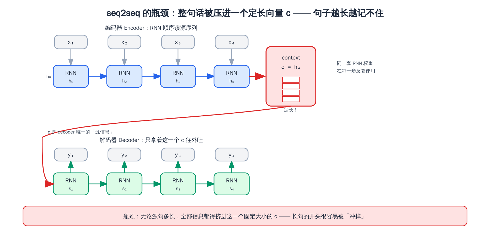
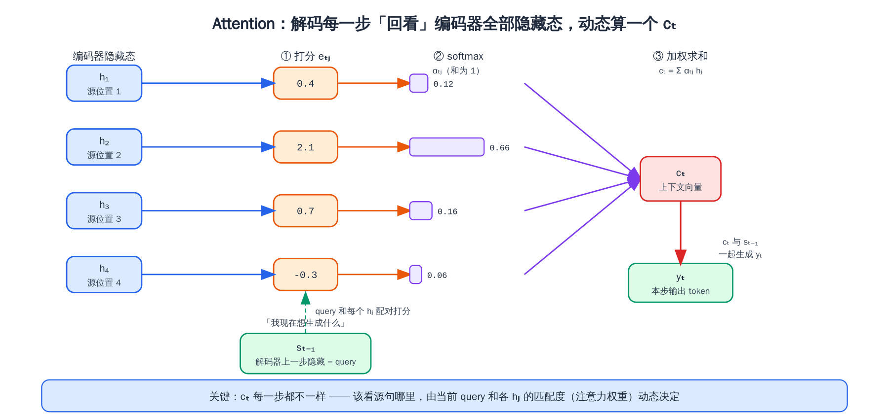
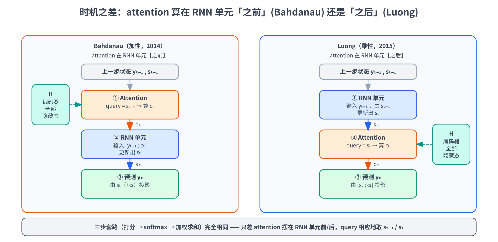
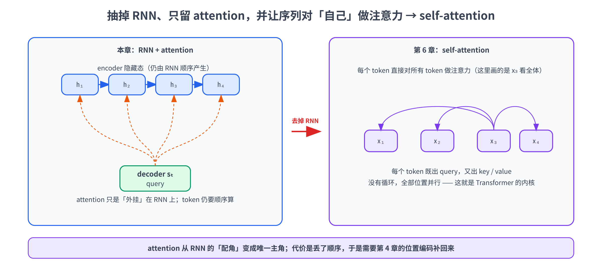

# 第五章：从 RNN 到 attention

前四章我们把「输入表示」这条链路补齐了：文本切成 token（第 3 章）、token 查表变成带语义、带位置的向量（第 4 章）。第 4 章还解释了为什么自注意力对顺序视而不见，所以要外挂位置编码。但我们一直没正面回答一个更根本的问题：**attention 这东西到底是怎么冒出来的？为什么大家会想到「让模型去注意输入的某些部分」？**

这一章就来解释这个问题。我们不直接跳到 Transformer 的自注意力，而是回到 2014 年那个真实的历史现场：当时做机器翻译的主力是 **RNN**（循环神经网络）搭起来的 **seq2seq**，它有个绕不过去的硬伤——**把整句话压进一个定长向量、句子一长就记不住开头**。attention 正是为了补这个缺陷被发明出来的。理解了这段「病因 → 药方」的来龙去脉，你再看第 6 章的 scaled dot-product attention，就不会觉得 Q/K/V 是天上掉下来的玄学，而是水到渠成。

这一章我们会：

- 先用最小的代价把 **RNN** 讲明白——它怎么用一个「循环的隐藏状态」顺序地读序列，以及它那个著名的软肋：**长程依赖记不住**
- 搭出 **seq2seq（encoder–decoder）** 框架，看清它的**信息瓶颈**：encoder 把整句话压成一个固定大小的 context 向量交给 decoder
- 讲清 **attention 的核心思想**：decoder 每生成一个词都「回头看」一遍源句、动态地决定该重点看哪里，而不是只盯着那一个被压扁的向量
- 拆解两个开山级方案：**Bahdanau attention（加性，2014）** 和 **Luong attention（乘性，2015）**，把打分、softmax、加权求和这套「三步套路」一步步推一遍
- 点出从「**挂在 RNN 上的 attention**」到「**self-attention**」只差一步——抽掉 RNN、让序列对自己做注意力，就是 Transformer 的内核（正式留给第 6 章）
- 实战亲手训一个带 attention 的 seq2seq 做「数字串反转」，**把对齐矩阵画出来看 attention 在「看」哪里**，再用一组「准确率随长度变化」的对比，**亲眼看到那个瓶颈**

> 想直接跑示例？点这里 [](https://colab.research.google.com/github/weiqiangnd/LearningLLM/blob/main/src/05.ipynb)。
>
> **硬件门槛**：概念章，CPU 即可 ✅。实战训两个很小的 GRU seq2seq（隐藏维 96、序列长 ≤ 12），在 Colab 免费 CPU 运行时上约 2–4 分钟跑完，**不需要 GPU**，打开 ipynb 直接 Run All 即可。

> 〔预备知识〕本章实战首次走完一整套「前向 → 反向 → 优化器更新」的训练循环（训一个 seq2seq），还会用到 Adam 优化器——若对训练循环三步、优化器选型不熟悉，建议先读 P02 与 P04。

## 目录

- [一、先把 RNN 讲明白](#一先把-rnn-讲明白)
  - [1.1 序列建模：变长、有先后、还得记住历史](#11-序列建模变长有先后还得记住历史)
  - [1.2 RNN：一个循环的隐藏状态](#12-rnn一个循环的隐藏状态)
  - [1.3 RNN 的软肋：长程依赖与梯度消失](#13-rnn-的软肋长程依赖与梯度消失)
- [二、seq2seq：用两个 RNN 做「序列到序列」](#二seq2seq用两个-rnn-做序列到序列)
  - [2.1 任务长什么样：变长输入到变长输出](#21-任务长什么样变长输入到变长输出)
  - [2.2 Encoder–Decoder 架构](#22-encoderdecoder-架构)
  - [2.3 致命瓶颈：把整句话压进一个定长向量](#23-致命瓶颈把整句话压进一个定长向量)
- [三、Attention 登场：让 decoder 回头看](#三attention-登场让-decoder-回头看)
  - [3.1 核心思想：每步动态聚焦，而不是只用一个 context](#31-核心思想每步动态聚焦而不是只用一个-context)
  - [3.2 对齐、上下文向量与三步套路](#32-对齐上下文向量与三步套路)
- [四、Bahdanau Attention（加性注意力，2014）](#四bahdanau-attention加性注意力2014)
  - [4.1 三步走：打分、softmax、加权求和](#41-三步走打分softmax加权求和)
  - [4.2 公式逐项拆解](#42-公式逐项拆解)
  - [4.3 对齐矩阵：attention 在「看」哪里](#43-对齐矩阵attention-在看哪里)
- [五、Luong Attention（乘性注意力，2015）](#五luong-attention乘性注意力2015)
  - [5.1 三种打分函数：dot / general / concat](#51-三种打分函数dot--general--concat)
  - [5.2 时机之差：算在 decoder RNN 之前还是之后](#52-时机之差算在-decoder-rnn-之前还是之后)
  - [5.3 global 与 local attention](#53-global-与-local-attention)
- [六、两种 attention 横向对比](#六两种-attention-横向对比)
- [七、从「挂在 RNN 上的 attention」到 self-attention](#七从挂在-rnn-上的-attention到-self-attention)
- [八、实战：训一个带 attention 的 seq2seq，看对齐矩阵](#八实战训一个带-attention-的-seq2seq看对齐矩阵)
  - [8.1 任务、数据与环境](#81-任务数据与环境)
  - [8.2 RNN 单步、编码器与注意力模块](#82-rnn-单步编码器与注意力模块)
  - [8.3 解码器与整体 seq2seq](#83-解码器与整体-seq2seq)
  - [8.4 训练两个模型并可视化对齐](#84-训练两个模型并可视化对齐)
  - [8.5 瓶颈验证：准确率随长度的对比](#85-瓶颈验证准确率随长度的对比)
- [九、关键概念回顾](#九关键概念回顾)
- [十、本章小结](#十本章小结)

---

## 一、先把 RNN 讲明白

attention 是为了补 RNN seq2seq 的坑而生的，所以咱们得先有个 RNN 的最小认知。这一节不打算把 RNN 讲全（那是另一本书的量），只讲够用来理解「瓶颈从哪来」的部分。

### 1.1 序列建模：变长、有先后、还得记住历史

语言是**序列**：一句话是一串 token，有**先后**、长度**不固定**。处理这种数据，模型得满足三条：

1. **能接受变长输入**——「你好」是 2 个 token，「今天天气真不错」是 7 个，模型不能要求输入必须是固定长度。
2. **尊重顺序**——「狗咬人」和「人咬狗」不是一回事。
3. **能记住历史**——读到第 10 个词时，得还记得前面 9 个词说了啥，否则没法理解上下文。

第 4 章我们说过，自注意力天生满足第 1 条、但对第 2 条「视而不见」要靠位置编码补。而在 Transformer 出现之前（2014 年前后），主流做法是 **RNN**——它对这三条的回答非常直接：**一个 token 一个 token 顺着读，边读边把「读到现在的浓缩记忆」存在一个隐藏状态里**。

### 1.2 RNN：一个循环的隐藏状态

RNN（Recurrent Neural Network，循环神经网络）的核心只有一条递推式。它维护一个**隐藏状态（hidden state）** $h_t$ ——你可以理解成「读到第 $t$ 个 token 为止的浓缩记忆」。每读进一个新 token $x_t$ ，就把「旧记忆 $h_{t-1}$ 」和「新输入 $x_t$ 」揉在一起，得到「新记忆 $h_t$ 」：

$$
\mathbf{h}_t = \tanh(W_{hh}\thinspace \mathbf{h}_{t-1} + W_{xh}\thinspace \mathbf{x}_t + \mathbf{b})
$$

其中 $\mathbf{h}\_t \in \mathbb{R}^{d_h}$ 是 $d_h$ 维隐藏状态， $\mathbf{x}\_t \in \mathbb{R}^{d_x}$ 是 $d_x$ 维当前输入向量； $W_{hh} \in \mathbb{R}^{d_h \times d_h}$ 把旧隐藏映射到新隐藏、 $W_{xh} \in \mathbb{R}^{d_h \times d_x}$ 把输入映射到隐藏， $\mathbf{b} \in \mathbb{R}^{d_h}$ 是偏置； $\tanh$ 是逐元素的非线性激活（把数值压到 $[\thinspace {-1},\ 1\thinspace ]$ ，防止反复相乘后爆炸）。初始记忆 $h_0$ 一般置零。

这里有两个要点，请务必记住，它们是后面所有讨论的地基：

- **同一套权重，反复使用**。 $W_{hh}, W_{xh}, \mathbf{b}$ 在每一个时间步都是**同一份**——不管序列多长，参数量不变。这就是「循环」二字的含义：把同一个计算单元在时间轴上反复套用。正因如此，RNN 天然能接受变长输入（第 1 条要求满足）。
- **顺序天然编码在「处理的先后」里**。RNN 是从左到右一步步算的， $h_3$ 必须等 $h_2$ 算完才能算——顺序信息免费地藏在这条计算链里，所以 **RNN 不需要额外的位置编码**（对比第 4 章：自注意力一次性看全体、抹平了顺序，才必须外挂位置编码）。

把这条递推沿时间轴「展开（unroll）」，就是一串首尾相接的相同单元，记忆 $h$ 像接力棒一样一步步往后传：

```
x₁      x₂      x₃      x₄         ← 逐个读入的 token
 │       │       │       │
 ▼       ▼       ▼       ▼
[RNN]──▶[RNN]──▶[RNN]──▶[RNN]      ← 同一套权重反复用
 │  h₁   │  h₂   │  h₃   │  h₄     ← 隐藏状态（“读到此刻的浓缩记忆”）往后传
 ▼       ▼       ▼       ▼
（每步可选地输出一个东西）
```

实战中的 Cell 2 会用一个 2 维隐藏、3 维输入的玩具尺寸，手动走三步，让你亲眼看到 $h$ 怎么把历史一步步「滚」进去。

> 顺手提一句：原始 RNN（上面那条 $\tanh$ 递推）在实践中常被它的两个改良版替代——**LSTM**（Long Short-Term Memory）和 **GRU**（Gated Recurrent Unit）。它俩的区别在于用一组「门（gate）」来更精细地控制「记忆里哪些该留、哪些该忘、新信息进多少」，从而更能扛住 1.3 节要讲的长程依赖问题。本章实战用的就是 **GRU**（PyTorch 里一行 `nn.GRU` 就有），但你只需把它当成「一个更好用的 RNN」——它对外的接口和上面这条递推完全一致：吃一串输入，吐一串隐藏状态。门控的内部细节不是本章重点，按下不表。

### 1.3 RNN 的软肋：长程依赖与梯度消失

RNN 顺序读、用一个隐藏状态记历史，听着挺好，但它有个老大难问题：**记不住「很久以前」的信息**，术语叫 **长程依赖（long-range dependency）** 难题。

直觉上的原因：记忆 $h$ 的大小是**固定**的（ $d_h$ 维），可句子能任意长。读到第 100 个词时，前面 99 个词的信息全都得挤在这个固定大小的 $h$ 里——后来的信息不断覆盖、稀释先前的，**离得越远的内容越容易被冲淡**。就像你听人一口气讲了五分钟，结尾时多半已经记不清开头第一句的措辞了。

数学上的原因更硬核一点，叫 **梯度消失 / 爆炸（vanishing / exploding gradient）**。训练 RNN 要把误差沿着时间轴一路往回传（反向传播），这个过程里梯度会**反复乘上同一类权重矩阵**。反复相乘的后果是：乘出来的量级要么指数级缩小到几乎为 0（梯度消失，远处的依赖学不动），要么指数级放大到溢出（梯度爆炸，训练直接崩）。LSTM / GRU 的门控机制能**缓解**（注意只是缓解、不是根治）梯度消失，让 RNN 能记得更久一些，但「固定大小的记忆扛不住任意长序列」这个根本矛盾依然在。

记住这个软肋——它就是下一节 seq2seq 瓶颈的源头，也是 attention 要解决的核心痛点。

---

## 二、seq2seq：用两个 RNN 做「序列到序列」

### 2.1 任务长什么样：变长输入到变长输出

很多 NLP 任务的形态是「**一个序列进、另一个序列出**」，而且**两边长度还不一样**。最典型的就是**机器翻译**：

```
输入（源句，英文）:  I   love   you
输出（目标句，中文）: 我   爱     你
```

这种「变长序列 → 变长序列」的任务，统称 **seq2seq（sequence-to-sequence，序列到序列）**。它的难点在于：输入 3 个词、输出可能 2 个或 5 个词，长度对不上，没法简单地「一个输入对一个输出」地逐位映射。怎么办？2014 年 Sutskever 等人和 Cho 等人给出的答案是——**用两个 RNN，一个负责「读」、一个负责「写」**。

### 2.2 Encoder–Decoder 架构

这套「读 + 写」的架构叫 **encoder–decoder（编码器–解码器）**，是 seq2seq 的经典骨架，至今仍是理解一切生成模型的底座：

- **编码器（encoder）**：一个 RNN，把源句一个词一个词读完，吐出它**最后一步的隐藏状态**，记作 **context 向量** $\mathbf{c}$ 。这个 $\mathbf{c}$ 被当作「整句话的浓缩表示」。
- **解码器（decoder）**：另一个 RNN，拿着这个 $\mathbf{c}$ 当起点，一个词一个词地往外**生成**目标句——每步根据「上一步生成的词 + 当前隐藏状态」预测下一个词，直到吐出一个特殊的「结束符」 `<eos>` 为止。

写成递推：编码器读完源句 $x_1, \dots, x_S$ 得到

$$
\mathbf{c} = \mathbf{h}^{\text{enc}}_S \qquad (\text{编码器最后一步的隐藏状态})
$$

解码器从 $\mathbf{c}$ 出发，逐步生成目标词 $y_1, y_2, \dots$ ：

$$
\mathbf{s}_t = f(\mathbf{s}_{t-1},\ \mathbf{y}_{t-1},\ \mathbf{c}), \qquad P(y_t \mid y_{\lt t},\ \mathbf{c}) = \text{softmax}(W_o\thinspace \mathbf{s}_t)
$$

其中 $\mathbf{s}\_t$ 是解码器第 $t$ 步的隐藏状态， $f$ 是 RNN 单元（如 GRU）， $W_o$ 把隐藏映射到词表 logits，softmax 给出下一个词的概率分布（softmax 见 P03；这里和第 2 章生成时用的是同一套「logits → 概率」）。注意 context $\mathbf{c}$ 在**每一步**都被喂给解码器——它是解码器关于「源句说了什么」的**唯一**信息来源。

> 这里出现的「读到 `<eos>` 就停」「每步预测下一个词」「上一步的输出当这一步的输入」，正是后来所有自回归生成模型（包括 GPT）的雏形——只不过那时的主干是 RNN，现在换成了 Transformer。**自回归这套逻辑没变，变的只是底层算子。**

### 2.3 致命瓶颈：把整句话压进一个定长向量

看出问题了吗？整个源句——不管它是 3 个词还是 50 个词——**所有信息都得挤进 $\mathbf{c}$ 这一个固定大小的向量里**。解码器从头到尾，就靠这一个 $\mathbf{c}$ 来「回忆」源句说了什么。



这就是 1.3 节那个软肋的放大版，专门有个名字叫 **信息瓶颈（information bottleneck）**：

- 源句**短**的时候还好—— $\mathbf{c}$ 装得下，翻译质量不错。
- 源句一**长**，麻烦就来了：几十个词的信息全压进一个定长向量，**开头的内容很容易被后面的覆盖掉**。实测中，早期 seq2seq 的翻译质量会**随源句变长而显著下降**——句子越长，掉得越狠。这跟人「一口气听太长就忘了开头」是同一个道理。

更别扭的是：解码器生成目标句的**每一个词**，看到的都是**同一个** $\mathbf{c}$ 。可凭直觉想想，翻译时——生成「我」该重点看源句的 `I`，生成「爱」该重点看 `love`，生成「你」该重点看 `you`。**不同的输出词，本就该关注源句的不同部分**，硬塞同一个 $\mathbf{c}$ 显然太粗暴了。

这两点——**(a) 定长 $\mathbf{c}$ 装不下长句、(b) 每步该看的地方本就不同**——就是 attention 要解决的全部痛点。本章实战的第 8.5 节会用「准确率随源句变长的对比曲线」把痛点 (a) 实实在在地测出来给你看。

---

## 三、Attention 登场：让 decoder 回头看

### 3.1 核心思想：每步动态聚焦，而不是只用一个 context

2014 年 Bahdanau 等人的解法朴素得近乎「显然」，但威力巨大：

> **别再逼 encoder 把整句话压成一个 $\mathbf{c}$ 了。** 把 encoder 每一步的隐藏状态 $h_1, h_2, \dots, h_S$ 全都留着；解码器每生成一个词，就回头扫一遍这些隐藏状态，按「当前最该关注谁」**临时算一个当步专属的** context $\mathbf{c}\_t$ 。

换句话说，瓶颈的根子在于「**先压扁、再使用**」——把一句话压成一个点，信息已经丢了。attention 把顺序倒过来：**先全留着、用的时候再按需挑**。生成「爱」的时候，让模型自己学会把注意力压在源句的 `love` 上；生成「你」时再挪到 `you` 上。该看哪、看多重，由模型**动态**决定，而且**每一步都重新算一次**。



对照 2.3 节的两个痛点，attention 是对症下药：

- 痛点 (a)「定长 $\mathbf{c}$ 装不下」→ 现在**不压扁了**，encoder 的 $S$ 个隐藏状态全程保留，信息不丢。
- 痛点 (b)「每步该看的地方不同」→ 现在 $\mathbf{c}\_t$ **逐步重算**，第 $t$ 步看哪里由第 $t$ 步自己定。

### 3.2 对齐、上下文向量与三步套路

attention 每一步干的事，可以拆成**固定的三步**，后面 Bahdanau、Luong 乃至第 6 章的自注意力，都是这套骨架，只是细节实现不同：

1. **打分（score / align）**：拿「解码器当前的状态」（代表「我现在想生成什么」，术语叫 **query**）去和 encoder 的**每一个**隐藏状态 $h_j$ 比一比、算一个**匹配分数** $e_{tj}$ ——分数越高，表示生成当前词时越该关注源句的第 $j$ 个位置。这一步也叫**对齐（alignment）**，因为它本质是在问「目标第 $t$ 个词，对应源句的哪些位置」。

2. **归一化（softmax）**：把这一行 $S$ 个分数过一遍 softmax，变成一组和为 1 的**注意力权重** $\alpha_{tj}$ 。softmax 让它们成为一个概率分布——可以理解成「这一步把多少比例的注意力分给源句各个位置」。

3. **加权求和（weighted sum）**：用这组权重对 encoder 的隐藏状态做加权平均，得到当步的 **上下文向量** $\mathbf{c}\_t = \sum_j \alpha_{tj}\thinspace h_j$ 。权重大的位置贡献多、权重小的几乎不贡献——于是 $\mathbf{c}\_t$ 就是「这一步重点关注的那些源位置」的浓缩。

得到 $\mathbf{c}\_t$ 后，把它和解码器状态拼在一起，照常预测下一个词。**三步里真正可学的，是第 1 步「怎么打分」**——不同的打分函数，就区分出了 Bahdanau 和 Luong 两大流派。下面分别看。

---

## 四、Bahdanau Attention（加性注意力，2014）

### 4.1 三步走：打分、softmax、加权求和

Bahdanau attention 出自 2014 年那篇奠基论文《Neural Machine Translation by Jointly Learning to Align and Translate》——名字里的 "align"（对齐）说的就是 attention。它的打分函数用一个**小神经网络**来算：把 query 和 $h_j$ 各过一个线性层、相加、过 $\tanh$ ，再投影成一个标量。三步连起来写成公式就是：

$$
e_{tj} = \mathbf{v}^\top \tanh(W\thinspace \mathbf{s}_{t-1} + U\thinspace \mathbf{h}_j) \qquad (\text{① 打分})
$$

$$
\alpha_{tj} = \frac{\exp(e_{tj})}{\sum_{k=1}^{S} \exp(e_{tk})} \qquad (\text{② softmax 归一})
$$

$$
\mathbf{c}_t = \sum_{j=1}^{S} \alpha_{tj}\thinspace \mathbf{h}_j \qquad (\text{③ 加权求和})
$$

### 4.2 公式逐项拆解

逐个符号过一遍：

- $\mathbf{s}\_{t-1}$ ：解码器在**上一步**的隐藏状态，充当本步的 **query**（「我接下来想生成什么」）。形状 $[\thinspace d_h\thinspace ]$ 。
- $\mathbf{h}\_j$ ：编码器在第 $j$ 个源位置的隐藏状态（ $j = 1, \dots, S$ ， $S$ 是源句长度）。形状 $[\thinspace d_h\thinspace ]$ 。
- $W, U$ ：两个可学习的线性变换矩阵，分别作用在 query 和 $h_j$ 上，把它俩投到同一个空间好相加。这里要强调：**投影不是为了凑形状**——就算 $\mathbf{s}\_{t-1}$ 和 $\mathbf{h}\_j$ 维度恰好相同，它俩也分别来自解码器和编码器两个独立网络，**每一维的含义并不对齐**，裸相加没有意义； $W, U$ 各学一个变换，把两边翻译到一个公共的比较空间，「方向接近 = 语义匹配」才成立（本章为简化把两者都记成 $d_h$ 维；实现里两边维度不等也无妨， $W, U$ 各自把它们投到同一个打分空间即可）。
- $\mathbf{v}$ ：一个可学习的向量，把 $\tanh$ 之后的隐藏向量压成**一个标量分数**。
- $e_{tj}$ ：标量，第 $t$ 个目标位置对第 $j$ 个源位置的**原始匹配分**。把第 $t$ 步对所有 $j$ 的分数排成一行就是 $[\thinspace e_{t1}, e_{t2}, \dots, e_{tS}\thinspace ]$ 。
- $\alpha_{tj}$ ：标量，softmax 归一后的**注意力权重**，满足 $\sum_j \alpha_{tj} = 1$ 且每个 $\alpha_{tj} \ge 0$ 。
- $\mathbf{c}\_t$ ：本步的上下文向量，形状 $[\thinspace d_h\thinspace ]$ ，是 $S$ 个 $h_j$ 的加权平均。

「**加性（additive）**」这个名字的由来，就是打分那步里 $W\mathbf{s}\_{t-1}$ 和 $U\mathbf{h}\_j$ 是**相加**再过 $\tanh$ 的——用加法 + 一个小网络来融合 query 和 key。

这里可能有个疑问：这三个公式只算到 $\mathbf{c}\_t$ 为止，可当 query 用的 $\mathbf{s}\_{t-1}$ （解码器隐藏状态）**自己又是怎么来的**？补上这一环，解码循环才闭合。说白了解码器内核还是个 RNN，它每步的递推是：

$$
\mathbf{s}_t = \text{RNN}\bigl(\mathbf{s}_{t-1},\ [\thinspace \mathbf{y}_{t-1}\thinspace ;\thinspace \mathbf{c}_t\thinspace ]\bigr) \qquad (\text{④ 更新解码器状态})
$$

式中方括号里的分号 $[\thinspace \mathbf{y}\_{t-1}\thinspace ;\thinspace \mathbf{c}\_t\thinspace ]$ 表示**向量拼接（concatenation）**——把两个向量首尾接成一个更长的向量（维度相加）。也就是把「上一步**真正输出的那个词**的 embedding $\mathbf{y}\_{t-1}$ 」和「①②③ 刚算出的上下文 $\mathbf{c}\_t$ 」拼在一起，喂进 RNN 单元，得到本步的新状态 $\mathbf{s}\_t$ ；再由 $\mathbf{s}\_t$ （实践中常再拼一次 $\mathbf{c}\_t$ ）过一个线性层 + softmax，预测出本步的词 $y_t$ 。到了下一步， $\mathbf{s}\_t$ 摇身一变又成了新的 query 去算 $\mathbf{c}\_{t+1}$ ——如此循环往复。链条最开头的 $\mathbf{s}\_0$ 一般用**编码器最后一个隐藏状态**来初始化。注意这里 $\mathbf{c}\_t$ 是「先用 $\mathbf{s}\_{t-1}$ 算好、再喂进 RNN 更新出 $\mathbf{s}\_t$ 」——即注意力发生在 RNN 单元**之前**，这正是 Bahdanau 的特征；Luong 把这个顺序反了过来，5.2 节会专门对比。

拿翻译当例子串一遍：解码器要生成「爱」，它上一步的状态 $\mathbf{s}\_{t-1}$ 携带着「我刚生成完『我』，接下来该是个动词」的意图。这个 query 去和源句 `I / love / you` 的三个 $h_j$ 打分，学得好的话 `love` 那个分 $e_{t,\text{love}}$ 最高，softmax 后 $\alpha_{t,\text{love}} \approx 0.9$ ，于是 $\mathbf{c}\_t$ 基本就是 $h_{\text{love}}$ ——解码器据此顺利吐出「爱」。**注意 $\mathbf{c}\_t$ 是临时算的**：下一步生成「你」时，query 变了，权重重新分配，注意力就挪到 `you` 上了。

> 还有个常被忽略的好处：attention 给出的权重 $\alpha_{tj}$ 是**可解释**的——把它当成一个 $[\thinspace T, S\thinspace ]$ 的矩阵画出来（ $T$ 是目标长度、 $S$ 是源长度），就能直观看到「目标每个词在对齐源句的哪些位置」。这张图叫**对齐矩阵**，是 attention 难得的「能被人看懂」的副产品。4.3 节就专门看它。

### 4.3 对齐矩阵：attention 在「看」哪里

把每一步的注意力权重 $\alpha_{tj}$ 按行堆起来，就得到一张**对齐矩阵（alignment matrix）**：行是解码器的步 $t$ 、列是源位置 $j$ ，格子的亮度就是 $\alpha_{tj}$ 。亮的地方表示「生成第 $t$ 个目标词时，重点看了源句第 $j$ 个位置」。

在真实的翻译模型里，这张图常常呈现一条**大致的对角线**（语序相近的语言对，目标第 $t$ 词大致对齐源第 $t$ 词附近），遇到语序调整的地方还会「拐弯」——非常直观地展示了模型学到的词对齐。

下面这张就是个真实例子（取自 Bahdanau 2014 论文 Fig.3 的片段，英 → 法翻译）：行是法语译文逐词生成的步 $t$ 、列是英语源词 $j$ ，格子越蓝表示注意力权重 $\alpha_{tj}$ 越大（每一行是一个 softmax 分布、横向和为 1）。`la` 顺位对齐 `the`，对角线起步很正常；但 `the European Economic Area` 翻成 `la zone économique européenne` 时，形容词-名词的语序英法相反——`européenne`（European）跑到最后、`zone`（Area）提到最前，于是这块 3×3 子矩阵里对角线「拐弯」成了一条**反对角线**。这正是 attention 相比定长 context 的过人之处：它能跨越语序差异，精确地把每个目标词对齐到该看的源词上。


本章实战故意选了一个**对齐图形特别醒目**的玩具任务：**把数字串反转**（输入 `3 1 4 1 5`、输出 `5 1 4 1 3`）。因为逆序任务里，解码第 $t$ 步需要的内容来自源句的第 $(L-1-t)$ 个位置，所以学好的对齐矩阵会是一条干净的**反对角线**（从右上到左下；不同环境下训出来的线偶尔会整体偏移一格——模型也可以提前一步取数、存进隐藏状态下一步再用，效果等价）。实战中的 Cell 9 会把它画出来，你能一眼看到 attention 真的学会了「回看正确的输入位置」。

---

## 五、Luong Attention（乘性注意力，2015）

Bahdanau 之后一年（2015），Luong 等人在《Effective Approaches to Attention-based Neural Machine Translation》里提了一套更简洁、也更接近今天 Transformer 写法的 attention。三步套路（打分 → softmax → 加权求和）完全一样，差别主要在**两处**：打分函数怎么写、attention 在解码流程里算在**哪一步**。

### 5.1 三种打分函数：dot / general / concat

Luong 把打分函数列了三种候选，其中前两种**用乘法**（点积）而非 Bahdanau 的加法小网络——这就是 **乘性**（multiplicative）名字的由来：

$$
\text{score}(\mathbf{s}_t, \mathbf{h}_j) =
\begin{cases}
\mathbf{s}_t^\top \mathbf{h}_j & \text{dot（直接点积）} \cr
\mathbf{s}_t^\top W_a\thinspace \mathbf{h}_j & \text{general（中间夹一个矩阵）} \cr
\mathbf{v}_a^\top \tanh\bigl(W_a[\thinspace \mathbf{s}_t ; \mathbf{h}_j\thinspace ]\bigr) & \text{concat（拼接，≈ Bahdanau）}
\end{cases}
$$

- **dot**：最省事——query 和 $h_j$ 直接做**点积**。点积大说明两个向量方向接近、即「匹配」（点积衡量相似度）。**前提是 query 和 $h_j$ 维度相同**。
- **general**：在点积中间塞一个可学习矩阵 $W_a$ ，相当于先把 $h_j$ 做个线性变换再和 query 点积，比纯 dot 灵活、也能处理两边维度不等的情况。
- **concat**：把 query 和 $h_j$ 拼起来过小网络——这其实和 Bahdanau 的加性打分基本是一回事。

实践中最常用的是 **dot** 和 **general**：它俩是**纯矩阵乘法**，可以把所有位置的打分一次性算成一个大矩阵乘，在 GPU 上飞快——这正是后来 Transformer 选「点积」做注意力打分的根本原因（算得快）。记住这条线索：**第 6 章 scaled dot-product attention 里的 $QK^\top$ ，源头就是这里的 dot score。**

> 既然点积这么好，那 Bahdanau 的加性打分是不是没用了？也不是。维度很高时，点积的数值会随维度增大而方差变大（一堆乘积累加，量级容易冲很大），softmax 进去容易过饱和——这个问题第 6 章会用一个 $\sqrt{d}$ 的缩放来治（这也正是「scaled」的来历）。加性打分因为有 $\tanh$ 压着，对这个问题天生不敏感。所以两者各有适用场景，不是谁淘汰谁。

### 5.2 时机之差：算在 decoder RNN 之前还是之后

第二个差别更微妙，但对理解「attention 挂在 RNN 的哪个位置」很有帮助：

- **Bahdanau**：用**上一步**的解码器隐藏 $\mathbf{s}\_{t-1}$ 当 query 去算 $\mathbf{c}\_t$ ，**先**算注意力、**再**把 $\mathbf{c}\_t$ 喂进解码器 RNN 去更新到 $\mathbf{s}\_t$ 。即注意力发生在 RNN 单元**之前**。
- **Luong**：**先**让解码器 RNN 走一步、算出**当前**的 $\mathbf{s}\_t$ ，**再**用这个 $\mathbf{s}\_t$ 当 query 去算 $\mathbf{c}\_t$ ，然后把 $\mathbf{c}\_t$ 和 $\mathbf{s}\_t$ 拼起来预测输出。即注意力发生在 RNN 单元**之后**。

把这两条流程并排画出来，差别一眼可辨——左边 Bahdanau 把 attention 摆在 RNN 单元**之前**（query 取上一步的 $\mathbf{s}\_{t-1}$ ），右边 Luong 摆在**之后**（query 取刚算出的 $\mathbf{s}\_t$ ）；除此之外，两边「打分 → softmax → 加权求和」的三步内核完全一样：



这个差别在工程上影响不大、性能也接近，记住「**Bahdanau 用 $\mathbf{s}\_{t-1}$ 、Luong 用 $\mathbf{s}\_t$ 当 query**」这一句就够了。本章实战为了代码简洁，采用的是「用上一步隐藏当 query」的 Bahdanau 式写法。

### 5.3 global 与 local attention

Luong 还提了一组正交的概念，顺带一提：

- **global attention（全局注意力）**：解码每一步都对源句的**所有** $S$ 个位置打分——前面讲的都是这种，也是绝对主流。
- **local attention（局部注意力）**：每步只盯源句的**一小段窗口**（先预测一个对齐中心位置，只在它附近算注意力）。动机是源句极长时，对全体打分有点贵。但它引入了「预测窗口中心」的额外复杂度，后来用得不多——尤其 Transformer 时代有了高效实现，global 成了默认。了解有这么个东西即可。

---

## 六、两种 attention 横向对比

把 Bahdanau 和 Luong 摆一起，差异一目了然（**三步套路完全相同，只有这几处实现细节不一样**）：

| 维度 | Bahdanau（2014，加性） | Luong（2015，乘性） |
|------|----------------------|--------------------|
| 打分函数 | $\mathbf{v}^\top \tanh(W\mathbf{s} + U\mathbf{h})$ ，加法 + 小网络 | dot / general / concat，主用**点积** |
| 「加性 vs 乘性」 | 加性（additive）——靠加法融合 | 乘性（multiplicative）——靠点积融合 |
| query 用哪步隐藏 | 上一步 $\mathbf{s}\_{t-1}$ （注意力在 RNN **之前**） | 当前步 $\mathbf{s}\_t$ （注意力在 RNN **之后**） |
| 计算开销 | 略大（每个位置都过一遍小网络） | 小（纯矩阵乘，GPU 友好） |
| 历史意义 | 第一个 attention，提出「对齐」思想 | 简化为点积打分，**直通 Transformer** |

一句话收束：**两者把同一套「打分 → softmax → 加权求和」分别用「加性小网络」和「点积」实现**。Bahdanau 提出了思想，Luong 的点积版更简洁高效、并直接启发了第 6 章 Transformer 的 $QK^\top$ ——这条「点积打分」的技术线索，是本章留给下一章最重要的伏笔。

---

## 七、从「挂在 RNN 上的 attention」到 self-attention

到这里，attention 还只是 RNN seq2seq 上的一个**外挂补丁**：主干仍是顺序计算的 RNN，attention 负责让 decoder「回看」encoder。但 2017 年《Attention Is All You Need》捅破了那层窗户纸，提出一个大胆的问题——

> **既然 attention 这么好用，能不能干脆把 RNN 整个扔掉，只留 attention？**

答案是能，而且效果更好。关键的飞跃有两步：

1. **抽掉 RNN**。RNN 顺序计算、没法并行（ $h_3$ 必须等 $h_2$ ），是训练慢的主因。去掉它，序列里所有位置就能**并行**处理了。
2. **让序列对「自己」做 attention**。本章的 attention 是「decoder 看 encoder」——两个不同的序列之间。把它改成「**一个序列里的每个 token，对同一个序列里的所有 token（包括自己）做 attention**」，就是 **self-attention（自注意力）**。每个 token 既发出 query 去查别人，又作为 key / value 被别人查。



这就是 Transformer 的内核。但天下没有免费的午餐——**RNN 一去掉，那个「顺序天然藏在计算先后里」的好处也没了**（1.2 节强调过）。self-attention 一次性看全体、对位置一视同仁，于是顺序信息丢了——**这正好接回第 4 章的位置编码**：Transformer 必须显式把位置编码加进去，才能把顺序补回来。

至此，几条线索全串上了：

- 第 4 章：自注意力对顺序视而不见 → 需要位置编码（当时还没讲自注意力从哪来）。
- 本章：attention 从 RNN seq2seq 的瓶颈里被逼出来；抽掉 RNN、改成自注意力，就是 Transformer，于是「丢了顺序」的问题冒头，正好用第 4 章的位置编码补。
- 下一章：把 self-attention 的 $Q, K, V$ 、点积打分、softmax、因果 mask 一项项从零拆开实现。

本章的 attention 是「序」，第 6 章的 scaled dot-product attention 才是「正片」。

---

## 八、实战：训一个带 attention 的 seq2seq，看对齐矩阵

这一节我们**亲手**搭一个带 Bahdanau attention 的 GRU seq2seq，在「数字串反转」任务上训练，干两件事：

1. **把对齐矩阵画出来**——肉眼确认 attention 学到了正确的（反对角线）对齐。
2. **验证瓶颈**——再训一个**不带 attention** 的 baseline（context 始终用编码器最后一步那个隐藏状态），对比两者「准确率随源句变长」的曲线，亲眼看到 baseline 的准确率怎么随长度一路下滑、attention 怎么稳住。

> 下面给出本章全部可运行代码（**Cell 0 ~ Cell 10**），逐个 cell 讲解；你既可以照着这里一段段读，也可以从本章顶部的 Open in Colab 直链（这些 cell 的可运行副本）直接 Run All。全程 CPU、约 2–4 分钟。

### 8.1 任务、数据与环境

**Cell 0** 是常规的环境自检，照例打印 PyTorch 版本与 CUDA 可用性——但本章用不到 GPU，CPU 即可：

```python
# ============================================================
# Cell 0: 环境自检（本章纯 CPU 即可，无需 GPU）
# ============================================================
# 本章只训一个很小的 GRU seq2seq（隐藏维 96、序列长 ≤ 12），全程 CPU 几分钟跑完，
# 所以这里不强制 GPU，只打印环境信息确认 PyTorch 可用。
import sys, platform
import torch

print("Python:", sys.version.split()[0])
print("平台:", platform.platform())
print("PyTorch:", torch.__version__)
print("CUDA 可用:", torch.cuda.is_available(), "（本章用不到，CPU 即可）")
```

**Cell 1** 装依赖。本章只额外用到 `matplotlib`（画对齐矩阵热力图和准确率对比曲线）：

```python
%%capture
# ============================================================
# Cell 1: 安装依赖
# ============================================================
# %%capture 必须是 cell 第一行，把 pip 安装日志藏起来
# torch:       张量运算 + nn.GRU——Colab 默认已装且够新，故意【不】加 -U：会话中途
#              升级 torch 容易让内核半新半旧后续 import 报错，本章只用基础算子无需新版。
# matplotlib:  画 attention 对齐矩阵的热力图、长度-准确率对比曲线
!pip install -q -U matplotlib
```

**Cell 3** 定义任务和数据生成。我们用一个最小词表：3 个特殊 token（`PAD` 补齐、`SOS` 起始符、`EOS` 结束符）加 10 个数字，共 13 个。`make_batch` 随机生成一批「数字串 → 逆序」样本，长度在 `[min_len, max_len]` 间均匀取，并按 batch 内最长序列右侧补 `PAD`：

```python
# ============================================================
# Cell 3: 构造 toy 任务「把数字串反过来」+ 词表（对应第 8 节）
# ============================================================
# 任务：输入一串随机数字（如 3 1 4 1 5），输出它的逆序（5 1 4 1 3）。
# 为什么选逆序？它逼着 decoder 第 t 步必须去「对齐」输入的第 (L-1-t) 个位置——
# 于是 attention 学到的对齐矩阵会是一条漂亮的反对角线，肉眼可验证。
import torch

PAD, SOS, EOS = 0, 1, 2                # 三个特殊 token
DIGIT0 = 3                             # 数字 0..9 映射到 token 3..12
VOCAB = 3 + 10                         # 词表大小 = 3 个特殊符 + 10 个数字 = 13

def make_batch(batch_size, min_len=4, max_len=12, seed=None):
    """随机生成一批「数字串 → 逆序」样本，长度在 [min_len, max_len] 间均匀取。
    返回:
      src      [B, Smax]  编码器输入（数字 token，右侧 PAD 补齐）
      src_len  [B]        每条源序列真实长度（不含 PAD）
      tgt_in   [B, Smax+1]  解码器输入（SOS + 逆序数字，teacher forcing 用）
      tgt_out  [B, Smax+1]  解码器目标（逆序数字 + EOS）
    """
    g = torch.Generator().manual_seed(seed) if seed is not None else None
    lens = torch.randint(min_len, max_len + 1, (batch_size,), generator=g)
    Smax = int(lens.max())
    src     = torch.full((batch_size, Smax), PAD, dtype=torch.long)
    tgt_in  = torch.full((batch_size, Smax + 1), PAD, dtype=torch.long)
    tgt_out = torch.full((batch_size, Smax + 1), PAD, dtype=torch.long)
    for i, L in enumerate(lens.tolist()):
        digits = torch.randint(0, 10, (L,), generator=g) + DIGIT0   # L 个数字 token
        rev = torch.flip(digits, dims=[0])                          # 逆序
        src[i, :L] = digits
        tgt_in[i, 0] = SOS                                          # decoder 第一步喂 SOS
        tgt_in[i, 1:L + 1] = rev
        tgt_out[i, :L] = rev
        tgt_out[i, L] = EOS                                         # 目标末尾是 EOS
    return src, lens, tgt_in, tgt_out

# 看一眼一个迷你 batch 长什么样
src, src_len, tgt_in, tgt_out = make_batch(3, min_len=4, max_len=6, seed=42)
print("src     (编码器输入, 数字token):\n", src)
print("src_len (真实长度):", src_len.tolist())
print("tgt_in  (解码器输入, 以 SOS=1 开头):\n", tgt_in)
print("tgt_out (解码器目标, 以 EOS=2 结尾):\n", tgt_out)
```

这里 `tgt_in`（解码器输入，`SOS` 开头）和 `tgt_out`（解码器目标，`EOS` 结尾）错开一位的设计，就是 **teacher forcing**：训练时解码器每步的输入喂的是**真实**的上一个目标 token（而非模型自己上一步的预测），这样训练更稳、能并行算完整条序列。这套自回归目标第 10 章会专门讲，这里照用即可。

### 8.2 RNN 单步、编码器与注意力模块

正式搭网络前，**Cell 2** 先用一个玩具尺寸手算 RNN 的一步递推，把 1.2 节那条公式落到代码上——亲眼看 `h` 怎么把历史一步步滚进去：

```python
# ============================================================
# Cell 2: RNN 一步前向，手算一遍隐藏状态怎么更新（对应第 1.2 节）
# ============================================================
# RNN 的核心就一条递推：h_t = tanh(W_hh h_{t-1} + W_xh x_t + b)。
# 这里用一个 2 维隐藏状态、3 维输入的玩具尺寸，手动走三步，看 h 怎么把历史「滚」进去。
import torch

torch.manual_seed(0)
d_in, d_h = 3, 2                       # 输入 3 维、隐藏 2 维
W_xh = torch.randn(d_h, d_in)          # [d_h, d_in] 输入到隐藏
W_hh = torch.randn(d_h, d_h)           # [d_h, d_h] 隐藏到隐藏（这就是「循环」的那条边）
b    = torch.zeros(d_h)

def rnn_step(x_t, h_prev):
    """单步 RNN：把上一步隐藏 h_prev 和当前输入 x_t 揉进新的隐藏 h_t。"""
    return torch.tanh(W_xh @ x_t + W_hh @ h_prev + b)

xs = [torch.randn(d_in) for _ in range(3)]   # 一条长度 3 的序列
h = torch.zeros(d_h)                          # 初始隐藏状态置 0
for t, x_t in enumerate(xs):
    h = rnn_step(x_t, h)                       # 同一组权重 W_xh/W_hh 反复用于每一步
    print(f"第 {t} 步后的隐藏状态 h = {h.numpy().round(3)}")
print("→ 注意：每一步都复用同一套权重，h 把『到目前为止读过的所有 token』压成一个定长向量")
```

**Cell 4** 是编码器：一个 `nn.Embedding` 加一层 `nn.GRU`。这里有一个**极其容易踩的坑**，必须讲清楚——**不能让 GRU 白跑 padding**：

```python
# ============================================================
# Cell 4: 编码器 Encoder —— 一个 GRU 把源序列读成一串隐藏状态（对应第 2.2 节）
# ============================================================
import torch.nn as nn

class Encoder(nn.Module):
    """Embedding + 单层 GRU。返回每个位置的隐藏状态（attention 要用全部），
    以及最后一步的隐藏状态（无 attention 的 baseline 把它当唯一的 context）。

    关键细节：用 pack_padded_sequence 让 GRU 在每条序列【真实长度】处停下，不去
    处理右侧补的 PAD。否则 h_n 会变成「又跑了一串 PAD 之后」的隐藏态，还会随 batch
    里最长序列的长度而漂移——模型学歪、短序列上直接崩。这是 RNN 喂变长 batch 最常
    踩的坑，务必记住：别让 RNN 白跑 padding。"""
    def __init__(self, vocab, emb_dim, hid_dim):
        super().__init__()
        self.embed = nn.Embedding(vocab, emb_dim, padding_idx=PAD)
        self.gru = nn.GRU(emb_dim, hid_dim, batch_first=True)

    def forward(self, src, src_len):
        emb = self.embed(src)                              # [B, S, emb]
        # 打包成「不含 PAD」的紧凑序列；enforce_sorted=False 允许长度不排序
        packed = nn.utils.rnn.pack_padded_sequence(
            emb, src_len.cpu(), batch_first=True, enforce_sorted=False)
        packed_out, h_n = self.gru(packed)
        # 解包回 [B, S, hid]，PAD 位置补 0（attention 会再屏蔽，不影响结果）
        outputs, _ = nn.utils.rnn.pad_packed_sequence(
            packed_out, batch_first=True, total_length=src.size(1))
        return outputs, h_n                                # h_n: [1, B, hid] 真实最后一个 token 的隐藏

# 形状自检
enc = Encoder(VOCAB, emb_dim=32, hid_dim=96)
_out, _h = enc(src, src_len)
print("encoder outputs:", _out.shape, " (= [B, S, hid])")
print("encoder h_n:    ", _h.shape, " (= [1, B, hid]，每条序列真实最后一个 token 的隐藏态)")
```

> **这个坑值得多说两句**：一个 batch 里序列长短不一，得右侧补 `PAD` 凑成矩形。如果直接把补完 `PAD` 的整条喂 GRU，GRU 会「认认真真」地把那些 `PAD` 也当输入处理，于是最后一步的隐藏状态 `h_n` 变成了「跑完一串 PAD 之后」的状态——而且补多少 PAD 取决于 batch 里最长那条有多长，导致**同一条短序列在不同 batch 里拿到不同的 `h_n`**，模型直接学歪（实测：不加 pack 时短序列准确率会异常地低）。`pack_padded_sequence` 告诉 GRU 每条的真实长度、让它在真实最后一个 token 处停下，`h_n` 就稳了。这是 RNN 处理变长 batch 的标准姿势。

**Cell 5** 是 Bahdanau attention 本体，把第 4.1 节那三行公式一比一翻译成代码——`W` / `U` / `v` 三个线性层对应公式里的 $W$ / $U$ / $\mathbf{v}$ ，注意对 `PAD` 位置打 `-inf` 让 softmax 后权重≈0：

```python
# ============================================================
# Cell 5: Bahdanau（加性）注意力模块（对应第 4 节）
# ============================================================
import torch.nn.functional as F

class BahdanauAttention(nn.Module):
    """加性注意力：score(s, h_j) = v^T tanh(W s + U h_j)。
    输入 decoder 上一步隐藏 s [B, hid] 和 encoder 全部输出 H [B, S, hid]，
    输出 context [B, hid] 和注意力权重 alpha [B, S]（已对 PAD 位置屏蔽）。"""
    def __init__(self, hid_dim):
        super().__init__()
        self.W = nn.Linear(hid_dim, hid_dim, bias=False)   # 作用在 decoder 隐藏 s 上
        self.U = nn.Linear(hid_dim, hid_dim, bias=False)   # 作用在 encoder 每个 h_j 上
        self.v = nn.Linear(hid_dim, 1, bias=False)         # 把打分压成一个标量

    def forward(self, s, H, mask):
        # s: [B, hid] -> [B, 1, hid] 便于和 H 的 S 个位置广播相加
        # H: [B, S, hid]；mask: [B, S]，True 表示真实 token、False 表示 PAD
        energy = torch.tanh(self.W(s).unsqueeze(1) + self.U(H))   # [B, S, hid]
        scores = self.v(energy).squeeze(-1)                        # [B, S] 每个源位置一个分
        scores = scores.masked_fill(~mask, float("-inf"))         # PAD 位置打 -inf，softmax 后≈0
        alpha = F.softmax(scores, dim=-1)                          # [B, S] 注意力权重，和为 1
        context = torch.bmm(alpha.unsqueeze(1), H).squeeze(1)      # 加权求和 -> [B, hid]
        return context, alpha
```

对照公式看形状变换：`self.W(s)` 是 $W\mathbf{s}\_{t-1}$ 、`self.U(H)` 是 $U\mathbf{h}\_j$ （对所有 $j$ 一次算完），相加过 `tanh` 得 `energy` $[\thinspace B, S, \text{hid}\thinspace ]$ ，再过 `self.v` 压成标量分 `scores` $[\thinspace B, S\thinspace ]$ ；softmax 得权重 `alpha`，最后 `torch.bmm`（批量矩阵乘）实现 $\sum_j \alpha_{tj}\mathbf{h}\_j$ 这个加权求和，得 `context` $[\thinspace B, \text{hid}\thinspace ]$ 。三步套路一一对应。

### 8.3 解码器与整体 seq2seq

**Cell 6** 是解码器，用一个 `use_attention` 开关同时实现「带 attention」和「baseline」两种模式——这样两个模型共用一份代码、对比才公平。带 attention 时每步动态算 `context`；baseline 则 `context` 恒为编码器最后一步的隐藏状态（那个被诟病的固定瓶颈）：

```python
# ============================================================
# Cell 6: 解码器 Decoder —— 带 / 不带 attention 两种模式（对应第 2.3 / 4 节）
# ============================================================
class Decoder(nn.Module):
    """单步解码器（GRUCell）。use_attention 开关切换两种 context 来源：
      - use_attention=True : 每步用 Bahdanau attention 动态算 context（回看整句）
      - use_attention=False: context 恒为 encoder 最后一步隐藏态（固定瓶颈，baseline）
    GRUCell 的输入是 [上一步token embedding ; context] 拼接而成。"""
    def __init__(self, vocab, emb_dim, hid_dim, use_attention):
        super().__init__()
        self.use_attention = use_attention
        self.embed = nn.Embedding(vocab, emb_dim, padding_idx=PAD)
        self.attn = BahdanauAttention(hid_dim) if use_attention else None
        self.cell = nn.GRUCell(emb_dim + hid_dim, hid_dim)
        self.out = nn.Linear(hid_dim + hid_dim, vocab)   # 拼 [s ; context] 再投到词表

    def step(self, y_prev, s, H, mask, fixed_ctx):
        # y_prev: [B] 上一步 token；s: [B, hid] 上一步隐藏；H: [B, S, hid] 编码器输出
        emb = self.embed(y_prev)                          # [B, emb]
        if self.use_attention:
            context, alpha = self.attn(s, H, mask)        # [B, hid], [B, S]
        else:
            context, alpha = fixed_ctx, None              # 始终是同一个向量（瓶颈）
        s = self.cell(torch.cat([emb, context], dim=-1), s)   # [B, hid] 新隐藏
        logits = self.out(torch.cat([s, context], dim=-1))    # [B, vocab]
        return logits, s, alpha
```

**Cell 7** 把 encoder / decoder 拼成完整的 `Seq2Seq`，并给出训练循环 `train` 和评估函数 `seq_accuracy`。`forward` 里逐步解码（teacher forcing 喂真值），并构造 `mask` 标记真实 token；`train` 就是标准的「前向 → 交叉熵 loss（忽略 PAD）→ 反向 → 优化器更新」四步：

```python
# ============================================================
# Cell 7: Seq2Seq 整体 + 训练/评估函数（对应第 8 节）
# ============================================================
class Seq2Seq(nn.Module):
    def __init__(self, vocab, emb_dim, hid_dim, use_attention):
        super().__init__()
        self.encoder = Encoder(vocab, emb_dim, hid_dim)
        self.decoder = Decoder(vocab, emb_dim, hid_dim, use_attention)

    def forward(self, src, src_len, tgt_in, return_attn=False):
        H, h_n = self.encoder(src, src_len)       # H: [B, S, hid], h_n: [1, B, hid]
        s = h_n.squeeze(0)                         # decoder 初始隐藏 = encoder 最后一步的隐藏 [B, hid]
        fixed_ctx = s                              # baseline 用的固定 context
        # mask: [B, S]，True=真实 token。arange < 长度 即为有效位置
        mask = torch.arange(src.size(1)).unsqueeze(0) < src_len.unsqueeze(1)
        logits_seq, attn_seq = [], []
        for t in range(tgt_in.size(1)):            # 逐步解码（teacher forcing 喂真值）
            logits, s, alpha = self.decoder.step(tgt_in[:, t], s, H, mask, fixed_ctx)
            logits_seq.append(logits)
            if return_attn and alpha is not None:
                attn_seq.append(alpha)
        logits = torch.stack(logits_seq, dim=1)    # [B, T, vocab]
        attn = torch.stack(attn_seq, dim=1) if (return_attn and attn_seq) else None
        return logits, attn                        # attn: [B, T, S] 或 None

def train(model, steps=2000, batch_size=64, lr=2e-3, log_every=400):
    """标准训练循环：前向 -> 交叉熵 loss（忽略 PAD）-> 反向 -> 优化器更新。"""
    opt = torch.optim.Adam(model.parameters(), lr=lr)
    model.train()
    for step in range(1, steps + 1):
        src, src_len, tgt_in, tgt_out = make_batch(batch_size)
        logits, _ = model(src, src_len, tgt_in)
        # logits [B,T,V] 摊平成 [B*T, V] 与 tgt_out [B*T] 对齐；PAD 不计入 loss
        loss = F.cross_entropy(logits.reshape(-1, VOCAB), tgt_out.reshape(-1),
                               ignore_index=PAD)
        opt.zero_grad()
        loss.backward()
        opt.step()
        if step % log_every == 0 or step == 1:
            print(f"  step {step:4d}/{steps}  loss = {loss.item():.4f}")
    return model

@torch.no_grad()
def seq_accuracy(model, n_batches=20, batch_size=128, min_len=4, max_len=12):
    """整条序列全对才算对（exact match），统计 n_batches 个 batch 的平均准确率。"""
    model.eval()
    correct = total = 0
    for _ in range(n_batches):
        src, src_len, tgt_in, tgt_out = make_batch(batch_size, min_len, max_len)
        logits, _ = model(src, src_len, tgt_in)
        pred = logits.argmax(-1)                        # [B, T] 贪心取每步最大
        valid = tgt_out != PAD                          # 只看非 PAD 位置
        ok = ((pred == tgt_out) | ~valid).all(dim=1)    # 该样本所有有效位置都对
        correct += ok.sum().item()
        total += src.size(0)
    return correct / total
```

> 这就是 P02 / P04 里那套训练循环的完整落地：`opt.zero_grad()` 清梯度、`loss.backward()` 反向、`opt.step()` 更新，配 Adam 优化器和 `2e-3` 的学习率。`F.cross_entropy` 接收 raw logits（不要自己先 softmax，这条铁律见 P03），并用 `ignore_index=PAD` 让补齐位置不计入 loss。

### 8.4 训练两个模型并可视化对齐

**Cell 8** 分别训「带 attention」和「baseline」两个模型，各 1500 步（CPU 上每个约 1–2 分钟）：

```python
# ============================================================
# Cell 8: 训练两个模型——带 attention vs 不带（baseline）（对应第 8 节）
# ============================================================
import time

torch.manual_seed(0)
print("训练【带 attention】的 seq2seq ...")
t0 = time.time()
model_attn = Seq2Seq(VOCAB, emb_dim=32, hid_dim=96, use_attention=True)
train(model_attn, steps=1500)
print(f"  用时 {time.time() - t0:.1f}s\n")

torch.manual_seed(0)
print("训练【不带 attention】的 baseline（context 固定为编码器最后一步的隐藏状态）...")
t0 = time.time()
model_plain = Seq2Seq(VOCAB, emb_dim=32, hid_dim=96, use_attention=False)
train(model_plain, steps=1500)
print(f"  用时 {time.time() - t0:.1f}s")
```

**预期现象**：带 attention 的模型 loss 会一路降到接近 0；baseline 的 loss 则明显卡住、下不去（停在高得多的水平）——因为它得把整条源序列硬塞进一个固定向量，长序列上力不从心。

**Cell 9** 是本章最值得看的一步：取一条长度 8 的样本，把带 attention 模型的对齐矩阵画成热力图：

```python
# ============================================================
# Cell 9: 可视化 attention 对齐矩阵——逆序任务应是一条反对角线（对应第 4.3 节）
# ============================================================
import matplotlib.pyplot as plt

# 取一条定长样本，看带 attention 的模型每步在「看」源序列的哪个位置
src, src_len, tgt_in, tgt_out = make_batch(1, min_len=8, max_len=8, seed=7)
model_attn.eval()
with torch.no_grad():
    logits, attn = model_attn(src, src_len, tgt_in, return_attn=True)
pred = logits.argmax(-1)[0]                 # [T]

src_digits = (src[0] - DIGIT0).tolist()     # 还原成 0..9 便于看
L = src_len.item()
A = attn[0, :L, :L].numpy()                  # [T, S] 只取有效部分

print("源序列(数字):", src_digits[:L])
print("目标(逆序)  :", (tgt_out[0, :L]).sub(DIGIT0).tolist())
print("模型预测     :", (pred[:L]).sub(DIGIT0).tolist())

plt.figure(figsize=(5, 4))
plt.imshow(A, cmap="viridis", aspect="auto")
plt.xlabel("source position j")            # matplotlib 标签一律英文，避免豆腐块
plt.ylabel("decoder step t")
plt.title("Bahdanau Attention Alignment (reverse task)")
plt.colorbar(label="attention weight")
plt.tight_layout()
plt.show()
print("→ 亮点大致沿反对角线分布：解码第 t 步把注意力压在源序列第 (L-1-t) 个位置附近")
print("  （有的训练结果会整体偏移一格——提前一步取数、存进隐藏状态下一步再用，效果等价），")
print("  正是逆序任务需要的对齐——attention 自己学会了『回看正确的输入位置』。")
```

**预期现象**：打印出的「模型预测」和「目标(逆序)」完全一致；热力图上**亮点连成一条从右上到左下的反对角线**——解码第 0 步盯着源句最后一位、第 1 步盯倒数第二位……正是逆序任务该有的对齐。（细看每行最亮的格子，不同 torch 版本 / 平台下这条线可能整体偏移一格——比如第 1 步还停在最后一位、第 2 步才挪到倒数第二位：attention 提前一步把数取进来、存在隐藏状态里下一步再用，任务照样全对。只要整体趋势是反对角线就对了。）这就是「看得见的 attention」：模型没人教，自己学会了每一步该回看输入的哪个位置。

### 8.5 瓶颈验证：准确率随长度的对比

**Cell 10** 收尾，把 2.3 节那个抽象的「瓶颈」测成一条曲线。按源句长度分四个桶（4–5 / 6–7 / 8–9 / 10–12），分别评估两个模型的**整句准确率**（一条序列每个 token 都对才算对）：

```python
# ============================================================
# Cell 10: 瓶颈验证——准确率随序列变长，baseline 掉得比 attention 快（对应第 2.3 / 8.5 节）
# ============================================================
# 同样的训练量下，把测试集按长度分桶，比较两个模型的整句准确率。
# 预期：短序列两者都行；越长，无 attention 的 baseline 越吃力（信息被压进单个向量），
# 带 attention 的模型则能稳住——这就是 attention 当年被发明出来要解决的「瓶颈」。
buckets = [(4, 5), (6, 7), (8, 9), (10, 12)]
acc_attn, acc_plain = [], []
for lo, hi in buckets:
    acc_attn.append(seq_accuracy(model_attn, min_len=lo, max_len=hi))
    acc_plain.append(seq_accuracy(model_plain, min_len=lo, max_len=hi))

labels = [f"{lo}-{hi}" for lo, hi in buckets]
for lab, a, p in zip(labels, acc_attn, acc_plain):
    print(f"  长度 {lab:5s}  attention={a:.2%}   baseline={p:.2%}")

x = range(len(buckets))
plt.figure(figsize=(6, 4))
plt.plot(list(x), acc_attn, "o-", label="with attention")
plt.plot(list(x), acc_plain, "s--", label="no attention (baseline)")
plt.xticks(list(x), labels)
plt.xlabel("source length bucket")
plt.ylabel("exact-match accuracy")
plt.title("Why Attention: accuracy vs sequence length")
plt.ylim(0, 1.05)
plt.legend()
plt.grid(alpha=0.3)
plt.tight_layout()
plt.show()
print("→ 序列越长，固定 context 的 baseline 越扛不住（瓶颈），attention 基本稳住。")
```

**预期现象**（**具体数值随种子 / 训练量波动较大，下表只标定性趋势，请以你跑出来的相对走势为准**）：

| 源句长度桶 | with attention | no attention（baseline） |
|-----------|---------------|--------------------------|
| 4–5 | 接近满分 | 接近满分 |
| 6–7 | 接近满分 | 开始略有下滑 |
| 8–9 | 接近满分 | 明显下滑 |
| 10–12 | 接近满分 | 大幅下滑（常掉到一半以下） |

这张表（和对应曲线）就是本章最有说服力的一句话：**短句两者都行；句子一长，固定 context 的 baseline 准确率明显往下掉，而 attention 几乎纹丝不动。** 你亲手把「2.3 节的瓶颈」和「attention 怎么治它」一次性验证了——这正是 2014 年 attention 被发明出来的全部动机。

> 顺手交代一个口径：这里的 `seq_accuracy` 评估时给解码器喂的是**真值** `tgt_in`（也就是沿用了训练时的 **teacher forcing**），而不是「拿模型自己上一步的预测当下一步输入」那种自由生成。这么写是为了代码简洁、评估快。代价是：baseline 每一步都还能看到「正确的上一个 token」，错误不会沿步累积，所以这里测出的下滑其实是**温和版**——真换成自由生成，固定 context 的 baseline 会垮得更彻底。换句话说，上表的趋势只会**低估**瓶颈、不会夸大它；定性结论（越长越崩、attention 稳住）是站得住的。

---

## 九、关键概念回顾

| 概念 | 一句话定义 |
|------|-----------|
| **RNN** | 循环神经网络：维护一个隐藏状态 $h_t$ ，逐 token 顺序读、用同一套权重把历史「滚」进 $h_t$ |
| **隐藏状态 $h_t$** | 「读到第 $t$ 个 token 为止的浓缩记忆」，大小固定（ $d_h$ 维） |
| **长程依赖难题** | RNN 固定大小的记忆扛不住任意长序列，远处信息被冲淡；伴随梯度消失 / 爆炸 |
| **seq2seq** | 序列到序列任务（如翻译）：变长输入 → 变长输出 |
| **encoder–decoder** | seq2seq 的骨架：编码器读源句压成 context，解码器据此逐词生成 |
| **context 向量 $\mathbf{c}$** | 编码器最后一步的隐藏状态，被当作「整句话的浓缩」交给解码器——瓶颈就出在这「一个定长向量」上 |
| **信息瓶颈** | 整句话压进定长 $\mathbf{c}$ ，源句越长越装不下，翻译质量随长度下降 |
| **attention（注意力）** | 解码每步回看 encoder 全部隐藏态，动态算一个当步专属的 $\mathbf{c}\_t$ ，不再压扁 |
| **对齐 / alignment** | attention 打分这一步，本质在问「目标第 $t$ 词对应源句哪些位置」 |
| **注意力权重 $\alpha_{tj}$** | 打分过 softmax 后的概率分布，表示第 $t$ 步把多少注意力分给源位置 $j$ |
| **三步套路** | 打分（score）→ softmax 归一 → 加权求和；一切 attention 的共同骨架 |
| **Bahdanau（加性）** | 打分用 $\mathbf{v}^\top\tanh(W\mathbf{s}+U\mathbf{h})$ ，加法 + 小网络；提出对齐思想 |
| **Luong（乘性）** | 打分用点积（dot / general），简洁高效；直接启发 Transformer 的 $QK^\top$ |
| **对齐矩阵** | 把 $\alpha_{tj}$ 排成 $[\thinspace T, S\thinspace ]$ 矩阵画出来，可视化「目标对齐源句哪里」 |
| **self-attention** | 抽掉 RNN、让序列对自己做 attention，即 Transformer 内核（第 6 章） |

---

## 十、本章小结

- **RNN** 用一个循环的隐藏状态 $h_t$ 顺序地读序列，同一套权重反复套用，顺序信息天然藏在「计算的先后」里（所以 RNN 不需要位置编码）。但它有个根本软肋：**固定大小的记忆扛不住长序列**——长程依赖记不住，还伴随梯度消失 / 爆炸。
- **seq2seq** 用 encoder–decoder 处理「变长 → 变长」：编码器把源句压成一个 **context 向量 $\mathbf{c}$** ，解码器据此逐词生成。但这带来**信息瓶颈**——整句话挤进一个定长 $\mathbf{c}$ ，源句越长越装不下，且每个输出词看到的都是同一个 $\mathbf{c}$ （可不同词本该关注源句不同部分）。
- **attention** 对症下药：**不再压扁**，保留 encoder 所有隐藏态；解码每一步**动态**算一个当步专属的 $\mathbf{c}\_t$ 。机制是固定的**三步套路**——打分（对齐）→ softmax → 加权求和。
- **Bahdanau（加性，2014）** 用一个小网络 $\mathbf{v}^\top\tanh(W\mathbf{s}+U\mathbf{h})$ 打分，提出「对齐」思想；**Luong（乘性，2015）** 改用**点积**打分，更简洁高效，并直通第 6 章 Transformer 的 $QK^\top$ 。两者三步骨架相同，差别只在「怎么打分、query 用哪步隐藏」。
- 从「**挂在 RNN 上的 attention**」到 **self-attention** 只差一步：抽掉 RNN（换来并行）、让序列对**自己**做注意力，就是 Transformer 的内核——代价是丢了顺序，正好接回第 4 章的位置编码来补。
- 实战我们亲手训了带 attention 的 GRU seq2seq 做数字串反转，**把对齐矩阵画成了清晰的反对角线**（看见 attention 学到的对齐），又用一条「准确率随长度变化」的对比曲线，**亲眼验证了无 attention 的 baseline 准确率怎么随长度一路下滑、attention 怎么稳住**——把 attention 的来历从头到尾验证了一遍。

到这里，「attention 为什么会出现」这条历史线就讲清了：它是被 RNN seq2seq 的瓶颈逼出来的药方。

---

下一章我们把这味药提纯到底：**Scaled Dot-Product Attention**——把本章「挂在 RNN 上」的 attention 彻底独立出来，从零拆解自注意力的 **Query / Key / Value**、点积打分、那个治高维方差的 $\sqrt{d}$ 缩放、以及让模型「看不到未来」的 **causal mask**，正式踏进 Transformer 的大门。
