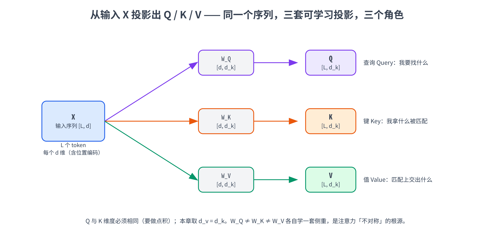
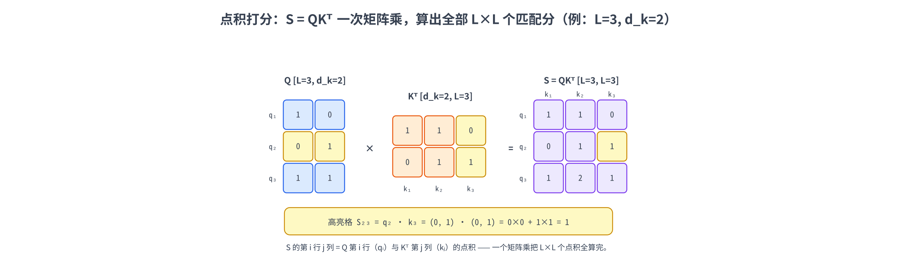
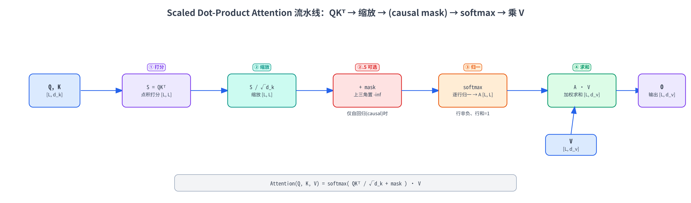
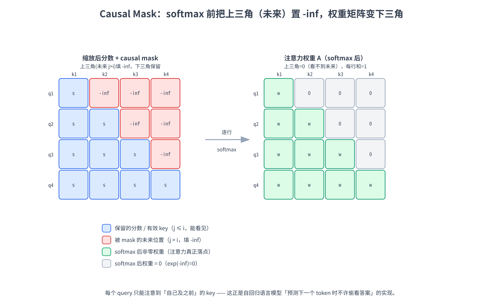

# 第六章：Scaled Dot-Product Attention

第 5 章我们把 attention 的「来历」讲清楚了：它是被 RNN seq2seq 的定长 context 瓶颈逼出来的药方，核心是一套「**打分 → softmax → 加权求和**」的三步套路，而 Luong 那一支用**点积**打分、简洁又对 GPU 友好，直接给 Transformer 埋了伏笔。第 5 章结尾还点出了那关键的一步：**抽掉 RNN、让一个序列对自己做 attention，就是 self-attention（自注意力）**——Transformer 的内核。

这一章就把这个内核**从零拆开**。我们要把 Transformer 里那个最核心的算子 **scaled dot-product attention（缩放点积注意力）** 一项一项搭出来：

- 先把第 5 章的三步套路平移到「序列对自己」的场景，说清 self-attention 到底在算什么；
- 引入 **Query / Key / Value（Q / K / V）** 这三个角色——它们不是玄学，用一个「数据库检索」的类比就能讲通，再看它们怎么由输入**线性投影**出来；
- 把打分那步换成**点积** $QK^\top$ ，并解释那个看着突兀的 $\sqrt{d_k}$ 缩放的作用到底是什么（这就是「**scaled**」的来历）；
- 把 softmax 与加权求和拼上，得到那行你迟早要背下来的公式 $\text{softmax}(QK^\top / \sqrt{d_k})\thinspace V$ ；
- 最后加上让模型「**看不到未来**」的 **causal mask（因果掩码）**——这是 decoder-only 语言模型（GPT 那一类）能做自回归生成的关键。

实战部分我们**全程用 CPU、纯 PyTorch** 把上面每一步都跑一遍：先用一个长度 3、维度 2 的玩具例子**手算**一次，再封装成一个 `scaled_dot_product_attention` 函数、和 PyTorch 官方实现对齐验证，最后把「缩放救了 softmax」和「mask 让注意力矩阵变下三角」两件事**画出来看**。

> 想直接跑示例？点这里 [](https://colab.research.google.com/github/weiqiangnd/LearningLLM/blob/main/src/06.ipynb)。
>
> **硬件门槛**：概念章，CPU 即可 ✅。本章只在长度 ≤ 8、维度 ≤ 64 的玩具张量上做矩阵乘法，Colab 免费 CPU 运行时秒级跑完，**不需要 GPU**，打开 ipynb 直接 Run All 即可。

## 目录

- [一、从 RNN attention 到 self-attention](#一从-rnn-attention-到-self-attention)
  - [1.1 回顾：三步套路与点积打分](#11-回顾三步套路与点积打分)
  - [1.2 self-attention：序列对自己做注意力](#12-self-attention序列对自己做注意力)
- [二、Query / Key / Value：三个角色](#二query--key--value三个角色)
  - [2.1 一个数据库检索的类比](#21-一个数据库检索的类比)
  - [2.2 从输入投影出 Q / K / V](#22-从输入投影出-q--k--v)
  - [2.3 形状全程标注](#23-形状全程标注)
- [三、Scaled Dot-Product：点积打分与缩放](#三scaled-dot-product点积打分与缩放)
  - [3.1 点积打分：一次算出全部匹配分数](#31-点积打分一次算出全部匹配分数)
  - [3.2 为什么要除以根号 dk](#32-为什么要除以根号-dk)
  - [3.3 最小可手算的例子](#33-最小可手算的例子)
- [四、Softmax 与加权求和：拼出完整公式](#四softmax-与加权求和拼出完整公式)
  - [4.1 行 softmax 得到注意力权重矩阵](#41-行-softmax-得到注意力权重矩阵)
  - [4.2 加权求和得到输出](#42-加权求和得到输出)
  - [4.3 完整公式一览](#43-完整公式一览)
- [五、Causal Mask：不让模型偷看未来](#五causal-mask不让模型偷看未来)
  - [5.1 自回归为什么必须戴上眼罩](#51-自回归为什么必须戴上眼罩)
  - [5.2 上三角 -inf：mask 怎么实现](#52-上三角--infmask-怎么实现)
  - [5.3 顺带一提：padding mask](#53-顺带一提padding-mask)
- [六、复杂度与几个常见疑问](#六复杂度与几个常见疑问)
- [七、实战：从零实现 scaled dot-product attention](#七实战从零实现-scaled-dot-product-attention)
  - [7.1 手算一遍：长度 3、维度 2 的最小例子](#71-手算一遍长度-3维度-2-的最小例子)
  - [7.2 把它写成一个函数](#72-把它写成一个函数)
  - [7.3 验证：和 PyTorch 官方实现对齐](#73-验证和-pytorch-官方实现对齐)
  - [7.4 看见缩放：缩放怎么救了 softmax](#74-看见缩放缩放怎么救了-softmax)
  - [7.5 看见 mask：注意力矩阵变成下三角](#75-看见-mask注意力矩阵变成下三角)
  - [7.6 收尾：包成一个 self-attention 模块](#76-收尾包成一个-self-attention-模块)
- [八、关键概念回顾](#八关键概念回顾)
- [九、本章小结](#九本章小结)

---

## 一、从 RNN attention 到 self-attention

### 1.1 回顾：三步套路与点积打分

先把第 5 章的核心结论再总结一下，作为本章的起点。attention 不管哪个流派，干的都是同一套**三步套路**：

1. **打分（score）**：拿一个「查询」去和一组「被查的东西」逐个比一比，算出匹配分数；
2. **归一（softmax）**：把这一行分数过 softmax，变成一组和为 1 的权重；
3. **加权求和（weighted sum）**：用这组权重对「被查的东西」做加权平均，得到输出。

第 5 章里，「查询」是 decoder 当前的隐藏状态，「被查的东西」是 encoder 的各个隐藏态。我们还特别强调了 Luong 那一支的**点积打分**——查询和被查向量直接做点积，点积大就代表方向接近、即「匹配」。点积打分的好处是**纯矩阵乘法**，能把所有位置一次性算成一个大矩阵乘，在 GPU 上飞快。这一章的主角 scaled dot-product attention，就是把这条「点积打分」路线推到极致。

> softmax 在本章会反复出现，它把一组实数 $z_1, \dots, z_n$ 变成一个概率分布： $\text{softmax}(z)\_i = \exp(z_i) / \sum_j \exp(z_j)$ ，结果每项非负、加起来等于 1，且原来越大的项归一后占比越大。若对它和「logits → 概率」这条链路还不熟，建议回看 P03。

### 1.2 self-attention：序列对自己做注意力

第 5 章的 attention 是「**decoder 看 encoder**」——查询来自一个序列、被查的来自**另一个**序列。self-attention 把这件事改成「**序列看自己**」：

> 给定一个长度为 $L$ 的序列（比如一句话的 $L$ 个 token，每个 token 已经是一个 $d$ 维向量），让**每一个位置都作为查询，去和序列里所有位置（包括它自己）打分、加权求和**，得到一个融合了全局信息的新向量。

换句话说，self-attention 让序列里的每个 token 都「环顾四周」，根据和其他 token 的相关程度，把别人的信息按需吸收进来。举个直觉例子：句子「**动物没过马路，因为它太累了**」里的「它」，到底指动物还是马路？人一眼知道是动物。self-attention 就是让「它」这个位置作为查询去扫一遍全句，给「动物」打高分、给「马路」打低分，于是「它」的新表示里**主要混进了「动物」的信息**——指代关系就这样被编码进了向量。这种「同一句话内部，词与词互相看」正是 RNN 那种顺序传递难以直接做到的，而 self-attention 一步到位、还能并行。

第 5 章末尾说过，做出这一步飞跃要付两个代价、得两个好处：去掉 RNN 换来**并行**（所有位置同时算，不必像 RNN 那样等前一步），但也**丢了顺序**（self-attention 对位置一视同仁，要靠第 4 章的位置编码补回来）。本章聚焦 attention 算子本身，位置编码已在第 4 章讲过，这里默认输入向量已经带好了位置信息。

那么，「每个位置作为查询、又作为被查」具体怎么落到矩阵运算上？这就要请出 Q / K / V 三个角色了。

---

## 二、Query / Key / Value：三个角色

### 2.1 一个数据库检索的类比

Q / K / V 这三个字母初看吓人，其实对应一个你天天在用的东西——**带「模糊匹配」的字典 / 数据库检索**。设想你在一个 key-value 字典里查东西：

- **Query（查询）**：你手里的**检索条件**——「我想找跟『水果』有关的条目」。
- **Key（键）**：字典里每个条目的**索引标签**——「苹果」「香蕉」「螺丝刀」各自的标签。
- **Value（值）**：每个条目实际**装的内容**——查中了之后真正要取走的东西。

普通字典是**精确匹配**：query 和某个 key 一模一样才命中，取出对应的 value。attention 干的是**软匹配（soft lookup）**：query 和**每一个** key 都算一个相似度（打分），相似度经 softmax 变成一组权重，然后把所有 value **按权重加权混合**取出来——不是「命中一个」，而是「按相关程度从每个条目里取一点」。query 和 `苹果`、`香蕉` 的 key 相似度高，最后取出的就主要是这俩 value 的混合，`螺丝刀` 那条权重接近 0、基本不贡献。

对回三步套路就很清楚了：**打分** = query 和各个 key 算相似度；**softmax** = 把相似度变成检索权重；**加权求和** = 按权重把 value 混合出来。Q 决定「我要找什么」，K 决定「我拿什么去被匹配」，V 决定「匹配上之后交出什么」——**同一个 token 同时扮演这三个角色**（既发出自己的 query，又作为别人的 key / value 被查）。

### 2.2 从输入投影出 Q / K / V

那 Q / K / V 这三个向量从哪来？答案是：**从同一个输入，用三个不同的线性层各投影一份**。

设输入序列是矩阵 $X \in \mathbb{R}^{L \times d}$ —— $L$ 个 token，每个是 $d$ 维向量（已含位置编码），按行堆成矩阵。我们准备三个可学习的权重矩阵 $W_Q, W_K, W_V$ ，分别把 $X$ 投影成 Query、Key、Value：

$$
Q = X W_Q, \qquad K = X W_K, \qquad V = X W_V
$$

其中 $W_Q \in \mathbb{R}^{d \times d_k}$ 、 $W_K \in \mathbb{R}^{d \times d_k}$ 、 $W_V \in \mathbb{R}^{d \times d_v}$ ，于是 $Q \in \mathbb{R}^{L \times d_k}$ 、 $K \in \mathbb{R}^{L \times d_k}$ 、 $V \in \mathbb{R}^{L \times d_v}$ 。这里 Q 和 K 的维度必须一样（记作 $d_k$ ，因为它俩要做点积）；V 的维度 $d_v$ 原则上可以不同，但实践中常取 $d_v = d_k$ ，本章后面也默认 $d_k = d_v$ ，统一记成 $d_k$ 。

为什么不直接拿 $X$ 自己跟自己点积、非要先投影三份？两个原因：

- **解耦三个角色**。一个 token「作为查询时该强调哪些特征」和「作为被查的 key 时该亮出哪些特征」往往不一样——投影让模型能为 query / key / value 各学一套侧重，比一份 $X$ 包打天下灵活得多。
- **可学习**。 $W_Q, W_K, W_V$ 是参数，靠梯度下降学出来——模型会自己学到「什么样的 token 之间该互相关注」，而不是写死。

> 顺带说一个常被忽略的点：上面写的是**单个**注意力（习惯叫「单头」）。真实 Transformer 用的是**多头注意力**——把 $d$ 维拆成多份、各自独立做一遍 scaled dot-product attention 再拼起来，让模型能同时从多个「子空间」去关注。多头是下一章（第 7 章）的主题；本章先把**一个头**内部的 scaled dot-product attention 彻底吃透——多头无非是把这套运算并排跑很多份。

### 2.3 形状全程标注

把投影这步的形状变化逐一列清楚，后面所有运算都建立在这组形状上：

```
X          : [L, d]          L 个 token，每个 d 维（已含位置编码）
W_Q        : [d, d_k]        ┐
W_K        : [d, d_k]        ├ 三个可学习投影矩阵
W_V        : [d, d_k]        ┘  (本章取 d_v = d_k)

Q = X W_Q  : [L, d_k]        每个 token 的「查询」
K = X W_K  : [L, d_k]        每个 token 的「键」
V = X W_V  : [L, d_k]        每个 token 的「值」
```

下面这张图把「一个输入 $X$ 经三条投影分叉成 Q / K / V」画了出来——注意三条分支共享同一个输入、各自一套权重：



> 实际代码里还有一个 batch 维 $B$ （一次喂多句话），以及多头维 $H$ ，完整形状是 `[B, H, L, d_k]`。本章为了把注意力的数学讲干净，**先把 $B$ 和 $H$ 都固定成 1**、只盯着一个 `[L, d_k]` 的序列推导；实战的 Cell 里会顺带演示带 batch 维的写法，第 7 章再正式把多头维加上。

---

## 三、Scaled Dot-Product：点积打分与缩放

有了 Q / K / V，三步套路的第一步「打分」就可以动手了。

### 3.1 点积打分：一次算出全部匹配分数

self-attention 里，每个位置的 query 要和**所有**位置的 key 打分。第 $i$ 个 query $\mathbf{q}\_i$ 和第 $j$ 个 key $\mathbf{k}\_j$ 的匹配分，就是它俩的**点积**：

$$
s_{ij} = \mathbf{q}_i \cdot \mathbf{k}_j = \mathbf{q}_i^\top \mathbf{k}_j
$$

点积衡量两个向量的「方向接近程度」：方向越一致、点积越大，代表 query $i$ 越该关注 key $j$ 。我们有 $L$ 个 query、 $L$ 个 key，要算 $L \times L$ 个分数。好在这堆点积可以**一次矩阵乘法**搞定——把所有 query 按行堆成 $Q$ 、所有 key 按行堆成 $K$ ，那么

$$
S = Q K^\top \qquad S \in \mathbb{R}^{L \times L},\quad S_{ij} = \mathbf{q}_i^\top \mathbf{k}_j
$$

这里 $K^\top$ 是把 $K$ （形状 $[\thinspace L, d_k\thinspace ]$ ）转置成 $[\thinspace d_k, L\thinspace ]$ ，于是 $QK^\top$ 是 $[\thinspace L, d_k\thinspace ] \times [\thinspace d_k, L\thinspace ] = [\thinspace L, L\thinspace ]$ 。 $S$ 就是**注意力分数矩阵（attention score matrix）**：第 $i$ 行第 $j$ 列 $S_{ij}$ 是「第 $i$ 个 token 对第 $j$ 个 token 的匹配分」。一句话：**第 5 章 Luong 的 dot score，在 self-attention 里就长成了一个 $QK^\top$ 矩阵乘。**

```
Q     : [L, d_k]
Kᵀ    : [d_k, L]
S=QKᵀ : [L, L]      S[i,j] = qᵢ 和 kⱼ 的点积 = 第 i 个 token 对第 j 个的匹配分
```

下面这张图用一个 $L=3$ 、 $d_k=2$ 的小例子把这个矩阵乘画出来：高亮的格子 $S_{23}$ 就是 $Q$ 第 2 行（ $\mathbf{q}\_2$ ）和 $K^\top$ 第 3 列（ $\mathbf{k}\_3$ ）的点积——一个 $QK^\top$ 就把 $L\times L$ 个点积一次全算完。



### 3.2 为什么要除以根号 dk

如果就这么把 $S = QK^\top$ 直接喂进 softmax，会有个隐患，这正是「**scaled（缩放）**」要解决的问题。完整的打分其实是：

$$
S_{\text{scaled}} = \frac{Q K^\top}{\sqrt{d_k}}
$$

为什么要除以 $\sqrt{d_k}$ （ $d_k$ 是 query / key 的维度）？因为**点积的数值大小会随维度 $d_k$ 增长而变大**，进而把 softmax 推向「过饱和」的区域。来算一笔账。

假设 query、key 的每一维都是相互独立、均值 0、方差 1 的随机量。它们的点积是 $d_k$ 个乘积之和：

$$
\mathbf{q}_i^\top \mathbf{k}_j = \sum_{m=1}^{d_k} q_{im}\thinspace k_{jm}
$$

每一项 $q_{im} k_{jm}$ 的均值是 0、方差是 1（两个独立、方差为 1 的量相乘，方差为 $1 \times 1 = 1$ ）。 $d_k$ 个独立项相加，**方差相加**，所以点积的方差是 $d_k$ 、标准差是 $\sqrt{d_k}$ 。也就是说，维度越高，点积的数值波动范围越大——典型量级约为 $\pm\sqrt{d_k}$ 。 $d_k = 64$ 时标准差就到 8， $d_k = 128$ 时接近 11。

这有什么坏处？softmax 对输入的**绝对大小**很敏感：当一组输入里某个值远大于其它（差出好几个标准差），softmax 输出会几乎变成 one-hot——最大那项权重接近 1、其余接近 0。这叫 **softmax 饱和**。饱和有两个连锁恶果：(1) 注意力退化成「只盯一个位置」，丧失了「软」混合多个 value 的能力；(2) softmax 在饱和区的**梯度接近 0**，反向传播时这部分参数几乎学不动，训练变慢甚至停滞。

除以 $\sqrt{d_k}$ 正好把点积的标准差**拉回到 1**（方差 $d_k$ 除以 $(\sqrt{d_k})^2 = d_k$ 等于 1），让分数分布不随维度膨胀、softmax 工作在「温和、有梯度」的区间。这就是 scaled dot-product attention 里 **scaled 的全部含义**——一个为了数值稳定的归一化常数，简单但关键。实战 7.4 节会把「不缩放 → softmax 过饱和 → 权重塌成 one-hot」这件事画出来给你看。

> 第 5 章那个伏笔在这里收口了：当时说「点积打分在高维时方差会变大、softmax 容易过饱和，第 6 章会用一个 $\sqrt{d}$ 缩放来治」——治法就是这里的除以 $\sqrt{d_k}$ 。而 Bahdanau 的加性打分因为有 $\tanh$ 压着，天生没这个问题，所以它不需要缩放。

### 3.3 最小可手算的例子

抽象的方差讲完，来个能在草稿纸上算的具体例子。取序列长度 $L = 2$ 、维度 $d_k = 2$ ，直接给定 Q / K（跳过投影那步，假设已经投影好）：

$$
Q = \begin{pmatrix} 1 & 0 \cr 0 & 1 \end{pmatrix}, \qquad
K = \begin{pmatrix} 1 & 0 \cr 1 & 1 \end{pmatrix}
$$

先算分数矩阵 $S = QK^\top$ 。先把 $K$ 转置：

$$
K^\top = \begin{pmatrix} 1 & 1 \cr 0 & 1 \end{pmatrix}
$$

于是

$$
S = QK^\top = \begin{pmatrix} 1 & 0 \cr 0 & 1 \end{pmatrix}\begin{pmatrix} 1 & 1 \cr 0 & 1 \end{pmatrix} = \begin{pmatrix} 1 & 1 \cr 0 & 1 \end{pmatrix}
$$

逐个验证： $S_{11} = \mathbf{q}\_1 \cdot \mathbf{k}\_1 = (1,0)\cdot(1,0) = 1$ ； $S_{12} = \mathbf{q}\_1\cdot\mathbf{k}\_2 = (1,0)\cdot(1,1) = 1$ ； $S_{21} = (0,1)\cdot(1,0) = 0$ ； $S_{22} = (0,1)\cdot(1,1) = 1$ 。再除以 $\sqrt{d_k} = \sqrt 2 \approx 1.414$ ：

$$
S_{\text{scaled}} = \frac{1}{\sqrt 2}\begin{pmatrix} 1 & 1 \cr 0 & 1 \end{pmatrix} \approx \begin{pmatrix} 0.707 & 0.707 \cr 0 & 0.707 \end{pmatrix}
$$

这个 $S_{\text{scaled}}$ 我们留到第 4 节接着往下做 softmax 和加权求和。先记住此刻的形状与含义：一个 $[\thinspace 2, 2\thinspace ]$ 的矩阵，第 1 行是「token 1 对 token 1、token 2 的（缩放后）匹配分」，第 2 行同理。

---

## 四、Softmax 与加权求和：拼出完整公式

### 4.1 行 softmax 得到注意力权重矩阵

分数矩阵 $S_{\text{scaled}}$ 还只是「原始匹配分」，要变成「权重」得过 softmax。关键细节：**softmax 沿每一行（最后一维）做**——因为每一行代表「一个 query 对所有 key 的分数」，我们要把这一行归一成一个和为 1 的概率分布：

$$
A = \text{softmax}_{\text{row}}\left( \frac{Q K^\top}{\sqrt{d_k}} \right), \qquad A_{ij} = \frac{\exp(S_{\text{scaled},\thinspace ij})}{\sum_{j'=1}^{L} \exp(S_{\text{scaled},\thinspace ij'})}
$$

$A \in \mathbb{R}^{L \times L}$ 就是**注意力权重矩阵（attention weight matrix）**，满足**每一行非负、且行和为 1**。 $A_{ij}$ 的含义是：「第 $i$ 个 token 把多少比例的注意力分给了第 $j$ 个 token」。

接着 3.3 节的例子算下去。3.3 节算出的缩放后分数是

$$
S_{\text{scaled}} \approx \begin{pmatrix} 0.707 & 0.707 \cr 0 & 0.707 \end{pmatrix}
$$

对它逐行 softmax：

- 第 1 行 $[\thinspace 0.707, 0.707\thinspace ]$ ：两项相等，softmax 后必然是 $[\thinspace 0.5, 0.5\thinspace ]$ 。
- 第 2 行 $[\thinspace 0, 0.707\thinspace ]$ ： $\exp(0) = 1$ 、 $\exp(0.707) \approx 2.028$ ，归一得 $[\thinspace 1/3.028, 2.028/3.028\thinspace ] \approx [\thinspace 0.33, 0.67\thinspace ]$ 。

$$
A \approx \begin{pmatrix} 0.5 & 0.5 \cr 0.33 & 0.67 \end{pmatrix}
$$

读出来就是：token 1 对两个 token 各分一半注意力；token 2 更关注 token 2（权重 0.67）、其次 token 1（0.33）。两行的和都是 1，符合预期。

### 4.2 加权求和得到输出

最后一步「加权求和」：用权重矩阵 $A$ 去加权 value 矩阵 $V$ ，得到输出：

$$
O = A V, \qquad O \in \mathbb{R}^{L \times d_v}
$$

第 $i$ 行输出 $\mathbf{o}\_i = \sum_{j=1}^{L} A_{ij}\thinspace \mathbf{v}\_j$ ——正是「第 $i$ 个 token 按它分配的注意力权重，把所有 value 加权混合」。形状上 $[\thinspace L, L\thinspace ] \times [\thinspace L, d_v\thinspace ] = [\thinspace L, d_v\thinspace ]$ ：输入是 $L$ 个 token，输出还是 $L$ 个 token，每个 token 被换成了一个「融合了全序列信息」的新向量。**这就是 self-attention 的产物**——序列长度不变，但每个位置的表示都更新了。

给 4.1 的例子补上 value。取

$$
V = \begin{pmatrix} 2 & 0 \cr 0 & 4 \end{pmatrix}
$$

即 token 1 的 value 是 $(2,0)$ 、token 2 的是 $(0,4)$ ，则

$$
O = AV \approx \begin{pmatrix} 0.5 & 0.5 \cr 0.33 & 0.67 \end{pmatrix}\begin{pmatrix} 2 & 0 \cr 0 & 4 \end{pmatrix} = \begin{pmatrix} 1.0 & 2.0 \cr 0.66 & 2.68 \end{pmatrix}
$$

验证第 1 行： $0.5\times(2,0) + 0.5\times(0,4) = (1.0, 2.0)$ ——token 1 的新表示是两个 value 的等权平均。第 2 行： $0.33\times(2,0) + 0.67\times(0,4) \approx (0.66, 2.68)$ ——更偏向 token 2 的 value。整条链路 $X \to Q,K,V \to S \to A \to O$ 就这么走完了。实战 7.1 节会用代码把这套手算结果**一字不差**复现出来。

### 4.3 完整公式一览

把四步串起来，就是《Attention Is All You Need》里那行最有名的公式：

$$
\text{Attention}(Q, K, V) = \text{softmax}\left( \frac{Q K^\top}{\sqrt{d_k}} \right) V
$$

逐块对应我们走过的四步：

| 公式片段 | 这一步在干嘛 | 形状 |
|---------|-------------|------|
| $QK^\top$ | 点积打分：每个 query 和每个 key 算匹配分 | $[\thinspace L, L\thinspace ]$ |
| $\div \sqrt{d_k}$ | 缩放：把分数标准差拉回 1，防 softmax 饱和 | $[\thinspace L, L\thinspace ]$ |
| $\text{softmax}(\cdot)$ | 逐行归一：分数 → 和为 1 的注意力权重 | $[\thinspace L, L\thinspace ]$ |
| $\cdots\thinspace V$ | 加权求和：按权重混合 value，得到输出 | $[\thinspace L, d_v\thinspace ]$ |

下面这张图把这条流水线从 $Q, K, V$ 一路画到输出 $O$ ，每一步都标了张量形状，可以对照公式看：



这就是整个 Transformer 里被调用最频繁的算子。它没有循环、没有递归，**全是矩阵乘法 + 一个 softmax**——这正是它能在 GPU 上大规模并行、把 RNN 拉下马的根本原因。但目前这版有个问题：它让**每个位置都能看到序列里的所有位置，包括「未来」的位置**。对语言模型来说，这是要命的，得用 mask 治。

---

## 五、Causal Mask：不让模型偷看未来

### 5.1 自回归为什么必须戴上眼罩

语言模型（GPT 那一类 decoder-only 模型）的训练目标是 **自回归（autoregressive）地预测下一个 token**：给定前面的 token，预测下一个是什么。形式化地，在位置 $i$ ，模型只能用 $1, 2, \dots, i$ 这些位置的信息去预测位置 $i+1$ 的 token——**绝对不能看到 $i+1$ 及以后的内容**，否则就是「抄答案」。

可上面那版 self-attention 里，分数矩阵 $S$ 的第 $i$ 行包含了对**所有** $L$ 个位置的打分，包括 $j > i$ 的「未来」位置。如果不加约束，位置 $i$ 在算自己的新表示时就会把未来 token 的信息混进来——训练时模型会偷看到它本该预测的答案，学到的是「作弊捷径」，推理时（未来还没生成）这条捷径不存在，于是训练和推理出现错配，模型生成质量会严重劣化。

> 注意这是 **decoder-only / 自回归** 场景才需要的约束。像 BERT 那种 encoder（做完形填空式的双向理解）就**不**加 causal mask——它本来就允许每个位置看到全文。所以「要不要 causal mask」取决于任务是「自回归生成」还是「双向理解」。本仓库的主线（GPT / Qwen 这类）是自回归的，所以默认需要它。第 9 章讲整体架构时会把 encoder-only / decoder-only 的区别讲全。

### 5.2 上三角 -inf：mask 怎么实现

怎么让位置 $i$ 「看不到」 $j > i$ 的位置？办法巧妙又简单：**在 softmax 之前，把所有「未来」位置（即 $j > i$ ，分数矩阵的上三角部分）的分数设成 $-\infty$ 。**

为什么是 $-\infty$ ？因为 softmax 里要算 $\exp(\text{分数})$ ，而 $\exp(-\infty) = 0$ ——被设成 $-\infty$ 的位置，softmax 后权重恰好是 0，等于「完全不分配注意力」。于是位置 $i$ 的注意力只会落在 $j \le i$ 上，未来位置贡献为 0，眼罩戴成功。这一步插在流水线的「缩放之后、softmax 之前」：

$$
A = \text{softmax}\left( \frac{Q K^\top}{\sqrt{d_k}} + M \right), \qquad
M_{ij} = \begin{cases} 0 & j \le i \cr -\infty & j > i \end{cases}
$$

$M$ 就是 **causal mask（因果掩码）**：一个 $[\thinspace L, L\thinspace ]$ 矩阵，**下三角（含对角线）是 0、上三角是 $-\infty$** 。把它加到缩放后的分数上，上三角分数被打成 $-\infty$ 、下三角原样保留。

拿一个 $L = 3$ 的分数矩阵走一遍。设缩放后的分数是

$$
S_{\text{scaled}} = \begin{pmatrix} 2 & 1 & 3 \cr 1 & 2 & 1 \cr 0 & 1 & 2 \end{pmatrix}
$$

加上 causal mask（上三角换 $-\infty$ ）后变成

$$
S_{\text{scaled}} + M = \begin{pmatrix} 2 & -\infty & -\infty \cr 1 & 2 & -\infty \cr 0 & 1 & 2 \end{pmatrix}
$$

逐行 softmax：第 1 行只有第 1 个位置有效，权重必然是 $[\thinspace 1, 0, 0\thinspace ]$ ——token 1 只能看自己；第 2 行前两位有效，softmax $[\thinspace 1, 2\thinspace ]$ 得约 $[\thinspace 0.27, 0.73, 0\thinspace ]$ ；第 3 行三位全有效，正常 softmax。于是权重矩阵 $A$ 是一个**下三角矩阵**（上三角全 0）：

$$
A \approx \begin{pmatrix} 1.00 & 0 & 0 \cr 0.27 & 0.73 & 0 \cr 0.09 & 0.24 & 0.67 \end{pmatrix}
$$

每一行只在「自己及之前」的位置上有非零权重——这正是自回归要的「只看过去」。下面这张图把这件事画出来：causal mask 把注意力矩阵的上三角「关掉」，只剩下三角生效。



实战 7.5 节会构造这个 mask、把加 mask 前后的注意力矩阵都画成热力图——你会清楚看到上三角从「有值」变成「全黑（0）」。

> 工程上常见两种等价写法：一种是真的构造一个含 $-\infty$ 的加性 mask 矩阵 $M$ 加上去（上面这种，直观）；另一种是用一个布尔矩阵，对要屏蔽的位置用 `masked_fill(mask, float("-inf"))` 把分数填成 $-\infty$ （第 5 章实战屏蔽 PAD 时就是这么写的）。两者效果一样。实战里我们用后者，因为它和 PyTorch 的 `masked_fill` 配合最自然。

### 5.3 顺带一提：padding mask

除了 causal mask，还有一种 mask 你在第 5 章已经见过——**padding mask（填充掩码）**。一个 batch 里句子长短不一，要右侧补 `PAD` 凑成矩形；这些 `PAD` 是占位符、没有语义，**不该被任何位置关注**。做法和 causal mask 一模一样：把 `PAD` 所在的列（key 位置）分数设成 $-\infty$ ，softmax 后权重为 0。

实际训练 GPT 时，这两种 mask 经常**同时存在**：causal mask 管「不看未来」、padding mask 管「不看填充」，把两个 mask 的「该屏蔽」位置取并集，一起打成 $-\infty$ 即可。本章实战聚焦 causal mask（它是自回归的灵魂），padding mask 的写法第 5 章 Cell 5 里已经演示过，原理相通，不再重复。

---

## 六、复杂度与几个常见疑问

把这个算子彻底搞清楚后，有几个高频疑问值得一次性澄清：

**Q1：self-attention 的计算量是多少？为什么大家总说它「吃不消长序列」？**
核心开销在 $QK^\top$ 和 $AV$ 两个矩阵乘：分数矩阵 $S$ 是 $[\thinspace L, L\thinspace ]$ ，算它要 $O(L^2 d_k)$ 、存它要 $O(L^2)$ 显存。**关键是这个 $L^2$**——序列长度翻倍，计算量和显存都涨 4 倍。这就是长上下文（几万、几十万 token）下 attention 的瓶颈，也是后面 FlashAttention（第 16 章）、各种稀疏 / 线性 attention 想优化的对象。相比之下 RNN 是 $O(L)$ 的，但 RNN 没法并行——拿「平方的复杂度」换「能并行 + 直连任意两个位置」，在 GPU 时代这笔交易非常划算。

**Q2：为什么是「点积」衡量相似度，不用别的？**
点积 $\mathbf{q}\cdot\mathbf{k} = \Vert\mathbf{q}\Vert\thinspace\Vert\mathbf{k}\Vert\cos\theta$ ，既含方向夹角（ $\cos\theta$ ，方向越接近越大）、又含模长——是个又快又够用的相似度。第 5 章对比过：加性打分（Bahdanau）也能算相似度且对高维更稳，但点积是**纯矩阵乘**、GPU 上快得多，所以 Transformer 选了它，再用 $\sqrt{d_k}$ 缩放补上高维方差的短板。

**Q3： $QK^\top$ 一般不是对称矩阵吧？**
对，**通常不对称**（ $S_{ij} \ne S_{ji}$ ）。因为 $Q$ 和 $K$ 来自**两套不同的投影** $W_Q \ne W_K$ ——「 $i$ 作为 query 看 $j$ 」和「 $j$ 作为 query 看 $i$ 」用的是不同的向量，分数自然不等。这是特意的：注意力本就该是有方向的关系（「它」该重点看「动物」，但「动物」不一定要重点看「它」）。

**Q4：输出 $O$ 的每一行是不是 value 的凸组合？**
是。因为 $A$ 每行非负且和为 1，输出 $\mathbf{o}\_i = \sum_j A_{ij}\mathbf{v}\_j$ 是各 value 的**加权平均（凸组合）**——它一定落在所有 value 张成的「凸包」里，不会跑到外面去。这也是 softmax 归一带来的一个温和性质。

---

## 七、实战：从零实现 scaled dot-product attention

这一节我们**全程 CPU、纯 PyTorch**，把前面推的每一步落到代码上。路线是：先用 4.2 节那个能手算的玩具例子**逐步复现**（确认代码和草稿纸一致）→ 封装成函数 → 和 PyTorch 官方实现对齐验证 → 最后把「缩放救 softmax」「causal mask 变下三角」两件事**画出来**。

> 下面给出本章全部可运行代码（**Cell 0 ~ Cell 7**），逐个 cell 讲解；你既可以照着这里一段段读，也可以从本章顶部的 Open in Colab 直链（这些 cell 的可运行副本）直接 Run All。全程 CPU、秒级跑完。

### 7.1 手算一遍：长度 3、维度 2 的最小例子

**Cell 0** 是常规环境自检。本章用不到 GPU，CPU 即可：

```python
# ============================================================
# Cell 0: 环境自检（本章纯 CPU 即可，无需 GPU）
# ============================================================
# 本章只在长度 ≤ 8、维度 ≤ 64 的玩具张量上做矩阵乘法，全程 CPU 秒级跑完，
# 所以不强制 GPU，只打印环境信息确认 PyTorch 可用。
import sys, platform
import torch

print("Python:", sys.version.split()[0])
print("平台:", platform.platform())
print("PyTorch:", torch.__version__)
print("CUDA 可用:", torch.cuda.is_available(), "（本章用不到，CPU 即可）")
```

**Cell 1** 装依赖。本章只额外用到 `matplotlib`（画注意力权重热力图、缩放前后的分布对比）：

```python
%%capture
# ============================================================
# Cell 1: 安装依赖
# ============================================================
# %%capture 必须是 cell 第一行，把 pip 安装日志藏起来。
# torch:       张量运算 + F.scaled_dot_product_attention——Colab 默认已装且够新，
#              故意【不】加 -U：会话中途升级 torch 容易让内核半新半旧后续 import 报错。
# matplotlib:  画注意力权重热力图、缩放前后 softmax 分布的对比柱状图。
!pip install -q -U matplotlib
```

**Cell 2** 把 3.3 / 4.1 / 4.2 节那个玩具例子**一步一步**算出来，和草稿纸对答案。我们直接给定 Q / K / V（跳过投影），手动走完「打分 → 缩放 → softmax → 加权求和」：

```python
# ============================================================
# Cell 2: 手算最小例子——逐步走完打分→缩放→softmax→加权求和（对应第 3.3/4.1/4.2 节）
# ============================================================
# 直接给定 Q/K/V（跳过 X→QKV 的投影），用 L=2、d_k=2 的玩具尺寸，
# 把 md 第 3-4 节的手算结果一字不差复现出来。
import torch
import torch.nn.functional as F

Q = torch.tensor([[1., 0.],
                  [0., 1.]])          # [L=2, d_k=2] 两个 query
K = torch.tensor([[1., 0.],
                  [1., 1.]])          # [L=2, d_k=2] 两个 key
V = torch.tensor([[2., 0.],
                  [0., 4.]])          # [L=2, d_v=2] 两个 value
d_k = Q.size(-1)

S = Q @ K.T                            # ① 打分：QKᵀ -> [L, L]
S_scaled = S / (d_k ** 0.5)            # ② 缩放：除以 √d_k
A = F.softmax(S_scaled, dim=-1)        # ③ 逐行 softmax（dim=-1 即沿每一行）-> 注意力权重
O = A @ V                              # ④ 加权求和：AV -> [L, d_v]

print("① 分数 S = QKᵀ:\n", S)
print("② 缩放后 S/√d_k:\n", S_scaled.round(decimals=3))
print("③ 注意力权重 A = softmax(S/√d_k):\n", A.round(decimals=3))
print("   每行之和（应都为 1）:", A.sum(dim=-1).round(decimals=3).tolist())
print("④ 输出 O = A V:\n", O.round(decimals=3))
print("→ 对照 md：A ≈ [[0.5,0.5],[0.33,0.67]]，O ≈ [[1.0,2.0],[0.66,2.68]]")
```

**预期输出**：`A` 约为 `[[0.5, 0.5], [0.33, 0.67]]`、每行和为 1.0，`O` 约为 `[[1.0, 2.0], [0.66, 2.68]]`——和第 4 节手算的完全对得上。这一步的意义是：把抽象公式落成 4 行代码（`@`、`/`、`softmax`、`@`），亲手确认「scaled dot-product attention 就是这么算的」。

### 7.2 把它写成一个函数

**Cell 3** 把上面四步封装成一个通用函数 `scaled_dot_product_attention`，加上可选的 `mask` 参数（为 5 节的 causal mask 做准备），并支持带 batch / 多头的前置维度（用 `...` 和 `transpose(-2, -1)` 兼容任意前缀维）：

```python
# ============================================================
# Cell 3: 封装 scaled_dot_product_attention 函数（对应第 4.3 节）
# ============================================================
import torch
import torch.nn.functional as F

def scaled_dot_product_attention(Q, K, V, mask=None):
    """缩放点积注意力。Q,K,V 形状 [..., L, d_k]（... 是任意前置维，如 batch、head）。
    Attention(Q,K,V) = softmax(QKᵀ / √d_k + mask) V
    参数:
      Q, K, V : [..., L, d_k]（这里取 d_v = d_k）
      mask    : 可选，[..., L, L] 的布尔张量，True 表示该位置【要屏蔽】（置 -inf）
    返回:
      out     : [..., L, d_k] 注意力输出
      attn    : [..., L, L]   注意力权重（已 softmax，便于可视化）
    """
    d_k = Q.size(-1)
    scores = Q @ K.transpose(-2, -1) / (d_k ** 0.5)      # ① QKᵀ 再 ②缩放 -> [..., L, L]
    if mask is not None:
        scores = scores.masked_fill(mask, float("-inf")) # 要屏蔽的位置打 -inf
    attn = F.softmax(scores, dim=-1)                     # ③ 逐行 softmax -> 权重
    out = attn @ V                                       # ④ 加权求和 -> [..., L, d_k]
    return out, attn

# 用 Cell 2 的玩具数据验证封装版和手算一致
Q = torch.tensor([[1., 0.], [0., 1.]])
K = torch.tensor([[1., 0.], [1., 1.]])
V = torch.tensor([[2., 0.], [0., 4.]])
out, attn = scaled_dot_product_attention(Q, K, V)
print("封装版 attn:\n", attn.round(decimals=3))
print("封装版 out :\n", out.round(decimals=3))
print("→ 与 Cell 2 手算结果一致")
```

注意 `K.transpose(-2, -1)` 而不是 `K.T`：前者只交换**最后两维**，这样无论 Q/K/V 前面带不带 batch、head 维都通用（`K.T` 在高维张量上会把所有维都翻转，错）。`masked_fill(mask, -inf)` 是第 5 章用过的写法，`mask` 里为 `True` 的位置被填成 $-\infty$ ，softmax 后权重归 0。

### 7.3 验证：和 PyTorch 官方实现对齐

**Cell 4** 用 PyTorch 内置的 `F.scaled_dot_product_attention`（官方高度优化版，FlashAttention 的入口之一）来交叉验证我们的手写实现——两者输出应当数值一致：

```python
# ============================================================
# Cell 4: 和 PyTorch 官方 F.scaled_dot_product_attention 对齐（对应第 4.3 节）
# ============================================================
# PyTorch 2.0+ 内置了 scaled_dot_product_attention（底层可调用 FlashAttention）。
# 用一组随机的、带 batch+head 维的张量，对比我们手写版与官方版是否数值一致。
torch.manual_seed(0)
B, Hd, L, d_k = 2, 4, 6, 16            # batch=2, head=4, 序列长 6, 每头维度 16
Q = torch.randn(B, Hd, L, d_k)
K = torch.randn(B, Hd, L, d_k)
V = torch.randn(B, Hd, L, d_k)

out_mine, _ = scaled_dot_product_attention(Q, K, V)   # 我们的实现
out_ref = F.scaled_dot_product_attention(Q, K, V)     # PyTorch 官方（默认无 mask、自动缩放）

print("我们的输出形状:", tuple(out_mine.shape))
print("官方输出形状  :", tuple(out_ref.shape))
print("最大绝对误差  :", (out_mine - out_ref).abs().max().item())
print("→ 误差在 1e-6 量级即视为一致（浮点舍入），说明手写实现正确")
assert torch.allclose(out_mine, out_ref, atol=1e-5), "与官方实现不一致！"
print("✅ 通过：手写实现与 PyTorch 官方一致")
```

**预期现象**：两者形状都是 `[2, 4, 6, 16]`，最大绝对误差在 $10^{-6}$ 量级（纯浮点舍入），`assert` 通过。这说明我们对公式的理解和官方实现完全一致——也顺带演示了真实代码里 Q/K/V 是带 `[B, H, L, d_k]` 四维的（batch 和 head 维全靠 `transpose(-2,-1)` 和 `@` 的广播自动处理）。

### 7.4 看见缩放：缩放怎么救了 softmax

**Cell 5** 把 3.2 节的方差论证**测出来 + 画出来**：在高维下，对比「不缩放」和「缩放」两种打分的 softmax 权重分布，看不缩放时权重怎么塌成 one-hot：

```python
# ============================================================
# Cell 5: 缩放的作用——不除以 √d_k，softmax 会过饱和塌成 one-hot（对应第 3.2 节）
# ============================================================
import matplotlib.pyplot as plt

torch.manual_seed(0)
d_k = 128                              # 故意取较大维度，放大「点积方差随维度涨」的效应
q = torch.randn(d_k)                   # 一个 query
Ks = torch.randn(20, d_k)             # 20 个 key，每个 d_k 维，各维 iid N(0,1)

raw = Ks @ q                           # 不缩放的点积分数 [20]
scaled = raw / (d_k ** 0.5)            # 缩放后的分数

print(f"d_k = {d_k}")
print(f"不缩放分数的标准差: {raw.std().item():.2f}  (理论 ≈ √d_k = {d_k**0.5:.2f})")
print(f"缩放后分数的标准差: {scaled.std().item():.2f}  (理论 ≈ 1)")

a_raw = F.softmax(raw, dim=-1)
a_scaled = F.softmax(scaled, dim=-1)
print(f"不缩放 softmax 的最大权重: {a_raw.max().item():.3f}  (越接近 1 越饱和/塌成 one-hot)")
print(f"缩放后 softmax 的最大权重: {a_scaled.max().item():.3f}  (温和、多个位置都有份)")

fig, ax = plt.subplots(1, 2, figsize=(10, 3.5))
ax[0].bar(range(20), a_raw.numpy(), color="#dc2626")
ax[0].set_title(f"WITHOUT scaling (d_k={d_k}): peaky / near one-hot")
ax[0].set_xlabel("key index"); ax[0].set_ylabel("attention weight"); ax[0].set_ylim(0, 1)
ax[1].bar(range(20), a_scaled.numpy(), color="#2563eb")
ax[1].set_title(f"WITH /sqrt(d_k): smooth distribution")
ax[1].set_xlabel("key index"); ax[1].set_ylim(0, 1)
plt.tight_layout(); plt.show()
print("→ 不缩放时某个权重逼近 1、其余≈0（softmax 饱和，梯度几乎为 0，难训练）；")
print("  除以 √d_k 后分布平滑，注意力才能『软』地分给多个位置。")
```

**预期现象**：不缩放分数的标准差约为 $\sqrt{128} \approx 11.3$ ，softmax 后最大权重逼近 1（左图一根柱子顶天、其余贴地，典型的 one-hot 饱和）；缩放后标准差≈1，softmax 输出平滑（右图多根柱子都有可观高度）。这就把「scaled 为什么必要」从抽象方差变成了肉眼可见的两张图。

### 7.5 看见 mask：注意力矩阵变成下三角

**Cell 6** 构造 causal mask、把加 mask 前后的注意力权重矩阵都画成热力图，亲眼看到上三角被「关掉」：

```python
# ============================================================
# Cell 6: causal mask——把上三角置 -inf，注意力矩阵变下三角（对应第 5 节）
# ============================================================
torch.manual_seed(1)
L, d_k = 6, 16
Q = torch.randn(L, d_k)
K = torch.randn(L, d_k)
V = torch.randn(L, d_k)

# causal mask：[L, L] 布尔矩阵，上三角（j > i，不含对角线）为 True = 要屏蔽（看不到未来）
causal = torch.triu(torch.ones(L, L, dtype=torch.bool), diagonal=1)
print("causal mask（True=屏蔽/未来位置）:\n", causal.int())

_, attn_full = scaled_dot_product_attention(Q, K, V)                 # 不加 mask：全连接
_, attn_causal = scaled_dot_product_attention(Q, K, V, mask=causal)  # 加 causal mask

print("\n不加 mask 的注意力权重（每行和为 1，上三角有值=看到了未来）:\n",
      attn_full.round(decimals=2))
print("\n加 causal mask 后（上三角全 0，每行只看自己及之前）:\n",
      attn_causal.round(decimals=2))

fig, ax = plt.subplots(1, 2, figsize=(9, 4))
im0 = ax[0].imshow(attn_full.numpy(), cmap="viridis", vmin=0, vmax=1)
ax[0].set_title("full attention (sees future)")
ax[0].set_xlabel("key j"); ax[0].set_ylabel("query i")
im1 = ax[1].imshow(attn_causal.numpy(), cmap="viridis", vmin=0, vmax=1)
ax[1].set_title("causal mask (lower-triangular)")
ax[1].set_xlabel("key j"); ax[1].set_ylabel("query i")
fig.colorbar(im1, ax=ax, fraction=0.046, label="attention weight")
plt.show()
print("→ 右图上三角全黑（权重=0）：每个 query 只能注意到自己及之前的位置，")
print("  这正是自回归语言模型『预测下一个 token 时不许偷看答案』的实现。")
```

**预期现象**：打印的 causal mask 是一个上三角为 1 的布尔矩阵；不加 mask 的权重矩阵满矩阵都有值（看到了未来），加 mask 后**上三角全为 0、整体呈下三角**。右图热力图上三角一片漆黑——一眼看出「每个位置只看过去」。

### 7.6 收尾：包成一个 self-attention 模块

**Cell 7** 把「投影出 Q/K/V → scaled dot-product attention」拼成一个最小的 `SelfAttention` 模块（`nn.Module`），喂一条 toy 序列跑通，让 2.2 节的「从 $X$ 投影出 Q/K/V」也落到代码上：

```python
# ============================================================
# Cell 7: 最小 self-attention 模块——把投影 + 注意力拼起来（对应第 2 节）
# ============================================================
import torch.nn as nn

class SelfAttention(nn.Module):
    """单头 self-attention：X -> (W_Q,W_K,W_V 投影) -> scaled dot-product attention。
    这是第 7 章多头注意力的「单头」基石。"""
    def __init__(self, d_model, d_k):
        super().__init__()
        self.W_Q = nn.Linear(d_model, d_k, bias=False)   # X -> Q
        self.W_K = nn.Linear(d_model, d_k, bias=False)   # X -> K
        self.W_V = nn.Linear(d_model, d_k, bias=False)   # X -> V

    def forward(self, X, causal=False):
        # X: [B, L, d_model]
        Q, K, V = self.W_Q(X), self.W_K(X), self.W_V(X)  # 各 [B, L, d_k]
        mask = None
        if causal:
            L = X.size(1)
            mask = torch.triu(torch.ones(L, L, dtype=torch.bool, device=X.device),
                              diagonal=1)                # [L, L] 自动广播到 batch
        out, attn = scaled_dot_product_attention(Q, K, V, mask=mask)
        return out, attn

torch.manual_seed(0)
B, L, d_model, d_k = 1, 5, 32, 16
X = torch.randn(B, L, d_model)                           # 一条长度 5 的 toy 序列
sa = SelfAttention(d_model, d_k)
out, attn = sa(X, causal=True)                           # 带 causal mask 跑一遍
print("输入  X 形状:", tuple(X.shape), " (B, L, d_model)")
print("输出 out 形状:", tuple(out.shape), " (B, L, d_k)——序列长度不变，每个 token 被重表示")
print("注意力权重 attn 形状:", tuple(attn.shape), " (B, L, L)")
print("第一个样本的注意力矩阵（causal，应为下三角）:\n", attn[0].round(decimals=2))
print("→ 这就是 Transformer 里一个『头』的完整运算；第 7 章把它并排跑多份就是多头注意力。")
```

**预期现象**：输入 `X` 是 `[1, 5, 32]`，输出 `out` 是 `[1, 5, 16]`（序列长度 5 不变、每个 token 被重新表示成 16 维），注意力矩阵 `[1, 5, 5]` 是下三角。这就是一个完整的、可学习的 self-attention「头」——下一章把它并排跑很多份、再拼起来，就是多头注意力。

---

## 八、关键概念回顾

| 概念 | 一句话定义 |
|------|-----------|
| **self-attention（自注意力）** | 让一个序列里每个位置都作为 query 去和所有位置（含自己）打分、加权求和，得到融合全局信息的新表示 |
| **Query / Key / Value** | 由输入各投影一份：Q 是「我要找什么」、K 是「我拿什么被匹配」、V 是「匹配上交出什么」；类比软字典检索 |
| **投影矩阵 $W_Q, W_K, W_V$** | 三个可学习矩阵，把输入 $X$ 分别变成 Q / K / V； $W_Q\ne W_K$ 是注意力不对称的根源 |
| **注意力分数 $S = QK^\top$** | $[\thinspace L, L\thinspace ]$ 矩阵， $S_{ij}$ 是第 $i$ 个 token 对第 $j$ 个的点积匹配分 |
| **缩放 $\div\sqrt{d_k}$** | 点积方差随维度涨到 $d_k$ ，除以 $\sqrt{d_k}$ 把标准差拉回 1，防止 softmax 饱和、梯度消失 |
| **softmax 饱和** | 分数差距过大时 softmax 输出近 one-hot、梯度近 0；缩放就是为了避开它 |
| **注意力权重 $A$** | 分数过逐行 softmax 得到，行非负、行和为 1； $A_{ij}$ = token $i$ 分给 token $j$ 的注意力 |
| **输出 $O = AV$** | 按权重对 value 加权求和；序列长度不变，每个 token 换成 value 的凸组合 |
| **完整公式** | $\text{Attention}(Q,K,V)=\text{softmax}(QK^\top/\sqrt{d_k})\thinspace V$ |
| **causal mask（因果掩码）** | softmax 前把上三角（未来位置）分数置 $-\infty$ ，使权重矩阵变下三角；自回归生成的必需品 |
| **padding mask** | 把 `PAD` 列分数置 $-\infty$ ，让填充位置不被关注；常与 causal mask 并用 |
| **复杂度 $O(L^2 d_k)$** | 分数矩阵是 $L\times L$ ，长序列下显存 / 算力随 $L^2$ 增长——长上下文优化的主战场 |

---

## 九、本章小结

- **self-attention** 把第 5 章「decoder 看 encoder」的 attention 改成「序列看自己」：每个位置作为 query 去和全序列打分、加权求和，一步融合全局信息，且天然可并行（代价是丢顺序，靠第 4 章的位置编码补）。
- **Q / K / V** 是同一个输入经三套可学习投影 $W_Q, W_K, W_V$ 得到的三个角色——可类比「软字典检索」：Q 查询、K 索引、V 内容；软匹配 = 对所有 key 打分、softmax 成权重、按权重混合 value。
- scaled dot-product attention 就是把三步套路用矩阵运算写出来：**打分** $QK^\top$ → **缩放** $\div\sqrt{d_k}$ → **逐行 softmax** → **加权求和** $\cdot V$ ，合成那行公式 $\text{softmax}(QK^\top/\sqrt{d_k})\thinspace V$ 。
- 那个 $\sqrt{d_k}$ 不是凑数：点积方差随维度涨到 $d_k$ ，不缩放会把 softmax 推向饱和（权重塌成 one-hot、梯度近 0），除以 $\sqrt{d_k}$ 把标准差拉回 1——这就是「scaled」的全部含义。
- **causal mask** 在 softmax 前把上三角（未来位置）打成 $-\infty$ ，让注意力权重矩阵变成下三角，每个位置只看「自己及之前」——这是 GPT 这类自回归语言模型能正确训练的关键；padding mask 同理屏蔽填充位，两者常并用。
- 实战我们用 CPU 从手算玩具例子起步，封装出 `scaled_dot_product_attention`、和 PyTorch 官方实现对齐验证，并把「缩放救 softmax」「causal mask 变下三角」两件事画了出来，最后拼成一个最小的 `SelfAttention` 模块——这正是 Transformer 里一个「头」的完整运算。

至此，Transformer 最核心的算子已经从零搭完。但真实模型用的从来不是「一个头」，而是把这套运算并排复制成很多份——这就引出了下一章。

---

下一章我们把这一个头**复制成很多份**：**Multi-Head Attention（多头注意力）**——为什么要分头、怎么把 $d$ 维拆成 $H$ 个子空间各自做一遍 attention 再拼回来，以及为省显存 / 加速而生的 **MQA / GQA**（多个 query 头共享 key/value）。本章的 `[L, d_k]` 会扩成 `[B, H, L, d_k]`，那一连串的形状变换，正是下一章的主线。
