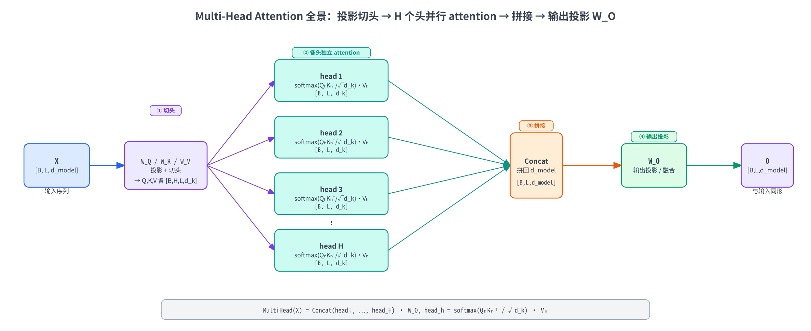
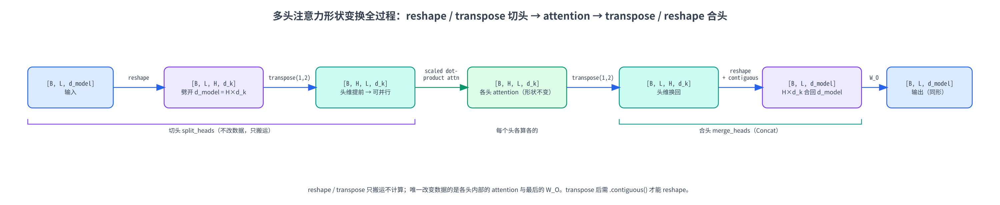
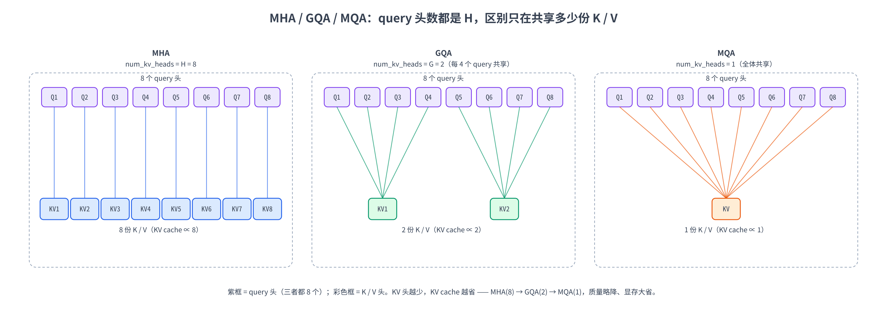

# 第七章：Multi-Head Attention 与 MQA / GQA

第 6 章我们把 Transformer 最核心的算子 **scaled dot-product attention** 从零搭完了：给定一个序列，每个位置作为 query 去和所有位置打分、缩放、softmax、加权求和，得到融合全局信息的新表示。那一章我们刻意只盯着**一个头**——把 batch 维 $B$ 和多头维 $H$ 都按下不表，只推一个 `[L, d_k]` 的序列。第 6 章结尾也提到：真实模型用的从来不是「一个头」，而是把这套运算**并排复制成很多份**。

这一章就把这个「很多份」讲透。我们要回答三个问题：

- **为什么要分头？** 一个头只能学一种「关注模式」，多头让模型在多个**子空间**里同时关注不同的关系（语法、指代、远近……）——而且代价几乎是免费的。
- **分头怎么落到形状变换上？** 这是本章的主线：输入从 `[B, L, d_model]` 出发，经历 **reshape → transpose → 各头独立做 attention → transpose → reshape → 输出投影**，最后又变回 `[B, L, d_model]`。这一连串 `[B, L, d_model] → [B, L, H, d_k] → [B, H, L, d_k] → …` 的形状变换，必须每一步都标注清楚。
- **MQA / GQA 又是什么？** 当模型要做**自回归推理**时，多头注意力的 K / V 会被缓存下来（KV cache），头越多缓存越大。**MQA**（多查询注意力）让所有 query 头共享一份 K / V，**GQA**（分组查询注意力）则是分组共享——这是 LLaMA、Qwen 这些现代大模型的标配，本章会把三者的形状差异画清楚。

实战部分我们**全程 CPU、纯 PyTorch**：先复现第 6 章的单头函数，再从零搭一个 `MultiHeadAttention` 模块、和 PyTorch 官方的 `nn.MultiheadAttention` 对齐验证，可视化「不同头学到不同的注意力模式」，接着把它改造成 **GQA**，最后读一份真实的 **Qwen3-8B config**，看它的 32 个 query 头是怎么配 8 个 KV 头的。

> 想直接跑示例？点这里 [](https://colab.research.google.com/github/weiqiangnd/LearningLLM/blob/main/src/07.ipynb)。
>
> **硬件门槛**：概念章，CPU 即可 ✅。本章只在长度 ≤ 8、维度 ≤ 64 的玩具张量上做矩阵乘法，读 Qwen3 config 也只下载一个几 KB 的 json，Colab 免费 CPU 运行时秒级跑完，**不需要 GPU**。

## 目录

- [一、为什么单头不够：多头注意力的动机](#一为什么单头不够多头注意力的动机)
  - [1.1 回顾：一个「头」算出了什么](#11-回顾一个头算出了什么)
  - [1.2 单头的局限：一次只盯一种关系](#12-单头的局限一次只盯一种关系)
  - [1.3 多头的主意：拆成多个子空间各看各的](#13-多头的主意拆成多个子空间各看各的)
- [二、Multi-Head Attention 的机制](#二multi-head-attention-的机制)
  - [2.1 分头：把 d_model 切成 H 份](#21-分头把-d_model-切成-h-份)
  - [2.2 每个头独立做一遍 scaled dot-product attention](#22-每个头独立做一遍-scaled-dot-product-attention)
  - [2.3 拼接 + 输出投影 W_O](#23-拼接--输出投影-w_o)
  - [2.4 完整公式与一张全景图](#24-完整公式与一张全景图)
- [三、形状变换全过程（本章主线）](#三形状变换全过程本章主线)
  - [3.1 切头：reshape 再 transpose](#31-切头reshape-再-transpose)
  - [3.2 算完再拼回去：transpose 再 reshape](#32-算完再拼回去transpose-再-reshape)
  - [3.3 一个最小数值例子：手追一遍形状](#33-一个最小数值例子手追一遍形状)
- [四、参数量与计算量：多头其实没有额外的成本](#四参数量与计算量多头其实没有额外的成本)
  - [4.1 多头和一个大头的参数量几乎一样](#41-多头和一个大头的参数量几乎一样)
  - [4.2 那为什么不干脆用一个大头](#42-那为什么不干脆用一个大头)
- [五、MQA 与 GQA：为省 KV cache 而生](#五mqa-与-gqa为省-kv-cache-而生)
  - [5.1 推理瓶颈：KV cache 会撑爆显存](#51-推理瓶颈kv-cache-会撑爆显存)
  - [5.2 MQA：所有 query 头共享一份 K / V](#52-mqa所有-query-头共享一份-k--v)
  - [5.3 GQA：分组共享，MHA 与 MQA 的折中](#53-gqa分组共享mha-与-mqa-的折中)
  - [5.4 三者对比与形状变化](#54-三者对比与形状变化)
- [六、几个常见疑问](#六几个常见疑问)
- [七、实战：从零实现多头注意力与 GQA](#七实战从零实现多头注意力与-gqa)
  - [7.1 环境自检与依赖](#71-环境自检与依赖)
  - [7.2 复现第 6 章的单头函数](#72-复现第-6-章的单头函数)
  - [7.3 从零实现 MultiHeadAttention](#73-从零实现-multiheadattention)
  - [7.4 验证：和 PyTorch 官方实现对齐](#74-验证和-pytorch-官方实现对齐)
  - [7.5 看见多头：不同头学到不同的关注模式](#75-看见多头不同头学到不同的关注模式)
  - [7.6 从 MHA 到 GQA：query 头分组共享 K / V](#76-从-mha-到-gqaquery-头分组共享-k--v)
  - [7.7 读 Qwen3 config：真实模型的头怎么配](#77-读-qwen3-config真实模型的头怎么配)
- [八、关键概念回顾](#八关键概念回顾)
- [九、本章小结](#九本章小结)

---

## 一、为什么单头不够：多头注意力的动机

### 1.1 回顾：一个「头」算出了什么

先把第 6 章的结论压缩成一句话，作为本章的起点。给定输入序列 $X \in \mathbb{R}^{L \times d}$ （ $L$ 个 token、每个 $d$ 维），一个注意力头干的事是：

$$
\text{Attention}(Q, K, V) = \text{softmax}\left( \frac{Q K^\top}{\sqrt{d_k}} \right) V, \qquad Q = X W_Q,\ K = X W_K,\ V = X W_V
$$

它把 $X$ 投影成 Query / Key / Value 三份，用点积打分、缩放、逐行 softmax 得到一个 $[\thinspace L, L\thinspace ]$ 的注意力权重矩阵 $A$ ，再用 $A$ 去加权 $V$ ，输出还是 $L$ 个向量、每个 $d_v$ 维。整条链路 $X \to Q,K,V \to A \to O$ 全是矩阵乘加一个 softmax，天然可并行。

这里有个关键点要记住：**一个头只产出一个注意力权重矩阵 $A$** 。也就是说，对于「token $i$ 该关注 token $j$ 多少」这件事，单头只给出**一种**答案。

### 1.2 单头的局限：一次只盯一种关系

问题就出在「只有一种答案」上。语言里 token 之间的关系**根本不止一种**。还是第 6 章那句「**动物没过马路，因为它太累了**」，「它」这个位置至少同时牵扯几种关系：

- **指代关系**：「它」指向「动物」——这是要重点关注的；
- **句法关系**：「它」是「累」这个谓语的主语——也得关注「累」；
- **就近关系**：「它」紧跟在「因为」后面，局部搭配也有信息。

一个头、一个 $A$ 矩阵，逼着模型把这几种关系**揉成一个权重分布**——要么顾此失彼，要么折中得谁都不突出。更糟的是，softmax 加权求和本质是个**平均**操作：把多种该被分别强调的信息平均到一起，细节就被抹平了。第 6 章 Q4 提过「输出是 value 的凸组合」，凸组合就是加权平均——被平均到一起的信息越多，各自的细节就越被抹平。

> 一个直观类比：让你用**一支**记号笔在一篇文章上划重点，你只能划一种颜色——指代、句法、近邻全用同一支笔，最后满篇一个色，分不清哪条线索是哪条。要是给你**红黄蓝**好几支笔，各划各的线索，一眼就能分层看清。多头注意力就是把「一支笔」换成「一把彩笔」。

### 1.3 多头的主意：拆成多个子空间各看各的

解法很自然：**别让一个头包打天下，并排放好几个头，每个头学一种关注模式**。这就是 **Multi-Head Attention（多头注意力，简称 MHA）**。

但直接把整套 attention 复制 $H$ 份、每份都在完整的 $d$ 维上算，会让参数量和计算量都翻 $H$ 倍——太贵。《Attention Is All You Need》给的办法既省又巧：**把 $d$ 维特征切成 $H$ 段，每段 $d_k = d / H$ 维，每个头只在自己那一段子空间里做 attention**。于是：

- 每个头看的是**输入的一个低维投影**（一个 $d_k$ 维子空间），相当于「只盯着特征的一部分」去算注意力；
- $H$ 个头各自独立地打分、softmax、加权求和，产出 $H$ 个**互不相同**的注意力权重矩阵——头 1 可以专管指代、头 2 专管句法，互不干扰；
- 算完把 $H$ 个头的输出**拼回 $d$ 维**，再过一个线性层融合。

因为每个头只在 $d_k = d/H$ 维上算， $H$ 个头加起来的计算量**和一个 $d$ 维的大头基本持平**（第 4 节会算这笔账）——多头几乎是「免费」换来了「能同时关注多种关系」的表达能力。下一节就把这套机制一步步拆开。

---

## 二、Multi-Head Attention 的机制

### 2.1 分头：把 d_model 切成 H 份

先约定记号。从这一章起我们用 $d_{\text{model}}$ 表示模型的主干维度（每个 token 的向量维度，也就是第 6 章那个 $d$ ），用 $H$ 表示头数，每个头的维度记作

$$
d_k = \frac{d_{\text{model}}}{H}
$$

这里要求 $d_{\text{model}}$ 能被 $H$ 整除（实践中总是成立，比如 $d_{\text{model}} = 4096$ 、 $H = 32$ ，则 $d_k = 128$ ）。

接着是投影。**概念上**，每个头有自己的一套投影矩阵 $W_Q^h, W_K^h, W_V^h \in \mathbb{R}^{d_{\text{model}} \times d_k}$ （ $h = 1, \dots, H$ ），把输入 $X$ 投影成这个头专属的 $Q_h, K_h, V_h \in \mathbb{R}^{L \times d_k}$ ：

$$
Q_h = X W_Q^h, \qquad K_h = X W_K^h, \qquad V_h = X W_V^h
$$

**工程上**则不会真的存 $H$ 套小矩阵。把 $H$ 个 $W_Q^h$ 在列方向拼起来，正好是一个大矩阵 $W_Q \in \mathbb{R}^{d_{\text{model}} \times d_{\text{model}}}$ （因为 $H \times d_k = d_{\text{model}}$ ）；一次 $X W_Q$ 就把所有头的 query 都算出来了，得到 $[\thinspace L, d_{\text{model}}\thinspace ]$ ，再**切成 $H$ 段**就是各头的 $Q_h$ 。K、V 同理。这就是为什么代码里只有 `W_Q / W_K / W_V` 三个 `nn.Linear(d_model, d_model)`，而不是 $3H$ 个小层——「分头」是靠一次 reshape 切出来的，不是靠多个矩阵。

### 2.2 每个头独立做一遍 scaled dot-product attention

切出 $Q_h, K_h, V_h$ 后，**每个头就是一次第 6 章那样的 scaled dot-product attention**，原封不动：

$$
\text{head}_h = \text{softmax}\left( \frac{Q_h K_h^\top}{\sqrt{d_k}} \right) V_h \in \mathbb{R}^{L \times d_k}
$$

注意缩放因子是 $\sqrt{d_k}$ ——是**每个头的**维度 $d_k$ ，不是 $d_{\text{model}}$ 。这正是第 6 章第 3.2 节那个论证的延续：每个头的点积在 $d_k$ 维上做，方差是 $d_k$ ，所以除以 $\sqrt{d_k}$ 把标准差拉回 1。

关键在于 $H$ 个头**彼此独立、可并行**：它们的 $Q_h K_h^\top$ 互不影响，可以塞进同一个批量矩阵乘里一次算完（实战中靠把 $H$ 当成一个 batch 维实现）。每个头产出一个 $[\thinspace L, L\thinspace ]$ 的注意力矩阵和一个 $[\thinspace L, d_k\thinspace ]$ 的输出—— $H$ 个头就是 $H$ 个不同的「关注视角」。

### 2.3 拼接 + 输出投影 W_O

$H$ 个头各自吐出一个 $[\thinspace L, d_k\thinspace ]$ 的输出，怎么合回去？两步：

**第一步：拼接（concat）。** 把 $H$ 个 $\text{head}\_h$ 沿特征维**横着拼起来**，恰好拼回 $d_{\text{model}}$ 维：

$$
\text{Concat}(\text{head}_1, \dots, \text{head}_H) \in \mathbb{R}^{L \times d_{\text{model}}} \qquad (H \times d_k = d_{\text{model}})
$$

**第二步：输出投影。** 拼接只是把各头的结果**摆在一起**，还没让它们「交流」。再过一个可学习的线性层 $W_O \in \mathbb{R}^{d_{\text{model}} \times d_{\text{model}}}$ 把它们融合：

$$
\text{MultiHead}(X) = \text{Concat}(\text{head}_1, \dots, \text{head}_H)\thinspace W_O \in \mathbb{R}^{L \times d_{\text{model}}}
$$

$W_O$ 这一步常被初学者忽略，但它不可省：拼接后的向量前 $d_k$ 维来自头 1、接着 $d_k$ 维来自头 2……各头信息还彼此隔离着， $W_O$ 负责把「各头视角」线性地混合成一个统一表示。少了它，多头就只是几个头的输出生硬地并列，没有整合。

注意输出形状是 $[\thinspace L, d_{\text{model}}\thinspace ]$ ——**和输入 $X$ 一模一样**。这点很重要：多头注意力是个「形状守恒」的模块，输入 $L$ 个 $d_{\text{model}}$ 维向量、输出还是 $L$ 个 $d_{\text{model}}$ 维向量，所以才能一层层堆叠成深层 Transformer。

### 2.4 完整公式与一张全景图

把整套流程串起来：

$$
\text{MultiHead}(X) = \text{Concat}(\text{head}_1, \dots, \text{head}_H)\thinspace W_O, \qquad \text{head}_h = \text{softmax}\left( \frac{Q_h K_h^\top}{\sqrt{d_k}} \right) V_h
$$

四步一目了然：**①投影并切头**（ $X \to Q_h, K_h, V_h$ ）→ **②各头独立 attention**（得到 $H$ 个 $\text{head}\_h$ ）→ **③拼接**（拼回 $d_{\text{model}}$ ）→ **④输出投影**（过 $W_O$ ）。下面这张全景图把它画了出来，注意三条主线：输入分叉成 $H$ 个头、每个头内部是一套完整的第 6 章 attention、最后 concat 再过 $W_O$ 收束回去：



机制讲清了，但「切头」「拼回」这两步具体怎么在张量上操作？这就是本章的主线——形状变换。

---

## 三、形状变换全过程（本章主线）

真实代码里张量永远带着 batch 维 $B$ （一次喂 $B$ 句话）。所以多头注意力的输入是 $[\thinspace B, L, d_{\text{model}}\thinspace ]$ 。这一节把从输入到输出的每一次 reshape / transpose 都标注出来——**这是写对多头注意力代码的命门**，错一个维度顺序结果就全错。

### 3.1 切头：reshape 再 transpose

从输入 $X$ 到「可以并行做 attention 的各头 Q / K / V」，要走两小步：

**第①步：大投影。** 一次 `nn.Linear(d_model, d_model)` 把 $X$ 投影成 Q（K、V 同理），形状不变：

```
X          : [B, L, d_model]
Q = X·W_Q  : [B, L, d_model]      # 所有头的 query 挤在最后这一维里
```

**第②步：切头（reshape）。** 最后那个 $d_{\text{model}}$ 维其实是 $H$ 个头**首尾相接**摆着的（前 $d_k$ 维属头 1，接着 $d_k$ 维属头 2……）。把它**劈成两维** $H \times d_k$ ：

```
Q : [B, L, d_model]  --reshape-->  [B, L, H, d_k]      # d_model = H × d_k，劈开
```

reshape 只是「重新解释」这块连续内存，不动数据，所以能正确地把「第 $h$ 段」对应到「第 $h$ 个头」。

**第③步：把头维提前（transpose）。** 现在形状是 `[B, L, H, d_k]`，但我们想让**每个头独立地在 `[L, d_k]` 上做 attention**，需要把头维 $H$ 挪到 $L$ 前面，让最后两维正好是 `[L, d_k]`：

```
Q : [B, L, H, d_k]  --transpose(1,2)-->  [B, H, L, d_k]
```

为什么非要 transpose？因为第 6 章的 attention 是在**最后两维** `[L, d_k]` 上算的（`Q @ K.transpose(-2,-1)`），前面的维度全被 `@` 当作 batch 维自动并行。把形状摆成 `[B, H, L, d_k]` 后， $B$ 和 $H$ 就都成了 batch 维——**一次批量矩阵乘， $B \times H$ 个头全部并行算完**，这正是多头能高效跑的关键。

把三步连起来，这就是「切头」的标准形状变换，三种张量（Q/K/V）走的是同一条路：

$$
[\thinspace B, L, d_{\text{model}}\thinspace ] \xrightarrow{\text{reshape}} [\thinspace B, L, H, d_k\thinspace ] \xrightarrow{\text{transpose}(1,2)} [\thinspace B, H, L, d_k\thinspace ]
$$

### 3.2 算完再拼回去：transpose 再 reshape

各头在 `[B, H, L, d_k]` 上做完 scaled dot-product attention，输出形状还是 `[B, H, L, d_k]`（attention 不改变 $L$ 和 $d_k$ ）。现在要把 $H$ 个头**拼回** $d_{\text{model}}$ 维——正好是切头的逆操作，顺序也反过来：

**第①步：把头维换回去（transpose）。** 先把 $H$ 和 $L$ 换回来，恢复成「每个位置后面跟着它在各头的输出」的排布：

```
O : [B, H, L, d_k]  --transpose(1,2)-->  [B, L, H, d_k]
```

**第②步：拼接（reshape）。** 把最后两维 $H \times d_k$ 合并回 $d_{\text{model}}$ ——这就是数学公式里的 `Concat`：

```
O : [B, L, H, d_k]  --reshape-->  [B, L, d_model]      # H × d_k = d_model，拼回
```

> **一个必踩的工程坑**：`transpose` 之后张量在内存里**不再连续**（它只是改了维度的「步长」视图），直接 `reshape`（或 `.view`）会报错或拿到错乱的数据。标准写法是 `transpose(1, 2).contiguous().reshape(...)`，先用 `.contiguous()` 把数据按新维度顺序在内存里重排一遍；或者干脆用 `.reshape()`（它在必要时会自动 copy，比 `.view()` 稳）。实战 Cell 里会显式写出这一步。

**第③步：输出投影。** 最后过 $W_O$ ：

```
O : [B, L, d_model]  --W_O-->  [B, L, d_model]      # 融合各头，形状不变
```

整条「合头」链路：

$$
[\thinspace B, H, L, d_k\thinspace ] \xrightarrow{\text{transpose}(1,2)} [\thinspace B, L, H, d_k\thinspace ] \xrightarrow{\text{reshape}} [\thinspace B, L, d_{\text{model}}\thinspace ] \xrightarrow{W_O} [\thinspace B, L, d_{\text{model}}\thinspace ]
$$

下面这张图把「切头 → 并行 attention → 合头 → 投影」的形状变换从头到尾串了一遍，每个箭头上标着是 reshape 还是 transpose、维度怎么变——对着它写代码基本不会错：



### 3.3 一个最小数值例子：手追一遍形状

抽象的形状讲完，拿一个能在脑子里追的最小例子走一遍。取 $B = 1$ 、 $L = 2$ 、 $d_{\text{model}} = 4$ 、 $H = 2$ ，于是 $d_k = 4 / 2 = 2$ 。

假设大投影之后的 Q（所有头还合在一起）已经算好，形状是 `[B=1, L=2, d_model=4]`，去掉 batch 维看这个 `[2, 4]` 矩阵：

$$
Q = \begin{pmatrix} a_1 & a_2 & b_1 & b_2 \cr c_1 & c_2 & d_1 & d_2 \end{pmatrix}
$$

每一行是一个 token 的 4 维 query。**切头**就是把每行的前 2 维分给头 1、后 2 维分给头 2（reshape 到 `[2, 2, 2]` 即 `[L, H, d_k]`，再 transpose 到 `[H, L, d_k]`）：

$$
Q_{\text{head 1}} = \begin{pmatrix} a_1 & a_2 \cr c_1 & c_2 \end{pmatrix}, \qquad Q_{\text{head 2}} = \begin{pmatrix} b_1 & b_2 \cr d_1 & d_2 \end{pmatrix}
$$

看清楚了吗——**切头不做任何乘法，纯粹是把每个 token 的特征「分段」**：token 1 的 query 在头 1 里是 $(a_1, a_2)$ 、在头 2 里是 $(b_1, b_2)$ 。两个头各自在自己的 `[2, 2]` 上做第 6 章那套 attention，各得一个 `[2, 2]` 输出 $\text{head}_1, \text{head}_2$ 。**合头**就是把它们横着拼回每行 4 维：

$$
\text{Concat} = \begin{pmatrix} (\text{head}_1\ \text{第 1 行}) & (\text{head}_2\ \text{第 1 行}) \cr (\text{head}_1\ \text{第 2 行}) & (\text{head}_2\ \text{第 2 行}) \end{pmatrix} \in \mathbb{R}^{2 \times 4}
$$

再乘 $W_O \in \mathbb{R}^{4 \times 4}$ 得到最终 `[2, 4]` 输出——和输入 $Q$ 形状一致。整个过程里**唯一改变数据的是各头内部的 attention 和最后的 $W_O$ ，切头 / 合头本身只是搬运**。实战第 7.3 节会用 `torch` 把这套 reshape / transpose 一行行打印形状给你看。

---

## 四、参数量与计算量：多头其实没有额外的成本

### 4.1 多头和一个大头的参数量几乎一样

多头听起来「更复杂」，但它**不比单头贵多少**。来数一下参数。一个 $H$ 头注意力的可学习参数全在四个投影矩阵里：

| 矩阵 | 形状 | 参数量 |
|------|------|--------|
| $W_Q$ （所有头合起来） | $[\thinspace d_{\text{model}}, d_{\text{model}}\thinspace ]$ | $d_{\text{model}}^2$ |
| $W_K$ | $[\thinspace d_{\text{model}}, d_{\text{model}}\thinspace ]$ | $d_{\text{model}}^2$ |
| $W_V$ | $[\thinspace d_{\text{model}}, d_{\text{model}}\thinspace ]$ | $d_{\text{model}}^2$ |
| $W_O$ | $[\thinspace d_{\text{model}}, d_{\text{model}}\thinspace ]$ | $d_{\text{model}}^2$ |

合计 $4\thinspace d_{\text{model}}^2$ ——**和头数 $H$ 无关**！因为「分头」只是把那个 $d_{\text{model}} \times d_{\text{model}}$ 的大投影**切块**用，并没有增加矩阵尺寸。换句话说，2 个头和 32 个头，只要 $d_{\text{model}}$ 一样，QKV 投影的参数量分毫不差。

计算量同理。开销主要在 $Q K^\top$ 和 $A V$ 这两块矩阵乘上。单看 $Q K^\top$ ：单头（ $d_k = d_{\text{model}}$ ）要 $L^2 d_{\text{model}}$ 次乘加； $H$ 个头每个是 $L^2 d_k$ ，加起来 $H \cdot L^2 d_k = L^2 (H d_k) = L^2 d_{\text{model}}$ ——**完全相等**。多头把同样的计算量「分给」了 $H$ 个子空间，没有额外开销：QKVO 四个投影的计算量两者也一模一样（各 $O(L\thinspace d_{\text{model}}^2)$ ，和上面参数量那张表对得上， $W_O$ 在单头基线里同样存在、并非多头独有）。

这里要和第 6 章撇清一个容易混的点：**本节说的「单头 / 大头」专指 $H = 1$ 的情形**——不切分、让一个头独占整个 $d_{\text{model}}$ ，代入 $d_k = d_{\text{model}}/H$ 自然就得到 $d_k = d_{\text{model}}$ 。它是为了和「切成 $H$ 份」做**等预算对比**才这么设的临时基准。这跟第 6 章那个维度留作抽象、本就比 $d_{\text{model}}$ 小的「一个头」**不是同一个对象**：第 6 章的单头其实是未来多头里的某**一个**头，维度是 $d_k = d_{\text{model}}/H$ （第 6 章特意把 $B$ 、 $H$ 按下不表，所以没写死这个关系），而本节的「大头」是把那 $H$ 份重新并成一份的极端。两处都叫「单头」、但 $d_k$ 含义不同，别串了。

> 这就是多头设计最漂亮的地方：**几乎免费地**把「一种关注模式」升级成「 $H$ 种关注模式」——参数量和计算量都和一个大头持平，换来的却是表达能力的实质飞跃。

### 4.2 那为什么不干脆用一个大头

既然参数量、计算量都一样，为什么不用一个 $d_k = d_{\text{model}}$ 的大头，省去切来切去？《Attention Is All You Need》原文给了答案，核心就一句：**单个大头里的 softmax 加权求和是一种「平均」，会把不同子空间该分别强调的信息抹平**（第 1.2 节那个「一支笔 vs 一把彩笔」的直觉）。

拆开说，多头相对单个大头的优势有两点：

- **多个独立的注意力分布**。 $H$ 个头产出 $H$ 个**不同**的 $A$ 矩阵，模型能同时维护多套「谁该关注谁」的方案——头 1 盯指代、头 2 盯句法、头 3 盯就近……一个大头只有一个 $A$ ，被迫把这些揉成一个。
- **在不同子空间里看**。每个头先把输入投影到一个 $d_k$ 维子空间再算注意力，相当于「换个角度看数据」。不同头看不同子空间，捕捉的特征更丰富——后面第 7.5 节会把不同头明显不同的注意力图画出来，眼见为实。

代价是每个头的维度 $d_k$ 变小了（ $d_{\text{model}} / H$ ），单个头的「分辨率」下降。所以 $H$ 不是越大越好——头太多、每个头维度太小（比如 $d_k < 32$ ）反而学不好。实践中 $d_k$ 常取 64 或 128， $H$ 随 $d_{\text{model}}$ 等比例放大。

---

## 五、MQA 与 GQA：为省 KV cache 而生

到这里，标准多头注意力（MHA）就讲完了： $H$ 个 query 头，每个头配自己的一份 K 和 V。但现代大模型（LLaMA、Qwen 等）几乎都不用「纯 MHA」，而是用它的两个变体 **MQA** 或 **GQA**。原因不在训练，而在**推理**——具体说，在一个叫 **KV cache** 的东西上。

### 5.1 推理瓶颈：KV cache 会撑爆显存

先快速交代背景（KV cache 的完整原理是第 14 章的主题，这里只讲够用的）。语言模型做自回归生成时，是**一个一个 token 往外蹦**的：生成第 $t$ 个 token 要对前面 $1, \dots, t-1$ 个 token 做 attention。注意每生成一步，前面那些 token 的 K 和 V **是不变的**——没必要每步重算。于是工程上把它们**缓存**起来，这就是 KV cache：算过一次的 K、V 存着，下一步直接复用。

问题是这个 cache 很大。它要存**每一层、每个头、每个已生成位置**的 K 和 V，大小约为：

$$
\text{KV cache} \approx 2 \times L_{\text{layers}} \times H \times L_{\text{seq}} \times d_k \times (\text{每个数的字节数})
$$

那个 $2$ 是 K 和 V 各一份（这条算的是**单条序列**的占用，并发 $B$ 条请求时再整体乘以 $B$ ）。注意里头有个 $H$ ——**头越多，缓存越大**。对长上下文（ $L_{\text{seq}}$ 几万）、深层模型（几十层）来说，KV cache 动辄几个 GB，往往比模型权重还吃显存。更要命的是，自回归解码每生成一个 token 都要把整个 KV cache 从显存**读一遍**，所以瓶颈常常不是算力而是**显存带宽**——cache 越大、读得越慢，生成就越卡。

那能不能砍掉 KV cache 里的 $H$ ？这正是 MQA / GQA 的出发点：**让多个 query 头共享 K / V，从而少存几份 K / V**。注意被砍的是 **K / V 的头数**，query 头数 $H$ 不动（不然表达能力就掉了）。

### 5.2 MQA：所有 query 头共享一份 K / V

**MQA（Multi-Query Attention，多查询注意力）** 走到极端：**$H$ 个 query 头，但全体共享同一份 K 和 V**（K / V 只有 1 个头）。

具体说，Q 还是照常切成 $H$ 个头 $Q_1, \dots, Q_H$ ，但 K、V 只投影出**一份** $K, V \in \mathbb{R}^{L \times d_k}$ ，所有 query 头都拿这同一个 $K, V$ 去算：

$$
\text{head}_h = \text{softmax}\left( \frac{Q_h K^\top}{\sqrt{d_k}} \right) V, \qquad h = 1, \dots, H
$$

注意右边的 $K, V$ 没有下标 $h$ ——全场就这一份。这样 KV cache 里的 $H$ 直接变成 1，**缓存缩小到原来的 $1 / H$**。对 32 头的模型就是省 32 倍 KV cache，推理速度（受显存带宽限制那部分）大幅提升——不过这个「32 倍」是 MQA 这种极端共享才有的数字，实际大模型更常用下节那个折中方案。

代价是**表达能力下降**：K / V 不再有「多视角」，所有 query 头被迫在同一套 key/value 上找信息，模型质量通常会掉一点。MQA 出现得早（2019），省得狠但伤质量，所以后来有了折中方案。

### 5.3 GQA：分组共享，MHA 与 MQA 的折中

**GQA（Grouped-Query Attention，分组查询注意力）** 是 MHA 和 MQA 之间的滑杆。它把 $H$ 个 query 头分成 $G$ 组（ $G$ 整除 $H$ ），**每组内的 query 头共享一份 K / V**——也就是有 $G$ 份 K / V：

- $G = H$ ：每个 query 头独享一份 K / V —— 退化成 **MHA**；
- $G = 1$ ：所有 query 头共享一份 K / V —— 退化成 **MQA**；
- $1 < G < H$ ：折中，KV cache 缩小到 $G / H$ 。

记号上常把 K / V 的头数（也就是组数 $G$ ）叫 `num_key_value_heads`，query 头数 $H$ 叫 `num_attention_heads`。每个 KV 头被它那一组的 $H / G$ 个 query 头共用。计算时，把每份 K / V **复制（repeat）** $H / G$ 遍，「凑齐」 $H$ 份后就和普通 MHA 一样算了——所以 GQA 不改 attention 本身，只是 K / V 在喂进去之前被复制扩展了一下。

GQA 几乎是现在大模型的**默认选择**：LLaMA-2 70B、LLaMA-3 全系、Qwen2 / Qwen3 等都用它。典型配置是 $H = 32$ 个 query 头配 $G = 8$ 个 KV 头（每 4 个 query 头共享一份 K / V），KV cache 直接砍到 $1/4$ ，质量却几乎和满血 MHA 持平——省显存和保质量之间一个很甜的点。

### 5.4 三者对比与形状变化

把 MHA / GQA / MQA 摆一起，差别只在 **K / V 的头数**（query 头数 $H$ 三者都一样）：

| | query 头数 | K / V 头数 | KV cache | 表达能力 | 代表 |
|---|---|---|---|---|---|
| **MHA** | $H$ | $H$ | 基准（最大） | 最强 | 原版 Transformer、GPT-2 |
| **GQA** | $H$ | $G$ （ $1 < G < H$ ） | 基准 $\times G/H$ | 接近 MHA | LLaMA-2/3、Qwen2/3 |
| **MQA** | $H$ | $1$ | 基准 $\times 1/H$ （最小） | 略降 | PaLM、早期推理优化模型 |

落到张量形状上，区别就一处——K / V 的头维。设 query 头数 $H$ 、KV 头数 $G$ ：

```
Q : [B, H, L, d_k]      # query 永远是 H 个头
K : [B, G, L, d_k]      # MHA: G=H；GQA: 1<G<H；MQA: G=1
V : [B, G, L, d_k]
```

算 attention 前，把 K / V 沿头维各**复制** $H/G$ 遍，扩成 `[B, H, L, d_k]`，之后就和 MHA 一字不差。下面这张图把三者的「query 头 ↔ KV 头」连线画了出来——MHA 一对一、GQA 多对一（分组）、MQA 全体对一（图里为看得清用了 8 个 query 头、GQA 取 $G = 2$ 作示意，真实模型的典型值是上文的 $H = 32$ / $G = 8$ ）：



---

## 六、几个常见疑问

**Q1：多头的「头」之间会交流吗？**
在 attention 内部**不会**—— $H$ 个头完全独立地各算各的，谁也看不见谁。它们唯一的「交流」发生在最后的 $W_O$ ：拼接后过 $W_O$ 时，各头的输出被线性地混合到一起。所以说 $W_O$ 不只是「形状对齐」，它承担了「整合多头」的职责。

**Q2：每个头一定要等维度（都是 $d_k = d_{\text{model}}/H$ ）吗？**
标准 MHA 里是的，等分最简单也最常用。原则上可以不等分，但几乎没人这么做——等分能用一次 reshape 干净地切头，工程上最省事。 $d_v$ 理论上可以和 $d_k$ 不同，但实践中也总取相等。

**Q3：GQA 把 K / V 复制 $H/G$ 遍，不是又把显存吃回去了吗？**
不会。省的是 **KV cache**（存在显存里、跨多步复用的那份），它只存 $G$ 份。复制是在每次 attention 计算时**临时**展开成 $H$ 份参与运算，算完即弃，不进 cache。所以 cache 占用按 $G$ 算、计算按 $H$ 算，省显存的目的达到了。（实现上甚至可以用广播避免真的物理复制，更省。）

**Q4：MQA / GQA 是训练时就这么设计，还是训练完再改？**
绝大多数是**训练时就这么设计**（K / V 投影直接就只有 $G$ 个头那么宽）。也有一种「**uptraining**」做法：把已经训好的 MHA 模型，通过对 K / V 头做平均池化合并、再少量继续训练，转成 GQA——GQA 原始论文就提出了这种把现成 MHA 模型低成本改造成 GQA 的路子。

**Q5：头数 $H$ 怎么选？**
经验法则是让每个头维度 $d_k$ 落在 64 ~ 128：太小（ $< 32$ ）单头分辨率不够、学不好，太大则头数太少、丧失多视角的好处。所以 $H$ 基本是 $d_{\text{model}} / 128$ 这个量级，随模型变大而变多（ $d_{\text{model}} = 4096$ 时 $H = 32$ ）。KV 头数 $G$ 则常取 4 或 8。

---

## 七、实战：从零实现多头注意力与 GQA

这一节**全程 CPU、纯 PyTorch**，路线是：复现第 6 章单头函数 → 从零搭 `MultiHeadAttention`（重点看 reshape / transpose 形状变换）→ 和 PyTorch 官方实现对齐验证 → 画出不同头的注意力图 → 改造成 GQA → 读真实 Qwen3 config。

> 下面给出本章全部可运行代码（**Cell 0 ~ Cell 7**），逐个 cell 讲解；你既可以照着这里一段段读，也可以从本章顶部的 Open in Colab 直链（这些 cell 的可运行副本）直接 Run All。全程 CPU、秒级跑完。

### 7.1 环境自检与依赖

**Cell 0** 是常规环境自检。本章用不到 GPU，CPU 即可：

```python
# ============================================================
# Cell 0: 环境自检（本章纯 CPU 即可，无需 GPU）
# ============================================================
# 本章只在长度 ≤ 8、维度 ≤ 64 的玩具张量上做矩阵乘法，全程 CPU 秒级跑完，
# 读 Qwen3 config 也只下载几 KB 的 json，所以不强制 GPU，只打印环境信息确认可用。
import sys, platform
import torch

print("Python:", sys.version.split()[0])
print("平台:", platform.platform())
print("PyTorch:", torch.__version__)
print("CUDA 可用:", torch.cuda.is_available(), "（本章用不到，CPU 即可）")
```

**Cell 1** 装依赖。本章额外用到 `matplotlib`（画多头注意力热力图）和 `transformers`（第 7.7 节读 Qwen3 config）：

```python
%%capture
# ============================================================
# Cell 1: 安装依赖
# ============================================================
# %%capture 必须是 cell 第一行，把 pip 安装日志藏起来。
# torch:        张量运算 + F.scaled_dot_product_attention——Colab 默认已装且够新，
#               故意【不】加 -U：会话中途升级 torch 容易让内核半新半旧后续 import 报错。
# matplotlib:   画多头注意力权重热力图（不同头不同模式）。
# transformers: 第 7.7 节用 AutoConfig 读 Qwen3-8B 的 config（num_attention_heads 等）。
#               Qwen3 系列要求 transformers>=4.51，这里锁定版本下界。
!pip install -q -U matplotlib "transformers>=4.51"
```

### 7.2 复现第 6 章的单头函数

**Cell 2** 把第 6 章的 `scaled_dot_product_attention` 原样搬过来——本章每个头内部还是这套运算，多头无非是把它批量跑 $H$ 份。函数支持任意前置维（`...`），所以 `[B, H, L, d_k]` 直接喂进去就能把 $B$ 和 $H$ 当 batch 维并行：

```python
# ============================================================
# Cell 2: 复现第 6 章的单头 scaled dot-product attention
# ============================================================
# Q,K,V 形状 [..., L, d_k]，前置维 ... 可以是 batch B、也可以是 (B, H) 多头——
# 全靠 @ 的广播和 transpose(-2,-1) 只动最后两维，自动把前置维当 batch 并行。
import torch
import torch.nn.functional as F

def scaled_dot_product_attention(Q, K, V, mask=None):
    """缩放点积注意力。Attention(Q,K,V) = softmax(QKᵀ / √d_k + mask) V
    参数:
      Q, K, V : [..., L, d_k]（这里取 d_v = d_k）
      mask    : 可选，可广播到 [..., L, L] 的布尔张量，True 表示该位置【要屏蔽】
    返回:
      out  : [..., L, d_k]   注意力输出
      attn : [..., L, L]     注意力权重（已 softmax，便于可视化）
    """
    d_k = Q.size(-1)
    scores = Q @ K.transpose(-2, -1) / (d_k ** 0.5)      # ①QKᵀ ②缩放 -> [..., L, L]
    if mask is not None:
        scores = scores.masked_fill(mask, float("-inf"))  # 要屏蔽的位置打 -inf
    attn = F.softmax(scores, dim=-1)                      # ③逐行 softmax -> 权重
    out = attn @ V                                        # ④加权求和 -> [..., L, d_k]
    return out, attn

# 快速自测：带 (B, H) 两个前置维也能跑
Q = torch.randn(2, 4, 6, 16)   # [B=2, H=4, L=6, d_k=16]
out, attn = scaled_dot_product_attention(Q, Q, Q)
print("输入 [B,H,L,d_k]:", tuple(Q.shape))
print("输出 out :", tuple(out.shape), "  attn:", tuple(attn.shape))
print("→ B 和 H 都被当成 batch 维自动并行，最后两维 [L,d_k] 上做 attention")
```

### 7.3 从零实现 MultiHeadAttention

**Cell 3** 是本章主角。把第 2、3 节的机制和形状变换落成一个 `nn.Module`，**每一步 reshape / transpose 都打印形状**，对照第 3.1 / 3.2 节的箭头图看：

```python
# ============================================================
# Cell 3: 从零实现 MultiHeadAttention（对应第 2、3 节）—— 重点看形状变换
# ============================================================
import torch.nn as nn

class MultiHeadAttention(nn.Module):
    """标准多头注意力。X: [B, L, d_model] -> [B, L, d_model]（形状守恒）。"""
    def __init__(self, d_model, num_heads):
        super().__init__()
        assert d_model % num_heads == 0, "d_model 必须能被 num_heads 整除"
        self.d_model = d_model
        self.H = num_heads
        self.d_k = d_model // num_heads           # 每个头的维度
        # 四个投影：W_Q/W_K/W_V 把 d_model 投到 d_model（= 所有头合在一起），W_O 融合
        self.W_Q = nn.Linear(d_model, d_model, bias=False)
        self.W_K = nn.Linear(d_model, d_model, bias=False)
        self.W_V = nn.Linear(d_model, d_model, bias=False)
        self.W_O = nn.Linear(d_model, d_model, bias=False)

    def split_heads(self, x):
        # [B, L, d_model] --reshape--> [B, L, H, d_k] --transpose--> [B, H, L, d_k]
        B, L, _ = x.shape
        x = x.reshape(B, L, self.H, self.d_k)     # 切头：把 d_model 劈成 H × d_k
        return x.transpose(1, 2)                   # 头维提前，最后两维变 [L, d_k]

    def merge_heads(self, x):
        # [B, H, L, d_k] --transpose--> [B, L, H, d_k] --reshape--> [B, L, d_model]
        B, H, L, d_k = x.shape
        x = x.transpose(1, 2).contiguous()         # 换回 [B, L, H, d_k]（contiguous 后才能 reshape）
        return x.reshape(B, L, H * d_k)            # 拼接：H × d_k 合回 d_model

    def forward(self, X, causal=False, verbose=False):
        B, L, _ = X.shape
        Q = self.split_heads(self.W_Q(X))          # [B, H, L, d_k]
        K = self.split_heads(self.W_K(X))
        V = self.split_heads(self.W_V(X))
        if verbose:
            print(f"  输入 X            : {tuple(X.shape)}  [B, L, d_model]")
            print(f"  投影+切头后 Q     : {tuple(Q.shape)}  [B, H, L, d_k]")
        mask = None
        if causal:                                  # causal mask，[L,L] 自动广播到 [B,H,L,L]
            mask = torch.triu(torch.ones(L, L, dtype=torch.bool, device=X.device), diagonal=1)
        heads, attn = scaled_dot_product_attention(Q, K, V, mask=mask)  # [B,H,L,d_k], [B,H,L,L]
        merged = self.merge_heads(heads)            # 合头 -> [B, L, d_model]
        out = self.W_O(merged)                      # 输出投影，融合各头
        if verbose:
            print(f"  各头 attention 后 : {tuple(heads.shape)}  [B, H, L, d_k]")
            print(f"  合头后            : {tuple(merged.shape)}  [B, L, d_model]")
            print(f"  过 W_O 输出 out   : {tuple(out.shape)}  [B, L, d_model]（与输入同形）")
        return out, attn

torch.manual_seed(0)
B, L, d_model, H = 1, 5, 32, 4
mha = MultiHeadAttention(d_model, H)
X = torch.randn(B, L, d_model)
out, attn = mha(X, causal=True, verbose=True)
print("注意力权重 attn 形状:", tuple(attn.shape), " [B, H, L, L]——每个头一个 L×L 矩阵")
```

**预期现象**：打印出形状一路从 `[1, 5, 32]` → 切头 `[1, 4, 5, 8]`（4 个头、每头 8 维）→ attention 后还是 `[1, 4, 5, 8]` → 合头 `[1, 5, 32]` → 输出 `[1, 5, 32]`，和输入同形。`attn` 是 `[1, 4, 5, 5]`——**4 个头各有一个 5×5 注意力矩阵**，这正是多头的核心：一次产出 $H$ 个独立的注意力分布。

### 7.4 验证：和 PyTorch 官方实现对齐

**Cell 4** 用 PyTorch 内置的 `nn.MultiheadAttention` 交叉验证。官方实现把 Q/K/V/O 四个投影打包在一起，我们把它的权重**拆出来灌进自己的模块**，再比对输出是否数值一致：

```python
# ============================================================
# Cell 4: 和 PyTorch 官方 nn.MultiheadAttention 对齐（对应第 2 节）
# ============================================================
# nn.MultiheadAttention 把 W_Q/W_K/W_V 打包成一个 in_proj_weight（按行堆叠），
# W_O 是 out_proj。我们把这些权重搬进自己的 MHA，相同输入应得到相同输出。
torch.manual_seed(0)
B, L, d_model, H = 2, 6, 32, 4
X = torch.randn(B, L, d_model)

ref = nn.MultiheadAttention(d_model, H, bias=False, batch_first=True)  # 官方实现
mine = MultiHeadAttention(d_model, H)

# 把官方的 in_proj_weight [3*d_model, d_model] 按 Q/K/V 三段拆开，灌进我们的三个 W
Wq, Wk, Wv = ref.in_proj_weight.chunk(3, dim=0)
with torch.no_grad():
    mine.W_Q.weight.copy_(Wq)
    mine.W_K.weight.copy_(Wk)
    mine.W_V.weight.copy_(Wv)
    mine.W_O.weight.copy_(ref.out_proj.weight)

out_mine, _ = mine(X, causal=False)
out_ref, _ = ref(X, X, X, need_weights=False)   # 自注意力：query=key=value=X

print("我们的输出形状:", tuple(out_mine.shape))
print("官方输出形状  :", tuple(out_ref.shape))
print("最大绝对误差  :", (out_mine - out_ref).abs().max().item())
assert torch.allclose(out_mine, out_ref, atol=1e-5), "与官方实现不一致！"
print("✅ 通过：手写多头注意力与 PyTorch 官方一致")
```

**预期现象**：两者输出都是 `[2, 6, 32]`，最大绝对误差在 $10^{-6}$ 量级（纯浮点舍入），`assert` 通过。这说明我们对「切头 → 各头 attention → 合头」再过 $W_O$ 的实现和官方完全等价。

### 7.5 看见多头：不同头学到不同的关注模式

**Cell 5** 把多个头的注意力矩阵画成热力图，直观感受「不同头关注不同位置」。这里用一个**随机初始化**的多头注意力——还没训练，但因为每个头的投影权重各不相同， $H$ 个头已经会产出**彼此不同**的注意力分布（训练之后这种分化才会变成有意义的专门化：有的头专管指代、有的专管句法）：

```python
# ============================================================
# Cell 5: 可视化——不同头学到不同的注意力模式（对应第 1.3、4.2 节）
# ============================================================
import matplotlib.pyplot as plt

torch.manual_seed(3)
B, L, d_model, H = 1, 8, 32, 4
X = torch.randn(B, L, d_model)
mha = MultiHeadAttention(d_model, H)
_, attn = mha(X, causal=True)        # [1, 4, 8, 8]，4 个头各一个 8×8 下三角注意力矩阵

fig, axes = plt.subplots(1, H, figsize=(4 * H, 3.6))
for h in range(H):
    ax = axes[h]
    im = ax.imshow(attn[0, h].detach().numpy(), cmap="viridis", vmin=0, vmax=1)
    ax.set_title(f"head {h + 1}")
    ax.set_xlabel("key j"); ax.set_ylabel("query i")
fig.colorbar(im, ax=axes, fraction=0.02, label="attention weight")
fig.suptitle("Different heads, different attention patterns (causal)")
plt.show()
print("→ 4 个头都是下三角（causal），但每个头把注意力压在不同的 key 上：")
print("  这是随机初始化、还没训练的头，可彼此的分布已经明显不一样——")
print("  这就是多头的价值：同一序列被多套独立的注意力分布同时审视。")
```

**预期现象**：4 张热力图都是下三角（causal mask 生效），但**亮格分布各不相同**——4 个头各自把权重压在不同的 key 上，没有哪两张图样是一样的。注意这是**随机初始化、未经训练**的头，所以别指望它们已经长出「专盯对角线」「回看开头」这种干净的语义模式；这里要看的只是一点：哪怕权重是随机的， $H$ 个头也已经是 $H$ 套**互相独立**的注意力分布了。这就把第 4.2 节「多头 = 多个独立注意力分布」从文字变成了可见的图。

### 7.6 从 MHA 到 GQA：query 头分组共享 K / V

**Cell 6** 把 `MultiHeadAttention` 改造成 **GQA**：query 还是 $H$ 头，但 K / V 只有 $G$ 头（`num_kv_heads`），算之前用 `repeat_interleave` 把每份 K / V 复制 $H/G$ 遍凑齐 $H$ 份。当 $G = H$ 时它就是 MHA；当 $G = 1$ 时就是 MQA：

```python
# ============================================================
# Cell 6: 从零实现 GQA——query H 头，K/V 只 G 头，复制后参与计算（对应第 5 节）
# ============================================================
class GroupedQueryAttention(nn.Module):
    """GQA：num_heads 个 query 头，num_kv_heads 个 K/V 头（整除 num_heads）。
    num_kv_heads == num_heads -> MHA；num_kv_heads == 1 -> MQA。"""
    def __init__(self, d_model, num_heads, num_kv_heads):
        super().__init__()
        assert num_heads % num_kv_heads == 0, "query 头数须能被 KV 头数整除"
        self.H, self.G = num_heads, num_kv_heads
        self.d_k = d_model // num_heads
        self.rep = num_heads // num_kv_heads          # 每份 K/V 要复制几遍
        self.W_Q = nn.Linear(d_model, num_heads * self.d_k, bias=False)     # 投出 H 个 query 头
        self.W_K = nn.Linear(d_model, num_kv_heads * self.d_k, bias=False)  # 只投 G 个 K 头
        self.W_V = nn.Linear(d_model, num_kv_heads * self.d_k, bias=False)  # 只投 G 个 V 头
        self.W_O = nn.Linear(num_heads * self.d_k, d_model, bias=False)

    def forward(self, X, causal=False):
        B, L, _ = X.shape
        Q = self.W_Q(X).reshape(B, L, self.H, self.d_k).transpose(1, 2)  # [B, H, L, d_k]
        K = self.W_K(X).reshape(B, L, self.G, self.d_k).transpose(1, 2)  # [B, G, L, d_k]
        V = self.W_V(X).reshape(B, L, self.G, self.d_k).transpose(1, 2)  # [B, G, L, d_k]
        # 关键：把 G 个 KV 头沿头维各复制 rep 遍，扩成 H 个，之后就和 MHA 一样
        K = K.repeat_interleave(self.rep, dim=1)                          # [B, H, L, d_k]
        V = V.repeat_interleave(self.rep, dim=1)                          # [B, H, L, d_k]
        mask = torch.triu(torch.ones(L, L, dtype=torch.bool), diagonal=1) if causal else None
        heads, _ = scaled_dot_product_attention(Q, K, V, mask=mask)      # [B, H, L, d_k]
        out = heads.transpose(1, 2).contiguous().reshape(B, L, self.H * self.d_k)
        return self.W_O(out)

torch.manual_seed(0)
B, L, d_model, H = 1, 6, 64, 8
X = torch.randn(B, L, d_model)
for G in (8, 4, 1):                       # G=8 -> MHA, G=4 -> GQA, G=1 -> MQA
    gqa = GroupedQueryAttention(d_model, num_heads=H, num_kv_heads=G)
    out = gqa(X, causal=True)
    kv_params = sum(p.numel() for p in (gqa.W_K.weight, gqa.W_V.weight))
    name = {8: "MHA", 4: "GQA", 1: "MQA"}[G]
    print(f"{name:3s}  num_heads={H}  num_kv_heads={G}  "
          f"每个 KV 头被 {H // G} 个 query 头共享  "
          f"K+V 投影参数={kv_params:5d}  输出形状={tuple(out.shape)}")
print("→ query 头数恒为 8；KV 头数从 8(MHA)→4(GQA)→1(MQA)，K/V 投影参数随之减少，")
print("  推理时 KV cache 也按同比例缩小，而输出形状始终 [B, L, d_model] 不变。")
```

**预期现象**：三种配置输出形状都是 `[1, 6, 64]`，但 K + V 投影的参数量随 KV 头数从 MHA（8）→ GQA（4）→ MQA（1）**成比例缩小**（8→4 减半、4→1 再砍到四分之一）——这正是 KV cache 缩小的来源。`num_kv_heads` 就是那根从 MHA 滑到 MQA 的滑杆。

### 7.7 读 Qwen3 config：真实模型的头怎么配

**Cell 7** 读一份真实的 **Qwen3-8B** 配置，看工业级模型实际怎么配头数——会看到它用的正是 GQA：

```python
# ============================================================
# Cell 7: 读真实 Qwen3-8B config，看 num_attention_heads vs num_key_value_heads
# ============================================================
# AutoConfig 只下载几 KB 的 config.json，不下载几个 GB 的权重，CPU 秒级完成。
from transformers import AutoConfig

cfg = AutoConfig.from_pretrained("Qwen/Qwen3-8B")
H = cfg.num_attention_heads        # query 头数
G = cfg.num_key_value_heads        # K/V 头数（GQA 的组数）
d_model = cfg.hidden_size
head_dim = getattr(cfg, "head_dim", d_model // H)

print(f"hidden_size (d_model)      : {d_model}")
print(f"num_attention_heads (H)    : {H}")
print(f"num_key_value_heads (G)    : {G}")
print(f"head_dim (d_k)             : {head_dim}")
print(f"num_hidden_layers          : {cfg.num_hidden_layers}")
print("-" * 50)
kind = "MHA" if G == H else ("MQA" if G == 1 else "GQA")
print(f"→ 注意力类型: {kind}（H={H}, G={G}）")
print(f"  每个 KV 头被 {H // G} 个 query 头共享，KV cache 相对满血 MHA 缩小到 1/{H // G}")
```

**预期现象**：Qwen3-8B 会打印出 `num_attention_heads = 32`、`num_key_value_heads = 8`、`head_dim = 128`（还有 `num_hidden_layers = 36`）——即 **32 个 query 头配 8 个 KV 头的 GQA**，每 4 个 query 头共享一份 K / V，KV cache 砍到满血 MHA 的 $1/4$ 。这就是本章理论在真实大模型里的落地：你刚刚手写的那套 reshape / transpose 和 `repeat_interleave`，正是 Qwen3 每一层注意力在做的事。

---

## 八、关键概念回顾

| 概念 | 一句话定义 |
|------|-----------|
| **Multi-Head Attention（多头注意力，MHA）** | 把 $d_{\text{model}}$ 切成 $H$ 个子空间，每个头在自己的 $d_k = d_{\text{model}}/H$ 维上独立做一遍 scaled dot-product attention，再拼接、过 $W_O$ 融合 |
| **头维 $d_k = d_{\text{model}}/H$** | 每个头的维度；要求 $d_{\text{model}}$ 能被 $H$ 整除，实践中 $d_k$ 常取 64 或 128 |
| **切头（split heads）** | `[B, L, d_model]` → reshape `[B, L, H, d_k]` → transpose `[B, H, L, d_k]`，把头维提到 batch 维以便并行 |
| **合头（merge heads）** | `[B, H, L, d_k]` → transpose `[B, L, H, d_k]` → reshape `[B, L, d_model]`，即数学上的 Concat；transpose 后需 `.contiguous()` 才能 reshape |
| **输出投影 $W_O$** | $[\thinspace d_{\text{model}}, d_{\text{model}}\thinspace ]$ 矩阵，把拼接后各头的输出线性融合——多头里负责「让头之间交流」的唯一环节 |
| **参数量 $4\thinspace d_{\text{model}}^2$** | $W_Q, W_K, W_V, W_O$ 各 $d_{\text{model}}^2$ ，**与头数 $H$ 无关**；多头几乎不增加计算量 |
| **为什么多头优于单个大头** | 单头一个注意力分布是「平均」、会抹平细节；多头产出 $H$ 个独立分布、在不同子空间各看一种关系 |
| **KV cache** | 自回归推理时缓存已生成位置的 K / V 以免重算，大小正比于 K / V 头数；常成为长上下文推理的显存 / 带宽瓶颈（详见第 14 章） |
| **MQA（多查询注意力）** | $H$ 个 query 头全体共享 **1** 份 K / V；KV cache 缩到 $1/H$ ，质量略降 |
| **GQA（分组查询注意力）** | $H$ 个 query 头分成 $G$ 组、每组共享一份 K / V（ $G$ 份）； $G=H$ 即 MHA、 $G=1$ 即 MQA；现代大模型默认选择 |
| **num_attention_heads / num_key_value_heads** | config 里的两个字段：前者是 query 头数 $H$ 、后者是 K / V 头数 $G$ ；Qwen3-8B 为 32 / 8 |

---

## 九、本章小结

- **多头注意力**把第 6 章的「一个头」并排放成 $H$ 个：把 $d_{\text{model}}$ 切成 $H$ 个 $d_k = d_{\text{model}}/H$ 维的子空间，每个头独立做一遍 scaled dot-product attention，产出 $H$ 个**互不相同**的注意力分布，再拼接、过 $W_O$ 融合。动机是单头只有一个注意力分布，而加权求和本质上是平均、会抹平细节；多头让模型同时从多个视角关注多种关系。
- **形状变换是本章主线**：切头走 `[B, L, d_model]` → reshape `[B, L, H, d_k]` → transpose `[B, H, L, d_k]`，把 $B$ 和 $H$ 都变成 batch 维一次并行算完；合头反着走 transpose → reshape 拼回 `[B, L, d_model]`（transpose 后记得 `.contiguous()`），最后过 $W_O$ 。输入输出同形，所以能层层堆叠。
- 多头**几乎没有额外的成本**：四个投影合计 $4\thinspace d_{\text{model}}^2$ 参数、与 $H$ 无关， $QK^\top$ 的总计算量也和一个大头持平——免费把「一种关注模式」升级成「 $H$ 种」。
- **MQA / GQA** 是为推理省 **KV cache** 而生：query 头数都保持 $H$ ，只削减 K / V 头数。MQA 全体共享 1 份 K / V（省到 $1/H$ 、质量略降）；GQA 分 $G$ 组共享（省到 $G/H$ 、质量接近 MHA），是 LLaMA / Qwen 等现代模型的默认配置，靠 `repeat_interleave` 把 K / V 复制凑齐 $H$ 份再算。
- 实战我们从零搭了 `MultiHeadAttention`（逐步打印形状）、和 PyTorch 官方 `nn.MultiheadAttention` 对齐验证、画出不同头的注意力模式、改造成可在 MHA / GQA / MQA 间切换的 `GroupedQueryAttention`，最后读 Qwen3-8B config 看到真实的 32 query 头 / 8 KV 头 GQA 配置——理论与工业实现在这里闭环。

---

下一章我们离开注意力，去看 Transformer block 里的另外几个关键零件：**FFN（前馈网络）、残差连接、LayerNorm / RMSNorm / SwiGLU**。注意力负责「token 之间互相看」，而 FFN 负责「每个 token 自己再深加工一遍」，残差与归一化则是让几十层能稳定训起来的工程基石——把它们和本章的多头注意力拼在一起，一个完整的 Transformer block 就成型了。
