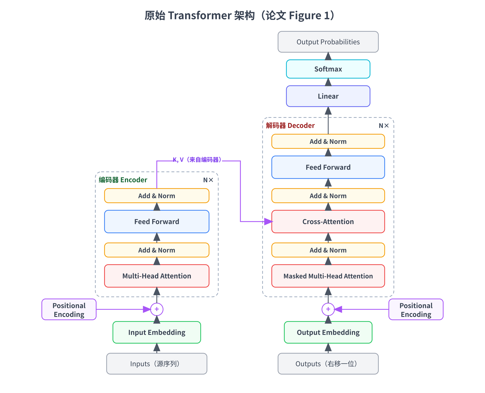
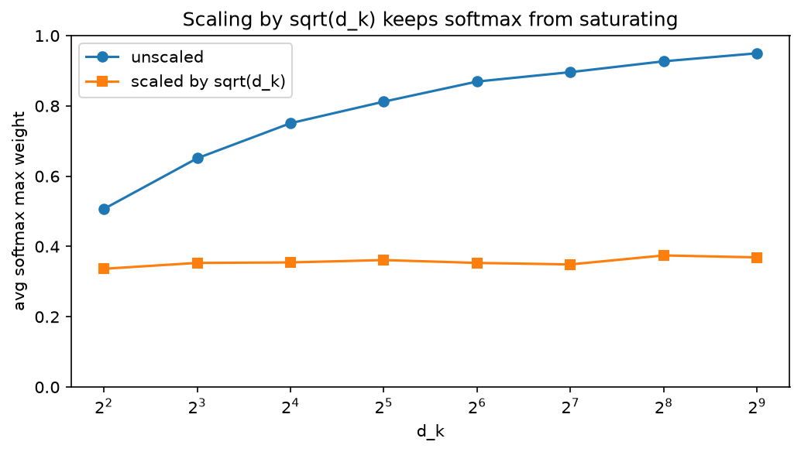
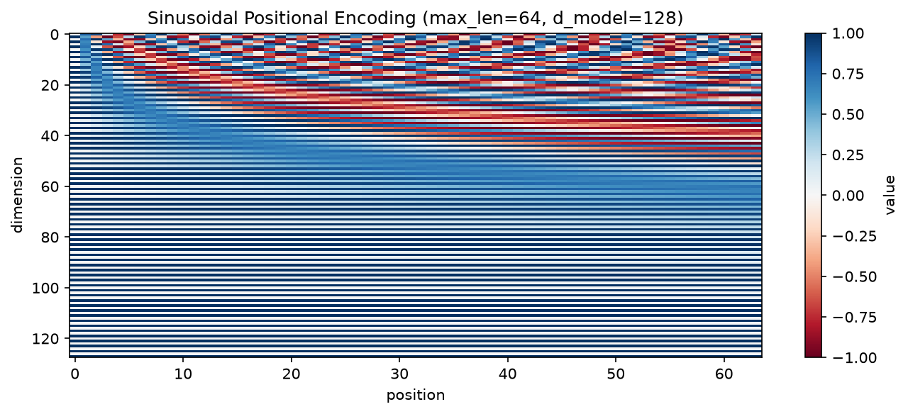
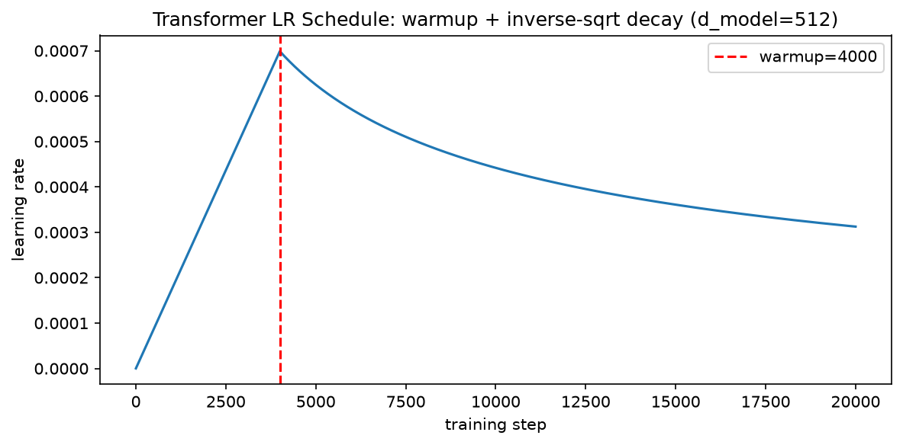
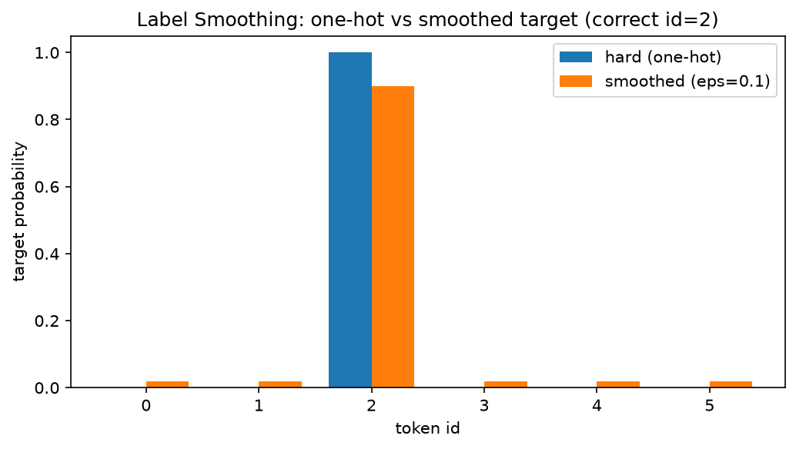

# 第十一章：论文精读——《Attention Is All You Need》逐节解读

到这里，我们已经把 Transformer 从零件到整体、从架构到训练目标，从头到尾走过一遍了：tokenizer、embedding、位置编码、scaled dot-product attention、多头、FFN、残差、归一化，最后是自回归训练目标与 cross-entropy loss（第 3-10 章）。这些零件今天读起来顺理成章，可它们并不是一开始就长这样的——Transformer 这套抛开循环和卷积、只用注意力的架构组织方式，**出自 2017 年的一篇论文**《Attention Is All You Need》（Vaswani 等，NeurIPS 2017）。这一章咱们回到源头，**逐节精读这篇奠基论文**：它每一节在讲什么、当年是以怎样的动机和语言第一次把这些设计提出来的，又怎么和我们前面各章实现过的零件对上号。

为什么值得专门拿一章来读一篇不到十页的老论文？两个理由。一是**回顾**：前面各章是"自底向上"搭零件，这一章是"自顶向下"把它们按原始论文的组织重新走一遍，很多"为什么这样设计"的动机，在论文的字里行间讲得比教科书更直接。二是**读论文本身是一项技能**：怎么先读摘要和引言抓问题、怎么把架构图和公式对上、怎么读懂消融实验（ablation）表格里每一行在验证什么——这些能力在第 12 章串读 GPT / LLaMA / Qwen 时立刻就要用上。所以本章一半是"读懂这一篇论文"，一半是"学会怎么读这一类论文"。

需要说明的是，这一章**不引入任何新的模型组件**——scaled dot-product attention、多头、位置编码、FFN 这些第 4、6-8 章都实现过了。本章**从一个新的视角来看**：把这些零件放回它们被首次提出的语境里，看清 2017 年的原版论文和今天主流大模型（Qwen / LLaMA）的实现之间，哪些东西一字未改地保留了下来、哪些被悄悄换掉了。这条"2017 → 今天"的对照，正好为第 12 章论文串读铺路。

实战部分依旧 **全程 CPU、纯 PyTorch + matplotlib**：把论文里几个最核心的公式与图表复现一遍——验证 scaled dot-product 里那个 $\sqrt{d_k}$ 缩放为什么能防 softmax 饱和、按论文第 3.5 节的精确公式画出 sinusoidal 位置编码热力图、复现论文第 4 节那张"self-attention vs RNN vs CNN"复杂度表、画出论文第 5.3 节 Adam 的 warmup 学习率调度曲线、演示 label smoothing 的效果，最后数清 base / big 两个模型的参数量对上论文 Table 3，并读一次 Qwen3-8B 的 config 把"2017 原版 → 今天"的差异对齐。

> 想直接跑示例？点这里 [](https://colab.research.google.com/github/weiqiangnd/LearningLLM/blob/main/src/11.ipynb)。
>
> **硬件门槛**：概念章，CPU 即可 ✅。本章实战只在维度 ≤ 512 的小张量上跑几个可视化与数值验证，Colab 免费 CPU 运行时秒级到十几秒即可，**不需要 GPU**；最后一节读 Qwen3-8B config 只下载几 KB 的 json。

## 目录

- [一、读这篇论文之前：它是谁、解决什么问题](#一读这篇论文之前它是谁解决什么问题)
  - [1.1 一篇不到十页的论文，改变了 NLP](#11-一篇不到十页的论文改变了-nlp)
  - [1.2 2017 年的问题：RNN 的顺序瓶颈](#12-2017-年的问题rnn-的顺序瓶颈)
  - [1.3 论文结构总览：七节内容和前面各章的对应](#13-论文结构总览七节内容和前面各章的对应)
- [二、模型架构：逐个子节读论文第 3 节](#二模型架构逐个子节读论文第-3-节)
  - [2.1 编码器与解码器堆叠：N=6、子层、残差与 LayerNorm](#21-编码器与解码器堆叠n6子层残差与-layernorm)
  - [2.2 Scaled Dot-Product Attention：为什么要除以根号 d_k](#22-scaled-dot-product-attention为什么要除以根号-d_k)
  - [2.3 Multi-Head Attention：把注意力切成 h=8 个头](#23-multi-head-attention把注意力切成-h8-个头)
  - [2.4 注意力在模型里的三处用法](#24-注意力在模型里的三处用法)
  - [2.5 Position-wise 前馈网络](#25-position-wise-前馈网络)
  - [2.6 Embedding 与 Softmax：weight tying 与乘根号 d_model](#26-embedding-与-softmaxweight-tying-与乘根号-d_model)
  - [2.7 位置编码：sinusoidal 的精确公式](#27-位置编码sinusoidal-的精确公式)
- [三、Why Self-Attention：论文第 4 节那张复杂度表](#三why-self-attention论文第-4-节那张复杂度表)
  - [3.1 三个衡量维度：每层复杂度、串行操作、最大路径长度](#31-三个衡量维度每层复杂度串行操作最大路径长度)
  - [3.2 逐行拆表：self-attention、RNN、CNN 各是多少](#32-逐行拆表self-attentionrnncnn-各是多少)
  - [3.3 n 比 d 小：为什么翻译任务上自注意力更快](#33-n-比-d-小为什么翻译任务上自注意力更快)
- [四、训练配方：论文第 5 节](#四训练配方论文第-5-节)
  - [4.1 数据与批处理](#41-数据与批处理)
  - [4.2 硬件与训练时长](#42-硬件与训练时长)
  - [4.3 优化器与学习率调度：Adam 加 warmup](#43-优化器与学习率调度adam-加-warmup)
  - [4.4 正则化：residual dropout 与 label smoothing](#44-正则化residual-dropout-与-label-smoothing)
- [五、结果与消融：论文第 6 节](#五结果与消融论文第-6-节)
  - [5.1 机器翻译成绩：28.4 BLEU](#51-机器翻译成绩284-bleu)
  - [5.2 模型变体消融：Table 3 告诉我们什么](#52-模型变体消融table-3-告诉我们什么)
  - [5.3 迁移到句法分析](#53-迁移到句法分析)
- [六、2017 到今天：这篇论文哪些被保留、哪些被改掉](#六2017-到今天这篇论文哪些被保留哪些被改掉)
- [七、实战：把论文的公式与图表复现一遍](#七实战把论文的公式与图表复现一遍)
  - [7.1 环境自检与依赖](#71-环境自检与依赖)
  - [7.2 复现缩放：为什么除以根号 d_k 能防 softmax 饱和](#72-复现缩放为什么除以根号-d_k-能防-softmax-饱和)
  - [7.3 复现 sinusoidal 位置编码与热力图](#73-复现-sinusoidal-位置编码与热力图)
  - [7.4 复现复杂度表：自注意力 vs RNN](#74-复现复杂度表自注意力-vs-rnn)
  - [7.5 复现 warmup 学习率调度曲线](#75-复现-warmup-学习率调度曲线)
  - [7.6 复现 label smoothing 的效果](#76-复现-label-smoothing-的效果)
  - [7.7 数清 base 与 big 模型参数量，对上 Table 3](#77-数清-base-与-big-模型参数量对上-table-3)
  - [7.8 读 Qwen3-8B config：2017 原版与今天差在哪](#78-读-qwen3-8b-config2017-原版与今天差在哪)
- [八、关键概念回顾](#八关键概念回顾)
- [九、本章小结](#九本章小结)

---

## 一、读这篇论文之前：它是谁、解决什么问题

### 1.1 一篇不到十页的论文，改变了 NLP

《Attention Is All You Need》2017 年 6 月挂上 arXiv（编号 [1706.03762](https://arxiv.org/abs/1706.03762)），同年发表在 NeurIPS，作者是来自 Google Brain / Google Research 与多伦多大学的八个人。正文不到十页，却几乎凭一己之力把整个自然语言处理（NLP）领域的技术路线扭了个方向——今天你听到的 GPT、BERT、LLaMA、Qwen，全都是这篇论文提出的 **Transformer** 架构的后代。前面各章我们讲的这套骨架，追根溯源都在这里。

论文标题本身就是一句宣言：**"注意力就是你所需要的全部"**。这里的潜台词是"你不再需要循环（recurrence）、也不再需要卷积（convolution）"——在此之前，处理序列（一句话、一段语音）的主流做法要么是 RNN（循环神经网络，第 5 章第 1 节），要么是 CNN（卷积网络）。这篇论文说：把这两样都扔掉，**只用注意力机制**，就能把序列建模这件事做得又快又好。

论文瞄准的具体任务是**机器翻译**（machine translation，把一种语言的句子翻成另一种），用的基准数据集是 WMT 2014 的英语→德语和英语→法语。为什么是翻译？因为翻译是"序列进、序列出"（sequence-to-sequence）这类任务里最经典、评测标准最公认的一个（BLEU 分数——机器翻译最常用的自动评测指标，衡量机器译文与人工参考译文的 n-gram 重合度，越高越好、满分 100），非常适合用来证明一个新架构的实力。但论文真正的贡献远不止翻译——它给出的是一个**通用的序列变换骨架**，后来被用到了语言建模、图像、语音几乎所有序列问题上。

> 读论文先读标题和摘要（abstract），一句话抓住"它想解决什么、用什么办法、结果多好"。这篇的摘要就三件事：提出一个**完全基于注意力**的新架构 Transformer、在两个翻译任务上**刷新了当时的最好成绩**（英德 28.4 BLEU）、而且**训练更快**（更好并行、用更少的时间）。抓住这三点，后面每一节都是在展开这三句话。

### 1.2 2017 年的问题：RNN 的顺序瓶颈

论文的引言（Introduction）开门见山地点出了它要解决的核心问题：**RNN 的顺序计算瓶颈**。这一点第 5 章第 1 节我们已经详细讲过，这里用论文自己的话再叙述一遍。

RNN 处理一句话的方式是**从左到右一个 token 一个 token 地走**：要算第 $t$ 个位置的隐藏状态 $h_t$ ，必须先算完 $h_{t-1}$ ，因为 $h_t$ 依赖 $h_{t-1}$ 。论文原话说这种"沿着序列位置的内在顺序性（inherently sequential nature），从根本上排除了训练样本内部的并行"。说白了：一句长度为 $n$ 的话，RNN 必须串行走 $n$ 步，**这 $n$ 步没法并行**——第 5 步必须等第 4 步。在 GPU 这种"越并行越快"的硬件上，这是致命的：句子越长、越浪费算力。

还有第二个毛病：**长程依赖**（long-range dependency）。一句话开头的信息要影响到结尾的预测，得在 RNN 的隐藏状态里"手手相传"走过 $n$ 步，路径太长，信息容易在传递中衰减或被覆盖（第 5 章第 1.3 节讲的长程依赖 / 梯度消失）。

引言接着说，注意力机制（attention）此前**已经**被用在序列建模里了——但通常是**和 RNN 配合使用**（第 5 章第 4-5 节的 Bahdanau / Luong attention 就是嫁接在 RNN seq2seq 上的）。这篇论文的激进之处在于：**把 RNN 整个拿掉，只留注意力**。这样一来，序列里任意两个位置之间的关联，都能"一步直达"（路径长度是常数 $O(1)$ ，第 3 节会量化这一点），而且整句话的计算可以**一次并行铺开**。这就是标题那句"attention is all you need"的技术底气。

> 顺便提一句，引言里被点名的另一条路线是 **CNN**（如 ByteNet、ConvS2S），卷积能并行、但要让远处两个位置发生关联需要堆很多层（路径长度随距离增长）。所以论文在第 4 节会把 self-attention、RNN、CNN 三者摆在一起量化对比——这三家正是 2017 年序列建模的三大流派。

### 1.3 论文结构总览：七节内容和前面各章的对应

这篇论文一共分七节（外加摘要和引言）。咱们先鸟瞰一遍它的骨架，同时标出**每一节对应我们前面哪一章**——这样你读论文时心里有张地图，知道每段文字落在我们已经熟悉的哪个零件上。

| 论文章节 | 标题（原文） | 讲什么 | 对应本书章节 |
|---------|------------|-------|--------------|
| §1 | Introduction | RNN 顺序瓶颈、动机 | 第 5 章 |
| §2 | Background | 此前的 CNN / 注意力工作 | 第 5 章 |
| §3.1 | Encoder and Decoder Stacks | 两栈结构、N=6、残差 + LayerNorm | 第 8、9 章 |
| §3.2 | Attention | scaled dot-product 与多头 | 第 6、7 章 |
| §3.3 | Position-wise FFN | 逐位置前馈网络 | 第 8 章 |
| §3.4 | Embeddings and Softmax | 查表、weight tying | 第 4 章 |
| §3.5 | Positional Encoding | sinusoidal 位置编码 | 第 4 章 |
| §4 | Why Self-Attention | 复杂度 / 并行 / 路径长度对比 | 第 6 章 |
| §5 | Training | 数据、优化器、warmup、正则化 | 第 10 章、P04 |
| §6 | Results | BLEU 成绩与消融实验 | 本章新讲 |
| §7 | Conclusion | 总结与展望 | 本章新讲 |

从这张表中可以看到：**论文第 3 节（模型架构）的五个子节，几乎就是我们第 4-8 章的目录**。所以本章的第 2 节会顺着论文第 3 节的子节号，逐个把它读一遍——不是重新教这些组件（第 4、6-8 章已经实现过），而是看清论文当年是用怎样的语言、带着怎样的动机把它们提出来的。第 3 节读那张著名的复杂度表（论文第 4 节），第 4 节读训练配方（论文第 5 节），第 5 节读结果与消融（论文第 6 节）。

一个**关键提醒**：论文原版是**编码器-解码器（encoder-decoder）两栈结构**，为翻译任务设计；而我们前面各章搭的、以及今天 GPT / Qwen 用的是**decoder-only 一栈**（两者的取舍见第 9 章第 4 节）。读论文时你会看到"编码器""解码器""cross-attention"这些词，别被绕晕——它们在 decoder-only 模型里要么合并了、要么去掉了。

---

## 二、模型架构：逐个子节读论文第 3 节

论文第 3 节叫"Model Architecture"，是全文的核心，配着那张被引用了无数次的架构图（左边编码器栈、右边解码器栈）。咱们顺着它的子节号往下读。

### 2.1 编码器与解码器堆叠：N=6、子层、残差与 LayerNorm

论文第 3.1 节先立骨架。Transformer 遵循当时 seq2seq 的通用范式——**编码器（encoder）+ 解码器（decoder）**：编码器把源语言句子（比如英语）读成一串向量表示，解码器再根据这串表示逐个吐出目标语言（比如德语）的 token。第 9 章第 3 节我们详细剖析过这套两栈结构和连接它们的 cross-attention，这里对着论文再确认几个具体数字。

先把论文那张著名的架构图（Figure 1）放在这儿——左边编码器、右边解码器，本章第 2 节接下来就顺着它从下往上把每个组件读一遍：



对着图看几个要点：数据从下往上流（token → embedding + 位置编码 → N 层堆叠 → 输出）；编码器每层两个子层、解码器每层三个子层（多出中间那个 cross-attention，紫色箭头表示它的 K、V 来自编码器输出）；每个子层外面都套一层 **Add & Norm**（注意原版是 **Post-LN**，本节下文会讲）。后面第 2.2-2.7 节就沿着这张图，从残差堆叠一路讲到位置编码。

**编码器**是 $N=6$ 个相同的层（layer）堆叠。每一层有**两个子层**（sub-layer）：

1. 一个**多头自注意力**（multi-head self-attention）；
2. 一个**逐位置前馈网络**（position-wise FFN）。

每个子层外面都套一个**残差连接**（residual connection）加**层归一化**（layer normalization，第 8 章第 4 节）。论文把这个组合写成一个公式：

$$
\text{LayerNorm}(x + \text{Sublayer}(x))
$$

这里 $\text{Sublayer}(x)$ 是子层自己算的东西（注意力或 FFN）， $x + \text{Sublayer}(x)$ 是残差相加，最外面再套 LayerNorm。**请特别留意这个括号的位置**：LayerNorm 套在"残差相加**之后**"——这正是第 9 章讲的 **Post-LN**（后置归一化）。2017 原版用的就是 Post-LN，而我们前面各章搭的、今天主流大模型用的是 **Pre-LN**（把 LayerNorm 挪到子层**之前**、残差路径上不放 Norm）。这个"只挪了一个 Norm 位置"的差别，第 9 章第 5 节分析过：它决定了几十层深的网络训不训得稳。**原版 Transformer 只有 6 层、又精心调了 warmup，Post-LN 还扛得住；层数一深，Pre-LN 才成了刚需。** 这是"2017 → 今天"第一个被改掉的地方。顺带说一句，被换掉的不只是 Norm 的**位置**——归一化**算子本身**后来也从 LayerNorm 换成了更省的 **RMSNorm**（去掉减均值那一步、只按均方根缩放，第 8 章）。

论文还提到：为了让残差相加能对齐，**模型里所有子层和 embedding 的输出维度统一为 $d_{\text{model}} = 512$**（残差要相加，前后维度必须一样，第 8 章第 3 节）。

**解码器**同样是 $N=6$ 层，但每层有**三个子层**——比编码器多一个：

1. 一个**带掩码的多头自注意力**（masked multi-head self-attention）；
2. 一个**编码器-解码器注意力**（encoder-decoder attention，即 cross-attention）；
3. 一个 FFN。

"带掩码"（masked）就是第 6 章第 5 节讲的**因果掩码**：解码器在生成第 $t$ 个词时只能看它左边已经生成的词、不能偷看未来（论文说这保证了"位置 $t$ 的预测只依赖小于 $t$ 的已知输出"）。中间那个 cross-attention 是两栈结构特有的——它的 query 来自解码器、key / value 来自编码器的输出，让解码器在生成每个目标词时"回头看"整个源句子（形状见第 9 章第 3.3 节）。

> 对照一下 decoder-only：GPT / Qwen 没有编码器，所以**cross-attention 这个子层直接消失了**，解码器每层只剩"带掩码自注意力 + FFN"两个子层——正是我们第 8 章第 6 节搭的那个 block。你看，读懂了原版的三子层解码器，decoder-only 不过是"删掉中间那个子层"而已。

### 2.2 Scaled Dot-Product Attention：为什么要除以根号 d_k

论文第 3.2.1 节给出了整篇论文最核心的一个公式，也是第 6 章第 4.3 节我们实现过的那个：

$$
\text{Attention}(Q, K, V) = \text{softmax}\left( \frac{QK^\top}{\sqrt{d_k}} \right) V
$$

其中 $Q$ （query，查询）、 $K$ （key，键）、 $V$ （value，值）都是矩阵， $d_k$ 是 query / key 的向量维度。第 6 章第 2.1 节我们用"软字典检索"的类比讲过这三个角色：拿 query 去和每个 key 打分（点积 $QK^\top$ ）、把分数过 softmax 变成权重、再用权重去加权求和 value。论文管这叫 **scaled dot-product attention**——"缩放的点积注意力"，名字里每个词都对应公式里一块。

论文专门花了一段解释**那个 $\sqrt{d_k}$ 缩放因子是干嘛的**，这段话很值得逐字读。它说：当 $d_k$ 比较大时，点积 $QK^\top$ 的数值会变得很大，把 softmax 推到"梯度极小"的饱和区，于是反向传播时梯度几乎为零、学不动。所以要除以 $\sqrt{d_k}$ 把点积的方差拉回来。

为什么偏偏是 $\sqrt{d_k}$ ？论文给了一个脚注级的推导（第 6 章第 3 节也算过）：假设 query 和 key 的每个分量都是独立、均值 0、方差 1 的随机变量，那么它们的点积 $q \cdot k = \sum_{i=1}^{d_k} q_i k_i$ 是 $d_k$ 个独立项之和，均值仍是 0、但**方差是 $d_k$**（独立随机变量之和的方差是各自方差之和）。方差是 $d_k$ ，标准差就是 $\sqrt{d_k}$ 。除以 $\sqrt{d_k}$ 正好把标准差归一化回 1，点积不管维度多大都保持在一个稳定的量级，softmax 就不会饱和。本章实战第 7.2 节会把这个"除与不除"的对比数值跑出来看——遍历一组 $d_k$ 、算出 softmax 最大权重（越接近 1 越饱和），画出来是这样：



蓝线是不缩放：随着 $d_k$ 从 4 涨到 512，softmax 最大权重一路爬向 1（分布越来越尖、逼近 one-hot，梯度趋于 0）；橙线是除以 $\sqrt{d_k}$ 后，最大权重稳稳平在低位、不随维度恶化。一条小小的缩放，效果一目了然。

### 2.3 Multi-Head Attention：把注意力切成 h=8 个头

论文第 3.2.2 节讲**多头注意力**（multi-head attention，第 7 章第 2 节）。核心思想论文讲得很清楚：与其用 $d_{\text{model}}$ 维做**一次**注意力，不如把 query / key / value 先各自线性投影到较低的维度、**并行做 $h$ 次**注意力、再把结果拼起来。写成公式：

$$
\text{MultiHead}(Q, K, V) = \text{Concat}(\text{head}_1, \dots, \text{head}_h) W^O
$$

$$
\text{head}_i = \text{Attention}(Q W_i^Q,\ K W_i^K,\ V W_i^V)
$$

每个头 $\text{head}_i$ 先用自己的投影矩阵 $W_i^Q, W_i^K, W_i^V$ 把输入投到 $d_k$ （或 $d_v$ ）维，做一次 scaled dot-product attention，最后所有头的输出拼接（Concat）起来、过一个输出投影 $W^O$ 。

论文给的具体配置是 **$h = 8$ 个头**，每个头的维度 $d_k = d_v = d_{\text{model}} / h = 512 / 8 = 64$ 。**留意这个"切分"的开销**（第 7 章第 4 节算过）：因为每个头只有 $64$ 维、是全维度的 $1/8$ ，所以 $h$ 个头加起来的总计算量，和"用一个 $512$ 维大头做一次注意力"**基本持平**——多头不是"多花 8 倍算力换 8 个视角"，而是"把同样的算力切成 8 份、每份看一种关系"。

论文对"为什么要多头"的解释是：多头让模型能够**同时关注来自不同表示子空间、不同位置的信息**。单个注意力头因为最后是加权平均，会把不同种类的关系抹平；拆成多个头，每个头可以专门盯一种模式（比如一个头管语法依赖、一个头管指代）。第 7 章第 7.5 节我们可视化过不同头的关注模式，正是这句话的验证。

> 这里埋着"2017 → 今天"第二个改动的种子。原版 $h=8$ 个头，query / key / value **头数一样多**（都是 8），这叫 MHA（multi-head attention）。今天为了推理时省显存（KV cache，第 14 章会讲），主流模型改用 **GQA**（grouped-query attention，第 7 章第 5 节）：query 保持很多头、但 key / value 的头数砍到很少（Qwen3-8B 是 32 个 query 头配 8 个 KV 头）。原版这里还没有这个优化，因为 2017 年主要关心训练、还没到为推理显存精打细算的时候。

### 2.4 注意力在模型里的三处用法

论文第 3.2.3 节回答一个问题：上面那个 multi-head attention 算子，在整个模型里**到底被用在了哪几个地方**？论文列了三处，这三处的 Q / K / V 来源各不相同——**看清"Q、K、V 分别来自哪里"，是读懂任何注意力变体的通用钥匙**：

1. **编码器的自注意力**（encoder self-attention）：Q、K、V 全部来自编码器上一层的输出。源句子里每个词都能看到句子里所有其他词（**双向**，没有掩码），充分理解上下文。
2. **解码器的带掩码自注意力**（masked decoder self-attention）：Q、K、V 全部来自解码器上一层的输出，但**加因果掩码**——每个位置只能看它左边（已生成的），不能偷看未来。这是为了保证自回归生成的合法性（第 6 章第 5 节、第 10 章第 3 节）。
3. **编码器-解码器注意力**（encoder-decoder attention，cross-attention）：**Q 来自解码器**、**K 和 V 来自编码器的输出**。这让解码器生成每个目标词时，都能去"查阅"整个源句子——这正是翻译任务的关键：生成德语的每个词都要参考英语原文。

论文有一句点睛：cross-attention 这种"query 来自一个序列、key / value 来自另一个序列"的用法，**模仿了 seq2seq 模型里经典的 encoder-decoder attention**（就是第 5 章第 4-5 节 Bahdanau / Luong 那套，只不过现在换成了多头点积形式）。所以你看，注意力（attention）从第 5 章的"嫁接在 RNN 上的对齐机制"，到这里变成了"一个可以自由拼装的通用算子"——同一个算子，Q / K / V 接不同的输入，就实现了三种完全不同的功能。

> decoder-only 模型里，上面三处只剩第 2 处（带掩码自注意力）。第 1 处（编码器自注意力）和第 3 处（cross-attention）都随着编码器一起被删掉了。这也是为什么第 6-8 章我们只讲了"带因果掩码的自注意力"——对 GPT / Qwen 而言，那就是唯一的一种注意力。

### 2.5 Position-wise 前馈网络

论文第 3.3 节讲**逐位置前馈网络**（position-wise feed-forward network，FFN，第 8 章第 2 节）。公式很简单：

$$
\text{FFN}(x) = \max(0,\ x W_1 + b_1) W_2 + b_2
$$

就是两个线性层夹一个 ReLU 激活（ $\max(0, \cdot)$ 就是 ReLU）。第一个线性层 $W_1$ 把维度从 $d_{\text{model}} = 512$ 升到 $d_{\text{ff}} = 2048$ （升维 4 倍），ReLU 做非线性，第二个线性层 $W_2$ 再降回 $512$ 。

"position-wise"（逐位置）这个词是重点：这个 FFN **对序列里每个位置独立地、用同一套权重**做变换——位置 5 和位置 10 过的是同一个 $W_1, W_2$ ，互不干扰。论文有个很形象的说法：这等价于两个 kernel size 为 1 的卷积。第 8 章第 2.3 节我们讲过它的作用：注意力负责"跨位置混信息"，FFN 负责"逐位置做非线性加工"，两者一横一纵互补。

论文明确写了维度： $d_{\text{model}} = 512$ 、 $d_{\text{ff}} = 2048$ ，即中间层是外层的 4 倍宽。第 8 章第 2.3 节估算过：FFN 这一块（两个 $512 \times 2048$ 的矩阵）占了一个 Transformer 层里约 2/3 的参数。

> "2017 → 今天"第三个改动在这儿：原版 FFN 用的是 **ReLU** + 两个线性层。今天主流大模型（LLaMA / Qwen）换成了 **SwiGLU**（第 8 章第 5 节）——用 SiLU 门控、三个矩阵，表达能力更强；为了对齐参数量，会把中间维度从 $4 d_{\text{model}}$ 收到约 $\frac{8}{3} d_{\text{model}}$ （各家具体倍数不一，本章第 7.8 节读到的 Qwen3-8B 就是 3 倍）。激活函数这条线是 ReLU → GELU → SiLU 一路演化过来的。

### 2.6 Embedding 与 Softmax：weight tying 与乘根号 d_model

论文第 3.4 节很短，但藏着两个第 4 章的工程细节。

第一，**输入 embedding、输出 embedding、最后的 pre-softmax 线性层，三者共享同一个权重矩阵**——这就是第 4 章第 1.3 节讲的**权重绑定**（weight tying）。直觉上，"把 token id 查成向量"和"把向量投回词表打分"本就是互逆的操作（一个查表、一个是查表的转置），共享权重既省参数（词表很大时这块参数量惊人）、又让两端语义一致。

第二，论文说在 embedding 层，**会把查出来的向量乘以 $\sqrt{d_{\text{model}}}$** 。为什么？一种常见解释是：embedding 初始化时每个分量的方差约为 $1/d_{\text{model}}$ ，乘上 $\sqrt{d_{\text{model}}}$ 把它的量级放大到和后面要加的位置编码（sinusoidal，取值在 $[ {-1}, 1 ]$ ）相当，两者相加时不会一方压倒另一方。这个 $\sqrt{d_{\text{model}}} = \sqrt{512} \approx 22.6$ 的缩放，是那种"不看这一节根本不知道、但实现时漏了就复现不出论文"的细节。

### 2.7 位置编码：sinusoidal 的精确公式

论文第 3.5 节讲**位置编码**（positional encoding），第 4 章第 8 节我们详细对比过 sinusoidal / learned / RoPE / ALiBi 四条路线，这里把原版用的 sinusoidal 精确公式再看一遍。

为什么需要位置编码？因为**自注意力本身对顺序"视而不见"**（第 4 章第 3.1 节讲的置换等变性）——把输入序列的词打乱顺序，自注意力的输出也只是跟着打乱，它并不知道"谁在前谁在后"。可语言是有顺序的（"狗咬人"和"人咬狗"的意思天差地别），所以必须**额外把位置信息编码进去**。原版的做法是造一个和 embedding 同维度（ $d_{\text{model}}$ ）的**位置向量**，直接**加**到 token embedding 上。

这个位置向量怎么造？论文用了一组正弦 / 余弦函数：

$$
PE_{(pos,\thinspace 2i)} = \sin\left( \frac{pos}{10000^{2i / d_{\text{model}}}} \right), \qquad PE_{(pos,\thinspace 2i+1)} = \cos\left( \frac{pos}{10000^{2i / d_{\text{model}}}} \right)
$$

读法： $pos$ 是位置序号（第几个 token）， $i$ 是维度的序号（第几维）。**偶数维用 sin、奇数维用 cos**；不同维度对应不同的波长（wavelength）——分母里的 $10000^{2i / d_{\text{model}}}$ 让波长从 $2\pi$ （低维、变化快）一直几何级数增长到 $10000 \cdot 2\pi$ （高维、变化慢）。所以每个位置 $pos$ 都对应一个由不同频率正弦波"采样"出来的独特向量，像一串多进制的"位置指纹"。第 7.3 节实战会照这个公式把 PE 矩阵算出来、画成下面这张热力图：



横轴是位置、纵轴是维度：靠上的低维波长短、颜色随位置快速红蓝交替；靠下的高维波长长、大片同色缓慢变化——这就是那种"由密到疏的条纹"，每一列（一个位置）都是这些不同频率正弦波的一次采样。

论文为什么选正弦函数、而不是直接学一个位置 embedding 表？给了两个理由。一是**相对位置**：对任意固定偏移 $k$ ， $PE_{pos+k}$ 都能写成 $PE_{pos}$ 的一个线性函数（正弦的和角公式），所以模型容易学会"关注相对距离"。二是**外推**（extrapolation）：正弦函数对任意长的位置都有定义，理论上模型能推广到比训练时更长的序列。论文还提到，他们同时试了**可学习的位置 embedding**（learned positional embedding），结果两者效果**几乎一模一样**（这条会出现在第 5.2 节的消融表 Table 3 里），最后选 sinusoidal 主要就看中那个"可能外推到更长序列"的好处。

> "2017 → 今天"第四个改动：原版把位置信息**加在输入 embedding 上**（绝对位置）。今天主流用 **RoPE**（旋转位置编码，第 4 章第 6 节）——不再加到输入，而是在每层算注意力时对 query / key 做旋转，是一种**相对位置**编码，外推性质更好、更适合长上下文。原版的 sinusoidal 是"改输入"路线的代表，RoPE 是"改注意力"路线的代表。

---

## 三、Why Self-Attention：论文第 4 节那张复杂度表

论文第 4 节标题就叫"Why Self-Attention"，专门论证"为什么该用自注意力取代 RNN / CNN"。这一节的核心是**一张表（Table 1）**，把三类算子（自注意力单列了完整和受限两行，共四行）摆在一起，从三个维度逐一衡量。

### 3.1 三个衡量维度：每层复杂度、串行操作、最大路径长度

论文选了三个指标来评判一个序列建模算子的好坏，咱们先把这三个指标弄明白（下面 $n$ 是序列长度， $d$ 是表示维度 $d_{\text{model}}$ ）：

1. **每层总计算复杂度**（complexity per layer）：处理一整个序列，这一层要做多少次浮点运算。越小越省算力。
2. **最少串行操作数**（sequential operations）：这一层里"必须一个接一个、没法并行"的步骤有多少。越小越好——它直接决定了能不能吃满 GPU 的并行能力。这正是第 1.2 节说的 RNN 的痛点。
3. **最大路径长度**（maximum path length）：序列里**相距最远的两个位置**，它们的信息要经过多少步才能相互影响。越短越好——路径越短，长程依赖越容易学（信息不容易在传递中丢失）。

论文一句话点明设计目标：我们希望一个算子**每层计算量小、能高度并行（串行操作少）、且长程依赖的路径短**。带着这三把尺子，来看那张表。

### 3.2 逐行拆表：self-attention、RNN、CNN 各是多少

这就是论文 Table 1 的核心内容（ $n$ = 序列长度， $d$ = 表示维度， $k$ = 卷积核宽度， $r$ = 受限注意力的窗口大小）：

| 算子（层类型） | 每层复杂度 | 最少串行操作 | 最大路径长度 |
|--------------|-----------|------------|------------|
| 自注意力（self-attention） | $O(n^2 \cdot d)$ | $O(1)$ | $O(1)$ |
| 循环（recurrent，RNN） | $O(n \cdot d^2)$ | $O(n)$ | $O(n)$ |
| 卷积（convolutional，CNN） | $O(k \cdot n \cdot d^2)$ | $O(1)$ | $O(\log_k n)$ |
| 受限自注意力（self-attention，窗口 $r$ ） | $O(r \cdot n \cdot d)$ | $O(1)$ | $O(n / r)$ |

逐行看：

- **自注意力**：串行操作 $O(1)$ ——整个序列的注意力就是几个大矩阵乘法（ $QK^\top$ 、乘 $V$ ），可以一次性并行算完，没有"第 5 步等第 4 步"这回事。最大路径长度也是 $O(1)$ ——任意两个位置在一次注意力里就直接打分、直接相连，信息一步到位。这两个 $O(1)$ 就是自注意力完胜 RNN 的地方。代价是每层复杂度 $O(n^2 \cdot d)$ ——那个 $n^2$ 来自"每个位置都要和所有 $n$ 个位置算注意力"（第 6 章第 6 节讲的 $O(L^2)$ 复杂度），序列一长，这块开销就上去了（这正是第 14 章之后一系列长上下文、稀疏注意力优化要解决的问题）。
- **RNN**：串行操作 $O(n)$ 、最大路径长度 $O(n)$ ——两个致命的 $O(n)$ ，就是第 1.2 节说的顺序瓶颈。它唯一的好处是每层复杂度 $O(n \cdot d^2)$ 里没有 $n^2$ 。
- **CNN**：单层串行 $O(1)$ （卷积可并行），但一个卷积核只能覆盖 $k$ 个相邻位置，要让相距 $n$ 的两点相连，得堆 $O(\log_k n)$ 层——所以最大路径长度是对数级，比 RNN 好、但比自注意力的 $O(1)$ 差。
- **受限自注意力**：论文顺带提的一个变体——如果序列特别长、 $n^2$ 吃不消，可以让每个位置只关注附近 $r$ 个邻居（滑动窗口），复杂度降到 $O(r \cdot n \cdot d)$ ，代价是路径长度升到 $O(n/r)$ 。这其实就是后来各种"稀疏 / 局部注意力"（第 23 章 sliding window 等）的雏形。

### 3.3 n 比 d 小：为什么翻译任务上自注意力更快

看完表你可能会疑惑：自注意力每层是 $O(n^2 d)$ 、RNN 是 $O(n d^2)$ ，到底谁快？论文专门讨论了这一点，答案取决于 **$n$ 和 $d$ 谁大**：

- 自注意力 $O(n^2 d)$ vs RNN $O(n d^2)$ ，约掉公共的 $n \cdot d$ ，比的就是 **$n$ 和 $d$**。
- 当 **$n < d$** 时，自注意力反而**更省**（ $n^2 d < n d^2$ ）。

而论文指出：在机器翻译这类任务里，**句子长度 $n$ 通常小于表示维度 $d = 512$**——一句话几十个词，而 $d$ 有 512。所以在翻译这个主场上，自注意力不但并行度和路径长度全面胜出，**连每层计算量都比 RNN 更小**。

当然，这个" $n < d$ 才更省"的前提也预示了自注意力的软肋：一旦序列很长（ $n \gg d$ ，比如长文档、长上下文），那个 $n^2$ 就会反噬。这正是后续大量工程工作（KV cache、FlashAttention、稀疏注意力、长上下文外推）要解决的核心矛盾——第 14 章往后我们会反复回到这个 $O(n^2)$ 上。

---

## 四、训练配方：论文第 5 节

论文第 5 节"Training"讲怎么把这个模型训出来——数据、硬件、优化器、正则化。很多"魔法数字"（warmup 4000 步、label smoothing 0.1）都出自这里，而且被后来的模型沿用了很多年。

### 4.1 数据与批处理

论文用的是 **WMT 2014** 数据集。英语→德语约 **450 万**句对，用第 3 章第 2 节讲的 **BPE**（byte-pair encoding）切分，源语言和目标语言**共享**一个约 3.7 万 token 的词表。英语→法语更大，约 **3600 万**句对，用了约 3.2 万的 word-piece 词表（word-piece 是另一种子词切分法，思路与第 3 章第 2 节讲的 BPE 相近）。

批处理（batching）有个细节值得一提：论文**按序列的近似长度分批**——把长度相近的句子放进同一个 batch，每个 batch 大约含 2.5 万个源 token 和 2.5 万个目标 token。为什么按长度分批？因为一个 batch 里句子长度不一时要 padding 补齐（padding 见第 10 章第 2.5 节），长短混在一起会浪费大量算力在 pad 上；按长度分组能让 padding 最少。这是训练序列模型的一个常见工程技巧。

### 4.2 硬件与训练时长

这一小节论文交代了成本，读起来颇有时代感：他们在**一台配 8 张 NVIDIA P100 GPU** 的机器上训练。

- **base 模型**：每步约 0.4 秒，训练 10 万步，总共约 **12 小时**。
- **big 模型**：每步约 1.0 秒，训练 30 万步，总共约 **3.5 天**。

放到今天看，8 张 P100 训 12 小时就能刷新翻译 SOTA，成本低得惊人——这恰恰说明 Transformer 的高并行让它训练效率极高（对比同期 RNN 模型动辄训好几天还更差）。当然，今天的大模型（几百上千亿参数）训练成本早已是另一个数量级，但 Transformer"好并行、好扩展"这个基因，正是从这里开始、让后来的规模化（scaling，第 21 章）成为可能。

### 4.3 优化器与学习率调度：Adam 加 warmup

论文用 **Adam** 优化器（参考 P04 第 4 节），超参数 $\beta_1 = 0.9$ 、 $\beta_2 = 0.98$ 、 $\epsilon = 10^{-9}$ 。真正被后世反复引用的是它的**学习率调度公式**：

$$
lrate = d_{\text{model}}^{-0.5} \cdot \min\left( step^{-0.5},\ step \cdot n_{\text{warmup}}^{-1.5} \right)
$$

这个公式看着复杂，拆开其实就是 P04 第 7、8 节讲的 **warmup + 衰减**两段（论文里 $n_{\text{warmup}} = 4000$ 步）：

- **前 4000 步（warmup 阶段）**： $step < n_{\text{warmup}}$ 时， $\min$ 取到第二项 $step \cdot n_{\text{warmup}}^{-1.5}$ ——它和 $step$ 成**正比**，也就是学习率从 0 开始**线性上升**。为什么要 warmup？P04 第 7 节讲过：Adam 在训练最初几步对梯度二阶矩的估计还不准，一上来就用大学习率容易让参数更新失控（甚至 NaN）；先用小学习率"热热身"，等统计量稳定了再提上去。
- **4000 步之后（衰减阶段）**： $step > n_{\text{warmup}}$ 时， $\min$ 取到第一项 $step^{-0.5}$ ——学习率按 $1/\sqrt{step}$ **缓慢下降**。训练后期调小学习率，是为了让模型在最优点附近精细收敛、不来回震荡。

前面那个 $d_{\text{model}}^{-0.5}$ 是个和维度挂钩的整体缩放（模型越宽、学习率整体越小）。第 7.5 节实战会把这条曲线画出来，长这样：



一个漂亮的"先线性爬升到峰值、再按 $1/\sqrt{step}$ 拖尾下降"的形状，峰值（约 $7 \times 10^{-4}$ ）恰好落在第 4000 步——左边线性升温对应 $\min$ 取第二项、右边缓降对应取第一项。

> "2017 → 今天"第五个改动（这个改得比较温和）：warmup 这个思想被完整保留了下来（今天几乎所有大模型训练都带 warmup），但**衰减部分**从原版的 $1/\sqrt{step}$ 换成了更常用的 **cosine 退火**（余弦衰减，P04 第 9 节讲的 `warmup + cosine`）。优化器也从 Adam 改成了 **AdamW**（解耦 weight decay，P04 第 5 节）。所以你可以说：今天的"warmup + cosine + AdamW"这套默认配方，骨架就是从这篇论文的第 5.3 节长出来的。

### 4.4 正则化：residual dropout 与 label smoothing

论文用了两种正则化（regularization，防止过拟合的手段）：

**Residual dropout**：在每个子层的输出（加到残差、做 LayerNorm 之前）上做 dropout（训练时按固定概率随机把一部分分量置 0，迫使模型别依赖个别分量，从而防过拟合；推理时不丢），另外在"embedding + 位置编码"相加之后也做一次。base 模型的丢弃率 $P_{\text{drop}} = 0.1$ 。dropout 是那个年代标配的正则化手段。

**Label smoothing**（标签平滑）：这个更有意思，论文用了 $\epsilon_{ls} = 0.1$ 。第 10 章第 2 节讲过，语言建模的标准损失是 cross-entropy，标签是 one-hot（正确 token 概率 1、其余全 0）。label smoothing 的做法是**把这个 one-hot"抹平"一点**——正确 token 的目标概率不设成 1，而是设成 $1 - \epsilon_{ls} = 0.9$ ，把匀出来的 $0.1$ 均分给其余所有 token。以一个 6 类的小词表、正确答案是 id=2 为例，平滑前后的目标分布就是这样：



蓝色是原始 one-hot（正确项 1、其余 0），橙色是平滑后（正确项降到 0.9、其余每项分到 0.02）——匀出来的那 $0.1$ 就是迫使模型"别太笃定"的那点松动。

为什么这么做？因为迫使模型对正确答案输出接近 1 的概率，会让它变得**过度自信**（logits 拉到极端、容易过拟合）。留一点概率给别的选项，相当于告诉模型"别太笃定"。论文诚实地记了一句很关键的观察：label smoothing **让困惑度（perplexity，衡量模型对下一个 token 有多"不确定"、数值上等于交叉熵取指数，越低越好）变差了**（因为模型被迫不那么确定），**但 BLEU 分数和准确率反而提升了**。这是个经典的"训练指标和最终指标不一致"的例子——第 7.6 节我们会把平滑前后的目标分布打印出来对比。

---

## 五、结果与消融：论文第 6 节

论文第 6 节"Results"是"亮成绩 + 效果归因"：先报翻译成绩证明它 SOTA，再用消融实验（ablation）分析清楚"到底哪个设计贡献了多少"。**读结果一节的关键，是把注意力放在消融表上**——成绩单只告诉你"它很强"，消融表才告诉你"它为什么强、哪些设计是必要的"。

### 5.1 机器翻译成绩：28.4 BLEU

翻译质量用 **BLEU** 分数衡量（第 1.1 节提过：机器译文与人工参考译文的 n-gram 重合度，越高越好、满分 100）。论文的成绩：

- 英语→德语（WMT 2014）：big 模型拿到 **28.4 BLEU**，**超过了此前所有已发表的模型（包括模型集成 ensemble）2 个 BLEU 以上**。这是当时的新 SOTA。
- 英语→法语：big 模型拿到 **41.8 BLEU**，同样是单模型的新高。

论文特别强调的不只是分数高，还有**成本低**：达到这个成绩用的训练算力，比之前那些 SOTA 模型小了一个数量级（对应第 4.2 节那个"8 卡训 3.5 天"）。"更好 + 更省"两个优势一起立住，这就是摘要里"更好并行、训练时间更少"那句话的兑现。

### 5.2 模型变体消融：Table 3 告诉我们什么

论文的 Table 3 是一组消融实验：以 base 模型为基准，每次只改一个设计，看 BLEU（和困惑度）怎么变。这张表回答的是"每个设计到底重不重要"。挑几条最有信息量的读：

- **注意力头数 $h$**：把头数从 8 改成 1（单头）时，BLEU 掉了约 0.9——说明**多头确实有用**，单个头不够。但把头数加到很多（比如 32）时效果也会回落，说明头数不是越多越好，存在一个最合适的取值（每个头太窄也不行）。这条正好验证了第 2.3 节"多头切分"的价值与限度。
- **key 维度 $d_k$**：把 $d_k$ 单独调小会让质量变差——论文由此推测，判断 query 和 key 的相容性（点积打分）不是件容易的事，维度太小不够用。
- **模型规模**：把 $N$ （层数）、 $d_{\text{model}}$ 、 $d_{\text{ff}}$ 往大了调，BLEU 普遍提升——**更大的模型更好**。这条朴素的观察，正是几年后 scaling law（第 21 章）的先声。
- **dropout**：去掉 dropout 或用太大的 dropout 都会变差——正则化的量要恰到好处。
- **位置编码**：把 sinusoidal 换成**可学习的位置 embedding**，结果**几乎完全一样**（BLEU 基本不变）。这就印证了第 2.7 节说的——原版最终选 sinusoidal，不是因为它效果更好，而是看中它"可能外推到更长序列"这一点理论上的好处。

### 5.3 迁移到句法分析

论文第 6.3 节做了一件很聪明的事：为了证明 Transformer **不只会翻译**，他们把它用到了一个结构上很不一样的任务——**英语句法成分分析**（English constituency parsing，给句子标出语法树结构）。这个任务的输出有强烈的结构约束，和翻译差别很大。

结果 Transformer 表现得相当好（在 WSJ 数据集上拿到约 91.3 的 F1 分数——F1 是精确率与召回率的调和平均，越高越好——和当时的专用模型有一拼），哪怕在数据量不大的情况下也没有明显退化。这一节虽然短，传递的信号却很重要：**Transformer 是个通用的序列变换架构，不是只为翻译定制的**。这个"通用性"的暗示，后来被 GPT / BERT 发扬光大——同一套架构，稍加改造就能干语言建模、分类、问答、代码……几乎所有 NLP 任务。今天大模型"一个架构通吃一切"的格局，这里已经埋下伏笔。

---

## 六、2017 到今天：这篇论文哪些被保留、哪些被改掉

读完全文，咱们把散落在前面各节里的"2017 → 今天"对照汇总成一张表。前面各节按出场顺序指出了**五处零件级改动**（Post-LN → Pre-LN、MHA → GQA、ReLU → SwiGLU、sinusoidal → RoPE、调度从 inverse-sqrt → cosine）；下面这张表把它们连同**整体架构、归一化类型、tokenizer、训练目标**这几处更大或更外围的变化一并收进来，凑成完整清单。这张表某种意义上是**从原版 Transformer 到 Qwen3-8B 的变更清单**——左边是这篇论文定下的原版，右边是今天主流大模型的做法，也正好是第 12 章论文串读要逐项展开的内容。

| 组件 | 2017 原版 | 今天主流（LLaMA / Qwen） | 相关章节 |
|------|----------|----------------------|---------|
| 整体架构 | Encoder-Decoder 两栈 | Decoder-only 一栈 | 第 9 章 / 第 12 章 |
| 归一化位置 | Post-LN（残差之后） | Pre-LN（残差之前） | 第 9 章 |
| 归一化类型 | LayerNorm | RMSNorm | 第 8 章 |
| FFN | ReLU + 两个线性层 | SwiGLU（SiLU 门控、三个矩阵） | 第 8 章 |
| 位置编码 | sinusoidal 绝对位置（加在输入） | RoPE 相对位置（旋转 Q/K） | 第 4 章 |
| 注意力 KV 头 | MHA（Q/K/V 头数相同） | GQA（KV 头数更少，省 KV cache） | 第 7 章 |
| 学习率调度 | Adam + warmup + $1/\sqrt{step}$ 衰减 | AdamW + warmup + cosine 衰减 | P04 |
| tokenizer | BPE / word-piece，约 3 万词表 | BBPE，十几万词表 | 第 3 章 |
| 训练目标 | 翻译（条件序列生成） | 通用自回归语言建模 | 第 10 章 / 第 12 章 |

看这张表有两点感受：

第一，**骨架惊人地稳**。八年过去，Transformer 最核心的东西——scaled dot-product attention 那个公式、多头的切分与拼接、残差 + 归一化 + FFN 的 block 结构、位置编码要单独注入这件事——**一个字没改**。今天你在 Qwen3-8B 里看到的注意力，和 2017 这篇论文里写的是同一个 $\text{softmax}(QK^\top / \sqrt{d_k})V$ 。这就是为什么这篇论文值得逐节精读：它定义的框架至今仍是所有大模型的地基。

第二，**改动全是"局部换更好的零件"，没有推翻重来**。Post-LN → Pre-LN、LayerNorm → RMSNorm、ReLU → SwiGLU、sinusoidal → RoPE、MHA → GQA——每一处都是"在同一个 block 结构里，把某个小组件替换成一个更稳 / 更快 / 更省的版本"，而不是改变整体思路。这正是第 9 章说的"同一套骨架，怎么放大、怎么改良"。所以第 12 章串读 LLaMA / Qwen 时，你会发现那些论文读起来轻松得多——它们本质上就是在这张表的右列上做文章，逐项解释"为什么这么换"。

**《Attention Is All You Need》给了世界一个骨架，后来的八年都在这个骨架上换更好的零件。** 读懂了原版，你就读懂了所有大模型的共同祖先。

---

## 七、实战：把论文的公式与图表复现一遍

这一章没有新组件要实现，所以实战的目标不是"搭东西"，而是**把论文里几个最核心的公式和图表跑出来**——让那些印在纸上的符号（ $\sqrt{d_k}$ 、sinusoidal 公式、复杂度表、warmup 曲线）变成你屏幕上能看、能改、能验证的数字。全程 CPU、纯 PyTorch + matplotlib，秒级跑完。

你会发现下面几个实验—— $\sqrt{d_k}$ 缩放、sinusoidal 位置编码、warmup 调度——在第 4、6 章和 P04 的实战里其实都出现过。本章是把这些设计放回原论文的**精确公式、表格与图**上，用论文自己的参数（ $d_{\text{model}} = 512$ 、 $n_{\text{warmup}} = 4000$ 、 $\epsilon_{ls} = 0.1$ ……）复现一遍，去印证论文提出的那些论断——比如"缩放确实能把 softmax 从饱和区拉回来""warmup 峰值恰好落在第 4000 步""label smoothing 会让困惑度变差"。所以这里的重复不是冗余，而是"拿原论文的尺子再量一遍前面造好的零件"。

### 7.1 环境自检与依赖

**Cell 0** 是常规环境自检——本章纯 CPU，只打印环境信息、不强制 GPU：

```python
# ============================================================
# Cell 0: 环境自检（本章纯 CPU 即可，无需 GPU）
# ============================================================
# 本章把《Attention Is All You Need》里几个核心公式 / 图表复现一遍：
# 缩放注意力、sinusoidal 位置编码、复杂度表、warmup 调度、label smoothing、参数量。
# 全程在维度 <= 512 的小张量上跑，CPU 秒级完成，不需要 GPU。
import sys, platform
import torch

print("Python:", sys.version.split()[0])
print("平台:", platform.platform())
print("PyTorch:", torch.__version__)
print("CUDA 可用:", torch.cuda.is_available(), "（本章用不到，CPU 即可）")
```

**Cell 1** 装依赖。本章只用到 `torch` 和 `matplotlib`（画图），外加最后一节用 `transformers` 读 Qwen3-8B 的 config：

```python
%%capture
# ============================================================
# Cell 1: 安装依赖
# ============================================================
# %%capture 必须是 cell 第一行，把 pip 安装日志藏起来。
# torch / matplotlib: Colab 默认已装，纯 CPU 跑小张量 + 画图，故意【不】加 -U。
# transformers:       第 7.8 节用 AutoConfig 读 Qwen3-8B config，Qwen3 要求 >=4.51。
!pip install -q -U "transformers>=4.51"
```

### 7.2 复现缩放：为什么除以根号 d_k 能防 softmax 饱和

**Cell 2** 把第 2.2 节的论证用数字跑出来——scaled dot-product attention 里的 $\sqrt{d_k}$ 是为了防止"维度一大、点积方差跟着大、softmax 饱和"：造一批随机 query / key，分别在小维度和大维度下，看"除"与"不除" $\sqrt{d_k}$ 时点积的方差、以及 softmax 之后的分布有多尖：

```python
# ============================================================
# Cell 2: 复现论文 3.2.1——为什么要除以 sqrt(d_k)
# ============================================================
import torch
import torch.nn.functional as F

torch.manual_seed(0)

def dot_stats(d_k, n=1000):
    """造 n 对 d_k 维的随机 query/key（均值0方差1），
    返回未缩放 / 缩放后点积的方差，以及 softmax 后的最大权重（越接近1越饱和）。"""
    q = torch.randn(n, d_k)                 # [n, d_k]，每个分量 ~ N(0,1)
    k = torch.randn(n, d_k)                 # [n, d_k]
    dot = (q * k).sum(-1)                   # [n]，逐对点积 q·k = sum_i q_i k_i
    scaled = dot / (d_k ** 0.5)             # 除以 sqrt(d_k) 把方差拉回 ~1
    # 复用上面造的 key：用第一条 query 对前 8 个 key 打分，看 softmax 尖不尖
    # （和下面画图循环同一套写法 query @ key.T，别混成两个实验）
    scores = q[:1] @ k[:8].T                # [1, 8] 未缩放打分（1 条 query 对 8 个 key）
    w_raw = F.softmax(scores, dim=-1).max().item()
    w_scaled = F.softmax(scores / d_k ** 0.5, dim=-1).max().item()
    return dot.var().item(), scaled.var().item(), w_raw, w_scaled

print(f"{'d_k':>5} | {'var(未缩放)':>12} | {'var(缩放后)':>12} | {'softmax max(未缩放)':>20} | {'softmax max(缩放)':>18}")
for d_k in [8, 64, 512]:
    v_raw, v_scaled, w_raw, w_scaled = dot_stats(d_k)
    print(f"{d_k:>5} | {v_raw:>12.2f} | {v_scaled:>12.2f} | {w_raw:>20.3f} | {w_scaled:>18.3f}")

# 结论：未缩放点积的方差随 d_k 线性增长（≈ d_k），softmax 越来越尖（max 权重趋近 1，
# 意味着几乎把全部注意力集中到一个位置上、梯度趋近 0）；除以 sqrt(d_k) 后方差稳定在 ~1，
# softmax 保持温和——这正是论文加这个缩放因子的原因。

# 把"缩放前后 softmax 有多尖"画成图：遍历一组 d_k，每个点取 200 次平均
import matplotlib.pyplot as plt
dks = [4, 8, 16, 32, 64, 128, 256, 512]
raw_w, scaled_w = [], []
for dk in dks:
    r, s = [], []
    for _ in range(200):
        qq = torch.randn(1, dk); kk = torch.randn(8, dk)     # 1 条 query 对 8 个 key
        sc = qq @ kk.T                                         # [1, 8] 打分
        r.append(F.softmax(sc, -1).max().item())              # 未缩放的 softmax 最大权重
        s.append(F.softmax(sc / dk ** 0.5, -1).max().item())  # 缩放后的
    raw_w.append(sum(r) / len(r)); scaled_w.append(sum(s) / len(s))

plt.figure(figsize=(7, 4))
plt.plot(dks, raw_w, "o-", label="unscaled")
plt.plot(dks, scaled_w, "s-", label="scaled by sqrt(d_k)")
plt.xscale("log", base=2); plt.ylim(0, 1)
plt.xlabel("d_k"); plt.ylabel("avg softmax max weight")
plt.title("Scaling by sqrt(d_k) keeps softmax from saturating")
plt.legend(); plt.tight_layout(); plt.show()
# 观察：未缩放时 softmax 最大权重随 d_k 升高、逼近 1（饱和 -> 梯度趋 0）；
# 缩放后基本平在低位、不随 d_k 恶化——正是论文加 sqrt(d_k) 的效果。
```

你会看到：未缩放点积的方差随 $d_k$ 从 8 增加到 512 大致线性增长（约等于 $d_k$ ），对应的 softmax 最大权重越来越接近 1（分布越来越尖、退化成近似 one-hot，梯度趋于 0）；而除以 $\sqrt{d_k}$ 之后方差稳稳保持在 1 附近、softmax 保持温和。这就验证了第 2.2 节那段方差分析（画出来的对比图见第 2.2 节）。

### 7.3 复现 sinusoidal 位置编码与热力图

**Cell 3** 照着第 2.7 节给的 sinusoidal 位置编码精确公式把 PE 矩阵算出来，并画成热力图——你能直观看到"偶数维 sin、奇数维 cos，波长从低维到高维由密到疏"的条纹：

```python
# ============================================================
# Cell 3: 复现论文 3.5——sinusoidal 位置编码
# ============================================================
import torch
import matplotlib.pyplot as plt

def sinusoidal_pe(max_len, d_model):
    """按论文公式造 [max_len, d_model] 的位置编码矩阵：
    PE[pos, 2i]   = sin(pos / 10000^(2i/d_model))
    PE[pos, 2i+1] = cos(pos / 10000^(2i/d_model))"""
    pos = torch.arange(max_len).unsqueeze(1)                       # [max_len, 1]
    i = torch.arange(0, d_model, 2)                                # [d_model/2]，偶数维下标 0,2,4,...（就是公式里的 2i，故下面 i/d_model 即 2i/d_model）
    div = torch.pow(10000, i / d_model)                            # [d_model/2]，各维的"波长"分母
    pe = torch.zeros(max_len, d_model)                             # [max_len, d_model]
    pe[:, 0::2] = torch.sin(pos / div)                             # 偶数维放 sin
    pe[:, 1::2] = torch.cos(pos / div)                             # 奇数维放 cos
    return pe

pe = sinusoidal_pe(max_len=64, d_model=128)
print("PE 形状:", tuple(pe.shape))
print("每个位置的向量都不同吗?", (pe.unique(dim=0).shape[0] == pe.shape[0]))

plt.figure(figsize=(9, 4))
plt.imshow(pe.T, aspect="auto", cmap="RdBu")                       # 转置成 [d_model, max_len]，行=维度、列=位置
plt.xlabel("position")
plt.ylabel("dimension")
plt.title("Sinusoidal Positional Encoding (max_len=64, d_model=128)")
plt.colorbar(label="value")
plt.tight_layout()
plt.show()
# 观察：低维（图上方）波长短、随位置快速振荡；高维（图下方）波长长、变化缓慢——
# 每个位置由这一整列不同频率的采样值唯一确定，像一串"多进制位置指纹"。
```

跑出来的热力图就是第 2.7 节那张（横轴是位置、纵轴是维度）：靠上的低维波长短、颜色随位置快速红蓝交替；靠下的高维波长长、大片同色缓慢变化。每一列（一个位置）都是这些不同频率正弦波的一次采样，合起来给了每个位置一个独一无二的向量。

### 7.4 复现复杂度表：自注意力 vs RNN

**Cell 4** 用**实际计时**把第 3 节那张复杂度表（Table 1）验证一遍：造不同长度 $n$ 的序列，分别用自注意力（一次矩阵乘）和 RNN（Python 里逐步循环）算一遍，算出耗时随 $n$ 怎么变化——你会看到 RNN 的串行循环随 $n$ 线性变慢，而自注意力的一次并行矩阵乘快得多：

```python
# ============================================================
# Cell 4: 复现论文第 4 节——自注意力 vs RNN 的复杂度 / 并行性对比
# ============================================================
import torch, time

d = 512                                          # 表示维度 d_model
def self_attn_once(x):
    """一次并行自注意力：串行操作 O(1)（就是几个矩阵乘）。x: [n, d] -> [n, d]。"""
    scores = x @ x.T / d ** 0.5                   # [n, n]，一次算完所有位置对的打分
    w = torch.softmax(scores, dim=-1)             # [n, n]
    return w @ x                                  # [n, d]

def rnn_scan(x, Whh):
    """RNN 式串行扫描：串行操作 O(n)，第 t 步必须等第 t-1 步。x: [n, d] -> [n, d]。"""
    h = torch.zeros(d)
    outs = []
    for t in range(x.shape[0]):                   # 这个 for 循环没法并行——正是 RNN 的顺序瓶颈
        h = torch.tanh(x[t] + h @ Whh)            # h_t 依赖 h_{t-1}
        outs.append(h)
    return torch.stack(outs)

torch.manual_seed(0)
Whh = torch.randn(d, d) * 0.01
print(f"{'n':>6} | {'self-attn (ms)':>16} | {'rnn-scan (ms)':>16} | {'加速比':>8}")
for n in [16, 64, 256, 1024]:
    x = torch.randn(n, d)
    t0 = time.perf_counter(); _ = self_attn_once(x); t_attn = (time.perf_counter() - t0) * 1e3
    t0 = time.perf_counter(); _ = rnn_scan(x, Whh); t_rnn = (time.perf_counter() - t0) * 1e3
    print(f"{n:>6} | {t_attn:>16.2f} | {t_rnn:>16.2f} | {t_rnn / max(t_attn, 1e-6):>7.1f}x")

# 观察：RNN 的耗时随 n 近似线性增长（那个 for 循环 O(n) 串行步没法并行）；
# 自注意力一次矩阵乘就并行算完（串行 O(1)），小 n 下明显更快。但加速比随 n 收窄。
```

这个对照把表格第二列"最少串行操作 $O(1)$ vs $O(n)$"变成了秒表上的差距：RNN 那个 `for` 循环是 Python 层面真正串行的，随 $n$ 线性变慢；自注意力一次矩阵乘就并行算完了。注意这里比的是"串行 vs 并行"这个维度——每层计算复杂度那个 $n^2$ vs $d^2$ 的对比，在 $n$ 很大时自注意力才会反过来更费算力（第 3.3 节讲的 $n < d$ 前提）。

### 7.5 复现 warmup 学习率调度曲线

**Cell 5** 把第 4.3 节那个初看复杂的 lrate 公式画成曲线，你一眼就能看懂"先线性爬升到峰值、再按 $1/\sqrt{step}$ 拖尾":

```python
# ============================================================
# Cell 5: 复现论文 5.3——Adam 的 warmup 学习率调度
# ============================================================
import matplotlib.pyplot as plt

def transformer_lr(step, d_model=512, warmup=4000):
    """论文公式: lrate = d_model^(-0.5) * min(step^(-0.5), step * warmup^(-1.5))"""
    return d_model ** -0.5 * min(step ** -0.5, step * warmup ** -1.5)

steps = list(range(1, 20000))
lrs = [transformer_lr(s) for s in steps]
peak_step = max(range(len(lrs)), key=lambda i: lrs[i]) + 1
print(f"峰值出现在第 {peak_step} 步（应等于 warmup=4000），峰值 lr ≈ {max(lrs):.2e}")

plt.figure(figsize=(8, 4))
plt.plot(steps, lrs)
plt.axvline(4000, color="red", ls="--", label="warmup=4000")
plt.xlabel("training step")
plt.ylabel("learning rate")
plt.title("Transformer LR Schedule: warmup + inverse-sqrt decay (d_model=512)")
plt.legend()
plt.tight_layout()
plt.show()
# 观察：前 4000 步 lr 从 0 线性升到峰值（min 取第二项 step*warmup^-1.5，正比于 step）；
# 4000 步后按 1/sqrt(step) 缓降（min 取第一项）。峰值恰好落在 warmup=4000。
```

跑出来的曲线就是第 4.3 节那张：峰值精确落在第 4000 步（warmup 结束的地方），左边是线性上升、右边是 $1/\sqrt{step}$ 拖尾。把 `warmup` 或 `d_model` 改一改再画，你能看到峰值位置和整体高度怎么随之移动。

### 7.6 复现 label smoothing 的效果

**Cell 6** 把第 4.4 节讲的 label smoothing 落到数字上——把"平滑前的 one-hot"和"平滑后的软标签"两个目标分布打印出来对比，并算一下两者对应的交叉熵损失，直观看到它怎么"抹平"目标：

```python
# ============================================================
# Cell 6: 复现论文 5.4——label smoothing 把 one-hot 目标抹平
# ============================================================
import torch
import torch.nn.functional as F

vocab = 6                                        # 假设词表只有 6 个 token，正确答案是第 2 个（下标 2）
target = 2
eps = 0.1                                         # 论文的 label smoothing 系数 eps_ls = 0.1

one_hot = torch.zeros(vocab); one_hot[target] = 1.0                 # 原始硬标签：正确项 1、其余 0
smooth = torch.full((vocab,), eps / (vocab - 1)); smooth[target] = 1 - eps  # 软标签：正确 0.9、其余均分 0.1
print("硬标签 (one-hot):", one_hot.tolist())
print("软标签 (smoothed):", [round(x, 3) for x in smooth.tolist()])

# 用一个"还算自信"的模型输出，看两种目标下的交叉熵损失
logits = torch.tensor([0.1, 0.2, 3.0, 0.1, 0.4, 0.2])              # 模型给正确项(2)较高 logit
logp = F.log_softmax(logits, dim=-1)
loss_hard = -(one_hot * logp).sum()                                # 只惩罚正确项的 -log p
loss_soft = -(smooth * logp).sum()                                 # 软标签下的交叉熵
print(f"\n硬标签交叉熵: {loss_hard.item():.4f}")
print(f"软标签交叉熵: {loss_soft.item():.4f}")
print("软标签的 loss 更大：主要来自软目标本身带熵、把交叉熵下界从 0 抬高了，"
      "\n其次来自它更重地惩罚'把正确项概率推向极端'的过度自信。"
      "\n注意区分：论文说的 perplexity 变差，指用标签平滑【训练出的模型】在标准困惑度上更差，"
      "\n不是这里同一模型换目标算出的 loss；但两者都指向'别太笃定'，换来更好的泛化 / BLEU。")

# 把硬标签 vs 软标签画成并排柱状图
import matplotlib.pyplot as plt
import numpy as np
x = np.arange(vocab)
plt.figure(figsize=(7, 4))
bw = 0.38
plt.bar(x - bw / 2, one_hot.numpy(), width=bw, label="hard (one-hot)")
plt.bar(x + bw / 2, smooth.numpy(), width=bw, label="smoothed (eps=0.1)")
plt.xlabel("token id"); plt.ylabel("target probability")
plt.title("Label Smoothing: one-hot vs smoothed target (correct id=2)")
plt.legend(); plt.tight_layout(); plt.show()
# 观察：正确项(id=2)从 1.0 降到 0.9，匀出的 0.1 平摊给其余 5 项（各 0.02）。
# 说明：这是"把 eps 只分给其余 token"的常见变体（正确项恰好 = 1-eps = 0.9）；
# 论文原版是把 eps 按均匀分布撒到全部词表（含正确项），两者都是合法的 label smoothing。
```

打印出来你会看到硬标签是 `[0, 0, 1, 0, 0, 0]`、软标签是 `[0.02, 0.02, 0.9, 0.02, 0.02, 0.02]`——正确项从 1 降到 0.9，匀出来的 0.1 均分给其余 5 项。软标签下的交叉熵更大，这里要小心别把两件事混为一谈：一方面，软目标**本身就带一部分熵**（本例约 0.49），把交叉熵的下界从 0 抬高了，所以对**同一个**模型输出换算 loss，软标签几乎必然更大——这一步近乎恒等式，并不直接等于论文说的困惑度变差。另一方面，软标签**在训练中**会更重地惩罚"把正确项概率推向极端"的过度自信，迫使模型别太笃定；论文观察到的"label smoothing 让困惑度变差、但 BLEU 和准确率反而更好"，说的是这样**训练出来的模型**在标准（硬）困惑度上更差、泛化却更好。本 cell 只演示"目标分布被抹平"这一步，真正的困惑度变化要在训练后的模型上才看得到（这两种目标的柱状对比图见第 4.4 节）。

### 7.7 数清 base 与 big 模型参数量，对上 Table 3

**Cell 7** 按论文的超参把 base（约 6500 万参数）和 big（约 2.13 亿参数）各部分的参数量算清楚、加总，看能不能对上论文给出的数字：

```python
# ============================================================
# Cell 7: 按论文超参数清 base / big 模型的参数量
# ============================================================
def transformer_params(N, d_model, d_ff, vocab=37000):
    """粗算原版 Transformer（encoder-decoder）参数量。返回百万(M)为单位。
    只算主要权重（忽略 LayerNorm 的 gamma/beta、bias 这些小头），量级足够对上论文。
    位置编码是 sinusoidal、无可学习参数，故不计入。"""
    # 每个注意力：4 个 d_model×d_model 投影（W_Q, W_K, W_V, W_O）
    attn = 4 * d_model * d_model
    # 每个 FFN：d_model×d_ff 升维 + d_ff×d_model 降维
    ffn = 2 * d_model * d_ff
    # 编码器每层 = 1 个自注意力 + 1 个 FFN
    enc_layer = attn + ffn
    # 解码器每层 = 自注意力 + cross-attention + FFN
    dec_layer = 2 * attn + ffn
    blocks = N * enc_layer + N * dec_layer
    # embedding（源+目标+输出，weight tying 下共享，这里算一份 d_model×vocab）
    embed = vocab * d_model
    total = blocks + embed
    return total / 1e6

base = transformer_params(N=6, d_model=512, d_ff=2048)
big = transformer_params(N=6, d_model=1024, d_ff=4096)
print(f"base 模型 (d_model=512,  d_ff=2048, h=8):  {base:6.1f} M 参数（论文 ~65M）")
print(f"big  模型 (d_model=1024, d_ff=4096, h=16): {big:6.1f} M 参数（论文 ~213M）")
print("\n量级对得上——多头的头数 h 不改变参数量（4 个投影矩阵与 h 无关，第 7 章算过），"
      "\n所以 base/big 的差别主要来自 d_model、d_ff 翻倍带来的平方级增长。")
```

算出来的量级和论文给的 65M / 213M 对得上（小的出入来自我们忽略了 LayerNorm、bias、以及 embedding 是否完全共享这些细节）。这个练习顺便复习了两个第 7、8 章的结论：注意力的四个投影矩阵参数量与头数 $h$ **无关**，而 base → big 的参数暴涨主要来自 $d_{\text{model}}$ 、 $d_{\text{ff}}$ 翻倍带来的平方级增长。

### 7.8 读 Qwen3-8B config：2017 原版与今天差在哪

**Cell 8** 读一次 Qwen3-8B 的 config（只下载几 KB 的 json、不下权重），把第 6 节那张"2017 → 今天"对照表里的几项落到真实数字上——原版 $N=6$ 层、 $d_{\text{model}}=512$ 、8 头 MHA、Post-LN + LayerNorm + ReLU，今天的 Qwen3-8B 是几十层、几千维、GQA、Pre-LN + RMSNorm + SwiGLU + RoPE：

```python
# ============================================================
# Cell 8: 读 Qwen3-8B config，对照"2017 原版 vs 今天"
# ============================================================
# AutoConfig 只下载几 KB 的 config.json，不下载几个 GB 的权重，CPU 秒级完成。
from transformers import AutoConfig

cfg = AutoConfig.from_pretrained("Qwen/Qwen3-8B")

# rope_theta（RoPE 的 base θ）在 config 里的位置随 transformers 版本而变：4.x 在顶层
# cfg.rope_theta；5.x 起挪进嵌套字典 cfg.rope_parameters["rope_theta"]。两处都试，兼容新旧版本。
rope_theta = getattr(cfg, "rope_theta", None)
if rope_theta is None:
    rope_theta = (getattr(cfg, "rope_parameters", None) or {}).get("rope_theta")

print("Qwen3-8B 关键配置：")
print(f"  层数         num_hidden_layers   = {cfg.num_hidden_layers}   (原版 N=6)")
print(f"  隐藏维度     hidden_size         = {cfg.hidden_size}  (原版 d_model=512)")
print(f"  FFN 中间维度 intermediate_size   = {cfg.intermediate_size}  (原版 d_ff=2048)")
print(f"  query 头数   num_attention_heads = {cfg.num_attention_heads}   (原版 h=8)")
print(f"  KV 头数      num_key_value_heads = {cfg.num_key_value_heads}    (原版=query 头数, 即 MHA)")
print(f"  RoPE base    rope_theta          = {rope_theta}  (原版用 sinusoidal, 无此参数)")
print(f"  归一化 eps   rms_norm_eps        = {cfg.rms_norm_eps}  (RMSNorm; 原版是 LayerNorm)")
print(f"  激活函数     hidden_act          = {cfg.hidden_act}  (SwiGLU 门控; 原版是 ReLU)")
print("\n对照：query 头数 > KV 头数 => GQA（原版 MHA 两者相等）；有 rope_theta => RoPE"
      "（原版 sinusoidal）；hidden_act=silu + gated => SwiGLU（原版 ReLU）。同一套 2017 年的骨架，"
      "\n零件逐个换成了更好的版本——这正是第 12 章要逐项展开的现代改动。")
```

跑出来的一串数字，就是本章第 6 节那张对照表的实测版：Qwen3-8B 的 `num_attention_heads`（32）大于 `num_key_value_heads`（8）印证了 GQA、有 `rope_theta` 印证了 RoPE、`hidden_act` 是 `silu` 印证了 SwiGLU。同一套 2017 年定下的骨架，零件逐个换成了更好的版本——这正好把镜头推向第 12 章：那一章论文串读要做的，就是把这张对照表的右列一项一项讲透。

---

## 八、关键概念回顾

- **Transformer**：2017 年《Attention Is All You Need》提出的序列变换架构，**完全基于注意力**、抛弃了 RNN 的循环和 CNN 的卷积。它是今天所有大模型（GPT / BERT / LLaMA / Qwen）的共同祖先。
- **顺序瓶颈（sequential bottleneck）**：RNN 必须一个位置接一个位置串行计算（第 $t$ 步等第 $t-1$ 步），无法在序列内部并行，且长程依赖路径长达 $O(n)$ 。这是论文针对的核心问题，也是自注意力"串行 $O(1)$ 、路径 $O(1)$ "的优势所在。
- **scaled dot-product attention**： $\text{softmax}(QK^\top / \sqrt{d_k})V$ 。那个 $\sqrt{d_k}$ 缩放是为了抵消"点积方差随维度 $d_k$ 线性增长"、防止 softmax 落入梯度极小的饱和区。
- **multi-head attention**：把注意力切成 $h=8$ 个头（每头 $d_k = d_v = d_{\text{model}}/h = 64$ ），并行做、再拼接过输出投影。总算力与单个大头持平，但能同时关注不同表示子空间的不同关系。
- **注意力的三处用法**：编码器自注意力（双向）、解码器带掩码自注意力（因果）、encoder-decoder 的 cross-attention（Q 来自解码器、K/V 来自编码器）。看清 Q/K/V 各自来自哪里，是读懂任何注意力变体的钥匙。
- **Post-LN vs Pre-LN**：原版把 LayerNorm 放在残差相加**之后**（ $\text{LayerNorm}(x + \text{Sublayer}(x))$ ，Post-LN）；今天主流放在子层**之前**（Pre-LN），深层才训得稳。
- **sinusoidal 位置编码**： $PE_{(pos, 2i)} = \sin(pos / 10000^{2i/d_{\text{model}}})$ 、奇数维用 cos。加在输入 embedding 上、绝对位置。论文选它（而非可学习 embedding）主要看中它可能外推到更长序列；消融显示两者效果几乎一样。
- **复杂度表（Table 1）**：从"每层复杂度、最少串行操作、最大路径长度"三个维度对比 self-attention / RNN / CNN。自注意力的串行 $O(1)$ 和路径 $O(1)$ 是它取代 RNN 的根本原因；代价是每层 $O(n^2 d)$ ，序列长了开销就大。
- **warmup + 衰减调度**： $lrate = d_{\text{model}}^{-0.5} \cdot \min(step^{-0.5},\ step \cdot n_{\text{warmup}}^{-1.5})$ 。前 $n_{\text{warmup}} = 4000$ 步线性升温、之后按 $1/\sqrt{step}$ 衰减。今天的"warmup + cosine"就是从它演化来的。
- **label smoothing**：把 one-hot 目标的正确项从 1 降到 $1 - \epsilon_{ls} = 0.9$ 、其余均分。会让困惑度变差，但泛化 / BLEU 反而更好——经典的"训练指标与最终指标不一致"。
- **2017 → 今天的变更清单**：整体架构（两栈 → decoder-only）、归一化（Post-LN → Pre-LN、LayerNorm → RMSNorm）、FFN（ReLU → SwiGLU）、位置编码（sinusoidal → RoPE）、注意力（MHA → GQA）、调度（inverse-sqrt → cosine、Adam → AdamW）。**骨架不变、局部换更好的零件**。

## 九、本章小结

- **本章不引入新组件，只换一种视角**：把第 3-10 章自底向上搭出来的零件，放回 2017 那篇首次提出它们的论文里逐节重读，看清每个设计当年的动机与语言，同时练"怎么读一篇奠基论文"这项技能。
- **论文第 3 节（模型架构）几乎就是我们第 4-8 章的目录**：编码器 / 解码器堆叠（论文第 3.1 节）、scaled dot-product 与多头注意力（论文第 3.2 节）、position-wise FFN（论文第 3.3 节）、embedding 与 weight tying（论文第 3.4 节）、sinusoidal 位置编码（论文第 3.5 节）——我们逐个对上了号，并特别标出原版是 **Post-LN**、注意力有**三处用法**、embedding 要**乘 $\sqrt{d_{\text{model}}}$** 这几个容易被忽略的细节。
- **第 4 节那张复杂度表是全文精华**：self-attention 的"串行 $O(1)$ + 路径 $O(1)$ "从根本上解决了 RNN 的顺序瓶颈；代价是每层 $O(n^2 d)$ ，但在翻译这种 $n < d$ 的场景下连计算量都更省——三个维度全赢。这个 $n^2$ 也预告了后续长上下文工程的核心矛盾。
- **第 5 节的训练配方藏着一堆被沿用至今的"魔法数字"**：Adam + warmup 4000 步 + $1/\sqrt{step}$ 衰减、label smoothing 0.1、residual dropout 0.1。今天的"warmup + cosine + AdamW"这套默认配方，骨架就是从这里长出来的。
- **第 6 节的消融表教会我们怎么读结果**：不盯成绩单、盯 ablation——多头贡献约 0.9 BLEU、位置编码换成可学习的几乎无差别、模型越大越好（scaling 的先声）。
- **一条"2017 → 今天"的对照贯穿全章**：Post-LN → Pre-LN、LayerNorm → RMSNorm、ReLU → SwiGLU、sinusoidal → RoPE、MHA → GQA、两栈 → decoder-only。**Transformer 的骨架八年未变，后来的进步都是在这个骨架上换更好的零件。** 读懂了原版，就读懂了所有大模型的地基。
- 实战我们把论文最核心的公式与图表复现了一遍：验证了 $\sqrt{d_k}$ 缩放对 softmax 饱和的抑制、按精确公式画了 sinusoidal 热力图、实测了自注意力对 RNN 的并行优势、画了 warmup 调度曲线、演示了 label smoothing 抹平目标、数清了 base/big 的参数量、并读 Qwen3-8B config 把"原版 vs 今天"落到了真实数字上。

---

下一章我们把这条"2017 → 今天"的对照线继续拉下去：第 12 章做一次**论文串读**——先沿着 GPT-1 → GPT-2 → GPT-3 看 decoder-only 路线是怎么一步步确立的，再把 LLaMA / Qwen 相对原版 Transformer 的现代改动（RoPE / RMSNorm / SwiGLU / GQA / MoE）逐项拆开。这些改动前面各章大多已经铺垫过，所以那一章会讲得简略些。本章末尾那张对照表的右列，正是它要展开的全部内容。
