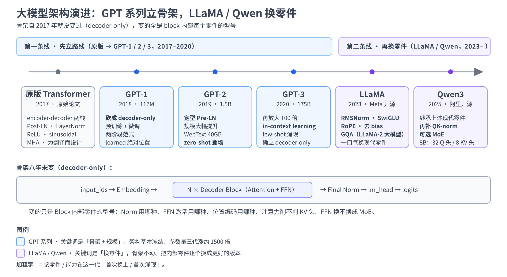

# 第十二章：论文串读——GPT 系列演进与 LLaMA / Qwen 的现代改动

上一章我们逐节读完了 2017 年那篇奠基论文，末尾留了一张「2017 → 今天」的对照表：整体架构从两栈变成 decoder-only，归一化从 Post-LN 换到 Pre-LN、从 LayerNorm 换到 RMSNorm，FFN 的激活从 ReLU 换成 SwiGLU，位置编码从 sinusoidal 换成 RoPE，注意力从 MHA 换成 GQA。那张表的右列，就是**这一章要逐项展开的全部内容**。

这一章咱们不再读单独一篇论文，而是**顺着一条时间线串读一批论文**——这在读文献时叫「survey（综述式阅读）」：不抠某一篇的每个公式，而是把同一条技术脉络上的几篇关键论文摆在一起，看清**每一代相对上一代到底改了什么、为什么改**。我们串两条线：

- **第一条线（第 2-5 节）：GPT-1 → GPT-2 → GPT-3**，看 **decoder-only 这条路线是怎么一步步被确立**的——从「预训练 + 微调」到「零样本」，再到「few-shot 上下文学习」，规模一路放大到质变。
- **第二条线（第 6 节）：从原版 Transformer 到 LLaMA / Qwen**，把现代大模型相对原版换掉的那批零件（RoPE / RMSNorm / SwiGLU / GQA / MoE）逐项拆开对照。

需要提前说明：**这两条线上用到的零件，前面各章几乎都已经拆过了**——RoPE 在第 4 章、GQA 在第 7 章、RMSNorm / SwiGLU 在第 8 章、decoder-only / Pre-LN / MoE 在第 9 章、in-context learning 也在第 9 章第 4 节点过名。所以本章**凡是前面讲过的组件都只做一句话回顾 + 一个「它是这一代新加/换上的」的时间定位，不重复推导**；真正新增的内容是那条**贯穿多篇论文的演进叙事**，以及「哪一项改动是哪一篇论文、哪一年引入的」这张时间地图。学会这套串读方法，你以后拿到任何一个新模型的 technical report，都能快速定位「它相对上一代改了哪几件事」。

实战依旧 **全程 CPU**：不训练、不推理，只用 `AutoConfig` 读几个真实模型的 config.json（GPT-2、Qwen3-8B），把「论文里说的改动」和「config 里的字段」一一对上，再画一张 GPT-1/2/3 参数量增长图，最后打印一张原版 / GPT-2 / LLaMA / Qwen3 的零件对照矩阵。

> 想直接跑示例？点这里 [](https://colab.research.google.com/github/weiqiangnd/LearningLLM/blob/main/src/12.ipynb)。
>
> **硬件门槛**：概念章，CPU 即可 ✅。本章实战只用 `AutoConfig` 下载几 KB 的 config.json 并画几张小图，Colab 免费 CPU 运行时秒级完成，**不需要 GPU**、也不下载任何模型权重。

## 目录

- [一、承上启下：把上一章那张对照表展开](#一承上启下把上一章那张对照表展开)
  - [1.1 两条主线：先立路线，再换零件](#11-两条主线先立路线再换零件)
  - [1.2 怎么读一串"系列论文"](#12-怎么读一串系列论文)
- [二、GPT-1（2018）：decoder-only 与"预训练→微调"范式](#二gpt-12018decoder-only-与预训练微调范式)
  - [2.1 论文要解决的问题：标注数据太贵](#21-论文要解决的问题标注数据太贵)
  - [2.2 两阶段范式：无监督预训练 + 有监督微调](#22-两阶段范式无监督预训练--有监督微调)
  - [2.3 为什么砍掉 encoder，只留 decoder](#23-为什么砍掉-encoder只留-decoder)
  - [2.4 顺带一提：同期的 BERT 走了另一条路](#24-顺带一提同期的-bert-走了另一条路)
- [三、GPT-2（2019）：规模变大，零样本登场](#三gpt-22019规模变大零样本登场)
  - [3.1 核心主张：语言模型是无监督的多任务学习器](#31-核心主张语言模型是无监督的多任务学习器)
  - [3.2 架构上的三个小改动（Pre-LN 就在这里定型）](#32-架构上的三个小改动pre-ln-就在这里定型)
- [四、GPT-3（2020）：few-shot 上下文学习与规模的质变](#四gpt-32020few-shot-上下文学习与规模的质变)
  - [4.1 175B：把规模推到前所未有](#41-175b把规模推到前所未有)
  - [4.2 in-context learning：不更新参数就能学新任务](#42-in-context-learning不更新参数就能学新任务)
  - [4.3 GPT 三代的数字对照表](#43-gpt-三代的数字对照表)
- [五、小结这条线：decoder-only 路线是怎么确立的](#五小结这条线decoder-only-路线是怎么确立的)
- [六、LLaMA / Qwen 的现代改动逐项拆解](#六llama--qwen-的现代改动逐项拆解)
  - [6.1 RoPE：绝对位置编码 → 旋转式相对位置](#61-rope绝对位置编码--旋转式相对位置)
  - [6.2 RMSNorm：LayerNorm 砍掉一半](#62-rmsnormlayernorm-砍掉一半)
  - [6.3 SwiGLU：给 FFN 加一道门控](#63-swiglu给-ffn-加一道门控)
  - [6.4 GQA：为省 KV cache 削减 K/V 头](#64-gqa为省-kv-cache-削减-kv-头)
  - [6.5 MoE：把一个 FFN 换成一堆稀疏专家](#65-moe把一个-ffn-换成一堆稀疏专家)
  - [6.6 一堆小改动：去 bias、QK-norm、weight tying](#66-一堆小改动去-biasqk-normweight-tying)
  - [6.7 零件对照矩阵：原版 / GPT-2 / LLaMA / Qwen3](#67-零件对照矩阵原版--gpt-2--llama--qwen3)
- [七、实战：从 config 读懂演进](#七实战从-config-读懂演进)
  - [7.1 环境自检与依赖](#71-环境自检与依赖)
  - [7.2 读 GPT-2 config：早期 decoder-only 长什么样](#72-读-gpt-2-config早期-decoder-only-长什么样)
  - [7.3 读 Qwen3-8B config：现代改动逐项对上](#73-读-qwen3-8b-config现代改动逐项对上)
  - [7.4 画 GPT-1/2/3 参数量增长](#74-画-gpt-123-参数量增长)
  - [7.5 打印零件对照矩阵](#75-打印零件对照矩阵)
- [八、关键概念回顾](#八关键概念回顾)
- [九、本章小结](#九本章小结)

---

## 一、承上启下：把上一章那张对照表展开

### 1.1 两条主线：先立路线，再换零件

第 11 章我们把 2017 原版 Transformer 从头读了一遍，也点出了它和今天大模型的差距。可从「2017 的原版」到「今天的 Qwen3」，中间不是一步跨过去的——是一连串论文，每篇改一两件事，攒了七八年才成今天这个样子。这一章就是把这条路上的几个关键节点串起来。

这条路可以清清楚楚地分成**两段**，正好对应本章的两条线：

- **先立路线**：原版是为翻译设计的 encoder-decoder 两栈。OpenAI 的 GPT 系列（2018-2020）做的事，是把它**裁成 decoder-only 一栈**，并证明「这一栈 + 大规模预训练」这条路能通到什么高度。这一段的关键词是**架构选型和规模**，不怎么动零件本身。
- **再换零件**：decoder-only 这个骨架定下来之后，2020 年往后的改进就不再动「一个栈还是两个栈」了，而是**在这个固定骨架上，把内部的零件一个个换成更好的版本**——位置编码换 RoPE、归一化换 RMSNorm、FFN 换 SwiGLU、注意力换 GQA、FFN 有时还换成 MoE。LLaMA（Meta，2023）和 Qwen（阿里，2023 起）是这一段最有代表性的开源模型。

一句话概括：**GPT 系列定下了「用哪种骨架、做到多大」，LLaMA / Qwen 定下了「这个骨架里每个零件用什么型号」。** 这一章就顺着这两段各走一遍。下面这张图先把全章的路线摆出来——上半部分是两条线上的六个节点、每个节点相对上一代的关键 delta，下半部分是那条八年未变的 decoder-only 骨架：



图里蓝 / 紫两色卡片中加粗的字，标的是「这一项在这一代首次换上 / 首次涌现」——读完全章再回看这张图，每个节点你都能自己讲一遍。

### 1.2 怎么读一串"系列论文"

读单篇论文（第 11 章）和读一串系列论文，方法不太一样。读单篇是「把这一篇的每个设计搞懂」；读系列则是**盯住每一代相对上一代的增量改动**——每一代论文你只需要问三个问题（delta 就是「增量」的意思）：

1. **上一代的瓶颈是什么？**（这一代想解决什么）
2. **这一代改了哪几件事？**（架构、数据、规模，通常就一两处关键改动）
3. **改完之后多出了什么新能力？**（zero-shot、few-shot、更长上下文……）

抓住这三问，你不用逐字读完每篇论文，也能把一条技术线的来龙去脉讲清楚。下面读 GPT-1/2/3 就用这个框架：每一节开头先说它相对上一代的 delta，再展开细节。

---

## 二、GPT-1（2018）：decoder-only 与"预训练→微调"范式

> **这一代的 delta**：第一次证明「**在海量无标注文本上用 Transformer decoder 做自回归预训练，再在下游任务上微调**」这套两阶段范式能大幅超过从零训练的专用模型。它奠定了后面所有 GPT 的骨架——**decoder-only**。

GPT-1 的论文题目是《Improving Language Understanding by Generative Pre-Training》（Radford 等，OpenAI，2018）。"Generative Pre-Training" 缩写就是 **GPT**。

### 2.1 论文要解决的问题：标注数据太贵

2018 年之前，NLP 做一个具体任务（情感分类、蕴含判断、问答……）的通常做法是：为这个任务**专门标一批带标签的数据**，从零训一个模型。问题是**带标签的数据又少又贵**（要人工标注），而**无标签的文本几乎无限**（整个互联网）。论文的核心动机就一句话：**能不能先在海量无标签文本上把语言的通用规律学出来，再用少量标注数据微调到具体任务上？**

这正是第 10 章讲的**自回归语言建模目标**能派上用场的地方——预测下一个 token 这件事**不需要任何人工标注**，语料自己就是答案（第 $t$ 个 token 的「标签」就是语料里第 $t+1$ 个 token）。所以拿它做预训练，等于免费从无标注文本里榨监督信号。

### 2.2 两阶段范式：无监督预训练 + 有监督微调

GPT-1 的方法就两个阶段，这套范式一直影响到今天：

- **阶段一（预训练）**：在 BooksCorpus（约 7000 本书、≈5 GB 文本）上做标准的自回归语言建模——最大化 $\sum_t \log P_\theta(w_t \mid w_{t-k}, \dots, w_{t-1})$ ，也就是第 10 章那个「让真实语料最可能」的目标。模型是一个 12 层的 Transformer decoder。
- **阶段二（微调）**：把预训练好的模型接一个小小的任务头（比如分类就接一个线性层），在下游任务的标注数据上继续训。论文的一个技巧是**把不同任务的输入都改写成一段连续的 token 序列**（用特殊分隔符拼接），这样同一个 decoder 骨架不用改结构就能适配多种任务——这已经有点「一切皆序列」的味道了。

结果是：在当时的 12 个 NLP 任务里，有 9 个刷新了最好成绩。**「预训练一个通用模型 + 轻量微调到下游」这套路子，从此成了 NLP 的主流范式**——今天的 SFT / LoRA（第 28-38 章）本质上还是这套两阶段思路的延续，只不过预训练模型换成了几百上千亿参数的大模型。

### 2.3 为什么砍掉 encoder，只留 decoder

原版 Transformer 是 encoder + decoder 两栈（第 9 章第 3 节），GPT-1 只取了 **decoder 那一栈**（去掉 cross-attention 后的版本）。为什么这么裁？第 9 章第 4 节已经把这笔账算透了，这里只回顾结论：

- **训练信号最密**：因果语言建模让一段长度 $L$ 的文本里，几乎每个 token 都是一次「预测下一个」的监督，一次前向产生 $L-1$ 条监督信号，数据利用率拉满。
- **推理最省**：因果掩码保证「前面 token 的表示不依赖后面」，天生适配 KV cache（第 14 章）。
- **任务最统一**：一切都能写成「给一段前文、续写下去」，不用像 encoder-decoder 那样为每类任务设计输入输出格式。

GPT-1 时还看不出这三点有多致命的优势（那会儿它只是「效果不错的一种选择」），但正是这三点，让 decoder-only 在后面几年一路赢到成为事实标准。

### 2.4 顺带一提：同期的 BERT 走了另一条路

几乎同时（2018 年底），Google 的 **BERT** 用的是 **encoder-only** 栈 + **掩码语言建模（MLM）**——随机盖住句子里一部分 token、让模型**同时看左右两边**去猜被盖住的词。BERT 是**双向**的（每个位置能看到整句话），在「理解类」任务（分类、抽取、检索）上一度全面压过 GPT。

所以 2018 那会儿其实是**两条路线并行**：GPT 走「单向 + 生成」，BERT 走「双向 + 理解」。为什么最后是 GPT 这条单向路线通向了今天的大模型？核心就在第 9 章第 4 节讲的：**单向的因果语言建模能把所有任务统一成「续写」，且 scale 到足够大以后 in-context learning 会自己涌现**——而这两点恰恰是 GPT-2、GPT-3 接下来要证明的事。BERT 那条路今天仍活在检索 / embedding 模型里（第 49 章），但通用大模型的主赛道被 GPT 这条路拿下了。

---

## 三、GPT-2（2019）：规模变大，零样本登场

> **这一代的 delta**：**骨架几乎不变，把规模和数据大幅拉大**（最大 1.5B 参数、40 GB 的 WebText），并提出一个大胆主张——**足够强的语言模型不微调也能直接做任务（zero-shot，零样本）**。架构上只有几处工程性小改，其中就包括把 Pre-LN 定为默认。

GPT-2 的论文题目是《Language Models are Unsupervised Multitask Learners》（Radford 等，OpenAI，2019）。

### 3.1 核心主张：语言模型是无监督的多任务学习器

GPT-1 还需要「阶段二微调」才能做下游任务。GPT-2 想更进一步：**如果预训练语料足够大、足够杂，模型是不是根本不用微调，直接就会做很多任务？**

背后的直觉是：互联网文本里**本来就天然包含各种任务的示范**。翻译任务的语料里会自然出现「英文句子（法文翻译）」这样的配对；问答的语料里会出现「问题？答案。」这样的模式。所以一个在足够杂的语料上训练的语言模型，其实是在**顺带地**学会了一大堆任务——你只要在 prompt 里把任务描述清楚（比如给一段英文、结尾写 "translation to French:"），它就能续写出答案。这就是标题说的「无监督的多任务学习器」。

GPT-2 用这套思路做了 **zero-shot（零样本）** 测试：**不给任何微调、不给任何示例**，仅靠一句任务提示，就去做翻译、问答、摘要。效果谈不上惊艳，但**证明了「规模够大时，任务能力会从纯语言建模里自己冒出来」**——这颗种子，到 GPT-3 就长成了参天大树。

### 3.2 架构上的三个小改动（Pre-LN 就在这里定型）

GPT-2 的模型结构和 GPT-1 基本一样，论文里只提了几处工程性调整。这几处第 8、9 章都讲过原理，这里只做时间定位——**它们是从 GPT-2 这一代开始成为默认的**：

- **LayerNorm 挪到子层输入端（Pre-LN）**：原版和 GPT-1 是 Post-LN（ $\text{LayerNorm}(x + \text{Sublayer}(x))$ ），GPT-2 把 LayerNorm 移到每个子层**之前**（ $x + \text{Sublayer}(\text{LayerNorm}(x))$ ）。原理见第 8 章第 3 节、第 9 章第 5 节：Pre-LN 让残差成为一条干净的恒等高速公路，深层才训得稳。**「GPT-2 起，主流大模型清一色 Pre-LN」这句话，说的就是这处改动。**
- **最后一个 block 之后再加一道 LayerNorm（final norm）**：Pre-LN 的残差流会一路累加、幅度越来越大，所以在 lm_head 之前补一道归一化把它拉回正常尺度。第 9 章第 2 节画的那条流水线里，`Final Norm` 这一环就是它。
- **残差投影的初始化按 $1/\sqrt{N}$ 缩放**（ $N$ 为残差层数，约 2× block 层数——每个 block 有注意力、FFN 两条残差）：层数一多，几十条残差增量累加起来会让激活爆掉，所以把每个子层输出投影的初始权重按残差层数开根号缩小，抵消这种累加。这是个纯粹的**训练稳定性**技巧。

除此之外，GPT-2 还把上下文长度从 512 提到 1024、词表提到 50257、用 byte-level BPE（第 3 章的 BBPE）。**注意这里没有任何一处是「发明新组件」——全是把已有零件调参、换位置、扩规模**。这也印证了本章开头那句：GPT 系列这条线的关键词是**骨架和规模**，不是零件本身。

---

## 四、GPT-3（2020）：few-shot 上下文学习与规模的质变

> **这一代的 delta**：把规模**再放大两个数量级到 175B**，骨架依旧几乎不动，却涌现出一个谁也没直接训练过的新能力——**in-context learning（上下文学习）**：在 prompt 里给几个示范（few-shot），模型**不更新任何参数**就能照着做新任务。这是「量变引起质变」最经典的一个案例。

GPT-3 的论文题目是《Language Models are Few-Shot Learners》（Brown 等，OpenAI，2020）。光看标题就知道，它接着 GPT-2「zero-shot」的话头，往前推到了「few-shot」。

### 4.1 175B：把规模推到前所未有

GPT-3 最大的型号有 **1750 亿（175B）参数、96 层、 $d_{\text{model}} = 12288$ 、96 个注意力头**，在约 3000 亿 token 的语料上训练。相比 GPT-2 的 1.5B，参数量涨了 **100 多倍**。架构上唯一值得一提的改动是**注意力层交替使用稠密（dense）和局部带状稀疏（locally banded sparse）注意力**（一种省显存的稀疏注意力，思路和第 23 章的 sliding window 一脉相承）——除此之外，**还是那套 decoder-only + Pre-LN 骨架**。

这里第一次清晰地显现出一件事：**这套骨架的主要「旋钮」就是规模**——把宽度（ $d_{\text{model}}$ ）、深度（层数）、头数一起往上推，模型能力就随之增长。至于「推多大最划算」，是第 21 章 scaling law 要回答的问题；GPT-3 用行动给出的答案是「再大两个数量级，会有惊喜」。

### 4.2 in-context learning：不更新参数就能学新任务

GPT-3 论文最重要的发现，是 **in-context learning（上下文学习，也叫上下文内学习）**。第 9 章第 4 节点过名，这里把它讲清楚。

传统的「学一个新任务」= 拿这个任务的数据去**更新模型参数**（训练 / 微调）。in-context learning 完全不动参数，而是**把示范直接写进 prompt**，让模型在这一次前向推理里「现学现用」。按 prompt 里给几个示范，分成三档：

- **zero-shot（零样本）**：只给任务描述，不给示例。如 `把下面这句翻成法语：I love you =>`
- **one-shot（单样本）**：给 1 个示例再让它做。
- **few-shot（少样本）**：给几个（通常几到几十个）示例再让它做。如：

      把英语翻成法语：
      sea otter => loutre de mer
      cheese => fromage
      I love you =>          ← 模型在这里续写出 "je t'aime"

关键在于：**从头到尾没有任何一次反向传播、没有更新一个参数**。模型只是「读到」prompt 里的几个示范，就在这一次生成里照着模式续写。这几乎重写了 NLP 的使用方式——**过去用一个模型要先为每个任务训练，现在只要会写 prompt**。第 48 章的 prompt 工程、few-shot、CoT 全都建立在这个能力之上。

为什么 in-context learning 会出现？至今没有完全定论，但有一个朴素的直觉：GPT-2 那节说过，海量语料里天然混着各种任务的示范模式；模型大到一定程度，就学会了**识别 prompt 里正在演示的是什么模式、并把它延续下去**这种更抽象的能力。而这个能力**只在模型足够大时才明显涌现**——小模型 few-shot 几乎没有增益，大模型才有。这正是「规模带来质变」的典型证据，也是 GPT-3 之所以震动整个领域的原因。

### 4.3 GPT 三代的数字对照表

把三代的关键数字并排，最能看出这条线「骨架不大改、规模猛拉」的特点：

| 指标 | GPT-1（2018） | GPT-2（2019，最大） | GPT-3（2020，最大） |
|------|--------------|--------------------|--------------------|
| 参数量 | 117 M | 1.5 B | 175 B |
| 层数 | 12 | 48 | 96 |
| $d_{\text{model}}$ | 768 | 1600 | 12288 |
| 注意力头数 | 12 | 25 | 96 |
| 上下文长度 | 512 | 1024 | 2048 |
| 训练数据 | BooksCorpus（≈5 GB） | WebText（≈40 GB） | ≈570 GB（≈300 B token） |
| 归一化位置 | Post-LN | **Pre-LN** | Pre-LN |
| 位置编码 | learned 绝对 | learned 绝对 | learned 绝对 |
| 代表能力 | 预训练 + 微调 | zero-shot | **few-shot（in-context learning）** |

看这张表最该注意两件事：一是**参数量三代涨了约 1500 倍**，而**架构上的实质改动只有 GPT-2 那处 Post-LN → Pre-LN**——「规模是主旋律、架构基本冻结」写在脸上；二是**位置编码三代都是 learned 绝对位置编码**（第 4 章），还没换成 RoPE——**RoPE 是下一条线（LLaMA / Qwen）才引入的**，这正好把话题交接到第 6 节。

---

## 五、小结这条线：decoder-only 路线是怎么确立的

把 GPT-1/2/3 这条线用一句话收束：

> **GPT-1 证明了「decoder-only + 预训练」这条路能走通，GPT-2 证明了「规模够大能不微调直接做任务」，GPT-3 证明了「规模再大两个数量级会涌现 in-context learning」。三代下来，decoder-only 从「一种不错的选择」变成了「通用大模型的事实标准」。**

到 GPT-3 之后，「一个栈还是两个栈」这个问题基本没人再争了——**decoder-only 赢下了通用大模型这条主赛道**（第 9 章第 4 节详细算过这笔账）。于是接下来几年，社区的注意力从「选哪种架构」转向了「**在这个已经定型的骨架里，把每个零件换成更好的版本**」。这就是第二条线——LLaMA / Qwen 的现代改动。

---

## 六、LLaMA / Qwen 的现代改动逐项拆解

2023 年 Meta 开源 **LLaMA**、阿里开源 **Qwen**，把「decoder-only 骨架 + 一套现代零件」的配方推广到了整个开源社区。这套配方相对原版 Transformer（乃至 GPT-3）换掉的零件，**前面各章几乎都拆过**，所以这一节每个零件只做一句话回顾 + 一句「它换在哪、为什么」，重点是把它们凑成一张完整的对照表。

先看它们共同的骨架长什么样——这也是今天绝大多数开源大模型的标准配置：

```
input_ids
  → Token Embedding
  → N × Decoder Block:
        x → RMSNorm → GQA(带 RoPE) → +残差
        x → RMSNorm → SwiGLU FFN   → +残差    ← MoE 版把这个 FFN 换成「路由器 + 多个专家」
  → Final RMSNorm
  → lm_head → logits
```

对照第 9 章第 2 节那条「原版风格」的流水线，骨架一模一样（embedding → N 个形状守恒的 block → final norm → lm_head），**变的全是 block 内部每个零件的型号**。下面逐个说。

### 6.1 RoPE：绝对位置编码 → 旋转式相对位置

**一句话回顾**（详见第 4 章）：RoPE（旋转位置编码）不在输入上加一个位置向量，而是**在每一层的 Q、K 上按位置施加一个旋转**，让两个 token 的注意力分数只依赖它们的**相对距离**。

**换在哪**：原版和 GPT-1/2/3 用的都是**绝对位置编码**（sinusoidal 或 learned，第 4 章）——位置信息在输入端一次性加好。LLaMA / Qwen 换成 RoPE，好处是**相对位置**天然更贴合语言（"第 5 个词和第 3 个词隔了 2 位"比"它俩分别在第 5、第 3 位"更本质），而且**便于外推到比训练时更长的序列**（第 23 章的长上下文外推、YaRN 全建立在 RoPE 上）。config 里的 `rope_theta`（RoPE 的底数 $\theta$ ）就是它的关键超参。

### 6.2 RMSNorm：LayerNorm 砍掉一半

**一句话回顾**（详见第 8 章第 3 节）：RMSNorm 相对 LayerNorm **去掉了「减均值」和 bias**，只用均方根（root mean square）做缩放： $\text{RMSNorm}(x) = \dfrac{x}{\sqrt{\frac{1}{d}\sum_i x_i^2 + \epsilon}} \cdot g$ ，其中 $g$ 是可学习的缩放向量。

**换在哪**：原版和 GPT 系列用 LayerNorm，LLaMA / Qwen 换成 RMSNorm。动机很实在——**更省、更快，效果基本不掉**：少算一个均值、少一组 bias 参数，在几十上百层里累积起来就是可观的计算节省。config 里的 `rms_norm_eps` 就是上面公式里的 $\epsilon$ 。位置上它仍然是 **Pre-Norm**（GPT-2 定下的 Pre-LN 传统，只是把 Norm 的型号从 LayerNorm 换成 RMSNorm）。

### 6.3 SwiGLU：给 FFN 加一道门控

**一句话回顾**（详见第 8 章第 4 节）：SwiGLU 把 FFN 的「升维 → 激活 → 降维」升级成**门控**结构—— $\text{SwiGLU}(x) = \big(\text{SiLU}(xW_{\text{gate}}) \odot (xW_{\text{up}})\big) W_{\text{down}}$ ，用一条 SiLU 激活的「门」去逐元素调制另一条线性变换。因为多了一个门控矩阵，为对齐参数量，中间维度 $d_{\text{ff}}$ 从原版的 $4 d_{\text{model}}$ 收到约 $\frac{8}{3} d_{\text{model}}$ （这是 LLaMA 的惯例值，不同模型略有出入，如 Qwen3-8B 约 $3 d_{\text{model}}$ ）。

**换在哪**：激活函数一路是 ReLU（原版）→ GELU（GPT 系列）→ **SwiGLU**（LLaMA / Qwen）。动机是**同样参数量下效果更好**，代价是 FFN 里多一个矩阵（三个投影而非两个）。config 里 `hidden_act` 为 `silu`、且有 `gate_proj` / `up_proj` / `down_proj` 三个投影，就是 SwiGLU 的标志。

### 6.4 GQA：为省 KV cache 削减 K/V 头

**一句话回顾**（详见第 7 章）：GQA（分组查询注意力）让 **query 头数保持 $H$ 不变、只削减 K/V 头数到 $G$ 组**，每组 K/V 被多个 query 头共享（ $G=H$ 即退化回 MHA、 $G=1$ 即 MQA）。

**换在哪**：原版和 GPT 系列用标准 MHA（Q/K/V 头数相等）。LLaMA-2 的大号和 Qwen 换成 GQA，动机是**推理时 KV cache 太占显存**——KV cache 的大小正比于 K/V 头数，把 K/V 头砍到 1/4，KV cache 就省 3/4，长上下文推理才吃得消（第 14 章）。config 里 `num_attention_heads`（query 头数）**大于** `num_key_value_heads`（KV 头数）就是 GQA 的标志；Qwen3-8B 是 32 query 头 / 8 KV 头。

### 6.5 MoE：把一个 FFN 换成一堆稀疏专家

**一句话回顾**（详见第 9 章第 6 节，第 22 章展开）：MoE（混合专家）把每层那**一个** FFN 换成 $E$ 个并列的「专家 FFN」加一个**路由器**，每个 token 只被路由到其中 $k$ 个专家去算。这样**总参数量能涨十几倍、但单个 token 的计算量几乎不变**——「模型很大，但每次只调用一小部分」。

**换在哪**：这是可选项，不是所有型号都用。原版 / GPT-1/2/3 / LLaMA 稠密版 / Qwen 稠密版都是**每层一个稠密 FFN**；而 Qwen3 的 MoE 版、DeepSeek-V3 等把 FFN 换成 MoE。它动的只是 **FFN 子层**，注意力、残差、归一化那套骨架原封不动——这也再次说明这套 decoder-only 骨架有多能装。细节留到第 22 章展开。

### 6.6 一堆小改动：去 bias、QK-norm、weight tying

除了上面五个「大件」，现代模型还有一批**不改变整体形状的小改良**（第 9 章第 6 节列过，这里归拢一下）：

- **去掉线性层的 bias**：LLaMA / Qwen 的多数线性投影（Q/K/V/O、FFN 的三个投影）**不带 bias**。少一组 bias 参数、对效果几乎无影响，还略微稳一点。
- **QK-norm**：在 Q、K 投影之后各加一道 RMSNorm 再去算注意力（Qwen3 用了），让注意力分数的尺度更稳、长训练更不容易发散。注意 QK-norm 是**结构上的小改良**（对 Q、K 各做一次归一化），跟第 28 章的 fine-tuning（微调，一种训练方法）不是一回事。
- **weight tying（权重共享）**：token embedding 和 lm_head 共享同一个矩阵（互为转置，第 4 章讲过）。小模型上省参数明显（两端各占词表 × $d_{\text{model}}$ ），所以 Qwen3 的小号（如 0.6B / 1.7B）默认 tie、大号（8B 及以上）默认不 tie——config 里 `tie_word_embeddings` 字段记录这个选择。

这些小改动单看每个都不起眼，但「**能省就省、能稳就稳**」的工程哲学，正是现代大模型配方的底色。

### 6.7 零件对照矩阵：原版 / GPT-2 / LLaMA / Qwen3

把本章两条线的结论汇成一张矩阵——每一列是一个模型，每一行是一个零件，一眼看清「哪一项是哪一代换上的」：

| 零件 | 原版 Transformer（2017） | GPT-2（2019） | LLaMA（2023） | Qwen3（2025） |
|------|------------------------|--------------|--------------|--------------|
| 整体架构 | encoder-decoder 两栈 | decoder-only | decoder-only | decoder-only |
| 归一化位置 | Post-LN | **Pre-LN** | Pre-LN | Pre-LN |
| 归一化类型 | LayerNorm | LayerNorm | **RMSNorm** | RMSNorm |
| FFN 激活 | ReLU | GELU | **SwiGLU** | SwiGLU |
| 位置编码 | sinusoidal 绝对 | learned 绝对 | **RoPE** | RoPE |
| 注意力 | MHA | MHA | MHA → **GQA**（LLaMA-2 大号） | GQA |
| 线性层 bias | 有 | 有 | **无** | 无 |
| QK-norm | 无 | 无 | 无 | **有** |
| FFN 变体 | 稠密 | 稠密 | 稠密 | 稠密 / **MoE**（可选） |

加粗的单元格标出「这一项在这一代**首次**换上」。有三项要单独说明：**decoder-only、GELU、learned 绝对位置其实都是 GPT-1（2018，表中未单列）首先用上的**，GPT-2 只是沿用，所以这三项在 GPT-2 列都不加粗（表里能看到它们相对原版确实变了，但「首次」不落在 GPT-2）。真正由 GPT-2 首次立起的是 **Pre-LN**；从它这个加粗格起顺着往右读，就是一部浓缩的大模型架构演进史：**GPT-2 立起 Pre-LN，LLaMA 一口气换上 RMSNorm / SwiGLU / RoPE / GQA / 去 bias 这套现代零件，Qwen3 再补上 QK-norm 和可选的 MoE。** 骨架自 2017 年就没变过，变的全是零件的型号——这正是第 11 章那句话的完整展开：**Transformer 的骨架八年未变，后来的进步都是在这个骨架上换更好的零件。**

---

## 七、实战：从 config 读懂演进

本章实战不训练、不推理，只做一件事：**用 `AutoConfig` 把上面几张表里的「论文说法」和真实模型 config.json 里的「字段值」一一对上**。全程 CPU、只下载几 KB 的 json。实战代码分成下面几个 Cell（与本章 `.ipynb` 逐字一致）。

### 7.1 环境自检与依赖

```python
# ============================================================
# Cell 0: 环境自检（本章纯 CPU 即可，无需 GPU）
# ============================================================
# 本章只读几个模型的 config.json（各几 KB）并画几张小图，全程 CPU 秒级完成，
# 不下载任何模型权重、不做任何前向 / 反向。
import sys, platform
import torch

print("Python:", sys.version.split()[0])
print("平台:", platform.platform())
print("PyTorch:", torch.__version__)
print("CUDA 可用:", torch.cuda.is_available(), "（本章用不到，CPU 即可）")
```

```python
%%capture
# ============================================================
# Cell 1: 安装依赖
# ============================================================
# %%capture 必须是 cell 第一行，把 pip 安装日志藏起来。
# transformers: 用 AutoConfig 读 config；GPT-2 是老模型不挑版本，Qwen3 要求 >=4.51，
#               故统一锁 >=4.51 一次装好。matplotlib / torch: Colab 默认已装。
!pip install -q -U "transformers>=4.51"
```

### 7.2 读 GPT-2 config：早期 decoder-only 长什么样

先读 GPT-2（HuggingFace 上的 `gpt2`，即 124M 的小号），看看 GPT 系列早期这套「decoder-only + learned 绝对位置 + GELU」的配置。注意 GPT-2 的 config 字段名和现代模型不一样（`n_layer` / `n_embd` / `n_head`），这本身也说明了「配置命名都还没统一」的年代感。

```python
# ============================================================
# Cell 2: 读 GPT-2 config，看早期 decoder-only 的配置
# ============================================================
from transformers import AutoConfig

# gpt2 = GPT-2 小号（124M）。AutoConfig 只下载 config.json（几 KB），不下载权重。
gpt2 = AutoConfig.from_pretrained("gpt2")

print("GPT-2 (124M) 关键配置：")
print(f"  层数         n_layer            = {gpt2.n_layer}")
print(f"  隐藏维度     n_embd             = {gpt2.n_embd}")
print(f"  注意力头数   n_head             = {gpt2.n_head}")
print(f"  上下文长度   n_positions        = {gpt2.n_positions}")
print(f"  词表大小     vocab_size         = {gpt2.vocab_size}")
print(f"  激活函数     activation_function= {gpt2.activation_function}")  # gelu_new
# GPT-2 的位置编码是 learned 绝对：config 里体现为有一张 n_positions 长的位置 embedding 表
# （wpe），而不像现代模型那样带 rope_theta。下面这句确认它【没有】rope 相关字段。
print(f"  有 rope_theta 吗？             = {hasattr(gpt2, 'rope_theta')}  (False => 用 learned 绝对位置，不是 RoPE)")
print(f"  归一化 eps   layer_norm_epsilon = {gpt2.layer_norm_epsilon}  (LayerNorm，不是 RMSNorm)")
```

跑出来能看到：GPT-2 小号是 12 层、 $d_{\text{model}} = 768$ 、12 头、上下文 1024、GELU 激活、LayerNorm、**没有** `rope_theta`（用的是 learned 绝对位置）。注意这里读的是 124M **小号**，层数 / 维度都是小号的数（第 4 节表里 GPT-2 那一列取的是 1.5B 最大号，48 层 / 1600）；真正能和表对上的是**定性特征**——**位置编码还是绝对的、激活还是 GELU、归一化还是 LayerNorm**，现代那套零件一个都还没换上。

### 7.3 读 Qwen3-8B config：现代改动逐项对上

再读一次 Qwen3-8B（第 11 章末尾读过一次，这里换个角度：逐项对上第 6 节的「现代改动」清单）。

```python
# ============================================================
# Cell 3: 读 Qwen3-8B config，逐项对上第 6 节的现代改动
# ============================================================
from transformers import AutoConfig

cfg = AutoConfig.from_pretrained("Qwen/Qwen3-8B")

# rope_theta 在 config 里的位置随 transformers 版本而变：有的版本放在顶层 cfg.rope_theta，
# 有的挪进嵌套字典 cfg.rope_parameters["rope_theta"]。下面两处都试，兼容新旧版本。
rope_theta = getattr(cfg, "rope_theta", None)
if rope_theta is None:
    rope_theta = (getattr(cfg, "rope_parameters", None) or {}).get("rope_theta")

print("Qwen3-8B 关键配置（对上第 6 节现代改动清单）：")
print(f"  层数           num_hidden_layers   = {cfg.num_hidden_layers}")
print(f"  隐藏维度       hidden_size         = {cfg.hidden_size}")
print(f"  FFN 中间维度   intermediate_size   = {cfg.intermediate_size}")
print(f"  query 头数     num_attention_heads = {cfg.num_attention_heads}")
print(f"  KV 头数        num_key_value_heads = {cfg.num_key_value_heads}")
print(f"  RoPE base      rope_theta          = {rope_theta}")
print(f"  归一化 eps     rms_norm_eps        = {cfg.rms_norm_eps}")
print(f"  激活函数       hidden_act          = {cfg.hidden_act}")
print(f"  词表大小       vocab_size          = {cfg.vocab_size}")
print(f"  权重共享       tie_word_embeddings = {cfg.tie_word_embeddings}")

print("\n逐项对上第 6 节：")
print(f"  6.1 RoPE   ：有 rope_theta={rope_theta}      => 用 RoPE（非绝对位置）")
print(f"  6.2 RMSNorm：有 rms_norm_eps={cfg.rms_norm_eps} => 用 RMSNorm（非 LayerNorm）")
print(f"  6.3 SwiGLU ：hidden_act={cfg.hidden_act}        => SiLU 门控，即 SwiGLU（非 ReLU/GELU）")
print(f"  6.4 GQA    ：{cfg.num_attention_heads} query 头 > {cfg.num_key_value_heads} KV 头 => GQA（非 MHA）")
print(f"  6.5 MoE    ：Qwen3-8B 是稠密版、无 MoE 字段，故此处不列（MoE 版才有 num_experts 等字段）")
print(f"  6.6 tying  ：tie_word_embeddings={cfg.tie_word_embeddings}  => 8B 是大号，默认不共享")
```

对比 7.2 和 7.3 两段输出，第 6 节讲的每一项改动都能在 config 里找到对应字段：Qwen3-8B **有** `rope_theta`（RoPE）、**有** `rms_norm_eps`（RMSNorm）、`hidden_act` 是 `silu`（SwiGLU）、`num_attention_heads`（32）> `num_key_value_heads`（8）（GQA）——而 GPT-2 这些字段要么没有、要么是老式的 LayerNorm / GELU / 绝对位置。**「论文说换了什么」和「config 里改了哪个字段」，就这么对上了。**

### 7.4 画 GPT-1/2/3 参数量增长

把第 4.3 节那张表里的参数量画成图，直观感受「三代涨了约 1500 倍」是什么概念。参数量跨度太大，用对数纵轴才看得清。

```python
# ============================================================
# Cell 4: 可视化 GPT-1/2/3 的参数量增长（对数纵轴）
# ============================================================
import matplotlib.pyplot as plt

models = ["GPT-1\n(2018)", "GPT-2\n(2019)", "GPT-3\n(2020)"]
params_b = [0.117, 1.5, 175.0]   # 单位：十亿（B）参数：117M / 1.5B / 175B

fig, ax = plt.subplots(figsize=(7, 4.5))
bars = ax.bar(models, params_b, color=["#93c5fd", "#60a5fa", "#2563eb"])
ax.set_yscale("log")             # 参数量跨 3 个数量级，线性轴会把前两根压成 0，必须用对数轴
ax.set_ylabel("Parameters (Billions, log scale)")
ax.set_title("GPT-1 -> GPT-2 -> GPT-3: ~1500x parameter growth in 2 years")
# 在每根柱子顶上标注具体数值
for b, p in zip(bars, params_b):
    label = f"{p*1000:.0f}M" if p < 1 else f"{p:.1f}B"
    ax.text(b.get_x() + b.get_width() / 2, p * 1.15, label, ha="center", va="bottom")
plt.tight_layout()
plt.show()

# 观察：纵轴每一格是 10 倍。GPT-1(117M) -> GPT-2(1.5B) 约 13 倍，
# GPT-2 -> GPT-3(175B) 约 117 倍，两年累计约 1500 倍——而架构几乎没变。
# 这张图就是「规模是 GPT 系列主旋律」最直白的证据。
```

### 7.5 打印零件对照矩阵

最后把第 6.7 节那张零件对照矩阵用代码打印出来，作为全章结论的实测收尾。这里用一个纯 Python 的二维表（不依赖任何库），把「哪一项在哪一代首次换上」用 `←新` 标出来。

```python
# ============================================================
# Cell 5: 打印「原版 / GPT-2 / LLaMA / Qwen3」零件对照矩阵
# ============================================================
# 每行：(零件, 原版Transformer, GPT-2, LLaMA, Qwen3)。星号 * 标记「这一代首次换上」。
rows = [
    ("整体架构",   "enc-dec 两栈",  "decoder-only",  "decoder-only",  "decoder-only"),
    ("归一化位置", "Post-LN",       "Pre-LN*",       "Pre-LN",        "Pre-LN"),
    ("归一化类型", "LayerNorm",     "LayerNorm",     "RMSNorm*",      "RMSNorm"),
    ("FFN 激活",   "ReLU",          "GELU",          "SwiGLU*",       "SwiGLU"),
    ("位置编码",   "sinusoidal",    "learned 绝对",  "RoPE*",         "RoPE"),
    ("注意力",     "MHA",           "MHA",           "GQA*(2代)",     "GQA"),
    ("线性层 bias","有",            "有",            "无*",           "无"),
    ("QK-norm",    "无",            "无",            "无",            "有*"),
    ("FFN 变体",   "稠密",          "稠密",          "稠密",          "稠密/MoE*"),
]
header = ("零件", "原版(2017)", "GPT-2(2019)", "LLaMA(2023)", "Qwen3(2025)")

# 计算每列宽度做对齐（中文按 2 个显示宽度粗略处理）
def w(s):  # 显示宽度：非 ASCII 记 2、ASCII 记 1
    return sum(2 if ord(c) > 127 else 1 for c in s)
cols = list(zip(header, *rows))
widths = [max(w(str(x)) for x in col) for col in cols]

def fmt_row(cells):
    return " | ".join(str(c) + " " * (widths[i] - w(str(c))) for i, c in enumerate(cells))

print(fmt_row(header))
print("-" * (sum(widths) + 3 * len(widths)))
for r in rows:
    print(fmt_row(r))
print("\n带 * 的是「该零件在这一代首次换上」。decoder-only、GELU、learned 绝对位置都始于 GPT-1（表中未单列），")
print("故 GPT-2 列这三项不带 *；由 GPT-2 首次立起的是 Pre-LN。顺着 * 往右读：GPT-2 立起 Pre-LN，")
print("LLaMA 换上 RMSNorm/SwiGLU/RoPE/GQA/去bias，Qwen3 再补 QK-norm 与可选 MoE。骨架自 2017 未变。")
```

跑出来的这张表，就是本章两条线的最终结论：**GPT 系列（第 2-5 节）把 decoder-only 骨架立了起来，LLaMA / Qwen（第 6 节）把骨架里的零件逐个换新**。你现在拿到任何一个新模型的 config，都能照着这张表快速判断它「用的是哪一代的哪套零件」。

---

## 八、关键概念回顾

- **系列论文的读法**：盯代际之间的 delta——每一代只问三件事「上一代瓶颈是什么、这一代改了哪几件事、多出了什么新能力」，不必逐字读完每篇。
- **GPT-1（2018）**：首次证明「decoder-only + 大规模自回归预训练 + 下游微调」这套两阶段范式能大幅超过专用模型。奠定了 decoder-only 骨架。
- **预训练—微调范式**：先在海量无标注文本上做自回归预训练（免费监督信号），再用少量标注数据微调到下游任务。今天的 SFT / LoRA 是它的延续。
- **GPT-2（2019）**：骨架几乎不变、规模拉到 1.5B，提出「语言模型是无监督多任务学习器」，展示 **zero-shot**。架构上把 **Pre-LN** 定为默认（外加 final norm、 $1/\sqrt{N}$ 残差初始化缩放）。
- **GPT-3（2020）**：规模再放大到 **175B**，涌现出 **in-context learning**——prompt 里给几个示范（few-shot），不更新参数就能做新任务。「量变引起质变」的经典案例。
- **in-context learning（上下文学习）**：把示范写进 prompt、模型在一次前向里现学现用，全程不更新参数。分 zero-shot / one-shot / few-shot 三档；只在模型足够大时明显涌现。是 prompt 工程、few-shot、CoT 的基础。
- **GPT 这条线的关键词是「骨架 + 规模」**：三代参数量涨约 1500 倍，架构实质改动只有 GPT-2 那处 Post-LN → Pre-LN，位置编码三代都还是 learned 绝对。
- **LLaMA / Qwen（2023 起）的现代零件**：RoPE（绝对 → 旋转相对位置，第 4 章）、RMSNorm（LayerNorm 砍掉减均值和 bias，第 8 章）、SwiGLU（给 FFN 加 SiLU 门控，第 8 章）、GQA（削减 K/V 头省 KV cache，第 7 章）、可选 MoE（稠密 FFN → 稀疏专家，第 9、22 章），外加去 bias / QK-norm / weight tying 等小改动。
- **零件对照矩阵**：原版 / GPT-2 / LLaMA / Qwen3 逐行对照，加粗（代码里用 `*`）标出每项零件「首次换上」的那一代——就是一部浓缩的架构演进史。
- **config 字段 ↔ 论文改动的对应**：`rope_theta` ↔ RoPE、`rms_norm_eps` ↔ RMSNorm、`hidden_act=silu` ↔ SwiGLU、`num_attention_heads > num_key_value_heads` ↔ GQA、`tie_word_embeddings` ↔ weight tying。读 config 就能反推一个模型用了哪套零件。

## 九、本章小结

- **本章不引入新组件，做的是一次「论文串读」**：顺两条时间线，把大模型从 2017 原版走到今天 Qwen3 的演进串成一条完整叙事。凡是前面拆过的零件都只做一句话回顾 + 时间定位，重点是那条贯穿多篇论文的脉络。
- **第一条线 GPT-1 → GPT-2 → GPT-3，讲 decoder-only 路线怎么确立**：GPT-1 证明「decoder-only + 预训练」能走通，GPT-2 证明「规模够大能不微调直接做任务（zero-shot）」，GPT-3 证明「规模再大两个数量级会涌现 in-context learning（few-shot）」。三代把 decoder-only 从「一种选择」推成了「事实标准」，而这一路上**架构基本冻结、规模是主旋律**（参数量涨约 1500 倍，实质架构改动只有 Pre-LN 一处）。
- **第二条线原版 → LLaMA / Qwen，讲骨架定型后怎么换零件**：decoder-only 赢下主赛道后，改进从「选架构」转向「在固定骨架里换更好的零件」——RoPE、RMSNorm、SwiGLU、GQA、可选 MoE，外加去 bias / QK-norm / weight tying。这些零件前面各章都拆过，本章把它们凑成一张对照矩阵，看清每一项是哪一代首次换上的。
- **一张零件对照矩阵收束全章**：原版（2017）/ GPT-2（2019）/ LLaMA（2023）/ Qwen3（2025）逐行对照，加粗标出「首次换上」——decoder-only、GELU、learned 绝对位置都始于 GPT-1（表中未单列），GPT-2 首次立起 Pre-LN，LLaMA 一口气换上 RMSNorm / SwiGLU / RoPE / GQA / 去 bias，Qwen3 补上 QK-norm 与可选 MoE。**骨架自 2017 未变，变的全是零件型号**——这正是第 11 章那句话的完整展开。
- **实战我们没训练、没推理，只用 `AutoConfig` 读了 GPT-2 和 Qwen3-8B 的 config**，把「论文说换了什么」和「config 里改了哪个字段」一一对上，画了 GPT-1/2/3 参数量增长图，打印了零件对照矩阵。掌握这套「读 config 反推零件」的本事，你以后拿到任何新模型都能快速判断它的架构谱系。

---

到这里，第 3-12 章这段「Transformer 架构精讲」就全部走完了：我们从 tokenizer 一路拆到整体架构（第 3-9 章）、讲清了自回归训练目标（第 10 章）、精读了奠基论文（第 11 章）、串读了 GPT 与现代模型的演进（本章）。**零件、总装、目标、源流，四件事齐了**。下一章第 13 章，咱们把这些知识落到最实处——**从零实现一个 mini-GPT**，在 tiny-shakespeare 数据集上完整跑通「训练 → 生成」的闭环，亲手验证这一整段学到的所有东西。
