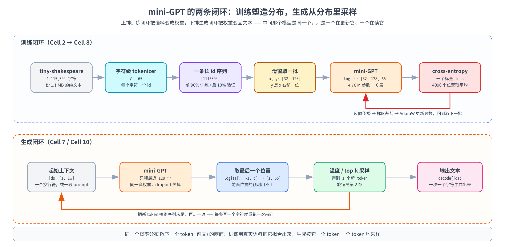
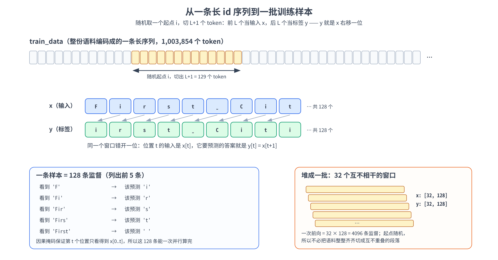

# 第十三章：从零实现 mini-GPT——在 tiny-shakespeare 上跑通训练 → 生成闭环

前边的章节我们做了四件事：把零件一个个拆开（tokenizer、embedding、attention、FFN、归一化，第 3-8 章）、把它们总装成 decoder-only 骨架（第 9 章）、再讲清了这个骨架的训练目标是什么（第 10 章），最后顺着论文把这套东西的来历读了一遍（第 11-12 章）。零件、总装、目标、源流，四件事齐了——**唯独还差一件：真的训一个模型出来**。

这一章就补上这最后一步。我们要从一份 1.1 MB 的莎士比亚剧本文本出发，**不调用任何现成的模型类**，一路走完：

> 语料 → 切成 token → 编码成 id → 切成训练批次 → 搭模型 → 训练循环 → 采样生成 → 存档

跑完你会看到一个约 4.8 M 参数的小模型，从最初吐出的纯乱码，变成能写出带分行、带「角色名 + 冒号」、词形像模像样、句读也有几分莎士比亚腔的文本。它当然写不出真正通顺的句子（4.8 M 参数、1 MB 数据，做不到），但**这条「训练 → 生成」闭环上的每一个环节，都是你亲手写出来、再一环一环串起来的**——这正是本章的目的。

要提醒一句期望值：本章不追求把模型训得多好，追求的是**把链路打通、把每个环节为什么这么写讲清楚**。真实预训练与这一章的差距，我们放在第 8 节专门做一次对照。

> 想直接跑示例？点这里 [](https://colab.research.google.com/github/weiqiangnd/LearningLLM/blob/main/src/13.ipynb)。
>
> **硬件门槛**：T4（15 GB）✅。模型只有约 4.8 M 参数，显存占用不到 1 GB，3000 步训练在 T4 上约 3 分钟。**没有 GPU 也能 Run All**（代码会自动退回 CPU），只是训练那一步约需 1 小时；想先快速走通流程，把训练 cell 里的 `max_steps` 调成 500 即可。

## 目录

- [一、这一章要做什么](#一这一章要做什么)
  - [1.1 从「读懂」到「造出来」](#11-从读懂到造出来)
  - [1.2 一个完整闭环有哪几个环节](#12-一个完整闭环有哪几个环节)
  - [1.3 mini-GPT 与 Qwen3-8B：一张规模对照表](#13-mini-gpt-与-qwen3-8b一张规模对照表)
- [二、数据：tiny-shakespeare 与字符级 tokenizer](#二数据tiny-shakespeare-与字符级-tokenizer)
  - [2.1 数据集长什么样](#21-数据集长什么样)
  - [2.2 为什么这一章用字符级 tokenizer](#22-为什么这一章用字符级-tokenizer)
  - [2.3 编码成一条长 id 序列，再切出验证集](#23-编码成一条长-id-序列再切出验证集)
- [三、从长序列到训练批次](#三从长序列到训练批次)
  - [3.1 滑窗：一条样本长什么样](#31-滑窗一条样本长什么样)
  - [3.2 为什么可以随机取窗口](#32-为什么可以随机取窗口)
  - [3.3 一次前向拿到 L 条监督](#33-一次前向拿到-l-条监督)
- [四、模型：把第 9 章的骨架落到 mini 尺度](#四模型把第-9-章的骨架落到-mini-尺度)
  - [4.1 超参怎么定](#41-超参怎么定)
  - [4.2 参数量：这些参数都花在哪](#42-参数量这些参数都花在哪)
  - [4.3 weight tying：省下来的到底是多少](#43-weight-tying省下来的到底是多少)
  - [4.4 初始化：为什么不能用默认的](#44-初始化为什么不能用默认的)
  - [4.5 dropout：小数据集上的正则](#45-dropout小数据集上的正则)
- [五、训练循环：把训练三步接到语言模型上](#五训练循环把训练三步接到语言模型上)
  - [5.1 loss：把三维 logits 拍平](#51-loss把三维-logits-拍平)
  - [5.2 优化器与调度：AdamW + warmup + cosine](#52-优化器与调度adamw--warmup--cosine)
  - [5.3 梯度裁剪：给更新幅度设个上限](#53-梯度裁剪给更新幅度设个上限)
  - [5.4 val loss：怎么知道过拟合了](#54-val-loss怎么知道过拟合了)
  - [5.5 训练配方一览表](#55-训练配方一览表)
- [六、生成：从模型到文本](#六生成从模型到文本)
  - [6.1 自回归采样循环](#61-自回归采样循环)
  - [6.2 上下文裁剪：为什么只能喂最近的一段](#62-上下文裁剪为什么只能喂最近的一段)
  - [6.3 采样旋钮：回到第 2 章](#63-采样旋钮回到第-2-章)
  - [6.4 慢在哪：每一步都重算整个前缀](#64-慢在哪每一步都重算整个前缀)
- [七、实战：把闭环完整跑通](#七实战把闭环完整跑通)
  - [7.1 环境自检与依赖](#71-环境自检与依赖)
  - [7.2 下载数据与字符级 tokenizer](#72-下载数据与字符级-tokenizer)
  - [7.3 字符级 vs BBPE：同一段文本的两种切法](#73-字符级-vs-bbpe同一段文本的两种切法)
  - [7.4 取批与形状检查](#74-取批与形状检查)
  - [7.5 搭出 mini-GPT 并数参数](#75-搭出-mini-gpt-并数参数)
  - [7.6 训练前先生成一次：乱码基线](#76-训练前先生成一次乱码基线)
  - [7.7 训练：loss 曲线与梯度范数](#77-训练loss-曲线与梯度范数)
  - [7.8 训练后生成：从乱码到莎士比亚腔](#78-训练后生成从乱码到莎士比亚腔)
  - [7.9 存档与再加载](#79-存档与再加载)
  - [7.10 生成有多慢：每步重算前缀的代价](#710-生成有多慢每步重算前缀的代价)
- [八、和真实预训练还差多远](#八和真实预训练还差多远)
- [九、关键概念回顾](#九关键概念回顾)
- [十、本章小结](#十本章小结)

---

## 一、这一章要做什么

### 1.1 从「读懂」到「造出来」

前面十章里，我们其实已经把 mini-GPT 的绝大多数零件写过一遍了：第 6 章写过缩放点积注意力，第 7 章写过多头，第 8 章写过 SwiGLU 和 RMSNorm，第 9 章甚至把它们拼成了一个能前向的 `MiniDecoderLM`。那这一章还差什么？

差的是**从「能前向」到「能学会」之间的那一段**。第 9 章那个模型只做了两件事：拿随机数据前向一遍、核对逐层形状守恒；再在「把序列循环右移一位」这个玩具任务上训几步，比一比 Pre-LN 与 Post-LN 谁更稳。它没有真实语料、没有验证集、没有学习率调度、没有采样生成，也没有存盘。这一章我们就把真实训练里少不了的这几样逐一补上——本章的定位是**收官实战**：把前面所有零件重新写一遍（代码自包含，不依赖前面章节的 notebook），接上真实数据和完整训练循环，让你看到 loss 从 4.17 一路降下来、看到生成的文本一点点从乱码里长出结构。

### 1.2 一个完整闭环有哪几个环节

先把全景摆出来。**一个语言模型的生命周期就是两条闭环**，它们共用同一套权重：

- **训练闭环**：语料 → tokenizer → 一条长 id 序列 → 滑窗取批 → 模型前向 → cross-entropy loss → 反向 + 优化器更新 → 回到「取下一批」。
- **生成闭环**：起始上下文 → 模型前向 → 取最后一个位置的 logits → 采样出一个 token → 接到序列末尾 → 回到「模型前向」。



这张图把第 10 章那句抽象的话变成了具体的数据流：**训练和推理面对的是同一个概率分布 $P_\theta(\text{下一个 token} \mid \text{前文})$** ——训练用真实语料把这个分布拟合出来，生成则按这个分布一个 token 一个 token 地采样。本章第 2-5 节走上面那条环，第 6 节走下面那条环。

### 1.3 mini-GPT 与 Qwen3-8B：一张规模对照表

动手之前先对比一下规模，下面是本章要造的东西和一个真实开源大模型的对照：

| 维度 | 本章 mini-GPT | Qwen3-8B | 倍数 |
|------|--------------|----------|------|
| 参数量 | 4.76 M | 8.19 B | ≈ 1700× |
| 层数 $N$ | 6 | 36 | 6× |
| 宽度 $d_{\text{model}}$ | 256 | 4096 | 16× |
| 注意力头数 | 8（MHA） | 32 query / 8 KV（GQA） | 4× |
| 上下文长度 | 128 | 32768（原生） | 256× |
| 词表 $V$ | 65（字符级） | ≈ 151k（BBPE） | ≈ 2300× |
| 训练数据 | 1.0 M token | 36 T token（技术报告口径） | ≈ 3600 万× |
| 训练算力 | 单张 T4、3 分钟 | 大规模集群、以月计 | —— |

差距最悬殊的两项是数据量（约七个数量级）和参数量（约三个数量级），但请注意一件事：**这两列的「零件」是同一套**——都是 RoPE + RMSNorm + SwiGLU + Pre-LN 的 decoder-only 骨架，都用 cross-entropy 训、都用温度 / top-k 采样。**变的只是尺寸和数据量**。这正是第 9 章说的「形状守恒让放大退化成调超参」在实践中的样子：你在本章写下的 `MiniGPT` 类，把几个数字改大，就是工业级模型的结构。

---

## 二、数据：tiny-shakespeare 与字符级 tokenizer

### 2.1 数据集长什么样

**tiny-shakespeare** 是一份从莎士比亚剧作里节选拼接而成的纯文本，约 **1,115,394 个字符**（1.1 MB），最早由 Andrej Karpathy 在 char-rnn 项目里整理出来，之后成了「验证一个语言模型实现对不对」的事实标准玩具数据集。它长这样：

```
First Citizen:
Before we proceed any further, hear me speak.

All:
Speak, speak.

First Citizen:
You are all resolved rather to die than to famish?
```

选它有三个实际原因：

- **小**：1.1 MB，几秒下载完，不用配数据管线，Colab 上不占空间。
- **有结构**：角色名 + 冒号 + 换行 + 台词，这种格式规律强，**几分钟的训练就能看出模型学到了东西**（先学会换行和冒号，再学会拼词，最后学会角色名的样式）——这对教学非常友好，反馈快。
- **纯 ASCII**：只有 65 种不同字符，字符级词表小得不能再小。这一点直接影响下一小节的选择。

### 2.2 为什么这一章用字符级 tokenizer

第 3 章我们花了整章讲「为什么 LLM 用 BPE 子词而不用字符」——字符级会让序列变得很长、每个 token 几乎没有语义。那这一章为什么反过来用字符级？

因为**本章的瓶颈不是压缩率，是模型容量**——说白了就一条：**词表大小 $V$ 直接决定两端那两张大表的尺寸**。embedding 是 $V \times d$ 、lm_head 是 $d \times V$ ，按本章 $d_{\text{model}} = 256$ 算：

| tokenizer | 词表 $V$ | embedding 参数量 | 占本章模型（4.76 M）的比例 |
|-----------|---------|-----------------|--------------------------|
| 字符级（本章） | 65 | 16,640 | 0.35% |
| 改用 Qwen3 的 BBPE | ≈ 151k | ≈ 38.9 M | 800%——是整个模型的 8 倍 |

换句话说，**在这个尺度上用大词表，模型会变成「一个巨大的查表 + 一点点计算」**：绝大部分参数堆在两端的词表里，中间那 6 层 Transformer 反而成了配角，训练时大部分 token 的 embedding 行一次都更新不到。字符级把这两张表压到可以忽略不计，**让参数几乎全部花在我们真正想观察的 Transformer 层上**——这才是本章想看的东西。

代价当然也是真实的，得说清楚：

- **序列变长**：同一段文本，字符级切出来的 token 数是 BBPE 的 3-4 倍。本章 128 的上下文窗口只能装下约 128 个字符（两三行台词），而同样 128 个 BBPE token 能装四五百个字符。
- **每个 token 语义更稀薄**：模型得先花力气学会「字母怎么拼成单词」，而这件事 BPE 模型根本不用学——tokenizer 在切分阶段就已经处理好了。这也是为什么本章模型的输出会有拼错的单词——它是一个字母一个字母猜出来的。

一句话总结这个取舍：**字符级是「小模型 + 小数据」场景下的合理选择，不是 LLM 的通用做法**。真实预训练一律用子词（第 3 章），本章是特例。

### 2.3 编码成一条长 id 序列，再切出验证集

字符级 tokenizer 简单到几行就能写完：把语料里出现过的字符排序去重当作词表，字符与 id 之间建两张查找表：

```python
chars = sorted(set(text))                                 # 排序保证词表可复现（每次跑 id 一致）
stoi = {ch: i for i, ch in enumerate(chars)}              # 字符 -> id
itos = {i: ch for i, ch in enumerate(chars)}              # id -> 字符
encode = lambda s: [stoi[c] for c in s]                   # str -> List[int]
decode = lambda ids: "".join(itos[i] for i in ids)        # List[int] -> str
```

有两个细节值得说明：

- **为什么要 `sorted`**：`set` 的迭代顺序在不同运行间可能不同，排序之后词表与 id 的对应关系就固定了，**换台机器重跑，同一个字符还是同一个 id**——存档出来的模型才有意义（第 7.9 节会看到 id 表必须和权重一起存）。
- **这个 tokenizer 无法处理没见过的字符**。语料里没有中文，所以 `encode("你好")` 会直接 `KeyError`。这就是第 3 章讲的 **OOV（out-of-vocabulary，词表外）** 问题，字节级 BPE 靠「256 个字节打底」根除了它，字符级则没有这层保障——玩具数据集上无所谓，真实场景必须用 BBPE。

然后把整份语料**编码成一条长长的 id 序列**（一个 int64 张量，长度 1,115,394），再按 **9 : 1** 切成训练集与验证集：

```python
data = torch.tensor(encode(text), dtype=torch.long)       # [1115394]，一个 token 一个 int64
n = int(0.9 * len(data))
train_data, val_data = data[:n], data[n:]                 # 按位置前后切，不打乱（保持文本连续）
```

这里的关键是**按位置前后切、不打乱**。为什么不像做分类任务那样随机划分？做分类时每条样本是彼此独立的一句话，打乱了再分很自然；但语言模型的样本是**从连续文本里滑窗切出来的**，而**相邻的窗口彼此大量重叠**。

举个具体的例子。`data[1000:1128]` 和 `data[1005:1133]` 是两个只错开 5 个位置的窗口，它们共享 123 个 token——说的其实是同一段话，只是起点差了几个字符。假如先把语料切成一个个窗口、再随机分到训练 / 验证两边，很可能前一个进了训练集、后一个进了验证集：模型在训练阶段已经把这段文本背熟了，轮到验证时当然答得好，可这**不是泛化，只是背诵**。结果就是验证 loss 虚低，而你从数字上看不出问题——验证集也就失去了「衡量泛化」的意义。

按位置切开就没有这个隐患：验证集是模型**完全没见过的后 10% 剧本**，两边的窗口不可能重叠，这才测得准。

> 顺便提一句：切完之后 `val_data` 是剧本的最后 10%，与前面 90% 属于不同的剧目，用词和人物都不同。所以本章后面会看到 **val loss 始终比 train loss 高一截**、一直没追平——这既有过拟合的成分，也有「前后文本分布本就不同」的成分。这在小数据集上是正常现象，不用当成 bug（具体数字见第 5.4 节）。

---

## 三、从长序列到训练批次

数据现在是一条一百多万个 token 长的 id 序列，而模型一次只能输入形状为 `[B, L]` 的一批数据。中间这一步转换只要几行代码，却是整个训练里**最容易出错的一环**——x 和 y 的对齐差一格，模型就学不出东西，偏偏还不报错。

### 3.1 滑窗：一条样本长什么样

回忆第 10 章的训练目标：位置 $t$ 看着前文 $x_{1:t}$ 去预测 $x_{t+1}$ 。所以一条训练样本其实是**两条错开一位的序列**：

- **输入 `x`**：从随机位置 $i$ 开始的 $L$ 个 token，即 `data[i : i+L]`
- **标签 `y`**：整体右移一位，即 `data[i+1 : i+L+1]`

于是位置 $t$ 上，模型看到的是 `x[t]`（以及它前面所有位置，靠注意力），要预测的答案就是 `y[t] = x[t+1]`。切一条样本需要 $L+1$ 个连续 token（128 个给 x、错开一位后最后还多要一个给 y）。



这就是本章的 `get_batch`：

```python
def get_batch(split, bs=batch_size, L=block_size):
    """随机取 bs 个起点，各切出一条长度 L 的样本。
    x = 第 i .. i+L-1 个 token（输入）
    y = 第 i+1 .. i+L 个 token（标签，就是 x 整体右移一位）
    返回两个 [bs, L] 的 int64 张量，已搬到 device 上。"""
    d = train_data if split == "train" else val_data
    ix = torch.randint(len(d) - L - 1, (bs,))             # 起点随机；-L-1 保证 y 也取得满
    x = torch.stack([d[i:i + L] for i in ix])             # [bs, L]
    y = torch.stack([d[i + 1:i + L + 1] for i in ix])     # [bs, L]，逐位置右移一位
    return x.to(device), y.to(device)
```

`torch.randint(len(d) - L - 1, (bs,))` 里那个 `- L - 1` 是**边界保护**：切一条样本要 $L+1$ 个连续 token，起点太靠后，`d[i+1 : i+L+1]` 就会切出不足 $L$ 个元素，`torch.stack` 立刻报形状不一致。又因为 `torch.randint(n, ...)` 取的是 $[\thinspace 0,\ n)$ ，写成 `len(d) - L - 1` 时最大的起点其实是 `len(d) - L - 2`，离末尾还剩 $L+2$ 个 token——比「够切一条」的下限还多留一格，宁可少用一个起点也不去踩边界。off-by-one 是数据管线里最容易出的一类错，写代码时要注意判断边界。

### 3.2 为什么可以随机取窗口

一个自然的疑问：为什么是**随机取起点**，而不是把语料整整齐齐切成互不重叠的段落、顺序遍历一遍（那才叫标准的「一个 epoch」）？

两个原因：

- **随机起点带来对齐上的多样性**。如果固定切成 `[0:128]`、`[128:256]`、`[256:384]`……那么某个词永远只会出现在窗口的固定位置上；随机起点让同一段文本在不同批次里以不同的对齐方式出现，相当于顺带做了一次数据增强，也让模型对「一句话从窗口中间开始」这种情形更鲁棒。
- **实现上简单得多**。不用维护「遍历到哪了」「这一轮结束了没」的状态，不用处理最后一个不满 $L$ 的残块，随手 `randint` 就完事。

代价是**epoch 这个概念变模糊了**：随机采样时同一段文本可能被采到多次、也可能一次没采到，不再是严格的「每条样本恰好过一遍」。所以本章的训练循环按**步数（step）** 而不是 epoch 计数——这也正是大模型预训练的标准做法（数据以 T 计，本来也只过一遍甚至不到一遍，epoch 这个单位没什么意义）。

顺便算一下本章的数据用量：3000 步 × 32 条 × 128 token = **约 1229 万 token**，而训练集只有 **100 万 token**——相当于把整份语料过了大约 **12 遍**。这个数字请记住，第 5.4 节讲过拟合时要用它。

### 3.3 一次前向拿到 L 条监督

第 10 章讲过 **teacher forcing**：训练时不用模型自己生成的 token，而是直接把真实语料喂进去，配合因果掩码，**一次前向就能并行算出所有位置的 loss**。落到这里就是：

- 一条 `[128]` 的样本，不是 1 条监督，而是 **128 条**——位置 0 用 `'F'` 预测 `'i'`、位置 1 用 `'Fi'` 预测 `'r'`、……、位置 127 用前 128 个字符预测第 129 个。
- 一批 `[32, 128]`，就是 **32 × 128 = 4096 条监督**同时算。

这是自回归语言建模最划算的地方（第 9 章第 4.1 节说的「训练信号最密」）：**数据里的每一个 token 都是一条现成的监督信号**，不需要任何人工标注。也正因如此，「一次前向覆盖多少 token」是衡量训练吞吐的核心指标——大模型训练里说的 tokens/s，数的就是这个。

---

## 四、模型：把第 9 章的骨架落到 mini 尺度

模型部分几乎就是第 9 章那个 `MiniDecoderLM`，零件也完全一致：**RMSNorm + RoPE + 因果自注意力 + SwiGLU + Pre-LN 残差**。本节只讲「落到实际训练时，还要额外操心什么」——超参怎么定、参数量花在哪、以及三个第 9 章没涉及的工程细节：weight tying、初始化、dropout。

### 4.1 超参怎么定

本章选的配置是这样，每一项都给出理由：

| 超参 | 取值 | 为什么 |
|------|------|--------|
| $d_{\text{model}}$ | 256 | 够宽到能学出结构，又小到 T4 上几分钟训完 |
| 层数 $N$ | 6 | 深度足以体现「多层堆叠」的效果；再深收益递减且更难训 |
| 头数 $H$ | 8 | 每头 $d_k = 256 / 8 = 32$ ，是常见的头维度量级（Qwen3-8B 是 128） |
| KV 头数 $G$ | 8（即 MHA） | GQA 是为推理省 KV cache（第 14 章），本章不涉及，先用最直白的 MHA |
| $d_{\text{ff}}$ | 688 | SwiGLU 的 $\frac{8}{3} d_{\text{model}} \approx 682$ ，向上取到 8 的倍数 |
| 上下文 $L$ | 128 | 约两三行台词，够学到跨行结构；显存和算力都随 $L$ 增长（注意力是 $O(L^2)$ ） |
| batch $B$ | 32 | 一次 4096 个 token，梯度噪声适中；T4 上显存绰绰有余 |
| dropout | 0.1 | 数据只有 1 MB，会过拟合，需要一点正则（第 4.5 节） |

选超参没有唯一答案，但有一个**很实用的排序原则**：先定「跑得完」（上下文长度、层数、宽度决定单步耗时），再定「学得动」（学习率、warmup），最后才调其余的细节。初学者最容易犯的错是一上来就把模型堆大——在这个数据量上，把 $d_{\text{model}}$ 调到 1024 并不会让文本更好，只会更快过拟合、训得更慢。

> 关于 GQA 再多说一句：代码里 `n_kv_heads` 这个开关是留着的，把它从 8 改成 2 就变成了第 7 章讲的 GQA（8 个 query 头共享 2 组 K/V）。本章不用它，是因为 GQA 的收益全在推理端的 KV cache 上，而本章的生成循环还没有 cache（第 6.4 节），换了也看不出区别。

### 4.2 参数量：这些参数都花在哪

按上面的配置，参数量是这么分布的（算法和第 9 章第 2.3 节一样，只是把数字换小）：

| 组件 | 计算式 | 参数量 | 占比 |
|------|--------|--------|------|
| token embedding（与 lm_head 共享） | $V \times d = 65 \times 256$ | 16,640 | 0.35% |
| 每层注意力（4 个方阵投影） | $4 d^2 = 4 \times 256^2$ | 262,144 | 5.5% |
| 每层 FFN（SwiGLU 三个矩阵） | $3 d \cdot d_{\text{ff}} = 3 \times 256 \times 688$ | 528,384 | 11.1% |
| 每层两个 RMSNorm | $2d$ | 512 | ≈ 0 |
| **一层合计** | | **791,040** | 16.6% |
| **6 层合计** | $6 \times 791040$ | **4,746,240** | 99.6% |
| final norm | $d$ | 256 | ≈ 0 |
| **总计** | | **4,763,136** | 100% |

两个观察：

- **FFN 占一层的 2/3**（528k vs 262k），和第 8 章、第 9 章在大模型上看到的结论一致——这个比例是由「SwiGLU 三个 $d \times \frac{8}{3}d$ 矩阵 vs 注意力四个 $d \times d$ 矩阵」的结构决定的，与模型大小无关。
- **两端的词表几乎不占参数**（0.35%），这正是第 2.2 节选字符级的直接结果。作为对比，Qwen3-8B 的 embedding + lm_head 加起来是 1.24 B，占整模型的 15%。

### 4.3 weight tying：省下来的到底是多少

**weight tying（权重绑定）** 指的是让输入端的 embedding 矩阵和输出端 lm_head 的权重**共用同一个张量**（第 4 章第 1.3 节介绍过）。代码上就一行：

```python
self.lm_head.weight = self.embed.weight           # weight tying：两端共用同一张表
```

它成立的理由是这两个矩阵在做互逆的事：embedding 把 id 查成向量（`[V, d]` 按行取），lm_head 把向量投回词表（`nn.Linear(d, V)` 的权重形状同样是 `[V, d]`，做的是「和每一行算内积」）。既然「代表 token $j$ 的那个向量」在两端是同一个概念，那就没必要学两份。

不过在本章这个尺度上，有必要说清楚：**tying 省下来的只有 16,640 个参数，占 0.35%，基本可以忽略**。它真正划算的场景是**词表大、模型小**的时候——比如同样这个 6 层 256 宽的模型，若换成 Qwen3 的 15 万词表，两端各是 38.9 M 参数，绑定一下立刻省掉 38.9 M，是模型其余部分（4.7 M）的 8 倍。GPT-2（ $V$ = 50257、 $d$ = 768）就是靠 tying 省掉了 38.6 M，约占整模型的 31%。

所以本章用 tying **主要是为了让代码和主流实现一致**（GPT-2、Qwen3-0.6B/1.7B/4B 都绑定，Qwen3-8B 及以上因为模型够大反而不绑），顺便让你亲眼确认「绑定后参数只数一份」——第 7.5 节打印的参数量里，embedding 和 lm_head 合起来只出现 16,640 这一次。

### 4.4 初始化：为什么不能用默认的

第 9 章我们没管初始化，直接用了 PyTorch 的默认值（`nn.Linear` 默认是 Kaiming uniform）。玩具任务上无所谓，但真训起来就得管了。本章沿用 GPT-2 那套做法，两条：

**第一条：所有权重用 $\mathcal{N}(0,\ 0.02^2)$ 正态初始化。** 标准差 0.02 是 GPT-2 定下、后来被广泛沿用的经验值。为什么要特意调小？因为残差网络里每一层的输出都会**加**回主干，几十层累加下来尺度会一路放大；起点小一点，前期的残差流才不会一上来就爆掉。

**第二条：把「写回残差流」的那两个投影再缩小 $1/\sqrt{2N}$ 倍。** 也就是注意力的输出投影 $W_O$ （代码里叫 `o_proj`）和 FFN 的降维矩阵（代码里叫 `down_proj`）：

```python
for name, p in self.named_parameters():           # 再把两个"写回残差流"的投影调小
    if name.endswith("o_proj.weight") or name.endswith("down_proj.weight"):
        nn.init.normal_(p, mean=0.0, std=0.02 / math.sqrt(2 * n_layers))
```

这一条的来历是这样： $N$ 层模型里，每层有 **2 个**子层往残差流上加东西（注意力一个、FFN 一个），一共 $2N$ 个增量。若把这些增量近似看成互相独立、方差都是 $\sigma^2$ ，那么累加之后的方差约是 $2N\sigma^2$ ，**标准差随 $\sqrt{2N}$ 增长**。想让残差流在输出端的尺度与输入端持平，就把每个增量的初始尺度按 $1/\sqrt{2N}$ 压回去。GPT-2 论文里那句「按 $1/\sqrt{N}$ 缩放残差层的初始化」说的就是这件事——注意论文里的 $N$ 指的是残差路径的条数，而本章的 $N$ 是层数、一层两条路径，所以写成 $2N$ 。

本章 $N = 6$ ，缩放因子是 $1 / \sqrt{12} \approx 0.289$ ——两个投影的初始标准差从 0.02 降到约 0.0058。规模小的时候这条不是生死攸关，但**这是深模型训练稳定性的标准配方之一**，写进去不吃亏，也让你的实现和主流对得上。

### 4.5 dropout：小数据集上的正则

**dropout** 是一种正则化手段：训练时以概率 $p$ 随机把一部分激活值置零（并把剩下的按 $1/(1-p)$ 放大以保持期望不变），推理时全部保留、不做任何丢弃。直觉是**逼模型不要过度依赖某几个特定的神经元**，从而降低对训练集的死记硬背。

本章在四个地方各放一个 `nn.Dropout(0.1)`，位置沿用 GPT-2 的排布：

| 位置 | 丢的是什么 | 作用 |
|------|-----------|------|
| embedding 之后 | 输入表示的一部分维度 | 不让模型死盯某几维输入特征 |
| 注意力权重上（softmax 之后） | 一部分「谁看谁」的连接 | 不让某个头只依赖一个固定位置 |
| $W_O$ 输出之后 | 注意力子层写回残差流的增量 | 常规残差 dropout |
| FFN 降维之后 | FFN 子层写回残差流的增量 | 常规残差 dropout |

**为什么本章需要它，而大模型预训练往往不用？** 这取决于「数据量 vs 参数量」的对比。本章 3000 步要把 100 万 token 的语料过约 12 遍，模型有充分的机会把训练集背下来——这就是**过拟合**（训练 loss 继续降、验证 loss 反而升）。而真实预训练的数据以 T 计、往往只过一遍，模型连见都没见全，自然谈不上背，dropout 也就没必要（LLaMA、Qwen 的预训练阶段默认 `dropout=0`；反倒是数据量小的微调阶段会重新把它打开）。

这里也埋下一个**必须记住的工程铁律**：**dropout 让模型在 `train()` 和 `eval()` 两种模式下行为不同**。评估和生成前必须调 `model.eval()` 关掉它，评估完要调回 `model.train()`。忘记切模式是最隐蔽的 bug 之一——它不报错，只是让你的验证 loss 偏高、生成的文本莫名其妙地差。本章的 `estimate_loss` 和 `generate` 都做了这件事，你可以对着代码确认一遍。

---

## 五、训练循环：把训练三步接到语言模型上

训练循环的骨架就是 P02 讲的三步——**前向 → 反向 → 优化器更新**，外加清梯度。语言模型这里只是多了几样东西：loss 要先拍平、学习率要调度、梯度要裁剪、还要定期看验证集。

### 5.1 loss：把三维 logits 拍平

模型输出的 logits 形状是 `[B, L, V]`，标签是 `[B, L]`，而 `F.cross_entropy` 要的是「一批样本，每个样本一行 logits 配一个正确类别的 id」，即 `[N, C]` 配 `[N]`。所以要把前两维**拍平成一维**：

```python
loss = F.cross_entropy(logits.reshape(-1, logits.size(-1)), targets.reshape(-1))
```

`logits` 从 `[B, L, V]` 拍成 `[B*L, V]` 、`targets` 从 `[B, L]` 拍成 `[B*L]` 。这一行做的事是：把 `32 × 128 = 4096` 个位置**一视同仁地看成 4096 个独立的分类问题**，各算一个交叉熵，再取平均。得到的标量 loss 就是「平均每个 token 的负对数似然」，单位是 nat——这正是第 10 章那个训练目标：

$$
\mathcal{L} = -\frac{1}{B \cdot L} \sum_{b=1}^{B} \sum_{t=1}^{L} \log P_\theta\left(y_{b,t} \mid x_{b,\le t}\right)
$$

有两个点务必记牢（都是第 10 章、P03 强调过的）：

- **`F.cross_entropy` 收的是 raw logits，不是 softmax 之后的概率**。它内部会做 log-softmax，你要是先 softmax 再传进去，等于做了两次，loss 会明显偏高且梯度不对。
- **`reshape(-1, V)` 而不是 `view(-1, V)`**：`logits` 经过若干次运算后不一定是 contiguous 的，`view` 可能报错，`reshape` 会在必要时自动拷贝一份。

顺手记一个**极其好用的健全性检查**：训练刚开始（权重随机）时，模型对下一个字符应该毫无偏好，即输出接近均匀分布，此时 loss 应该约等于 $\ln V = \ln 65 \approx 4.174$ 。**如果初始 loss 明显偏离这个值**（比如 10 以上），八成是初始化太大、标签错位、或者 logits/标签维度对错了——这一个数字能在训练开始前 5 秒就抓出一大类 bug。

### 5.2 优化器与调度：AdamW + warmup + cosine

优化器直接用 P04 的结论——**AdamW**，这是 LLM 训练的事实默认。有两个参数值得说明一下（学习率交给下面的调度）：

```python
opt = torch.optim.AdamW(model.parameters(), lr=lr_max, betas=(0.9, 0.95), weight_decay=0.1)
```

- **`betas=(0.9, 0.95)`**：二阶矩的衰减系数从 PyTorch 默认的 0.999 调到 0.95，是 GPT-3 起 LLM 训练的常见设置。0.95 让二阶矩估计对近期梯度更敏感、对梯度尺度的变化响应更快，在大 batch 的语言模型训练里更稳。
- **`weight_decay=0.1`**：比一般视觉任务（1e-4 量级）大得多，也是 LLM 的常见取值。AdamW 的解耦式 weight decay（P04 第 5 节）让这一项**不再经过 Adam 的自适应缩放**，而是每步稳定地把权重按 $\text{lr} \times 0.1$ 的比例往零拉一点——所有参数一视同仁，这正是它比 Adam + L2 更好用的原因。

> 一处和主流实现的小差别：nanoGPT 这类参考实现会把**一维参数**（RMSNorm 的增益、bias）从 weight decay 里排除，只衰减二维的权重矩阵。本章为了让代码短一些没做这个分组——模型里的一维参数只有 13 个 RMSNorm 增益共 3328 个数，占比 0.07%，影响可以忽略；但换到大模型上建议按主流做法分成两个 param group。

学习率调度用 P04 那套 **warmup + cosine**：

$$
\text{lr}(s) = \begin{cases}
\text{lr}_{\max} \cdot \dfrac{s+1}{S_{\text{warmup}}} & s < S_{\text{warmup}} \cr
\text{lr}_{\min} + (\text{lr}_{\max} - \text{lr}_{\min}) \cdot \dfrac{1 + \cos(\pi r)}{2},\quad r = \dfrac{s - S_{\text{warmup}}}{S_{\text{total}} - S_{\text{warmup}}} & s \ge S_{\text{warmup}}
\end{cases}
$$

本章取 $\text{lr}\_{\max} = 10^{-3}$ 、 $\text{lr}\_{\min} = 10^{-4}$ 、warmup 100 步。为什么峰值敢比大模型（常见 $10^{-4}$ 量级）高一个数量级？因为**模型小、batch 小、训练步数少**——参数少意味着损失曲面相对没那么病态，可以走大步；而且我们只训 3000 步，学习率太小就跑不到位。这也说明一件事：**学习率不是能照抄的常数**，它随模型规模、batch 大小、训练长度一起变。

实现上本章没有用 `torch.optim.lr_scheduler`，而是**手写一个 `lr_at(step)` 函数、每步塞进 `optimizer.param_groups`**：

```python
for g in opt.param_groups:                            # 手写调度：把这一步的 lr 塞进优化器
    g["lr"] = lr_at(step)
```

这么写有两个好处：调度逻辑一眼可见（不用记 `LambdaLR` 的语义是「乘在初始 lr 上的因子」），以及不用操心 `scheduler.step()` 与 `optimizer.step()` 的调用顺序——nanoGPT 等参考实现也是这么做的。

### 5.3 梯度裁剪：给更新幅度设个上限

**梯度裁剪（gradient clipping）** 是训练语言模型时几乎必开的一道保护：计算完梯度后，先量一下所有参数梯度拼在一起的**总范数** $\Vert g \Vert$ ，如果它超过阈值 $c$ ，就把整个梯度**按比例缩回去**：

$$
g \leftarrow g \cdot \min\left(1,\ \frac{c}{\Vert g \Vert}\right)
$$

注意它是**按整体等比缩放**，不是逐元素截断——方向完全不变，只是把步子迈得小一点。PyTorch 一行搞定，返回值是裁剪**前**的范数（用来监控很方便）：

```python
gnorm = torch.nn.utils.clip_grad_norm_(model.parameters(), grad_clip)  # 5) 裁剪，返回裁剪【前】的范数
```

为什么语言模型特别需要它？因为**训练数据里偶尔会出现「意外样本」**——一段罕见的字符组合、一个模型完全没料到的位置——它能产生比平时大几十倍的梯度。这种一次性的巨大更新会把权重推到一个很差的区域，表现出来就是 loss 突然飙升甚至变成 NaN，而且**通常没法恢复**（一次损坏就毁掉整轮训练）。裁剪把这类尖峰的破坏力限制住，代价几乎为零。

阈值 1.0 是常用取值。实战里会看到一个典型现象：**梯度范数在最初几十步远高于阈值、连续触发裁剪，之后迅速掉到阈值以下并长期稳定**（具体数字见第 7.7 节）——裁剪主要在保护训练早期那段最脆弱的时期。

### 5.4 val loss：怎么知道过拟合了

只看训练 loss 是不够的：它一直降，可能是模型真学到了规律，也可能只是把训练集背下来了。区分二者要靠**验证集上的 loss**——模型没见过的数据上的表现，才是泛化能力。

本章每 250 步做一次评估。这里有两个实现细节：

- **多采几个 batch 取平均**。单个 batch 的 loss 噪声很大（不同窗口难度差异明显），只看一个数会上下乱跳、看不出趋势。本章各采 20 个 batch 平均，曲线就平滑可读了。
- **评估要包在 `torch.no_grad()` 里、并切到 `eval()` 模式**。前者省显存和时间（不建计算图），后者关掉 dropout（第 4.5 节那条铁律）。评估完记得 `model.train()` 切回来。

那**什么样算过拟合**？看两条曲线的**走势**，而不是它们的差值：

- 两条都在降 → 还在学，继续训。
- 训练 loss 继续降、**验证 loss 掉头往上** → 过拟合了，该停了（或者加正则 / 加数据）。
- 两条都平了 → 模型容量或数据到头了，再训也不会更好。

本章的实际情况值得预先说明：3000 步内两条都还在降（验证 loss 从 1.83 一路降到 1.46），**没有掉头**，所以还谈不上「必须停」；但**两者的差距在稳步拉大**（250 步时 0.15、1000 步时 0.21、3000 步时 0.34），这是过拟合正在积累的信号。这个差距主要来自两件事——**一是**第 3.2 节算过的「语料被过了约 12 遍」，模型确实记住了一些训练片段；**二是**第 2.3 节说的，验证集是剧本的最后 10%，本身与训练部分的用词分布就有差异。真想把它压下去，正路不是调参，而是**换更大的数据集**——这也正是第 21 章 scaling law 要回答的问题：给定算力，模型多大、数据多少才算匹配。

顺带把 **perplexity（困惑度）** 也回顾一下（第 10 章第 2.6 节）：它就是 loss 取指数 $\text{PPL} = e^{\mathcal{L}}$ ，含义是「模型在每个位置平均在多少个候选之间犹豫」。随机瞎猜时 PPL = 65（词表大小），本章训练后 val loss 约 1.46，对应 PPL 约 4.3——**从 65 个候选里犹豫，收窄到 4 个左右**，这就是训练带来的确定性提升。

### 5.5 训练配方一览表

把本章用到的训练超参汇总成一张表，这也是一份可以直接抄去用在别的小模型上的配方：

| 超参 | 取值 | 说明 |
|------|------|------|
| 优化器 | AdamW， $\beta = (0.9,\ 0.95)$ ，weight decay 0.1 | LLM 训练的事实默认（P04） |
| 峰值学习率 | 1e-3 | 小模型可以激进；大模型常在 1e-4 量级 |
| 学习率下界 | 1e-4 | = 0.1 × 峰值，cosine 退火的终点 |
| warmup | 100 步（占 3.3%） | 让 Adam 的矩估计先稳下来，避免早期大步走坏 |
| 调度 | cosine 退火 | 后期小步精修，是 LLM 的标准做法 |
| 梯度裁剪 | 总范数 1.0 | 防止个别样本引发的梯度尖峰 |
| batch × 上下文 | 32 × 128 = 4096 token/步 | 一次前向覆盖的监督条数 |
| 总步数 | 3000（≈ 1229 万 token） | T4 上约 3 分钟 |
| dropout | 0.1 | 小数据集需要；大规模预训练常设 0 |
| 精度 | fp32 | 模型小，没必要上混合精度（第 25 章） |

---

## 六、生成：从模型到文本

训练那条环走完了，权重里已经装着一个概率分布。现在走另一条环：**怎么把它变回文本**。

### 6.1 自回归采样循环

生成的逻辑其实第 2 章、第 10 章都讲过，这里把它写成代码就是一个循环，每轮做四件事：

1. **前向**：把当前序列喂进模型，拿到 `[B, L, V]` 的 logits。
2. **取最后一个位置**：`logits[:, -1, :]` → `[B, V]`。前面那些位置的预测在生成时用不上（它们预测的都是已知的 token）。
3. **采样**：按第 2 章的旋钮处理这 `[B, V]` 个 logits——除以温度、按 top-k 截断、softmax 成概率、`torch.multinomial` 采一个。
4. **接回去**：把采到的 token 拼到序列末尾，进入下一轮。

```python
for _ in range(max_new_tokens):
    ids_cond = ids[:, -model.block_size:]             # 只喂最近 block_size 个（再长模型没见过）
    logits, _ = model(ids_cond)                       # [B, L, V]
    logits = logits[:, -1, :]                         # 只要最后一个位置的预测 -> [B, V]
    if temperature == 0.0:                            # 约定温度 0 = 贪心（顺便避开除零）
        nxt = logits.argmax(dim=-1, keepdim=True)
    else:
        logits = logits / temperature                 # <1 更尖锐、>1 更平坦
        if top_k is not None:                         # top-k：只在概率最高的 k 个里采
            kth = torch.topk(logits, min(top_k, logits.size(-1)))[0][:, [-1]]
            logits = logits.masked_fill(logits < kth, float("-inf"))
        nxt = torch.multinomial(logits.softmax(dim=-1), num_samples=1)   # [B, 1]
    ids = torch.cat([ids, nxt], dim=1)                # 接到末尾，进入下一步
```

**第 2 步是初学者最容易困惑的地方**：模型明明输出了 $L$ 个位置的预测，为什么只用最后一个？因为其余位置预测的是「已经在序列里的下一个 token」——那些答案我们早就知道了。训练时它们条条都是监督信号（所以并行算 loss 很划算），生成时却只有最后一个位置指向未知的未来。**同一个前向，训练时用满，生成时只取一格**——这个不对称正是下面第 6.4 节那笔重复计算的根源。

### 6.2 上下文裁剪：为什么只能喂最近的一段

`ids[:, -model.block_size:]` 这一行不能省。原因是模型对「超过 `block_size` 的位置」根本无法处理：

- **RoPE 的 cos/sin 表只算到 `block_size`**（本章 128）。喂进更长的序列，`forward` 开头那句 `assert L <= self.block_size` 会先把你拦下来；就算把断言拿掉，`self.cos[:L]` 也只取得到 128 行，接着就会在广播时因形状对不上而报错。
- 就算把表算长一点、不报错了，**模型也没在那些位置上训练过**——第 4 章讲过位置编码的外推问题，超出训练长度的位置上模型行为会迅速退化。让位置编码稳健地外推到训练长度之外，本身就是一个专门的研究方向（YaRN 等，第 23 章）。

所以本章的做法是**滑动窗口**：序列长过 128 就只保留最近的 128 个。副作用很直白——**模型会「忘掉」更早的内容**。生成一段长文本时，开头写的角色到后面可能就跟不上了。这正是「上下文长度」这个指标为什么被各家模型反复宣传：它直接决定模型一次能「记住」多少东西。

### 6.3 采样旋钮：回到第 2 章

第 2 章我们在 Qwen3-8B 上调过 `temperature` / `top_k` / `top_p`，当时那些旋钮藏在 `generate()` 里面；现在它们就是你自己写的几行代码，可以对照着确认一遍效果：

| 设置 | 效果 | 本章的现象 |
|------|------|-----------|
| `temperature=0`（贪心） | 每步取概率最大的 token | 开头读着比采样版还「通顺」，但很快就会绕回同一批句式、再也出不来（下一段细说） |
| `temperature=0.8` + `top_k=40` | 略微收尖 + 截掉长尾 | 最像样的输出：有词形、有分行、有角色名 |
| `temperature=1.5` | 分布被压平，长尾也可能被采中 | 明显更「野」：怪词、乱标点变多 |

**贪心为什么会陷入循环**，值得单独说一句：贪心是**确定性**的——同样的前文一定给出同样的下一个 token。一旦模型走进某个「自我强化」的片段（本章实测是 `the sea of the seas of the seas`：写完 `the sea` 之后最可能接 `of the`，接完又最可能回到 `sea`），它就再也出不来了，因为没有任何随机性能打破这个环。极端情况是从一个换行符起步——语料里换行后最常见的就是又一个换行，于是贪心一路输出空行，一个字都写不出来。第 2 章讲的 `repetition_penalty` 是一类补丁，而实践中更常见的做法就是**别用纯贪心**，配一点温度和 top-k / top-p。

### 6.4 慢在哪：每一步都重算整个前缀

这个 generate 循环是**正确的、也是最朴素的**。但它有一个明显的浪费：**每生成一个 token，都把整个前缀从头前向了一遍**。


把这笔开销数清楚：连续生成 128 个 token，每生成一个都要完整前向一次，前缀依次是 1、2、……、128 个位置，累计算了 $1 + 2 + \dots + 128 = 8256$ 个位置，而真正新出现的位置只有 128 个——**约 98.4% 的计算是在重复上一步已经算过的东西**。序列越长，这个比例越高。

好消息是这些重复**完全可以省掉**，而理由第 9 章其实已经埋好了：因果掩码保证「前面 token 的表示不依赖后面的 token」，所以**前缀里每个位置的 K 和 V 算过一次就永远有效**，缓存起来、每步只算新 token 那一个位置即可。这就是 **KV cache**，也正是第 14 章的主题。本章先把朴素版写清楚，你才能真切感受到 cache 省掉的是什么。

> 一句提醒：实战里测出来的单步耗时**不会**严格随前缀长度线性增长。前缀很短时，耗时被固定开销（Python 循环、kernel 启动、数据搬运）主导，看起来几乎是常数；要到前缀足够长、真正的矩阵运算占了大头，增长趋势才明显。所以那张图真正的看点不是曲线的斜率，而是上面 8256 : 128 这个比例。

---

## 七、实战：把闭环完整跑通

下面是完整可运行的实现，按 Cell 顺序 Run All 即可。全部代码自包含——不依赖前面任何章节的 notebook。

### 7.1 环境自检与依赖

**Cell 0** 打印运行环境。本章在 T4 上约 3 分钟跑完，CPU 也能跑通（约 1 小时），所以这里不做硬断言，只在检测到 CPU 时提示一句：

```python
# ============================================================
# Cell 0: 硬件自检（T4 即可；CPU 也能跑通，只是慢很多）
# ============================================================
# 本章要真训一个约 4.8 M 参数的 mini-GPT：3000 步、batch 32、上下文 128。
# T4（15 GB）绰绰有余——显存占用不到 1 GB，训练约 3 分钟。
# 没有 GPU 也能 Run All（代码会自动退回 CPU），但训练那一步要约 1 小时；
# 想先快速走通流程，把 Cell 8 里的 max_steps 调成 500 即可（文本会差一些）。
import sys, platform
import torch

print("Python:", sys.version.split()[0])
print("平台:", platform.platform())
print("PyTorch:", torch.__version__)
print("CUDA 可用:", torch.cuda.is_available())
if torch.cuda.is_available():
    props = torch.cuda.get_device_properties(0)
    print(f"GPU: {props.name}   显存: {props.total_memory / 1024**3:.1f} GB")
else:
    print("⚠️ 当前是 CPU 运行时：能跑通，但 Cell 8 的训练约需 1 小时。")
    print("   Colab 切 GPU：菜单「代码执行程序 → 更改运行时类型 → T4 GPU」")
```

**Cell 1** 装依赖。训练本身只要 `torch` + `matplotlib`（Colab 自带），`transformers` 只是第 7.3 节拿来做 tokenizer 对照：

```python
%%capture
# ============================================================
# Cell 1: 安装依赖
# ============================================================
# %%capture 必须严格在 cell 第一行，把 pip 的安装日志折叠起来。
# torch / matplotlib: 训练与画图要用，Colab 默认已装，故意【不】加 -U 免得换版本。
# transformers:       只在 Cell 3 用一次——拿 Qwen3 的 BBPE tokenizer 和本章的字符级
#                     切法做对照；Qwen3 系列要求 transformers>=4.51，显式锁版本下界。
!pip install -q -U "transformers>=4.51"
```

### 7.2 下载数据与字符级 tokenizer

**Cell 2** 下载 tiny-shakespeare，建字符级词表，编码成一条长 id 序列并按 9:1 切分：

```python
# ============================================================
# Cell 2: 下载 tiny-shakespeare，建一个字符级 tokenizer
# ============================================================
import os, urllib.request
import torch

URL = ("https://raw.githubusercontent.com/karpathy/char-rnn/"
       "master/data/tinyshakespeare/input.txt")
if not os.path.exists("input.txt"):                       # Colab 断线重连后不必重下
    urllib.request.urlretrieve(URL, "input.txt")
text = open("input.txt", encoding="utf-8").read()
print(f"总字符数: {len(text):,}")
print("--- 前 160 个字符 ---")
print(text[:160])

# ---- 字符级词表：语料里出现过的每个字符就是一个 token ----
chars = sorted(set(text))                                 # 排序保证词表可复现（每次跑 id 一致）
vocab_size = len(chars)
stoi = {ch: i for i, ch in enumerate(chars)}              # 字符 -> id
itos = {i: ch for i, ch in enumerate(chars)}              # id -> 字符
encode = lambda s: [stoi[c] for c in s]                   # str -> List[int]
decode = lambda ids: "".join(itos[i] for i in ids)        # List[int] -> str
print(f"\n词表大小: {vocab_size}")
print("词表:", repr("".join(chars)))
print("往返验证:", repr(decode(encode("Hello, Shakespeare!"))))

# ---- 整份语料编码成一条长 id 序列，再按 9:1 切出训练 / 验证 ----
data = torch.tensor(encode(text), dtype=torch.long)       # [1115394]，一个 token 一个 int64
n = int(0.9 * len(data))
train_data, val_data = data[:n], data[n:]                 # 按位置前后切，不打乱（保持文本连续）
print(f"\ndata: {tuple(data.shape)} {data.dtype}")
print(f"train: {len(train_data):,} tokens    val: {len(val_data):,} tokens")
print("前 20 个 id:", data[:20].tolist())
```

**预期现象**：总字符数 **1,115,394**；词表大小 **65**（打印出来是换行、空格、`!$&',-.3:;?`、大写 A-Z、小写 a-z——注意这份文本里数字只出现过 `3`）；往返验证输出原句，说明 encode / decode 是互逆的；切分后 train **1,003,854** token、val **111,540** token。

### 7.3 字符级 vs BBPE：同一段文本的两种切法

**Cell 3** 用 Qwen3 的 tokenizer 做个对照，把第 2.2 节那笔对比落到实际数字上：

```python
# ============================================================
# Cell 3: 字符级 vs BBPE —— 同一段文本的两种切法
# ============================================================
# from_pretrained 只下载 tokenizer 的几个小文件（几 MB），不下载模型权重。
from transformers import AutoTokenizer

bpe = AutoTokenizer.from_pretrained("Qwen/Qwen3-8B")
sample = text[:2000]                                      # 拿开头 2000 个字符做对照
n_char = len(encode(sample))                              # 字符级：一个字符一个 token
# add_special_tokens=False：只切正文，不在两端加 BOS/EOS 之类，数出来的才是纯文本的 token 数。
# len(bpe) 是「基础词表 + 特殊 token」的口径，比 bpe.vocab_size 略大，两个都对、只是数法不同。
n_bpe = len(bpe.encode(sample, add_special_tokens=False))  # BBPE：一个 subword 一个 token
print(f"字符级(本章): 词表 {vocab_size:>6}   2000 字符 -> {n_char:>5} token"
      f"   1 token ≈ {len(sample) / n_char:.2f} 字符")
print(f"Qwen3 BBPE  : 词表 {len(bpe):>6}   2000 字符 -> {n_bpe:>5} token"
      f"   1 token ≈ {len(sample) / n_bpe:.2f} 字符")

line = "First Citizen:\nBefore we proceed"
print("\n同一句话的两种切法（各列前 12 个 token）:")
print("  字符级:", [decode([i]) for i in encode(line)][:12])
print("  BBPE  :", [bpe.decode([i]) for i in bpe.encode(line, add_special_tokens=False)][:12])

# 词表大小直接决定两端那两张大表有多大（按本章的 d_model=256 算）
d_model = 256
print(f"\nembedding / lm_head 各自的参数量（d_model={d_model}）:")
print(f"  字符级: {d_model * vocab_size:>12,}")
print(f"  BBPE  : {d_model * len(bpe):>12,}   <- 比本章整个模型还大")
```

**预期现象**：字符级词表 65、2000 个字符就是 2000 个 token（每 token 覆盖 1.00 个字符）；Qwen3 的 BBPE 词表约 15.1 万，同样 2000 个字符只切出**五百多个** token（每 token 覆盖约 3.5-4 个字符）——**压缩率相差三四倍**，这正是第 3 章讲的子词优势。但换来的代价在最后两行：同样 $d_{\text{model}} = 256$ ，BBPE 的 embedding 表要 **3800 多万参数**，是本章整个模型的 8 倍。小模型配小词表，道理就在这里。

### 7.4 取批与形状检查

**Cell 4** 实现 `get_batch` 并把一条样本拆开看，确认 x / y 确实错开一位：

```python
# ============================================================
# Cell 4: 从长序列里随机取一批训练样本
# ============================================================
device = "cuda" if torch.cuda.is_available() else "cpu"
block_size = 128          # 上下文长度 L：一条样本最多回看 128 个字符
batch_size = 32           # 一批 32 条 -> 一次前向覆盖 32 × 128 = 4096 个位置

def get_batch(split, bs=batch_size, L=block_size):
    """随机取 bs 个起点，各切出一条长度 L 的样本。
    x = 第 i .. i+L-1 个 token（输入）
    y = 第 i+1 .. i+L 个 token（标签，就是 x 整体右移一位）
    返回两个 [bs, L] 的 int64 张量，已搬到 device 上。"""
    d = train_data if split == "train" else val_data
    ix = torch.randint(len(d) - L - 1, (bs,))             # 起点随机；-L-1 保证 y 也取得满
    x = torch.stack([d[i:i + L] for i in ix])             # [bs, L]
    y = torch.stack([d[i + 1:i + L + 1] for i in ix])     # [bs, L]，逐位置右移一位
    return x.to(device), y.to(device)

torch.manual_seed(1337)                                   # 固定种子，本章打印的数字可复现
xb, yb = get_batch("train")
print("device:", device)
print("x:", tuple(xb.shape), xb.dtype, "   y:", tuple(yb.shape), yb.dtype)
print("\n第 0 条样本的前 24 个位置:")
print("  x:", repr(decode(xb[0, :24].tolist())))
print("  y:", repr(decode(yb[0, :24].tolist())), "  <- 整体左移一格，即 x 的下一个字符")
print("\n这 24 个位置其实是 24 条监督（只列前 5 条）:")
for t in range(5):
    ctx = repr(decode(xb[0, :t + 1].tolist()))
    print(f"  看到 {ctx:<22} -> 该预测 {repr(decode([yb[0, t].item()]))}")
```

**预期现象**：`x` 和 `y` 都是 `(32, 128)` 的 int64；打印出的两段文本**错开一个字符**（`y` 就是 `x` 往左挪一格）；最后 5 行把「一条样本 = 128 条监督」这件事摊开了——看到 1 个字符预测第 2 个、看到 2 个预测第 3 个，依此类推。**如果这里 x 和 y 没有错开一位，后面训练必然学不会**，先在这一步确认清楚。

### 7.5 搭出 mini-GPT 并数参数

**Cell 5** 是全部零件：RMSNorm、RoPE、因果自注意力、SwiGLU、以及把它们裹上残差的 Block。这段代码和第 6-9 章一脉相承，主要区别是按第 4.5 节的排布加了 dropout：

```python
# ============================================================
# Cell 5: 零件——RMSNorm / RoPE / 因果自注意力 / SwiGLU / 一个 Block
# ============================================================
import math
import torch.nn as nn
import torch.nn.functional as F

class RMSNorm(nn.Module):
    """只按均方根缩放、不减均值的归一化。x: [..., d] -> [..., d]。"""
    def __init__(self, d, eps=1e-6):
        super().__init__()
        self.weight = nn.Parameter(torch.ones(d))    # 每个特征一个可学习增益 γ
        self.eps = eps
    def forward(self, x):
        rms = x.pow(2).mean(-1, keepdim=True).add(self.eps).rsqrt()   # 1/RMS，形状 [..., 1]
        return x * rms * self.weight                                  # 广播回 [..., d]

def build_rope_cache(seq_len, head_dim, base=10000.0):
    """预先算好每个位置 × 每个频率的 cos/sin。返回两个 [seq_len, head_dim] 张量。"""
    inv_freq = 1.0 / (base ** (torch.arange(0, head_dim, 2).float() / head_dim))  # [head_dim/2]
    pos = torch.arange(seq_len).float()                                           # [L]
    ang = torch.outer(pos, inv_freq)                                              # [L, head_dim/2]
    cos = torch.cat([ang.cos(), ang.cos()], dim=-1)                               # [L, head_dim]
    sin = torch.cat([ang.sin(), ang.sin()], dim=-1)                               # [L, head_dim]
    return cos, sin

def apply_rope(x, cos, sin):
    """把每个头的向量按所在位置旋转。x: [B, H, L, hd]；cos/sin: [L, hd]。"""
    cos, sin = cos[None, None], sin[None, None]      # [1, 1, L, hd]，便于广播到 batch 和头
    d = x.shape[-1]
    x1, x2 = x[..., : d // 2], x[..., d // 2:]       # 前一半 / 后一半配成旋转对
    rotated = torch.cat([-x2, x1], dim=-1)           # 旋转 90° 的"虚部"
    return x * cos + rotated * sin

class CausalSelfAttention(nn.Module):
    """因果自注意力：H 个 query 头、G 个 KV 头（G=H 即 MHA，G<H 即 GQA），含 RoPE 与上三角掩码。"""
    def __init__(self, d_model, n_heads, n_kv_heads, dropout):
        super().__init__()
        assert d_model % n_heads == 0 and n_heads % n_kv_heads == 0
        self.n_heads, self.n_kv_heads = n_heads, n_kv_heads
        self.head_dim = d_model // n_heads
        self.q_proj = nn.Linear(d_model, n_heads * self.head_dim, bias=False)     # 现代 LLM 投影不带 bias
        self.k_proj = nn.Linear(d_model, n_kv_heads * self.head_dim, bias=False)
        self.v_proj = nn.Linear(d_model, n_kv_heads * self.head_dim, bias=False)
        self.o_proj = nn.Linear(n_heads * self.head_dim, d_model, bias=False)
        self.attn_drop = nn.Dropout(dropout)         # 丢的是注意力权重（哪些位置被看见）
        self.resid_drop = nn.Dropout(dropout)        # 丢的是写回残差流的增量
    def forward(self, x, cos, sin):
        B, L, _ = x.shape
        H, G, hd = self.n_heads, self.n_kv_heads, self.head_dim
        q = self.q_proj(x).view(B, L, H, hd).transpose(1, 2)   # [B, H, L, hd]
        k = self.k_proj(x).view(B, L, G, hd).transpose(1, 2)   # [B, G, L, hd]
        v = self.v_proj(x).view(B, L, G, hd).transpose(1, 2)   # [B, G, L, hd]
        q, k = apply_rope(q, cos, sin), apply_rope(k, cos, sin)  # 位置信息在这里注入
        if G != H:                                             # GQA：复制凑齐 H 份
            k = k.repeat_interleave(H // G, dim=1)             # -> [B, H, L, hd]
            v = v.repeat_interleave(H // G, dim=1)
        scores = (q @ k.transpose(-2, -1)) / math.sqrt(hd)     # [B, H, L, L]
        mask = torch.full((L, L), float("-inf"), device=x.device).triu(1)  # 上三角（含未来）置 -inf
        attn = self.attn_drop((scores + mask).softmax(dim=-1))
        out = attn @ v                                         # [B, H, L, hd]
        out = out.transpose(1, 2).contiguous().view(B, L, H * hd)  # 合头 -> [B, L, d_model]
        return self.resid_drop(self.o_proj(out))

class SwiGLU(nn.Module):
    """SwiGLU 前馈网络：SiLU(gate) ⊙ up，再降维回 d_model。三个无 bias 线性层。"""
    def __init__(self, d_model, d_ff, dropout):
        super().__init__()
        self.gate_proj = nn.Linear(d_model, d_ff, bias=False)
        self.up_proj = nn.Linear(d_model, d_ff, bias=False)
        self.down_proj = nn.Linear(d_ff, d_model, bias=False)
        self.drop = nn.Dropout(dropout)
    def forward(self, x):
        return self.drop(self.down_proj(F.silu(self.gate_proj(x)) * self.up_proj(x)))

class Block(nn.Module):
    """一个 Transformer 层（Pre-LN）：x + Attn(Norm(x))，再 x + FFN(Norm(x))。形状进出守恒。"""
    def __init__(self, d_model, n_heads, n_kv_heads, d_ff, dropout):
        super().__init__()
        self.norm1 = RMSNorm(d_model)
        self.attn = CausalSelfAttention(d_model, n_heads, n_kv_heads, dropout)
        self.norm2 = RMSNorm(d_model)
        self.ffn = SwiGLU(d_model, d_ff, dropout)
    def forward(self, x, cos, sin):
        x = x + self.attn(self.norm1(x), cos, sin)   # 注意力子层：读残差流 -> 算增量 -> 加回
        x = x + self.ffn(self.norm2(x))              # FFN 子层：同上
        return x
```

**Cell 6** 把零件拼成完整模型（含 weight tying 与初始化），并数一遍参数：

```python
# ============================================================
# Cell 6: 拼出完整的 mini-GPT，并数一遍参数
# ============================================================
class MiniGPT(nn.Module):
    """embedding -> N × Block -> final norm -> lm_head 的 decoder-only 语言模型。
    forward 传了 targets 就顺手把 cross-entropy 也算出来。"""
    def __init__(self, vocab_size, d_model=256, n_layers=6, n_heads=8, n_kv_heads=8,
                 d_ff=None, block_size=128, dropout=0.1):
        super().__init__()
        if d_ff is None:
            d_ff = (int(8 / 3 * d_model) + 7) // 8 * 8    # SwiGLU 三矩阵，取 8/3·d 再对齐到 8 的倍数
        self.block_size = block_size                      # 训练用的最大上下文长度
        self.embed = nn.Embedding(vocab_size, d_model)    # [V, d] 查表
        self.emb_drop = nn.Dropout(dropout)
        self.blocks = nn.ModuleList([
            Block(d_model, n_heads, n_kv_heads, d_ff, dropout) for _ in range(n_layers)
        ])
        self.final_norm = RMSNorm(d_model)                # 末层归一化（不属于任何 block）
        self.lm_head = nn.Linear(d_model, vocab_size, bias=False)   # [d, V] 投回词表
        self.lm_head.weight = self.embed.weight           # weight tying：两端共用同一张表
        cos, sin = build_rope_cache(block_size, d_model // n_heads)
        self.register_buffer("cos", cos)                  # RoPE 表算好就固定，是 buffer 不是 parameter
        self.register_buffer("sin", sin)
        self.apply(self._init_weights)                    # 统一初始化：N(0, 0.02)
        for name, p in self.named_parameters():           # 再把两个"写回残差流"的投影调小
            if name.endswith("o_proj.weight") or name.endswith("down_proj.weight"):
                nn.init.normal_(p, mean=0.0, std=0.02 / math.sqrt(2 * n_layers))

    def _init_weights(self, m):
        if isinstance(m, nn.Linear):
            nn.init.normal_(m.weight, mean=0.0, std=0.02)
            if m.bias is not None:
                nn.init.zeros_(m.bias)
        elif isinstance(m, nn.Embedding):
            nn.init.normal_(m.weight, mean=0.0, std=0.02)

    def forward(self, ids, targets=None):
        B, L = ids.shape
        assert L <= self.block_size, f"序列 {L} 超过了 block_size={self.block_size}"
        x = self.emb_drop(self.embed(ids))                # [B, L, d]
        cos, sin = self.cos[:L], self.sin[:L]             # 只取前 L 个位置的旋转表
        for blk in self.blocks:
            x = blk(x, cos, sin)                          # 每层形状守恒 [B, L, d]
        logits = self.lm_head(self.final_norm(x))         # [B, L, V]
        if targets is None:                               # 推理：只要 logits
            return logits, None
        # 训练：把 [B, L, V] 拍平成 [B·L, V]、标签拍平成 [B·L]，一次算 B·L 个位置的平均 loss
        loss = F.cross_entropy(logits.reshape(-1, logits.size(-1)), targets.reshape(-1))
        return logits, loss

torch.manual_seed(1337)
model = MiniGPT(vocab_size, d_model=256, n_layers=6, n_heads=8, n_kv_heads=8,
                block_size=block_size, dropout=0.1).to(device)

count = lambda m: sum(p.numel() for p in m.parameters())
n_total = count(model)                                    # tying 后 embed 与 lm_head 只算一份
print(f"参数总量: {n_total:,}  ({n_total / 1e6:.2f} M)")
print(f"  embedding(= lm_head, tied): {count(model.embed):>10,}")
print(f"  1 个 Block                : {count(model.blocks[0]):>10,}"
      f"  (attn {count(model.blocks[0].attn):,} + ffn {count(model.blocks[0].ffn):,})")
print(f"  6 个 Block 合计            : {sum(count(b) for b in model.blocks):>10,}")
print(f"  final_norm                : {count(model.final_norm):>10,}")

logits, loss = model(xb, yb)                              # 拿 Cell 4 那批数据前向一次
print(f"\nlogits: {tuple(logits.shape)}   <- [B, L, V]")
print(f"初始 loss: {loss.item():.4f}   随机猜的理论值 ln({vocab_size}) = {math.log(vocab_size):.4f}")
```

**预期现象**：参数总量 **4,763,136（4.76 M）**，与第 4.2 节那张表逐项对得上——embedding 16,640、一个 Block 791,040（attn 262,144 + ffn 528,384 + 两个 RMSNorm 512）、6 层合计 4,746,240。前向一次拿到 `(32, 128, 65)` 的 logits，**初始 loss 约 4.2**，紧贴 $\ln 65 = 4.174$ ——这就是第 5.1 节说的那个健全性检查：随机初始化的模型对 65 个字符没有任何偏好。

### 7.6 训练前先生成一次：乱码基线

**Cell 7** 定义 `generate`，然后**在训练之前先生成一段**。这一步不能省——它给你一个对照基线，训练后的输出好不好，得和它比：

```python
# ============================================================
# Cell 7: 生成函数 + 训练前的乱码基线
# ============================================================
@torch.no_grad()                                          # 生成不需要梯度
def generate(model, ids, max_new_tokens, temperature=1.0, top_k=None):
    """自回归采样：每步只取最后一个位置的 logits，采一个 token 接到序列末尾。
    ids: [B, L0] 起始上下文（可以只有 1 个 token）；返回 [B, L0 + max_new_tokens]。"""
    was_training = model.training
    model.eval()                                          # 关掉 dropout：推理要用完整的网络
    for _ in range(max_new_tokens):
        ids_cond = ids[:, -model.block_size:]             # 只喂最近 block_size 个（再长模型没见过）
        logits, _ = model(ids_cond)                       # [B, L, V]
        logits = logits[:, -1, :]                         # 只要最后一个位置的预测 -> [B, V]
        if temperature == 0.0:                            # 约定温度 0 = 贪心（顺便避开除零）
            nxt = logits.argmax(dim=-1, keepdim=True)
        else:
            logits = logits / temperature                 # <1 更尖锐、>1 更平坦
            if top_k is not None:                         # top-k：只在概率最高的 k 个里采
                kth = torch.topk(logits, min(top_k, logits.size(-1)))[0][:, [-1]]
                logits = logits.masked_fill(logits < kth, float("-inf"))
            nxt = torch.multinomial(logits.softmax(dim=-1), num_samples=1)   # [B, 1]
        ids = torch.cat([ids, nxt], dim=1)                # 接到末尾，进入下一步
    if was_training:
        model.train()                                     # 还原调用前的模式
    return ids

start = torch.zeros((1, 1), dtype=torch.long, device=device)   # id 0 是换行符，当作空白起点
print("=== 训练前（随机初始化）生成 300 个字符 ===")
print(decode(generate(model, start, 300)[0].tolist()))
```

**预期现象**：一段彻底的乱码，大小写字母、标点、换行随机混在一起（类似 `MXqWwGnxowkfvCUU3ibRb\nVV$bREZKD MYP Rr?ln...`），没有单词、没有分行结构。这正是「均匀分布采样」的样子——记住它的样子，训练后再回头看会很有感觉。

### 7.7 训练：loss 曲线与梯度范数

**Cell 8** 是本章的核心，把第 5 节讲的东西全接起来：AdamW + warmup/cosine 调度 + 梯度裁剪 + 定期评估：

```python
# ============================================================
# Cell 8: 训练循环（T4 约 3 分钟；CPU 约 1 小时——想先走通就把 max_steps 调成 500）
# ============================================================
import time

max_steps = 3000          # 总步数
warmup_steps = 100        # 前 100 步把 lr 从 0 线性升上来
lr_max = 1e-3             # 峰值学习率：模型小、数据小，可以比大模型激进
lr_min = 1e-4             # cosine 退火的下界（= 0.1 × lr_max）
grad_clip = 1.0           # 梯度范数上限
eval_interval = 250       # 每 250 步在 train / val 上各估一次 loss
eval_iters = 20           # 每次估 loss 采 20 个 batch 取平均

opt = torch.optim.AdamW(model.parameters(), lr=lr_max, betas=(0.9, 0.95), weight_decay=0.1)

def lr_at(step):
    """warmup + cosine：先线性升到 lr_max，再余弦退火到 lr_min。"""
    if step < warmup_steps:
        return lr_max * (step + 1) / warmup_steps
    r = (step - warmup_steps) / max(1, max_steps - warmup_steps)      # 0 -> 1
    return lr_min + (lr_max - lr_min) * 0.5 * (1 + math.cos(math.pi * r))

@torch.no_grad()
def estimate_loss():
    """在 train / val 上各采 eval_iters 个 batch 估 loss。
    单个 batch 的 loss 噪声很大，多采几个平均才看得出趋势。"""
    model.eval()                                          # 关 dropout，评估用完整网络
    out = {}
    for split in ("train", "val"):
        losses = torch.zeros(eval_iters)
        for i in range(eval_iters):
            x, y = get_batch(split)
            _, loss = model(x, y)
            losses[i] = loss.item()
        out[split] = losses.mean().item()
    model.train()                                         # 记得切回训练模式
    return out

hist_step, hist_loss, hist_gnorm = [], [], []             # 每步的训练 loss / 梯度范数
eval_step, eval_train, eval_val = [], [], []              # 每 eval_interval 步的估计值

model.train()
t0 = time.time()
for step in range(max_steps):
    for g in opt.param_groups:                            # 手写调度：把这一步的 lr 塞进优化器
        g["lr"] = lr_at(step)

    x, y = get_batch("train")                             # 1) 取一批 [32, 128]
    _, loss = model(x, y)                                 # 2) 前向：一次算 32×128 个位置的 loss
    opt.zero_grad(set_to_none=True)                       # 3) 清梯度
    loss.backward()                                       # 4) 反向
    gnorm = torch.nn.utils.clip_grad_norm_(model.parameters(), grad_clip)  # 5) 裁剪，返回裁剪【前】的范数
    opt.step()                                            # 6) 更新

    hist_step.append(step)
    hist_loss.append(loss.item())
    hist_gnorm.append(gnorm.item())
    if step % eval_interval == 0 or step == max_steps - 1:
        e = estimate_loss()
        eval_step.append(step); eval_train.append(e["train"]); eval_val.append(e["val"])
        print(f"step {step:5d} | train {e['train']:.4f} | val {e['val']:.4f} "
              f"| lr {lr_at(step):.2e} | grad_norm {gnorm:5.2f} | {time.time() - t0:6.1f}s")
print(f"训练完成，用时 {time.time() - t0:.1f}s")
```

**预期现象**（T4 约 3 分钟，CPU 约 1 小时）：

- step 0：train **4.14** / val **4.15**——和 $\ln 65$ 一致。
- 头几百步掉得最快：step 250 就到了 train **1.68** / val **1.83**（模型迅速学会了「哪些字符组合根本不出现」这类最容易的规律）。
- 之后进入缓慢改善阶段：step 1000 是 1.34 / 1.55，3000 步结束时是 **train 1.12 / val 1.46**。
- **val 一直高于 train，且差距稳步拉大**（0.15 → 0.21 → 0.34）——第 5.4 节分析过的两个原因（语料过了约 12 遍 + 验证集是后 10% 的不同剧目）。

**Cell 9** 把曲线画出来，顺便看梯度范数：

```python
# ============================================================
# Cell 9: 训练曲线 —— loss 与梯度范数
# ============================================================
# matplotlib 的默认字体不含中文字形，所有图内文字一律用英文，避免渲染成方框。
import matplotlib.pyplot as plt

def smooth(xs, k=50):
    """长度为 k 的滑动平均：单步 loss 抖得厉害，平滑一下才看得出趋势。"""
    out, s = [], 0.0
    for i, v in enumerate(xs):
        s += v
        if i >= k:
            s -= xs[i - k]
        out.append(s / min(i + 1, k))
    return out

fig, axes = plt.subplots(1, 2, figsize=(12, 4))
axes[0].plot(hist_step, hist_loss, alpha=0.25, color="tab:blue", label="train loss (per step)")
axes[0].plot(hist_step, smooth(hist_loss), color="tab:blue", label="train loss (smoothed)")
axes[0].plot(eval_step, eval_train, "o-", color="tab:green", label="train loss (eval)")
axes[0].plot(eval_step, eval_val, "s-", color="tab:red", label="val loss (eval)")
axes[0].axhline(math.log(vocab_size), color="gray", ls=":", label="random baseline ln(65)")
axes[0].set_xlabel("step"); axes[0].set_ylabel("cross-entropy (nats / token)")
axes[0].set_title("mini-GPT on tiny-shakespeare"); axes[0].legend(); axes[0].grid(alpha=0.3)

axes[1].plot(hist_step, hist_gnorm, alpha=0.6, color="tab:purple")
axes[1].axhline(grad_clip, color="tab:red", ls="--", label=f"clip threshold = {grad_clip}")
axes[1].set_yscale("log")
axes[1].set_xlabel("step"); axes[1].set_ylabel("grad norm (before clipping)")
axes[1].set_title("gradient norm"); axes[1].legend(); axes[1].grid(alpha=0.3)
plt.tight_layout(); plt.show()

print(f"末次估计    : train {eval_train[-1]:.4f}   val {eval_val[-1]:.4f}")
print(f"对应困惑度  : train {math.exp(eval_train[-1]):.2f}   val {math.exp(eval_val[-1]):.2f}")
print(f"随机猜的基线: loss ln({vocab_size}) = {math.log(vocab_size):.4f}，困惑度 {vocab_size}")
print(f"被裁剪的步数: {sum(g > grad_clip for g in hist_gnorm)} / {len(hist_gnorm)}")
```

**预期现象**：左图是典型的语言模型 loss 曲线——**前期陡降、后期长尾**（注意 y 轴上那条 `ln(65)` 的随机基线，训练曲线一开始就是从它出发的）；train 与 val 两条估计曲线之间有一道稳定的间隙。右图的梯度范数更有意思：**第 0 步就有 10.4，开头 30 来步连续触到 1.0 的裁剪线，随后迅速降下来、长期稳定在 0.45 附近**，最后打印的「被裁剪的步数」是 **33 / 3000**（全部落在前 52 步内）——这正是第 5.3 节说的「裁剪主要在保护训练早期」。末尾的困惑度是 **train 3.07 / val 4.31**，比随机猜的 65 收窄了一个数量级。

### 7.8 训练后生成：从乱码到莎士比亚腔

**Cell 10** 用同一个模型、不同的采样设置各生成一段，直接对照第 2 章那几个旋钮。A 和 D 用同一个开头 `ROMEO:`，一个贪心、一个采样，正好构成对照：

```python
# ============================================================
# Cell 10: 训练后生成 —— 采样旋钮对照
# ============================================================
torch.manual_seed(2024)                                   # 固定采样随机性，便于复现下面的输出
prompt = "ROMEO:"
pid = torch.tensor([encode(prompt)], dtype=torch.long, device=device)

print("=== A. 贪心 temperature=0（从 ROMEO: 起步）===")
print(decode(generate(model, pid, 400, temperature=0.0)[0].tolist()))

print("\n=== B. temperature=0.8 + top_k=40（常用档）===")
print(decode(generate(model, start, 400, temperature=0.8, top_k=40)[0].tolist()))

print("\n=== C. temperature=1.5（过热）===")
print(decode(generate(model, start, 200, temperature=1.5)[0].tolist()))

print("\n=== D. 同一个开头改用采样，和 A 对照 ===")
print(decode(generate(model, pid, 300, temperature=0.8, top_k=40)[0].tolist()))
```

**预期现象**（B / C / D 每次采样的具体文本都不同，但形态很稳定；A 是确定性的，同一个模型每次一模一样）：

- **A 贪心**：开头几行读着甚至比采样版更「通顺」（`What say you have so much a soldier of your honours?`），但越往后越绕——实测在第 300 个字符附近开始打转：`That you have seen the sea of the seas of the seas, / And therefore stan...`。这就是第 6.3 节说的确定性陷阱。
- **B 温度 0.8 + top-k 40**：最像样的一段。实测能看到**规整的分行、空行分隔、角色名加冒号**（`LADY ANNE:` / `ELBOW:` / `LUCIO:` / `CAMILLO:` 都是语料里真实存在的角色），**绝大多数词是真实的英文词**，标点位置也基本对。读下去会发现句子的意思是不通的（偶尔还冒出 `banished'` 这样的怪拼写）——4.8 M 参数、1 MB 数据只能到这一步，但**格式和「腔调」学得相当到位**。
- **C 温度 1.5**：明显更野。真词之间开始夹杂生造词（实测出现过 `swordness`、`pvosugh`、`Bolingbrokeople` 这类），标点和大小写也更乱。
- **D 同一开头改用采样**：和 A 一样从 `ROMEO:` 起步，但这次会一直往下写新内容、还会换角色（实测续出了 `Second Watchman:` 和 `BRUTUS:`），不再打转。**同一个模型、同一个开头，差别只在采不采样**。

把 B 段和第 7.6 节那段乱码放在一起看，就是本章最直观的成果：**同一套代码、同一个模型，差别只在于那 3000 步训练**。

### 7.9 存档与再加载

**Cell 11** 把模型存盘再读回来。这一步看着琐碎，却是从「跑通一次」到「能用」的分界线：

```python
# ============================================================
# Cell 11: 存档与再加载 —— 权重之外还得存词表和结构超参
# ============================================================
ckpt = {
    "model_state": model.state_dict(),                    # 权重本体
    # 结构超参：必须和训练时完全一致，否则 load_state_dict 会因形状对不上而报错。
    # d_ff 这里没存，是因为它由 MiniGPT 按 d_model 自动算；若你手动指定过 d_ff，记得一并存。
    "config": dict(vocab_size=vocab_size, d_model=256, n_layers=6, n_heads=8,
                   n_kv_heads=8, block_size=block_size, dropout=0.1),
    "stoi": stoi, "itos": itos,                           # 词表：没有它 id 无法还原成字符
}
torch.save(ckpt, "mini_gpt.pt")
print("已保存 mini_gpt.pt，大小 %.2f MB" % (os.path.getsize("mini_gpt.pt") / 1024**2))

# 假装是新开的 session：只有这个文件，从头把模型建回来
ckpt = torch.load("mini_gpt.pt", map_location=device, weights_only=False)
model2 = MiniGPT(**ckpt["config"]).to(device)
model2.load_state_dict(ckpt["model_state"])
print("重建完成，参数是否逐个相等:",
      all(torch.equal(a, b) for a, b in zip(model.state_dict().values(),
                                            model2.state_dict().values())))

torch.manual_seed(7)
out1 = decode(generate(model, start, 120, temperature=0.8, top_k=40)[0].tolist())
torch.manual_seed(7)
out2 = decode(generate(model2, start, 120, temperature=0.8, top_k=40)[0].tolist())
print("同一随机种子下两个模型的输出是否一致:", out1 == out2)
```

**预期现象**：文件约 **18.2 MB**（4.76 M 参数 × 4 字节 fp32 = 19,052,544 字节；代码里除的是 $1024^2$ ，所以打印出来是 18.2 而不是 19）；重建后所有参数逐个相等；固定同一个随机种子时，两个模型生成的文本**完全一致**。

这里有一个常被忽略的点：**光存权重是不够的**。至少还要一起存两样东西——

- **结构超参**（层数、宽度、头数……）：`load_state_dict` 要求模型结构与权重严格对得上，结构信息丢了就没法重建。
- **词表**（`stoi` / `itos`）：模型输出的是 id，没有词表就无法还原成字符；而且词表如果重建时顺序变了，同一个 id 对应的字符就全错了（这也是第 2.3 节坚持 `sorted` 的原因）。

真实模型仓库里的 `config.json` + `tokenizer.json` + `model.safetensors` 三件套（第 19 章）解决的正是同一件事，只是格式更规范。

### 7.10 生成有多慢：每步重算前缀的代价

**Cell 12** 测一下「已经生成了 $n$ 个 token 时，再生成一个要多久」，把第 6.4 节的结论落到实际耗时上：

```python
# ============================================================
# Cell 12: 生成慢在哪 —— 每生成一个 token 都要把整个前缀重算一遍
# ============================================================
model.eval()
lens, per_token_ms = [], []
for n_ctx in [1, 8, 16, 32, 64, 96, 128]:
    ids = torch.randint(0, vocab_size, (1, n_ctx), device=device)
    with torch.no_grad():
        for _ in range(3):                                # 预热，别把首次调用的初始化开销算进去
            model(ids)
        if device == "cuda":
            torch.cuda.synchronize()                      # GPU 是异步的，计时前先同步
        t0 = time.time()
        for _ in range(20):                               # 重复 20 次取平均，减少抖动
            model(ids)
        if device == "cuda":
            torch.cuda.synchronize()
        dt = (time.time() - t0) / 20 * 1000               # 毫秒
    lens.append(n_ctx); per_token_ms.append(dt)
    print(f"前缀 {n_ctx:4d} 个 token -> 再生成 1 个 token 需要一次前向: {dt:7.2f} ms")

plt.figure(figsize=(6.5, 4))
plt.plot(lens, per_token_ms, "o-", color="tab:orange")
plt.xlabel("prefix length (tokens already generated)")
plt.ylabel("time for one more token (ms)")
plt.title("Cost of one generated token (recomputing the whole prefix)")
plt.grid(alpha=0.3); plt.tight_layout(); plt.show()

n = block_size
print(f"\n连续生成 {n} 个 token（前缀从 1 个位置长到 {n} 个）：累计前向了 "
      f"{sum(range(1, n + 1)):,} 个位置，其中真正新出现的只有 {n} 个。")
print(f"也就是说约 {100 * (1 - n / sum(range(1, n + 1))):.1f}% 的计算是在重复上一步已经算过的东西。")
```

**预期现象**：单步耗时随前缀变长**稳步上升**——绝对毫秒数取决于机器（两次 CPU 实测分别是 1.9 → 12.1 ms 和 2.9 → 17.6 ms），但**前缀 1 到 128 之间大约涨 6 倍**这个比例是稳定的。它不会严格正比于前缀长度：短前缀那头有一截固定开销（Python 循环、kernel 启动、数据搬运）垫着，GPU 上这一截占比更大、曲线起步更平。真正的重点是最后那两行打印：**生成 128 个 token 累计前向了 8256 个位置，其中只有 128 个是新的，约 98.4% 是重复计算**。这个比例与设备快慢无关，是算法本身的浪费——第 14 章的 KV cache 就是来消掉它的。

---

## 八、和真实预训练还差多远

跑通之后，很值得把「本章做的」和「真实预训练做的」并排放一放，看清楚哪些是等价的、哪些是简化掉的：

| 环节 | 本章 mini-GPT | GPT-2 small（2019） | Qwen3-8B（2025） |
|------|--------------|--------------------|------------------|
| 参数量 | 4.76 M | 124 M | 8.19 B |
| 结构 | 6 层 / 256 宽 / 8 头 | 12 层 / 768 宽 / 12 头 | 36 层 / 4096 宽 / 32 Q + 8 KV 头 |
| 零件 | RMSNorm + SwiGLU + RoPE + Pre-LN | LayerNorm + GELU + learned 位置 + Pre-LN | RMSNorm + SwiGLU + RoPE + QK-norm + Pre-LN |
| tokenizer | 字符级， $V$ = 65 | BBPE， $V$ = 50257 | BBPE， $V$ ≈ 151k |
| 上下文 | 128 | 1024 | 32768（原生） |
| 数据 | 1.1 MB 文本 / 1.0 M token | 40 GB 网页文本（WebText） | 36 T token 多语言语料 |
| 数据处理 | 下载 + 编码，两行 | 抓取、去重、质量过滤 | 清洗 / 去重 / 配比 / 合成数据（第 20 章） |
| 精度 | fp32 | 混合精度 | 混合精度 + 各类训练加速（第 25 章） |
| 并行 | 单卡 | 多卡数据并行 | 数据 / 张量 / 流水线多维并行（第 24 章） |
| 训练时长 | 单卡 3 分钟 | 多卡数天 | 大规模集群、以月计 |
| 之后还做什么 | 无 | 无（只有 base 模型） | SFT + RLHF 等后训练（第 27-36 章） |

**哪些是真的等价**：架构骨架、训练目标、loss 的算法、优化器与调度、采样策略——这几样，本章写的和工业实现是同一回事，只是尺寸不同。你手上这份 `MiniGPT` 把几个数字改大、数据换成清洗好的语料，训练逻辑一行不改也是能跑的。

**哪些被简化掉了**（也正是后面几个阶段的内容）：

- **数据工程**（第 20 章）：真实预训练里，数据的清洗、去重、配比往往比模型结构更影响最终质量。本章的「数据处理」就是下载一个 txt。
- **训练效率**（第 24-25 章）：混合精度、梯度累积、gradient checkpointing、多卡并行——单卡 3 分钟的任务用不上，但上了规模就是必需品。
- **推理工程**（第 14-19 章）：KV cache、量化、批处理、推理框架。本章的 generate 是最朴素的实现。
- **后训练**（第 27-36 章）：本章训出来的是一个 **base 模型**——它只会续写，不会「回答问题」。要变成 ChatGPT 那样的对话模型，还需要 SFT + RLHF 那一整套流程，这也是第 12 章说的「GPT-3 → ChatGPT 那一步改的是训练流程而非架构」。

看清这张表，你对「大模型到底难在哪」也就有了实感：**难点从来不在架构本身**（本章的模型定义一百三十来行就写完了），而在数据、算力、工程效率，以及把 base 模型对齐成可用助手的那一整套后训练。

---

## 九、关键概念回顾

| 概念 | 一句话定义 |
|------|-----------|
| **tiny-shakespeare** | 1.1 MB 的莎士比亚剧本纯文本，65 种字符；验证语言模型实现是否正确的标准玩具数据集 |
| **字符级 tokenizer** | 一个字符一个 token；词表极小（本章 65）、序列极长，适合小模型玩具实验，不用于真实 LLM |
| **train / val 按位置切** | 语言模型的验证集必须从连续文本里整段切出，随机打乱会让训练与验证窗口重叠、测不出泛化 |
| **滑窗取样本** | `x = data[i:i+L]`、`y = data[i+1:i+L+1]`，两条错开一位；起点随机，无需严格 epoch |
| **一条样本 = L 条监督** | 因果掩码 + teacher forcing 让长度 $L$ 的样本一次前向产生 $L$ 条「预测下一个」的监督 |
| **loss 拍平** | `[B, L, V]` → `[B·L, V]`、`[B, L]` → `[B·L]`，把每个位置当独立分类问题，取平均 |
| **初始 loss ≈ $\ln V$** | 随机初始化时输出接近均匀分布；本章 $\ln 65 \approx 4.174$ ，是开训前最有用的健全性检查 |
| **weight tying** | embedding 与 lm_head 共用同一张 `[V, d]` 表；词表越大、模型越小，省得越多 |
| **$1/\sqrt{2N}$ 残差初始化缩放** | $N$ 层共 $2N$ 条残差增量，把写回残差流的两个投影按此缩小，让残差流尺度不随深度膨胀 |
| **dropout** | 训练时按概率随机置零一部分激活、推理时全保留；小数据集上的正则，大规模预训练常设 0 |
| **`train()` / `eval()` 模式** | dropout 在两种模式下行为不同；评估与生成前必须 `eval()`，之后记得切回 `train()` |
| **梯度裁剪** | 梯度总范数超过阈值就整体等比缩回（方向不变）；防个别样本引发的梯度尖峰，LLM 训练几乎必开 |
| **warmup + cosine** | 先线性升到峰值 lr、再余弦退火到下界；LLM 训练的默认调度（P04） |
| **验证 loss 的读法** | 看走势而非差值：两条都降 = 继续；train 降 val 升 = 过拟合；都平 = 到头了 |
| **perplexity（困惑度）** | $e^{\mathcal{L}}$ ，「平均在多少个候选之间犹豫」；随机猜等于词表大小 |
| **上下文裁剪** | 生成时只喂最近 `block_size` 个 token；RoPE 表和训练长度都到此为止，超出会报错或退化 |
| **贪心的重复陷阱** | 温度 0 是确定性策略，容易陷入自我强化的循环；实践中配温度 + top-k / top-p |
| **生成的重复计算** | 每步重算整个前缀，生成 $n$ 个 token 累计前向 $n(n+1)/2$ 个位置；KV cache（第 14 章）来消除 |
| **checkpoint 三件套** | 权重 + 结构超参 + 词表，缺一不可；对应真实仓库的 `model.safetensors` + `config.json` + `tokenizer.json` |

---

## 十、本章小结

- 本章把第 3-12 章的知识**落成了一个能跑的东西**：从 1.1 MB 的莎士比亚文本出发，自己写 tokenizer、自己切批次、自己搭模型、自己写训练循环和采样循环，最后训出一个 **4.76 M 参数**的 mini-GPT，并让它写出带分行、带角色名、带标点的莎士比亚风格文本。全部代码不到 400 行（模型定义只占其中一百三十来行），不依赖任何现成的模型类。
- **一个语言模型的生命周期就是两条共用权重的闭环**：训练闭环（语料 → tokenizer → 长 id 序列 → 滑窗取批 → 前向 → cross-entropy → 反向更新）和生成闭环（上下文 → 前向 → 取末位 logits → 采样 → 接回序列）。它们面对的是同一个分布 $P_\theta(\text{下一个 token} \mid \text{前文})$ ——训练塑造它，生成读取它。
- **数据这一头的关键是「错开一位」和「按位置切验证集」**：`y` 是 `x` 右移一位，位置 $t$ 上模型看到 `x[t]` 及它之前的全部 token、要预测的答案是 `y[t] = x[t+1]`；一条长度 128 的样本就是 128 条监督，一批 32 条就是 4096 条。验证集必须整段切出，随机打乱会让它和训练集重叠、失去意义。
- **模型这一头几乎就是第 9 章的骨架**（RMSNorm + RoPE + 因果注意力 + SwiGLU + Pre-LN），真训起来额外要管三件事：**weight tying**（词表大时能省下大量参数，本章尺度上只是与主流实现保持一致）、**初始化**（0.02 正态，写回残差流的两个投影再缩 $1/\sqrt{2N}$ ）、**dropout**（小数据集上的正则，并带来 `train()` / `eval()` 必须正确切换的铁律）。
- **训练循环在 P02 那三步之外，多了四件 LLM 的标配**：loss 拍平成 `[B·L, V]`、AdamW 配 warmup + cosine 调度、梯度裁剪防尖峰、定期在验证集上估 loss。开训前记住那个健全性检查——**初始 loss 应该约等于 $\ln V$** ，本章是 4.17；偏离太多说明代码有 bug。
- **生成循环只有四步**（前向 → 取最后一个位置 → 采样 → 接回去），但有两个必须注意的细节：**上下文要裁到 `block_size`**（RoPE 表和训练长度都到此为止），以及**别用纯贪心**（确定性策略会陷入重复循环，配温度 + top-k 才好用）。
- **朴素生成循环有 98.4% 的计算是重复的**：生成 128 个 token 累计前向了 8256 个位置，而新出现的只有 128 个。因果掩码保证前缀的 K / V 算一次就永远有效，缓存起来即可——这正是下一章的主题。
- **和真实预训练比，本章等价的是「架构 + 目标 + 优化器 + 采样」，简化掉的是「数据工程 + 训练效率 + 推理工程 + 后训练」**。也就是说，大模型的难点从来不在架构本身（模型定义一百三十来行就写完了），而在数据、算力、工程，以及把 base 模型对齐成可用助手的那一整套流程——这些正是后面几个阶段要展开的内容。

---

到这里，**阶段 2「Transformer 架构精讲」就全部结束了**：从 tokenizer 到 embedding、从 attention 到整体架构、从训练目标到论文源流，最后亲手训出一个能生成文本的模型。你现在具备的能力是——**看到任何一个 decoder-only 模型，都能说清它每一层在做什么、它是怎么训出来的、它生成时又在做什么**。

下一章我们进入**阶段 3：推理工程**，第一站正是本章末尾那个问题的答案——**KV cache**。第 14 章会讲清它的原理（为什么因果掩码让缓存永远有效）、显存占用怎么估算（为什么长上下文推理会爆显存、GQA 又能省多少），并在本章这个 mini-GPT 上**亲手把 KV cache 加进去**，量一量生成到底能快多少。本章那个朴素的 generate 循环，就是它最好的对照组。
