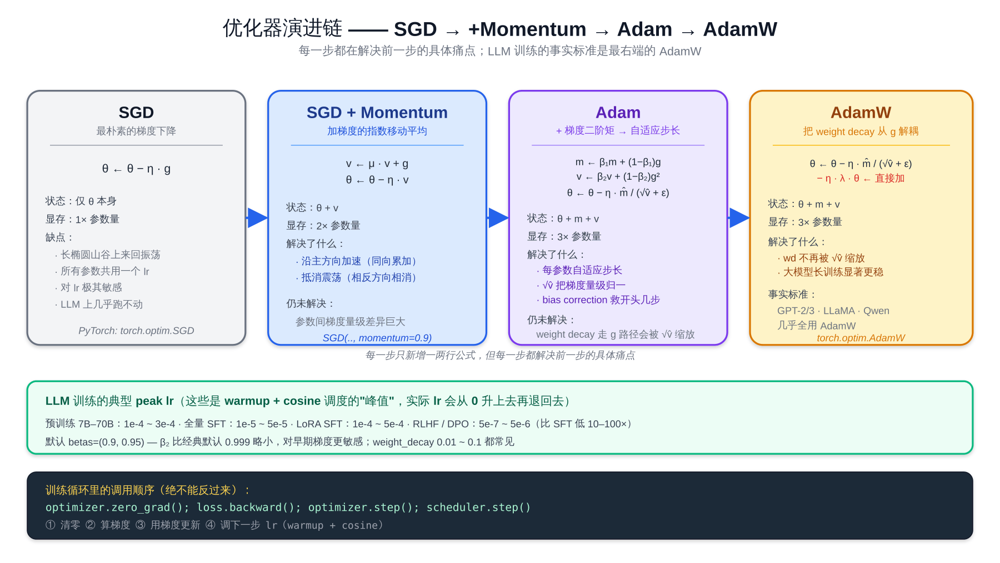
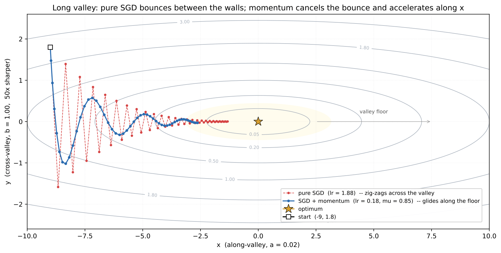
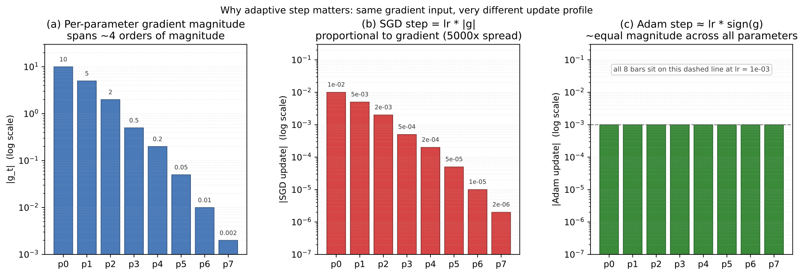
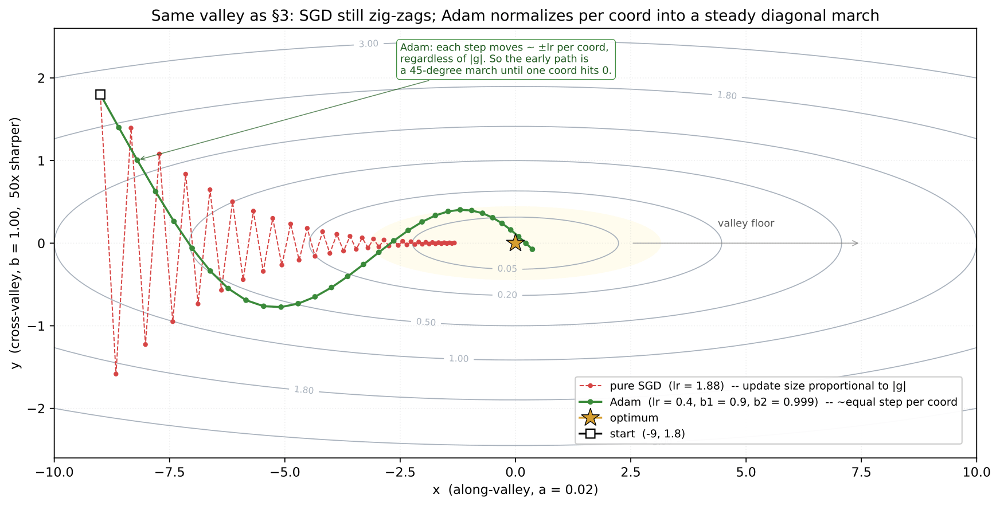
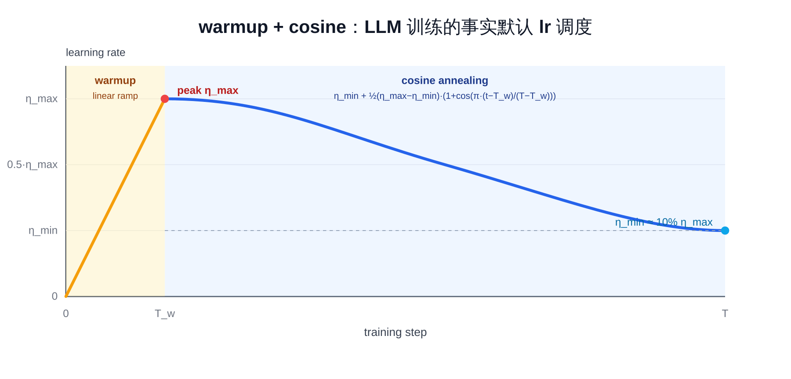

# 预备知识 P04：优化器与学习率调度——SGD / Momentum / Adam / AdamW，warmup + cosine

P02 已经把训练循环的"骨架"立起来了——zero_grad → forward → backward → step。这一章把**第三步「step」**（即 `optimizer.step()`）展开讲：拿到 grad 之后，**到底怎么用 grad 去更新参数**？

核心问题就两件：

1. **优化器**：SGD / Momentum / Adam / AdamW 各自怎么算更新量？为什么 LLM 训练几乎一律用 AdamW？
2. **学习率调度**：lr 不是一个数，是一条**随 step 变化的曲线**——为什么要 warmup？为什么训练后期要 cosine 退火？

这两件搞清楚之后，再去读任何一份 LLM 训练脚本，`optimizer = AdamW(...)` 和 `scheduler = get_cosine_schedule_with_warmup(...)` 这两行就不再是黑盒。

> 想直接跑示例？点这里 [](https://colab.research.google.com/github/weiqiangnd/LearningLLM/blob/main/src/P04.ipynb)。
>
> **硬件门槛**：概念章，CPU 即可✅。本章用一个 1D 二次函数 + `make_moons` 二分类 MLP 演示，参数量极小，CPU 跑几秒。

## 目录

- [一、优化器与学习率调度要解决的问题](#一优化器与学习率调度要解决的问题)
- [二、SGD：最朴素的梯度下降](#二sgd最朴素的梯度下降)
- [三、动量（Momentum）：给更新加惯性](#三动量momentum给更新加惯性)
  - [3.1 一个手算的数值例子](#31-一个手算的数值例子)
- [四、Adam：自适应步长](#四adam自适应步长)
  - [4.1 一阶矩与二阶矩](#41-一阶矩与二阶矩)
  - [4.2 偏差修正 bias correction](#42-偏差修正-bias-correction)
  - [4.3 Adam 的更新公式](#43-adam-的更新公式)
  - [4.4 一个手算的数值例子](#44-一个手算的数值例子)
- [五、AdamW：weight decay 的"正确解耦"](#五adamwweight-decay-的正确解耦)
  - [5.1 为什么要把参数往 0 拉](#51-为什么要把参数往-0-拉)
  - [5.2 朴素做法：把 weight decay 塞进梯度](#52-朴素做法把-weight-decay-塞进梯度)
  - [5.3 Adam 里两种写法不再等价](#53-adam-里两种写法不再等价)
- [六、学习率为什么是最重要的超参](#六学习率为什么是最重要的超参)
- [七、warmup：训练初期不要冲太快](#七warmup训练初期不要冲太快)
- [八、cosine 退火：训练后期细致下降](#八cosine-退火训练后期细致下降)
- [九、warmup + cosine：LLM 训练的默认调度配方](#九warmup--cosinellm-训练的默认调度配方)
- [十、其他常见调度](#十其他常见调度)
- [十一、实战要点 & 常见踩坑](#十一实战要点--常见踩坑)
- [十二、关键概念回顾](#十二关键概念回顾)
- [十三、本章小结](#十三本章小结)

---

## 一、优化器与学习率调度要解决的问题

P02 用了一行 `optimizer = SGD(model.parameters(), lr=0.1)` 就把训练跑通了——但实际写自己的训练脚本时几乎一定会遇到下面这些问题：

- 用 SGD 训 LLM，loss 怎么都不收敛——为什么必须换 AdamW？
- 训练前几百步 loss 突然变 NaN——为什么需要 warmup？
- 同样的模型同样的数据，lr 设 1e-3 和 1e-4 跑出来一个 acc=92% 一个 acc=70%——lr 怎么找？
- 看 LLM 论文里写 "linear warmup over 2000 steps, then cosine decay to 10% of peak lr"——这一句到底在说什么？

把优化器和调度的数学搞清楚，上面每个问题都能用一段话回答。本章前半（第 2-5 节）讲优化器演进——下图把这条演进链一次画清，每一步都在解决前一步的具体痛点；读完第 2-5 节再回看这张图，所有公式都会落到对应位置：



---

## 二、SGD：最朴素的梯度下降

**SGD（Stochastic Gradient Descent，随机梯度下降）** 的更新规则一行就写完：

$$
\theta_{t+1} = \theta_t - \eta \cdot g_t
$$

其中：
- $\theta_t$ 是第 $t$ 步的参数（向量）
- $g_t = \nabla_\theta \mathcal{L}(\theta_t)$ 是这一 batch 算出来的梯度
- $\eta$ 是**学习率（learning rate, lr）**

直觉：每一步往**当前梯度的反方向**走 $\eta$ 这么远。

最小例子（一维二次函数 $f(\theta) = \theta^2$ ，  $g = 2\theta$ ， $\eta = 0.1$ ）：

```
θ₀ = 1.0
θ₁ = 1.0 - 0.1 · 2·1.0  = 0.8
θ₂ = 0.8 - 0.1 · 2·0.8  = 0.64
θ₃ = 0.64 - 0.1 · 2·0.64= 0.512
... → 0
```

每步乘 0.8 几何衰减，平稳收敛。SGD 的优缺点：

| 优点 | 缺点 |
|------|------|
| 实现简单、显存占用最小（除参数本身外不存额外状态） | 收敛慢；在病态曲面（不同方向曲率差很多）上来回振荡 |
| 在凸问题上收敛性理论清晰 | 对学习率敏感；在 LLM 这种动辄上亿参数的非凸问题里几乎跑不动 |

LLM 训练几乎不直接用纯 SGD——但**理解 SGD 是理解后续所有优化器的起点**：动量、Adam、AdamW 都是在这条公式上加修正项。

---

## 三、动量（Momentum）：给更新加惯性

纯 SGD 在"长长的山谷"型曲面（loss 曲面在某个方向曲率小、垂直方向曲率大）上会**来回震荡**——每一步都按当前点的梯度走，但梯度在两壁之间方向反复变化。**动量**（momentum）借物理直觉，给更新一份"惯性"：

$$
v_{t+1} = \mu \cdot v_t + g_t,\qquad v_0 = 0
$$

$$
\theta_{t+1} = \theta_t - \eta \cdot v_{t+1}
$$

—— $\mu \in [\thinspace 0, 1)$ 叫**动量系数**（常用 0.9）；  $v_t$ 是**梯度的指数加权移动平均**，约定从零向量起步（PyTorch 内部也是这么初始化的，第一步等价于纯 SGD）。直觉：更新方向不再只看"当前梯度"，而是把**最近若干步的梯度平均**成一个"主方向"。

效果：
- **沿主方向加速**——历史梯度同向累加越走越快
- **垂直主方向相互抵消**——震荡方向上动量正负相消，振幅压低

下图把这两件事画在了同一张二次型 loss 曲面上—— $f(x, y) = \tfrac{1}{2}(0.02 x^2 + y^2)$ ，  $y$ 方向曲率比 $x$ 方向陡 50 倍，是典型的"狭长山谷"。从同一起点 $(-9, 1.8)$ 出发：



- **红色虚线（纯 SGD，lr=1.88）**：这个 lr 已经接近 $y$ 方向不发散的临界值（ $y$ 方向稳定要求 lr·b < 2，这里 b=1，所以 lr 必须小于 2；取 1.88 就是有意贴着上限来制造剧烈震荡），所以每一步在 $y$ 上跨过谷底跳到对面壁，下一步又跳回来——画面里能直接数出来的密集横跳；与此同时 $x$ 方向 lr·a = 1.88·0.02 ≈ 0.038，每步只削掉 3.8% 的 $x$ ，沿谷底爬得极慢。
- **蓝色实线（Momentum，lr=0.18, μ=0.85）**：  $y$ 方向的正负梯度被 $v_y$ 的指数加权平均**抵消**了大半，剩下两三次轻微的"摇摆"就稳住；  $x$ 方向梯度始终同号，  $v_x$ **持续累加**——稳态下 $v_x \approx g_x / (1-\mu) \approx 6.7 g_x$ ，意思是和**同 lr 的纯 SGD**相比，沿谷方向的等效步长被自动放大到 6.7 倍（注意：不是和上面那条 lr=1.88 的红线比，红线用的是大得多的 lr，所以 50 步走的 x 距离反而比这条蓝线略多）。Momentum 的真正好处不是"更快爬到 $x=0$ "，而是**用一个不会引起 $y$ 震荡的小 lr，仍能换到接近 SGD 大 lr 的沿谷推进速度**——稳定性和速度兼得。

### 3.1 一个手算的数值例子

把上面两条性质压成一组最小数字。设参数是二维向量 $\theta = (x, y)$ ，连续 4 步的梯度为：

$$
g_1 = (0.1,\ {+1.0}),\quad g_2 = (0.1,\ {-1.0}),\quad g_3 = (0.1,\ {+1.0}),\quad g_4 = (0.1,\ {-1.0})
$$

—— $x$ 分量是"沿谷底方向"，每步同号；  $y$ 分量是"垂直谷壁方向"，正负交替。  $\mu = 0.9$ 、初始 $v_0 = (0, 0)$ 。逐步算 $v_t = \mu v_{t-1} + g_t$ ：

| 步 $t$ | $g_t$ | $v_t = 0.9 v_{t-1} + g_t$ | 备注 |
| --- | --- | --- | --- |
| 1 | $(0.1,\ {+1.0})$ | $(0.100,\ {+1.000})$ | 第一步与梯度本身相同 |
| 2 | $(0.1,\ {-1.0})$ | $(0.190,\ {-0.100})$ | $v_y$ ：  $0.9 \cdot 1.0 + (-1.0) = -0.10$ ，正负相消，振幅从 1.0 缩到 0.10 |
| 3 | $(0.1,\ {+1.0})$ | $(0.271,\ {+0.910})$ | $v_x$ 又涨一截； $v_y$ 反弹但仍 \< 1.0 |
| 4 | $(0.1,\ {-1.0})$ | $(0.344,\ {-0.181})$ | $v_x \approx 3.44 g_x$ ，已被放大 3 倍多 |

继续往后跑，  $v_x$ 单调爬向稳态 $0.1 / (1 - 0.9) = 1.0$ （= 10 倍单步梯度）；  $v_y$ 收敛到一个对称的振荡：解 $v_+ = 0.9 v_- + 1$ 与 $v_- = 0.9 v_+ - 1$ 联立得 $v_\pm = \pm \tfrac{1}{1.9} \approx \pm 0.526$ 。把这两个稳态拿来跟纯 SGD（直接用 $g_t$ 当 update）对照：

| 量 | 纯 SGD（每步） | Momentum（稳态） | 比值 |
| --- | --- | --- | --- |
| 沿谷方向 \|update\| | $0.1$ | $\approx 1.0$ | **× 10**（加速） |
| 垂直方向 \|update\| | $1.0$ | $\approx 0.526$ | × 0.53（衰减一半） |
| 两方向之比 | $0.1 : 1.0$ | $1.0 : 0.526$ | **主导方向反了过来** |

**纯 SGD 的更新方向被垂直分量主导**（垂直方向是沿谷方向的 10 倍），所以在 $y$ 方向反复横跳；**Momentum 把更新方向"扳"到沿谷方向**（沿谷方向反过来变成垂直方向的近 2 倍）——这就是上图蓝线能贴着谷底滑行的原因。

PyTorch 里写法：

```python
optimizer = torch.optim.SGD(model.parameters(), lr=0.1, momentum=0.9)
```

LLM 训练里很少单独用 SGD+Momentum——下面要讲的 Adam 已经把这个机制包含进去了。

---

## 四、Adam：自适应步长

SGD（带不带动量）有个根本问题：**所有参数共用同一个 lr**。但参数与参数之间的梯度量级可能差几个数量级——比如 embedding 层的某些 row 几乎没碰过、attention 投影矩阵的某些方向梯度极大。**Adam（Adaptive Moment Estimation）** 的关键想法：**给每个参数估计一个自适应的步长**——梯度大的方向走小步，梯度小的方向走大步。

下图把这件事拆成三栏：8 个参数的梯度量级横跨 4 个数量级（第 a 栏，从 10 到 0.002），SGD 的实际 update 严格正比于梯度（第 b 栏，跨度同样 ~4 个数量级，5000 倍），而 Adam 的 update 在每个参数上都被 $\sqrt{\hat v_t} + \epsilon$ 归一化到 $\approx \eta$ ，几乎齐平（第 c 栏）：



直觉：Adam 的稳态 update 满足 $|\Delta \theta| \approx \eta \cdot \dfrac{|\hat m_t|}{\sqrt{\hat v_t} + \epsilon} \approx \eta \cdot \dfrac{|g_t|}{|g_t|} = \eta$ ——梯度被自己的"量级估计" $\sqrt{\hat v_t}$ 自动消掉，剩下的几乎只有 lr 本身。所以**梯度大的参数被自动收敛步长，梯度小的参数被自动放大步长**，这正是上图 (b) → (c) 的差异。下面三小节把这个机制的两份统计量、偏差修正、最终更新公式拆开来讲。

### 4.1 一阶矩与二阶矩

Adam 同时维护两份指数加权移动平均：

$$
m_{t+1} = \beta_1 \cdot m_t + (1 - \beta_1) \cdot g_t,\qquad m_0 = 0
$$

$$
v_{t+1} = \beta_2 \cdot v_t + (1 - \beta_2) \cdot g_t^2,\qquad v_0 = 0
$$

—— $m$ 是**梯度的均值**（一阶矩，类似动量）；  $v$ 是**梯度平方的均值**（二阶矩，估计每个参数梯度的"方差量级"）。  $g_t^2$ 是**逐元素平方**。两个统计量都从零向量起步（PyTorch 的默认初始化，下一节 4.2 的"偏差修正"正是用来抵消这个零起步带来的早期偏低）。

常用默认值： $\beta_1 = 0.9, \beta_2 = 0.999$ 。 $\beta_1$ 决定动量"记忆多久"，  $\beta_2$ 更长（  $1 / (1 - 0.999) = 1000$ 步左右）。

### 4.2 偏差修正 bias correction

由于 $m_0 = v_0 = 0$ 初始化，开头几步的 $m$ 与 $v$ 会**偏低**（被 0 拉小）。Adam 用一个简单修正项把它放大回来：

$$
\hat m_{t+1} = \frac{m_{t+1}}{1 - \beta_1^{t+1}}, \quad \hat v_{t+1} = \frac{v_{t+1}}{1 - \beta_2^{t+1}}
$$

当 $t$ 较大时 $\beta^{t+1} \to 0$ ，分母趋近 1，修正几乎不起作用——这正符合"只在开头修偏差"的意图。

### 4.3 Adam 的更新公式

$$
\theta_{t+1} = \theta_t - \eta \cdot \frac{\hat m_{t+1}}{\sqrt{\hat v_{t+1}} + \epsilon}
$$

—— $\epsilon$ 是个小常数（通常 $10^{-8}$ ），防止除 0。可以这么读：

- 分子 $\hat m$ 提供动量方向
- 分母 $\sqrt{\hat v}$ 是这个参数**自己最近一段历史上"梯度平方"的均值开根号**——可以理解为它"自己的梯度典型大小"。拿当前梯度除以这个典型值，就把"绝对大小"换成了"相对于它自己常态的倍数"。再用上图的数字举例：p0 长期梯度都在 10 量级，所以 $\sqrt{\hat v} \approx 10$ ，单步 update $\approx \eta \cdot 10 / 10 = \eta$ ；p7 长期梯度都在 0.002 量级，所以 $\sqrt{\hat v} \approx 0.002$ ，单步 update $\approx \eta \cdot 0.002 / 0.002 = \eta$ 。**两边除完之后绝对量级都被消掉，只剩下 $\eta$ 本身**——这就是 (c) 栏所有绿条都齐平的原因。
- $\eta$ 是全局缩放，所有参数共用

直觉效果：**Adam 几乎不需要逐参数调 lr**——量级被 $\sqrt{\hat v}$ 归一了。这也是为什么 Transformer 训练默认用 Adam 系——参数之间梯度量级差异巨大，纯 SGD 几乎不可能调出一个对所有层都合适的 lr。

把这套公式放回第 3 节那张"狭长山谷"上，从同一起点 $(-9, 1.8)$ 出发——就能看到 Adam 在轨迹层面长什么样：



读法跟第 3 节那张图完全一致——每一个圆点都是**一次更新后参数的位置**：

- **红色虚线**还是第 3 节里的纯 SGD（lr=1.88，贴 $y$ 方向稳定上限），仍在两壁之间高密度横跳。
- **绿色实线**是 Adam（lr=0.4， $\beta_1=0.9$ ， $\beta_2=0.999$ ）。**第一步**在 $x$ 与 $y$ 上 update 都被 $\sqrt{\hat v}$ 精确归一到 $\pm \eta$ ：往右 +0.4、往下 -0.4，跟 $g_x = -0.18$ 还是 $g_y = +1.8$ 没关系——这就是开头几步**45° 对角线下台阶**的来源。约第 5-6 步 $y$ 越过 $0$ ，但 $\hat m_y$ 还累积着早期一连串大正梯度的"下行惯性"，所以 $y$ 不会立刻反向——会一直冲到 $y \approx -0.76$ （约第 10 步）才真正掉头，之后在 $y=0$ 一带做衰减振荡。 $x$ 方向则始终单向推进，update 量级从早期的 $\approx 0.4$ 缓慢缩到 $0.2 \sim 0.3$ 量级（因为 $|g_x|$ 自己也在变小、 $\hat m_x$ 跟着缩）——再走 22 步左右贴近 $x = 0$ 。
- 抵达最优点附近后，图里仍能看到 $y$ 在小幅来回——这是 $\hat m_y$ 残留着早期大 $|g_y|$ 的"记忆"，要等它和 $\sqrt{\hat v_y}$ 一起衰减才彻底安静（在这个确定性梯度的玩具例子里，update 终究会随 $|g| \to 0$ 一起趋于 $0$ ）。**真实训练里**还会有 mini-batch 噪声给 update 留一个 $\approx \eta$ 的"地板"——所以训练后期通常配合 cosine 退火（见第 8 节）让 lr 自己变小，把这个地板一起压下去。

把这张图和第 3 节那张并起来看：纯 SGD 同样起点同样曲面，因为 lr 贴着 $y$ 方向稳定上限，每一步都跨过谷底跳到对面壁、密集横跳；动量把 $y$ 摇摆压平、沿谷加速；Adam 进一步把"沿谷 vs 跨谷"的速度差**直接消掉**——两个分量都按 $\eta$ 的步长走，路径几乎是一条对角直线 + 一条水平直线。

### 4.4 一个手算的数值例子

把上面三步公式（一阶矩、二阶矩、偏差修正）压成一组最小数字。设两个参数 $a$ 与 $b$ ：每步梯度都恒定， $g_a = 1.0$ 、 $g_b = 10^{-3}$ （**两者梯度量级差 1000 倍**——模拟第 4 节开篇图里 p0 vs p7 的极端情形）。超参取标准默认值 $\beta_1 = 0.9$ ， $\beta_2 = 0.999$ ， $\eta = 10^{-3}$ ，  $\epsilon \approx 0$ ，初始 $m_0 = v_0 = 0$ 。算第一步（  $t = 1$ ）：

| 中间量 | 公式 | 参数 $a$ ( $g = 1.0$ ) | 参数 $b$ ( $g = 10^{-3}$ ) |
| --- | --- | --- | --- |
| $m_1$ | $0.1 \cdot g$ | $0.1$ | $10^{-4}$ |
| $v_1$ | $10^{-3} \cdot g^2$ | $10^{-3}$ | $10^{-9}$ |
| $\hat m_1$ | $m_1 / (1 - 0.9^1) = m_1 / 0.1$ | $1.0$ | $10^{-3}$ |
| $\hat v_1$ | $v_1 / (1 - 0.999^1) = v_1 / 10^{-3}$ | $1.0$ | $10^{-6}$ |
| $\dfrac{\hat m_1}{\sqrt{\hat v_1}}$ | （归一化后的"方向"） | $1.0$ | $1.0$ |
| $\Delta\theta = -\eta \cdot \dfrac{\hat m_1}{\sqrt{\hat v_1}}$ | （这一步参数更新） | $-10^{-3}$ | $-10^{-3}$ |

读这张表的两条主线：

- **横向看每一行**：偏差修正把 $m_1$ 从 $0.1 g$ 放大回 $g$ 、把 $v_1$ 从 $10^{-3} g^2$ 放大回 $g^2$ ——开头的零起步偏差被一次抹平。
- **纵向看最后两列**：参数 $a$ 与 $b$ 的 $g$ 差 1000 倍， $\hat m$ 也差 1000 倍， $\sqrt{\hat v}$ 同样差 1000 倍——上下相除后 1000:1 的差异被消掉，两者更新量级相同（都是 $-\eta = -10^{-3}$ ）。

后续步骤（  $t = 2, 3, \ldots$ ）由于梯度恒定， $\hat m_t$ 始终等于 $g$ 、 $\hat v_t$ 始终等于 $g^2$ ，每一步的 $|\Delta \theta|$ 都精确等于 $\eta$ 。这正是第 4 节开篇图里 (c) 栏所有绿条都齐平在 $\eta = 10^{-3}$ 一线的原因。

> **对照：如果跳过偏差修正会怎样？** 直接用 $\eta \cdot m_1 / \sqrt{v_1}$ ：参数 $a$ 得到 $\eta \cdot 0.1 / \sqrt{10^{-3}} \approx 3.16 \eta$ ， $b$ 得到 $\eta \cdot 10^{-4} / \sqrt{10^{-9}} \approx 3.16 \eta$ 。**两者仍齐平**（"自适应"的归一化照常生效），但**绝对量级被多放大 3 倍**——这就是第 4.2 节偏差修正不能省的原因：零起步的 $m_1, v_1$ 偏小、缩放比例失真，开头几百步的 update 会比预期大几倍。

读完上面这张表，回到第 4 节开篇那句"梯度大走小步、梯度小走大步"——读者常会有两个反直觉的疑问：

> **常见疑问**：「梯度大走小步，会不会拖慢这条方向的学习？梯度小走大步，会不会冲过头？」——这里的"小/大"是**相对于该方向自己的梯度量级**说的，不是绝对步长。从上面那张表看得一清二楚：参数 $a$ 的 $g$ 是 $1.0$ 、 $b$ 的 $g$ 是 $10^{-3}$ ，但 $\Delta \theta$ 都是 $-10^{-3}$ ——Adam 把所有参数的 update 都拉到 $\approx \eta$ 这一档（典型 $10^{-3}$ ），不会因为某个参数梯度大就压成 $10^{-6}$ 、也不会因为某个参数梯度小就放大到 $1$ 。所以两种"反常"担忧都不成立：
>
> - **梯度大 → 步长不会被压死**：纯 SGD 想压住大梯度方向只能把全局 lr 调小，结果连小梯度方向也被压死、训练几乎不动；Adam 把大梯度方向单独压到 $\eta$ ，**不波及别的参数**，整体学习效率反而更高。
> - **梯度小 → 步长不会真的"过大"**：所谓"放大"也只到 $\eta$ ；而且一旦走到该方向的最优附近、梯度持续变小， $\hat m \to 0$ ，单步 update 也跟着 $\to 0$ ，不会一直冲过头。真正的安全网是 lr 本身—— $\eta$ 取得太大才会震荡，这跟 SGD 一样需要调（详见第 6 节与第 7 节）。

PyTorch 写法：

```python
optimizer = torch.optim.Adam(model.parameters(), lr=1e-3, betas=(0.9, 0.999), eps=1e-8)
```

---

## 五、AdamW：weight decay 的"正确解耦"

**Weight decay（权重衰减）** 是常用正则化：每步把参数往 0 拉一点点。

### 5.1 为什么要把参数往 0 拉

在写公式之前先回答这个问题——否则看到 $-\eta\lambda\theta_t$ 这一项会觉得莫名其妙："明明梯度下降已经在让 loss 变小了，为什么还要硬塞一个把参数拽回 0 的项？"三个互相加成的理由：

1. **泛化角度：小参数 = 更平滑的函数**。神经网络容量极大，无约束训练时很容易把训练集里的噪声也"记下来"——表现为某些权重幅值越拉越大、模型对输入的微小扰动反应越来越剧烈（典型的过拟合形态）。把权重往 0 拉，等于在所有"能拟合训练数据"的解里**优先选幅值小、函数更平滑的那个**，验证集泛化误差通常更低。这就是经典 L2 正则化的目标。

2. **数值稳定角度：防止权重无界漂移**。LLM 预训练动辄几千亿 token、几十万 step，每步 update 即便很小，长期累积下权重会持续往某个方向漂。漂得太远 → 激活值持续放大 → 中间层数值溢出半精度（fp16 / bf16）表示范围 → loss 突然 NaN。weight decay 给了一个**指向 0 的恢复力**，让权重稳定在一个有界的健康区间，长训练里这条比第 1 条更要命。

3. **贝叶斯视角：等价于给参数加高斯先验**。在 loss 里加 $\frac{\lambda}{2}\Vert\theta\Vert^2$ 这一项，等价于假设参数服从 $\mathcal{N}(0, \sigma^2)$ 的先验分布（其中 $\sigma^2$ 与 $\lambda$ 成反比），即"我们事先就相信参数应该靠近 0"。最大后验（MAP）估计自然就在拟合数据和"靠近先验均值 0"之间做权衡——weight decay 是这个权衡的具体实现。

经验上 LLaMA / Qwen / GPT-3 等预训练**清一色用 weight decay = 0.1**；关掉 wd 跑长训练，最终验证 loss 通常更高、下游任务也更差——这是 LLM 训练领域的共识。

### 5.2 朴素做法：把 weight decay 塞进梯度

知道目标后，最直接的实现是每一步在梯度里多加一项 $\lambda \theta_t$ ，让"拉回 0"和正常梯度下降一起走：

$$
\theta_{t+1} = \theta_t - \eta (g_t + \lambda \theta_t)
$$

—— $\lambda$ 是 weight decay 系数（典型 0.01 ~ 0.1，LLM 预训练常用 0.1）。这等价于在 loss 里加了一项 $\frac{\lambda}{2} \Vert\theta\Vert^2$ ——对它求梯度恰好就是 $\lambda\theta$ 。在**纯 SGD** 里这种写法没有问题，"L2 正则化"和"weight decay"完全等价。

### 5.3 Adam 里两种写法不再等价

但**在 Adam 里这两种实现并不等价**：Adam 会对 $g$ 做 $\sqrt{\hat v}$ 归一化，如果 weight decay 也走 $g$ 这条路，那它会被 $\sqrt{\hat v}$ 一起缩放——参数量级大的层 weight decay 反而被压小。这跟"weight decay 应该平等地拉每个参数往 0"的初衷不一致。

**AdamW（Adam with decoupled Weight decay）** 的修正：把 weight decay **从梯度里拆出来，直接加在最终更新上**：

$$
\theta_{t+1} = \theta_t - \eta \cdot \frac{\hat m_{t+1}}{\sqrt{\hat v_{t+1}} + \epsilon} - \eta \cdot \lambda \cdot \theta_t
$$

—— weight decay 项**不再过 $\sqrt{\hat v}$ 归一化**，回到了"等比拉所有参数往 0"的语义。

效果上 AdamW 比 Adam 在大模型上稳定地更好——这是 GPT-2 / GPT-3 / LLaMA / Qwen 系列预训练**清一色用 AdamW** 的原因。

PyTorch 写法：

```python
optimizer = torch.optim.AdamW(
    model.parameters(),
    lr=1e-4,                    # LLM 预训练典型 1e-4 ~ 6e-4
    betas=(0.9, 0.95),          # β₂ 比 0.999 略小，对早期梯度更敏感
    weight_decay=0.1,           # LLM 上 0.01 ~ 0.1 都常见
    eps=1e-8,
)
```

---

## 六、学习率为什么是最重要的超参

模型架构、初始化、数据混合都重要——但**学习率几乎是最敏感**的那一个：

| lr | 现象 |
|----|------|
| **过大** | loss 在最优点附近来回跳跃；严重时直接爆炸成 NaN |
| **合适** | loss 平滑下降，最终收敛到低位 |
| **过小** | loss 下降但极慢；训练 epoch 跑完也没收敛 |

最直观的视角：把 loss 看成参数空间的一座山，lr 是每一步迈的步长。**步长比"该方向上的曲率半径"还大时，会冲过山谷壁碰到对面山壁**——这就是 lr 太大时 loss 振荡 / 爆炸的几何原因。

LLM 训练里 lr 的典型量级：

| 阶段 | 模型规模 | 典型 peak lr |
|------|---------|-------------|
| 预训练 | 7B ~ 70B | $1 \times 10^{-4}$ ~ $3 \times 10^{-4}$ |
| 全量 SFT | 7B ~ 70B | $1 \times 10^{-5}$ ~ $5 \times 10^{-5}$ |
| LoRA SFT | 7B ~ 70B | $1 \times 10^{-4}$ ~ $5 \times 10^{-4}$ （只训 LoRA 矩阵，lr 可以高一些） |
| RLHF（人类反馈强化学习）/ DPO（直接偏好优化） | 7B ~ 70B | $5 \times 10^{-7}$ – $5 \times 10^{-6}$ （比 SFT 低 10–100 倍） |

注意：**这些 lr 都是"调度的峰值"**——实际训练中 lr 会按下面要讲的 warmup + cosine 形状从 0 升到峰值再退回去。

---

## 七、warmup：训练初期不要冲太快

训练刚启动时，参数随机初始化、梯度方向也"随机"——直接拿峰值 lr 跑很容易把参数推到一个糟糕的位置，loss 立刻爆炸。**Warmup（学习率预热）**：让 lr 在前若干 step 从 0（或一个很小值）**线性升到峰值** $\eta_{\max}$ 。

设 warmup step 数为 $T_w$ ：

$$
\eta_t = \eta_{\max} \cdot \frac{t}{T_w}, \quad t = 0, 1, \ldots, T_w
$$

随后再交给主调度（cosine、constant、linear decay 等）。LLM 训练里 $T_w$ 通常是总 step 数的 1% ~ 10%（比如 2000 step）。

直觉：warmup 让参数先在小 lr 下"找到下山方向"，再用大 lr 加速。

**为什么不 warmup 就容易出 NaN？** 随机初始化时第一个 batch 算出的梯度方向接近随机噪声、模长又往往偏大；如果立刻用峰值 lr 走一步，参数会被推到一个偏离初始化良态分布的位置——下一次前向里某些通道的激活值急速放大、中间层数值溢出半精度（fp16 / bf16）表示范围，softmax / cross-entropy 一算就吐 NaN；而 NaN 一旦出现就会沿计算图传染（任何含 NaN 的算术结果还是 NaN），后续整条 loss 全是 NaN，再也回不来。warmup 把前若干 step 的 lr 压到接近 0，每一步参数挪动都很小，这条"参数跳飞 → 激活溢出 → NaN"的链就被掐在第一环。

> Adam / AdamW 在前几步还有另一个问题——二阶矩 $\hat v$ 估计还不准。warmup 同时缓解了这个问题。

---

## 八、cosine 退火：训练后期细致下降

训练后期参数已经接近最优——大 lr 会让 loss 在最优点附近跳。**Cosine annealing（余弦退火）** 让 lr 从 $\eta_{\max}$ **沿余弦曲线平滑下降**到一个下界 $\eta_{\min}$ ：

$$
\eta_t = \eta_{\min} + \frac{1}{2} (\eta_{\max} - \eta_{\min}) \left( 1 + \cos \frac{\pi (t - T_w)}{T - T_w} \right)
$$

—— $T$ 是总 step 数， $t \in [\thinspace T_w, T \thinspace]$ 。形状是一段从 $\eta_{\max}$ 平滑滑到 $\eta_{\min}$ 的余弦曲线， $t = T_w$ 时取 $\eta_{\max}$ 、 $t = T$ 时取 $\eta_{\min}$ 。

为什么用 cosine 而不是简单的 linear decay？两条经验：

- **cosine 在中段下降速度更快、两端更慢**——前段保持高 lr 让模型继续猛下降，后段把 lr 压到很小让参数细调
- **大量 LLM 论文（GPT-3、LLaMA、Qwen 等）均报告 cosine 比 linear / step 退火的最终 loss 略好**

下界 $\eta_{\min}$ 一般取 $\eta_{\max}$ 的 10%（不是直接 0），避免最后几步几乎不动。

---

## 九、warmup + cosine：LLM 训练的默认调度配方

把上面两个拼起来，就是当代 LLM 训练**几乎不变的调度形状**：



形状要点：

- **0 → T_w**：lr 从 0 线性升到 $\eta_{\max}$ ——黄色的 warmup 段
- **T_w → T**：lr 沿余弦曲线从 $\eta_{\max}$ 平滑滑到 $\eta_{\min} \approx 10\% \eta_{\max}$ ——蓝色的 cosine annealing 段
- **下界不为 0**：cosine 末段保留 10% 的 lr，避免最后几千步几乎不更新；想让模型完全停下再走 linear decay 收尾

HuggingFace `transformers` 里就有现成实现：

```python
from transformers import get_cosine_schedule_with_warmup

scheduler = get_cosine_schedule_with_warmup(
    optimizer,
    num_warmup_steps=2000,        # T_w
    num_training_steps=100_000,   # T
)

# 训练循环里
for step in range(100_000):
    loss = ...                      # forward + 算 loss
    optimizer.zero_grad()
    loss.backward()
    optimizer.step()
    scheduler.step()                # 注意：scheduler.step() 在 optimizer.step() 之后调用
```

**`scheduler.step()` 必须在 `optimizer.step()` 之后调**——PyTorch 1.0+ 的约定，反过来 lr 会推迟一步生效（旧代码偶尔能见到反过来写的，是早期遗留）。

---

## 十、其他常见调度

完整起见，简单提一下其他经常见到的调度（细节不展开，遇到了再查）：

| 调度 | 形状 | 用法场景 |
|------|------|---------|
| **constant** | warmup 后恒定 | 小数据 SFT、调试 |
| **linear decay** | warmup 后线性下降到 0 | BERT 论文用的就是这个；现在被 cosine 取代得多 |
| **inverse sqrt** | $\eta_t \propto 1/\sqrt{t}$ | "Attention Is All You Need" 原始 Transformer 训练用的 |
| **cosine with restarts** | 多次 warm restart | 长训练里防止陷在局部最优 |
| **WSD（warmup-stable-decay）** | warmup → 长段 stable → 短段 decay | 一些新论文里在用，可在训练任意时刻"决定收尾" |

---

## 十一、实战要点 & 常见踩坑

| 症状 | 原因 | 解决 |
|------|------|------|
| 训练前几百 step loss 立刻 NaN | 没 warmup / lr 太大 | 加 warmup（典型 500 ~ 2000 step）；把 peak lr 降一档 |
| Loss 震荡、不下降 | lr 太大 / Adam 的 $\beta_2$ 太大遇到稀疏梯度 | 降 lr；试试 $\beta_2 = 0.95$ |
| Loss 缓慢下降但最终很差 | lr 太小、weight decay 太大 | 加大 lr；weight decay 从 0.1 调到 0.01 |
| 同样配置换大 batch size 后 loss 变差 | 大 batch 一步迈得"太大" | 经验法则：lr 随 batch size 开根号 / 线性增长（具体看模型） |
| `scheduler.step()` 写在 `optimizer.step()` 之前 | API 顺序写反了 | 调换顺序；新版 PyTorch 会 warning |
| `optimizer.step()` 之后忘了 `optimizer.zero_grad()` | 梯度累加，下一步更新被严重放大 | 三件套：`zero_grad → backward → step`，或把 `zero_grad` 放在循环最后；**不要漏** |
| LoRA 只想训练 LoRA 矩阵，发现优化器把全量参数都列进去了 | 没过滤 `requires_grad` | `optim.AdamW([p for p in model.parameters() if p.requires_grad], ...)` |

学习率（lr）怎么找的实操建议：

1. **看同类工作**——同规模模型 + 同优化器 + 同 batch 设置，从论文 / 框架默认值入手
2. **lr range test**：从一个极小 lr（如 $10^{-7}$ ）开始，几百步内指数升到 $10^{-1}$ ，画 loss vs lr——loss 开始急速下降前的那个 lr 通常就是合适的 peak
3. **再 ±2 倍微调**——通常不需要在 $\pm 5\%$ 这种粒度上调

---

## 十二、关键概念回顾

| 概念 | 一句话定义 | 用途 |
|------|-----------|------|
| SGD | $\theta \leftarrow \theta - \eta g$ | 优化器的起点；现代深度学习几乎不直接用 |
| Momentum | 加上梯度的指数移动平均 $v$ | 抑制震荡、沿主方向加速 |
| Adam | 同时维护一阶矩 $m$ 和二阶矩 $v$ ，按 $\sqrt{v}$ 归一化更新 | 给每个参数自适应步长 |
| Bias correction | 修正 $m, v$ 在初始几步的偏低估计 | 让 Adam 在前几十步也能正确更新 |
| AdamW | 把 weight decay 从梯度路径里拆出来，直接加在更新上 | LLM 预训练 / SFT 的事实标准优化器 |
| Weight decay | 每步把参数往 0 拉 $\eta \lambda \theta$ | 正则化，防止参数无限增大 |
| 学习率 lr | 每步沿负梯度方向走多远 | 最敏感的超参；典型 $10^{-7}$ ~ $10^{-3}$ 之间 |
| Warmup | lr 从 0 线性升到 peak | 防止训练初期 NaN、缓解 Adam 早期 $\hat v$ 估计不准 |
| Cosine 退火 | lr 从 peak 沿余弦平滑滑到 $\eta_{\min}$ | 训练后期细调，最终 loss 一般优于 linear / step |
| warmup + cosine | LLM 训练事实默认调度 | GPT / LLaMA / Qwen 系列预训练都是这个形状 |

---

## 十三、本章小结

这一章把"step 一步到底怎么走"讲全了：

- **SGD → Momentum → Adam → AdamW** 是一条由简到繁的演进——每一步都在解决前一个的具体痛点
- **AdamW 是 LLM 训练的事实标准**——它把 weight decay 从梯度路径里解耦，避免了 Adam 里 weight decay 被 $\sqrt{\hat v}$ 缩放的副作用
- **lr 是最敏感的超参**——量级直接决定训练成败，调试时优先调它
- **warmup + cosine** 是 LLM 训练几乎不变的调度形状：开头线性升、主体段 cosine 下降到 10% peak

ipynb 里的实战部分按本章正文的概念顺序展开：先在二次型山谷上画 SGD / Momentum / Adam 三种轨迹（注：notebook 里用的是更轻的 10× 曲率山谷、lr 也更小，便于直接 Run；正文配图 `momentum-valley.png` / `adam-valley.png` 用的是更陡的 50× 山谷 + 更大 lr 来放大对比效果，两者结论一致），再用最小数字把第 3.1 节 / 第 4.4 节的两个手算例子跑一遍并对照解析稳态；接着手写一遍 Adam、跟 PyTorch 内置实现逐元素对齐验证公式没看错；然后在 `make_moons` 上做两件 lr / 调度相关的实验——lr 太大 / 适中 / 太小三种取值的 loss 曲线，以及 SGD / Momentum / Adam / AdamW 四种优化器同条件下的训练曲线对比；最后给一份 warmup + cosine 调度的 lr 曲线和一份"AdamW + warmup + cosine"完整训练循环模板，可直接套到任何 LLM 训练脚本里。

**预告 P05**：下一章把强化学习的"够用版"语言讲清楚——MDP / policy / value / REINFORCE / policy gradient——为后续读 PPO / DPO / GRPO 这些对齐方法打底。
