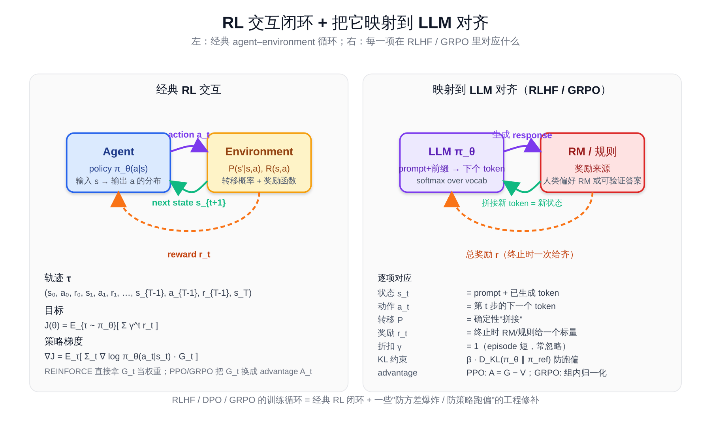
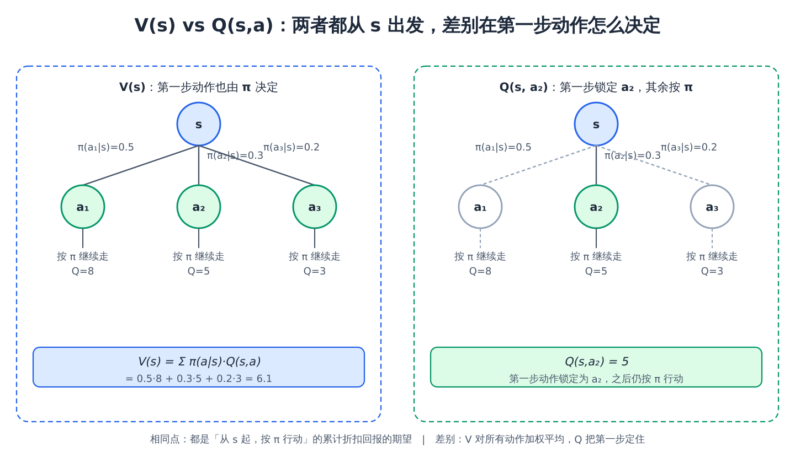
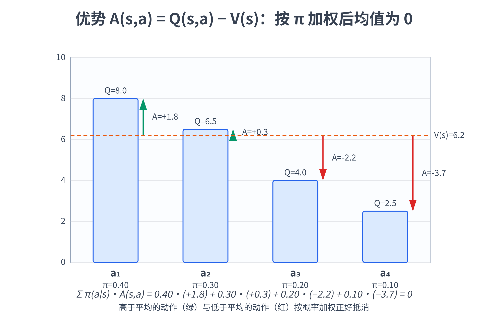
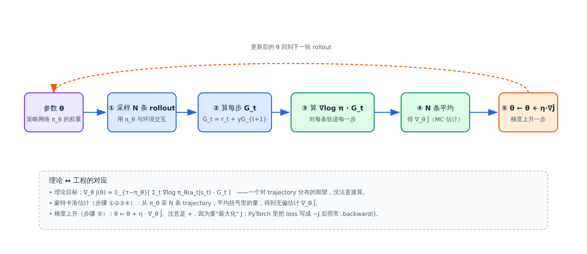
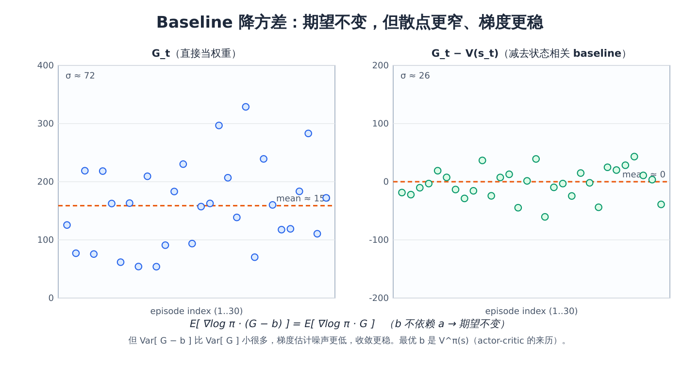

# 预备知识 P05：强化学习够用版——MDP / policy / value / REINFORCE / policy gradient

LLM 训练里"对齐"那一段（RLHF / PPO / DPO / GRPO / RLVR）几乎全部建立在**强化学习（Reinforcement Learning, RL）** 的语言上。可它的语言又跟前面几章的"监督学习"很不一样：没有"标签"、要跟"环境"互动、奖励还可能稀疏。

直接读 PPO 论文常常一开篇就被 $\pi_\theta(a \mid s)$ 、 $V^\pi(s)$ 、 $A^\pi(s, a)$ 、 $\nabla_\theta \mathbb{E}\_{\tau \sim \pi_\theta}[\thinspace R(\tau) \thinspace]$ 这一串符号劝退。这一章不做严谨教材式推导，而是用最少的数学把"够读懂 PPO 入门"的几件事讲清楚：

- **MDP（马尔可夫决策过程）** 是 RL 的统一语言——状态、动作、奖励、策略
- **策略梯度（policy gradient）** 是把"调参数让奖励变大"形式化下来的一条公式
- **REINFORCE** 是策略梯度最朴素的实现，是 PPO / GRPO 的"祖先"
- 把上面这几件**映射到 LLM**——状态是 prompt + 已生成 token、动作是下一个 token、奖励来自 RM 或可验证规则

读完这一章再去看 PPO / GRPO，就只是"REINFORCE + 几条防发散的修补"而已。

> 想直接跑示例？点这里 [](https://colab.research.google.com/github/weiqiangnd/LearningLLM/blob/main/src/P05.ipynb)。
>
> **硬件门槛**：概念章，CPU 即可✅。本章的 REINFORCE 实战用 `gymnasium` 自带的 CartPole-v1 环境 + 一个 4→32→2 的小策略网络，CPU 几十秒训到收敛。
>
> **简单补充一下 `gymnasium` 和 CartPole-v1**：`gymnasium` 是 OpenAI 原来那个 `gym` 库的官方维护分支（OpenAI 不再维护后由 Farama Foundation 接手），提供了一套统一的 RL 环境接口——`env.reset()` 拿初始状态、`env.step(action)` 走一步拿到 `(下一状态, 奖励, terminated, truncated, info)`。库里"自带"几十个经典 RL 测试环境，**CartPole-v1** 是其中最入门的一个：一辆小车上立着一根杆，状态是 4 维实数（小车位置、小车速度、杆角度、杆角速度），动作是 2 个离散值（向左推 / 向右推），每撑住一步给 +1 奖励，杆倒下或撑满 500 步则 episode 结束——满分就是 500。它的好处是状态/动作都极简、CPU 几十秒就能训到收敛，特别适合验证 REINFORCE 这种基础算法是不是写对了。

## 目录

- [一、强化学习在 LLM 对齐中的位置](#一强化学习在-llm-对齐中的位置)
- [二、MDP：RL 的统一语言](#二mdprl-的统一语言)
  - [2.1 五元组 (S, A, P, R, γ)](#21-五元组-s-a-p-r-γ)
  - [2.2 一条 trajectory](#22-一条-trajectory)
  - [2.3 累计回报 G_t 与 γ](#23-累计回报-g_t-与-γ)
- [三、策略 policy 与价值 value](#三策略-policy-与价值-value)
  - [3.1 策略 π(a|s)](#31-策略-πas)
  - [3.2 状态价值 V 与动作价值 Q](#32-状态价值-v-与动作价值-q)
  - [3.3 优势 advantage](#33-优势-advantage)
- [四、目标函数：期望累计回报](#四目标函数期望累计回报)
- [五、Policy Gradient 定理](#五policy-gradient-定理)
  - [5.1 为什么策略梯度是这个形式：log-derivative trick](#51-为什么策略梯度是这个形式log-derivative-trick)
  - [5.2 从期望到可算：蒙特卡洛采样](#52-从期望到可算蒙特卡洛采样)
- [六、降方差：baseline 与 advantage](#六降方差baseline-与-advantage)
- [七、REINFORCE 算法](#七reinforce-算法)
- [八、从 RL 到 LLM 对齐](#八从-rl-到-llm-对齐)
- [九、关键概念回顾](#九关键概念回顾)
- [十、本章小结](#十本章小结)

---

## 一、强化学习在 LLM 对齐中的位置

LLM 的预训练和 SFT 都是**监督学习**——给定一段文本，让模型尽量预测出训练数据里的下一个 token。但「**让回答更有帮助、更不胡说、更符合人类偏好**」这件事，监督信号难给：

- 同一个 prompt 可以有很多个"好"回答，没有唯一标签
- "好"是个偏好排序：A 比 B 好，但说不出 A 是不是"对"
- 有些任务（数学题、代码题）有可验证答案，但中间推理过程没监督

RL 的范式正好对路：**让模型自己生成回答，然后用一个"打分器"给它反馈**——打分器可以是人工标注训练出的奖励模型（RM），也可以是可验证规则（如代码能不能跑通、数学答案对不对）。模型按"使总分尽可能高"的方向调参数。

这就是 **RLHF / RLVR** 的内核：

| 方法 | 奖励来源 |
|------|---------|
| **RLHF**（如 InstructGPT、Claude） | 人类偏好 → 训练 RM → RM 给打分 |
| **RLVR**（如 DeepSeek-R1 用 GRPO） | 可验证答案 → 直接判对错 |
| **DPO 系列** | 不显式做 RL，但可以从 RL 视角推导 |

要读懂这些，必须先有 RL 的语言。这一章给的就是"语言"。

---

## 二、MDP：RL 的统一语言

下面这张图先把"经典 agent–environment 交互闭环"画出来，再把同一套语言映射到 LLM 对齐——本章剩下的所有概念（状态、动作、奖励、策略、轨迹、目标函数、策略梯度）在右侧都能找到 LLM 里的对应物：



### 2.1 五元组 (S, A, P, R, γ)

**马尔可夫决策过程（Markov Decision Process, MDP）** 由五件东西描述：

| 符号 | 名字 | 含义 |
|------|------|------|
| $\mathcal{S}$ | 状态空间 | 所有可能的"环境状态" $s$ |
| $\mathcal{A}$ | 动作空间 | 所有可能的"动作" $a$ |
| $P(s' \mid s, a)$ | 转移概率 | 在 $s$ 选 $a$ 后转到 $s'$ 的概率 |
| $R(s, a)$ | 奖励函数 | 在 $s$ 选 $a$ 立刻拿到的标量奖励 |
| $\gamma \in [\thinspace 0, 1 \thinspace]$ | 折扣因子 | 未来奖励衰减系数（无限时长 MDP 要求 $\gamma \lt 1$ 才能保证回报收敛；有限时长 / episodic 任务允许 $\gamma = 1$ ） |

**马尔可夫性质**：转到下一状态只依赖于当前 $(s, a)$ ，与历史无关。用条件概率写出来就是

$$
P(s_{t+1} \mid s_t, a_t, s_{t-1}, a_{t-1}, \dots, s_0, a_0) = P(s_{t+1} \mid s_t, a_t)
$$

——左边是"看完整段历史再预测下一步"，右边是"只看当前 $(s_t, a_t)$ 就够了"，两者相等就叫马尔可夫性。奖励侧同理： $R$ 也只依赖当前 $(s, a)$ 而不依赖历史。

这条假设是动态规划（DP）和绝大多数 RL 算法的根基——正因为"未来只依赖现在"，价值函数 $V(s)$ / $Q(s, a)$ 才能被定义在单个状态/状态-动作对上、policy 才能写成 $\pi(a \mid s)$ 而不必依赖整条历史。一旦马尔可夫性不成立（部分可观测、有长程依赖等），常见的补救是把"最近若干帧"打包成一个新的"状态"，让打包后的新状态重新满足马尔可夫性，再套这套语言。

最小例子（一个 4 状态 grid world）：

```
S → s0 → s1 → s2 → goal      γ = 0.9
        a0    a0    a0
状态空间 S = {s0, s1, s2, goal}
动作空间 A = {向右}
转移      P 是确定性：选 a0 一定走到下一格
奖励      R(s2, a0) = +1   （这一步走到 goal，给 +1）
         R(s0, a0) = R(s1, a0) = 0   （其余非终止状态都是 0）
```

### 2.2 一条 trajectory

智能体（agent）按某个**策略**与环境交互，会产生一条**轨迹（trajectory / episode）**：

$$
\tau = (s_0, a_0, r_0, s_1, a_1, r_1, \ldots, s_{T-1}, a_{T-1}, r_{T-1}, s_T)
$$

—— $s_0$ 是初始状态、 $a_t$ 是 $t$ 时刻的动作、 $r_t = R(s_t, a_t)$ 是即时奖励、 $s_{t+1} \sim P(\cdot \mid s_t, a_t)$ 。  $T$ 是 episode 长度（CartPole 里走到杆倒下、LLM 里走到生成 EOS）。

> **顺手解释一下 $s_{t+1} \sim P(\cdot \mid s_t, a_t)$ 这个记号**（概率论的标准写法）：
>
> - $\sim$ 读作"服从……分布"或"从……采样"，例如 $X \sim \mathcal{N}(0, 1)$ 就是" $X$ 服从标准正态"。
> - $P(\cdot \mid s_t, a_t)$ 整个是一个**分布**——在给定 $(s_t, a_t)$ 的条件下，下一状态的概率分布。中点 $\cdot$ 是占位符，强调"这是个分布"而不是某点的概率值。对比着看： $P(s' \mid s_t, a_t)$ 是一个**标量**（在 $s'$ 这点上的概率）； $P(\cdot \mid s_t, a_t)$ 是整个**函数/分布**。
> - 合起来意思是：**下一状态 $s_{t+1}$ 是从这个条件分布里采样出来的随机变量**。
>
> CartPole 是确定性环境（给定当前 $(s_t, a_t)$ ，物理仿真按牛顿方程算出唯一的下一状态，没有任何随机性），所以"分布"实际只在唯一的那个下一状态上取概率 1、其余状态都取 0——退化成一个点质量分布；但写成 $\sim P(\cdot \mid s_t, a_t)$ 能一并覆盖随机环境（如有噪声的仿真、Atari 的随机初始化）。把 $P$ 换成 $\pi_\theta$ （参数为 $\theta$ 的策略，在 LLM 里就是带可训练权重 $\theta$ 的语言模型本身，给定上文后输出下一 token 的概率分布）、状态换成"已生成的 token 序列"、动作换成"下一个 token"，就是 LLM 解码时熟悉的 $\text{token}\_{t+1} \sim \pi_\theta(\cdot \mid \text{token}\_{\lt t+1})$ 。

### 2.3 累计回报 G_t 与 γ

从 $t$ 时刻开始的**累计折扣回报（return）**：

$$
G_t = r_t + \gamma r_{t+1} + \gamma^2 r_{t+2} + \cdots = \sum_{k=0}^{T-1-t} \gamma^k r_{t+k}
$$

（这里写的是 episodic / 有限时长版本，上界 $T-1-t$ 表示"走到终止前还剩多少步"；无限时长 MDP 直接把上界换成 $\infty$ 即可。本章 CartPole / LLM 都是有限时长任务，沿用上式。）

折扣因子 $\gamma$ 起两个作用：

- **数学保证收敛**：在无限时长 MDP 里只要 $\gamma \lt 1$ ，几何级数让总和有限；有限时长任务里求和只有有限项，本就不需要 $\gamma \lt 1$ 来收敛。
- **建模"近期奖励更重要"**：人类决策也偏好近期收益； $\gamma$ 越接近 1 越远视、越接近 0 越短视。

LLM 对齐里 $\gamma$ 通常取 1（episode 短、奖励出现在终止时一次给齐），所以折扣这件事在 LLM 训练里偶尔被省略；但在 CartPole 这类经典控制 / 长 episode 任务里  $\gamma = 0.99$ 是常用值。

---

## 三、策略 policy 与价值 value

### 3.1 策略 π(a|s)

**策略（policy）** 是 agent 的"行为方式"：在状态 $s$ 选动作 $a$ 的概率分布。

$$
\pi(a \mid s)
$$

策略可以是：
- **确定性的**： $a = \pi(s)$ ，给定状态就给一个动作
- **随机的**：在 $s$ 状态下按 $\pi(a \mid s)$ 抽样

**带参数的策略** $\pi_\theta(a \mid s)$ 是一个**用 $\theta$ 参数化的概率分布**——比如一个神经网络，输入 $s$ 输出动作的 logits，过 softmax 就是 Categorical 分布。LLM 本身就是这样一个策略：输入"prompt + 已生成 token"，输出"下一个 token 的概率分布"。

### 3.2 状态价值 V 与动作价值 Q

固定策略 $\pi$ ，定义两个值函数：

$$
V^\pi(s) = \mathbb{E}\_\pi \left[\thinspace  G_t \mid s_t = s  \thinspace\right]
$$

—— **状态价值**：从 $s$ 起，按 $\pi$ 行动，所有可能 trajectory 的累计折扣回报的期望。逐项拆开看：

- $V^\pi(s)$ ：左边是要算的量， $\pi$ 写在上标提醒**这个值绑定到某个具体策略**——同一个状态 $s$ ，不同策略下价值不一样。
- $\mathbb{E}\_\pi[\thinspace \cdot \thinspace]$ ：对"按 $\pi$ 采样出来的随机性"取期望。这里的随机性有两个来源——**动作** $a_t \sim \pi(\cdot \mid s_t)$ 和**状态转移** $s_{t+1} \sim P(\cdot \mid s_t, a_t)$ ，两者一起决定 trajectory 怎么走。
- $G_t = \sum_{k=0}^{T-1-t} \gamma^k r_{t+k}$ ：从 $t$ 时刻起的累计折扣回报（第 2.3 节里定义过，episodic 有限时长版本；无限时长 MDP 把上界换成 $\infty$ ）。
- $\mid s_t = s$ ：条件——固定起点是 $s$ 。

一句话： $V^\pi(s)$ = "我现在处在 $s$ ，从这里开始一直按 $\pi$ 走下去，期望能攒到多少累计折扣回报"。

$$
Q^\pi(s, a) = \mathbb{E}\_\pi \left[\thinspace  G_t \mid s_t = s, a_t = a  \thinspace\right]
$$

—— **动作价值**：在 $s$ **先选定** $a$ 这一步、之后按 $\pi$ 走，期望能拿多少累计折扣回报。和 $V$ 的差别只在条件多了一项 $a_t = a$ ：

- $\mid s_t = s, a_t = a$ ：条件比 $V$ 多了"第 0 步动作锁死为 $a$ "。也就是说**第一步动作不再由 $\pi$ 决定**，而是外部指定；从第二步 $a_{t+1}$ 开始才回到 $\pi$ 采样。
- 所以 $Q^\pi(s, a)$ 回答的是"如果我在 $s$ 偏要先做 $a$ 、之后老老实实按 $\pi$ 走，期望回报多少"——这个"先指定一步再回到策略"的设定，正是后面比较不同动作好坏（advantage）的基础。

两者关系：

$$
V^\pi(s) = \sum_a \pi(a \mid s) Q^\pi(s, a)
$$

—— 状态价值是动作价值按策略加权平均。逐项：

- 左边 $V^\pi(s)$ ：状态价值，第一步动作交给 $\pi$ 决定。
- $\sum_a$ ：对所有可能的动作求和（连续动作空间换成积分）。
- $\pi(a \mid s)$ ：策略在 $s$ 选动作 $a$ 的概率，是加权权重。
- $Q^\pi(s, a)$ ：在 $s$ 强行先选 $a$ 之后再按 $\pi$ 走的回报。

直觉：" $\pi$ 选动作"等价于"按 $\pi(a \mid s)$ 的概率挑一个 $a$ ，然后用 $Q^\pi(s, a)$ 评估它"——把所有动作的 $Q$ 按其被选中的概率加权平均，就还原成 $V$ 。



左侧 $V^\pi(s)$ 把第一步交给 $\pi$ ，三条分支按 $\pi(a \mid s)$ 加权平均；右侧 $Q^\pi(s, a_2)$ 把第一步钉死成 $a_2$ ，其他分支灰掉。底部公式块就是上面 $V^\pi = \sum_a \pi(a \mid s) Q^\pi(s, a)$ 的代数与几何对应。

### 3.3 优势 advantage

$$
A^\pi(s, a) = Q^\pi(s, a) - V^\pi(s)
$$

—— **优势**：在 $s$ 选 $a$ 比"按当前策略平均水平"好多少。  $A > 0$ 表示这个动作比平均好， $A < 0$ 表示比平均差。

**$A$ 的"零均值化"性质**：在状态 $s$ 下，按当前策略 $\pi$ 采动作并对 $A^\pi(s, a)$ 取期望，结果恒等于 0：

$$
\mathbb{E}\_{a \sim \pi(\cdot \mid s)} \left[\thinspace  A^\pi(s, a)  \thinspace\right]
= \mathbb{E}\_{a \sim \pi(\cdot \mid s)} \left[\thinspace  Q^\pi(s, a)  \thinspace\right] - V^\pi(s)
= V^\pi(s) - V^\pi(s) = 0
$$

中间一步用了 3.2 节末尾的关系 $V^\pi(s) = \sum_a \pi(a \mid s) Q^\pi(s, a) = \mathbb{E}\_{a \sim \pi}[\thinspace Q^\pi(s, a) \thinspace]$ ，也就是"按策略加权平均的 $Q$ 就是 $V$ "——既然减去的 $V$ 正好等于 $Q$ 的均值，剩下的 $A$ 自然均值为 0。



把每个动作的 $Q$ 画成柱、 $V$ 画成水平基线，柱顶到基线的有符号距离就是 $A$ ——绿色（高于平均）和红色（低于平均）按 $\pi$ 加权后正好抵消，这就是"零均值化"的几何意义。

这件事在策略梯度里非常关键，有两条好处：

1. **方向更干净**：策略梯度形式上是 $\nabla_\theta J \approx \mathbb{E}\left[\thinspace \nabla_\theta \log \pi(a \mid s) \cdot A(s, a) \thinspace\right]$ （为什么是这个形式？严格推导留到第 5 节）。把 $A$ 当成对每个动作的"打分"。 $A$ 均值为 0 意味着——平均水平的动作（ $A = 0$ ）不会推动梯度， $A > 0$ 的动作概率被往上拉、 $A < 0$ 的被往下压， $\pi$ 的更新方向天然是"把分布往高于平均的动作那边挪"。这比直接用 $Q$ （一个非负的"绝对值"）当权重要清爽得多。
2. **无偏地降方差**：可以证明用 $V^\pi(s)$ 当 baseline（即用 $A = Q - V$ 替代 $Q$ ）**不改变策略梯度的期望**，但能显著降低估计方差——这就是后面 baseline / actor-critic / PPO 都要训一个 $V_\phi$ 网络的根本动机。这个无偏性证明放在第 6 节细讲，这里先记住： $A$ 均值为 0 是这个降方差技巧成立的理论锚点。

---

## 四、目标函数：期望累计回报

RL 的训练目标：**找一组 $\theta$ 让按 $\pi_\theta$ 走出来的轨迹期望回报最大**。

$$
J(\theta) = \mathbb{E}\_{\tau \sim \pi_\theta} \left[\thinspace  R(\tau)  \thinspace\right] = \mathbb{E}\_{\tau \sim \pi_\theta} \left[\thinspace  \sum_{t=0}^{T-1} \gamma^t r_t  \thinspace\right]
$$

逐项拆开看：

- **$\tau$ 是一整条轨迹**。回忆 2.2 节的定义： $\tau = (s_0, a_0, r_0, s_1, a_1, r_1, \ldots, s_{T-1}, a_{T-1}, r_{T-1}, s_T)$ ——从初始状态一直到 episode 结束的全部 `(状态, 动作, 奖励)` 序列。
- **$R(\tau) = \sum_{t=0}^{T-1} \gamma^t r_t$** 是这条轨迹的累计折扣回报，是 $\tau$ 的函数（确定一条 $\tau$ 就确定了 $R$ ）。
- **$\tau$ 的分布由三件事联合决定**，按时间步展开：

$$
p_\theta(\tau) = \underbrace{\rho_0(s_0)}\_{\text{环境给的初始状态分布}} \cdot \prod_{t=0}^{T-1} \underbrace{\pi_\theta(a_t \mid s_t)}\_{\text{策略选动作}} \cdot \underbrace{P(s_{t+1} \mid s_t, a_t)}\_{\text{环境的状态转移}}
$$

  其中 $\pi_\theta(a_t \mid s_t)$ 就是"参数为 $\theta$ 的策略在 $s_t$ 处给出动作分布"——这部分依赖 $\theta$ ，是可优化的。而初始状态分布 $\rho_0$ 和转移概率 $P$ 是**环境本身给定的**（CartPole 的物理仿真、Atari 的游戏引擎），**不依赖 $\theta$** ，不能优化但仍然参与生成 $\tau$ 。

- **$\mathbb{E}\_{\tau \sim \pi_\theta}[\thinspace \cdot \thinspace]$ 的写法是简写**：之所以下标只写 $\pi_\theta$ 而省略 $\rho_0$ 与 $P$ ，是因为这两项是固定的、不依赖 $\theta$ ，把唯一依赖 $\theta$ 的策略拎出来当"分布标签"更直观。展开就是

$$
J(\theta) = \sum_\tau p_\theta(\tau) \cdot R(\tau) \quad (\text{连续情况换成积分})
$$

  ——枚举所有可能的轨迹，按其出现概率加权求和。

**一句话总结**： $\tau$ 是整条轨迹（由初始状态 + 策略 + 环境转移三部分联合采样而来，其中只有 $\pi_\theta$ 依赖 $\theta$ ），对它的累计奖励 $R(\tau)$ 取期望就是要最大化的目标 $J(\theta)$ 。

接下来要做的事：**对 $\theta$ 求 $J$ 的梯度**，再用 P04 学的梯度下降（由于这里要**最大化**回报 $J$ ，方向反过来——沿梯度同向走，即 $\theta \leftarrow \theta + \eta \nabla J$ ，习惯上叫"梯度上升"）调参数。问题是—— $r_t$ 是环境给的，不可微；而且 $\tau$ 的分布本身依赖 $\theta$ 。直接对 $J$ 求导的链式法则没法走通。

**为什么链式法则走不通？** 分两层看：

1. **采样 + 环境这条路本身不可微**。监督学习里梯度能一路从 loss 反向流回 $\theta$ ，是因为整条路径都是可微计算图： $\theta \to \hat{y} \to L$ 。RL 里这条路径长这样： $\theta \to \pi_\theta \to a \to r$ ，两处都断了——
    - **采样动作不可微**： $a \sim \pi_\theta(\cdot \mid s)$ 是"按概率抽一个样本"的离散随机操作。概率 $\pi_\theta(a \mid s)$ 本身是 $\theta$ 的可微函数，但"抽出哪个 $a$ "这一步没有梯度（好比抛骰子，骰子各面概率你能调，"抛出的点数"不是参数的可微函数）。
    - **环境是黑盒**： $r = R(s, a)$ 由物理仿真 / 游戏引擎 / 冻结的 RM 网络等决定，不在你的计算图里，没法 `backward()` 穿过去。

2. **显式展开求导也得不到可估计的期望**。把 $J$ 写成积分形式 $J(\theta) = \sum_\tau p_\theta(\tau) R(\tau)$ ，注意 $R(\tau)$ 是一条**固定**轨迹上的奖励之和、与 $\theta$ 无关（ $\nabla_\theta R = 0$ ），只有 $p_\theta(\tau)$ 依赖 $\theta$ 。朴素求导得到：

$$
\nabla_\theta J(\theta) = \sum_\tau \nabla_\theta p_\theta(\tau) \cdot R(\tau)
$$

   形式上没错，但**这不是一个期望**——是对所有可能轨迹的求和（CartPole 500 步、动作空间 2，可能轨迹就有 $2^{500}$ 条；LLM 更夸张），枚举不动。要用蒙特卡洛采样估计就必须写成 $\mathbb{E}\_{\tau \sim \text{某分布}}[\thinspace \cdot \thinspace]$ 的形式；可上式右边的 $\nabla_\theta p_\theta$ 是"概率的梯度"，可正可负、加起来不为 1，没法直接当成采样分布。而且 $p_\theta(\tau)$ 含有环境转移 $P$ 这个未知项，本身也写不出闭式表达式。

**Policy Gradient 定理**就是解决这一步的关键工具——用 log-derivative trick $\nabla_\theta p_\theta = p_\theta \cdot \nabla_\theta \log p_\theta$ 把上式变形成 $\mathbb{E}\_{\tau \sim \pi_\theta}[\thinspace \nabla_\theta \log p_\theta(\tau) \cdot R(\tau) \thinspace]$ ，重新认成"按 $p_\theta$ 采样的期望"，蒙特卡洛就能估了。而且 $\log p_\theta(\tau)$ 里环境部分（ $\rho_0$ 与 $P$ ）不依赖 $\theta$ 、求导直接归零，环境继续当黑盒即可——具体推导见第 5 节。

---

## 五、Policy Gradient 定理

定理（不严谨叙述）：

$$
\nabla_\theta J(\theta) = \mathbb{E}\_{\tau \sim \pi_\theta} \left[\thinspace  \sum_{t=0}^{T-1} \nabla_\theta \log \pi_\theta(a_t \mid s_t) \cdot G_t  \thinspace\right]
$$

直觉读法（**最值得记的一段话**）：

> 对每条轨迹的每一步 $(s_t, a_t)$ ，把"在这个状态下选这个动作的对数概率"求一次梯度，再**乘上从这一步开始拿到的累计回报 $G_t$**——这就是策略梯度的方向。

直觉：

- $G_t$ 大（这步之后总收益高）→ 把 $\log \pi_\theta(a_t \mid s_t)$ **推大**，下次更愿意在 $s_t$ 选 $a_t$
- $G_t$ 小或负 → 把 $\log \pi_\theta(a_t \mid s_t)$ **推小**，下次更不愿意在 $s_t$ 选 $a_t$

这就是 RL 的"试错—强化"机制用一条公式写出来的样子。最关键的一点是： **这条公式不需要对环境的奖励 $r_t$ 求导**——只需要对策略对数概率求导，环境怎么算奖励完全是黑盒。

### 5.1 为什么策略梯度是这个形式：log-derivative trick

为什么梯度里会冒出一个 $\nabla_\theta \log \pi_\theta$ ？关键的难点和技巧如下。

**难点**：目标 $J(\theta) = \mathbb{E}\_{\tau \sim \pi_\theta}[\thinspace R(\tau) \thinspace]$ 是对"按 $\pi_\theta$ 采样出来的轨迹"取期望——参数 $\theta$ 同时影响**被采样的分布本身**。展开成积分就是

$$
J(\theta) = \int p_\theta(\tau) \cdot R(\tau)\thinspace d\tau
$$

——其中 $p_\theta(\tau)$ 是按 $\pi_\theta$ 生成轨迹 $\tau$ 的概率。 $\theta$ 藏在 $p_\theta$ 里，没法把 $\nabla_\theta$ 直接搬进期望符号、像监督学习那样对一个固定分布上的损失求导。

**技巧**：用恒等式

$$
\nabla_\theta p_\theta(\tau) = p_\theta(\tau) \cdot \nabla_\theta \log p_\theta(\tau)
$$

——这就是 **log-derivative trick**（也叫 score function trick）。它来自微积分的链式法则： $\nabla_\theta \log p_\theta = \frac{\nabla_\theta p_\theta}{p_\theta}$ ，两边乘 $p_\theta$ 整理一下即得。把它代入梯度：

$$
\nabla_\theta J(\theta)
= \int \nabla_\theta p_\theta(\tau) \cdot R(\tau)\thinspace d\tau
= \int p_\theta(\tau) \cdot \nabla_\theta \log p_\theta(\tau) \cdot R(\tau)\thinspace d\tau
= \mathbb{E}\_{\tau \sim \pi_\theta} \left[\thinspace  \nabla_\theta \log p_\theta(\tau) \cdot R(\tau)  \thinspace\right]
$$

——一前一后两步关键操作：先用恒等式把 $\nabla_\theta p_\theta$ 换成 $p_\theta \cdot \nabla_\theta \log p_\theta$ ，再把 $p_\theta \cdot (\ldots)$ 重新认成"按 $p_\theta$ 采样的期望"。**这样梯度就变成了一个可以用蒙特卡洛采样估计的期望**——只要能采轨迹、能对 $\log \pi_\theta$ 求导就行，不需要对环境的奖励 $R$ 求导（这正是上一段强调的"环境是黑盒"的来历）。

**再展开 $\log p_\theta(\tau)$**：一条轨迹的概率可以按时间步分解：

$$
p_\theta(\tau) = \rho_0(s_0) \prod_{t=0}^{T-1} \pi_\theta(a_t \mid s_t) \cdot P(s_{t+1} \mid s_t, a_t)
$$

——初始状态分布 $\rho_0$ 与转移概率 $P$ 都**不依赖 $\theta$**，取 $\log$ 后对 $\theta$ 求导这两项直接归零，剩下：

$$
\nabla_\theta \log p_\theta(\tau) = \sum_{t=0}^{T-1} \nabla_\theta \log \pi_\theta(a_t \mid s_t)
$$

把 $\nabla_\theta \log p_\theta(\tau) = \sum_t \nabla_\theta \log \pi_\theta(a_t \mid s_t)$ 代回到 $\nabla_\theta J = \mathbb{E}\_\tau[\thinspace \nabla_\theta \log p_\theta(\tau) \cdot R(\tau) \thinspace]$ ：

$$
\nabla_\theta J(\theta)
= \mathbb{E}\_\tau \left[\thinspace  \left(\sum_{t=0}^{T-1} \nabla_\theta \log \pi_\theta(a_t \mid s_t)\right) \cdot R(\tau)  \thinspace\right]
= \mathbb{E}\_\tau \left[\thinspace  \sum_{t=0}^{T-1} \nabla_\theta \log \pi_\theta(a_t \mid s_t) \cdot R(\tau)  \thinspace\right]
$$

——每一步 $t$ 都把整条轨迹的总回报 $R(\tau)$ 当成它的权重。

接着把 $R(\tau)$ 按"过去"与"现在 + 未来"拆成两段：

$$
R(\tau) = \sum_{t'=0}^{T-1} \gamma^{t'} r_{t'} = \underbrace{\sum_{t' \lt t} \gamma^{t'} r_{t'}}\_{\text{过去}} + \underbrace{\sum_{t' \ge t} \gamma^{t'} r_{t'}}\_{\text{现在与未来}}
$$

——拆分的标准是"相对于当前考察的时间步 $t$ "。

**过去那段乘上 $\nabla_\theta \log \pi_\theta(a_t \mid s_t)$ 后期望为 0**——直觉上是因果性："时间 $t$ 选的动作不可能影响时间 $t' \lt t$ 已经发生的奖励"。下面给出严格证明，要的工具是 **score function lemma**：

$$
\mathbb{E}\_{a \sim \pi_\theta(\cdot \mid s)} \left[\thinspace  \nabla_\theta \log \pi_\theta(a \mid s)  \thinspace\right]
= \sum_a \pi_\theta(a \mid s) \cdot \frac{\nabla_\theta \pi_\theta(a \mid s)}{\pi_\theta(a \mid s)}
= \nabla_\theta \sum_a \pi_\theta(a \mid s)
= \nabla_\theta \thinspace 1 = 0
$$

——任何归一化分布的"score" $\nabla_\theta \log \pi_\theta(a \mid s)$ 在该分布下期望恒为 0。连续动作空间把 $\sum_a$ 换成 $\int \pi_\theta(a \mid s) \mathrm{d}a = 1$ ，结论同。

把它套到我们要证的命题上，还需要一个工具：**塔式期望**（tower property / law of total expectation）—— $\mathbb{E}[\thinspace X \thinspace] = \mathbb{E}\_Y \left[\thinspace  \mathbb{E}[\thinspace X \mid Y \thinspace]  \thinspace\right]$ ，意思是对一个随机量取期望，可以先固定某个随机变量 $Y$ 算条件期望，再对 $Y$ 本身取一层外层期望，结果不变。它的用处是**把一个复杂期望拆成"先固定一部分变量、再对剩下的取期望"两层**，方便把不依赖内层变量的项当常数提出来。

把对整条 $\tau$ 的期望按这个套路拆成两层——内层把"截止到 $t$ 之前的历史" $h_{t-1} = (s_0, a_0, r_0, \ldots, a_{t-1}, r_{t-1}, s_t)$ 当作已知（条件），只对 $a_t$ 取期望；外层再对 $h_{t-1}$ 自己取期望。给定 $h_{t-1}$ 后， $s_t$ 和"过去奖励" $\sum_{t' \lt t} \gamma^{t'} r_{t'}$ 都是**常数**（不依赖 $a_t$ ），可以提到内层期望外面：

$$
\mathbb{E}\_{a_t \sim \pi_\theta(\cdot \mid s_t)} \left[\thinspace  \nabla_\theta \log \pi_\theta(a_t \mid s_t) \cdot \sum_{t' \lt t} \gamma^{t'} r_{t'} \thinspace\Big|\thinspace h_{t-1}  \thinspace\right]
= \underbrace{\left(\sum_{t' \lt t} \gamma^{t'} r_{t'}\right)}\_{\text{常数}} \cdot \underbrace{\mathbb{E}\_{a_t \sim \pi_\theta(\cdot \mid s_t)}[\thinspace \nabla_\theta \log \pi_\theta(a_t \mid s_t) \thinspace]}\_{=\thinspace 0 \text{（score function lemma）}}
= 0
$$

内层是 0，外层对 $h_{t-1}$ 再取一层期望仍是 0。所以

$$
\mathbb{E}\_\tau \left[\thinspace  \nabla_\theta \log \pi_\theta(a_t \mid s_t) \cdot \sum_{t' \lt t} \gamma^{t'} r_{t'}  \thinspace\right] = 0
$$

——这就把"因果性"这条直觉做实了。外层求和里凡是涉及"过去奖励"的项整体期望都是 0、可以安全删掉，剩下：

$$
\nabla_\theta J(\theta) = \mathbb{E}\_\tau \left[\thinspace  \sum_{t=0}^{T-1} \nabla_\theta \log \pi_\theta(a_t \mid s_t) \cdot \sum_{t' \ge t} \gamma^{t'} r_{t'}  \thinspace\right]
$$

后面那段稍微换一下指标，凑出 2.3 节定义过的 $G_t = \sum_{k=0}^{T-1-t} \gamma^k r_{t+k}$ ：

$$
\sum_{t' \ge t} \gamma^{t'} r_{t'} = \gamma^t \sum_{k=0}^{T-1-t} \gamma^k r_{t+k} = \gamma^t \cdot G_t
$$

代回去得到**严格形式**：

$$
\nabla_\theta J(\theta) = \mathbb{E}\_\tau \left[\thinspace  \sum_{t=0}^{T-1} \gamma^t \cdot \nabla_\theta \log \pi_\theta(a_t \mid s_t) \cdot G_t  \thinspace\right]
$$

本章开头那条公式（以及绝大多数 REINFORCE / PPO 实现）把前面的 $\gamma^t$ 吸收/忽略，写作：

$$
\nabla_\theta J(\theta) = \mathbb{E}\_{\tau \sim \pi_\theta} \left[\thinspace  \sum_{t=0}^{T-1} \nabla_\theta \log \pi_\theta(a_t \mid s_t) \cdot G_t  \thinspace\right]
$$

为什么能省？两种常见处理：（a）LLM 对齐里 $\gamma = 1$ （episode 短、终止时一次给齐奖励），所以 $\gamma^t \equiv 1$ ，严格与简写完全一致；（b）即使 $\gamma \lt 1$ ，工程上常把 $\gamma^t$ 因子省去——相当于改成"undiscounted average reward"或"每步同等重要"的近似目标，理论上是有偏的（更新规则不再精确优化原始 $J$ ），但实战表现稳定、公式更简洁，社区已经默认这种写法。这一步小细节不影响理解，核心结构始终是"对 $\log \pi$ 求梯度，乘上一个动作的打分"。后面 baseline / advantage / PPO 的修补也都建立在这个简化版上。

**一句话记忆**： $\log \pi$ 提供"怎么调参才能改变动作概率"的方向， $G_t$ （或后面换成 $A_t$ ）提供"往哪个方向调、调多大"的力度与符号。后续 baseline / actor-critic / PPO 都是把 $G_t$ 换成方差更小的打分（ $G_t - b$ 、 $A$ 、GAE 等），骨架不变。

### 5.2 从期望到可算：蒙特卡洛采样

到这里我们写出来的 $\nabla_\theta J(\theta) = \mathbb{E}\_{\tau \sim \pi_\theta} [\thinspace \cdots \thinspace]$ 是一个**期望**——理论上要对所有可能的 trajectory $\tau$ 求加权和。但 $\tau$ 的可能取值是天文数字（每一步动作组合爆炸），根本枚举不完。怎么办？**蒙特卡洛采样**（Monte Carlo, MC）：

$$
\mathbb{E}\_{x \sim p}[\thinspace f(x) \thinspace] \approx \frac{1}{N} \sum_{i=1}^{N} f(x_i), \quad x_i \overset{\text{iid}}{\sim} p
$$

——**从分布 $p$ 里独立采 $N$ 个样本 $x_i$ ，把 $f$ 在这 $N$ 个样本上的取值平均一下，就是对真实期望的估计**。公式右上角的 $\text{iid}$ 是 **independent and identically distributed**（独立同分布）的缩写——意思是 $N$ 个样本彼此独立（前一个采什么不影响后一个）、且都来自同一个分布 $p$ ，这是下面三条性质（尤其方差按 $1/N$ 衰减）成立的前提。三条性质：

- **无偏**：对任意 $N$ ，估计的均值就等于真实期望（因为每个 $f(x_i)$ 的期望都等于 $\mathbb{E}\_p[\thinspace f \thinspace]$ ）。
- **一致**：大数定律保证 $N \to \infty$ 时样本均值收敛到真实期望。
- **方差按 $1/N$ 衰减**：估计的标准差大约是 $\sigma_f / \sqrt{N}$ ——想把误差砍一半得采 4 倍样本，所以"降方差"（baseline、advantage）会比"加采样数"性价比高得多，这也是第 6 节的动机。

套到策略梯度上， $p$ 就是" $\pi_\theta$ 诱导的 trajectory 分布"， $f(\tau) = \sum_t \nabla_\theta \log \pi_\theta(a_t \mid s_t) \cdot G_t$ 。**实操**：用当前策略跑 $N$ 条 trajectory，对每条算出括号里那一部分，平均一下就得到 $\nabla_\theta J$ 的估计，拿去做一步梯度上升。这正是 REINFORCE 算法的核心内容——把"理论上是期望"翻译成"工程上是一批 rollout 的平均"。



整条流水线把"理论上是期望、工程上是一批 rollout 的平均"这件事画成了五个具体步骤：从 $\theta$ 出发驱动 $\pi_\theta$ 采 $N$ 条 rollout（①），对每条 trajectory 算每步 $G_t$ （②），再算 $\nabla \log \pi \cdot G_t$ （③），平均得到 MC 估计 $\nabla_\theta \tilde J$ （④），最后梯度上升一步把 $\theta$ 更新（⑤），新参数回到第一步开始下一轮——这也是第 7 节 REINFORCE 代码循环的骨架。

---

## 六、降方差：baseline 与 advantage

第 5 节末尾给出的策略梯度蒙特卡洛估计 $\nabla_\theta J \approx \frac{1}{N} \sum_i \sum_t \nabla_\theta \log \pi_\theta(a_t \mid s_t) \cdot G_t$ ，理论上无偏、操作上能跑——但**方差大得离谱**：同一个 $\theta$ 跑两条 trajectory， $G_t$ 可能差好几个数量级，梯度方向忽东忽西。直接拿去训会很慢甚至发散。

这一节先讲怎么用"减去一个 baseline"这条几乎是免费的技巧把方差大幅压下来，下一节再把 PG（policy gradient）+ MC（Monte Carlo）+ baseline 拼成最小可执行的算法 REINFORCE。

策略梯度的权重项是 $G_t$ ，但 $G_t$ 的"绝对值"对方向并不本质——**重要的是"这次比平均好还是差"**。把 $G_t$ 减去一个 baseline $b$ ：

$$
\nabla_\theta J(\theta) = \mathbb{E}\_{\tau \sim \pi_\theta} \left[\thinspace  \sum_t \nabla_\theta \log \pi_\theta(a_t \mid s_t) \cdot \big( G_t - b(s_t) \big)  \thinspace\right]
$$

**关键前提**： $b$ 只能依赖 $s_t$ （或更早的历史 $h_{t-1}$ ），**不能依赖 $a_t$**——否则下面的"零项"性质就破了，梯度会被引偏。

**无偏性证明**（结构和第 5 节"过去奖励期望为 0"的证明完全一样）：用塔式期望 + score function lemma。给定历史 $h_{t-1}$ 后 $s_t$ 已确定， $b(s_t)$ 就是一个**常数**（这就是"不能依赖 $a_t$ "这条前提的用处），提到内层期望外面：

$$
\mathbb{E}\_{a_t \sim \pi_\theta(\cdot \mid s_t)} \left[\thinspace  \nabla_\theta \log \pi_\theta(a_t \mid s_t) \cdot b(s_t) \thinspace\Big|\thinspace h_{t-1}  \thinspace\right]
= b(s_t) \cdot \underbrace{\mathbb{E}\_{a_t \sim \pi_\theta(\cdot \mid s_t)}[\thinspace \nabla_\theta \log \pi_\theta(a_t \mid s_t) \thinspace]}\_{=\thinspace 0} = 0
$$

内层是 0，外层再套一层期望仍是 0；对 $t$ 求和后仍是 0。所以减去 $b(s_t)$ 不改变策略梯度的**期望**——即估计仍然无偏。

**那为什么能降方差？** 期望不变，但方差 $\text{Var}[\thinspace X - b \thinspace]$ 取决于 $b$ 与 $X$ 的相关程度——选得好的 $b$ （如接近 $\mathbb{E}[\thinspace G_t \mid s_t \thinspace] = V^\pi(s_t)$ ）能把"与状态强相关、与动作选择无关"的那部分波动从 $G_t$ 里扣掉，剩下的就是更"纯净"的关于动作好坏的信号。严格说方差最小的 state-dependent baseline 是按梯度范数加权的期望回报，但实践中最常用、也接近最优的选择就是 $V^\pi(s_t)$ ——这就是 actor-critic 系训一个值网络 $V_\phi$ 当 baseline 的来历。



左图把 30 个 episode 的 $G_t$ 直接画成散点， $\sigma \approx 72$ ；右图减去状态相关 baseline $V(s_t)$ 后散点立刻收紧， $\sigma \approx 26$ ，平均值仍稳定在 0 附近——这就是"期望不变（无偏） + 方差大幅缩小"的几何直观。注意：这里关键是 baseline **依赖状态**才能扣掉"状态间"的那部分波动；如果只是把所有 $G_t$ 减去同一个常数（与 state 无关），方差不会变。

最简单的 baseline 是把 batch 里所有 $G_t$ 减去它们的均值（或除以标准差做归一化）——一行代码，立竿见影：

```python
returns = (returns - returns.mean()) / (returns.std() + 1e-8)
```

更进一步，把 $b(s_t)$ 换成 **状态价值估计 $V^\pi(s_t)$**（再训一个值网络 $V_\phi$ 来估计），就得到 $G_t - V_\phi(s_t)$ ——这就是**优势（advantage）的估计**。当今主流的 actor-critic 系（A2C / PPO / GAE）核心都是这个想法的精修版本——更具体的 PPO / GRPO 工程细节留到第 7 节末尾配合 REINFORCE 一起说。

这里先记一个直觉：**baseline 是从"理论 OK 但训不动"的朴素 PG 走向工业级策略梯度的第一步**。下一节就把 PG + MC + baseline 拼成完整算法 REINFORCE，并在 ipynb 里跑两次（带 / 不带 baseline）把这一节的方差差距直接画出来看。

---

## 七、REINFORCE 算法

把第 4-6 节拼起来——policy gradient 给方向（第 4-5 节）、蒙特卡洛把期望落到 rollout 上（第 5.2 节）、baseline 把方差压下来（第 6 节）——就得到最经典的策略梯度算法 **REINFORCE**（蒙特卡洛策略梯度）。先看不带 baseline 的极简伪代码（教科书"hello world"版本）：

```
Initialize policy network π_θ (随机初始化)

for episode in 1, 2, ...:
    1. 用当前 π_θ 跑一条完整 trajectory
       τ = (s_0, a_0, r_0, ..., s_{T-1}, a_{T-1}, r_{T-1})
    2. 从后往前算每个时刻的 return G_t
       G_{T-1} = r_{T-1}
       G_t     = r_t + γ G_{t+1}        (t = T-2 ... 0)
    3. 估计策略梯度：
       ĝ = Σ_t G_t · ∇_θ log π_θ(a_t | s_t)
    4. 上升：
       θ ← θ + η ĝ                       (== 下降 -ĝ；P04 的优化器一样能用)
```

> **关于 $N$** ：第 5.2 节的公式是 $N$ 条 trajectory 求平均的通式，这里伪代码取了 $N = 1$ （每跑完一条 episode 就更新一次），是 Williams 1992 原始 REINFORCE 的写法。 $N = 1$ 仍是 $\nabla J$ 的**无偏估计**，只是单次方差大——靠 SGD 在时间维度上跨 episode 隐式平均，加上 CartPole 这种短任务本身够稳，几百个 episode 累积下来就够收敛。真到 PPO / GRPO 这类工业场景，会显式并行跑几十~几千条 rollout 再一次性更新（ $N \gg 1$ ）以进一步压方差——这属于"工程修补"，REINFORCE 的"hello world"版本不引入。

放进 PyTorch 的训练循环里写法（把第 6 节的 baseline 做成开关 `use_baseline`，方便 ipynb 里跑两次对比方差差距）：

```python
# 假设 policy 是 4 → 32 → 2 的 MLP，输出 raw logits
# 状态 s ∈ R^4（CartPole）；动作 a ∈ {0, 1}
# gymnasium 的 step() 返回 5 元组 (obs, reward, terminated, truncated, info)
# gymnasium 的 reset() 返回 (obs, info) 2 元组
# 老 gym 的 step() 是 4 元组 (obs, reward, done, info)、reset() 返回单值 obs——迁移老代码时这两处都要改

for ep in range(n_episodes):
    # ---- ① rollout：用当前策略走完一条 episode ----
    # 每个 episode 用不同 seed，保证初始状态多样、避免过拟合到某个特定起点
    # 解包：s —— 初始状态 / 观测（observation）。CartPole-v1 是 4 维 numpy 数组 [cart_pos, cart_vel, pole_angle, pole_ang_vel]
    #       _ —— info 字典（Python 惯例：变量名 _ 表示"知道返回了这个值，但用不到，直接丢弃"）；CartPole 这里通常是空 dict
    s, _ = env.reset(seed=seed * 1000 + ep)
    # REINFORCE 是蒙特卡洛（MC）算法：必须等整条 episode 跑完才能算 G_t，所以这里先把整条轨迹缓存下来
    states, actions, rewards = [], [], []
    while True:
        # CartPole 的 obs 默认是 float64 numpy 数组；nn.Linear 默认权重是 float32，dtype 不匹配会报错
        s_t = torch.as_tensor(s, dtype=torch.float32)
        logits = policy(s_t)                                  # (2,) raw logits —— 不要在 forward 末尾加 softmax
        # torch.distributions.Categorical：用 PyTorch 自带的类别分布把神经网络输出的 logits 包成一个概率分布对象，方便后面 sample 动作、算 log 概率
        # 用 logits 构造 Categorical 比用 probs 数值更稳：内部走 log_softmax，避免 softmax 后再 log 的精度损失
        dist   = torch.distributions.Categorical(logits=logits)
        # dist.sample()：按 logits 对应的 softmax 概率采样，返回一个离散动作 id
        # 训练阶段一定要 sample（保留探索）；评测时才换成 argmax 贪心
        # .item() 把 0-d tensor 转 Python int —— 同时也切断了 autograd 图（rollout 阶段不需要梯度）
        a      = dist.sample().item()
        s2, r, terminated, truncated, _ = env.step(a)
        # 注意 append 的是"采样前那个 s"（对应 logits 算出来的状态），不是 step 之后的 s2
        states.append(s); actions.append(a); rewards.append(r)
        s = s2
        # terminated = 环境自然结束（杆倒下）；truncated = 外部超时截断（达到 500 步上限）
        # CartPole 这种短任务两者合并处理无妨；理论上 truncated 时还应该 bootstrap 估计未来回报
        if terminated or truncated:
            break

    # ---- ② 算每步的 return G_t ----
    # discount_returns 从后往前递推 G_t = r_t + γ G_{t+1}，O(T)；正向写成双层求和会变 O(T²)
    returns = torch.tensor(discount_returns(rewards, gamma), dtype=torch.float32)
    # ★ baseline：把 returns 减去均值除以标准差 —— 简单粗暴但极有效
    # 数学上等价于用"per-batch 常数"当 baseline：期望不变（第 6 节证明无偏），方差大幅缩小
    # 加 1e-8 防止 std=0（episode 极短、returns 全相等时）触发除零
    if use_baseline:
        returns = (returns - returns.mean()) / (returns.std() + 1e-8)

    # ---- ③ 重新 forward 整条 trajectory，拿到 log π(a|s) ----
    # 为什么不在 rollout 时顺手存 log_prob？—— 那样会把一张巨大的 autograd 图保留到 episode 末尾，浪费显存
    # 现在的做法：rollout 时 .item() 切断图，更新前再批量 forward 一次拿带梯度的 log_prob
    # 先 np.array 再转 tensor，比直接对 list-of-arrays 调 torch.tensor 快一个数量级（官方文档有警告）
    states_t  = torch.as_tensor(np.array(states), dtype=torch.float32)
    # 离散动作 id 必须用 long —— Categorical.log_prob 内部按整数索引取概率，float 会报 dtype 错
    actions_t = torch.as_tensor(actions, dtype=torch.long)
    logits_t  = policy(states_t)                               # (T, 2) —— 整条轨迹一次 forward，远快于逐步循环
    # log_prob(a) 自动按动作 id 在第 -1 维取对应那一项的 log 概率，等价于 log_softmax(logits)[range(T), actions]
    log_probs = torch.distributions.Categorical(logits=logits_t).log_prob(actions_t)  # (T,)

    # ---- ④ REINFORCE loss = -E[ log π(a|s) · G ]  ----
    # 取负号：PyTorch 优化器做 minimization；要"最大化 J"就把 loss 写成 -J（和 cross-entropy 取负号同源）
    # 用 .mean() 而不是 .sum()：对 T 取平均，让学习率不随 episode 长度漂移（否则长 episode 自动放大梯度）
    # returns 是常数（不依赖 θ），梯度只通过 log_probs 这一路传回 policy 参数
    loss = -(log_probs * returns).mean()
    optim.zero_grad()                                          # 别忘清零，PyTorch 默认累加梯度
    loss.backward()
    optim.step()                                               # 沿 -∇loss 走一步 == 沿 +∇J 走一步（即"梯度上升"）
```

其中 `discount_returns` 是一个手写的小函数，从后往前把 $G_t = r_t + \gamma G_{t+1}$ 算出来：

```python
def discount_returns(rewards, gamma):
    """从后往前算 G_t = r_t + γ r_{t+1} + γ^2 r_{t+2} + ...  (P05 第 2.3 节公式)"""
    G = 0.0
    out = []
    for r in reversed(rewards):
        G = r + gamma * G
        out.insert(0, G)
    return out
```

**注意 loss 那行的负号**——PyTorch 优化器是做最小化的，要"上升 J"就把 loss 写成 $-(...)$ 。这跟 cross-entropy 取负号同源——都是把"最大化"翻译成"最小化"。

**公式 vs 代码：次序看着相反，其实完全等价**。第 5 节推出来的策略梯度长这样：

$$
\nabla_\theta J(\theta) = \mathbb{E}_\tau \left[\thinspace \sum_{t=0}^{T-1} \nabla_\theta \log \pi_\theta(a_t \mid s_t) \cdot G_t \thinspace\right]
$$

操作顺序是：**对每一步先求 $\nabla \log \pi$ → 乘 $G_t$ → 对 t 求和 → 对 $\tau$ 求期望**。但代码里 `loss = -(log_probs * returns).mean()` + `loss.backward()` 的顺序却反过来了：**先逐元素算 $\log \pi(a_t \mid s_t) \cdot G_t$ → 对 t 取均值 → 再让 autograd 一次性回传梯度**。两种次序之所以能给出相同的参数更新，靠的是三件事：

**（1）梯度算子是线性的**——求和与 $\nabla$ 可以随便换次序：

$$
\nabla_\theta \left(\sum_t f_t(\theta)\right) = \sum_t \nabla_\theta f_t(\theta)
$$

**（2） $G_t$ 是常数**（不依赖 $\theta$ ）。代码里 `returns` 来自 env 给的 `rewards`、没接进 autograd 图（无 `grad_fn`），所以反向传播时被当成常数因子直接拎到 $\nabla$ 外面：

$$
\nabla_\theta (\log \pi \cdot G) = G \cdot \nabla_\theta \log \pi
$$

**（3） `mean` 和 `sum` 只差常数 $1/T$ ，被学习率吸收**。公式里写 $\sum_t$ ，代码里写 `.mean()` ≡ $\frac{1}{T}\sum_t$ ；这个 $1/T$ 整体缩放梯度，等价于把 `lr` 调大 $T$ 倍。代码选 `.mean()` 是为了让有效步长不随 episode 长度（CartPole 初期十几步、训到末期 500 步）漂移。

合起来看，代码实际跑的就是"先把方括号里的 scalar 算成 `loss`、再 `loss.backward()` 求梯度"——把这个顺序原样写成公式（基于 1 条采样的 $\tau$ ）：

$$
\nabla_\theta \mathcal{L} = \nabla_\theta \left[\thinspace  -\frac{1}{T} \sum_{t=0}^{T-1} \log \pi_\theta(a_t \mid s_t) \cdot G_t  \thinspace\right]
$$

方括号里就是 `loss = -(log_probs * returns).mean()` 这个 scalar 值， $\nabla\_\theta$ 作用在最外层对应 `loss.backward()`。跟第 5 节理论公式相比有三处差异，但都不改变梯度方向：负号把"最大化 $\tilde{J}$ "翻译成"最小化 $\mathcal{L}$ "（被 `optim.step()` 里的 $\theta \leftarrow \theta - \text{lr} \cdot \nabla\_\theta \mathcal{L}$ 再翻回正方向）； $1/T$ 是工程缩放，被 learning rate 吸收；单条 $\tau$ 替代 $\mathbb{E}\_\tau$ 是蒙特卡洛单样本估计——估计本身无偏，方差大就是第 6 节 baseline 要解决的事。autograd 偏好这种"先聚合成 scalar 再 $\nabla$ "的写法是因为它只需要一张前向图、一次反向就能算出所有参数的偏导，比对每一步 $t$ 单独求 $\nabla \log \pi\_\theta$ 再手工累加省事得多。

**`terminated` vs `truncated` 是 gymnasium 0.26+ 的新约定**：`terminated=True` 表示环境本身结束（CartPole 杆倒下、Atari 游戏死亡），`truncated=True` 表示外部超时强制截断（如 CartPole-v1 设了 500 步上限）。计算回报时通常两者都触发"episode 结束"，但理论上 `truncated` 时还应该 bootstrap 估计未来回报；CartPole 这种短任务忽略这个细节也无妨。

REINFORCE 的优缺点：

| 优点 | 缺点 |
|------|------|
| 极简，几乎是 RL 的"hello world" | 方差大——同一个 $\theta$ 跑两条轨迹 $G$ 可能差很多（第 6 节的 baseline 就是为此而设） |
| 不需要任何关于环境的额外假设 | 每步样本只用一次（on-policy），样本效率低 |
| 思想直接、容易写对 | 在 LLM 这种长序列、稀疏奖励的设置下几乎不能直接用 |

加 baseline 是迈向"工业级策略梯度"的第一步——后面 **PPO / GRPO 都是 REINFORCE + 几条工程修补**。展开之前先点清两个绕不开的概念，因为读 PPO 论文一定会撞见：

- **on-policy vs off-policy**：REINFORCE 必须用**当前** $\pi_\theta$ 采的 trajectory 来更新 $\pi_\theta$ ——一旦 $\theta$ 走了一步，旧数据就"过期"了，要重新采。这叫 **on-policy**，最大的缺点是样本贵（每条 rollout 只用一次就扔）。允许用别的策略（如旧版本的 $\pi_{\theta_\text{old}}$ ）采的数据去更新当前 $\pi_\theta$ ，叫 **off-policy**——样本利用率高，但需要修正"两个策略分布不一样"带来的偏差。
- **重要性采样（importance sampling, IS）**：就是那个"修正项"。要在分布 $p$ 下算 $\mathbb{E}\_p[\thinspace f(x) \thinspace]$ 、却只有从 $q$ 采的样本，可以写 $\mathbb{E}\_p[\thinspace f(x) \thinspace] = \mathbb{E}\_q\left[\thinspace \frac{p(x)}{q(x)} f(x) \thinspace\right]$ ——每个样本乘上 IS 比率 $p/q$ 即可无偏。套到 RL 上， $p = \pi\_\theta$ 、 $q = \pi\_{\theta\_\text{old}}$ ，IS 比率就是 $r\_t(\theta) = \frac{\pi\_\theta(a\_t \mid s\_t)}{\pi\_{\theta\_\text{old}}(a\_t \mid s\_t)}$ 。

有了这两条，PPO / GRPO 就好理解了：

- **PPO** = REINFORCE 的策略梯度里把 $\nabla \log \pi$ 替换成"IS 比率 $r_t(\theta) \cdot$ advantage"，让 $\pi_{\theta_\text{old}}$ 采的一批数据可以**多步更新** $\pi_\theta$ （样本效率提升一个数量级）；再用 **clip** 把 $r_t(\theta)$ 裁到 $[\thinspace 1-\epsilon, 1+\epsilon \thinspace]$ 防止单步走太远把策略推爆——典型 $\epsilon = 0.2$ 。advantage 用 critic 网络 $V_\phi$ + GAE（generalized advantage estimation，把多步 TD 误差加权混合）估。
- **GRPO**（DeepSeek-R1 用的）= 在 PPO 的基础上**去掉 critic 网络**：对同一个 prompt 采 $N$ 条 rollout，把这一组里的 reward 做组内归一化（减均值除以标准差）当 advantage——省一个网络的训练成本，特别适合 LLM 这种 "采样贵 + 一个 prompt 自然就能采多条" 的场景。

**真正读懂 PPO 的捷径就是先把 REINFORCE 的代码自己写一遍**——这正是本章 ipynb 实战部分的核心。下一节把这套语言整体映射到 LLM 对齐。

---

## 八、从 RL 到 LLM 对齐

把 RL 的语言映射到 LLM 训练上：

| RL 概念 | LLM 对齐里的对应物 |
|---------|------------------|
| 状态 $s_t$ | prompt + 已经生成的前 $t-1$ 个 token |
| 动作 $a_t$ | 第 $t$ 步生成的下一个 token |
| 策略 $\pi_\theta(a \mid s)$ | LLM 在当前上下文的输出 softmax 分布 |
| 转移 $P(s' \mid s, a)$ | 确定性："拼接上新 token" |
| 即时奖励 $r_t$ | 生成中间几乎都是 0；终止时由 RM 或可验证规则一次给出 |
| episode 终止 | 生成 EOS / 到最大长度 |
| 折扣因子 $\gamma$ | 一般取 1（episode 短、奖励集中在末尾） |
| 累计回报 $G_t$ | 终止时的总奖励（中间步 $G_t$ 几乎等于终止奖励） |
| 优势 $A_t$ | 总奖励减去 baseline；GRPO 里就是组内归一化的回报 |
| 策略梯度 | $\nabla_\theta \log \pi_\theta(\text{token}_t \mid \text{prompt} + \text{prev tokens}) \cdot A_t$ |
| KL 约束 $\beta D_{\text{KL}}(\pi_\theta \thinspace\Vert\thinspace \pi_{\text{ref}})$ | 让对齐后的模型不要离 SFT 模型 / 预训练模型太远——P03 里讲过 |

表里最后一行的 $\pi_{\text{ref}}$ 和那个 KL 惩罚项值得单独展开一下——很多读者第一次看 RLHF 公式都会卡在"这两个分布到底是谁，为什么要把它们拉到一起"。

**$\pi_{\text{ref}}$ 是参考策略（reference policy），通常就是 RLHF 开始之前的那个 SFT 模型**——它由"预训练 base 模型 → SFT（监督指令微调）"两步得到，已经会说人话、会跟指令、会基本对话。进入 RLHF 阶段时：

- $\pi_\theta$ ：要训练更新的策略，**初始化时复制一份 $\pi_{\text{ref}}$ 的权重**，再用奖励信号继续学。
- $\pi_{\text{ref}}$ ：**全程冻结**，参数不参与梯度更新，只作为 KL 项里的"锚点"被引用。

```
pretrained base ──SFT──▶ π_ref ──copy──▶ π_θ  (RLHF 训练，参数更新)
                            │
                            └── frozen，算 KL 用
```

**为什么 loss 里要加 $\beta \cdot D_{\text{KL}}(\pi_\theta \thinspace\Vert\thinspace \pi_{\text{ref}})$ ？** 写出 KL 的定义就能看出几个性质：

$$
D_{\text{KL}}(\pi_\theta \thinspace\Vert\thinspace \pi_{\text{ref}}) = \sum_x \pi_\theta(x) \log \frac{\pi_\theta(x)}{\pi_{\text{ref}}(x)}
$$

数学层面有一个 corner case：若 $\pi_{\text{ref}}(x) = 0$ 而 $\pi_\theta(x) > 0$ ，那一项就是 $+\infty$ ——这个方向（被优化的 $\pi_\theta$ 在左）的 KL 叫 **reverse KL**，具有 **mode-seeking（找单一峰）/ zero-forcing（零处归零）** 性质，会逼 $\pi_\theta$ 在 $\pi_{\text{ref}}$ 没 mass（概率密度）的地方也别有 mass。对照的 **forward KL** $D_{\text{KL}}(\pi_{\text{ref}} \thinspace\Vert\thinspace \pi_\theta)$ 则正相反，是 **mass-covering**（强迫 $\pi_\theta$ 覆盖 $\pi_{\text{ref}}$ 的所有峰）；RLHF / PPO 用的是 reverse KL。但 mode-seeking 这条只是个副作用；RLHF 加 KL 的真正动机是工程上的几条：

| 动机 | 没有 KL 会怎样 |
|------|---------------|
| **防止 reward hacking** | RM 是个不完美的函数。 $\pi_\theta$ 漂得太远就会找到"RM 打高分但人类一看是胡言乱语"的对抗样本——KL 把 $\pi_\theta$ 锚在 RM 训练分布附近，让奖励信号停留在可信区域 |
| **保留语言能力** | $\pi_{\text{ref}}$ 已经会说人话；只优化 reward 会让模型为追高分变得啰嗦、复读、退化成模板（mode collapse） |
| **保持多样性** | 纯 RL 容易把分布塌到少数几个高奖励输出；KL 让分布形状不要离 $\pi_{\text{ref}}$ 太远 |
| **训练稳定性** | 类似 trust-region：每步更新别太大，避免策略一步崩坏 |

超参数 $\beta$ 控制锚定强度（典型 0.01 ~ 0.1）—— $\beta$ 调大策略更保守地贴 SFT， $\beta$ 调小更敢探索但更容易被 RM 钻空子。PPO / GRPO 都遵循这套"reward + KL"的复合目标，区别只在 advantage 怎么估、KL 怎么写（PPO 是显式加在 loss，部分实现把 KL 直接折进 reward）。

把这张表合并 P03 里"概率分布 / log-likelihood / KL"的概念，PPO / GRPO 的论文里几乎所有数学符号你都能找到位置。RLHF 的训练循环，框架长这样：

```
for prompt in dataset:
    # 1. rollout：用当前 LLM 策略生成回答
    response = LLM_θ.generate(prompt)
    # 2. score：奖励模型 / 规则给打分
    r = reward_model(prompt, response)            # 标量
    # 3. policy gradient：把每个生成 token 当一步动作，用 r 当回报，做策略梯度
    loss = -Σ_t log π_θ(token_t | prompt + prev tokens) · A_t
         + β · KL(π_θ || π_ref)                   # 防止跑偏
    loss.backward()
    optimizer.step()
```

每一步在做的事，本质上就是 REINFORCE + 一些工程修补。

---

## 九、关键概念回顾

| 概念 | 一句话定义 | LLM 对齐里的位置 |
|------|-----------|------------------|
| MDP | 状态、动作、转移、奖励、γ 五元组 | RL / 对齐论文的统一语言 |
| 策略 $\pi(a \mid s)$ | 状态到动作的概率分布 | LLM 本身就是一个策略 |
| 价值 $V^\pi(s)$ | 从 $s$ 起按 $\pi$ 行动的期望累计回报 | actor-critic 中 critic 估计的对象 |
| Q 函数 $Q^\pi(s, a)$ | 在 $s$ 选 $a$ 后按 $\pi$ 行动的期望累计回报 | DQN 等 value-based 方法估计的对象 |
| 优势 $A^\pi(s, a)$ | $Q - V$ ，"这个动作比平均好多少" | PPO / GRPO 用来当策略梯度的权重 |
| 累计回报 $G_t$ | 从 $t$ 起的折扣奖励之和 | LLM 里 episode 短，常等于终止奖励 |
| 策略梯度定理 | $\nabla J = \mathbb{E}[\thinspace \sum_t \nabla \log \pi(a_t \mid s_t) \cdot G_t \thinspace]$ | 一切 policy-based RL 的核心公式 |
| REINFORCE | 用 trajectory 蒙特卡洛估计策略梯度 | PPO / GRPO 的祖先 |
| Baseline / advantage | 把 $G_t$ 减去状态相关 baseline，降低方差 | GRPO 用"组内归一化"实现，PPO 用 critic 网络估 |
| KL 约束 | $\beta \cdot D_{\text{KL}}(\pi_\theta \thinspace\Vert\thinspace \pi_{\text{ref}})$ | RLHF / DPO 防止策略跑偏的软约束（惩罚项，加进目标，而非硬性约束 KL $\le \delta$ ） |

---

## 十、本章小结

这一章把强化学习里"够看懂 PPO 入门"的最小集合讲清楚了：

- **MDP** 的五元组 + 马尔可夫性给所有 RL 算法一个统一语言
- **策略 / 价值 / 优势**——从动作的概率分布、到状态值、到"这步比平均好多少"，三层概念按需展开
- **策略梯度定理**让"调参数最大化期望回报"有了可计算的形式，核心是  $\nabla_\theta \log \pi_\theta(a \mid s) \cdot G$
- **REINFORCE** 是策略梯度最朴素的实现，是 PPO / GRPO 的基础
- **降方差**靠 baseline / advantage——这是从 REINFORCE 走到 PPO / GRPO 的关键修补
- **从 RL 到 LLM**：状态 = prompt + 前缀、动作 = 下一个 token、奖励 = RM 或可验证规则；KL 约束防止策略跑偏

ipynb 里的实战部分会做这几件事：用 `gymnasium` 跑一遍 CartPole-v1，先看随机策略表现 → 实现一个 4→32→2 的策略网络 → 用 REINFORCE 训到收敛 → 加一个简单 baseline 看方差有多明显地下降；再演示一个最小的"LLM 风格"采样—评分—更新闭环，把上面"RL 到 LLM"的映射用代码实证一遍。

到这里，**阶段 0 的五份预备知识就齐了**——P01 张量与 autograd、P02 训练循环骨架、P03 概率与信息论、P04 优化器与调度、P05 强化学习——任何 LLM 学习路径里的"基础数学+ PyTorch 工具"都能从这五章里找到。这五份预备知识不要求一次读完，建议在用到对应工具时再回头补齐对应一章。
